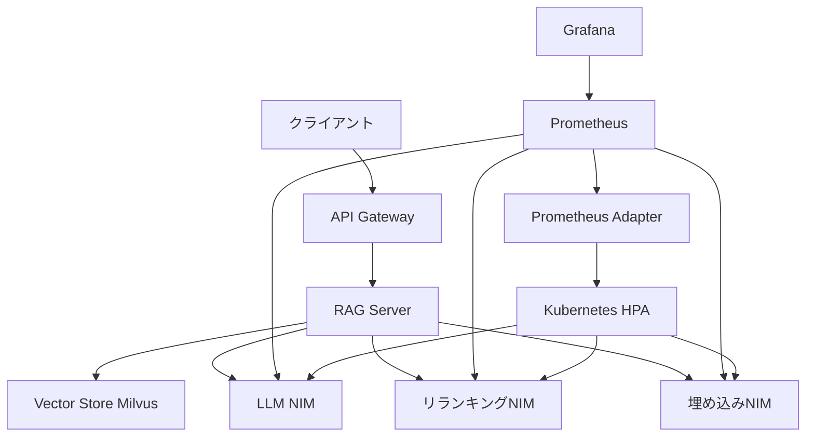

本記事は [Enabling Horizontal Autoscaling of Enterprise RAG Components on Kubernetes](https://developer.nvidia.com/blog/enabling-horizontal-autoscaling-of-enterprise-rag-components-on-kubernetes/)（Juana Nakfour, Anita Tragler, Ruchika Kharwar, 2025年12月12日）の解説記事です。

## ブログ概要（Summary）

本ブログは、NVIDIA RAG Blueprintを基盤として、Kubernetes上でRAGパイプラインの各コンポーネント（LLM推論、リランキング、埋め込み生成）を水平オートスケーリングする方法を解説している。Prometheus + カスタムメトリクス + Kubernetes HPA（Horizontal Pod Autoscaler）を組み合わせ、GPU KVキャッシュ使用率やTTFT（Time to First Token）P90レイテンシなどのRAG固有メトリクスに基づくスケーリングを実現している。同時接続数100〜300の範囲でSLA（TTFT < 2秒）を維持しながら動的にスケールする構成が示されている。

この記事は [Zenn記事: Semantic Kernel v1.41 Plugin設計とVector Store RAGパイプライン構築](https://zenn.dev/0h_n0/articles/5c20849a93d5a5) の深掘りです。Zenn記事ではRAGパイプラインの論理的な設計を扱っているが、本ブログはそのパイプラインを本番環境で大規模に運用するためのインフラストラクチャ設計を提供する。

## 情報源

- **種別**: 企業テックブログ
- **URL**: [https://developer.nvidia.com/blog/enabling-horizontal-autoscaling-of-enterprise-rag-components-on-kubernetes/](https://developer.nvidia.com/blog/enabling-horizontal-autoscaling-of-enterprise-rag-components-on-kubernetes/)
- **組織**: NVIDIA Developer Blog
- **発表日**: 2025年12月12日

## 技術的背景（Technical Background）

エンタープライズRAGシステムを本番運用する場合、トラフィックの変動に応じてリソースを動的に調整する必要がある。RAGパイプラインは複数のGPU集約型マイクロサービス（LLM推論、埋め込み生成、リランキング）で構成されるため、各コンポーネントのボトルネックを独立に検出し、適切にスケールさせる仕組みが必要である。

Kubernetes標準のHPAはCPU/メモリ使用率に基づくスケーリングを提供するが、RAGパイプラインではGPU KVキャッシュ使用率、同時リクエスト数、TTFT（Time to First Token）レイテンシといったドメイン固有のメトリクスが必要となる。本ブログは、Prometheus Adapter経由でこれらのカスタムメトリクスをHPAに供給する構成を解説している。

## 実装アーキテクチャ（Architecture）

### RAG Blueprintの全体構成



### NVIDIA NIMマイクロサービス

NVIDIA RAG Blueprintでは、RAGパイプラインの各段階を独立したNIM（NVIDIA Inference Microservice）として配置する。

| NIM | 役割 | スケーリングメトリクス |
|-----|------|---------------------|
| **Embedding NIM** | クエリ/ドキュメントの埋め込み生成 | GPU使用率 > 75% |
| **Reranking NIM** | 検索結果の再スコアリング | GPU使用率 > 75% |
| **LLM NIM** | 回答生成 | TTFT P90 > 2秒 or 同時リクエスト数 |

各NIMは`/v1/metrics`エンドポイントでPrometheus形式のメトリクスを公開する。

### カスタムメトリクスの定義

ブログで使用されている主要なスケーリングメトリクスは以下の通りである。

**LLM NIMメトリクス**:
- `num_requests_running`: 現在処理中の同時リクエスト数
- `gpu_cache_usage_perc`: GPU KVキャッシュ使用率（0.0〜1.0）
- `time_to_first_token_seconds_bucket`: TTFTのヒストグラム（P90計算用）

**埋め込み/リランキングNIMメトリクス**:
- `gpu_utilization`: GPUプロセッサ使用率（0.0〜1.0）

TTFT P90の計算にはPrometheusの`histogram_quantile`関数を使用する：

$$
\text{TTFT}_{P90} = \text{histogram\_quantile}\left(0.90, \sum \text{rate}(\text{ttft\_seconds\_bucket}[1m]) \text{ by } (le)\right)
$$

### HPAスケーリング設定

ブログに記載されたHPA設定の詳細は以下の通りである。

| コンポーネント | 最小Pod | 最大Pod | スケールアップ条件 | 安定化窓 |
|-------------|---------|---------|-----------------|---------|
| LLM NIM | 1 | 6 | TTFT P90 > 2秒 | 上昇: 60秒、下降: 300秒 |
| Reranking NIM | 1 | 3 | GPU使用率 > 75% | 上昇: 60秒、下降: 300秒 |
| Embedding NIM | 1 | 3 | GPU使用率 > 75% | 上昇: 60秒、下降: 300秒 |

スケールアップ時は30秒で最大100%増加、スケールダウン時は120秒で最大50%減少の制約が設定されている。

## パフォーマンス最適化（Performance）

### 負荷テストの結果

ブログでは、GenAI-Perfツールを使用して同時接続数50〜300の範囲で負荷テストを実施した結果が報告されている。

| 同時接続数 | LLM Pod数 | Reranking Pod数 | Embedding Pod数 | TTFT P90 |
|-----------|-----------|-----------------|-----------------|----------|
| 50 | 1 | 1 | 1 | < 1秒 |
| 100 | 1 | 1 | 1 | < 2秒 |
| 150 | 2 | 1 | 1 | < 2秒 |
| 200 | 4 | 2 | 1 | < 2秒 |
| 300 | 6 | 3 | 2 | < 2秒 |

著者らの報告によると、同時接続数100の時点ではLLM NIM 1 Podで十分であるが、150に達すると2つ目のLLM Podがトリガーされる。同時接続数200では4つのLLM Podと2つのReranking Podが稼働し、最大構成の300でもSLA（TTFT < 2秒）を維持している。

### ボトルネック分析

RAGパイプラインのボトルネックは以下の順序で発生する傾向にある：

1. **LLM推論**（最初にスケールアウト）: GPU KVキャッシュが飽和するとTTFTが急激に増加
2. **リランキング**（次にスケールアウト）: クロスエンコーダーの計算量がGPU使用率を押し上げ
3. **埋め込み生成**（最後にスケールアウト）: 比較的軽量であり、高トラフィックでもスケールが遅い

**インフラ最適化のポイント**:
- ブロックストレージ（Longhorn, Rook Ceph）の使用がNFSベースと比較してNIMコンテナの起動時間を短縮する
- Milvus Vector StoreのGPU CAGRA インデックング（NVIDIA cuVS経由）がデータ取り込みフェーズのボトルネックを軽減する

## 運用での学び（Production Lessons）

### スケーリング戦略の設計原則

ブログの内容から読み取れるスケーリング設計の原則は以下の通りである。

1. **レイテンシベースのスケーリング（LLM）**: CPU/GPU使用率ではなくTTFT P90をメトリクスとする。GPU使用率が低くてもKVキャッシュが飽和していればレイテンシが劣化するため
2. **使用率ベースのスケーリング（Reranking/Embedding）**: 比較的均一なワークロードのため、GPU使用率75%を閾値とするシンプルなスケーリングで十分
3. **非対称な安定化窓**: スケールアップは素早く（60秒）、スケールダウンは慎重に（300秒）。これにより、一時的なトラフィック増に対する過剰なスケールダウンを防止する

### Prometheus設定の要点

ブログでは30秒のスクレイプ間隔を推奨している。スクレイプ間隔が長すぎるとスケーリング判断が遅れ、短すぎるとPrometheusのストレージ負荷が増大する。

```yaml
# ServiceMonitor設定の例
apiVersion: monitoring.coreos.com/v1
kind: ServiceMonitor
metadata:
  name: llm-nim-monitor
spec:
  selector:
    matchLabels:
      app: llm-nim
  endpoints:
    - port: metrics
      interval: 30s
      path: /v1/metrics
```

## 学術研究との関連（Academic Connection）

本ブログの技術的アプローチは、以下の研究成果を実運用に適用したものと位置づけられる。

- **RAGパイプラインのモジュール分解**: Wang et al.（2024, arXiv:2407.01219）が提唱する6モジュール構成を、独立にスケーリング可能なマイクロサービスとして実装
- **KVキャッシュ管理**: vLLMやTensorRT-LLMで研究されているPagedAttentionのKVキャッシュ戦略を、スケーリングメトリクスとして活用
- **リランキングの計算コスト**: Wang et al.が指摘するリランキングのボトルネック問題を、独立したNIMとしてスケーリングすることで対処

## Production Deployment Guide

### AWS実装パターン（コスト最適化重視）

NVIDIA RAG Blueprint相当のスケーラブルRAGパイプラインをAWSで構築する場合の構成を示す。

**トラフィック量別の推奨構成**:

| 規模 | 同時接続数 | 推奨構成 | 月額コスト | 主要サービス |
|------|-----------|---------|-----------|------------|
| **Small** | ~50 | Serverless + Bedrock | $200-500 | Lambda + Bedrock + OpenSearch |
| **Medium** | ~200 | EKS + GPU | $3,000-6,000 | EKS + g5.xlarge × 2-4 + OpenSearch |
| **Large** | 300+ | EKS + Multi-GPU | $8,000-15,000 | EKS + g5.2xlarge × 4-8 + Milvus |

**Medium構成の詳細**（月額$3,000-6,000）:
- **EKS**: コントロールプレーン（$72/月）
- **g5.xlarge Spot**: LLM推論 × 2-4台（$800-1,600/月、Spot 70%割引時）
- **g5.xlarge On-Demand**: リランキング × 1-2台（$600-1,200/月）
- **OpenSearch**: r6g.large × 2ノード（$300/月）
- **Bedrock**: 埋め込み生成（$200/月）
- **Prometheus + Grafana**: モニタリングスタック（$100/月）

**Large構成の詳細**（月額$8,000-15,000）:
- **EKS + Karpenter**: 自動スケーリング（$72/月 + ノードコスト）
- **g5.2xlarge Spot**: LLM推論 × 4-8台（$3,000-6,000/月）
- **g5.xlarge Spot**: リランキング × 2-4台（$800-1,600/月）
- **g5.xlarge Spot**: 埋め込み × 1-2台（$400-800/月）
- **Milvus on EKS**: GPU CAGRAインデックス対応（$500-1,000/月）
- **Prometheus + Grafana + X-Ray**: 監視スタック（$200/月）

**コスト削減テクニック**:
- GPU Spot Instances: g5.xlarge Spotで最大70%割引（Karpenter自動管理）
- 夜間スケールダウン: CronHPA（K8s）で営業時間外はmin replicasを0に
- リランキング最適化: GPU使用率ベースのスケーリングで過剰プロビジョニング回避
- 埋め込みキャッシュ: 重複クエリのGPU計算を回避

**コスト試算の注意事項**: 上記は2026年3月時点のAWS ap-northeast-1（東京）リージョン料金に基づく概算値です。GPU Spot Instancesの価格はリージョン・時間帯により変動します（最大90%割引、平均70%割引）。最新料金は [AWS料金計算ツール](https://calculator.aws/) で確認してください。

### Terraformインフラコード

**Medium構成: EKS + GPU Nodes + Karpenter**

```hcl
module "eks" {
  source          = "terraform-aws-modules/eks/aws"
  version         = "~> 20.0"
  cluster_name    = "rag-autoscale-cluster"
  cluster_version = "1.31"
  vpc_id          = module.vpc.vpc_id
  subnet_ids      = module.vpc.private_subnets
  enable_cluster_creator_admin_permissions = true
}

# --- Karpenter: LLM推論用GPU Provisioner ---
resource "kubectl_manifest" "karpenter_llm" {
  yaml_body = <<-YAML
    apiVersion: karpenter.sh/v1alpha5
    kind: Provisioner
    metadata:
      name: llm-inference-gpu
    spec:
      requirements:
        - key: karpenter.sh/capacity-type
          operator: In
          values: ["spot", "on-demand"]
        - key: node.kubernetes.io/instance-type
          operator: In
          values: ["g5.xlarge", "g5.2xlarge"]
      limits:
        resources:
          nvidia.com/gpu: "8"
      ttlSecondsAfterEmpty: 120
      weight: 10
  YAML
}

# --- Prometheus Stack (Helm) ---
resource "helm_release" "prometheus" {
  name       = "prometheus"
  repository = "https://prometheus-community.github.io/helm-charts"
  chart      = "kube-prometheus-stack"
  namespace  = "monitoring"

  set {
    name  = "prometheus.prometheusSpec.scrapeInterval"
    value = "30s"
  }
}

# --- Prometheus Adapter (カスタムメトリクス) ---
resource "helm_release" "prometheus_adapter" {
  name       = "prometheus-adapter"
  repository = "https://prometheus-community.github.io/helm-charts"
  chart      = "prometheus-adapter"
  namespace  = "monitoring"

  values = [<<-YAML
    rules:
      custom:
        - seriesQuery: 'time_to_first_token_seconds_bucket{namespace="rag"}'
          resources:
            overrides:
              namespace: {resource: "namespace"}
              pod: {resource: "pod"}
          name:
            matches: "^(.*)_bucket$"
            as: "ttft_p90"
          metricsQuery: 'histogram_quantile(0.90, sum(rate(<<.Series>>[1m])) by (le, <<.GroupBy>>))'
        - seriesQuery: 'gpu_utilization{namespace="rag"}'
          resources:
            overrides:
              namespace: {resource: "namespace"}
              pod: {resource: "pod"}
          name:
            as: "gpu_utilization"
          metricsQuery: 'avg(<<.Series>>{<<.LabelMatchers>>}) by (<<.GroupBy>>)'
  YAML
  ]
}

# --- HPA: LLM NIM (TTFT P90ベース) ---
resource "kubectl_manifest" "hpa_llm" {
  yaml_body = <<-YAML
    apiVersion: autoscaling/v2
    kind: HorizontalPodAutoscaler
    metadata:
      name: llm-nim-hpa
      namespace: rag
    spec:
      scaleTargetRef:
        apiVersion: apps/v1
        kind: Deployment
        name: llm-nim
      minReplicas: 1
      maxReplicas: 6
      metrics:
        - type: Pods
          pods:
            metric:
              name: ttft_p90
            target:
              type: AverageValue
              averageValue: "2"
      behavior:
        scaleUp:
          stabilizationWindowSeconds: 60
          policies:
            - type: Percent
              value: 100
              periodSeconds: 30
        scaleDown:
          stabilizationWindowSeconds: 300
          policies:
            - type: Percent
              value: 50
              periodSeconds: 120
  YAML
}

# --- HPA: Reranking NIM (GPU使用率ベース) ---
resource "kubectl_manifest" "hpa_reranking" {
  yaml_body = <<-YAML
    apiVersion: autoscaling/v2
    kind: HorizontalPodAutoscaler
    metadata:
      name: reranking-nim-hpa
      namespace: rag
    spec:
      scaleTargetRef:
        apiVersion: apps/v1
        kind: Deployment
        name: reranking-nim
      minReplicas: 1
      maxReplicas: 3
      metrics:
        - type: Pods
          pods:
            metric:
              name: gpu_utilization
            target:
              type: AverageValue
              averageValue: "0.75"
  YAML
}

resource "aws_budgets_budget" "rag_gpu_monthly" {
  name         = "rag-gpu-monthly"
  budget_type  = "COST"
  limit_amount = "6000"
  limit_unit   = "USD"
  time_unit    = "MONTHLY"
  notification {
    comparison_operator        = "GREATER_THAN"
    threshold                  = 80
    threshold_type             = "PERCENTAGE"
    notification_type          = "ACTUAL"
    subscriber_email_addresses = ["ops@example.com"]
  }
}
```

### 運用・監視設定

**Grafanaダッシュボードクエリ**:

```sql
-- LLM NIM: TTFT P90推移
histogram_quantile(0.90, sum(rate(time_to_first_token_seconds_bucket{namespace="rag"}[5m])) by (le))

-- リランキングNIM: GPU使用率推移
avg(gpu_utilization{namespace="rag", app="reranking-nim"}) by (pod)

-- HPA Pod数の推移
kube_horizontalpodautoscaler_status_current_replicas{namespace="rag"}
```

**CloudWatchアラーム（Python）**:

```python
import boto3

cloudwatch = boto3.client('cloudwatch')

cloudwatch.put_metric_alarm(
    AlarmName='rag-gpu-cost-daily',
    ComparisonOperator='GreaterThanThreshold',
    EvaluationPeriods=1,
    MetricName='EstimatedCharges',
    Namespace='AWS/Billing',
    Period=86400,
    Statistic='Maximum',
    Threshold=300,
    AlarmDescription='RAG GPU日次コストが$300を超過',
    AlarmActions=['arn:aws:sns:ap-northeast-1:123456789:gpu-cost-alerts'],
)
```

### コスト最適化チェックリスト

**GPUリソース管理**:
- [ ] LLM推論: Spot Instances優先（最大70%削減）
- [ ] Karpenter: Spot + On-Demand混合（Spot中断時のフォールバック）
- [ ] 夜間スケールダウン: CronHPAでmin replicas = 0
- [ ] GPUインスタンスタイプ: g5.xlarge（24GB VRAM）で十分か評価

**スケーリング最適化**:
- [ ] TTFT P90ベースのスケーリング（GPU使用率ではなく）
- [ ] スケールダウン安定化窓: 300秒以上（過剰スケールダウン防止）
- [ ] Pod起動時間の最適化: ブロックストレージ使用、イメージプリキャッシュ
- [ ] 埋め込みキャッシュ: Redis/ElastiCacheで重複計算回避

**監視・アラート**:
- [ ] Prometheus + Grafana: RAG固有メトリクスの可視化
- [ ] Prometheus Adapter: カスタムメトリクスのHPA連携
- [ ] AWS Budgets: GPU月額予算設定（80%で警告）
- [ ] 日次GPUコストレポート

**インフラ基盤**:
- [ ] EKS: 最新安定版K8s（1.31以上）
- [ ] ブロックストレージ: NFS→Longhorn/Rook Cephで起動時間改善
- [ ] Vector Store: Milvus GPU CAGRAインデックスで取り込み高速化
- [ ] ネットワーク: Pod間通信はプライベートサブネット内に制限

## まとめと実践への示唆

NVIDIA RAG Blueprintに基づくKubernetes上のRAGパイプラインスケーリングは、LLM・リランキング・埋め込みの各NIMを独立にスケールさせる設計が有効である。特にLLM推論においては、GPU使用率ではなくTTFT P90をスケーリングメトリクスとする点が従来のWebサービスと異なる。

Semantic Kernelで構築したRAGパイプラインを本番環境にデプロイする際、Vector Store検索やリランキングの負荷増大に対して個別にスケーリングポリシーを設定できる。ブログの報告によると、同時接続数100→300のスケールアウトにおいてSLA（TTFT < 2秒）を維持しながら、最大6 LLM Podまでの自動スケーリングが確認されている。

## 参考文献

- **Blog URL**: [https://developer.nvidia.com/blog/enabling-horizontal-autoscaling-of-enterprise-rag-components-on-kubernetes/](https://developer.nvidia.com/blog/enabling-horizontal-autoscaling-of-enterprise-rag-components-on-kubernetes/)
- **NVIDIA RAG Blueprint**: [https://developer.nvidia.com/blog/tag/retrieval-augmented-generation-rag/](https://developer.nvidia.com/blog/tag/retrieval-augmented-generation-rag/)
- **Related Zenn article**: [https://zenn.dev/0h_n0/articles/5c20849a93d5a5](https://zenn.dev/0h_n0/articles/5c20849a93d5a5)
