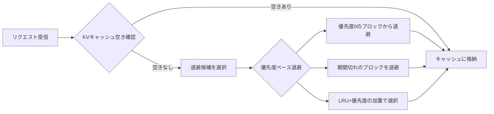
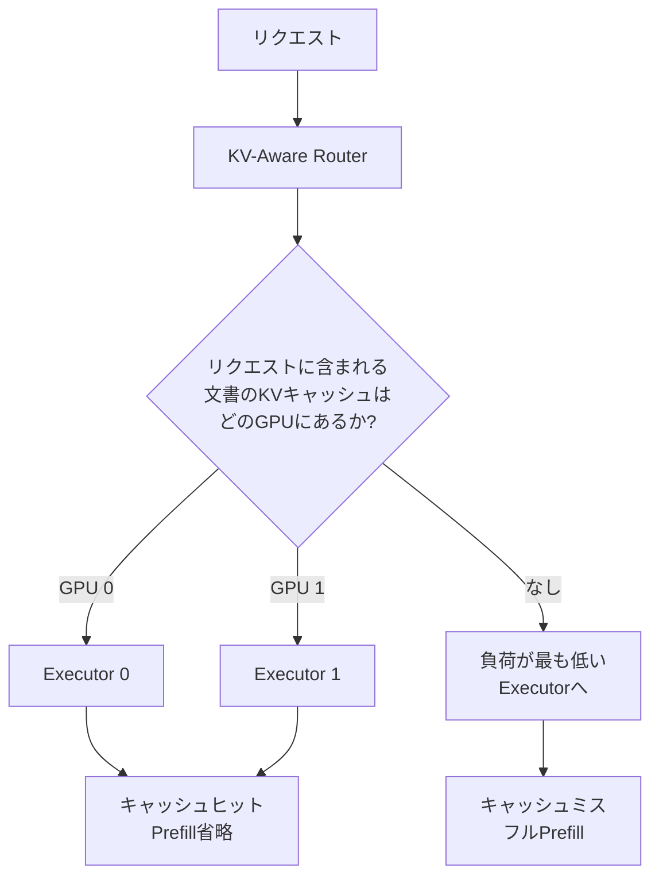

本記事は [Introducing New KV Cache Reuse Optimizations in NVIDIA TensorRT-LLM](https://developer.nvidia.com/blog/introducing-new-kv-cache-reuse-optimizations-in-nvidia-tensorrt-llm/) の解説記事です。

## ブログ概要（Summary）

NVIDIAは2025年1月、TensorRT-LLMにおけるKVキャッシュ再利用の新しい最適化機能を発表した。従来のLRU（Least Recently Used）ベースのキャッシュ退避に加え、**優先度ベースのKVキャッシュ退避**と**KVキャッシュイベントAPI**を導入し、ドメイン固有のワークロード知識を活用したキャッシュ管理を可能にした。NVIDIAの報告によると、優先度ベースの退避によりキャッシュヒット率が約20%向上する。

この記事は [Zenn記事: Gemini 2.0 Flash×コンテキストキャッシュで社内検索のコストとレイテンシを削減する実装手法](https://zenn.dev/0h_n0/articles/81e707a2ab8751) の深掘りです。

## 情報源

- **種別**: 企業テックブログ
- **URL**: [https://developer.nvidia.com/blog/introducing-new-kv-cache-reuse-optimizations-in-nvidia-tensorrt-llm/](https://developer.nvidia.com/blog/introducing-new-kv-cache-reuse-optimizations-in-nvidia-tensorrt-llm/)
- **組織**: NVIDIA（Deep Learning Algorithms チーム）
- **著者**: John Thomson, Anjali Shah, Laikh Tewari
- **発表日**: 2025年1月16日

## 技術的背景（Technical Background）

### KVキャッシュの役割と課題

大規模言語モデルの推論では、Transformerの各層でAttention計算に使用するKey（K）とValue（V）のペアをキャッシュ（KVキャッシュ）として保持する。Auto-Regressiveなトークン生成では、新しいトークンを生成するたびに過去のすべてのK/V値が必要となるため、KVキャッシュは推論メモリの主要な消費源となる。

KVキャッシュのメモリ消費量は以下の式で概算される：

$$
\text{KV Cache Size} = 2 \times L \times n \times d_k \times b \times p
$$

ここで、
- $L$: Transformerの層数
- $n$: 系列長（トークン数）
- $d_k$: Attentionヘッドの次元数
- $b$: バッチサイズ
- $p$: データ精度のバイト数（FP16なら2、INT8なら1）
- 2: KeyとValueの2つ

例えば、70Bパラメータモデル（$L=80, d_k=128, \text{heads}=64$）で系列長4096のKVキャッシュは、FP16で約5GBとなる。100万トークンの長文脈（Gemini 1.5規模）では、この消費量はGPUメモリの大半を占める。

### なぜLRUだけでは不十分か

従来のKVキャッシュ管理はLRU方式が主流であった。メモリが不足すると最も古くアクセスされたキャッシュから退避（または破棄）する。しかし、LLM推論のワークロードでは以下の問題がある：

1. **システムプロンプトの価値**: 長いシステムプロンプト（ツール定義、Few-Shot例など）は、すべてのリクエストで共通であり、退避すると再計算コストが大きい
2. **ワークロード特性の無視**: LRUは時間的局所性のみに基づき、ビジネス上の優先度（重要なリクエストのキャッシュを優先）を考慮しない
3. **マルチターン会話**: 長い会話履歴のキャッシュは直近のやり取りに比べて使用頻度が低いが、文脈維持に重要

## 実装アーキテクチャ（Architecture）

### 優先度ベースKVキャッシュ退避

NVIDIAが導入した優先度ベースの退避は、**トークン範囲に優先度レベル（0-100）と保持期間を設定**できる機構である。



#### TokenRangeRetentionConfig

```python
from tensorrt_llm import KvCacheRetentionConfig, TokenRangeRetentionConfig


def configure_cache_priorities(
    system_prompt_length: int = 1000,
    faq_doc_start: int = 1000,
    faq_doc_end: int = 5000,
) -> KvCacheRetentionConfig:
    """ワークロードに応じたKVキャッシュ優先度設定

    Args:
        system_prompt_length: システムプロンプトのトークン数
        faq_doc_start: FAQ文書の開始トークン位置
        faq_doc_end: FAQ文書の終了トークン位置

    Returns:
        KVキャッシュの保持設定
    """
    return KvCacheRetentionConfig(
        token_ranges=[
            # システムプロンプト: 最高優先度、期間無制限
            TokenRangeRetentionConfig(
                start=0,
                end=system_prompt_length,
                priority=100,
                duration=None,  # 無期限保持
            ),
            # FAQ文書: 高優先度、1時間保持
            TokenRangeRetentionConfig(
                start=faq_doc_start,
                end=faq_doc_end,
                priority=80,
                duration=3600,  # 1時間
            ),
            # ユーザークエリ部分: 通常優先度
            TokenRangeRetentionConfig(
                start=faq_doc_end,
                end=None,  # 末尾まで
                priority=30,
                duration=300,  # 5分
            ),
        ]
    )
```

**NVIDIAの報告によると**、この優先度ベースの退避により、社内検索のようなシステムプロンプトが共通するワークロードでキャッシュヒット率が約20%向上する。

### KVキャッシュイベントAPI

KVキャッシュイベントAPIは、キャッシュの状態変化をリアルタイムに観測できる機構である。以下の4種類のイベントが発行される：

| イベント | 発生タイミング | 主な用途 |
|---------|-------------|---------|
| **CreatedData** | 新しいKVブロックが計算された時 | キャッシュ生成の監視 |
| **StoredData** | KVブロックがキャッシュに格納された時 | 格納成功の確認 |
| **RemovedData** | KVブロックが退避・削除された時 | キャッシュミスの検知 |
| **UpdatedData** | 既存ブロックの優先度が更新された時 | 優先度変更の追跡 |

```python
from tensorrt_llm import KvCacheConfig


def setup_cache_monitoring(
    buffer_size: int = 16384,
) -> KvCacheConfig:
    """KVキャッシュイベント監視の設定

    Args:
        buffer_size: イベントバッファの最大サイズ

    Returns:
        KVキャッシュ設定
    """
    config = KvCacheConfig(
        event_buffer_max_size=buffer_size,
    )
    return config


def process_cache_events(event_manager) -> dict:
    """キャッシュイベントを処理し、メトリクスを計算

    Args:
        event_manager: TensorRT-LLMのイベントマネージャ

    Returns:
        キャッシュメトリクスの辞書
    """
    events = event_manager.getLatestEvents()

    metrics = {
        "created": 0,
        "stored": 0,
        "removed": 0,
        "updated": 0,
        "hit_rate": 0.0,
    }

    for event in events:
        if hasattr(event, "created_data"):
            metrics["created"] += 1
        elif hasattr(event, "stored_data"):
            metrics["stored"] += 1
        elif hasattr(event, "removed_data"):
            metrics["removed"] += 1
        elif hasattr(event, "updated_data"):
            metrics["updated"] += 1

    total = metrics["stored"] + metrics["removed"]
    if total > 0:
        metrics["hit_rate"] = metrics["stored"] / total

    return metrics
```

### 分散推論環境でのKV-Aware Routing

マルチGPU環境では、KVキャッシュイベントAPIを使用してキャッシュの分布を把握し、**KV-Awareなリクエストルーティング**を実現できる。特定のGPUに特定文書のKVキャッシュが存在する場合、そのGPUにリクエストをルーティングすることでキャッシュヒット率を最大化する。



## パフォーマンス最適化（Performance）

### TensorRT-LLMのKVキャッシュ最適化スタック

TensorRT-LLMは以下の複数のKVキャッシュ最適化を組み合わせて提供している：

| 最適化手法 | 効果 | 併用可否 |
|-----------|------|---------|
| **PagedKVCache** | メモリ断片化の削減 | 基盤（常時有効） |
| **Quantized KV Cache** (INT8/FP8) | メモリ使用量50%削減 | ✅ 併用可 |
| **Priority-based Eviction** | ヒット率20%向上 | ✅ 併用可 |
| **KV Cache Event API** | 分散ルーティング最適化 | ✅ 併用可 |
| **Circular Buffer KV Cache** | Sliding Window Attentionでのメモリ固定 | 条件付き |

NVIDIAの報告によると、INT8量子化とPagedKVCacheを組み合わせた場合、FP16比で**KVキャッシュメモリが50%削減**され、同じGPUメモリでバッチサイズを2倍にできる。

### Zenn記事のコンテキストキャッシュとの関連

Zenn記事で紹介されているVertex AIのコンテキストキャッシュと、TensorRT-LLMのKVキャッシュ最適化は、異なるレイヤーで動作する相補的な技術である。

| 観点 | Vertex AI コンテキストキャッシュ | TensorRT-LLM KVキャッシュ |
|------|-------------------------------|--------------------------|
| 適用レイヤー | クラウドAPI（マネージド） | 推論エンジン（セルフホスト） |
| 制御粒度 | プロンプト全体 | トークン範囲単位 |
| カスタマイズ性 | TTLのみ | 優先度・期間・ルーティング |
| 運用コスト | 低（マネージド） | 高（GPU管理が必要） |
| 対象モデル | Geminiのみ | 任意のLLM |

セルフホスト環境でオープンソースLLMを運用する場合、TensorRT-LLMのKVキャッシュ最適化は必須の技術である。

## Production Deployment Guide

### AWS実装パターン（コスト最適化重視）

TensorRT-LLMを本番環境にデプロイする場合の推奨構成。

**トラフィック量別の推奨構成**:

| 規模 | 月間リクエスト | 推奨構成 | 月額コスト目安 | 主要サービス |
|------|--------------|---------|--------------|------------|
| **Small** | ~3,000 (100/日) | Single GPU | $700-1,200 | EC2 g5.xlarge + TensorRT-LLM |
| **Medium** | ~30,000 (1,000/日) | Multi-GPU | $2,500-5,000 | ECS + g5.2xlarge × 2 |
| **Large** | 300,000+ (10,000/日) | GPU Cluster | $8,000-20,000 | EKS + Karpenter + g5 Spot |

**コスト削減テクニック**:
- Spot Instances（g5系）で最大70%削減、Karpenterで自動管理
- INT8 KVキャッシュ量子化でGPUメモリ効率を2倍に改善、バッチサイズ拡大でスループット向上
- 優先度ベース退避で同じGPUメモリでキャッシュヒット率20%向上

**コスト試算の注意事項**:
- 上記は2026年3月時点のAWS ap-northeast-1（東京）リージョン料金に基づく概算値です
- GPU インスタンスの料金はリージョンにより変動します
- 最新料金は [AWS料金計算ツール](https://calculator.aws/) で確認してください

### Terraformインフラコード

```hcl
# --- EC2 GPU インスタンス（TensorRT-LLM用） ---
resource "aws_instance" "tensorrt_server" {
  ami           = "ami-xxxxxxxxx"  # NVIDIA GPU-Optimized AMI
  instance_type = "g5.xlarge"

  subnet_id              = module.vpc.private_subnets[0]
  vpc_security_group_ids = [aws_security_group.tensorrt_sg.id]

  root_block_device {
    volume_size = 200   # モデル + KVキャッシュストレージ
    volume_type = "gp3"
    iops        = 6000  # KVキャッシュの読み書き高速化
    encrypted   = true
  }

  user_data = <<-EOF
    #!/bin/bash
    # TensorRT-LLMセットアップ
    pip install tensorrt-llm
    # 優先度ベースKVキャッシュの設定
    python3 -c "
    from tensorrt_llm import LLM, KvCacheConfig
    config = KvCacheConfig(
        event_buffer_max_size=16384,
        enable_block_reuse=True,
    )
    "
  EOF
}

# --- CloudWatch カスタムメトリクス ---
resource "aws_cloudwatch_metric_alarm" "cache_hit_rate" {
  alarm_name          = "tensorrt-cache-hit-low"
  comparison_operator = "LessThanThreshold"
  evaluation_periods  = 3
  metric_name         = "KVCacheHitRate"
  namespace           = "Custom/TensorRT"
  period              = 300
  statistic           = "Average"
  threshold           = 0.5  # ヒット率50%未満でアラート
  alarm_description   = "KVキャッシュヒット率低下（優先度設定の見直し推奨）"
}
```

### コスト最適化チェックリスト

- [ ] INT8 KVキャッシュ量子化でメモリ効率2倍
- [ ] 優先度ベース退避でシステムプロンプトを最高優先度に設定
- [ ] KVイベントAPIで分散環境のキャッシュ分布を監視
- [ ] Spot Instances（g5系）で最大70%削減
- [ ] gp3 EBSのIOPS最適化でKVキャッシュI/O高速化
- [ ] CloudWatchカスタムメトリクスでキャッシュヒット率を監視

## 運用での学び（Production Lessons）

NVIDIAのブログで示唆されている運用上の知見：

1. **優先度設定のチューニング**: 優先度は静的に設定するだけでなく、ワークロードの変化に応じて動的に調整することが推奨される。キャッシュイベントAPIのメトリクスを分析し、退避されやすいが再計算コストの高いブロックの優先度を引き上げる
2. **分散環境でのイベント整合性**: KVキャッシュイベントは「結果整合性（Eventually Consistent）」であり、複数のExecutor間でリアルタイムな一貫性は保証されない。ルーティング判断は統計的な傾向に基づいて行うべきである
3. **Circular Buffer**: Sliding Window Attentionを使用するモデルでは、Circular Buffer KVキャッシュにより固定メモリで長い系列を処理可能

## 学術研究との関連（Academic Connection）

- **PagedAttention（Kwon et al., 2023）**: vLLMで提案されたKVキャッシュのページング手法。TensorRT-LLMのPagedKVCacheはこの概念を取り入れている
- **CacheBlend（Yao et al., 2024）**: RAGにおけるKVキャッシュ融合手法。TensorRT-LLMの優先度ベース退避と組み合わせることで、さらなる効率化が期待される
- **KIVI（Liu et al., 2024）**: 2bit KVキャッシュ量子化。TensorRT-LLMのINT8量子化よりもさらに積極的な圧縮アプローチ

## まとめと実践への示唆

TensorRT-LLMの優先度ベースKVキャッシュ退避とイベントAPIは、LLM推論のキャッシュ管理をワークロードに適応させるための実践的な機能である。NVIDIAの報告によれば、キャッシュヒット率約20%向上という定量的な改善が得られ、社内検索のような反復的なワークロードで特に効果が大きい。

Zenn記事で紹介されているVertex AIのマネージドコンテキストキャッシュとは異なるレイヤーの最適化であるが、セルフホスト環境でオープンソースLLMを運用する場合には不可欠な技術である。

## 参考文献

- **Blog URL**: [https://developer.nvidia.com/blog/introducing-new-kv-cache-reuse-optimizations-in-nvidia-tensorrt-llm/](https://developer.nvidia.com/blog/introducing-new-kv-cache-reuse-optimizations-in-nvidia-tensorrt-llm/)
- **TensorRT-LLM GitHub**: [https://github.com/NVIDIA/TensorRT-LLM](https://github.com/NVIDIA/TensorRT-LLM)
- **Related Zenn article**: [https://zenn.dev/0h_n0/articles/81e707a2ab8751](https://zenn.dev/0h_n0/articles/81e707a2ab8751)

---

:::message
この記事はAI（Claude Code）により自動生成されました。ブログの内容を正確に伝えることを心がけていますが、解釈の誤りがある可能性があります。正確な情報は原記事をご確認ください。
:::
