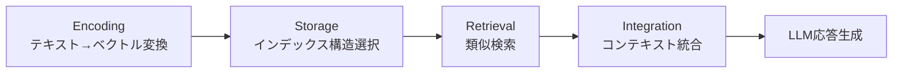

本記事は [Redis公式ブログ: AI agent memory: types, architecture & implementation](https://redis.io/blog/ai-agent-memory-stateful-systems/)（Jim Allen Wallace, 2026年2月3日）の解説記事です。

## ブログ概要（Summary）

LLMは本質的にステートレスであり、リクエスト間で情報を保持しない。本番のAIエージェントを構築するには、短期メモリ（セッション内コンテキスト）と長期メモリ（セッション横断の知識）を組み合わせたメモリインフラが不可欠である。Redis公式ブログでは、Redisをこの両方のメモリ層として統一的に使用するアーキテクチャを解説している。

この記事は [Zenn記事: LLM会話スレッド管理の本番設計 Redis・PostgreSQL・3大APIパターン比較](https://zenn.dev/0h_n0/articles/d741db8cb57195) の深掘りです。

## 情報源

- **種別**: 企業テックブログ
- **URL**: [https://redis.io/blog/ai-agent-memory-stateful-systems/](https://redis.io/blog/ai-agent-memory-stateful-systems/)
- **組織**: Redis Inc.
- **著者**: Jim Allen Wallace
- **発表日**: 2026年2月3日

## 技術的背景（Technical Background）

LLMはステートレスなAPIとして設計されており、会話のコンテキストを自律的に保持する機能を持たない。Zenn記事で解説したOpenAI Responses APIの手動管理パターンやAnthropic Messages APIのステートレス設計がこれに該当する。

Redis公式ブログでは、この制約を解決するために、AIエージェントのメモリを**認知科学に基づく5つのカテゴリ**に分類している。

### メモリタイプの分類

| メモリタイプ | 目的 | 永続性 | ストレージ例 |
|------------|------|--------|------------|
| **短期メモリ** | セッション内のコンテキスト維持 | セッション終了で消滅 | Redis In-Memory |
| **長期メモリ** | セッション横断の知識蓄積 | 無期限 | Redis + ベクトルDB |
| **エピソード記憶** | 過去の具体的な体験の記録 | 無期限 | ベクトルDB + イベントログ |
| **意味記憶** | 事実的知識（体験に依存しない） | 無期限 | 構造化DB + ベクトルDB |
| **手続き記憶** | タスク実行方法の記録 | 無期限 | ワークフローDB + ベクトルDB |

ブログではこのうち**短期メモリと長期メモリの2層構成**が本番システムの最小構成として推奨されている。これはZenn記事で解説したRedis（短期）+ PostgreSQL（長期）のハイブリッド構成と同じ設計思想に基づいている。

## 実装アーキテクチャ（Architecture）

### 4段階のメモリパイプライン

Redis公式ブログでは、エージェントメモリを**Encoding → Storage → Retrieval → Integration**の4段階パイプラインとして設計することを推奨している。



### Stage 1: Encoding（エンコーディング）

テキストデータをTransformerモデルでベクトル埋め込みに変換する段階。ブログでは以下の点を強調している。

- データをチャンクに分割してからエンコードする
- チャンク戦略が検索品質を左右する（不適切なチャンキング → 低品質な埋め込み → 低品質な検索結果）
- 各チャンクに対してベクトル埋め込みを生成し、数学的な類似度計算を可能にする

### Stage 2: Storage（ストレージ）

ベクトルインデックスの選択が性能を決定する。ブログでは3つのインデックスアルゴリズムを比較している。

| アルゴリズム | 方式 | 精度 | メモリ効率 | 適用規模 |
|------------|------|------|----------|---------|
| **HNSW** | グラフベース近似検索 | >95%（チューニング依存） | 低（IVFの数倍） | 小〜中規模 |
| **IVF** | クラスタベース近似検索 | >95%（設定依存） | 高 | 大規模（数億〜数十億） |
| **FLAT** | 全探索（ブルートフォース） | 100% | 最低 | 小規模のみ |

ブログでは「精度が重要な小〜中規模データセットにはHNSW、数億ベクトル以上のスケールではIVFを推奨」としている。

### Stage 3: Retrieval（検索）

近似k近傍探索（k-NN）により、クエリベクトルに最も類似するk件を取得する。ブログでは「精度とスピードのトレードオフ」を強調しており、ミリ秒単位の応答が可能であるとしている。

### Stage 4: Integration（統合）

検索されたコンテキストをフォーマットし、LLMの入力に統合する。ブログではActive RAGパターン（モデルと検索システムがリアルタイムでクエリを反復的に改善する方式）を紹介している。

## Redisが提供する統一プラットフォームの利点

ブログの主張の核心は、**Redisが短期メモリと長期メモリの両方を単一プラットフォームで提供できる**点にある。

### 従来の構成の問題点

```
短期メモリ: Redis (セッションストア)
長期メモリ: Pinecone (ベクトルDB)
キャッシュ: Memcached
操作DB: PostgreSQL
```

ブログではこの「4システム構成」の運用負荷（APIの統一性、障害モードの管理、課金の複雑さ）を問題視している。

### Redis統合構成

```
短期メモリ: Redis In-Memory (サブミリ秒)
長期メモリ: Redis Vector Library (ベクトル検索)
イベントログ: Redis Streams
Pub/Sub: Redis Pub/Sub (マルチエージェント協調)
```

**性能特性**:
- **状態ルックアップ**: マイクロ秒レイテンシ
- **ベクトルクエリ**: 低ミリ秒レンジ（ワークロード・インデックス設定依存）

### Redis Agent Memory Server

ブログではRedis Agent Memory Serverを紹介しており、デュアルティアアーキテクチャを提供している。短期メモリはインメモリデータ構造で即座にアクセスし、長期メモリはベクトル検索でセマンティック検索を行う。

## LangGraph・LangChainとの統合

ブログでは以下のフレームワーク統合パターンを紹介している。

```python
from langgraph.checkpoint.redis import RedisSaver

# RedisをLangGraphのチェックポインターとして使用
checkpointer = RedisSaver(redis_url="redis://localhost:6379")

# thread_idベースの会話永続化
config = {"configurable": {"thread_id": "user_123"}}
```

Zenn記事ではLangGraphのPostgresSaverを使った永続化を解説しているが、Redis公式ブログではRedisSaverを推奨している。レイテンシ要件が厳しいリアルタイム会話（音声AIエージェント等）ではRedis、監査・分析が必要な場面ではPostgreSQLという使い分けが現実的である。

### マルチエージェント協調

Redis Pub/SubとStreamsを使ったマルチエージェント間の状態共有パターンも紹介されている。Redis Streamsはイミュータブルな監査証跡として機能し、エピソード記憶のストレージとして利用できる。Active-Active Geo Distributionにより、マルチリージョンデプロイメントでのエージェント状態の同期も可能であるとしている。

## Zenn記事のアーキテクチャとの比較

Zenn記事ではRedis + PostgreSQLのハイブリッド構成を推奨しているが、Redis公式ブログはRedis単体での統合を主張している。以下に両アプローチの比較を整理する。

| 観点 | Redis単体構成 | Redis + PostgreSQL構成 |
|------|-------------|----------------------|
| **レイテンシ** | 全操作でサブミリ秒 | Redis層はサブミリ秒、PG層は数ms |
| **永続性** | Redis AOF/RDB（インメモリ起点） | PostgreSQLが正（ACID保証） |
| **検索** | ベクトル検索 + フルテキスト | ベクトル検索（Redis） + SQL分析（PG） |
| **監査** | Redis Streams | PostgreSQL + CloudTrail |
| **コスト** | 全データがメモリ上（GB単価高） | ホットデータのみRedis（コスト効率○） |
| **運用複雑性** | 単一システム | 2システムの管理 |

**実務的な判断基準**: 会話データが数GB以下でSQLベースの分析が不要な場合はRedis単体が合理的である。一方、テナント数が多くデータ量が大きい場合、またはコンプライアンス要件でRDBMSが必要な場合は、Redis + PostgreSQLのハイブリッド構成が推奨される。

### Redis 8.4のネイティブベクトル検索

ブログでは2026年リリースのRedis 8.4について言及しており、ネイティブベクトル検索のサポートにより、外部のベクトルDBを使わずにRedis内で完結するセマンティック検索が可能になるとしている。これにより、長期メモリの検索もRedis単体でカバーできる領域が拡大する。

## パフォーマンス最適化（Performance）

### レイテンシ要件

ブログでは音声AIエージェントの例を挙げ、エンドツーエンドのレスポンスタイムが1秒以内である必要があるとしている。パイプライン全体（音声認識 → メモリ検索 → LLM推論 → 音声合成）がこの時間枠に収まる必要があり、メモリ検索にサブミリ秒のレイテンシが求められる。

マルチステップのエージェントワークフローでは、各ステップのレイテンシが累積する。ブログでは「100msのレイテンシが10ステップで1秒になる」と指摘し、インメモリアーキテクチャの重要性を強調している。

### チューニング指針

- **HNSWのefSearchパラメータ**: 値を大きくすると精度が上がるがレイテンシが増加する。ワークロード固有のテストで最適値を決定すべきとしている
- **IVFのnprobeパラメータ**: 検索するクラスタ数。全クラスタの5-10%が一般的な出発点
- **チャンクサイズ**: 小さすぎるとコンテキスト不足、大きすぎるとノイズが増加。ブログでは512-1024トークンを推奨

## 運用での学び（Production Lessons）

### 本番レディネスチェックリスト

ブログでは以下の運用チェックリストを推奨している。

1. **各ステージの独立テスト**: Encoding、Storage、Retrieval、Integrationを個別に品質検証する
2. **パイプライン全体のレイテンシプロファイリング**: ボトルネックの特定
3. **チャンキング戦略の検証**: 検索品質への影響を定量評価
4. **ワークロード固有のインデックスチューニング**: 汎用設定ではなく、実際のクエリパターンに合わせる

### 障害対策

ブログではRedisのインメモリ特性に起因するデータ揮発性について直接言及していないが、Redis Sentinel/Cluster構成による高可用性は前提としている。Zenn記事で解説したPostgreSQLへのバックアップ戦略（セッション終了時にアーカイブ）と組み合わせることで、Redis障害時の復旧パスが確保される。

## マルチテナント環境での考慮事項

Zenn記事ではマルチテナント環境でのThread分離を詳細に解説しているが、Redis公式ブログの文脈では以下の点が追加で重要になる。

**キー設計によるテナント分離**: Redisではキープレフィックスによる論理分離が一般的である。`{tenant_id}:conv:{session_id}` のようなキーパターンで、テナントごとのデータを分離する。ただし、Zenn記事で指摘しているように、クライアント側から受け取るテナントIDの検証は必須である。

**メモリ使用量の監視**: インメモリストレージであるRedisでは、テナントごとのメモリ使用量をモニタリングし、ノイジーネイバー問題を防ぐ必要がある。`MEMORY USAGE`コマンドやRedis Insightsで可視化できる。

**ベクトルインデックスの分離**: 長期メモリのベクトル検索では、テナント間でインデックスを共有するか分離するかの判断が必要になる。共有インデックスではフィルタリングによる分離、専用インデックスではテナントごとのHNSW/IVF構築が選択肢となる。

## 学術研究との関連（Academic Connection）

ブログのメモリタイプ分類（短期・長期・エピソード・意味・手続き）は、認知科学のAtkinson-Shiffrin記憶モデル（1968）に基づいている。AIエージェントのメモリ設計に認知科学のフレームワークを適用する研究としては、以下が関連する。

- **MemGPT**（Packer et al., 2023）: OSのページング機構に着想を得たLLMメモリ管理。メインメモリとセカンダリストレージ間のデータ移動を自動化する
- **Generative Agents**（Park et al., 2023）: 反射・計画・記憶検索の3層エージェントアーキテクチャ。25体のAIエージェントが独立して行動し、記憶を形成する実験で話題となった研究

## 開発者調査データ

Stack Overflow の最近の開発者調査によると、AIエージェントのメモリ・データストレージとしてRedisを使用している開発者は43%にのぼり、ChromaDBやpgvectorなどのベクトルネイティブオプションを上回っている。この数値はRedisがセッション管理・キャッシュとしての実績を持つことに加え、ベクトル検索機能の統合により「メモリ層の統一」が現実的な選択肢になっていることを示唆している。

## まとめと実践への示唆

Redis公式ブログは、AIエージェントのメモリインフラとしてRedisの統一プラットフォームを推奨している。短期メモリ（サブミリ秒のセッション管理）と長期メモリ（ベクトル検索による意味検索）を単一システムで提供できる点が主要なメリットである。ただし、監査・コンプライアンス要件やSQLベースの分析が必要な場面では、Zenn記事で解説したPostgreSQLとの併用が現実的な選択肢となる。実務では「Redis（高速アクセス）+ PostgreSQL（永続化・分析）」のハイブリッド構成が、性能と運用性のバランスで優れている。

## 参考文献

- **Blog URL**: [https://redis.io/blog/ai-agent-memory-stateful-systems/](https://redis.io/blog/ai-agent-memory-stateful-systems/)
- **Redis Agent Memory Server**: [https://redis.github.io/agent-memory-server/](https://redis.github.io/agent-memory-server/)
- **Related Zenn article**: [https://zenn.dev/0h_n0/articles/d741db8cb57195](https://zenn.dev/0h_n0/articles/d741db8cb57195)

---

:::message
本記事はAI（Claude Code）により自動生成されました。内容の正確性については公式ブログもあわせてご確認ください。
:::
