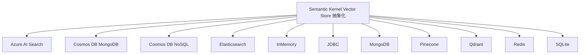
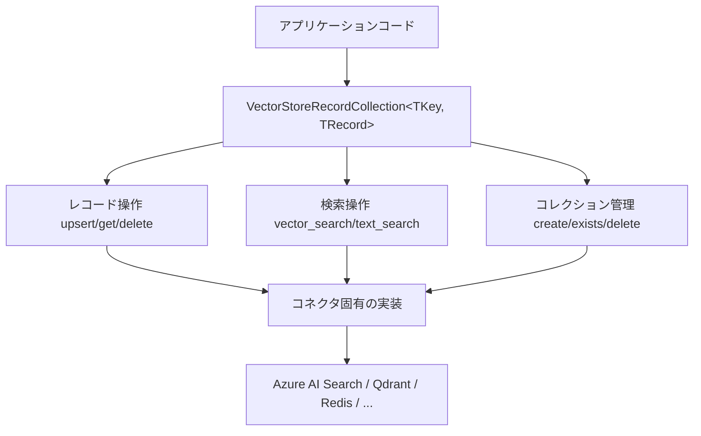

本記事は [Unlocking the Power of Memory: Announcing General Availability of Semantic Kernel's Memory Packages](https://devblogs.microsoft.com/agent-framework/unlocking-the-power-of-memory-announcing-general-availability-of-semantic-kernels-memory-packages/)（Wes Steyn, Eduard van Valkenburg, 2024年11月25日）の解説記事です。

## ブログ概要（Summary）

Microsoftは2024年11月25日、Semantic KernelのMemory Packages（Vector Store抽象化）の一般提供（GA）を発表した。.NET、Java、Pythonの3言語でサポートされ、11のVector Storeコネクタが本番利用可能となった。この発表では、レガシーMemory Store APIとの機能差異、カスタムスキーマ対応、複数ベクトル/レコード対応、メタデータフィルタリング付きベクトル検索など、新しいVector Store抽象化の利点が解説されている。

この記事は [Zenn記事: Semantic Kernel v1.41 Plugin設計とVector Store RAGパイプライン構築](https://zenn.dev/0h_n0/articles/5c20849a93d5a5) の深掘りです。Zenn記事で解説されている`@vectorstoremodel`デコレータ、`create_search_function`、コネクタ選定は、すべてこのGA発表で正式にサポートされた機能に基づいている。

## 情報源

- **種別**: 企業テックブログ
- **URL**: [https://devblogs.microsoft.com/agent-framework/unlocking-the-power-of-memory-announcing-general-availability-of-semantic-kernels-memory-packages/](https://devblogs.microsoft.com/agent-framework/unlocking-the-power-of-memory-announcing-general-availability-of-semantic-kernels-memory-packages/)
- **組織**: Microsoft Semantic Kernel Team
- **発表日**: 2024年11月25日

## 技術的背景（Technical Background）

Semantic Kernelには従来、Memory Store APIというベクトル検索の抽象化レイヤーが存在した。しかし、このレガシーAPIには以下の制約があった。

- 固定スキーマ（テキスト、埋め込み、メタデータの3フィールドのみ）
- 1レコードに1ベクトルのみ
- メタデータによるフィルタリング非対応
- コネクタの種類が限定的

新しいVector Store抽象化は、これらの制約を解消し、本番環境での利用に耐えうる柔軟性とパフォーマンスを提供する。Zenn記事で解説されている`@vectorstoremodel`デコレータによるデータモデル定義は、まさにこの新しい抽象化の中核機能である。

## 実装アーキテクチャ（Architecture）

### 新旧API機能比較

| 機能 | レガシーMemory Store | 新Vector Store抽象化 |
|------|---------------------|---------------------|
| カスタムスキーマ | 不可（固定3フィールド） | 可能（`@vectorstoremodel`） |
| 複数ベクトル/レコード | 不可 | 可能 |
| メタデータフィルタリング | 不可 | 可能（`is_indexed=True`） |
| 全文検索 | 不可 | 可能（`is_full_text_indexed=True`） |
| ハイブリッド検索 | 不可 | 可能（`search_type="keyword_hybrid"`） |
| 複数ベクトルタイプ | 不可 | 可能（float, int8等） |
| RAGプラグイン自動生成 | 不可 | 可能（`create_search_function`） |
| 対応言語 | .NET中心 | .NET, Java, Python |
| コネクタ数 | 5種程度 | **11種**（GA） |

### GA対応の11コネクタ



各コネクタの特性比較：

| コネクタ | 検索タイプ | 管理形態 | 推奨ユースケース |
|---------|-----------|---------|----------------|
| **Azure AI Search** | Vector + Keyword Hybrid | フルマネージド | Azure環境の本番運用 |
| **Cosmos DB MongoDB** | Vector | フルマネージド | グローバル分散が必要 |
| **Cosmos DB NoSQL** | Vector | フルマネージド | 既存Cosmos DB統合 |
| **Elasticsearch** | Vector + Full-text + Hybrid | セルフ/マネージド | 既存Elastic Stack統合 |
| **InMemory** | Vector | ローカル | テスト・プロトタイプ |
| **JDBC** | Vector（DB依存） | セルフ | 既存RDBMS統合 |
| **MongoDB** | Vector | セルフ/マネージド | MongoDB Atlas活用 |
| **Pinecone** | Vector | フルマネージド | 大規模ベクトル検索特化 |
| **Qdrant** | Vector + フィルタ | セルフ/マネージド | 高性能フィルタリング |
| **Redis** | Vector + Full-text | セルフ/マネージド | 低レイテンシ要件 |
| **SQLite** | Vector | ローカル | エッジ・モバイル |

### Vector Store抽象化の内部アーキテクチャ

ブログの内容に基づき、Vector Store抽象化のレイヤー構造を以下に整理する。



開発者は`VectorStoreRecordCollection`インターフェースを通じて、コネクタに依存しないコードを記述できる。プロトタイプ段階ではInMemoryコネクタで開発し、本番移行時にQdrantやAzure AI Searchに切り替えることが可能である。

## パフォーマンス最適化（Performance）

### コネクタ選定の指針

ブログでは直接的なベンチマーク数値は示されていないが、以下の設計指針が読み取れる。

**レイテンシ要件**:
- **< 10ms**: Redis（インメモリデータストア）
- **< 50ms**: Qdrant、Pinecone（ベクトル検索特化）
- **< 100ms**: Azure AI Search、Elasticsearch（マネージドサービス）
- **開発用**: InMemory、SQLite（永続化不要/ローカル）

**スケーラビリティ要件**:
- **グローバル分散**: Cosmos DB（マルチリージョンレプリケーション）
- **水平スケール**: Elasticsearch、Qdrant（クラスタリング対応）
- **垂直スケール**: Azure AI Search（サービスティア変更）

### 埋め込み自動生成

Zenn記事でも解説されている通り、v1.34以降ではコレクションに`embedding_generator`を設定すると、`upsert`時にテキストフィールドから自動的に埋め込みが生成される。この機能により、開発者はEmbedding APIの呼び出しを手動管理する必要がなくなる。

```python
from semantic_kernel.connectors.ai.open_ai import OpenAITextEmbedding
from semantic_kernel.connectors.qdrant import QdrantCollection

# embedding_generatorを設定すると、upsert時に自動的に埋め込みが生成される
collection: QdrantCollection[str, Document] = QdrantCollection(
    record_type=Document,
    collection_name="knowledge_base",
    embedding_generator=OpenAITextEmbedding(
        ai_model_id="text-embedding-3-small",
        api_key="your-api-key",
    ),
)

# content_embeddingフィールドにテキストを渡すだけでOK
doc = Document(
    title="Vector Store Guide",
    content="...",
    content_embedding="Vector Store Guide ...",  # strを渡すと自動で埋め込み変換
)
await collection.upsert(doc)
```

## 運用での学び（Production Lessons）

### レガシーAPIからの移行パス

ブログおよび関連ドキュメントに基づき、移行の主要なポイントを以下に整理する。

**移行ステップ**:
1. `@vectorstoremodel`でデータモデルを定義し、既存のメモリスキーマをマッピング
2. レガシーの`MemoryStore`を新しい`VectorStoreRecordCollection`に置き換え
3. `save_information`/`search`を`upsert`/`vector_search`に変更
4. メタデータフィルタリングが必要な場合、`is_indexed=True`を追加
5. `create_search_function`でRAGプラグインを自動生成し、手動の検索ロジックを置き換え

**移行時の注意点**:
- データの再投入が必要な場合がある（スキーマ変更を伴う場合）
- 埋め込みモデルの変更を伴う場合は、全レコードの再埋め込みが必要
- InMemoryからの移行では、コネクタ固有の制約（インデックスタイプ、フィルタ構文）に注意

### コネクタ切り替えのベストプラクティス

Vector Store抽象化の最大の利点は、コネクタの切り替えがコード変更なしで可能な点である。ただし、以下の点は切り替え時に注意が必要である。

**抽象化でカバーされる範囲**:
- レコードのCRUD操作
- ベクトル類似度検索
- 基本的なフィルタリング

**コネクタ固有の機能（抽象化外）**:
- Elasticsearch: アナライザー設定、カスタムマッピング
- Qdrant: Payload Index、Named Vectors
- Azure AI Search: セマンティックランカー、知識マイニング

コネクタ固有の機能に依存する場合は、切り替え時にコード変更が必要になる。

## 学術研究との関連（Academic Connection）

Vector Store抽象化の設計は、RAG研究における以下の知見を反映している。

- **メタデータフィルタリング**: CRAG（Yan et al., 2024）やAdaptive-RAG（Jeong et al., 2024）で示された、検索結果の品質向上におけるフィルタリングの重要性
- **ハイブリッド検索**: Wang et al.（2024）の「Searching for Best Practices in RAG」で推奨されたBM25 + Dense検索のRRF融合
- **Function Callingとの統合**: `create_search_function`は、LLMのFunction Calling機能を通じて検索を自動呼び出しする設計であり、Tool Learning（Qin et al., 2023）の実装パターンに対応する

## Production Deployment Guide

### AWS実装パターン（コスト最適化重視）

Semantic Kernel Memory Packages（Vector Store抽象化）をAWS上で運用する場合の構成を示す。

**トラフィック量別の推奨構成**:

| 規模 | 月間リクエスト | 推奨構成 | 月額コスト | 主要サービス |
|------|--------------|---------|-----------|------------|
| **Small** | ~3,000 (100/日) | Serverless | $70-180 | Lambda + Bedrock + DynamoDB(Vector) |
| **Medium** | ~30,000 (1,000/日) | Hybrid | $400-900 | ECS Fargate + OpenSearch + Bedrock |
| **Large** | 300,000+ (10,000/日) | Container | $2,000-5,000 | EKS + Qdrant(Self-hosted) + Bedrock |

**Small構成の詳細**（月額$70-180）:
- **Lambda**: Semantic Kernel + RAGパイプライン（$20/月）
- **Bedrock**: Claude 3.5 Haiku + text-embedding-3-small（$100/月）
- **DynamoDB**: ベクトル格納 + メタデータフィルタ（$20/月）
- **S3**: 元ドキュメント格納（$5/月）

**Medium構成の詳細**（月額$400-900）:
- **ECS Fargate**: Semantic Kernel APIサーバー（$150/月）
- **OpenSearch**: ハイブリッド検索対応（$200/月）
- **Bedrock**: Claude 3.5 Sonnet + text-embedding-3-large（$400/月）
- **ElastiCache Redis**: セッション・キャッシュ兼用（$50/月）

**コスト削減テクニック**:
- InMemoryコネクタで開発・テストし、本番コネクタへの切り替えコストを最小化
- 埋め込みモデルの選択: text-embedding-3-small（$0.02/MTok）vs text-embedding-3-large（$0.13/MTok）
- メタデータフィルタリングで不要なベクトル検索を削減
- Prompt Caching（Bedrock対応）でシステムプロンプトのコスト削減

**コスト試算の注意事項**: 上記は2026年3月時点のAWS ap-northeast-1（東京）リージョン料金に基づく概算値です。コネクタの選択によりVector Storeのコストが大きく異なります。最新料金は [AWS料金計算ツール](https://calculator.aws/) で確認してください。

### Terraformインフラコード

**Small構成: Lambda + Bedrock + DynamoDB**

```hcl
# --- DynamoDB（ベクトル格納対応） ---
resource "aws_dynamodb_table" "vector_store" {
  name         = "sk-vector-store"
  billing_mode = "PAY_PER_REQUEST"
  hash_key     = "doc_id"

  attribute {
    name = "doc_id"
    type = "S"
  }

  attribute {
    name = "department"
    type = "S"
  }

  global_secondary_index {
    name            = "department-index"
    hash_key        = "department"
    projection_type = "ALL"
  }

  point_in_time_recovery {
    enabled = true
  }

  server_side_encryption {
    enabled = true
  }
}

# --- Lambda: Semantic Kernel APIハンドラー ---
resource "aws_lambda_function" "sk_rag_handler" {
  filename      = "sk_handler.zip"
  function_name = "sk-rag-vector-store"
  role          = aws_iam_role.lambda_sk.arn
  handler       = "index.handler"
  runtime       = "python3.12"
  timeout       = 60
  memory_size   = 1024

  environment {
    variables = {
      VECTOR_STORE_TYPE   = "dynamodb"
      DYNAMODB_TABLE      = aws_dynamodb_table.vector_store.name
      BEDROCK_MODEL_ID    = "anthropic.claude-3-5-haiku-20241022-v1:0"
      EMBEDDING_MODEL_ID  = "amazon.titan-embed-text-v2:0"
      SEARCH_TYPE         = "vector"
      TOP_K               = "5"
    }
  }
}

# --- IAMロール（最小権限） ---
resource "aws_iam_role" "lambda_sk" {
  name = "lambda-sk-rag-role"
  assume_role_policy = jsonencode({
    Version = "2012-10-17"
    Statement = [{
      Action    = "sts:AssumeRole"
      Effect    = "Allow"
      Principal = { Service = "lambda.amazonaws.com" }
    }]
  })
}

resource "aws_iam_role_policy" "sk_permissions" {
  role = aws_iam_role.lambda_sk.id
  policy = jsonencode({
    Version = "2012-10-17"
    Statement = [
      {
        Effect   = "Allow"
        Action   = ["dynamodb:PutItem", "dynamodb:GetItem", "dynamodb:Query", "dynamodb:Scan"]
        Resource = [aws_dynamodb_table.vector_store.arn, "${aws_dynamodb_table.vector_store.arn}/index/*"]
      },
      {
        Effect   = "Allow"
        Action   = ["bedrock:InvokeModel"]
        Resource = "arn:aws:bedrock:ap-northeast-1::foundation-model/*"
      }
    ]
  })
}
```

**Large構成: EKS + Qdrant Self-hosted**

```hcl
module "eks" {
  source          = "terraform-aws-modules/eks/aws"
  version         = "~> 20.0"
  cluster_name    = "sk-rag-cluster"
  cluster_version = "1.31"
  vpc_id          = module.vpc.vpc_id
  subnet_ids      = module.vpc.private_subnets
}

# --- Qdrant Deployment (Helm) ---
resource "helm_release" "qdrant" {
  name       = "qdrant"
  repository = "https://qdrant.github.io/qdrant-helm"
  chart      = "qdrant"
  namespace  = "vector-store"

  set {
    name  = "replicaCount"
    value = "3"
  }
  set {
    name  = "persistence.size"
    value = "50Gi"
  }
  set {
    name  = "resources.requests.memory"
    value = "4Gi"
  }
  set {
    name  = "resources.requests.cpu"
    value = "2"
  }
}

resource "aws_budgets_budget" "sk_monthly" {
  name         = "sk-rag-monthly"
  budget_type  = "COST"
  limit_amount = "5000"
  limit_unit   = "USD"
  time_unit    = "MONTHLY"
  notification {
    comparison_operator        = "GREATER_THAN"
    threshold                  = 80
    threshold_type             = "PERCENTAGE"
    notification_type          = "ACTUAL"
    subscriber_email_addresses = ["ops@example.com"]
  }
}
```

### 運用・監視設定

**CloudWatch Logs Insightsクエリ**:

```sql
-- コネクタ別の検索レイテンシ
fields @timestamp, connector_type, search_duration_ms, result_count
| stats avg(search_duration_ms) as avg_ms, pct(search_duration_ms, 95) as p95_ms by connector_type

-- 埋め込み生成のコスト追跡
fields @timestamp, embedding_model, token_count
| stats sum(token_count) as total_tokens by bin(1h), embedding_model
```

**CloudWatchアラーム（Python）**:

```python
import boto3

cloudwatch = boto3.client('cloudwatch')

cloudwatch.put_metric_alarm(
    AlarmName='sk-embedding-token-spike',
    ComparisonOperator='GreaterThanThreshold',
    EvaluationPeriods=1,
    MetricName='EmbeddingTokenUsage',
    Namespace='SK/VectorStore',
    Period=3600,
    Statistic='Sum',
    Threshold=500000,
    AlarmDescription='埋め込みトークン使用量が50万/時間を超過',
    AlarmActions=['arn:aws:sns:ap-northeast-1:123456789:sk-alerts'],
)
```

### コスト最適化チェックリスト

**コネクタ選択**:
- [ ] プロトタイプ → InMemory（無料）
- [ ] 小規模本番 → DynamoDB On-Demand or SQLite（$10-20/月）
- [ ] 中規模本番 → OpenSearch or Qdrant Managed（$200-500/月）
- [ ] 大規模本番 → Qdrant Self-hosted on EKS（$500-2000/月）

**埋め込みコスト最適化**:
- [ ] text-embedding-3-small: 1536次元、$0.02/MTok（コスト重視）
- [ ] text-embedding-3-large: 3072次元、$0.13/MTok（精度重視）
- [ ] 埋め込みキャッシュ: 同一テキストの再埋め込み防止
- [ ] バッチupsert: 複数レコードを一括投入で API呼び出し削減

**検索最適化**:
- [ ] メタデータフィルタリング: `is_indexed=True`で検索空間を絞り込み
- [ ] ハイブリッド検索: `search_type="keyword_hybrid"`で精度向上
- [ ] top-k最適化: top-5で十分な場合はtop-50取得を回避

**監視・アラート**:
- [ ] コネクタ別検索レイテンシ監視
- [ ] 埋め込みトークン使用量追跡
- [ ] Vector Storeストレージ使用量監視
- [ ] AWS Budgets月額予算設定

## まとめと実践への示唆

Microsoft Semantic Kernel Memory PackagesのGA化により、11のVector Storeコネクタが本番利用可能となった。レガシーMemory Store APIからの主要な改善点は、カスタムスキーマ対応、複数ベクトル/レコード対応、メタデータフィルタリング、ハイブリッド検索の4点である。

Zenn記事で解説されている`@vectorstoremodel`デコレータ、`create_search_function`によるRAGプラグイン自動生成は、このGA発表で正式サポートされた機能である。プロトタイプではInMemoryコネクタで開発を開始し、本番移行時にQdrantやAzure AI Searchへの切り替えを行うのが推奨パターンである。コネクタ固有の機能に依存する場合は、切り替え時のコード変更が必要になる点に注意が必要である。

## 参考文献

- **Blog URL**: [https://devblogs.microsoft.com/agent-framework/unlocking-the-power-of-memory-announcing-general-availability-of-semantic-kernels-memory-packages/](https://devblogs.microsoft.com/agent-framework/unlocking-the-power-of-memory-announcing-general-availability-of-semantic-kernels-memory-packages/)
- **Migration Guide**: [https://learn.microsoft.com/en-us/semantic-kernel/support/migration/vectorstore-python-june-2025](https://learn.microsoft.com/en-us/semantic-kernel/support/migration/vectorstore-python-june-2025)
- **Vector Store Connectors Docs**: [https://learn.microsoft.com/en-us/semantic-kernel/concepts/vector-store-connectors/](https://learn.microsoft.com/en-us/semantic-kernel/concepts/vector-store-connectors/)
- **Related Zenn article**: [https://zenn.dev/0h_n0/articles/5c20849a93d5a5](https://zenn.dev/0h_n0/articles/5c20849a93d5a5)
