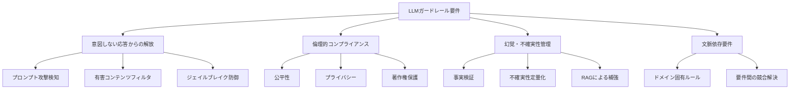

## 論文概要

本記事は ICML 2024 論文「[Position: Building Guardrails for Large Language Models Requires Systematic Design](https://proceedings.mlr.press/v235/dong24c.html)」の解説記事です。著者らは、LLM の入出力をフィルタリングするガードレール技術について、現行のオープンソースソリューション（Llama Guard、NVIDIA NeMo Guardrails、Guardrails AI）を体系的に分析し、アドホックな実装ではなく包括的・体系的な設計手法が不可欠であると主張しています。社会技術的（socio-technical）アプローチによる多分野協働、ニューラル・シンボリック実装、そして検証・テストフレームワークの三本柱を提案するポジション論文です。

## 情報源

| 項目 | 内容 |
|------|------|
| **会議名** | ICML 2024（41st International Conference on Machine Learning） |
| **開催時期** | 2024年7月21日〜27日、ウィーン |
| **掲載** | Proceedings of Machine Learning Research (PMLR), Vol. 235, pp. 11375-11394 |
| **著者** | Yi Dong, Ronghui Mu, Gaojie Jin, Yi Qi, Jinwei Hu, Xingyu Zhao, Jie Meng, Wenjie Ruan, Xiaowei Huang |
| **URL** | [https://proceedings.mlr.press/v235/dong24c.html](https://proceedings.mlr.press/v235/dong24c.html) |
| **arXiv** | [2402.01822](https://arxiv.org/abs/2402.01822) |

## カンファレンス情報

ICML（International Conference on Machine Learning）は、機械学習分野において NeurIPS と並ぶ最高峰の国際会議です。2024年のICMLはオーストリア・ウィーンで開催され、採択率は約25%前後と報告されています。本論文は「Position Paper」として採択されており、これは特定の技術的貢献よりも、研究コミュニティに対する問題提起や方向性の提案を目的とするカテゴリです。ガードレール設計という実務的かつ学術的に重要なテーマに対し、体系的な設計方法論を提案する内容が高く評価されたと考えられます。

## 技術的詳細：ガードレールの要件分類と既存ソリューション分析

### ガードレール要件の分類体系

著者らは、LLMガードレールが対処すべき要件を以下の4カテゴリに整理しています。

1. **意図しない応答からの解放（Free from Unintended Response）**: 攻撃的表現・ヘイトスピーチ・有害コンテンツのフィルタリング
2. **倫理的コンプライアンス（Ethical Compliance）**: 公平性（Fairness）、プライバシー、著作権の遵守
3. **幻覚と不確実性（Hallucination & Uncertainty）**: 事実正確性の担保と不確実性の管理
4. **文脈依存の安全性要件**: ドメイン固有の制約（例：犯罪防止分野では「銃」「犯罪」といった用語が必要だが、一般的には有害と判定されうる）

著者らは、これらの要件が相互に矛盾する場合があることを強調しています。例として、ChatGPT が2023年3月から6月にかけて応答が保守的になり、平均文字数が600文字超から約140文字に減少した事例を挙げ、安全性（Safety）と知性（Intelligence）のトレードオフが存在すると指摘しています。

### 既存ソリューションの比較分析

著者らは、3つの主要なオープンソースガードレールソリューションを詳細に分析しています。

#### Llama Guard（Meta）

Llama Guard は Llama2-7b をファインチューニングした安全性分類モデルです。著者らの分類では **Type-1 ニューラル・シンボリック**（深層学習にシンボリックな入出力を持たせる方式）に該当します。ユーザが定義した安全カテゴリに基づいて入出力を分類する仕組みで、カスタマイズ性が高い点が特長です。

しかし著者らは、分類結果がLLMの理解力に依存するため信頼性の保証が欠けている（"lacks guaranteed reliability since the classification results depend on the LLM's understanding"）と指摘しています。つまり、LLMベースの判定である以上、判定自体の正確性を外部から検証する手段が限定的です。

#### NVIDIA NeMo Guardrails

NeMo Guardrails は、Colang と呼ばれる独自の実行可能プログラミング言語を用いてガードレールの制約を定義します。会話処理は3フェーズで構成されています。

- **Phase I**: ユーザ意図の生成（決定論的処理、temperature=0）
- **Phase II**: KNN（k近傍法）による類似フローの検索（埋め込みモデルとして all-MiniLM-L6-v2 を使用）
- **Phase III**: 検索されたコンテキストに基づく安全な応答の生成

著者らの分類では、こちらも **Type-1 ニューラル・シンボリック** に該当します。Colang によるルールベースの制御とLLMによる判定を組み合わせたハイブリッド構成ですが、ニューラルとシンボリックの結合は疎結合（loosely coupled）にとどまっています。

#### Guardrails AI

Guardrails AI は、RAIL（XML ベースの返却フォーマット定義仕様）を用いたバリデーション重視のアプローチです。3ステップで動作します。

1. RAIL仕様の定義
2. ガードの初期化
3. バリデーション失敗時の修正プロンプト自動生成

著者らの分類では **Type-2 ニューラル・シンボリック**（シンボリックなバックボーンに学習的サポートを持たせる方式）に該当します。ただし、テキストのみの対応でマルチモーダル入力には非対応という制約があります。

#### 3ソリューションの比較表

| 特性 | Llama Guard | NeMo Guardrails | Guardrails AI |
|------|-------------|-----------------|---------------|
| **アーキテクチャ** | LLMファインチューニング | Colang + LLM + KNN | RAIL仕様 + バリデーション |
| **NS分類** | Type-1 | Type-1 | Type-2 |
| **カスタマイズ性** | カテゴリ定義可能 | Colang言語で制約記述 | XML仕様で定義 |
| **マルチモーダル** | 限定的 | 非対応 | 非対応 |
| **信頼性保証** | LLM依存で限定的 | 疎結合で限定的 | バリデーション層あり |
| **主な制約** | 判定精度がLLMに依存 | 設定の冗長性管理 | テキストのみ |

著者らは、いずれのソリューションも以下の点で不十分であると結論づけています。

- 設定の冗長性管理（Configuration redundancy handling）
- 会話の制限管理（Conversational limitation management）
- 未知シナリオへの汎化（Unforeseen scenario generalization）
- シンボリック・学習間の適切な表現力（Suitable symbolic-learning interaction expressivity）

## 体系的設計方法論

著者らが提案する体系的設計方法論は、以下の3つの柱で構成されています。

### 1. 社会技術的（Socio-Technical）アプローチ

著者らは、ガードレール設計を純粋な技術的課題としてではなく、社会技術的システム（socio-technical system）として捉えるべきだと主張しています。その核心は以下の点にあります。

- **多分野協働チーム**: エンジニアだけでなく、倫理学者・法学者・ドメイン専門家・エンドユーザを含むチーム構成
- **全体システムアプローチ**: 社会的側面と技術的側面を独立ではなく相互依存する要素として統合
- **科学的な要件決定**: 閾値ベースのヒューリスティクスではなく、コミュニティの合意に基づく科学的な基準策定
- **ステークホルダー統合**: 利用者・開発者・影響を受ける人々の視点を設計プロセスに組み込む

この提案の背景には、公平性の定義が文化や文脈によって異なるという認識があります。例えば、ジェンダーバイアス・文化的バイアス・データセットバイアス・社会的バイアスなど、バイアスのカテゴリ自体が多岐にわたり、技術的なデバイアス手法だけでは対処しきれないという問題意識です。

### 2. ニューラル・シンボリック実装

著者らは、現行のガードレールがType-1やType-2の疎結合なニューラル・シンボリック統合にとどまっていることを問題視し、より深い結合を目指すべきだと提案しています。

具体的には、以下の構成を提唱しています。

- **学習エージェント**: データが豊富な頻出ケースを処理
- **シンボリックエージェント**: データが少ない希少ケースを解釈可能な形で処理
- **知識グラフ**: 人間的な認知をコーナーケースに適用するための埋め込み

目標とするアーキテクチャは **Type-6 ニューラル・シンボリックシステム** であり、これはニューラルエンジン内部で真のシンボリック推論を実現するレベルです。著者らは Pointer Networks などを例として挙げ、ニューラルネットワーク内部でシンボリックな操作を実行可能なアーキテクチャの必要性を述べています。

また、要件間の競合解決には論理学と決定理論の組み合わせを提案しており、安全性と有用性のトレードオフをパレートフロント分析（Pareto front analysis）によって非支配解の集合として扱うアプローチを示唆しています。

### 3. 検証・テストフレームワーク

著者らは、ソフトウェア工学における **V-model**（開発プロセスとテスト活動を対応づけるモデル）を適用し、ガードレールのシステム開発ライフサイクル（SDLC）を提案しています。

#### 保証レベルの階層

検証の厳密さを11段階のスケールで定義しています。

| レベル | 保証の種類 | 具体例 |
|--------|-----------|--------|
| Level 1 | 経験的攻撃 | レッドチーミング、ジェイルブレイク試行 |
| Level 2-3 | 体系的テスト | 自動化されたテストスイート |
| Level 4-6 | 統計的評価 | ベンチマークによる定量評価 |
| Level 7-9 | 統計的保証 | ランダム化スムージングによる認証されたロバスト性 |
| Level 10-11 | 決定論的保証 | 形式検証による数学的証明 |

#### 単一要件 vs. 複数要件の検証

- **単一要件の検証**: ランダム化スムージング（Randomized Smoothing）による統計的認証。入力に対する摂動に対して、分類結果が変わらないことの確率的保証を与える手法
- **複数要件の同時検証**: パレートフロント分析により、複数の要件を同時に満たす非支配解の集合を探索。ある要件の改善が別の要件を悪化させないことを確認する

#### セーフティアーギュメント

著者らは、ステークホルダーへのコミュニケーションツールとして **セーフティアーギュメント**（安全性論拠）の構築を推奨しています。これは、ガードレールが所定の安全性要件を満たすことの根拠を構造化して提示するものであり、航空・自動車などの安全性が重要な産業で広く用いられている手法です。

## ガードレール検証の技術的手法

### 個別要件に対する防御戦略

著者らは、各要件カテゴリに対する脆弱性検知・LLM強化・入出力エンジニアリングの3層を体系化しています。

**意図しない応答の防止**について、著者らは現在の経験的防御（adversarial training等）では攻撃と防御のいたちごっこが続くと指摘し、認証されたロバスト性境界（certified robustness bounds）の開発を推奨しています。統計的保証または決定論的保証を組み込むことで、特定の攻撃範囲内での安全性を数学的に担保するアプローチです。

**プライバシー保護**について、差分プライバシー（Differential Privacy）を DP-SGD として統合するアプローチに加え、著者らは新規のウォーターマーキングメカニズムを提案しています。

1. データ所有者が固有のウォーターマークをコンテンツに埋め込む
2. LLM開発者がウォーターマーク付きデータをトレーニングから除外することをコミットする
3. 自動検証により、ウォーターマーク付きテキストがトレーニングデータに含まれているか判定する
4. 含まれていた場合、モデルアンラーニング（Model Unlearning）により該当テキストを除去する

**幻覚検知**について、著者らは **セマンティックエントロピー**（Semantic Entropy）の活用を提案しています。これは、複数回の生成結果に対してトークンレベルの確信度（lexical confidence）ではなく、意味レベルの確信度（semantic confidence）を言語的不変量（linguistic invariances）を通じて統合する手法です。同義の表現を等価関係として扱うことで、表面的な表現の違いに惑わされない不確実性推定を実現します。

$$H_{semantic} = -\sum_{c \in C} p(c) \log p(c)$$

ここで $$C$$ は意味的に等価なクラスの集合、$$p(c)$$ は各クラスに属する応答が生成される確率です。

## 実運用への応用：Portkey Guardrails との対応

本論文の提案は、関連する Zenn 記事「[Portkey AIゲートウェイのマルチテナント運用：RBAC・予算管理・ガードレール設計](https://zenn.dev/0h_n0/articles/2658d8a7a0e6e3)」で扱われている Portkey のガードレール設計と密接に関連します。

本論文の知見を実運用に適用する際の対応関係を整理します。

| 本論文の提案 | 実運用での対応 |
|-------------|-------------|
| **要件の体系化** | Portkey のガードレールは入出力の双方にフィルタリングを適用。コンテンツ制限・PII検出・トピック制限などの要件をルールとして定義 |
| **ニューラル・シンボリック統合** | LLMベースの判定（ニューラル）とルールベースのバリデーション（シンボリック）の組み合わせ。本論文が指摘するType-1〜Type-2レベルの統合に相当 |
| **文脈依存の要件管理** | マルチテナント環境でのテナントごとのガードレール設定。本論文が強調する「文脈に応じたガードレール」の実装形態 |
| **検証フレームワーク** | 予算管理・レート制限といったガバナンス機能との統合。ただし本論文が求めるLevel 7以上の統計的保証には至っていない |

本論文の立場からすると、Portkey を含む現行のゲートウェイレベルのガードレール実装は、著者らが指摘する Type-1 ニューラル・シンボリック統合の段階にあり、より深い統合（Type-6）への発展余地が大きいと位置づけられます。特に、マルチテナント環境における要件間の競合（あるテナントのセキュリティ要件が別テナントの利便性要件と矛盾する場合）の体系的な解決手法は、本論文が提案するパレートフロント分析の適用対象となりえます。

## 関連研究

本論文が分析対象とした3つのソリューション以外にも、ガードレール分野には活発な研究があります。

- **WildGuard**: 野生（in-the-wild）のユーザインタラクションを対象とした安全性分類。Llama Guard よりも多様な攻撃パターンへの対応を目指す
- **ShieldLM**: 安全性判定に特化したLLMで、判定の根拠を説明可能な形で出力する点が特長
- **LlamaFirewall（Meta, 2025）**: Llama Guard の後継として、PromptGuard・Agent Alignment Checks・CodeShield の3層構成でより包括的な防御を提供
- **レッドチーミング研究**: 自動化されたレッドチーミング手法（gradient-based prompt generation、low-resource language exploitation）の発展

本論文は、これらの個別研究を統合するフレームワークの必要性を訴えている点で、メタレベルの貢献を行っています。個々のガードレール技術は進展しているものの、それらを体系的に組み合わせて全体としての安全性を保証する方法論が欠如しているというのが、著者らの中心的な問題意識です。

## 制約・限界

本論文はポジション論文であり、以下の制約があります。

1. **実装の不在**: 提案されている Type-6 ニューラル・シンボリック統合や V-model ベースの検証フレームワークは概念的な提案にとどまり、具体的な実装や実験的検証は含まれていない
2. **攻撃と防御のいたちごっこ**: 著者ら自身が認めているように、ガードレール単体では高度な攻撃に対する完全な防御は困難であり、証明可能な保証なしには継続的な攻防サイクルが発生する
3. **閾値設定の妥当性**: 公平性やプライバシーの定量的基準をどう設定するかについて、具体的な方法論は示されていない（「コミュニティの合意」に委ねている）
4. **安全性と有用性のトレードオフ**: 著者らはこのトレードオフの存在を指摘しているが、具体的にどの程度の有用性低下が許容されるかの基準は未定義
5. **評価メトリクスの未確立**: 複数要件を同時に評価する包括的なメトリクスは、今後の研究課題として残されている

## まとめと今後の展望

本論文は、LLMガードレールの設計が現在アドホックな段階にあり、体系的な方法論が必要であるという重要な問題提起を行っています。著者らの主な貢献は以下の3点に集約されます。

1. **現状分析**: Llama Guard・NeMo Guardrails・Guardrails AI の3ソリューションをニューラル・シンボリックの観点から統一的に分類・比較し、いずれも疎結合な統合にとどまることを明らかにした
2. **方法論の提案**: 社会技術的アプローチ・深いニューラル・シンボリック統合・V-model ベースの検証フレームワークという三本柱の方法論を提示した
3. **課題の明確化**: 要件間の競合（特に安全性 vs. 有用性）、文脈依存性、検証の困難さといった未解決課題を体系的に整理した

今後の展望として、著者らは以下の方向性を示しています。

- **より深いニューラル・シンボリック結合**: Type-1/Type-2 から Type-6 への発展。ニューラルネットワーク内部でシンボリック推論を実現するアーキテクチャの研究
- **原理的な競合解決手法**: 決定理論と論理学を組み合わせた、安全性要件間のトレードオフの形式的な解決
- **適応的ガードレール**: セマンティックな文脈の変化に動的に対応するガードレール。ドメインごとに自動的に制約を調整する仕組み
- **形式検証技術**: 統計的保証を超えた、決定論的な安全性証明の追求

本論文は2024年2月に arXiv に投稿され、ICML 2024 に採択されました。その後の1年半で、LlamaFirewall（Meta, 2025）や各クラウドプロバイダのガードレール機能強化など、関連技術は急速に発展しています。しかし、著者らが指摘した「体系的設計の欠如」という根本的課題は依然として残っており、本論文の提言はガードレール研究の今後の方向性を考える上で重要な参照点であり続けています。

## 参考文献

1. Dong, Y., Mu, R., Jin, G., Qi, Y., Hu, J., Zhao, X., Meng, J., Ruan, W., & Huang, X. (2024). Position: Building Guardrails for Large Language Models Requires Systematic Design. *Proceedings of the 41st International Conference on Machine Learning (ICML 2024)*, PMLR 235, 11375-11394. [https://proceedings.mlr.press/v235/dong24c.html](https://proceedings.mlr.press/v235/dong24c.html)
2. Inan, H., Upasani, K., Chi, J., et al. (2023). Llama Guard: LLM-based Input-Output Safeguard for Human-AI Conversations. *arXiv preprint arXiv:2312.06674*.
3. Rebedea, T., Dinu, R., Sreedhar, M., Parisien, C., & Cohen, J. (2023). NeMo Guardrails: A Toolkit for Controllable and Safe LLM Applications with Programmable Rails. *arXiv preprint arXiv:2310.10501*.
4. Guardrails AI. (2023). Guardrails AI: Adding guardrails to large language models. [https://github.com/guardrails-ai/guardrails](https://github.com/guardrails-ai/guardrails)
5. Han, S., Kelly, R., Abdelfattah, A., et al. (2025). LlamaFirewall: An Open Source Guardrail System for Building Secure AI Agents. *Meta AI Research*.
6. Cohen, J., Rosenfeld, E., & Kolter, Z. (2019). Certified Adversarial Robustness via Randomized Smoothing. *Proceedings of the 36th International Conference on Machine Learning (ICML 2019)*.
7. Kuhn, L., Gal, Y., & Farquhar, S. (2023). Semantic Uncertainty: Linguistic Invariances for Uncertainty Estimation in Natural Language Generation. *Proceedings of the 11th International Conference on Learning Representations (ICLR 2023)*.
