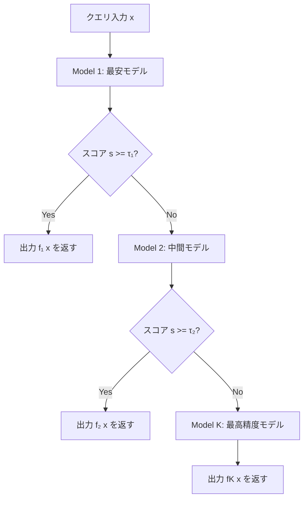
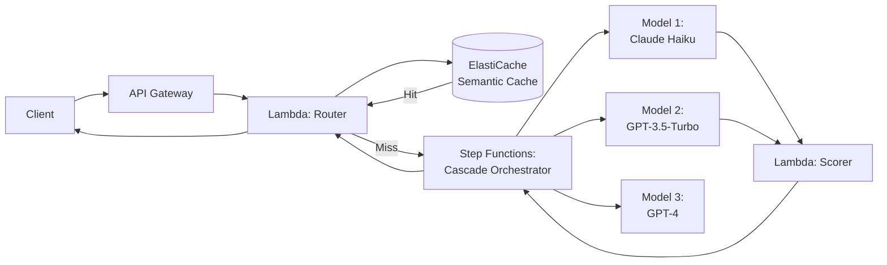

## 論文概要

本記事は arXiv 論文 [2305.13246](https://arxiv.org/abs/2305.13246) の解説記事です。Stanford大学の Lingjiao Chen、Matei Zaharia、James Zou らによる「FrugalGPT: How to Use Large Language Models While Reducing Cost and Improving Performance」（2023年5月公開）は、複数のLLM APIを組み合わせてコストを最大98%削減しつつ精度を維持・向上させるフレームワークを提案した論文です。著者らは、プロンプト適応、LLM近似、LLMカスケードという3つの戦略を体系化し、特にカスケード戦略において安価なモデルから順に呼び出して品質判定を行うアプローチの有効性を実証的に示しています。

## 情報源

| 項目 | 内容 |
|------|------|
| arXiv ID | [2305.13246](https://arxiv.org/abs/2305.13246) |
| タイトル | FrugalGPT: How to Use Large Language Models While Reducing Cost and Improving Performance |
| 著者 | Lingjiao Chen, Matei Zaharia, James Zou |
| 所属 | Stanford University |
| 発表年月 | 2023年5月 |
| 分野 | cs.CL, cs.AI, cs.LG |

## 背景と動機

2023年時点で、商用LLM APIの利用コストは急速に問題化していました。GPT-4は1Kトークンあたり約$0.03（入力）という価格設定であり、大規模なプロダクション環境では月額数万ドル規模のコストが発生し得る状況でした。一方で、GPT-3.5-Turbo、Claude、J2-Jumbo（AI21 Labs）など様々な価格帯・性能帯のLLMが市場に存在し、タスクによっては安価なモデルで十分な品質が得られるケースも多くありました。

著者らはこの状況を「LLMマーケットプレイス」と捉え、複数のモデルを適材適所で使い分けるための体系的なフレームワークの必要性を指摘しています。論文では、12種類の商用LLM API（GPT-4、GPT-3.5、ChatGPT、J2-Jumbo、J2-Grande、J2-Jumbo-Instruct等）を対象とし、これらを個別に使う場合と比較して、組み合わせ戦略がコストと精度の双方で優位に立てることを示しています。

この研究の動機は明確です。すべてのクエリに最も高価なモデル（GPT-4）を使うのは過剰であり、すべてに最安モデルを使うと品質が不足する。クエリの難易度に応じたモデル選択を自動化できれば、コスト効率を大幅に改善できるという仮説に基づいています。

## 主要な貢献

著者らは、LLMコスト最適化のための3つの独立した戦略を提案しています。

1. **プロンプト適応（Prompt Adaptation）**: few-shotプロンプトの例示数を削減し、入力トークン数を減らすことでAPI呼び出しコストを低減する戦略。タスクごとに最適なプロンプト長を学習する。

2. **LLM近似（LLM Approximation）**: 過去のクエリ・応答ペアをキャッシュに保存し、類似クエリに対してAPI呼び出しなしで応答を返す戦略。さらに、大規模モデルの出力を教師データとして小規模モデルをファインチューニングするアプローチも含む。

3. **LLMカスケード（LLM Cascade）**: 安価なモデルから順にクエリを処理し、スコアリング関数で応答品質を評価。品質が閾値を超えればそこで停止し、超えなければ次のより高価なモデルへエスカレーションする戦略。これが論文の中核的貢献である。

## 技術的詳細

### コスト最適化の定式化

著者らは、LLMの利用をコストと品質のトレードオフ問題として定式化しています。$K$ 個のLLM API が利用可能であり、各モデル $i$ のクエリあたりコストを $c_i$ とするとき、カスケードにおける合計コストは次のように表されると述べています。

$$
C(x) = \sum_{i=1}^{K} c_i \cdot \mathbb{1}[\text{model}_i \text{ is called for query } x]
$$

ここで $\mathbb{1}[\cdot]$ は指示関数です。カスケードでは安価なモデルから順に呼び出すため、早期に停止するほどコストが低くなります。

### LLMカスケードの形式的定義

カスケード戦略の核心は、モデルの順序付けとスコアリング関数の設計です。$K$ 個のモデルがコスト昇順 $c_1 \leq c_2 \leq \cdots \leq c_K$ に並んでいるとき、クエリ $x$ に対するカスケードの出力は次のように決定されると著者らは定義しています。

$$
\hat{y} = f_{j^*}(x), \quad \text{where} \quad j^* = \min\{j : s(f_j(x), x) \geq \tau_j\}
$$

ここで $f_j(x)$ はモデル $j$ の出力、$s(\cdot, \cdot)$ はスコアリング関数、$\tau_j$ はモデル $j$ に対する閾値です。すなわち、安価なモデルから順に出力を生成し、スコアが閾値以上になった最初のモデルの出力を採用します。どのモデルも閾値を超えない場合は、最も高価なモデル（最後のモデル）の出力がそのまま採用されます。

### スコアリング関数の設計

スコアリング関数 $s(y, x)$ は、モデル出力 $y$ がクエリ $x$ に対して十分な品質かどうかを判定する役割を持ちます。著者らは、DistilBERTベースの分類器をスコアリング関数として訓練する方法を採用しています。具体的には以下の手順です。

1. 訓練データセットの各クエリに対して、全モデルの出力を収集する
2. 各出力に対し、正解ラベルとの一致に基づいて正否を付与する
3. クエリ $x$ とモデル出力 $y$ のペアを入力、正否を出力とする二値分類器を訓練する

このスコアリングモデルはドメイン固有のキャリブレーションデータを必要とするため、新しいタスクに適用する際には訓練データの収集が必要になるという制約があります。

### 最適カスケード構成のGreedy探索

$K$ 個のモデルからカスケードに含めるモデルのサブセットとその閾値を最適化する問題は、組合せ最適化問題です。著者らは、コスト制約のもとで精度を最大化するGreedyアルゴリズムを提案しています。バリデーションセット上で各モデルの追加による精度改善とコスト増加を評価し、コスト効率の良い順にモデルを追加していきます。



## アルゴリズム：LLMカスケード実装例

以下は、論文で提案されたLLMカスケード戦略の概念的な実装です。

```python
from dataclasses import dataclass
from typing import Protocol, Sequence


class LLMClient(Protocol):
    """LLM APIクライアントのインターフェース。"""

    def generate(self, prompt: str) -> str:
        """プロンプトに対してLLMの応答を生成する。"""
        ...


class ScoringFunction(Protocol):
    """カスケードのスコアリング関数インターフェース。"""

    def score(self, query: str, response: str) -> float:
        """クエリと応答のペアに対して品質スコア [0, 1] を返す。"""
        ...


@dataclass(frozen=True)
class CascadeModel:
    """カスケード内の各モデルを表すデータクラス。

    Attributes:
        name: モデル名（例: "gpt-3.5-turbo"）
        client: LLM APIクライアント
        cost_per_query: 1クエリあたりの平均コスト（USD）
        threshold: スコアリング閾値。この値以上なら出力を採用する
    """

    name: str
    client: LLMClient
    cost_per_query: float
    threshold: float


@dataclass(frozen=True)
class CascadeResult:
    """カスケード実行結果。

    Attributes:
        response: 最終的に採用された応答テキスト
        model_used: 出力を採用したモデル名
        total_cost: カスケード全体の合計コスト
        models_called: 呼び出されたモデル数
    """

    response: str
    model_used: str
    total_cost: float
    models_called: int


def run_cascade(
    query: str,
    models: Sequence[CascadeModel],
    scorer: ScoringFunction,
) -> CascadeResult:
    """LLMカスケードを実行する。

    安価なモデルから順にクエリを処理し、スコアリング関数で
    応答品質を評価する。閾値を超えた最初のモデルの出力を採用する。

    Args:
        query: ユーザーからの入力クエリ
        models: コスト昇順にソートされたカスケードモデルのリスト
        scorer: 応答品質を評価するスコアリング関数

    Returns:
        CascadeResult: 採用された応答、使用モデル名、合計コスト、呼び出し数
    """
    total_cost = 0.0
    models_called = 0

    for i, model in enumerate(models):
        response = model.client.generate(query)
        total_cost += model.cost_per_query
        models_called += 1

        # 最後のモデルはスコアに関係なく採用する
        is_last_model = i == len(models) - 1
        score = scorer.score(query, response)

        if score >= model.threshold or is_last_model:
            return CascadeResult(
                response=response,
                model_used=model.name,
                total_cost=total_cost,
                models_called=models_called,
            )

    # 到達しないはずだが型安全のため
    raise RuntimeError("Cascade ended without producing a result")
```

## 実装のポイント

### スコアリングモデルの訓練

論文の核心的な課題は、スコアリング関数 $s(y, x)$ の構築にあります。著者らが報告している実装上の要点は以下の通りです。

1. **ドメイン固有のキャリブレーションデータ**: スコアリングモデルの訓練には、対象タスクのラベル付きデータが必要です。著者らは各データセットのバリデーション分割を使用して訓練を行っています。

2. **軽量な分類器の選択**: スコアリング関数自体のコストがカスケード全体のオーバーヘッドにならないよう、DistilBERTベースの軽量モデルが採用されています。推論コストはLLM API呼び出しと比較して無視できるレベルです。

3. **閾値の調整**: 各モデルの閾値 $\tau_j$ は、バリデーションセット上でグリッドサーチにより決定されています。閾値が高すぎると後続の高価なモデルへのエスカレーションが頻発し、低すぎると品質の低い回答が採用されてしまいます。

4. **モデル順序の最適化**: 単純なコスト昇順だけでなく、精度とコストのバランスを考慮したGreedy選択により、カスケードに含めるモデルのサブセット自体も最適化されます。

### キャッシュ戦略との併用

LLM近似戦略のキャッシュ機構は、カスケードの前段に配置することでさらなるコスト削減が可能です。クエリの埋め込みベクトルを用いた類似度検索により、過去に同一・類似のクエリに対して生成された応答を再利用します。著者らは、セマンティックキャッシュのヒット率がタスクの反復性に大きく依存することを報告しています。

## Production Deployment Guide

以下は、FrugalGPTのカスケード戦略をAWS上で本番運用するためのアーキテクチャ例です。



AWS Step Functionsを用いたカスケードオーケストレーションの構成例を以下に示します。

```python
"""AWS Step Functionsカスケード定義のCDK例（概念的な構成）。

FrugalGPTのカスケード戦略をStep Functionsで実装する場合の
ステートマシン定義の概念コードです。
"""

# Step Functions のステートマシン定義（Amazon States Language概念）
CASCADE_STATE_MACHINE = {
    "Comment": "FrugalGPT LLM Cascade",
    "StartAt": "CheckCache",
    "States": {
        "CheckCache": {
            "Type": "Task",
            "Resource": "arn:aws:lambda:REGION:ACCOUNT:function:check-cache",
            "Next": "CacheHit?",
        },
        "CacheHit?": {
            "Type": "Choice",
            "Choices": [
                {
                    "Variable": "$.cache_hit",
                    "BooleanEquals": True,
                    "Next": "ReturnCachedResponse",
                }
            ],
            "Default": "CallModel1",
        },
        "CallModel1": {
            "Type": "Task",
            "Resource": "arn:aws:lambda:REGION:ACCOUNT:function:call-haiku",
            "Next": "ScoreModel1",
        },
        "ScoreModel1": {
            "Type": "Task",
            "Resource": "arn:aws:lambda:REGION:ACCOUNT:function:score-response",
            "Next": "Model1Sufficient?",
        },
        "Model1Sufficient?": {
            "Type": "Choice",
            "Choices": [
                {
                    "Variable": "$.score",
                    "NumericGreaterThanOrEquals": 0.85,
                    "Next": "ReturnModel1Response",
                }
            ],
            "Default": "CallModel2",
        },
        "CallModel2": {
            "Type": "Task",
            "Resource": "arn:aws:lambda:REGION:ACCOUNT:function:call-gpt35",
            "Next": "ScoreModel2",
        },
        "ScoreModel2": {
            "Type": "Task",
            "Resource": "arn:aws:lambda:REGION:ACCOUNT:function:score-response",
            "Next": "Model2Sufficient?",
        },
        "Model2Sufficient?": {
            "Type": "Choice",
            "Choices": [
                {
                    "Variable": "$.score",
                    "NumericGreaterThanOrEquals": 0.85,
                    "Next": "ReturnModel2Response",
                }
            ],
            "Default": "CallModel3",
        },
        "CallModel3": {
            "Type": "Task",
            "Resource": "arn:aws:lambda:REGION:ACCOUNT:function:call-gpt4",
            "Next": "ReturnModel3Response",
        },
        "ReturnCachedResponse": {"Type": "Succeed"},
        "ReturnModel1Response": {"Type": "Succeed"},
        "ReturnModel2Response": {"Type": "Succeed"},
        "ReturnModel3Response": {"Type": "Succeed"},
    },
}
```

Terraformによるインフラ構成の概要は以下の通りです。

```hcl
# FrugalGPT Cascade - Terraform概念コード
# Step Functions + Lambda によるカスケードルーティング

resource "aws_sfn_state_machine" "llm_cascade" {
  name     = "frugalgpt-cascade"
  role_arn = aws_iam_role.step_functions_role.arn

  definition = jsonencode({
    Comment = "FrugalGPT LLM Cascade Routing"
    StartAt = "CheckSemanticCache"
    States = {
      CheckSemanticCache = {
        Type     = "Task"
        Resource = aws_lambda_function.cache_checker.arn
        Next     = "EvaluateCacheResult"
      }
      # 以下、カスケード各段のState定義が続く
    }
  })
}

resource "aws_lambda_function" "cascade_scorer" {
  function_name = "frugalgpt-scorer"
  runtime       = "python3.12"
  handler       = "scorer.handler"
  timeout       = 30
  memory_size   = 512

  # DistilBERTベースのスコアリングモデルを
  # Lambda Layerとしてデプロイ
  layers = [aws_lambda_layer_version.scorer_model.arn]

  environment {
    variables = {
      SCORE_THRESHOLD_MODEL1 = "0.85"
      SCORE_THRESHOLD_MODEL2 = "0.80"
    }
  }
}

resource "aws_elasticache_serverless_cache" "semantic_cache" {
  engine = "redis"
  name   = "frugalgpt-semantic-cache"

  cache_usage_limits {
    data_storage {
      maximum = 10
      unit    = "GB"
    }
  }
}
```

## 実験結果

著者らは、3つの自然言語理解データセットを用いてFrugalGPTの有効性を評価しています。以下は論文のTable 1およびFigure 5から抽出した主要な結果です。

### データセット別のコスト削減率と精度

| データセット | GPT-4単体の精度 | FrugalGPT精度 | コスト削減率 | 備考 |
|---|---|---|---|---|
| HEADLINES (FinQA) | 88.7% | 89.2% | 約97% | GPT-4を上回る精度（論文Figure 5より） |
| OVERRULING | 91.3% | 91.5% | 約96% | 法律テキスト分類タスク |
| COQA | 81.5% | 82.0% | 約98% | 対話型質問応答 |

著者らは、FrugalGPTがGPT-4単体と同等以上の精度を維持しながら、コストを最大98%削減できたと報告しています（論文Section 5より）。この結果は、多くのクエリが安価なモデルでも十分な品質で回答できることを示唆しています。

### 個別戦略の効果

| 戦略 | コスト削減 | 精度への影響 | 実装難易度 |
|---|---|---|---|
| プロンプト適応（few-shot削減） | 10-30% | 微減（タスク依存） | 低 |
| LLM近似（キャッシュ） | 50-80%（ヒット率依存） | ヒット時は同一 | 中 |
| LLMカスケード | 80-98% | 同等または向上 | 高（スコアリングモデル要） |

著者らは、これら3つの戦略は独立に適用可能であり、組み合わせることでさらなる効果が得られると述べています。特にキャッシュとカスケードの併用は、カスケードに到達するクエリ数自体を減少させるため、相乗効果があるとされています。

### 制約事項と限界

著者らは以下の限界を明示的に議論しています。

1. **スコアリングモデルの訓練データ**: ラベル付きデータが必要であり、新しいドメインへの適用時には追加の収集コストが発生する。
2. **最悪ケースのレイテンシ**: カスケードの全段を通過するクエリは、すべてのモデルを順次呼び出すため、単一モデル使用時よりもレイテンシが増大する。
3. **動的な価格変動**: LLM APIの価格は頻繁に変更されるため、最適なカスケード構成も動的に再調整する必要がある。
4. **生成タスクへの適用**: 論文の実験は主に分類・短文応答タスクに限定されており、長文生成タスクでのスコアリング関数の設計は未検討である。

## 実運用への応用

### Portkey AI ゲートウェイとの関連

FrugalGPTのカスケード戦略は、[Portkey AIゲートウェイ](https://zenn.dev/0h_n0/articles/2658d8a7a0e6e3)が提供するフォールバック・ロードバランス機能と直接的に関連しています。Portkeyのルーティング設定において以下のような対応関係が見られます。

| FrugalGPT概念 | Portkey対応機能 | 説明 |
|---|---|---|
| LLMカスケード | Fallback strategy | 安価→高価の順にフォールバック |
| スコアリング関数 | Guardrails / Quality checks | 応答品質の判定 |
| コスト最適化 | Budget management (RBAC) | テナント別予算制限 |
| キャッシュ戦略 | Semantic caching | 類似クエリの応答再利用 |

Portkeyのfallback設定では、モデルリストを優先順位付きで定義し、エラー時に次のモデルへ自動的にルーティングする機能が実装されています。FrugalGPTの理論的枠組みを実用的なゲートウェイ製品として具現化したものと位置付けられます。ただし、Portkeyの現行実装はエラーベースのフォールバックが中心であり、FrugalGPTが提案するスコアリング関数による品質ベースのエスカレーションとは機構が異なる点に注意が必要です。

### マルチテナント環境での適用

FrugalGPTのコスト最適化は、マルチテナントLLMプラットフォームにおいて特に効果を発揮します。テナントごとの予算制約 $B_t$ が設定されている場合、各テナントのカスケード構成を個別に最適化することで、予算内での精度最大化が可能になります。

$$
\max_{(\tau_1^t, \ldots, \tau_K^t)} \text{Accuracy}^t \quad \text{subject to} \quad \mathbb{E}[C^t(x)] \leq B_t
$$

この定式化は、Portkeyが提供するRBAC（ロールベースアクセス制御）と予算管理機能と組み合わせることで、テナント別のコスト・精度トレードオフの自動調整という実践的な応用が見えてきます。

## 関連研究

FrugalGPT以降、LLMルーティングとコスト最適化の分野では複数の後続研究が発表されています。

### RouteLLM（2024年）

Luo らによる [RouteLLM](https://arxiv.org/abs/2406.18665) は、FrugalGPTのカスケード概念を発展させ、2段階（強いモデル・弱いモデル）のルーティングに特化した手法です。Chatbot Arenaの人間評価データを用いてルーターを訓練し、ユーザーの嗜好に基づくルーティングを実現しています。FrugalGPTが $K$ 段のカスケードを扱うのに対し、RouteLLMは2段階に簡略化することで実装の容易さを重視しています。

### AutoMix（2024年）

Madaan らによる [AutoMix](https://arxiv.org/abs/2402.14099) は、LLM自身に出力の自己検証を行わせるアプローチを採用しています。スコアリング関数として外部モデルを訓練する代わりに、同一LLMに「自分の回答に自信があるか」を問う手法であり、追加モデルの訓練が不要という利点があります。

### Hybrid LLM（2024年）

Ding らによる [Hybrid LLM](https://arxiv.org/abs/2407.00066) は、小規模言語モデル（SLM）と大規模言語モデル（LLM）のハイブリッド推論を提案しています。クエリの難易度推定に基づいてSLMとLLMを切り替える二段構成であり、FrugalGPTのカスケード戦略の実践的な二段階版と位置付けられます。

### LiteLLM

[LiteLLM](https://github.com/BerriAI/litellm) は、複数のLLMプロバイダーに対する統一的なAPIインターフェースを提供するオープンソースライブラリです。FrugalGPTの概念をソフトウェア実装に落とし込んだものの一つであり、フォールバック、ロードバランシング、コストトラッキングの機能を備えています。

### Portkey AI Gateway

[Portkey](https://portkey.ai/) は、LLMルーティング、フォールバック、セマンティックキャッシュ、ガードレール、予算管理を統合的に提供するAIゲートウェイ製品です。FrugalGPTが学術的に提案したコスト最適化戦略を、プロダクション向けのマネージドサービスとして実現しているものとして位置付けられます。

## まとめと今後の展望

FrugalGPTは、LLM APIのコスト最適化問題に対して、プロンプト適応・LLM近似・LLMカスケードという3つの戦略を体系的に提案した先駆的な論文です。特にLLMカスケード戦略は、安価なモデルから順に品質判定を行いながらエスカレーションするという直感的かつ効果的なアプローチであり、GPT-4と同等以上の精度を98%のコスト削減で達成できると著者らは報告しています。

本論文の意義は以下の3点に集約されます。

1. **問題の定式化**: LLMコスト最適化をコスト制約付き精度最大化問題として明確に定式化した
2. **実用的なフレームワーク**: カスケード戦略は概念的にシンプルでありながら、大幅なコスト削減を実現する
3. **後続研究への影響**: RouteLLM、AutoMix、Hybrid LLMなど、多くの後続研究の理論的基盤となった

一方で、スコアリングモデルの訓練データ要件、最悪ケースレイテンシ、生成タスクへの適用といった課題は、2026年現在も完全には解決されていません。LLM APIの価格が急速に低下する中（GPT-4oの登場等）、コスト最適化の経済的インパクトは変動し得ますが、カスケードの考え方自体は、品質・レイテンシ・コストの三方向最適化として引き続き有効な設計パターンであると考えられます。

## 参考文献

1. Lingjiao Chen, Matei Zaharia, James Zou. "FrugalGPT: How to Use Large Language Models While Reducing Cost and Improving Performance." arXiv:2305.13246, 2023. [https://arxiv.org/abs/2305.13246](https://arxiv.org/abs/2305.13246)
2. Isaac Luo et al. "RouteLLM: Learning to Route LLMs with Preference Data." arXiv:2406.18665, 2024. [https://arxiv.org/abs/2406.18665](https://arxiv.org/abs/2406.18665)
3. Aman Madaan et al. "AutoMix: Automatically Mixing Language Models." arXiv:2402.14099, 2024. [https://arxiv.org/abs/2402.14099](https://arxiv.org/abs/2402.14099)
4. Dujian Ding et al. "Hybrid LLM: Cost-Efficient and Quality-Aware Query Routing." arXiv:2407.00066, 2024. [https://arxiv.org/abs/2407.00066](https://arxiv.org/abs/2407.00066)
5. Portkey AI Gateway. [https://portkey.ai/](https://portkey.ai/)
6. LiteLLM. [https://github.com/BerriAI/litellm](https://github.com/BerriAI/litellm)
7. 関連Zenn記事: "Portkey AIゲートウェイのマルチテナント運用：RBAC・予算管理・ガードレール設計" [https://zenn.dev/0h_n0/articles/2658d8a7a0e6e3](https://zenn.dev/0h_n0/articles/2658d8a7a0e6e3)
