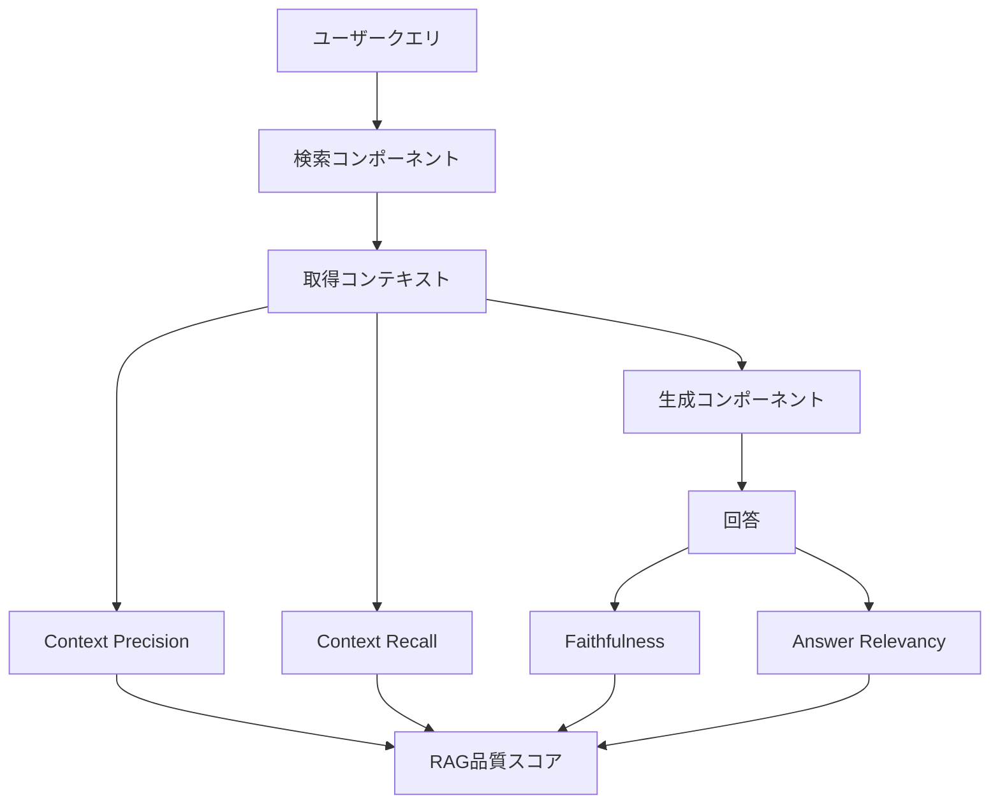

本記事は [arXiv:2309.15217 (RAGAS: Automated Evaluation of Retrieval Augmented Generation)](https://arxiv.org/abs/2309.15217) の解説記事です。

## 論文概要（Abstract）

RAGAS（Retrieval-Augmented Generation Assessment Suite）は、RAGシステムを**参照回答なしに自動評価**するフレームワークを提案した論文である。著者らはFaithfulness（忠実性）、Answer Relevancy（回答関連性）、Context Precision（コンテキスト精度）、Context Recall（コンテキスト再現率）の4指標を設計し、LLMを評価者（LLM-as-Judge）として活用することで人手アノテーションのコストを大幅に削減するアプローチを示している。

この記事は [Zenn記事: Embeddingモデルの本番評価パイプライン構築](https://zenn.dev/0h_n0/articles/1798f7e5c5fd69) の深掘りです。

## 情報源

- **arXiv ID**: 2309.15217
- **URL**: https://arxiv.org/abs/2309.15217
- **著者**: Shahul Es, Jithin James, Luis Espinosa-Anke et al.
- **発表年**: 2023
- **分野**: cs.CL

## 背景と動機（Background & Motivation）

RAG（Retrieval-Augmented Generation）はLLMに外部知識を取り込むアーキテクチャとして広く普及しているが、その品質評価は長らく未解決の課題であった。従来の評価手法には以下の問題がある。

1. **人手評価のコスト**: RAG出力の品質を人間が逐一評価するのは時間・コストの両面で非現実的
2. **既存自動指標の限界**: BLEU・ROUGEなどのn-gramベース指標は、RAG特有の「検索品質」と「生成品質」を分離して測定できない
3. **参照回答の必要性**: 従来の自動評価は正解データ（gold answer）を必要とするが、RAGの応用領域では網羅的な正解データの構築が困難

著者らはこれらの課題に対し、**LLMを評価者として活用し、参照回答への依存を最小化**する自動評価フレームワークを提案した。

## 主要な貢献（Key Contributions）

- **貢献1**: RAGパイプラインの検索・生成両コンポーネントを独立に評価できる4指標体系を設計
- **貢献2**: Faithfulness・Answer Relevancyについて参照回答不要の評価手法を実現
- **貢献3**: WikiEvalデータセット（Wikipedia由来50問）で人間判断との相関を検証し、有効性を実証
- **貢献4**: OSSライブラリ（`ragas` PyPIパッケージ、MITライセンス）として公開

## 技術的詳細（Technical Details）

### 4指標の設計思想

RAGASは、RAGパイプラインの障害箇所を特定するために、検索コンポーネントと生成コンポーネントを分離して評価する設計を採用している。



### Faithfulness（忠実性）

Faithfulnessは、生成された回答に含まれる主張（claim）が、取得コンテキストによって裏付けられているかを測定する。

**アルゴリズム**:

1. LLMを用いて回答 $a$ から主張（statements）のリスト $S = \{s_1, s_2, ..., s_n\}$ を抽出
2. 各主張 $s_i$ について、取得コンテキスト $c$ から裏付けが得られるかをLLMが判定
3. 裏付けのある主張の割合をスコアとする

$$
\text{Faithfulness}(a, c) = \frac{|\{s_i \in S : \text{supported}(s_i, c)\}|}{|S|}
$$

ここで、
- $a$: 生成された回答
- $c$: 取得されたコンテキスト
- $S$: 回答から抽出された主張の集合
- $\text{supported}(s_i, c)$: 主張 $s_i$ がコンテキスト $c$ により裏付けられるかの判定関数

**特徴**: 正解データが不要であり、取得コンテキストと回答のみで評価可能。ハルシネーション検出に直結する指標である。

### Answer Relevancy（回答関連性）

Answer Relevancyは、生成された回答がユーザーの元の質問にどの程度関連しているかを測定する。

**アルゴリズム**:

1. LLMを用いて回答 $a$ から、その回答が正解となるような質問 $q'_i$ を $n$ 個生成（逆質問生成）
2. 元の質問 $q$ と各生成質問 $q'_i$ の埋め込みベクトル間のコサイン類似度を計算
3. コサイン類似度の平均をスコアとする

$$
\text{AR}(q, a) = \frac{1}{n} \sum_{i=1}^{n} \text{sim}(\mathbf{e}(q), \mathbf{e}(q'_i))
$$

ここで、
- $q$: 元のユーザー質問
- $q'_i$: 回答 $a$ から生成された逆質問
- $\mathbf{e}(\cdot)$: テキストの埋め込みベクトル
- $\text{sim}(\cdot, \cdot)$: コサイン類似度

**設計の意図**: 直接的な質問-回答の関連性評価ではなく、「回答から復元される質問が元の質問に近いか」という間接的アプローチを採用している。著者らによると、この方法により回答の完全性（質問の全側面に答えているか）も同時に評価できると主張している。

### Context Precision（コンテキスト精度）

Context Precisionは、取得されたコンテキストの中で、実際に回答生成に必要な情報がどの程度上位にランクされているかを測定する。

**計算方法**:

$$
\text{ContextPrecision@K} = \frac{1}{K} \sum_{k=1}^{K} \frac{\text{relevant}_k}{k} \cdot \text{relevant}_k
$$

ここで、$\text{relevant}_k$ は $k$ 番目のコンテキストチャンクが関連していれば1、そうでなければ0を取る。LLMが各チャンクの関連性を判定する。

### Context Recall（コンテキスト再現率）

Context Recallは、正解回答に含まれる情報が取得コンテキストにどの程度含まれているかを測定する。

**注意点**: この指標のみ参照回答（reference answer）を必要とする。

$$
\text{ContextRecall} = \frac{|\text{reference sentences attributed to context}|}{|\text{total reference sentences}|}
$$

参照回答の各文について、取得コンテキストから裏付けが得られるかをLLMが判定する。

### 実装における工夫

```python
# RAGASの評価パイプライン概要（Python 3.11+）
# 論文で提案されたアルゴリズムの実装概要
from dataclasses import dataclass


@dataclass
class RAGASInput:
    """RAGASの評価に必要な入力データ。"""
    question: str
    answer: str
    contexts: list[str]
    ground_truth: str | None = None  # Context Recallのみ必要


def evaluate_faithfulness(
    answer: str,
    contexts: list[str],
    llm_judge: object,
) -> float:
    """Faithfulnessスコアを計算する。

    Step 1: 回答から主張を抽出
    Step 2: 各主張のコンテキストによる裏付けを判定
    Step 3: 裏付け率を算出

    Args:
        answer: RAGシステムの生成回答
        contexts: 取得されたコンテキストチャンクのリスト
        llm_judge: 評価用LLM

    Returns:
        0.0-1.0のFaithfulnessスコア
    """
    # Step 1: 主張抽出（LLMプロンプト）
    statements = llm_judge.extract_statements(answer)

    # Step 2: 各主張の裏付け判定
    supported = 0
    for stmt in statements:
        if llm_judge.is_supported(stmt, contexts):
            supported += 1

    # Step 3: スコア算出
    if not statements:
        return 0.0
    return supported / len(statements)
```

## 実験結果（Results）

### WikiEvalでの検証

著者らはWikipedia記事から構築した50問のデータセット（WikiEval）を用いて、RAGASの各指標と人間判断との相関を検証している。

| 指標 | 人間判断との相関（Pearson） | 備考 |
|------|--------------------------|------|
| Faithfulness | 0.83 | 論文Table 1より |
| Answer Relevancy | 0.75 | 論文Table 1より |
| Context Precision | — | 論文内では間接的に検証 |
| Context Recall | — | 参照回答が必要なため別途検証 |

### 評価LLMの影響

論文の実験ではGPT-3.5-turboおよびGPT-4を評価LLMとして使用している。著者らは、GPT-4を使用した場合にFaithfulnessの判定精度が向上することを報告しているが、コストとのトレードオフが存在する。

### 他手法との比較

| 評価手法 | 参照回答の要否 | 自動化 | 評価コスト | 人間相関 |
|---------|-------------|--------|-----------|---------|
| 人手評価 | 不要 | × | 高 | 基準 |
| BLEU/ROUGE | 必要 | ○ | 低 | 低〜中 |
| BERTScore | 必要 | ○ | 中 | 中 |
| **RAGAS** | **一部不要** | **○** | **中** | **高** |

## 実装のポイント（Implementation）

### 評価コストの見積もり

RAGASはLLMを評価者として使用するため、API呼び出しコストが発生する。著者らの実装では、1クエリあたり以下のAPI呼び出しが必要である。

- **Faithfulness**: 2回（主張抽出1回 + 裏付け判定1回）
- **Answer Relevancy**: 1回（逆質問生成） + 埋め込み計算
- **Context Precision**: 1回（関連性判定）
- **Context Recall**: 1回（裏付け判定）

100クエリ×4指標の場合、GPT-4o-miniを使用しても数百回のAPI呼び出しが発生する。PremAI社の2026年ガイドによると、GPT-4o-miniをjudgeとした場合の5指標評価コストは**1テストケースあたり約$0.001〜0.003**である。

### プロンプト設計の重要性

RAGASの各指標は内部的にLLMプロンプトに依存しており、プロンプトの品質が評価精度に直結する。`ragas`ライブラリでは各指標のプロンプトテンプレートが公開されており、ドメイン固有の要件に合わせてカスタマイズが可能である。

### 既知の課題と対策

1. **NaN問題**: 評価LLMが無効なJSONを返した場合にスコアがNaNになる事例が報告されている。`ragas` 0.4.x系では内部的なリトライ機構が追加されている
2. **評価バイアス**: LLMが長い回答を高く評価する傾向がある。複数の評価LLMで交差検証するか、人間評価とのキャリブレーションが推奨される
3. **言語依存性**: 原論文の検証は英語のみ。日本語RAGでの適用時は、評価LLMの日本語能力がボトルネックとなる可能性がある

## Production Deployment Guide

### AWS実装パターン（コスト最適化重視）

RAGASベースの評価パイプラインをAWSにデプロイする場合のトラフィック量別推奨構成を示す。

| 規模 | 月間評価数 | 推奨構成 | 月額コスト | 主要サービス |
|------|----------|---------|-----------|------------|
| **Small** | ~3,000 (100/日) | Serverless | $50-150 | Lambda + Bedrock + DynamoDB |
| **Medium** | ~30,000 (1,000/日) | Hybrid | $300-800 | Lambda + ECS Fargate + ElastiCache |
| **Large** | 300,000+ (10,000/日) | Container | $2,000-5,000 | EKS + Karpenter + EC2 Spot |

**Small構成の詳細** (月額$50-150):
- **Lambda**: 1GB RAM, 60秒タイムアウト ($20/月)
- **Bedrock**: Claude 3.5 Haiku（評価judge用）, Prompt Caching有効 ($80/月)
- **DynamoDB**: On-Demand、評価結果キャッシュ ($10/月)
- **CloudWatch**: 基本監視 ($5/月)
- **API Gateway**: REST API ($5/月)

**Medium構成の詳細** (月額$300-800):
- **Lambda**: イベントトリガー（SQSキュー消費） ($50/月)
- **ECS Fargate**: 0.5 vCPU, 1GB RAM × 2タスク ($120/月)
- **Bedrock**: Claude 3.5 Sonnet（高精度評価用）, Batch API活用 ($400/月)
- **ElastiCache Redis**: cache.t3.micro、評価結果キャッシュ ($15/月)

**コスト削減テクニック**:
- Bedrock Batch API使用で50%割引（非リアルタイム評価に最適）
- Prompt Caching有効化で30-90%削減（評価プロンプトのシステム部分は固定）
- DynamoDB TTLで古い評価結果を自動削除（ストレージコスト削減）

**コスト試算の注意事項**: 上記は2026年3月時点のAWS ap-northeast-1（東京）リージョン料金に基づく概算値です。実際のコストはトラフィックパターンにより変動します。最新料金は [AWS料金計算ツール](https://calculator.aws/) で確認してください。

### Terraformインフラコード

**Small構成 (Serverless): Lambda + Bedrock + DynamoDB**

```hcl
# --- IAMロール（最小権限） ---
resource "aws_iam_role" "ragas_lambda" {
  name = "ragas-eval-lambda-role"

  assume_role_policy = jsonencode({
    Version = "2012-10-17"
    Statement = [{
      Action = "sts:AssumeRole"
      Effect = "Allow"
      Principal = { Service = "lambda.amazonaws.com" }
    }]
  })
}

resource "aws_iam_role_policy" "bedrock_invoke" {
  role = aws_iam_role.ragas_lambda.id
  policy = jsonencode({
    Version = "2012-10-17"
    Statement = [{
      Effect   = "Allow"
      Action   = ["bedrock:InvokeModel", "bedrock:InvokeModelWithResponseStream"]
      Resource = "arn:aws:bedrock:ap-northeast-1::foundation-model/anthropic.claude-3-5-haiku*"
    }]
  })
}

# --- Lambda関数（RAGAS評価実行） ---
resource "aws_lambda_function" "ragas_evaluator" {
  filename      = "ragas_eval.zip"
  function_name = "ragas-evaluation-handler"
  role          = aws_iam_role.ragas_lambda.arn
  handler       = "handler.evaluate"
  runtime       = "python3.12"
  timeout       = 120
  memory_size   = 1024

  environment {
    variables = {
      BEDROCK_MODEL_ID   = "anthropic.claude-3-5-haiku-20241022-v1:0"
      DYNAMODB_TABLE     = aws_dynamodb_table.eval_cache.name
      EVALUATION_METRICS = "faithfulness,answer_relevancy,context_precision"
    }
  }
}

# --- DynamoDB（評価結果キャッシュ） ---
resource "aws_dynamodb_table" "eval_cache" {
  name         = "ragas-eval-results"
  billing_mode = "PAY_PER_REQUEST"
  hash_key     = "eval_id"
  range_key    = "timestamp"

  attribute {
    name = "eval_id"
    type = "S"
  }
  attribute {
    name = "timestamp"
    type = "N"
  }

  ttl {
    attribute_name = "expire_at"
    enabled        = true
  }
}

# --- CloudWatchアラーム（コスト異常検知） ---
resource "aws_cloudwatch_metric_alarm" "eval_cost_spike" {
  alarm_name          = "ragas-eval-cost-spike"
  comparison_operator = "GreaterThanThreshold"
  evaluation_periods  = 1
  metric_name         = "Duration"
  namespace           = "AWS/Lambda"
  period              = 3600
  statistic           = "Sum"
  threshold           = 200000
  alarm_description   = "RAGAS評価Lambda実行時間異常"

  dimensions = {
    FunctionName = aws_lambda_function.ragas_evaluator.function_name
  }
}
```

### セキュリティベストプラクティス

- **IAMロール**: Bedrock InvokeModelのみ許可（最小権限）
- **ネットワーク**: Lambda VPC内配置推奨
- **シークレット**: API鍵はSecrets Manager管理
- **暗号化**: DynamoDB KMS暗号化有効化

### 運用・監視設定

```python
# CloudWatch Logs Insights: RAGAS評価スコアの異常検知
# fields @timestamp, metric_name, score
# | filter metric_name = "faithfulness"
# | stats avg(score) as avg_faith, pct(score, 5) as p5_faith by bin(1h)
# | filter avg_faith < 0.7

import boto3

cloudwatch = boto3.client('cloudwatch')

# Faithfulnessスコア低下アラート
cloudwatch.put_metric_alarm(
    AlarmName='ragas-faithfulness-drop',
    ComparisonOperator='LessThanThreshold',
    EvaluationPeriods=2,
    MetricName='FaithfulnessScore',
    Namespace='RAGEvaluation',
    Period=3600,
    Statistic='Average',
    Threshold=0.75,
    AlarmDescription='RAGAS Faithfulnessスコアが閾値0.75を下回った'
)
```

### コスト最適化チェックリスト

- [ ] ~100評価/日 → Lambda + Bedrock (Serverless) - $50-150/月
- [ ] ~1000評価/日 → ECS Fargate + Bedrock (Hybrid) - $300-800/月
- [ ] Bedrock Batch API: 50%割引（バッチ評価に最適）
- [ ] Prompt Caching: 評価プロンプトのシステム部分を固定化
- [ ] DynamoDB TTL: 古い評価結果の自動クリーンアップ
- [ ] Lambda メモリ最適化: CloudWatch Lambda Insightsで分析
- [ ] AWS Budgets: 月額予算設定（80%で警告）
- [ ] CloudWatch アラーム: 評価実行回数のスパイク検知

## 実運用への応用（Practical Applications）

### Embeddingモデル評価パイプラインへの組み込み

Zenn記事で解説されているEmbeddingモデル評価パイプラインにおいて、RAGASは以下の位置付けで活用される。

1. **オフライン評価**: モデル候補を切り替えた際に、同一クエリセットでFaithfulness・Context Precisionを比較
2. **オンラインモニタリング**: 本番トラフィックの5%をサンプリングし、24時間窓でRAGASスコアを自動計測
3. **アラート基準**: Faithfulness < 0.75で警告、< 0.60で緊急対応（Zenn記事の閾値設定と連動）

### 制約と代替手法

RAGASは都度LLMを呼び出す方式のため、大規模な継続的モニタリングではコストが課題となる。代替として、分類器ベースのARES（arXiv:2311.09476）を併用する戦略が有効である。RAGASで高精度評価→ARESで低コスト日常モニタリング、という二段構えが実務的な推奨構成である。

## 関連研究（Related Work）

- **ARES (arXiv:2311.09476)**: 少量の人手ラベルでRAGを自動評価する分類器ベースの手法。LLM呼び出しコストを削減できるが、ドメイン変更時に再訓練が必要
- **BLEU/ROUGE**: n-gramベースの自動評価指標。検索品質と生成品質の分離評価ができない点でRAGASに劣る
- **BERTScore**: 埋め込みベースの類似度評価。RAG特有の多面的評価（忠実性・関連性・精度・再現率）には対応していない

## まとめと今後の展望

RAGASは、RAGシステムの品質評価を自動化する実用的なフレームワークとして、2023年の提案以降急速に普及している。OSSとして公開されている`ragas`ライブラリは2026年3月時点でv0.4.3に達し、LangChain・LlamaIndex等の主要RAGフレームワークとの統合も進んでいる。

**今後の課題**: 評価LLM自体のバイアス軽減、多言語対応の強化、および評価コスト削減のためのハイブリッドアプローチ（LLM + 軽量分類器）の標準化が期待される。

## 参考文献

- **arXiv**: [https://arxiv.org/abs/2309.15217](https://arxiv.org/abs/2309.15217)
- **Code**: [https://github.com/explodinggradients/ragas](https://github.com/explodinggradients/ragas) (MIT License)
- **Related Zenn article**: [https://zenn.dev/0h_n0/articles/1798f7e5c5fd69](https://zenn.dev/0h_n0/articles/1798f7e5c5fd69)
- **RAGAS公式ドキュメント**: [https://docs.ragas.io/](https://docs.ragas.io/)
