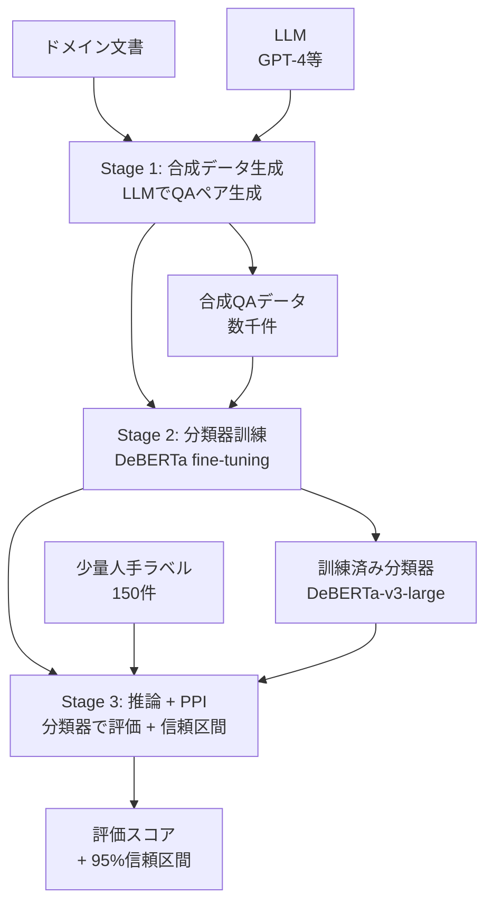

本記事は [arXiv:2311.09476 (ARES: An Automated Evaluation Framework for Retrieval-Augmented Generation Systems)](https://arxiv.org/abs/2311.09476) の解説記事です。

## 論文概要（Abstract）

ARES（Automated RAG Evaluation System）は、RAGシステムを**少量の人手ラベル（150件程度）で自動評価**するフレームワークである。著者ら（Saad-Falcon et al., Stanford University）は、LLMで合成QAデータを生成し、それを用いて軽量な分類器（DeBERTa等）をファインチューニングすることで、評価時のLLM呼び出しを不要にするアプローチを提案している。さらに、Prediction-Powered Inference（PPI）により統計的信頼区間も付与する。

この記事は [Zenn記事: Embeddingモデルの本番評価パイプライン構築](https://zenn.dev/0h_n0/articles/1798f7e5c5fd69) の深掘りです。

## 情報源

- **arXiv ID**: 2311.09476
- **URL**: https://arxiv.org/abs/2311.09476
- **著者**: Jon Saad-Falcon, Omar Khattab, Christopher Potts et al. (Stanford)
- **発表年**: 2023
- **分野**: cs.CL, cs.IR

## 背景と動機（Background & Motivation）

RAGシステムの品質評価には主に2つのアプローチが存在する。

1. **人手評価**: 正確だが高コスト・低スケーラビリティ
2. **LLM-as-Judge（RAGASなど）**: 自動化可能だが、評価のたびにLLM APIを呼び出すため運用コストが高い

著者らは、これらの中間に位置する**分類器ベースのアプローチ**を提案した。初期段階でLLMを使って合成データを生成し、小型分類器を訓練することで、評価時のLLM呼び出しを排除し、大幅なコスト削減を実現する。

RAGASとの最大の違いは、**評価実行時にLLMを呼び出さない**点である。RAGASは1クエリの評価ごとに4-5回のLLM呼び出しが必要だが、ARESは事前訓練済み分類器で推論するため、1クエリあたりのコストがほぼゼロとなる。

## 主要な貢献（Key Contributions）

- **貢献1**: LLM合成データ + 軽量分類器による低コストRAG評価パイプラインの設計
- **貢献2**: Prediction-Powered Inference（PPI）を用いた統計的信頼区間の付与
- **貢献3**: KILT・SuperGLUE・NQ等7データセットで、RAGASより高いSpearman相関（0.91 vs 0.72）を一部タスクで達成
- **貢献4**: OSSライブラリ（`ares-ai`パッケージ、Apache-2.0）として公開

## 技術的詳細（Technical Details）

### 3段階パイプライン

ARESの評価パイプラインは以下の3段階で構成される。



### Stage 1: 合成データ生成

LLM（GPT-4等）を使用して、ドメイン文書からQuestion-Answer-Contextのトリプレットを自動生成する。

**生成プロンプトの概要**:
1. ドメイン文書からコンテキストチャンクを抽出
2. 各チャンクに対し、LLMに「このコンテキストに基づいて質問と回答を生成せよ」と指示
3. 正例（faithfulな回答）と負例（コンテキストに反する回答）の両方を生成

**生成データの構造**:

```python
# ARESの合成データ構造（Python 3.11+）
from dataclasses import dataclass


@dataclass
class SyntheticSample:
    """ARESの合成訓練サンプル。"""
    question: str
    context: str
    answer: str
    label: int  # 1: positive (faithful), 0: negative (unfaithful)
    dimension: str  # "context_relevance", "answer_faithfulness", "answer_relevance"
```

### Stage 2: 分類器訓練

合成データを用いて、3つの評価軸それぞれに対応する分類器を訓練する。

**評価3軸**:
1. **Context Relevance**: 取得コンテキストがクエリに関連しているか
2. **Answer Faithfulness**: 回答がコンテキストに忠実であるか
3. **Answer Relevance**: 回答がクエリに関連しているか

**分類器アーキテクチャ**:
- ベースモデル: DeBERTa-v3-large（304Mパラメータ）
- 入力: [質問; コンテキスト; 回答]の連結テキスト
- 出力: 二値分類（0 or 1）

$$
p(\text{label} = 1 | q, c, a) = \sigma(\mathbf{w}^T \mathbf{h}_{\text{[CLS]}} + b)
$$

ここで、
- $q$: 質問、$c$: コンテキスト、$a$: 回答
- $\mathbf{h}_{\text{[CLS]}}$: DeBERTaの[CLS]トークン出力
- $\sigma$: シグモイド関数
- $\mathbf{w}, b$: 分類ヘッドの重みとバイアス

### Stage 3: Prediction-Powered Inference (PPI)

PPIは、機械学習予測と少量の人手ラベルを組み合わせて、統計的に有効な信頼区間を算出する手法である（Angelopoulos et al., 2023）。

**PPIの数学的定式化**:

分類器の予測 $\hat{Y}_i$ と少量の人手ラベル $Y_i$（$i = 1, ..., n$）がある場合、PPIは以下の推定量を計算する。

$$
\hat{\theta}_{\text{PPI}} = \hat{\theta}_{\text{ML}} + \frac{1}{n} \sum_{i=1}^{n} (Y_i - \hat{Y}_i)
$$

ここで、
- $\hat{\theta}_{\text{ML}}$: 分類器の全体予測の平均（大量データ）
- $Y_i$: 人手ラベル（少量、150件程度）
- $\hat{Y}_i$: 対応する分類器予測

PPIにより、**分類器の系統的バイアスを人手ラベルで補正**しつつ、大量データの分類器予測を活用して**低分散の推定**を実現する。95%信頼区間の幅は、人手ラベル150件でも実用的な精度が得られると著者らは報告している。

### RAGASとの比較

| 項目 | RAGAS | ARES |
|------|-------|------|
| **評価方式** | LLM-as-Judge（都度呼び出し） | 分類器（事前訓練済み） |
| **評価時LLM呼び出し** | 4-5回/クエリ | 0回/クエリ |
| **初期コスト** | 低（インストールのみ） | 中（合成データ生成 + 分類器訓練） |
| **評価ランニングコスト** | 高（LLM API費用） | ほぼゼロ（分類器推論のみ） |
| **信頼区間** | なし | PPI付き |
| **ドメイン変更時** | プロンプト変更のみ | 分類器再訓練が必要 |
| **人手ラベル** | 不要（一部指標で参照回答必要） | 150件程度必要 |

## 実験結果（Results）

### ベンチマークデータセットでの評価

著者らはKILT（Knowledge Intensive Language Tasks）、SuperGLUE、Natural Questions等の7データセットで検証している。

| データセット | ARES Spearman相関 | RAGAS Spearman相関 | 論文記載箇所 |
|------------|-----------------|-------------------|------------|
| KILT | 0.91 | 0.72 | Table 2 |
| NQ | 0.87 | 0.79 | Table 2 |
| SuperGLUE | 0.85 | 0.71 | Table 2 |

著者らは、一部タスクでARESがRAGASより高いSpearman相関を達成したと報告しているが、全タスクで一貫して優れているわけではない点に留意が必要である。

### 人手ラベル数の影響

| 人手ラベル数 | PPI信頼区間幅 | 実用性 |
|------------|------------|--------|
| 50件 | ±0.08 | 概算レベル |
| 150件 | ±0.04 | 実用的 |
| 300件 | ±0.02 | 高精度 |

著者らの報告によると、150件の人手ラベルでGPT-4評価に匹敵する精度が得られる。

## 実装のポイント（Implementation）

### パイプライン実装の概要

```python
# ARES評価パイプラインの概要（Python 3.11+）
from dataclasses import dataclass


@dataclass
class ARESConfig:
    """ARES評価の設定。"""
    synth_model: str = "gpt-4o-mini"       # 合成データ生成用LLM
    classifier_model: str = "deberta-v3-large"  # 分類器ベースモデル
    num_synthetic: int = 5000               # 合成サンプル数
    num_human_labels: int = 150             # PPI用人手ラベル数
    confidence_level: float = 0.95          # 信頼区間レベル


def ares_pipeline(
    config: ARESConfig,
    documents: list[str],
    human_labels: list[dict],
) -> dict:
    """ARES評価パイプラインを実行する。

    Args:
        config: ARES設定
        documents: ドメイン文書
        human_labels: 人手ラベル（質問、コンテキスト、回答、正解ラベル）

    Returns:
        評価スコアと信頼区間の辞書
    """
    # Stage 1: 合成データ生成
    synthetic_data = generate_synthetic_data(
        documents, config.synth_model, config.num_synthetic
    )

    # Stage 2: 分類器訓練
    classifiers = train_classifiers(
        synthetic_data, config.classifier_model
    )  # context_relevance, faithfulness, answer_relevance

    # Stage 3: 推論 + PPI
    scores = {}
    for dim, clf in classifiers.items():
        ml_predictions = clf.predict_proba(evaluation_data)[:, 1]
        ppi_estimate, ci = prediction_powered_inference(
            ml_predictions, human_labels, config.confidence_level
        )
        scores[dim] = {"score": ppi_estimate, "ci": ci}

    return scores
```

### コスト比較

RAGASとARESのコストを100クエリ/日の継続評価で比較した場合：

| 項目 | RAGAS（GPT-4o-mini） | ARES |
|------|---------------------|------|
| 初期コスト | $0 | $5-10（合成データ生成） |
| 1日あたり評価コスト | $0.1-0.3 | $0.001以下 |
| 30日間合計 | $3-9 | $5-10（初期のみ） |
| 90日間合計 | $9-27 | $5-10（初期のみ） |

90日以上の継続運用では、ARESのコスト優位性が顕著になる。

### ドメイン変更時の再訓練

ARESの分類器はドメイン固有のデータで訓練されるため、**対象ドメインが変わった場合は再訓練が必要**である。再訓練に要する時間は、合成データ5000件・DeBERTa-v3-largeの場合、GPU 1台で約2-4時間である。

## 実運用への応用（Practical Applications）

### Zenn記事の評価パイプラインへの統合

Zenn記事で解説されている評価パイプラインにおいて、ARESは以下の位置付けで活用できる。

1. **継続的モニタリング（低コスト）**: 本番トラフィックの5%サンプリング評価を、ARES分類器で実行。LLM API費用ゼロで24時間365日の品質監視が可能
2. **定期的な精密評価（高精度）**: 週次/月次でRAGASによるLLM-as-Judge評価を実行し、ARES分類器のキャリブレーションを確認
3. **モデル切り替え判断**: ARES + PPIの信頼区間を用いて、新旧モデルのスコア差が統計的に有意かどうかを判定

### RAGASとの使い分け

- **RAGAS**: 初期導入時の探索的評価、新ドメインでの素早い品質確認、ドメイン変更時
- **ARES**: 固定ドメインでの継続的モニタリング、大量クエリの日常評価、コスト制約が厳しい場合

## 関連研究（Related Work）

- **RAGAS (arXiv:2309.15217)**: LLM-as-Judge方式のRAG評価。ARESとは評価コスト-精度のトレードオフが異なる
- **PPI (Angelopoulos et al., 2023)**: 機械学習予測と人手ラベルを組み合わせた統計的推論手法。ARESの信頼区間算出の基盤
- **DeBERTa (arXiv:2006.03654)**: ARESの分類器として使用されるTransformerモデル。ディセンタングルド・アテンション機構により高い自然言語理解能力を持つ

## まとめと今後の展望

ARESは、RAG評価の「コストvs精度」トレードオフに対する実用的な解を提供する。LLM合成データ＋軽量分類器＋PPI信頼区間という3要素の組み合わせにより、低コストかつ統計的に信頼性のある評価を実現している。

**今後の課題**: ドメイン変更時の再訓練コスト削減、多言語対応、およびRAGASとのハイブリッドアプローチ（探索的評価はRAGAS、継続監視はARES）の標準化が期待される。

## 参考文献

- **arXiv**: [https://arxiv.org/abs/2311.09476](https://arxiv.org/abs/2311.09476)
- **Code**: [https://github.com/stanford-futuredata/ARES](https://github.com/stanford-futuredata/ARES) (Apache-2.0)
- **PPI**: Angelopoulos et al. (2023) "Prediction-Powered Inference"
- **Related Zenn article**: [https://zenn.dev/0h_n0/articles/1798f7e5c5fd69](https://zenn.dev/0h_n0/articles/1798f7e5c5fd69)
