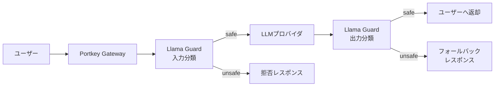

## 論文概要（Abstract）

本記事はarXiv論文 [2312.06674](https://arxiv.org/abs/2312.06674) の解説記事です。

Llama Guardは、Meta AIが2023年12月に発表したLLMベースの入出力安全性分類モデルである。人間とAIの会話において、ユーザープロンプト（入力）とモデルレスポンス（出力）の双方を、MLCommons AI Safetyタクソノミーに基づく6カテゴリで「safe」または「unsafe」に分類する。Llama 2-7Bをベースモデルとしてinstruction-tuningにより安全性分類タスクに特化させ、ToxicChatベンチマークにおいてF1=0.945（プロンプト分類）を達成し、GPT-4やOpenAI Moderation APIを上回る性能を報告している。

この記事は [Zenn記事: Portkey AIゲートウェイのマルチテナント運用：RBAC・予算管理・ガードレール設計](https://zenn.dev/0h_n0/articles/2658d8a7a0e6e3) の深掘りです。

## 情報源

- **arXiv ID**: 2312.06674
- **URL**: [https://arxiv.org/abs/2312.06674](https://arxiv.org/abs/2312.06674)
- **著者**: Hakan Inan, Kartikeya Upasani, Jianfeng Chi, et al.（Meta）
- **発表年**: 2023
- **分野**: cs.CL, cs.AI
- **HuggingFace**: [meta-llama/LlamaGuard-7b](https://huggingface.co/meta-llama/LlamaGuard-7b)
- **ライセンス**: Llama 2 Community License

## 背景と動機（Background & Motivation）

LLMの本番運用において、ユーザーが悪意のあるプロンプトを送信するケース（jailbreak attack）や、モデルが有害なコンテンツを生成するケースは避けられない。従来のコンテンツモデレーションツールにはいくつかの限界があった。

まず、OpenAI Moderation APIやPerspective APIは分類カテゴリが固定されており、組織固有のポリシーに適応できない。例えば金融サービスでは「投資助言」を不安全とするポリシーが必要だが、汎用ツールはこれに対応しない。次に、従来ツールはユーザー入力とモデル出力を別々のパイプラインで処理する設計が多く、会話全体のコンテキストを考慮した判定が困難であった。さらに、ルールベースのフィルタリングは回避が容易であり、適応的な攻撃手法に対して脆弱であった。

著者らはこれらの課題に対し、LLM自体を安全性分類器として活用するアプローチを提案した。LLMの言語理解能力をそのまま安全性判定に転用することで、カスタマイズ性と分類精度の両立を目指している。

## 主要な貢献（Key Contributions）

- **貢献1**: MLCommons AI Safety taxonomyに基づく6カテゴリのリスク分類体系を設計し、プロンプトとレスポンスの双方を統一フレームワークで分類する手法を提案
- **貢献2**: Llama 2-7Bモデルをinstruction-tuningにより安全性分類に特化させ、7Bパラメータという比較的小規模なモデルで既存の商用API（GPT-4ベース判定、OpenAI Moderation API）を上回る分類性能を達成
- **貢献3**: プロンプトテンプレートにタクソノミー定義を埋め込む設計により、再学習なしに分類カテゴリをカスタマイズ可能な柔軟なアーキテクチャを実現

## 技術的詳細（Technical Details）

### 安全性分類の定式化

Llama Guardは、安全性判定を多クラス分類タスクではなく、テキスト生成タスクとして定式化している。これがこの論文の設計上の重要な判断である。

会話$\mathbf{c} = (t_1, t_2, \ldots, t_n)$（$t_i$はユーザーまたはエージェントの発話ターン）と、安全性タクソノミー$\mathcal{T} = \{C_1, C_2, \ldots, C_K\}$が与えられたとき、モデルは以下の関数$f$を学習する：

$$
f(\mathbf{c}, \mathcal{T}) \to (y, S)
$$

ここで、
- $\mathbf{c}$: 分類対象の会話（複数ターン可）
- $\mathcal{T}$: 安全性カテゴリの集合（デフォルトは$K=6$）
- $y \in \{\text{safe}, \text{unsafe}\}$: 安全/不安全の二値判定
- $S \subseteq \mathcal{T}$: $y=\text{unsafe}$の場合に違反するカテゴリの集合

重要な点として、この分類はLLMのテキスト生成として実行される。つまり、モデルは「safe」というトークンまたは「unsafe\nO3」のようなトークン列を自己回帰的に生成する。分類ヘッドを追加するのではなく、生成ベースで判定することで、プロンプトに記載するタクソノミーの変更だけで分類基準をカスタマイズできる。

### MLCommons AI Safety Taxonomy

論文ではMLCommonsのAI Safety Working Groupと協力して定義した6カテゴリを採用している：

| カテゴリ | 内容 | 対象 |
|---------|------|------|
| O1: Violence & Hate | 暴力・ヘイトスピーチ | プロンプト & レスポンス |
| O2: Sexual Content | 性的コンテンツ | プロンプト & レスポンス |
| O3: Guns & Illegal Weapons | 銃器・違法武器 | プロンプト & レスポンス |
| O4: Regulated or Controlled Substances | 規制物質 | プロンプト & レスポンス |
| O5: Suicide & Self-Harm | 自殺・自傷行為 | プロンプト & レスポンス |
| O6: Criminal Planning | 犯罪計画 | プロンプト & レスポンス |

著者らは、プロンプト分類とレスポンス分類で適用すべきカテゴリが異なるケースがあることを指摘している。例えば「銃の安全な保管方法を教えて」というプロンプトは安全だが、これに対して「銃の違法改造方法」を返すレスポンスは不安全である。このような非対称性を単一モデルで扱える点がLlama Guardの設計上の特徴である。

### Instruction-Tuningの手法

ベースモデルにはLlama 2-7Bを使用し、安全性分類タスクのデータセットでinstruction-tuningを実施している。訓練データは以下の構成である（論文Section 3より）：

1. **データソース**: 既存のオープンデータセット（詳細は論文Appendix参照）からプロンプト-レスポンスペアを収集
2. **アノテーション**: 各ペアに対して、6カテゴリの安全性ラベルを付与
3. **訓練フォーマット**: `[INST]`タグで会話とタクソノミーガイドラインを構造化

### プロンプトテンプレート

Llama Guardの入力は以下の形式でフォーマットされる：

```
[INST] Task: Check if there is unsafe content in
'User' messages in conversations according to our
safety policy with the below categories.

<BEGIN UNSAFE CATEGORIES>
O1: Violence and Hate.
...
O6: Criminal Planning.
<END UNSAFE CATEGORIES>

<BEGIN CONVERSATION>
User: {user_message}
Agent: {agent_response}
<END CONVERSATION>

Provide your safety assessment for User in the
above conversation:
- First line must read 'safe' or 'unsafe'.
- If unsafe, a second line must include a comma-separated
  list of violated categories. [/INST]
```

このテンプレートの設計には以下の工夫がある：

- **タクソノミー埋め込み**: カテゴリ定義をプロンプト内に直接記載するため、プロンプトの書き換えだけで分類基準を変更可能
- **ロール指定**: 「User」と「Agent」を明示的に区別し、どちらの発話を評価対象とするかを指定
- **出力フォーマット制約**: 「safe/unsafe + カテゴリ番号」の2行構造を強制し、後段パイプラインでのパース容易性を確保

## アルゴリズム

以下は、Llama Guardの推論パイプラインをPythonで表現した擬似コードである。

```python
from dataclasses import dataclass
from enum import Enum
from typing import Optional


class SafetyCategory(Enum):
    """MLCommons AI Safety taxonomyの6カテゴリ"""
    O1_VIOLENCE_HATE = "O1"
    O2_SEXUAL_CONTENT = "O2"
    O3_GUNS_ILLEGAL_WEAPONS = "O3"
    O4_CONTROLLED_SUBSTANCES = "O4"
    O5_SUICIDE_SELF_HARM = "O5"
    O6_CRIMINAL_PLANNING = "O6"


@dataclass
class SafetyResult:
    """安全性分類の結果を格納するデータクラス

    Attributes:
        is_safe: 安全と判定された場合True
        violated_categories: 違反カテゴリのリスト（unsafeの場合のみ）
        raw_output: モデルの生の出力テキスト
    """
    is_safe: bool
    violated_categories: list[SafetyCategory]
    raw_output: str


def build_prompt(
    conversation: list[dict[str, str]],
    taxonomy: list[SafetyCategory],
    classify_role: str = "User",
) -> str:
    """Llama Guard用のプロンプトを構築する

    Args:
        conversation: 会話履歴。各要素は{"role": "User"|"Agent", "content": str}
        taxonomy: 適用する安全性カテゴリのリスト
        classify_role: 分類対象のロール（"User" or "Agent"）

    Returns:
        フォーマット済みプロンプト文字列
    """
    category_text = "\n".join(
        f"{cat.value}: {cat.name.replace('_', ' ')}"
        for cat in taxonomy
    )
    conversation_text = "\n".join(
        f"{turn['role']}: {turn['content']}"
        for turn in conversation
    )
    return (
        f"[INST] Task: Check if there is unsafe content in "
        f"'{classify_role}' messages in conversations according to "
        f"our safety policy with the below categories.\n\n"
        f"<BEGIN UNSAFE CATEGORIES>\n{category_text}\n"
        f"<END UNSAFE CATEGORIES>\n\n"
        f"<BEGIN CONVERSATION>\n{conversation_text}\n"
        f"<END CONVERSATION>\n\n"
        f"Provide your safety assessment for {classify_role} in "
        f"the above conversation:\n"
        f"- First line must read 'safe' or 'unsafe'.\n"
        f"- If unsafe, a second line must include a comma-separated "
        f"list of violated categories. [/INST]"
    )


def parse_output(raw_output: str) -> SafetyResult:
    """モデル出力をパースして構造化された結果を返す

    Args:
        raw_output: モデルの生テキスト出力（"safe" or "unsafe\nO1,O3"等）

    Returns:
        SafetyResult: パース済みの安全性分類結果
    """
    lines = raw_output.strip().split("\n")
    is_safe = lines[0].strip().lower() == "safe"
    violated: list[SafetyCategory] = []

    if not is_safe and len(lines) > 1:
        category_codes = [c.strip() for c in lines[1].split(",")]
        for code in category_codes:
            for cat in SafetyCategory:
                if cat.value == code:
                    violated.append(cat)
                    break

    return SafetyResult(
        is_safe=is_safe,
        violated_categories=violated,
        raw_output=raw_output,
    )


def classify_safety(
    model,
    tokenizer,
    conversation: list[dict[str, str]],
    classify_role: str = "User",
    max_new_tokens: int = 100,
) -> SafetyResult:
    """Llama Guardによる安全性分類を実行する

    Args:
        model: ロード済みのLlama Guardモデル
        tokenizer: 対応するトークナイザー
        conversation: 分類対象の会話履歴
        classify_role: 分類対象ロール
        max_new_tokens: 生成する最大トークン数

    Returns:
        SafetyResult: 分類結果
    """
    prompt = build_prompt(
        conversation=conversation,
        taxonomy=list(SafetyCategory),
        classify_role=classify_role,
    )
    inputs = tokenizer(prompt, return_tensors="pt").to(model.device)
    outputs = model.generate(
        **inputs,
        max_new_tokens=max_new_tokens,
        pad_token_id=tokenizer.eos_token_id,
    )
    # 入力部分を除いた生成部分のみデコード
    generated = tokenizer.decode(
        outputs[0][inputs["input_ids"].shape[-1]:],
        skip_special_tokens=True,
    )
    return parse_output(generated)
```

## 実装のポイント（Implementation）

### HuggingFace重みのロード

Llama Guardの重みは [meta-llama/LlamaGuard-7b](https://huggingface.co/meta-llama/LlamaGuard-7b) で公開されている。Llama 2 Community Licenseに基づくため、事前にMetaへのアクセスリクエストが必要である。

```python
from transformers import AutoModelForCausalLM, AutoTokenizer

model_id: str = "meta-llama/LlamaGuard-7b"

tokenizer = AutoTokenizer.from_pretrained(model_id)
model = AutoModelForCausalLM.from_pretrained(
    model_id,
    torch_dtype="auto",      # bfloat16が推奨
    device_map="auto",        # マルチGPU自動分散
)
```

### 量子化推論

7Bモデルはfull precisionで約14GBのGPUメモリを必要とする。推論レイテンシやメモリ制約が厳しい環境では、量子化が有効である。

```python
from transformers import BitsAndBytesConfig

quantization_config = BitsAndBytesConfig(
    load_in_4bit=True,
    bnb_4bit_compute_dtype="bfloat16",
    bnb_4bit_quant_type="nf4",
)

model = AutoModelForCausalLM.from_pretrained(
    model_id,
    quantization_config=quantization_config,
    device_map="auto",
)
```

著者らは量子化による精度劣化について論文中で詳細な評価を行っていないが、4bit量子化によりGPUメモリ使用量を約4GBまで削減可能であり、単一のNVIDIA T4（16GB）でも動作する。ただし、生成品質への影響は自身のユースケースで検証すべきである。

### 推論時の注意点

- **最大入力長**: Llama 2-7Bのコンテキストウィンドウは4096トークンであり、長い会話履歴を入力する場合はトランケーションが必要
- **バッチ処理**: 複数の会話を同時に分類する場合、パディングとバッチ推論で効率化可能
- **出力の決定論性**: `temperature=0`かつ`do_sample=False`で再現性のある結果を得られる

## Production Deployment Guide

Llama Guardは実装セクションがあり、HuggingFace上で重みが公開されているため、以下にAWS上でのプロダクションデプロイ構成を示す。

### AWS実装パターン（コスト最適化重視）

**トラフィック量別の推奨構成**:

| 構成 | トラフィック | アーキテクチャ | 月額コスト概算 |
|------|-------------|---------------|--------------|
| Small | ~100 req/日 | Lambda + SageMaker Serverless | $80-200 |
| Medium | ~1,000 req/日 | ECS Fargate + SageMaker Real-time | $400-900 |
| Large | 10,000+ req/日 | EKS + Spot GPU + SageMaker Multi-Model | $2,500-6,000 |

**Small構成（~100 req/日）**:
- API Gateway + Lambda: リクエストルーティング（$5/月）
- SageMaker Serverless Inference: Llama Guard 7B 4bit量子化（$50-150/月、推論リクエスト課金のみ）
- DynamoDB: 分類結果キャッシュ（$5/月、On-Demand）
- CloudWatch: ログ・メトリクス（$10/月）

**Medium構成（~1,000 req/日）**:
- ALB + ECS Fargate: APIサーバー（$80/月、0.5vCPU x 2タスク）
- SageMaker Real-time Endpoint: ml.g5.xlarge、1インスタンス（$250/月）
- ElastiCache Redis: 分類結果キャッシュ（$50/月、cache.t3.micro）
- S3 + CloudWatch: ログ保存・監視（$20/月）

**Large構成（10,000+ req/日）**:
- EKS + Karpenter: APIサーバーオーケストレーション（$200/月）
- GPU Spot Instances: g5.xlarge x 2-4台（$800-1,600/月、Spot利用で最大70%削減）
- SageMaker Multi-Model Endpoint: 複数バージョンのLlama Guard（$500-1,000/月）
- ElastiCache Redis Cluster: 高可用性キャッシュ（$200/月）
- CloudWatch + X-Ray: フル監視（$50/月）

**コスト削減テクニック**:
- SageMaker Savings Plans（1年コミット）で最大64%削減
- GPU Spot Instances活用で最大70%削減
- 分類結果のキャッシュにより同一プロンプトの再分類を回避（Redis TTL: 1時間）
- 4bit量子化で必要なGPUサイズを削減（g5.2xlarge → g5.xlarge）

※ 上記コストは2026年3月時点のAWS ap-northeast-1（東京）リージョン料金に基づく概算値。実際のコストはトラフィックパターン、リージョン、バースト使用量により変動する。最新料金はAWS料金計算ツールで確認を推奨。

### Terraformインフラコード

**Small構成（Serverless）**:

```hcl
# Llama Guard Serverless Deployment
# Lambda + SageMaker Serverless + DynamoDB

terraform {
  required_version = ">= 1.9"
  required_providers {
    aws = { source = "hashicorp/aws", version = "~> 5.80" }
  }
}

provider "aws" {
  region = "ap-northeast-1"
}

# --- IAM ---
resource "aws_iam_role" "lambda_role" {
  name = "llama-guard-lambda-role"
  assume_role_policy = jsonencode({
    Version = "2012-10-17"
    Statement = [{
      Action = "sts:AssumeRole"
      Effect = "Allow"
      Principal = { Service = "lambda.amazonaws.com" }
    }]
  })
}

resource "aws_iam_role_policy" "lambda_policy" {
  name = "llama-guard-lambda-policy"
  role = aws_iam_role.lambda_role.id
  policy = jsonencode({
    Version = "2012-10-17"
    Statement = [
      {
        Effect   = "Allow"
        Action   = ["sagemaker:InvokeEndpoint"]
        Resource = aws_sagemaker_endpoint.llama_guard.arn
      },
      {
        Effect = "Allow"
        Action = [
          "dynamodb:GetItem",
          "dynamodb:PutItem"
        ]
        Resource = aws_dynamodb_table.cache.arn
      },
      {
        Effect = "Allow"
        Action = [
          "logs:CreateLogGroup",
          "logs:CreateLogStream",
          "logs:PutLogEvents"
        ]
        Resource = "arn:aws:logs:*:*:*"
      }
    ]
  })
}

# --- DynamoDB（分類結果キャッシュ） ---
resource "aws_dynamodb_table" "cache" {
  name         = "llama-guard-cache"
  billing_mode = "PAY_PER_REQUEST" # コスト最適: On-Demand
  hash_key     = "prompt_hash"

  attribute {
    name = "prompt_hash"
    type = "S"
  }

  ttl {
    attribute_name = "expires_at"
    enabled        = true
  }

  server_side_encryption {
    enabled = true # KMS暗号化
  }
}

# --- Lambda ---
resource "aws_lambda_function" "classifier" {
  function_name = "llama-guard-classifier"
  role          = aws_iam_role.lambda_role.arn
  handler       = "handler.lambda_handler"
  runtime       = "python3.12"
  timeout       = 60 # SageMaker呼び出しのため十分なタイムアウト
  memory_size   = 256

  filename         = "lambda_package.zip"
  source_code_hash = filebase64sha256("lambda_package.zip")

  environment {
    variables = {
      SAGEMAKER_ENDPOINT = aws_sagemaker_endpoint.llama_guard.name
      CACHE_TABLE        = aws_dynamodb_table.cache.name
    }
  }

  tracing_config {
    mode = "Active" # X-Ray有効化
  }
}

# --- CloudWatch Alarm（コスト監視） ---
resource "aws_cloudwatch_metric_alarm" "lambda_errors" {
  alarm_name          = "llama-guard-lambda-errors"
  comparison_operator = "GreaterThanThreshold"
  evaluation_periods  = 2
  metric_name         = "Errors"
  namespace           = "AWS/Lambda"
  period              = 300
  statistic           = "Sum"
  threshold           = 10
  alarm_description   = "Lambda error rate exceeded threshold"

  dimensions = {
    FunctionName = aws_lambda_function.classifier.function_name
  }
}
```

**Large構成（Container + GPU）**:

```hcl
# Llama Guard EKS + Spot GPU Deployment

module "eks" {
  source  = "terraform-aws-modules/eks/aws"
  version = "~> 20.31"

  cluster_name    = "llama-guard-cluster"
  cluster_version = "1.31"

  vpc_id     = module.vpc.vpc_id
  subnet_ids = module.vpc.private_subnets

  # Karpenter用: Spot GPU自動スケーリング
  cluster_endpoint_public_access = true
}

# Karpenter NodePool: Spot GPU優先
resource "kubectl_manifest" "karpenter_nodepool" {
  yaml_body = yamlencode({
    apiVersion = "karpenter.sh/v1"
    kind       = "NodePool"
    metadata   = { name = "gpu-spot" }
    spec = {
      template = {
        spec = {
          requirements = [
            { key = "karpenter.sh/capacity-type", operator = "In", values = ["spot", "on-demand"] },
            { key = "node.kubernetes.io/instance-type", operator = "In", values = ["g5.xlarge", "g5.2xlarge"] },
          ]
          nodeClassRef = { name = "default" }
        }
      }
      limits   = { cpu = "32", memory = "128Gi" }
      disruption = {
        consolidationPolicy = "WhenEmpty"
        consolidateAfter    = "30s"
      }
    }
  })
}

# AWS Budgets: 月次予算アラート
resource "aws_budgets_budget" "monthly" {
  name         = "llama-guard-monthly"
  budget_type  = "COST"
  limit_amount = "5000"
  limit_unit   = "USD"
  time_unit    = "MONTHLY"

  notification {
    comparison_operator       = "GREATER_THAN"
    threshold                 = 80
    threshold_type            = "PERCENTAGE"
    notification_type         = "ACTUAL"
    subscriber_email_addresses = ["ops-team@example.com"]
  }
}
```

### 運用・監視設定

**CloudWatch Logs Insightsクエリ**:

```
# Llama Guard分類レイテンシ分析（P95/P99）
fields @timestamp, @duration, classification_result
| filter function_name = "llama-guard-classifier"
| stats percentile(@duration, 95) as p95_ms,
        percentile(@duration, 99) as p99_ms,
        avg(@duration) as avg_ms,
        count(*) as total_requests
  by bin(1h) as time_bucket
| sort time_bucket desc
```

**CloudWatchアラーム設定（Python）**:

```python
import boto3


def setup_sagemaker_alarms(endpoint_name: str, sns_topic_arn: str) -> None:
    """SageMaker EndpointのCloudWatchアラームを設定する

    Args:
        endpoint_name: SageMakerエンドポイント名
        sns_topic_arn: 通知先SNSトピックARN
    """
    cw = boto3.client("cloudwatch")
    cw.put_metric_alarm(
        AlarmName=f"{endpoint_name}-invocation-latency",
        MetricName="ModelLatency",
        Namespace="AWS/SageMaker",
        Statistic="Average",
        Period=300,
        EvaluationPeriods=3,
        Threshold=5000000,  # 5秒（マイクロ秒単位）
        ComparisonOperator="GreaterThanThreshold",
        Dimensions=[
            {"Name": "EndpointName", "Value": endpoint_name},
            {"Name": "VariantName", "Value": "AllTraffic"},
        ],
        AlarmActions=[sns_topic_arn],
    )
```

**X-Rayトレーシング設定（Python）**:

```python
from aws_xray_sdk.core import xray_recorder, patch_all

# boto3自動計装
patch_all()

@xray_recorder.capture("classify_safety")
def classify_with_tracing(
    conversation: list[dict[str, str]],
    endpoint_name: str,
) -> dict:
    """X-Rayトレース付きで安全性分類を実行する

    Args:
        conversation: 会話履歴
        endpoint_name: SageMakerエンドポイント名

    Returns:
        分類結果辞書
    """
    subsegment = xray_recorder.current_subsegment()
    subsegment.put_annotation("classify_role", "User")
    subsegment.put_metadata("conversation_turns", len(conversation))

    runtime = boto3.client("sagemaker-runtime")
    response = runtime.invoke_endpoint(
        EndpointName=endpoint_name,
        ContentType="application/json",
        Body='{"conversation": ' + str(conversation) + '}',
    )
    return response
```

**Cost Explorer自動レポート（Python）**:

```python
import boto3
from datetime import datetime, timedelta


def get_daily_cost_report() -> dict:
    """前日のLlama Guard関連AWSコストを取得する

    Returns:
        サービス別コスト内訳辞書
    """
    ce = boto3.client("ce")
    yesterday = (datetime.utcnow() - timedelta(days=1)).strftime("%Y-%m-%d")
    today = datetime.utcnow().strftime("%Y-%m-%d")

    response = ce.get_cost_and_usage(
        TimePeriod={"Start": yesterday, "End": today},
        Granularity="DAILY",
        Metrics=["UnblendedCost"],
        Filter={
            "Tags": {
                "Key": "Project",
                "Values": ["llama-guard"],
            }
        },
        GroupBy=[{"Type": "DIMENSION", "Key": "SERVICE"}],
    )
    return response["ResultsByTime"][0]["Groups"]
```

### コスト最適化チェックリスト

**アーキテクチャ選択**:
- [ ] トラフィック量に応じた構成を選択（Small: Serverless / Medium: Hybrid / Large: Container）
- [ ] キャッシュ戦略を導入（Redis/DynamoDB TTLベースの分類結果キャッシュ）
- [ ] 非同期処理可能なワークロードはSQS + バッチ推論に分離

**リソース最適化**:
- [ ] GPU: Spot Instances優先（g5.xlarge Spot: 最大70%削減）
- [ ] SageMaker Savings Plans: 1年コミットで最大64%削減
- [ ] Lambda: メモリサイズをPower Tuningで最適化（256MB推奨）
- [ ] ECS/EKS: Karpenterでアイドル時自動スケールダウン
- [ ] 4bit量子化でGPUインスタンスサイズを1段階縮小

**LLMコスト削減**:
- [ ] 分類結果キャッシュ（同一プロンプトの再分類回避）
- [ ] バッチ推論（SageMaker Batch Transform: 非リアルタイム処理で30%削減）
- [ ] モデル選択: 簡易判定はルールベース、複雑な判定のみLlama Guard
- [ ] トークン数制限: 会話履歴を直近Nターンに制限（コンテキスト長4096トークン上限）

**監視・アラート**:
- [ ] AWS Budgets: 月次予算アラート（80%到達で通知）
- [ ] CloudWatch: SageMakerレイテンシ・エラー率アラーム
- [ ] Cost Anomaly Detection: 異常コスト自動検知
- [ ] 日次コストレポート: Cost Explorer APIで自動取得・SNS通知

**リソース管理**:
- [ ] 未使用SageMakerエンドポイントの自動削除
- [ ] タグ戦略: `Project=llama-guard`で全リソースにタグ付け
- [ ] CloudWatch Logs: 保持期間90日のライフサイクルポリシー
- [ ] 開発環境: 夜間・休日のSageMakerエンドポイント停止スケジュール
- [ ] S3: 推論ログの90日後Glacier移行

## 実験結果（Results）

### ToxicChatベンチマーク

著者らは、ToxicChatデータセットを用いてプロンプト分類の性能を評価している。以下は論文Table 5より引用した結果である。

| モデル | AUPRC | F1 | Precision | Recall |
|--------|-------|----|-----------|--------|
| OpenAI Moderation API | 0.588 | 0.542 | 0.852 | 0.397 |
| Llama Guard | **0.961** | **0.945** | 0.932 | 0.958 |
| GPT-4 (zero-shot) | 0.837 | 0.730 | 0.624 | 0.877 |

著者らは、Llama GuardがToxicChatのプロンプト分類においてF1=0.945を達成し、OpenAI Moderation API（F1=0.542）およびGPT-4のzero-shot分類（F1=0.730）を大幅に上回ったと報告している。特にAUPRC（Area Under Precision-Recall Curve）においても0.961と高い値を示しており、閾値設定に依存しない全体的な分類品質の高さが確認されている。

### OpenAI Moderation Eval

論文Table 4では、OpenAIが公開するModeration Evaluation datasetでの比較も報告されている。

| モデル | AUPRC（Prompt） | AUPRC（Response） |
|--------|-----------------|-------------------|
| OpenAI Moderation API | 0.764 | 0.856 |
| Llama Guard | 0.825 | 0.871 |

レスポンス分類においてもLlama Guardは高い性能を示しているが、プロンプト分類ほどの差は見られない。著者らはこの点について、レスポンス分類は比較的容易なタスクであり、モデル間の性能差が小さくなる傾向があると説明している。

### 性能分析

著者らが報告している注目すべき点：

- **ゼロショット転移性**: 訓練時に使用していないタクソノミーカテゴリに対しても、プロンプトに定義を記載するだけで一定の分類性能を発揮する
- **カテゴリ間の性能差**: Violence & Hate（O1）やSexual Content（O2）は高精度だが、Criminal Planning（O6）は相対的に低い（境界が曖昧なため）
- **マルチターン対応**: 会話のコンテキストを考慮した分類が可能であり、単一ターンのみの判定と比較して精度が向上する

## 実運用への応用（Practical Applications）

### AIゲートウェイでのガードレール統合

Zenn記事で解説されているPortkey AIゲートウェイのガードレール設計において、Llama Guardは入出力フィルタとして以下のように統合できる：



**入力ガードレール**: ユーザープロンプトがLLMに到達する前にLlama Guardで分類し、unsafe判定の場合はLLM呼び出しをスキップしてコスト削減とリスク低減を同時に実現する。

**出力ガードレール**: LLMのレスポンスをユーザーに返却する前にLlama Guardで分類し、unsafe判定の場合は事前定義したフォールバックレスポンスを返却する。

**マルチテナント対応**: Portkey AIゲートウェイのRBAC機能と組み合わせることで、テナントごとに異なるタクソノミーをプロンプトテンプレートで定義し、組織固有のポリシーを適用できる。これはLlama Guardのプロンプトベースのカスタマイズ性を活かした運用パターンである。

**レイテンシへの影響**: 7Bモデルの推論は4bit量子化＋GPU使用時で約200-500msを要するため（ハードウェアに依存）、入出力双方の分類で合計400ms-1秒のオーバーヘッドが生じる。レイテンシ要件が厳しい場合は、入力分類のみ同期実行し、出力分類は非同期で実行する設計も検討に値する。

## 制約と限界

著者ら自身が論文で報告している制約は以下のとおりである：

- **英語のみの評価**: 実験は英語データセットのみで実施されており、多言語での性能は未検証。日本語を含む非英語環境での利用には追加検証が必要
- **7Bモデルのレイテンシ**: リアルタイム分類には十分だが、大量リクエストの同時処理にはGPUリソースが必要
- **敵対的攻撃への頑健性**: 高度なjailbreak手法（例：多段階のプロンプトインジェクション）に対する頑健性は限定的。著者らはadversarial robustnessの改善を今後の課題として挙げている
- **タクソノミーの粒度**: 6カテゴリのタクソノミーはベースラインとして有用だが、ドメイン固有の細粒度な分類（例：医療分野の倫理的判断）には不十分な場合がある

## 関連研究（Related Work）

- **WildGuard（Han et al., 2024）**: Llama Guardと同様のLLMベースアプローチだが、Wild（実環境）データセットに特化した訓練を行い、jailbreak検出の精度向上を主眼としている。Llama Guardと比較して、adversarial攻撃への頑健性が改善されていると報告されている
- **ShieldLM（Zhao et al., 2024）**: 多言語対応の安全性分類モデル。Llama Guardが英語のみの評価であるのに対し、中国語を含む複数言語での評価を実施している
- **OpenAI Moderation API**: ルールベース＋分類モデルのハイブリッドアプローチ。Llama Guardと比較してレイテンシは低いが、カスタマイズ性に制限がある。論文の実験ではLlama Guardに劣後する性能が報告されている
- **NeMo Guardrails（NVIDIA, 2023）**: プログラマブルなガードレールフレームワーク。LLMの入出力を制御するColanglanguageを提供しており、Llama Guardのようなモデルベースの分類器と組み合わせて使用可能

## まとめと今後の展望

Llama Guardは、LLM自体を安全性分類器として活用するアプローチにより、カスタマイズ性と高い分類精度を両立させたモデルである。ToxicChatベンチマークでF1=0.945を達成し、既存の商用APIを上回る性能が報告されている（論文Table 5より）。プロンプトテンプレートにタクソノミー定義を埋め込む設計は、組織ごとに異なるポリシーを柔軟に適用できるため、AIゲートウェイのガードレール機能としての実用性が高い。

一方で、英語以外の言語対応、adversarial robustnessの改善、より細粒度なタクソノミーの設計は引き続き課題である。後続研究であるLlama Guard 2（2024年）やLlama Guard 3（2024年）では、多言語対応や分類カテゴリの拡張が進められている。

今後の方向性として、複数のガードレールモデルを組み合わせたアンサンブル分類、ドメイン固有データでのfine-tuning、およびレイテンシを削減するための蒸留モデル（例：2-3Bパラメータ）の開発が考えられる。

## 参考文献

- **arXiv**: [https://arxiv.org/abs/2312.06674](https://arxiv.org/abs/2312.06674)
- **HuggingFace**: [meta-llama/LlamaGuard-7b](https://huggingface.co/meta-llama/LlamaGuard-7b)
- **Related Zenn article**: [Portkey AIゲートウェイのマルチテナント運用：RBAC・予算管理・ガードレール設計](https://zenn.dev/0h_n0/articles/2658d8a7a0e6e3)
- Han, S., et al. (2024). "WildGuard: Open One-Stop Moderation Tools for Safety Risks, Jailbreaks, and Refusals of LLMs." arXiv:2406.18495
- Zhao, Y., et al. (2024). "ShieldLM: Empowering LLMs as Aligned, Customizable Safety Detectors." arXiv:2402.16444
- Rebedea, T., et al. (2023). "NeMo Guardrails: A Toolkit for Controllable and Safe LLM Applications with Programmable Rails." arXiv:2310.10501
