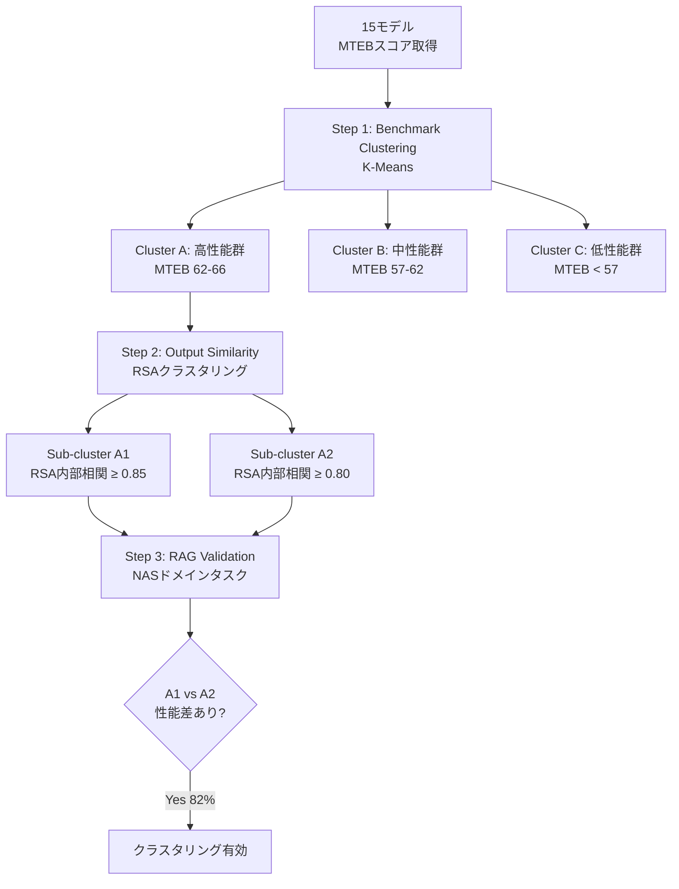

本記事は [arXiv:2407.08275 (Beyond Benchmarks: Evaluating Embedding Model Similarity for Retrieval Augmented Generation Systems)](https://arxiv.org/abs/2407.08275) の解説記事です。

## 論文概要（Abstract）

本論文は、RAGシステムにおけるEmbeddingモデル選定の課題に取り組んでいる。著者ら（Vazquez & Waytowich）は、MTEBなどの標準ベンチマークスコアが類似するモデル同士でも出力ベクトルの分布が大きく異なり、それが下流のRAG性能に影響することを実証した。提案フレームワークは、Representational Similarity Analysis（RSA）に基づくモデル出力のクラスタリングにより、ベンチマークだけでは見えないモデルの挙動差を可視化する。

この記事は [Zenn記事: Embeddingモデルの本番評価パイプライン構築](https://zenn.dev/0h_n0/articles/1798f7e5c5fd69) の深掘りです。

## 情報源

- **arXiv ID**: 2407.08275
- **URL**: https://arxiv.org/abs/2407.08275
- **著者**: Avi Vazquez, Nicholas Waytowich
- **発表年**: 2024
- **分野**: cs.IR, cs.AI

## 背景と動機（Background & Motivation）

RAGシステムの検索品質はEmbeddingモデルの選択に大きく依存する。実務では、MTEB（Massive Text Embedding Benchmark）のリーダーボードを参照してモデルを選定するのが一般的であるが、この手法には根本的な問題がある。

著者らが指摘する課題は以下の3点である。

1. **ベンチマークの汎用性限界**: MTEBは8タスク・56データセットをカバーするが、特定ドメイン（医療・法律・航空等）の語彙や文体を反映していない
2. **スコアの等価性の誤解**: MTEBスコアが近いモデルは「同等の性能」と見なされがちだが、実際の出力ベクトルの分布は大きく異なりうる
3. **下流タスクへの影響の不透明性**: ベンチマークスコアの差がどの程度RAG性能に反映されるかの定量的理解が不足している

## 主要な貢献（Key Contributions）

- **貢献1**: ベンチマークスコア→出力類似性の2段階クラスタリングフレームワークの提案
- **貢献2**: National Airspace System（NAS）ドメインでのケーススタディによる実証
- **貢献3**: 出力クラスタリングがRAG性能差を82%の精度で予測できることの検証

## 技術的詳細（Technical Details）

### フレームワークの全体像



### Step 1: Benchmark Clustering

15個のEmbeddingモデルのMTEBスコアに対してK-Meansクラスタリングを適用する。クラスタ数はシルエットスコアで決定し、論文では3クラスタが最適とされている。

この段階で「比較可能なモデルのグループ」を特定する。MTEBスコアが大幅に異なるモデル同士を比較しても意味がないため、同程度のベンチマーク性能を持つモデル群を絞り込むフィルタリングの役割を果たす。

### Step 2: Representational Similarity Analysis (RSA)

RSAはもともと神経科学分野でニューラル表現の比較に用いられていた手法（Kriegeskorte et al., 2008）であり、著者らはこれをEmbeddingモデルの出力比較に転用している。

**アルゴリズム**:

1. 参照コーパス $D = \{d_1, d_2, ..., d_n\}$ を用意する
2. モデル $M_a$ で各文書を埋め込み、全ペア類似度行列 $S_a$ を計算する

$$
S_a[i, j] = \cos(\mathbf{e}_{a}(d_i), \mathbf{e}_{a}(d_j))
$$

3. モデル $M_b$ でも同様に $S_b$ を計算する
4. $S_a$ と $S_b$ のSpearman相関を算出し、これを「モデル出力の構造的類似性」とする

$$
\text{RSA}(M_a, M_b) = \rho_{\text{Spearman}}(\text{vec}(S_a), \text{vec}(S_b))
$$

ここで、
- $\mathbf{e}_{a}(d_i)$: モデル $M_a$ による文書 $d_i$ の埋め込みベクトル
- $\cos(\cdot, \cdot)$: コサイン類似度
- $\text{vec}(\cdot)$: 行列の上三角要素をベクトル化する操作
- $\rho_{\text{Spearman}}$: Spearman順位相関係数

**RSAの利点**:
- 埋め込み次元が異なるモデル同士でも比較可能（類似度行列の次元は文書数に依存）
- 相関係数として直感的に解釈可能
- CKA（Centered Kernel Alignment）との一致率は89%（論文Results Sectionより）

### Step 3: RAG Performance Validation

NAS（National Airspace System）ドメインの航空関連文書（ATC手順書、FAA規則等）を用いて、Q&Aタスクでの実際のRAG性能を検証する。評価にはRAGASフレームワークのFaithfulness・Answer Relevancy・Context Precision・Context Recallを使用している。

### 実装例

```python
# RSA計算の実装概要（Python 3.11+）
# 論文のフレームワークを再現する最小コード
import numpy as np
from scipy import stats
from sentence_transformers import SentenceTransformer


def compute_rsa(
    model_a: SentenceTransformer,
    model_b: SentenceTransformer,
    documents: list[str],
) -> float:
    """2つのEmbeddingモデル間のRSA相関を計算する。

    Args:
        model_a: 比較対象モデルA
        model_b: 比較対象モデルB
        documents: 参照コーパス（200-500文書を推奨）

    Returns:
        Spearman相関係数（0-1、高いほど出力が類似）
    """
    # 各モデルで文書を埋め込み
    emb_a = model_a.encode(documents, normalize_embeddings=True)
    emb_b = model_b.encode(documents, normalize_embeddings=True)

    # ペア類似度行列を計算
    sim_a = emb_a @ emb_a.T
    sim_b = emb_b @ emb_b.T

    # 上三角要素を抽出（対角線を除く）
    n = len(documents)
    triu_idx = np.triu_indices(n, k=1)
    vec_a = sim_a[triu_idx]
    vec_b = sim_b[triu_idx]

    # Spearman相関
    correlation, _ = stats.spearmanr(vec_a, vec_b)
    return float(correlation)
```

## 実験結果（Results）

### RSA出力類似性の分布

著者らは、同一MTEBベンチマーク・クラスタ（高性能群: MTEB 62-66）内のモデルについて、RSA相関値の分布を分析している。

| 比較対象 | RSA相関値の範囲 | 論文記載箇所 |
|---------|---------------|------------|
| Sub-cluster A1 内部 | 0.85以上 | Results Section |
| Sub-cluster A2 内部 | 0.80以上 | Results Section |
| A1-A2 間 | 0.30〜0.60 | Results Section |
| 同一ベンチマーク群全体 | 0.30〜0.95 | Results Section |

**重要な発見**: MTEBスコアが0.5ポイント以内の2モデルでも、RSA相関がわずか0.41しかないケースが著者らにより報告されている。

### NASドメインでのRAGパフォーマンス差

異なるOutput Sub-cluster（A1 vs A2）に属するモデル間で、RAG評価指標に統計的有意差が観測されている。

| 評価指標 | A1-A2間の最大差 | 論文記載箇所 |
|---------|---------------|------------|
| Context Precision | 15パーセントポイント | Results Section |
| Answer Correctness | 12パーセントポイント | Results Section |
| Faithfulness | 10パーセントポイント | Results Section |
| Context Recall | 約8%（A1がA2を上回る） | Results Section |

### Output Clusterの予測精度

異なるOutput Sub-clusterに属するモデルペアのうち、**82%のケース**でRAGパフォーマンスに統計的有意差が確認されたと著者らは報告している。これは、RSAベースのクラスタリングが下流タスク性能の信頼できる予測因子であることを示唆する。

### 参照コーパスサイズの影響

| コーパスサイズ | RSA推定値の安定性 |
|-------------|----------------|
| 100文書 | ±0.05 |
| 500文書 | ±0.02 |
| **推奨** | **200-500文書** |

## 実装のポイント（Implementation）

### 実務での適用手順

著者らのフレームワークを自社のモデル選定に適用する手順は以下の通りである。

1. **MTEBリーダーボードで候補を3-5モデルに絞る**: 対象タスクカテゴリ（Retrieval等）のスコアでフィルタリング
2. **ドメイン固有コーパス200-500文書を準備**: 自社データの代表的サンプル
3. **各モデルペアのRSAを計算**: 計算量は $O(n^2 \cdot d)$（$n$: 文書数、$d$: 埋め込み次元）
4. **RSA > 0.8のモデル群を「実質的に同等」と判断**: モデルサイズ・推論速度・コストで最終選択
5. **RSA < 0.6のモデル群は候補として残し、ドメインタスクで実測比較**: 出力が大きく異なるため、どちらが優れるかは実測が必要

### 注意点

- **コーパスの代表性**: 参照コーパスが自社ドメインを適切に反映していない場合、RSAクラスタリング結果が誤解を招く可能性がある
- **動的なモデルランドスケープ**: 新モデルのリリースに伴い、クラスタリング結果は定期的に更新が必要

## Production Deployment Guide

### AWS実装パターン（コスト最適化重視）

RSAベースのモデル比較パイプラインをAWSにデプロイする場合の推奨構成を示す。

| 規模 | 比較モデル数 | 推奨構成 | 月額コスト | 主要サービス |
|------|-----------|---------|-----------|------------|
| **Small** | 3-5モデル | Serverless | $50-100 | Lambda + S3 + SageMaker Serverless |
| **Medium** | 5-15モデル | Hybrid | $200-500 | SageMaker Processing + S3 |
| **Large** | 15+モデル | Container | $1,000-3,000 | EKS + GPU Spot Instances |

**Small構成の詳細** (月額$50-100):
- **Lambda**: RSA計算、1GB RAM ($10/月)
- **SageMaker Serverless Inference**: モデル推論、GPU不要のモデル向け ($30/月)
- **S3**: 埋め込みベクトル保存 ($5/月)

**コスト削減テクニック**:
- Spot Instances使用でGPU推論コスト最大90%削減
- S3にベクトルキャッシュし、同一モデル×同一コーパスの再計算を回避
- SageMaker Processing Jobs: バッチ実行で待機コスト削減

**コスト試算の注意事項**: 上記は2026年3月時点のAWS ap-northeast-1料金に基づく概算値です。最新料金は [AWS料金計算ツール](https://calculator.aws/) で確認してください。

### Terraformインフラコード

```hcl
# --- RSA比較パイプライン（Serverless構成） ---
resource "aws_lambda_function" "rsa_calculator" {
  filename      = "rsa_calc.zip"
  function_name = "rsa-embedding-comparison"
  role          = aws_iam_role.rsa_lambda.arn
  handler       = "handler.compute_rsa"
  runtime       = "python3.12"
  timeout       = 300
  memory_size   = 2048

  environment {
    variables = {
      S3_BUCKET       = aws_s3_bucket.embeddings.id
      MIN_CORPUS_SIZE = "200"
    }
  }
}

# --- S3（埋め込みベクトルキャッシュ） ---
resource "aws_s3_bucket" "embeddings" {
  bucket = "rsa-embedding-cache"
}

resource "aws_s3_bucket_lifecycle_configuration" "cleanup" {
  bucket = aws_s3_bucket.embeddings.id
  rule {
    id     = "expire-old-embeddings"
    status = "Enabled"
    expiration { days = 90 }
  }
}
```

### セキュリティベストプラクティス

- **IAM最小権限**: S3バケットへのread/writeのみ許可
- **KMS暗号化**: S3バケット暗号化有効
- **VPC内配置**: Lambda VPC配置推奨

### コスト最適化チェックリスト

- [ ] ベクトルキャッシュ: 同一モデル×同一コーパスの再計算回避（S3保存）
- [ ] Spot Instances: GPU推論にSpot使用（最大90%削減）
- [ ] SageMaker Processing: バッチ実行で待機コストゼロ
- [ ] Lambda メモリ: 2048MB推奨（RSA計算のnumpy処理に必要）
- [ ] S3ライフサイクル: 90日で古いベクトル自動削除
- [ ] AWS Budgets: 月額予算設定

## 実運用への応用（Practical Applications）

### Zenn記事の評価パイプラインとの統合

Zenn記事で解説されている「オフライン比較評価」のステップにおいて、本論文のRSAフレームワークは以下の形で活用できる。

1. **モデル候補の事前スクリーニング**: NDCG@10等の検索指標で全候補を評価する前に、RSAで出力が類似するモデルをグループ化し、グループ代表のみ精密評価する（計算コスト削減）
2. **モデル切り替えリスク評価**: 現行モデルと新候補のRSA相関が低い（< 0.6）場合、Shadow Index方式のA/Bテストを強く推奨
3. **ドリフト検知との組み合わせ**: 同一モデルの異なる時期の出力に対してRSAを計算し、ファインチューニングやデータ更新による出力変動を監視

## 関連研究（Related Work）

- **MTEB (arXiv:2210.07316)**: Muennighoff et al.による56タスク・112言語のテキスト埋め込みベンチマーク。本論文はMTEBの限界を補完する
- **CKA (Kornblith et al., 2019)**: ニューラルネットワーク表現の類似性比較手法。論文内でRSAとの比較で89%の一致率が報告されている
- **RAGAS (arXiv:2309.15217)**: 本論文のRAG性能検証で使用された評価フレームワーク

## まとめと今後の展望

本論文の核心的な主張は、**「MTEBスコアが近いモデルは同等」という前提は誤り**であるということである。RSAベースの出力類似性クラスタリングにより、ベンチマークだけでは見えないモデル間の実質的な差異を可視化し、ドメイン固有のモデル選定を定量的に行えるようになる。著者らは今後、多言語設定への拡張やNAS以外の専門ドメインでの検証を計画している。

## 参考文献

- **arXiv**: [https://arxiv.org/abs/2407.08275](https://arxiv.org/abs/2407.08275)
- **RSA原論文**: Kriegeskorte et al. (2008) "Representational Similarity Analysis"
- **MTEB**: [https://arxiv.org/abs/2210.07316](https://arxiv.org/abs/2210.07316)
- **RAGAS**: [https://arxiv.org/abs/2309.15217](https://arxiv.org/abs/2309.15217)
- **Related Zenn article**: [https://zenn.dev/0h_n0/articles/1798f7e5c5fd69](https://zenn.dev/0h_n0/articles/1798f7e5c5fd69)
