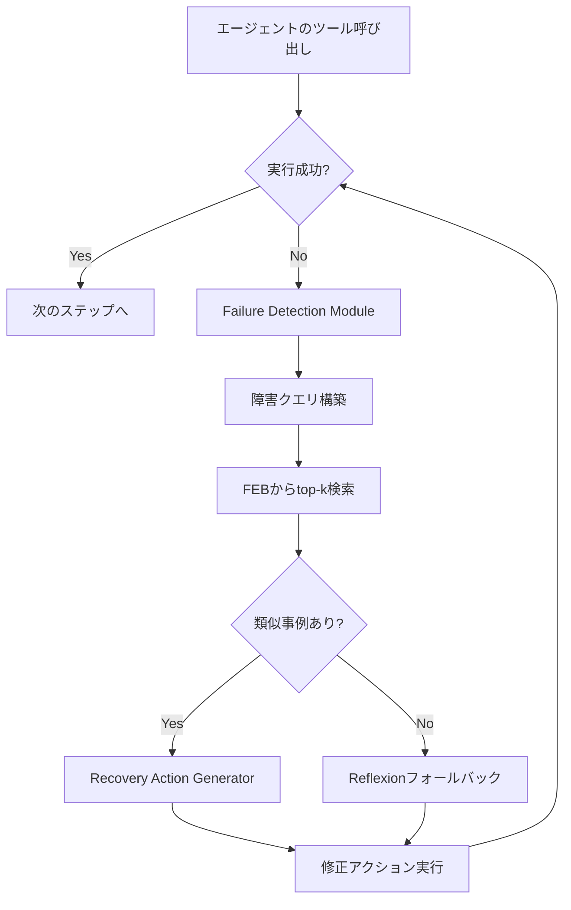

## 論文概要（Abstract）

本記事は [arXiv:2509.25238](https://arxiv.org/abs/2509.25238)（Dan et al., 2025）の解説記事です。

LLMエージェントは実世界のツール呼び出し環境で、不正なパラメータ、API廃止、環境エラーといったツール障害に頻繁に遭遇する。PALADINは**Failure Exemplar Bank（FEB）**という障害事例バンクを導入し、過去の障害-回復ペアを蓄積・検索することで、エージェントがツール障害から自律的に回復するフレームワークである。Reflexionのような網羅的な自己反省に頼る代わりに、類似障害事例の検索により回復策を効率的に提供する。著者らはAPI-BankとToolBenchの2ベンチマーク・4バックボーンLMで評価し、ベースライン比で平均10.72%の回復率向上と31.4%のトークン削減を報告している。

この記事は [Zenn記事: ReAct+CoTエージェントの本番運用設計：自己修復と推論トレース評価の実装](https://zenn.dev/0h_n0/articles/61d5ada98ddbb6) の深掘りです。

## 情報源

- **arXiv ID**: 2509.25238
- **URL**: [https://arxiv.org/abs/2509.25238](https://arxiv.org/abs/2509.25238)
- **著者**: Yuhao Dan, Siru Ouyang, Hanyi Liang, Zhuoyuan Mao, Danyang Liu, Linjun Yang, Bing Qin, Ting Liu, Jiawei Han
- **発表年**: 2025
- **分野**: cs.AI, cs.CL

## 背景と動機（Background & Motivation）

LLMエージェントのツール呼び出しにおける障害は、タスク完了を妨げる深刻なボトルネックとなっている。著者らは障害をステージ（実行前・実行中・実行後・永続的）とクラス（構造アクセス障害・環境障害・エージェント行動障害）の2次元で分類し、体系的な対処が必要であることを示した。

既存の回復手法には以下の課題がある：

- **推論ベース回復**（CoT、ReAct）: 障害回復を本質的にサポートしない
- **反省ベース回復**（Reflexion、Self-Refine）: 反省テキストの生成に多くのトークンを消費し、ハルシネーションや累積エラーを引き起こしうる
- **訓練ベース回復**: 高コストなファインチューニングが必要

著者らは、多くのツール障害が構造的に類似しているという観察に基づき、**過去の障害-回復ペアの検索**により、ゼロから推論し直すよりも効率的かつ正確な回復が可能であるとの仮説を立てた。

## 主要な貢献（Key Contributions）

- **貢献1**: ツール呼び出し障害をLLMエージェントのクリティカルボトルネックとして定式化し、ファインチューニング不要のPALADINフレームワークを提案
- **貢献2**: Failure Exemplar Bank（FEB）: 過去の障害-回復ペアを格納し、推論時にコサイン類似度で類似事例を検索する新機構。自動投入（FEB-Auto）とエキスパート投入（FEB-Expert）の2経路に対応
- **貢献3**: 2ベンチマーク・4バックボーンLMでReflexion比平均10.72%の回復率向上と31.4%のトークン削減を実証

## 技術的詳細（Technical Details）

### PALADINのアーキテクチャ

PALADINは3つのコンポーネントで構成される：



#### Failure Exemplar Bank（FEB）

FEBは障害-回復ペアの構造化リポジトリである。各エントリ $e_i$ は以下のタプルで表現される：

$$
e_i = (f_i, r_i)
$$

ここで、
- $f_i$: 障害事例記述（ツール名、エラーメッセージ、失敗したパラメータ、タスクコンテキスト）
- $r_i$: 回復アクション（修正パラメータ、代替エンドポイント、エラー固有の処理戦略）

FEBの投入には2つの経路がある：

**FEB-Auto（自動投入）**: エージェントがツール障害から自力回復してタスクを完了した場合、その障害-回復ペアを自動ログする。人手の介入なしに多様な実世界障害事例を蓄積できる。

**FEB-Expert（エキスパート投入）**: ドメイン専門家が既知の障害パターン（API廃止、認証問題等）を直接注入する。信頼性と具体性が高いが人的コストがかかる。

#### Failure Detection Module

ツール呼び出しのたびにエラーシグナルを監視し、以下の3ステップで処理する：

1. エラー信号をパースして障害タイプ・エラーコード・コンテキストを抽出
2. 障害タクソノミーに従いクラス分類
3. 検索クエリ $q^f$ を構築：$q^f = (\text{tool\_name}, \text{error\_code}, \text{task\_context})$

#### Recovery Action Generator

コサイン類似度によるembedding検索でFEBから類似事例を取得する：

$$
\text{sim}(q^f, f_i) = \frac{E(q^f) \cdot E(f_i)}{\|E(q^f)\| \cdot \|E(f_i)\|}
$$

ここで $E(\cdot)$ はembedding関数である。top-k件の検索結果を拡張コンテキストとしてLLMに渡し、回復アクションを生成させる。

FEBが空または類似度が閾値 $\tau$ 未満の場合は、Reflexionスタイルの自己反省にフォールバックする。

### 障害タクソノミー

著者らが定義した2次元の障害分類：

| 次元 | カテゴリ | 例 |
|------|---------|-----|
| **ステージ** | Pre-execution | パラメータ欠損、構文エラー |
| | Execution | HTTPエラー、タイムアウト |
| | Post-execution | 不正出力、スキーマ不一致 |
| | Persistent | 繰り返しエラー |
| **クラス** | Structured access | パラメータ/スキーマ違反 |
| | Environmental | ネットワーク、認証、レート制限 |
| | Agent behavior | ハルシネーション、ループ検出 |

### アルゴリズム

PALADINの障害回復フローを擬似コードで示す：

```python
from dataclasses import dataclass
import numpy as np


@dataclass
class FailureExemplar:
    """障害事例エントリ"""
    tool_name: str
    error_code: str
    error_message: str
    task_context: str
    recovery_action: str
    embedding: np.ndarray


class FailureExemplarBank:
    """Failure Exemplar Bank (FEB)"""

    def __init__(self, similarity_threshold: float = 0.7):
        self.exemplars: list[FailureExemplar] = []
        self.threshold = similarity_threshold

    def retrieve(
        self, query_embedding: np.ndarray, top_k: int = 3
    ) -> list[FailureExemplar]:
        """類似障害事例をtop-k検索

        Args:
            query_embedding: 障害クエリのembedding
            top_k: 返却する事例数

        Returns:
            類似度の高い順にソートされた障害事例リスト
        """
        scores = []
        for exemplar in self.exemplars:
            sim = np.dot(query_embedding, exemplar.embedding) / (
                np.linalg.norm(query_embedding)
                * np.linalg.norm(exemplar.embedding)
            )
            if sim >= self.threshold:
                scores.append((sim, exemplar))

        scores.sort(key=lambda x: x[0], reverse=True)
        return [ex for _, ex in scores[:top_k]]

    def add_auto(
        self, failure: dict, recovery: str, embedding_fn
    ) -> None:
        """自動投入（FEB-Auto）: 回復成功時に自動記録"""
        exemplar = FailureExemplar(
            tool_name=failure["tool_name"],
            error_code=failure["error_code"],
            error_message=failure["error_message"],
            task_context=failure["task_context"],
            recovery_action=recovery,
            embedding=embedding_fn(
                f"{failure['tool_name']} {failure['error_code']} "
                f"{failure['task_context']}"
            ),
        )
        self.exemplars.append(exemplar)


def paladin_recover(
    failure: dict,
    feb: FailureExemplarBank,
    llm,
    embedding_fn,
    top_k: int = 3,
) -> str:
    """PALADIN障害回復メインロジック

    Args:
        failure: 障害情報辞書
        feb: Failure Exemplar Bank
        llm: LLMインスタンス
        embedding_fn: embedding生成関数
        top_k: 検索する事例数

    Returns:
        回復アクション文字列
    """
    # 1. 障害クエリのembedding生成
    query = (
        f"{failure['tool_name']} {failure['error_code']} "
        f"{failure['task_context']}"
    )
    query_embedding = embedding_fn(query)

    # 2. FEBから類似事例を検索
    similar_cases = feb.retrieve(query_embedding, top_k=top_k)

    if similar_cases:
        # 3a. 検索成功: 事例をコンテキストとして回復アクション生成
        context = "\n".join(
            f"- 障害: {c.error_message} → 回復: {c.recovery_action}"
            for c in similar_cases
        )
        prompt = (
            f"以下の類似障害事例を参考に回復アクションを生成:\n"
            f"{context}\n\n"
            f"現在の障害: {failure['error_message']}"
        )
        return llm.generate(prompt)
    else:
        # 3b. 検索失敗: Reflexionフォールバック
        return reflexion_fallback(failure, llm)
```

## 実装のポイント（Implementation）

### FEBのサイズと性能の関係

著者らの実験（GPT-4o、API-Bank L3）によれば、FEBのサイズと回復率の関係は以下の通りである：

- 0件（FEBなし、自己反省のみ）: 58.6%
- 10件: 63.4%
- 50件: 69.8%
- 100件以上: ~71.4%（プラトー）

50件程度からFEBの効果は十分に発揮されるため、著者らはFEB-Expertで重要な障害パターン（認証エラー、レート制限等）を先にシードし、FEB-Autoで運用中に拡張する方式を推奨している。

### Embedding選択の重要性

類似度検索の品質はembeddingモデルに依存する。著者らは具体的なモデル名を記載していないが、ツール名・エラーコード・タスクコンテキストの3要素を結合した文字列のembeddingでコサイン類似度を計算している。

### バックボーンLMへの非依存性

PALADINはコンテキスト拡張によって動作するため、モデルのファインチューニングは不要であり、どのLLMバックボーンにも適用可能である（backbone-agnostic）。

## Production Deployment Guide

### AWS実装パターン（コスト最適化重視）

| 規模 | 月間リクエスト | 推奨構成 | 月額コスト | 主要サービス |
|------|--------------|---------|-----------|------------|
| **Small** | ~3,000 (100/日) | Serverless | $60-160 | Lambda + Bedrock + OpenSearch Serverless |
| **Medium** | ~30,000 (1,000/日) | Hybrid | $350-900 | Lambda + ECS + OpenSearch |
| **Large** | 300,000+ (10,000/日) | Container | $2,200-5,500 | EKS + Karpenter + OpenSearch |

PALADINではembedding検索にベクトルDBが必要なため、OpenSearch Serverless（Small）またはOpenSearch Service（Medium/Large）を追加する。FEBのembedding生成にはBedrock Embeddings（Titan Embeddings V2）を使用する。

**コスト試算の注意事項**:
- 上記は2026年3月時点のAWS ap-northeast-1（東京）リージョン料金に基づく概算値です
- FEBのサイズ増加に伴いOpenSearchのストレージ・検索コストが増加します
- 最新料金は [AWS料金計算ツール](https://calculator.aws/) で確認してください

### Terraformインフラコード

**Small構成: Lambda + Bedrock + OpenSearch Serverless**

```hcl
module "vpc" {
  source  = "terraform-aws-modules/vpc/aws"
  version = "~> 5.0"

  name = "paladin-agent-vpc"
  cidr = "10.0.0.0/16"
  azs  = ["ap-northeast-1a", "ap-northeast-1c"]
  private_subnets = ["10.0.1.0/24", "10.0.2.0/24"]
  enable_nat_gateway   = false
  enable_dns_hostnames = true
}

# FEB用OpenSearch Serverlessコレクション
resource "aws_opensearchserverless_collection" "feb" {
  name = "paladin-feb"
  type = "VECTORSEARCH"
}

resource "aws_opensearchserverless_security_policy" "feb_encryption" {
  name = "paladin-feb-encryption"
  type = "encryption"
  policy = jsonencode({
    Rules = [{ ResourceType = "collection", Resource = ["collection/paladin-feb"] }]
    AWSOwnedKey = true
  })
}

# Lambda: PALADIN回復エージェント
resource "aws_lambda_function" "paladin_agent" {
  filename      = "paladin_agent.zip"
  function_name = "paladin-recovery-agent"
  role          = aws_iam_role.lambda_role.arn
  handler       = "index.handler"
  runtime       = "python3.12"
  timeout       = 90
  memory_size   = 1024

  environment {
    variables = {
      BEDROCK_MODEL_ID       = "anthropic.claude-3-5-haiku-20241022-v1:0"
      BEDROCK_EMBEDDING_ID   = "amazon.titan-embed-text-v2:0"
      OPENSEARCH_ENDPOINT    = aws_opensearchserverless_collection.feb.collection_endpoint
      FEB_SIMILARITY_THRESHOLD = "0.7"
      FEB_TOP_K              = "3"
    }
  }
}

# CloudWatch: FEB検索ヒット率の監視
resource "aws_cloudwatch_metric_alarm" "feb_hit_rate" {
  alarm_name          = "paladin-feb-hit-rate-low"
  comparison_operator = "LessThanThreshold"
  evaluation_periods  = 1
  metric_name         = "FEBHitRate"
  namespace           = "Custom/PALADIN"
  period              = 3600
  statistic           = "Average"
  threshold           = 0.5
  alarm_description   = "FEB検索ヒット率が50%を下回る（FEB拡充が必要）"
}
```

### 運用・監視設定

**CloudWatch Logs Insights クエリ**:

```sql
-- FEB検索ヒット率と回復成功率の相関
fields @timestamp, feb_hit, recovery_success, similarity_score
| stats avg(similarity_score) as avg_similarity,
        sum(case when recovery_success = 1 then 1 else 0 end) / count(*) as recovery_rate,
        sum(case when feb_hit = 1 then 1 else 0 end) / count(*) as hit_rate
  by bin(1h)

-- 障害タイプ別の回復パフォーマンス
fields @timestamp, failure_type, recovery_method, tokens_used
| stats count(*) as failure_count,
        avg(tokens_used) as avg_tokens
  by failure_type, recovery_method
```

### コスト最適化チェックリスト

**PALADIN固有の最適化**:
- [ ] FEB-Expert初期投入: 頻出障害パターン50件をシード
- [ ] FEB-Auto閾値チューニング: 回復成功かつタスク完了した場合のみ自動投入
- [ ] OpenSearch Serverless OCU最適化: 低トラフィック時は最小OCUに自動縮退
- [ ] Embedding生成キャッシュ: 同一障害パターンのembeddingをElastiCacheに保存

**LLMコスト削減**:
- [ ] FEB検索ヒット時のトークン削減: 31.4%削減（論文報告値）
- [ ] Prompt Caching: 障害回復プロンプトのシステム部分をキャッシュ
- [ ] モデル階層化: embedding生成はTitan、回復アクション生成はHaiku

**監視・アラート**:
- [ ] FEB検索ヒット率ダッシュボード（50%以下でアラート）
- [ ] 障害タイプ別回復率トレンド
- [ ] FEBサイズ・鮮度の監視（古いエントリの自動アーカイブ）
- [ ] Reflexionフォールバック率の追跡

**リソース管理**:
- [ ] FEBエントリのTTL管理（API変更時に自動無効化）
- [ ] OpenSearchインデックスのライフサイクルポリシー
- [ ] 未使用embeddingの定期削除

## 実験結果（Results）

### 回復率（Recovery Rate）

著者らが論文Table 1で報告した、API-Bank Level 3およびToolBench I1/I2での回復率：

| 手法 | API-Bank L3 | TB I1 | TB I2 | 平均 |
|------|------------|-------|-------|------|
| ReAct | 41.3% | 38.7% | 35.2% | 38.4% |
| Reflexion | 52.4% | 48.1% | 44.6% | 48.4% |
| RAG-only | 49.8% | 46.3% | 42.1% | 46.1% |
| PALADIN (FEB-Auto) | 62.7% | 59.4% | 55.8% | 59.3% |
| PALADIN (FEB-Expert) | **65.1%** | **61.8%** | **58.3%** | **61.7%** |

### バックボーンLM別の回復率

論文Table 2より、API-Bank L3での各バックボーンLMの結果：

| バックボーン | ReAct | Reflexion | PALADIN | 改善幅 |
|------------|-------|-----------|---------|--------|
| GPT-4o | 48.2% | 58.6% | **71.4%** | +12.8pp |
| GPT-3.5-Turbo | 37.4% | 48.3% | **59.2%** | +10.9pp |
| Claude-3.5-Sonnet | 46.7% | 56.9% | **69.3%** | +12.4pp |
| Llama-3.1-70B | 33.1% | 42.7% | **53.4%** | +10.7pp |

### 障害タイプ別の回復率

| 障害タイプ | PALADIN | Reflexion | 差分 |
|-----------|---------|-----------|------|
| パラメータ不正 | **74.3%** | 55.2% | +19.1pp |
| 認証エラー | **69.1%** | 51.4% | +17.7pp |
| ネットワーク/タイムアウト | **61.2%** | 43.8% | +17.4pp |
| API廃止 | **58.6%** | 44.1% | +14.5pp |

特にパラメータ不正（+19.1pp）と認証エラー（+17.7pp）で大きな改善が見られ、著者らはこれらの障害タイプがFEBに蓄積されやすい定型的なパターンであるためと分析している。

### アブレーション

論文Table 4より、GPT-4o・API-Bank L3でのアブレーション結果：

| 構成 | 回復率 |
|------|--------|
| PALADIN（完全版） | **71.4%** |
| FEBなし（自己反省のみ） | 58.6% |
| FEB検索なし（ランダム事例選択） | 62.3% |
| フォールバックなし（FEBのみ） | 68.1% |
| FEB-Autoのみ | 68.9% |
| FEB-Expertのみ | 70.2% |

FEBの有無で12.8ポイントの差（71.4% vs 58.6%）があり、FEBがPALADINの性能の主要因であることが示されている。

## 実運用への応用（Practical Applications）

### Zenn記事との関連

関連するZenn記事では、LangGraphの`ToolNode`に`handle_tool_errors`を設定してツールエラーをLLMにフィードバックする方法が紹介されている。PALADINの知見をLangGraph実装に適用すると：

1. **カスタムエラーハンドラ + FEB**: `handle_tool_errors`で障害を検出し、FEB（DynamoDB/OpenSearch）から類似事例を検索してLLMのプロンプトに追加する
2. **FEB-Autoの自動投入**: エージェントがエラーから回復してタスクを完了した場合、その障害-回復ペアをFEBに自動記録する
3. **フォールバック戦略**: FEB検索で類似事例が見つからない場合に、Zenn記事で紹介されているReflexionパターンにフォールバックする

### 導入のステップ

1. FEB-Expertで既知の障害パターン（認証エラー、レート制限、パラメータ不正）を50件程度シード
2. FEB-Autoを有効化し、運用中に障害-回復ペアを自動蓄積
3. FEBの検索ヒット率を監視し、50%を下回った場合はFEB-Expertで追加投入

## 関連研究（Related Work）

- **Reflexion**（Shinn et al., 2023）: PALADINの主要ベースライン。網羅的自己反省に頼るため、トークン消費が多くハルシネーションリスクがある
- **ReAct**（Yao et al., 2022）: 障害回復を本質的にサポートしない基盤フレームワーク
- **Self-Refine**（Madaan et al., 2023）: 自己批判による反復改善。外部知識（FEB）を活用しない点がPALADINと異なる
- **RAG**（Lewis et al., 2020）: PALADINはRAGの原理をツール障害回復に特化適用したもの

## まとめと今後の展望

PALADINは、ツール障害の回復にRAGの原理を適用することで、Reflexionよりも効率的かつ正確な自己修正を実現するフレームワークである。著者らが報告した実験では、4種のバックボーンLMで一貫してReflexionを上回る回復率を達成し、トークン消費も31.4%削減されている。

一方で、FEBの品質・多様性への依存性、embeddingモデルの選択による検索品質の変動、API変更に伴うFEBエントリの陳腐化といった課題が残されている。著者らは今後の方向性として、FEBの自動メンテナンス、階層的FEB構成、マルチモーダル障害回復を挙げている。

## 参考文献

- **arXiv**: [https://arxiv.org/abs/2509.25238](https://arxiv.org/abs/2509.25238)
- **Related Zenn article**: [https://zenn.dev/0h_n0/articles/61d5ada98ddbb6](https://zenn.dev/0h_n0/articles/61d5ada98ddbb6)

---

:::message
この記事はAI（Claude Code）により自動生成されました。内容は論文 arXiv:2509.25238 の引用・解説であり、筆者自身が実験を行ったものではありません。正確性については原論文もご確認ください。
:::
