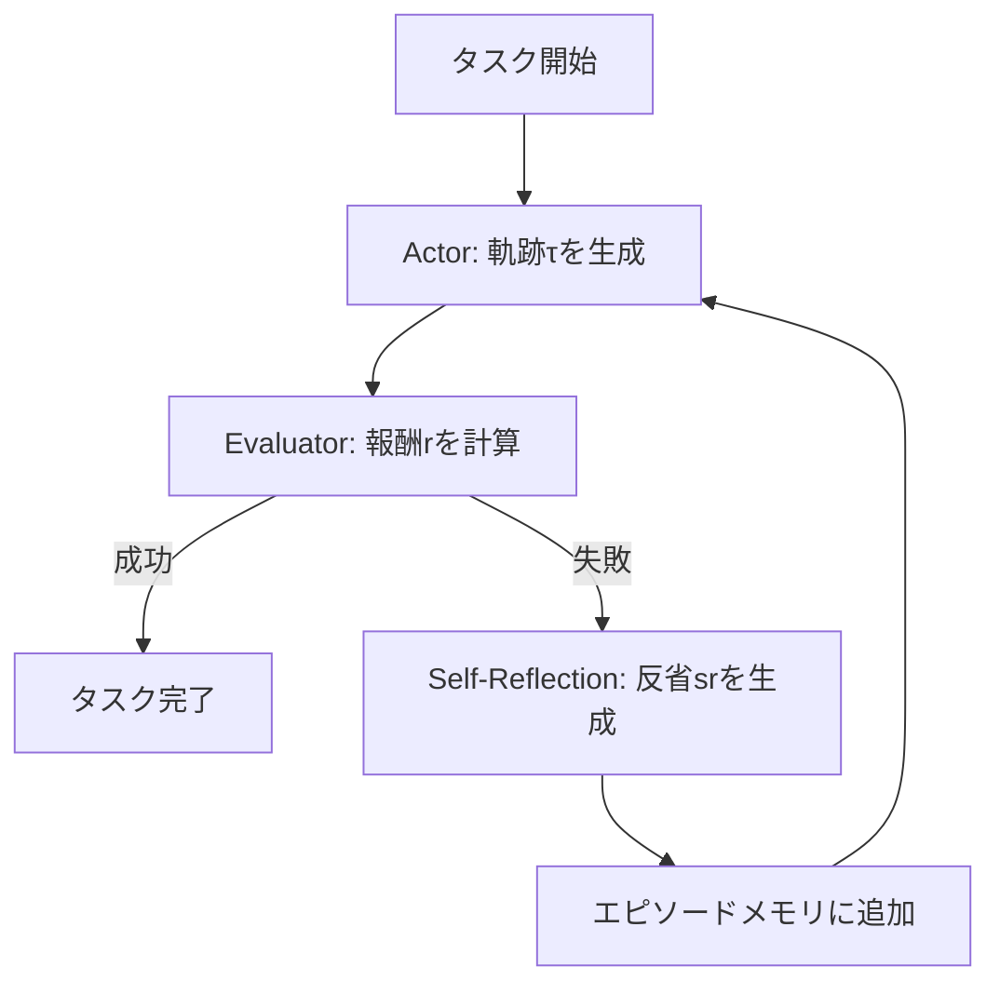

## 論文概要（Abstract）

本記事は [arXiv:2303.11366](https://arxiv.org/abs/2303.11366)（Shinn et al., 2023）の解説記事です。

Reflexionは、LLMエージェントが**モデルの重み更新なし**に、言語的な自己反省（verbal reflection）を通じて試行錯誤から学習するフレームワークである。従来の強化学習がスカラー報酬と勾配更新に依存するのに対し、Reflexionはエージェントが失敗の原因をテキストで言語化し、エピソードメモリに蓄積することで次の試行を改善する。著者らは、HumanEvalコーディングベンチマークでpass@1精度91%（GPT-4+Reflexion）、AlfWorldの逐次意思決定で成功率97%、HotpotQAの多段推論で精度77%を報告しており、いずれもベースライン手法を上回る結果を示している。

この記事は [Zenn記事: ReAct+CoTエージェントの本番運用設計：自己修復と推論トレース評価の実装](https://zenn.dev/0h_n0/articles/61d5ada98ddbb6) の深掘りです。

## 情報源

- **arXiv ID**: 2303.11366
- **URL**: [https://arxiv.org/abs/2303.11366](https://arxiv.org/abs/2303.11366)
- **著者**: Noah Shinn, Federico Cassano, Ashwin Gopinath, Karthik Narasimhan, Shunyu Yao
- **発表年**: 2023（NeurIPS 2023 採択）
- **分野**: cs.AI, cs.CL, cs.LG
- **コード**: [https://github.com/noahshinn/reflexion](https://github.com/noahshinn/reflexion)

## 背景と動機（Background & Motivation）

LLMエージェントは外部ツールや環境と対話しながらタスクを遂行する能力を示しているが、**失敗からの学習**には本質的な課題がある。従来のRL手法（PPO、RLHFなど）はモデルの重み更新を必要とし、大量の訓練サンプルと高コストなファインチューニングが前提となる。一方、推論時に重みを固定したままのLLMは、同じミスを繰り返す傾向がある。

著者らはこの問題に対し、「重み更新の代わりに言語フィードバックを活用する」というアプローチを提案した。自然言語による反省は、スカラー報酬よりも情報が豊富であり、失敗の具体的な原因と改善策をエージェントに伝達できるという洞察に基づいている。

## 主要な貢献（Key Contributions）

- **貢献1**: モデル重み更新を一切行わず、言語的反省（verbal reflection）とエピソードメモリだけでエージェント性能を向上させるReflexionフレームワークの提案
- **貢献2**: Actor・Evaluator・Self-Reflectionの3コンポーネントを単一のLLMで実装可能な設計。スカラー報酬・自由文フィードバックの両方に対応
- **貢献3**: HumanEval（コーディング）、AlfWorld（逐次意思決定）、HotpotQA（多段推論）の3種のタスクで、当時のベースラインを上回る性能を実証

## 技術的詳細（Technical Details）

### Reflexionの3コンポーネント設計

Reflexionは**Actor**（実行者）、**Evaluator**（評価者）、**Self-Reflection**（自己反省）の3つのコンポーネントで構成される。



#### Actor（実行者）

タスク記述、これまでの軌跡、メモリバッファを入力として行動を生成する。タイムステップ $t$ における行動選択は以下のように定式化される：

$$
a_t \sim \pi_\theta(a_t \mid o_t, \text{trajectory\_history}, \text{mem})
$$

ここで、
- $a_t$: タイムステップ $t$ の行動
- $o_t$: タイムステップ $t$ の観測
- $\text{mem}$: 過去の反省を格納したエピソードメモリバッファ
- $\pi_\theta$: LLMによるポリシー

Actorの具体的な実装はタスクに応じて異なる。AlfWorldではReActスタイル（思考と行動の交互出力）、HumanEvalではPython関数生成、HotpotQAではCoT推論を用いる。

#### Evaluator（評価者）

Actorの出力軌跡 $\tau$ を評価し、報酬シグナル $r$ を返す：

$$
r = \text{Evaluator}(\tau, \text{task\_description})
$$

評価方法はタスクに依存する：
- **コーディング**: ユニットテスト実行による合否判定（バイナリ）
- **意思決定**: 目標状態への到達チェック（バイナリ）
- **推論**: 正解ラベルとのExact Match

#### Self-Reflection（自己反省）

Reflexionの核心的イノベーションである。失敗した軌跡 $\tau$、タスク記述、評価結果 $r$ を入力として、テキストによる反省 $sr$ を生成する：

$$
sr = \text{LLM}_\theta(\text{task\_description}, \tau, r)
$$

生成された反省はエピソードメモリに追加される：

$$
\text{mem} \leftarrow \text{mem} \cup \{sr\}
$$

### アルゴリズム

論文のAlgorithm 1に記載されたReflexionの疑似コードを以下に示す：

```python
def reflexion(
    task: str,
    environment: Environment,
    max_trials: int = 3,
    window_size: int = 3,
) -> tuple[str, bool]:
    """Reflexionアルゴリズム

    Args:
        task: タスク記述文字列
        environment: 対話環境
        max_trials: 最大試行回数
        window_size: エピソードメモリのスライディングウィンドウサイズ

    Returns:
        最終出力とタスク成功フラグのタプル
    """
    memory: list[str] = []  # エピソードメモリ（反省テキスト）

    for trial in range(max_trials):
        # 1. Actorが軌跡を生成（メモリを参照）
        trajectory = actor_generate(task, memory, environment)

        # 2. Evaluatorが評価
        reward = evaluator_score(trajectory, task)

        # 3. 成功なら終了
        if reward == SUCCESS:
            return trajectory.output, True

        # 4. Self-Reflectionで反省テキスト生成
        reflection = self_reflect(task, trajectory, reward)

        # 5. スライディングウィンドウでメモリ更新
        memory.append(reflection)
        if len(memory) > window_size:
            memory = memory[-window_size:]

    return trajectory.output, False  # 最大試行到達
```

### メモリ設計

Reflexionは2種類のメモリを使い分ける：

1. **短期メモリ（作業メモリ）**: 現在のエピソード内の軌跡（観測+行動の履歴）
2. **長期メモリ（エピソードメモリ）**: 過去の失敗エピソードからの反省テキスト。スライディングウィンドウ（容量 $C$、通常 $C=3$）で管理

エージェントの入力コンテキストは以下の要素で構成される：

$$
\text{Context} = \text{task\_description} + \text{mem}[-C:] + \text{current\_trajectory}
$$

スライディングウィンドウ方式を採用する理由として、著者らは古い反省よりも直近の反省がより有用であること、またコンテキストウィンドウの制限下で効率的にメモリを管理する必要性を挙げている。

## 実装のポイント（Implementation）

### HumanEvalにおけるTDD風アプローチ

著者らが報告しているHumanEvalでの実装において注目すべきは、コード実装前にdocstringから**ブラックボックステストを自動生成**する点である。これはテスト駆動開発（TDD）に着想を得たアプローチで、以下の利点がある：

1. エッジケースの事前把握によるコード品質向上
2. 反復時の具体的な評価シグナルの提供

### 実装上の注意点

- **温度設定**: コーディングタスクでは温度0.0（決定論的生成）が推奨される
- **最大試行回数**: タスクに応じて調整が必要（論文ではHumanEval=8回、AlfWorld=3回、HotpotQA=5回）
- **反省の品質**: LLMが誤った失敗原因を特定する可能性がある。反省プロンプトに「具体的なコード修正案を示すこと」などの制約を追加すると改善が見込める
- **コンテキスト管理**: 長い軌跡とメモリの蓄積によりコンテキスト超過が発生しうる。軌跡の要約やメモリの圧縮戦略が必要

## Production Deployment Guide

### AWS実装パターン（コスト最適化重視）

Reflexionパターンをプロダクション環境にデプロイする際の、トラフィック量別推奨構成を以下に示す。

**トラフィック量別の推奨構成**:

| 規模 | 月間リクエスト | 推奨構成 | 月額コスト | 主要サービス |
|------|--------------|---------|-----------|------------|
| **Small** | ~3,000 (100/日) | Serverless | $50-150 | Lambda + Bedrock + DynamoDB |
| **Medium** | ~30,000 (1,000/日) | Hybrid | $300-800 | Lambda + ECS Fargate + ElastiCache |
| **Large** | 300,000+ (10,000/日) | Container | $2,000-5,000 | EKS + Karpenter + EC2 Spot |

**Small構成の詳細** (月額$50-150):
- **Lambda**: 1GB RAM, 60秒タイムアウト（Reflexionの複数試行を考慮）($20/月)
- **Bedrock**: Claude 3.5 Haiku, Prompt Caching有効 ($80/月)
- **DynamoDB**: On-Demand, 反省メモリ永続化用 ($10/月)
- **CloudWatch**: 基本監視 ($5/月)
- **API Gateway**: REST API ($5/月)

**Medium構成の詳細** (月額$300-800):
- **Lambda**: イベント処理 ($50/月)
- **ECS Fargate**: 0.5 vCPU, 1GB RAM × 2タスク ($120/月)
- **Bedrock**: Claude 3.5 Sonnet, Batch API活用 ($400/月)
- **ElastiCache Redis**: cache.t3.micro, 反省メモリキャッシュ ($15/月)
- **Application Load Balancer**: ($20/月)

**Large構成の詳細** (月額$2,000-5,000):
- **EKS**: コントロールプレーン ($72/月)
- **EC2 Spot Instances**: g5.xlarge × 2-4台 (平均$800/月)
- **Karpenter**: 自動スケーリング（追加コストなし）
- **Bedrock Batch**: 50%割引活用 ($2,000/月)
- **S3**: 反省メモリ・軌跡ログストレージ ($20/月)
- **CloudWatch + X-Ray**: 詳細監視 ($100/月)

**コスト削減テクニック**:
- Spot Instances使用で最大90%削減（EKS + Karpenter）
- Reserved Instances購入で最大72%削減（1年コミット）
- Bedrock Batch API使用で50%割引（Reflexionの非リアルタイム試行に適用可能）
- Prompt Caching有効化で30-90%削減（反省メモリのシステムプロンプト固定部分）

**コスト試算の注意事項**:
- 上記は2026年3月時点のAWS ap-northeast-1（東京）リージョン料金に基づく概算値です
- Reflexionは複数試行を行うため、1リクエストあたりのLLM呼び出し回数が通常の3-8倍になる点に注意
- 最新料金は [AWS料金計算ツール](https://calculator.aws/) で確認してください

### Terraformインフラコード

**Small構成 (Serverless): Lambda + Bedrock + DynamoDB**

```hcl
# --- VPC基盤 ---
module "vpc" {
  source  = "terraform-aws-modules/vpc/aws"
  version = "~> 5.0"

  name = "reflexion-agent-vpc"
  cidr = "10.0.0.0/16"
  azs  = ["ap-northeast-1a", "ap-northeast-1c"]
  private_subnets = ["10.0.1.0/24", "10.0.2.0/24"]

  enable_nat_gateway   = false
  enable_dns_hostnames = true
}

# --- IAMロール（最小権限） ---
resource "aws_iam_role" "lambda_reflexion" {
  name = "lambda-reflexion-role"

  assume_role_policy = jsonencode({
    Version = "2012-10-17"
    Statement = [{
      Action = "sts:AssumeRole"
      Effect = "Allow"
      Principal = { Service = "lambda.amazonaws.com" }
    }]
  })
}

resource "aws_iam_role_policy" "bedrock_invoke" {
  role = aws_iam_role.lambda_reflexion.id
  policy = jsonencode({
    Version = "2012-10-17"
    Statement = [{
      Effect   = "Allow"
      Action   = ["bedrock:InvokeModel", "bedrock:InvokeModelWithResponseStream"]
      Resource = "arn:aws:bedrock:ap-northeast-1::foundation-model/anthropic.claude-3-5-haiku*"
    }]
  })
}

# --- Lambda関数（Reflexionエージェント） ---
resource "aws_lambda_function" "reflexion_agent" {
  filename      = "reflexion_agent.zip"
  function_name = "reflexion-agent-handler"
  role          = aws_iam_role.lambda_reflexion.arn
  handler       = "index.handler"
  runtime       = "python3.12"
  timeout       = 120  # Reflexionの複数試行を考慮
  memory_size   = 1024

  environment {
    variables = {
      BEDROCK_MODEL_ID    = "anthropic.claude-3-5-haiku-20241022-v1:0"
      DYNAMODB_TABLE      = aws_dynamodb_table.reflection_memory.name
      MAX_TRIALS          = "3"
      MEMORY_WINDOW_SIZE  = "3"
      ENABLE_PROMPT_CACHE = "true"
    }
  }
}

# --- DynamoDB（反省メモリ永続化） ---
resource "aws_dynamodb_table" "reflection_memory" {
  name         = "reflexion-memory"
  billing_mode = "PAY_PER_REQUEST"
  hash_key     = "session_id"
  range_key    = "trial_number"

  attribute {
    name = "session_id"
    type = "S"
  }
  attribute {
    name = "trial_number"
    type = "N"
  }

  ttl {
    attribute_name = "expire_at"
    enabled        = true
  }
}

# --- CloudWatchアラーム（コスト監視） ---
resource "aws_cloudwatch_metric_alarm" "reflexion_cost" {
  alarm_name          = "reflexion-lambda-cost-spike"
  comparison_operator = "GreaterThanThreshold"
  evaluation_periods  = 1
  metric_name         = "Duration"
  namespace           = "AWS/Lambda"
  period              = 3600
  statistic           = "Sum"
  threshold           = 300000  # 300秒/時間超過でアラート（複数試行考慮）
  alarm_description   = "Reflexion Lambda実行時間異常（コスト急増の可能性）"

  dimensions = {
    FunctionName = aws_lambda_function.reflexion_agent.function_name
  }
}
```

**Large構成 (Container): EKS + Karpenter + Spot Instances**

```hcl
# --- EKSクラスタ ---
module "eks" {
  source  = "terraform-aws-modules/eks/aws"
  version = "~> 20.0"

  cluster_name    = "reflexion-agent-cluster"
  cluster_version = "1.31"
  vpc_id          = module.vpc.vpc_id
  subnet_ids      = module.vpc.private_subnets

  cluster_endpoint_public_access = true
  enable_cluster_creator_admin_permissions = true
}

# --- Karpenter（Spot優先自動スケーリング） ---
resource "kubectl_manifest" "karpenter_provisioner" {
  yaml_body = <<-YAML
    apiVersion: karpenter.sh/v1alpha5
    kind: Provisioner
    metadata:
      name: reflexion-spot
    spec:
      requirements:
        - key: karpenter.sh/capacity-type
          operator: In
          values: ["spot"]
        - key: node.kubernetes.io/instance-type
          operator: In
          values: ["m5.xlarge", "m5.2xlarge"]
      limits:
        resources:
          cpu: "32"
          memory: "128Gi"
      ttlSecondsAfterEmpty: 30
  YAML
}

# --- AWS Budgets（予算アラート） ---
resource "aws_budgets_budget" "reflexion_monthly" {
  name         = "reflexion-monthly-budget"
  budget_type  = "COST"
  limit_amount = "5000"
  limit_unit   = "USD"
  time_unit    = "MONTHLY"

  notification {
    comparison_operator        = "GREATER_THAN"
    threshold                  = 80
    threshold_type             = "PERCENTAGE"
    notification_type          = "ACTUAL"
    subscriber_email_addresses = ["ops@example.com"]
  }
}
```

### セキュリティベストプラクティス

1. **ネットワーク**: EKS `cluster_endpoint_public_access = false` を本番では設定
2. **IAMロール**: Bedrock InvokeModel のみ許可（最小権限）
3. **シークレット**: Secrets Manager使用、環境変数ハードコード禁止
4. **暗号化**: DynamoDB/S3はKMS暗号化、転送中TLS 1.2以上
5. **監査**: CloudTrail全リージョン有効化

### 運用・監視設定

**CloudWatch Logs Insights クエリ**:

```sql
-- Reflexion試行回数の分布（コスト予測に重要）
fields @timestamp, session_id, trial_number, evaluation_result
| stats count(*) as trial_count by trial_number
| sort trial_number asc

-- 1時間あたりのBedrock呼び出しトークン使用量
fields @timestamp, model_id, input_tokens, output_tokens
| stats sum(input_tokens + output_tokens) as total_tokens by bin(1h)
| filter total_tokens > 100000
```

**CloudWatch アラーム (Reflexion特化)**:

```python
import boto3

cloudwatch = boto3.client('cloudwatch')

# Reflexion試行回数が上限に達するケースの監視
cloudwatch.put_metric_alarm(
    AlarmName='reflexion-max-trials-reached',
    ComparisonOperator='GreaterThanThreshold',
    EvaluationPeriods=1,
    MetricName='MaxTrialsReached',
    Namespace='Custom/Reflexion',
    Period=3600,
    Statistic='Sum',
    Threshold=50,  # 1時間に50回以上max_trials到達でアラート
    AlarmDescription='Reflexionが最大試行回数に達するケースが多発'
)
```

**X-Ray トレーシング設定**:

```python
from aws_xray_sdk.core import xray_recorder, patch_all

patch_all()

@xray_recorder.capture('reflexion_trial')
def execute_reflexion_trial(
    task: str, trial: int, memory: list[str]
) -> dict:
    """Reflexionの1試行をX-Rayでトレース"""
    xray_recorder.put_annotation('trial_number', trial)
    xray_recorder.put_annotation('memory_size', len(memory))

    # Actor実行
    trajectory = actor_generate(task, memory)
    xray_recorder.put_metadata('trajectory_length', len(trajectory))

    # Evaluator実行
    reward = evaluator_score(trajectory, task)
    xray_recorder.put_annotation('evaluation_result', str(reward))

    return {'trajectory': trajectory, 'reward': reward}
```

### コスト最適化チェックリスト

**アーキテクチャ選択（トラフィック量で判断）**:
- [ ] ~100 req/日 → Lambda + Bedrock (Serverless) - $50-150/月
- [ ] ~1000 req/日 → ECS Fargate + Bedrock (Hybrid) - $300-800/月
- [ ] 10000+ req/日 → EKS + Spot Instances (Container) - $2,000-5,000/月

**Reflexion固有の最適化**:
- [ ] 試行回数制限: max_trials設定で不要な反復を防止
- [ ] 早期終了: Evaluatorスコアが閾値以上で即座に成功判定
- [ ] 反省メモリのキャッシュ: 類似タスクの反省を再利用（DynamoDBのTTL管理）
- [ ] モデル階層化: 1試行目はHaiku、失敗時のみSonnetに切り替え

**リソース最適化**:
- [ ] EC2: Spot Instances優先（最大90%削減）
- [ ] Reserved Instances: 1年コミットで72%削減
- [ ] Lambda: メモリサイズ最適化（CloudWatch Insights分析）
- [ ] ECS/EKS: アイドル時スケールダウン

**LLMコスト削減**:
- [ ] Bedrock Batch API: 非リアルタイム試行に50%割引適用
- [ ] Prompt Caching: システムプロンプト固定部分に30-90%削減
- [ ] トークン数制限: max_tokens設定で反省テキストの過剰生成防止

**監視・アラート**:
- [ ] AWS Budgets: 月額予算設定（80%で警告）
- [ ] CloudWatch: 試行回数分布・トークン使用量監視
- [ ] Cost Anomaly Detection: 自動異常検知
- [ ] 日次コストレポート: SNS/Slackへ自動送信

**リソース管理**:
- [ ] DynamoDB TTL: 古い反省メモリの自動削除（30日）
- [ ] タグ戦略: 環境別・試行回数別でコスト可視化
- [ ] 未使用リソース削除: Lambda Insights活用

## 実験結果（Results）

### AlfWorld（逐次意思決定）

AlfWorldはテキストベースの家事タスク環境（134タスク、6カテゴリ）である。論文Table/Figure 2より、以下の結果が報告されている：

| 手法 | 成功率 |
|------|--------|
| Act-only | 45% |
| Plan-only | 56% |
| ReAct（ベースライン） | 71% |
| ReAct + Reflexion（1試行） | ~71% |
| ReAct + Reflexion（2試行） | ~91% |
| ReAct + Reflexion（3試行） | **97%** |

著者らは、Reflexionが3試行以内で97%の成功率に到達し、ReActの71%から26ポイントの改善を達成したと報告している。

### HumanEval（コーディング）

HumanEvalは164問のPythonプログラミングベンチマークである。論文Table/Figure 3より：

| 手法 | モデル | pass@1 |
|------|--------|--------|
| GPT-3.5-turbo（直接） | GPT-3.5-turbo | 48.1% |
| GPT-3.5-turbo + CoT | GPT-3.5-turbo | 49.7% |
| GPT-3.5-turbo + Reflexion | GPT-3.5-turbo | 68.0% |
| GPT-4（ベースライン） | GPT-4 | 80.1% |
| GPT-4 + Reflexion | GPT-4 | **91.0%** |

GPT-4にReflexionを適用することで、pass@1が80.1%から91.0%に向上したと著者らは報告している。

### HotpotQA（多段推論）

HotpotQAはWikipedia検索を要する多段質問応答タスクである：

| 手法 | 精度 |
|------|------|
| CoT | 30% |
| ReAct | 36% |
| ReAct + Reflexion | **77%** |

ReActの36%から77%へと、精度が2倍以上に向上したことが報告されている。

### アブレーション分析

メモリの種類による効果の違い（HumanEval、GPT-3.5-turbo）：

| メモリ種別 | pass@1 |
|-----------|--------|
| メモリなし（1試行のみ） | 48.1% |
| スカラー報酬フィードバックのみ | 54.3% |
| エピソードメモリ（反省テキスト） | **68.0%** |

この結果から、スカラー報酬だけでも一定の改善（+6.2ポイント）が見られるが、言語的反省を用いることでさらに大きな改善（+13.7ポイント追加）が得られることが示されている。

## 実運用への応用（Practical Applications）

### Zenn記事との関連

関連するZenn記事「ReAct+CoTエージェントの本番運用設計」では、LangGraphのReflexionパターン実装が紹介されている。Reflexion論文の知見を本番運用に適用する際の主要な考慮事項は以下の通りである：

1. **試行回数とコストのトレードオフ**: 論文の結果から、改善の大部分は最初の2-3試行で得られ、それ以降は逓減する傾向がある。本番環境では`max_attempts=3`が費用対効果の観点から妥当
2. **反省メモリの永続化**: 論文ではセッション内のみの学習だが、本番環境では類似タスクの反省をDB（DynamoDB等）に永続化し、セッション間で再利用することでコールドスタートを改善できる
3. **評価基準の設計**: Reflexionの性能はEvaluatorの質に強く依存する。明確な成功基準があるタスク（API呼び出しの成否、テスト通過等）に適用するのが効果的

### スケーリング上の考慮事項

- **コスト**: 1リクエストあたり最大$n$回のLLM呼び出しが発生するため、通常のエージェントの3-8倍のAPI費用を見込む必要がある
- **レイテンシ**: 各試行でLLM推論→ツール実行→評価→反省のフルサイクルが回るため、応答時間はベースラインの数倍になりうる
- **コンテキスト長**: 反省メモリ+軌跡でコンテキストが逼迫するため、モデルの最大コンテキスト長に応じたウィンドウサイズ管理が必須

## 関連研究（Related Work）

- **ReAct**（Yao et al., 2022, arXiv:2210.03629）: Reflexionが内部で使用するActorの基盤ポリシー。思考と行動の交互出力パターンを確立した
- **Self-Refine**（Madaan et al., 2023）: Reflexionと同時期の並行研究。自己批判による反復改善を行うが、外部Evaluatorとエピソードメモリを持たない点が異なる
- **Tree-of-Thoughts**（Yao et al., 2023）: 木探索による複数推論パスの探索。Reflexionの逐次試行とは直交するアプローチ
- **ExpeL**（Zhao et al., 2023）: 類似のエピソードメモリアプローチだが、検索機構が異なる

## まとめと今後の展望

Reflexionは、モデル重み更新なしに言語的フィードバックだけでエージェント性能を向上させるフレームワークとして、LLMエージェントの自己修正メカニズムの基盤的手法となっている。著者らが報告した実験では、3つの異なるタスクカテゴリでベースラインを上回る結果が示されている。

一方で、コンテキスト長の制約、反省の誤診断リスク、セッション間での学習非永続性といった課題も残されている。2026年現在、後続研究であるPALADIN（2509.25238）やAgentPRM（2502.10325）が、これらの制約に対する改善策を提案している。

## 参考文献

- **arXiv**: [https://arxiv.org/abs/2303.11366](https://arxiv.org/abs/2303.11366)
- **Code**: [https://github.com/noahshinn/reflexion](https://github.com/noahshinn/reflexion)
- **NeurIPS 2023 Poster**: [https://neurips.cc/virtual/2023/poster/70114](https://neurips.cc/virtual/2023/poster/70114)
- **Related Zenn article**: [https://zenn.dev/0h_n0/articles/61d5ada98ddbb6](https://zenn.dev/0h_n0/articles/61d5ada98ddbb6)

---

:::message
この記事はAI（Claude Code）により自動生成されました。内容は論文 arXiv:2303.11366 の引用・解説であり、筆者自身が実験を行ったものではありません。正確性については原論文もご確認ください。
:::
