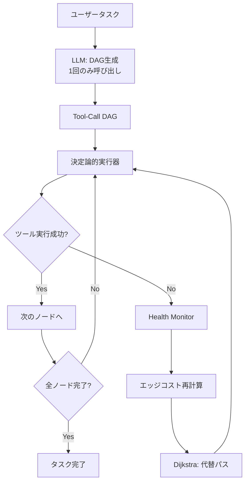

## 論文概要（Abstract）

本記事は [arXiv:2603.01548](https://arxiv.org/abs/2603.01548)（Bholani, 2026）の解説記事です。

LLMエージェントがツールを呼び出す際、ReActのようなステップバイステップ推論ではLLMを各ステップで呼び出す必要があり、高コストかつ障害時の回復にも追加のLLM推論を要する。本論文は**Self-Healing Router**を提案し、タスク開始時にLLMが一度だけ有向非巡回グラフ（DAG）を生成し、以降は決定論的にグラフを走査してツールを実行する。ツール障害時は、並列ヘルスモニタが失敗エッジのコストを再計算し、Dijkstra法で代替パスを自動ルーティングする——LLMの再呼び出しなしに。著者は19テストシナリオ・3種のグラフトポロジーで評価し、ReActと同等のタスク成功率を維持しつつ、制御プレーンのLLM呼び出しを93%削減（123回→9回）したと報告している。

この記事は [Zenn記事: ReAct+CoTエージェントの本番運用設計：自己修復と推論トレース評価の実装](https://zenn.dev/0h_n0/articles/61d5ada98ddbb6) の深掘りです。

## 情報源

- **arXiv ID**: 2603.01548
- **URL**: [https://arxiv.org/abs/2603.01548](https://arxiv.org/abs/2603.01548)
- **著者**: Neeraj Bholani
- **発表年**: 2026（Working paper）
- **分野**: cs.AI, cs.SE
- **ステータス**: Working paper（査読前プレプリント）

## 背景と動機（Background & Motivation）

ReActスタイルのLLMエージェントは、各行動ステップでLLMに「次に何をするか」を問い合わせる。これは柔軟だがコストが高い。著者によれば、ツール障害時のReActの回復フローは以下のようになる：

1. LLMが障害を認識（推論1回目）
2. 代替手段を推論（推論2回目）
3. 代替ツールを選択（推論3回目）
4. 新しい呼び出しをフォーマット（推論4回目）

1回の障害あたり3-5回のLLM推論が発生し、推論1回あたり300-500msを要する。エンタープライズ規模（日次10,000タスク、ツール障害率5%）では、1日あたり約17分のリカバリ時間と約2,000回の追加LLM呼び出しがリカバリだけに消費される。

本論文はこの問題に対し、**計画と実行の分離**というアーキテクチャ的アプローチで解決を図る。

## 主要な貢献（Key Contributions）

- **貢献1**: LLMを1回だけ呼び出してツール呼び出しのDAGを生成し、以降は決定論的実行器がグラフを走査するGraphRouterアーキテクチャの提案
- **貢献2**: ツール障害時にLLMを再呼び出しせずに、コスト重み付きグラフのエッジ再計算とDijkstra法による代替パスルーティングを行うSelf-Healing機構
- **貢献3**: 19シナリオ・3トポロジーでReAct比93%のLLM呼び出し削減を実証。静的ワークフローベースラインで発生するサイレント障害の排除

## 技術的詳細（Technical Details）

### アーキテクチャ概要

Self-Healing Routerは3つの主要コンポーネントで構成される：



#### Phase 1: DAG生成（LLM呼び出し1回）

タスクを受け取ると、LLMがツール呼び出しの依存関係を有向非巡回グラフとして出力する。グラフの各要素は：

- **ノード**: 個々のツール呼び出し（パラメータ含む）
- **エッジ**: データ依存関係と実行順序
- **エッジコスト**: ツールの信頼性スコア（初期値は均一、障害発生時に動的更新）

$$
G = (V, E, W)
$$

ここで、
- $V$: ツール呼び出しノードの集合
- $E \subseteq V \times V$: 依存関係エッジの集合
- $W: E \rightarrow \mathbb{R}^+$: エッジのコスト関数

#### Phase 2: 決定論的実行

DAG生成後、軽量な実行器がグラフをトポロジカルソート順に走査する。各ノード（ツール呼び出し）を順次実行し、出力を後続ノードの入力としてパイプラインする。この段階でLLMは一切関与しない。

#### Phase 3: Self-Healing（自己修復）

ツール実行が失敗した場合、以下の段階的リカバリが発動する：

**ステージ1 — ローカル修復**:
- パラメータ修正（型変換、フォーマット修正）
- 指数バックオフ付きリトライ
- タイムアウト後の再実行

**ステージ2 — グラフルーティング**:
失敗したエッジのコストを $\infty$ に設定し、Dijkstra法で始点から終点への最短代替パスを再計算する：

$$
W'(e) = \begin{cases}
\infty & \text{if } e \text{ が失敗したエッジ} \\
W(e) \cdot (1 + \alpha \cdot f(e)) & \text{otherwise}
\end{cases}
$$

ここで、
- $W'(e)$: 更新後のエッジコスト
- $\alpha$: 障害伝播係数
- $f(e)$: エッジ $e$ の障害回数

**ステージ3 — LLMエスカレーション**:
代替パスが存在しない場合にのみ、LLMを呼び出して目標の調整またはエスカレーションを行う。著者によれば、このエスカレーションが発生するのはテストシナリオの少数ケースに限られる。

### 並列ヘルスモニタ

各ツールに対して並列に動作するヘルスモニタが、ランタイム条件（ツール稼働状態、レイテンシ、エラー率）を監視し、優先度スコアを割り当てる。このスコアがグラフのエッジコストに反映され、障害が発生する前に予防的なルーティング変更を可能にする。

### アルゴリズム

論文の擬似コード（Appendix参照）をPythonで表現すると：

```python
from dataclasses import dataclass, field
import heapq


@dataclass
class ToolNode:
    """DAGのツールノード"""
    tool_name: str
    params: dict
    dependencies: list[str] = field(default_factory=list)


@dataclass
class ToolDAG:
    """ツール呼び出しDAG"""
    nodes: dict[str, ToolNode]
    edges: dict[tuple[str, str], float]  # (src, dst) -> cost


def dijkstra_reroute(
    dag: ToolDAG,
    failed_edge: tuple[str, str],
    start: str,
    end: str,
) -> list[str]:
    """失敗エッジを回避したDijkstra最短経路

    Args:
        dag: ツール呼び出しDAG
        failed_edge: 失敗したエッジ (src, dst)
        start: 始点ノードID
        end: 終点ノードID

    Returns:
        代替パスのノードIDリスト。パスが見つからない場合は空リスト
    """
    # 失敗エッジのコストを無限大に更新
    updated_edges = dict(dag.edges)
    updated_edges[failed_edge] = float('inf')

    # Dijkstra法による最短経路探索
    distances: dict[str, float] = {node: float('inf') for node in dag.nodes}
    distances[start] = 0
    predecessors: dict[str, str | None] = {node: None for node in dag.nodes}
    pq: list[tuple[float, str]] = [(0, start)]

    while pq:
        current_dist, current = heapq.heappop(pq)
        if current == end:
            break
        if current_dist > distances[current]:
            continue

        for (src, dst), cost in updated_edges.items():
            if src == current and current_dist + cost < distances[dst]:
                distances[dst] = current_dist + cost
                predecessors[dst] = current
                heapq.heappush(pq, (distances[dst], dst))

    # パス復元
    if distances[end] == float('inf'):
        return []  # 代替パスなし → LLMエスカレーション
    path = []
    node: str | None = end
    while node is not None:
        path.append(node)
        node = predecessors[node]
    return list(reversed(path))


def self_healing_execute(
    dag: ToolDAG,
    max_local_retries: int = 3,
) -> dict:
    """Self-Healing Routerのメイン実行ループ

    Args:
        dag: LLMが生成したツール呼び出しDAG
        max_local_retries: ローカル修復の最大リトライ回数

    Returns:
        実行結果の辞書
    """
    execution_order = topological_sort(dag)
    results: dict[str, object] = {}

    for node_id in execution_order:
        node = dag.nodes[node_id]

        for attempt in range(max_local_retries):
            try:
                result = execute_tool(node.tool_name, node.params, results)
                results[node_id] = result
                break
            except ToolExecutionError:
                if attempt < max_local_retries - 1:
                    continue  # ローカルリトライ
                # ローカル修復失敗 → グラフルーティング
                alt_path = dijkstra_reroute(dag, ...)
                if alt_path:
                    # 代替パスで実行を継続
                    pass
                else:
                    # LLMエスカレーション（最終手段）
                    escalate_to_llm(node, results)

    return results
```

## 実装のポイント（Implementation）

### DAG生成のプロンプト設計

著者によれば、DAG生成の品質はプロンプト設計に大きく依存する。ツール仕様（API名、パラメータスキーマ、依存関係制約）を構造化してLLMに渡し、JSONまたはDOT形式でDAGを出力させるアプローチが採られている。

### ヘルスモニタの実装

各ツールに対するヘルスモニタは非同期で動作し、以下の指標を監視する：
- ツールの応答レイテンシ（移動平均）
- エラー率（直近N回の呼び出し中の失敗割合）
- ツールのステータスエンドポイント（ヘルスチェック）

これらの指標がエッジコストに反映されることで、障害が顕在化する前にルーティングを予防的に変更できる。

### ReActとの使い分け

Self-Healing Routerは、ツール呼び出しのパターンが事前に予測可能なタスクに適している。一方、対話的に方針を変更する必要がある探索的タスクでは、ReActのような逐次推論の方が適切である。

## Production Deployment Guide

### AWS実装パターン（コスト最適化重視）

Self-Healing RouterはLLM呼び出しを最小化する設計のため、特にコスト効率の高いデプロイが可能である。

| 規模 | 月間リクエスト | 推奨構成 | 月額コスト | 主要サービス |
|------|--------------|---------|-----------|------------|
| **Small** | ~3,000 (100/日) | Serverless | $30-80 | Lambda + Bedrock + Step Functions |
| **Medium** | ~30,000 (1,000/日) | Hybrid | $150-400 | Lambda + ECS Fargate + ElastiCache |
| **Large** | 300,000+ (10,000/日) | Container | $800-2,500 | EKS + Karpenter + EC2 Spot |

Self-Healing RouterはLLM呼び出しが従来比93%削減されるため、Bedrock費用がReActベースの構成と比較して大幅に低い点が特徴である。

**コスト試算の注意事項**:
- 上記は2026年3月時点のAWS ap-northeast-1（東京）リージョン料金に基づく概算値です
- 実際のコストはDAGの複雑さ、ツール障害率、エスカレーション頻度により変動します
- 最新料金は [AWS料金計算ツール](https://calculator.aws/) で確認してください

### Terraformインフラコード

**Small構成 (Serverless): Lambda + Step Functions + Bedrock**

```hcl
module "vpc" {
  source  = "terraform-aws-modules/vpc/aws"
  version = "~> 5.0"

  name = "self-healing-router-vpc"
  cidr = "10.0.0.0/16"
  azs  = ["ap-northeast-1a", "ap-northeast-1c"]
  private_subnets = ["10.0.1.0/24", "10.0.2.0/24"]

  enable_nat_gateway   = false
  enable_dns_hostnames = true
}

# DAG生成Lambda（LLM呼び出し: タスク開始時1回のみ）
resource "aws_lambda_function" "dag_generator" {
  filename      = "dag_generator.zip"
  function_name = "self-healing-dag-generator"
  role          = aws_iam_role.lambda_role.arn
  handler       = "index.handler"
  runtime       = "python3.12"
  timeout       = 60
  memory_size   = 512

  environment {
    variables = {
      BEDROCK_MODEL_ID = "anthropic.claude-3-5-haiku-20241022-v1:0"
    }
  }
}

# ツール実行Lambda（LLMは呼び出さない）
resource "aws_lambda_function" "tool_executor" {
  filename      = "tool_executor.zip"
  function_name = "self-healing-tool-executor"
  role          = aws_iam_role.lambda_role.arn
  handler       = "index.handler"
  runtime       = "python3.12"
  timeout       = 30
  memory_size   = 256
}

# Step Functions（DAG走査のオーケストレーション）
resource "aws_sfn_state_machine" "dag_executor" {
  name     = "self-healing-dag-executor"
  role_arn = aws_iam_role.sfn_role.arn

  definition = jsonencode({
    Comment = "Self-Healing Router DAG Execution"
    StartAt = "GenerateDAG"
    States = {
      GenerateDAG = {
        Type     = "Task"
        Resource = aws_lambda_function.dag_generator.arn
        Next     = "ExecuteDAG"
      }
      ExecuteDAG = {
        Type    = "Map"
        ItemsPath = "$.dag_nodes"
        Iterator = {
          StartAt = "ExecuteTool"
          States = {
            ExecuteTool = {
              Type     = "Task"
              Resource = aws_lambda_function.tool_executor.arn
              Retry = [{
                ErrorEquals     = ["ToolExecutionError"]
                IntervalSeconds = 2
                MaxAttempts     = 3
                BackoffRate     = 2.0
              }]
              End = true
            }
          }
        }
        End = true
      }
    }
  })
}

resource "aws_cloudwatch_metric_alarm" "escalation_rate" {
  alarm_name          = "self-healing-llm-escalation-rate"
  comparison_operator = "GreaterThanThreshold"
  evaluation_periods  = 1
  metric_name         = "LLMEscalationCount"
  namespace           = "Custom/SelfHealingRouter"
  period              = 3600
  statistic           = "Sum"
  threshold           = 10
  alarm_description   = "LLMエスカレーションが1時間に10回を超過（DAG品質低下の兆候）"
}
```

### 運用・監視設定

**CloudWatch Logs Insights クエリ**:

```sql
-- DAGルーティング成功率（Self-Healing効果の測定）
fields @timestamp, task_id, reroute_count, llm_escalation
| stats count(*) as total,
        sum(case when llm_escalation = 0 then 1 else 0 end) as self_healed,
        sum(case when llm_escalation = 1 then 1 else 0 end) as escalated
  by bin(1h)

-- LLM呼び出し削減率の実測
fields @timestamp, llm_calls_dag_gen, llm_calls_escalation
| stats sum(llm_calls_dag_gen + llm_calls_escalation) as total_llm_calls,
        sum(llm_calls_dag_gen) as planning_calls
  by bin(1d)
```

### コスト最適化チェックリスト

**アーキテクチャ選択**:
- [ ] ~100 req/日 → Lambda + Step Functions (Serverless) - $30-80/月
- [ ] ~1000 req/日 → ECS Fargate (Hybrid) - $150-400/月
- [ ] 10000+ req/日 → EKS + Spot (Container) - $800-2,500/月

**Self-Healing Router固有の最適化**:
- [ ] DAGキャッシュ: 同一タスクパターンのDAGを再利用（DynamoDB/ElastiCache）
- [ ] ヘルスモニタの閾値チューニング: 誤検知によるDAG不要な再計算を防止
- [ ] エスカレーション率の監視: LLMエスカレーション率が5%を超えたらDAG生成プロンプトを見直し

**LLMコスト削減（論文の93%削減をさらに改善）**:
- [ ] DAGテンプレート化: 頻出タスクパターンのDAGを事前生成
- [ ] Prompt Caching: DAG生成プロンプトのシステム部分をキャッシュ
- [ ] モデル選択: DAG生成にはHaikuで十分（構造化出力）

**監視・アラート**:
- [ ] Self-Healing成功率のダッシュボード化
- [ ] LLMエスカレーション率アラート
- [ ] ツール別障害率トレンド

**リソース管理**:
- [ ] Step Functions実行履歴のアーカイブ（90日後にS3へ）
- [ ] DAGキャッシュのTTL設定（24時間推奨）
- [ ] 未使用Lambda関数の自動削除

## 実験結果（Results）

### 主要結果

著者が報告した19テストシナリオ・3種のグラフトポロジーでの評価結果：

| 指標 | ReAct | Self-Healing Router | 改善 |
|------|-------|---------------------|------|
| 制御プレーンLLM呼び出し（合計） | 123回 | 9回 | **93%削減** |
| タスク成功率 | 同等 | 同等 | 維持 |
| サイレント障害 | 発生あり | **0件** | 排除 |

著者によれば、静的ワークフローベースラインでは複合障害（compound failures）時にサイレント障害が発生するが、Self-Healing Routerではグラフの再ルーティングにより回避できたと報告されている。

### 分析ポイント

- **LLM呼び出し93%削減**の内訳：DAG生成で1回（全シナリオ共通）+ エスカレーションで平均0.4回/シナリオ = 合計約9回。ReActは各ステップでLLMを呼ぶため123回
- サイレント障害の排除は、ヘルスモニタによるツール状態の能動的監視が寄与している
- ただし、本論文は19シナリオという限定的な評価であり、大規模ベンチマーク（ToolBench等）での検証は今後の課題として挙げられている

## 実運用への応用（Practical Applications）

### Zenn記事との関連

関連するZenn記事では、LangGraphのToolNodeエラーハンドリングやRetryPolicyを用いた自己修復パターンが紹介されている。Self-Healing Routerは、これらのパターンを**グラフレベルのルーティング**に一般化したアプローチと位置づけられる。

具体的には：
- LangGraphの`handle_tool_errors`はノード単位の局所的修復に対応（Self-Healing Routerのステージ1に相当）
- Self-Healing Routerのステージ2（Dijkstraルーティング）は、LangGraphの条件付きエッジを動的に再構成する機能に近い
- `recursion_limit`によるループ防止は、Self-Healing Routerでは「代替パスなし→エスカレーション」という明示的なフォールバックに対応

### 適用シナリオ

- **API統合パイプライン**: 複数のREST APIを順次呼び出すワークフロー（認証→データ取得→変換→保存）
- **CI/CDパイプライン**: ビルド→テスト→デプロイの自動化で、ステージ障害時の代替パスが有用
- **データ処理パイプライン**: ETLジョブのツール障害時に代替データソースへ自動切り替え

## 関連研究（Related Work）

- **ReAct**（Yao et al., 2022）: 本論文の主要ベースライン。各ステップでLLMを呼ぶため高コスト
- **ToolChain\***（Zhuang et al., 2023）: ツール呼び出しを木構造で計画する手法。Self-Healing Routerは障害耐性を追加したDAGアプローチ
- **Reflexion**（Shinn et al., 2023）: 試行間の自己反省によるエラー回復。Self-Healing Routerは試行内のリアルタイム回復に焦点
- **PALADIN**（Dan et al., 2025）: 障害事例バンクによる検索ベース回復。Self-Healing Routerはグラフアルゴリズムベースの回復

## まとめと今後の展望

Self-Healing Routerは、「計画と実行の分離」という設計原則に基づき、LLMエージェントのツール呼び出しコストを大幅に削減する手法である。著者は19シナリオでLLM呼び出し93%削減を報告しているが、大規模ベンチマークでの検証や、動的なタスク変更への対応は今後の課題として残されている。

本論文はWorking paper（査読前プレプリント）であり、結果の再現性については今後の追試が望まれる。

## 参考文献

- **arXiv**: [https://arxiv.org/abs/2603.01548](https://arxiv.org/abs/2603.01548)
- **Related Zenn article**: [https://zenn.dev/0h_n0/articles/61d5ada98ddbb6](https://zenn.dev/0h_n0/articles/61d5ada98ddbb6)

---

:::message
この記事はAI（Claude Code）により自動生成されました。内容は論文 arXiv:2603.01548 の引用・解説であり、筆者自身が実験を行ったものではありません。本論文はWorking paper（査読前プレプリント）であるため、結果の解釈には注意が必要です。
:::
