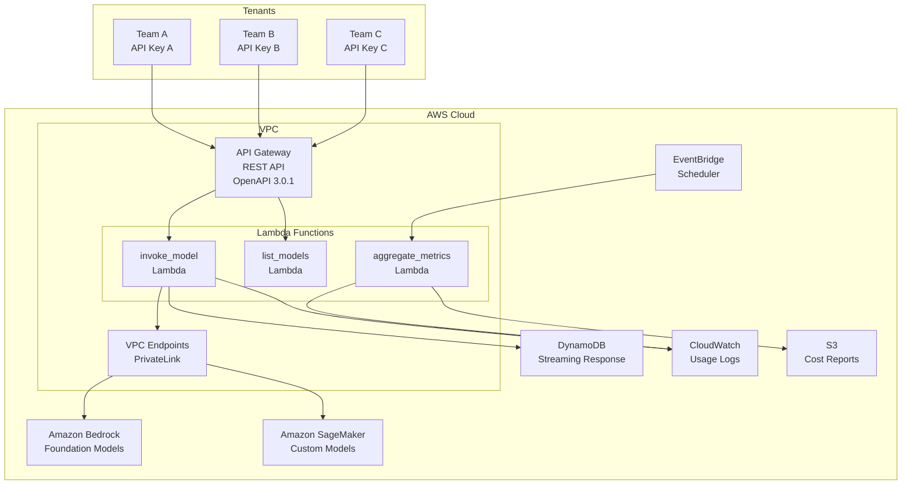
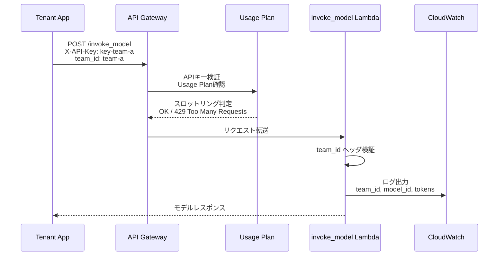
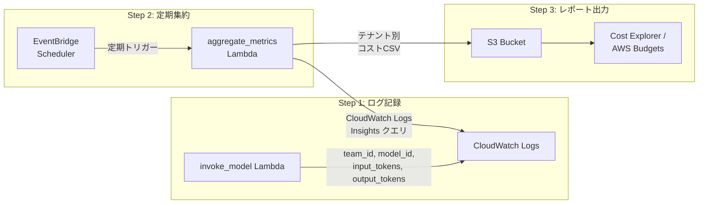

## ブログ概要

本記事は、AWS公式ブログ「[Build a multi-tenant generative AI environment for your enterprise on AWS](https://aws.amazon.com/blogs/machine-learning/build-a-multi-tenant-generative-ai-environment-for-your-enterprise-on-aws/)」の解説記事です。

AWSはこのブログにおいて、企業内の複数事業部門やチームが Amazon Bedrock の基盤モデル（Foundation Model）に安全かつ効率的にアクセスするための内部SaaSプラットフォームの構築方法を提示している。本アーキテクチャは、API Gateway・Lambda・DynamoDB・EventBridge・CloudWatch・S3を組み合わせ、テナントごとのアクセス制御・利用量追跡・コスト配賦を実現する。リファレンス実装は[GitHubリポジトリ](https://github.com/aws-solutions-library-samples/guidance-for-a-multi-tenant-generative-ai-gateway-with-cost-and-usage-tracking-on-aws)として公開されており、AWS CDKによるデプロイが可能である。

---

## 情報源

| 項目 | 内容 |
|------|------|
| 種別 | 企業テックブログ（AWS Machine Learning Blog） |
| URL | [https://aws.amazon.com/blogs/machine-learning/build-a-multi-tenant-generative-ai-environment-for-your-enterprise-on-aws/](https://aws.amazon.com/blogs/machine-learning/build-a-multi-tenant-generative-ai-environment-for-your-enterprise-on-aws/) |
| 組織 | Amazon Web Services |
| GitHub | [aws-solutions-library-samples/guidance-for-a-multi-tenant-generative-ai-gateway-with-cost-and-usage-tracking-on-aws](https://github.com/aws-solutions-library-samples/guidance-for-a-multi-tenant-generative-ai-gateway-with-cost-and-usage-tracking-on-aws) |
| 関連Zenn記事 | [Portkey AIゲートウェイのマルチテナント運用](https://zenn.dev/0h_n0/articles/2658d8a7a0e6e3) |

---

## 技術的背景：なぜマルチテナントAIゲートウェイが必要か

企業が生成AIを全社展開する際、各事業部門が個別にAWSアカウントやAPIキーを管理すると、以下の問題が生じる。

1. **コスト可視性の欠如**: 基盤モデルの利用コストがどの部門に帰属するか追跡できない
2. **ガバナンスの分散**: モデルへのアクセス制御が部門ごとにバラバラになる
3. **運用負荷の増大**: 各部門がそれぞれインフラを構築・保守する非効率
4. **セキュリティリスク**: APIキーの散逸やモデルへの無制限アクセス

AWS公式ガイダンスでは、これらの課題に対し「中央集約型のAIゲートウェイ」を推奨している。中央のプラットフォームチームが単一のゲートウェイを運用し、各テナント（事業部門・チーム）にはAPIキーとUsage Planを通じて制御されたアクセスを提供する。この方式により、基盤モデルの利用状況をテナント単位で追跡し、コストを正確に配賦できるようになる。

AWSはこの設計を「内部SaaS」と位置づけており、マルチテナントSaaSの設計パターンをAIプラットフォームに応用したものと述べている。

---

## 実装アーキテクチャ

### 全体構成

AWS公式ガイダンスが提示するアーキテクチャの全体像を以下に示す。



### 主要コンポーネントの役割

AWSの公式ガイダンスでは、以下のコンポーネントがそれぞれの役割を担うと説明されている。

**API Gateway（REST API）**: OpenAPI 3.0.1仕様に準拠したREST APIを提供する。主要エンドポイントとして `/invoke_model`（POST：モデル推論）と `/list_foundation_models`（GET：利用可能モデル一覧）がある。各テナントにはAPIキーとUsage Planが割り当てられ、スロットリング制御（デフォルト: 秒間10,000リクエスト、バースト5,000）が適用される。

**Lambda関数**: モデル呼び出し（invoke_model）、モデル一覧取得（list_models）、コスト集約（aggregate_metrics）の3種が中核を担う。invoke_model Lambdaは、リクエストヘッダの `team_id` を検証し、Bedrock Runtime APIまたはSageMaker Endpointにルーティングする。

**Amazon Bedrock**: Anthropic Claude、AI21 Labs、Cohere、Meta Llama、Mistral、Stability AI、Amazon Titanなど複数プロバイダの基盤モデルへのアクセスを提供する。Application Inference Profilesを活用することで、テナントごとの利用量帰属が可能になる。

**DynamoDB**: ストリーミングレスポンスの非同期格納に使用される。クライアントがストリーミングリクエストを行った場合、Lambda関数はレスポンスをDynamoDBに書き込み、クライアントはポーリングで結果を取得する。

**EventBridge**: 定期スケジュールでコスト集約Lambda関数をトリガーする。CloudWatch Logsから利用メトリクスを読み取り、テナント別・モデル別のコストレポートを生成する。

**S3**: 生成されたコストレポートの永続化ストレージとして機能する。AWS Cost ExplorerやAWS Budgetsとの統合ポイントとなる。

---

## テナント分離戦略の詳細

### APIキーとUsage Planによるアクセス制御

AWSの設計では、テナント分離の第一層としてAPI GatewayのAPIキーとUsage Planを採用している。



テナント識別の仕組みは以下のとおりである。

1. **APIキー**: テナントごとに一意のAPIキーを発行。API Gatewayの `X-API-Key` ヘッダで送信される
2. **Usage Plan**: APIキーに紐づくUsage Planで、テナントごとのレート制限（リクエスト/秒）とクォータ（日次・月次リクエスト上限）を設定する
3. **team_id ヘッダ**: リクエストヘッダに `team_id` を含めることで、Lambda関数内でテナントを識別する。このIDはCloudWatch Logsにも記録され、コスト追跡の基盤となる

GitHub上のリファレンス実装では、`invoke_model` Lambda関数のエントリポイントで `team_id` ヘッダの存在を検証し、欠落している場合はHTTP 400エラーを返す設計となっている。

### VPCとPrivateLinkによるネットワーク分離

AWSの公式ガイダンスでは、ネットワークレベルの分離としてVPCとPrivateLinkの利用を推奨している。

- **VPC**: Lambda関数はプライベートサブネット内で実行され、インターネットへの直接アクセスを持たない（デフォルト設定ではVPC CIDR `10.10.0.0/16`）
- **VPC Endpoints（PrivateLink）**: Bedrock、SageMaker、DynamoDB、S3、CloudWatch LogsへのアクセスはすべてVPCエンドポイント経由で行われる。トラフィックがAWSバックボーンネットワークから外に出ることはない
- **セキュリティグループ**: VPCエンドポイントにはセキュリティグループが適用され、Lambda関数からのトラフィックのみを許可する

この構成により、テナントのリクエストデータがパブリックインターネットを経由することなく処理される。ただし、AWSの公式ガイダンスでは、テナント間のVPCレベル分離（テナントごとに独立したVPC）までは実装していない点に留意が必要である。テナント分離はあくまでAPIキー・Usage Plan・team_idヘッダによる論理分離であり、共有VPC内での動作である。

### Application Inference Profilesによる利用量帰属

Amazon Bedrockの Application Inference Profiles は、モデル呼び出しにタグを付与して利用量を帰属させる機能である。AWSの公式ガイダンスでは、テナントごとにInference Profileを作成し、`model_arn` パラメータとして API に渡すことで、AWS Cost Explorerでテナント別のBedrock利用コストを直接確認できると述べている。

---

## コスト追跡・配賦メカニズム

### コスト集約の全体フロー

AWSの公式ガイダンスが提示するコスト追跡は、以下の3段階で構成される。



### Step 1: 利用ログの記録

`invoke_model` Lambda関数は、モデル呼び出しのたびに以下の情報をCloudWatch Logsに記録する。

- `team_id`: テナント識別子
- `model_id`: 使用されたモデルの識別子（例: `anthropic.claude-v2`, `amazon.titan-tg1-large`）
- `input_tokens`: 入力トークン数
- `output_tokens`: 出力トークン数
- `invocation_count`: 呼び出し回数
- タイムスタンプ

このログ構造により、後段のコスト集約Lambdaがテナント別・モデル別の利用量を正確に集計できる。

### Step 2: EventBridgeによる定期集約

EventBridgeスケジューラが定期的に `aggregate_metrics` Lambda関数をトリガーする。この関数はCloudWatch Logs Insightsクエリを実行し、指定期間内のログを集計する。

集約の際のコスト計算ロジックでは、モデルごとの入力トークン単価と出力トークン単価を適用して、テナントごとの利用コストを算出する。例えば以下のような計算式が適用される。

$$
\text{Cost}_{\text{tenant}} = \sum_{m \in \text{models}} \left( T^{\text{in}}_{m} \times P^{\text{in}}_{m} + T^{\text{out}}_{m} \times P^{\text{out}}_{m} \right)
$$

ここで $T^{\text{in}}_{m}$ はモデル $m$ の入力トークン数、$P^{\text{in}}_{m}$ は入力トークンの単価、$T^{\text{out}}_{m}$ は出力トークン数、$P^{\text{out}}_{m}$ は出力トークンの単価を表す。

### Step 3: レポート出力と統合

集約結果はCSV形式でS3バケットに格納される。レポートには以下のカラムが含まれる。

| カラム | 説明 |
|--------|------|
| team_id | テナント識別子 |
| model_id | モデル識別子 |
| input_tokens | 入力トークン合計 |
| output_tokens | 出力トークン合計 |
| invocations | 呼び出し回数 |
| input_cost | 入力トークンコスト（USD） |
| output_cost | 出力トークンコスト（USD） |
| total_cost | 合計コスト（USD） |

このS3上のデータをAWS Cost ExplorerやAWS Budgetsと統合することで、テナント単位の予算アラートや月次レポートを自動化できる。

---

## 実装コード例

### モデル呼び出しLambda関数

以下は、AWSの公式リファレンス実装に基づくモデル呼び出しLambda関数の構造を示すコード例である（GitHub上のリファレンス実装を参考に構成を再現したもの）。

```python
"""
invoke_model Lambda handler.
テナントからのリクエストを受け取り、Amazon BedrockまたはSageMakerに
ルーティングしてモデル推論を実行する。

References:
    https://github.com/aws-solutions-library-samples/
    guidance-for-a-multi-tenant-generative-ai-gateway-with-cost-and-usage-tracking-on-aws
"""
from __future__ import annotations

import json
import logging
import os
import time
import traceback
from typing import Any

import boto3
from botocore.config import Config

logger = logging.getLogger()
logger.setLevel(logging.INFO)

# リトライ設定付きBedrock Runtimeクライアント
RETRY_CONFIG = Config(
    retries={"max_attempts": 3, "mode": "adaptive"},
    read_timeout=120,
)

# 環境変数
DYNAMODB_TABLE = os.environ.get("DYNAMODB_TABLE", "")
REGION = os.environ.get("AWS_REGION", "us-east-1")


def _get_bedrock_client() -> boto3.client:
    """Bedrock Runtimeクライアントを生成する。

    VPCエンドポイント経由でアクセスするため、
    endpoint_url は環境変数から取得する。

    Returns:
        boto3.client: Bedrock Runtime クライアント
    """
    endpoint_url = os.environ.get("BEDROCK_ENDPOINT_URL")
    return boto3.client(
        "bedrock-runtime",
        region_name=REGION,
        config=RETRY_CONFIG,
        endpoint_url=endpoint_url,
    )


def _log_usage(
    team_id: str,
    model_id: str,
    input_tokens: int,
    output_tokens: int,
    latency_ms: float,
) -> None:
    """利用メトリクスをCloudWatch Logsに構造化出力する。

    後段のaggregate_metrics Lambdaがこのログを解析し、
    テナント別コストを算出する。

    Args:
        team_id: テナント識別子
        model_id: 使用モデルID
        input_tokens: 入力トークン数
        output_tokens: 出力トークン数
        latency_ms: レイテンシ（ミリ秒）
    """
    log_entry = {
        "event": "model_invocation",
        "team_id": team_id,
        "model_id": model_id,
        "input_tokens": input_tokens,
        "output_tokens": output_tokens,
        "latency_ms": latency_ms,
        "timestamp": time.time(),
    }
    logger.info(json.dumps(log_entry))


def _invoke_bedrock(
    model_id: str,
    body: dict[str, Any],
    team_id: str,
) -> dict[str, Any]:
    """Bedrock Runtimeでモデルを呼び出す。

    Args:
        model_id: Bedrockモデル識別子（例: anthropic.claude-v2）
        body: モデルへの入力ペイロード
        team_id: テナント識別子（ログ記録用）

    Returns:
        モデルのレスポンスボディ
    """
    client = _get_bedrock_client()
    start = time.time()

    response = client.invoke_model(
        modelId=model_id,
        contentType="application/json",
        accept="application/json",
        body=json.dumps(body),
    )

    latency_ms = (time.time() - start) * 1000
    result = json.loads(response["body"].read())

    # トークン数はモデルのレスポンス形式に依存
    input_tokens = result.get("usage", {}).get("input_tokens", 0)
    output_tokens = result.get("usage", {}).get("output_tokens", 0)

    _log_usage(team_id, model_id, input_tokens, output_tokens, latency_ms)

    return result


def lambda_handler(
    event: dict[str, Any],
    context: Any,
) -> dict[str, Any]:
    """Lambdaエントリポイント。

    API Gatewayからのリクエストを受け取り、team_idヘッダを検証した上で
    Bedrockモデルを呼び出す。

    Args:
        event: API Gatewayプロキシイベント
        context: Lambda実行コンテキスト

    Returns:
        API Gatewayプロキシレスポンス
    """
    headers = event.get("headers", {})
    team_id = headers.get("team_id")

    if not team_id:
        return {
            "statusCode": 400,
            "body": json.dumps({"error": "Missing required header: team_id"}),
        }

    try:
        params = event.get("queryStringParameters", {})
        model_id = params.get("model_id", "")
        body = json.loads(event.get("body", "{}"))

        result = _invoke_bedrock(model_id, body, team_id)

        return {
            "statusCode": 200,
            "body": json.dumps(result),
        }
    except Exception as e:
        logger.error(
            json.dumps({
                "event": "invocation_error",
                "team_id": team_id,
                "error.type": type(e).__name__,
                "error.message": str(e),
                "error.stack": traceback.format_exc(),
            })
        )
        return {
            "statusCode": 500,
            "body": json.dumps({"error": str(e)}),
        }
```

### コスト集約Lambda関数の構造

以下は、コスト集約処理の概要を示すコード例である。

```python
"""
aggregate_metrics Lambda handler.
EventBridgeトリガーでCloudWatch Logsからテナント別利用量を集計し、
コストレポートをS3に出力する。

References:
    https://github.com/aws-solutions-library-samples/
    guidance-for-a-multi-tenant-generative-ai-gateway-with-cost-and-usage-tracking-on-aws
"""
from __future__ import annotations

import csv
import io
import json
import logging
import os
import time
from typing import Any

import boto3

logger = logging.getLogger()
logger.setLevel(logging.INFO)

S3_BUCKET = os.environ.get("COST_REPORT_BUCKET", "")
LOG_GROUP = os.environ.get("INVOCATION_LOG_GROUP", "")

# Bedrockモデル別トークン単価（USD / 1000 tokens）
# 実際の運用ではパラメータストアや設定ファイルから取得すべき
MODEL_PRICING: dict[str, dict[str, float]] = {
    "anthropic.claude-v2": {"input": 0.008, "output": 0.024},
    "anthropic.claude-3-sonnet": {"input": 0.003, "output": 0.015},
    "amazon.titan-tg1-large": {"input": 0.0003, "output": 0.0004},
    "ai21.j2-grande-instruct": {"input": 0.0125, "output": 0.0125},
}


def _query_cloudwatch_logs(
    start_time: int,
    end_time: int,
) -> list[dict[str, Any]]:
    """CloudWatch Logs Insightsでテナント別利用量を集計する。

    Args:
        start_time: 集計開始時刻（UNIXエポック秒）
        end_time: 集計終了時刻（UNIXエポック秒）

    Returns:
        テナント・モデル別の集計結果リスト
    """
    client = boto3.client("logs")

    query = """
    fields @timestamp, team_id, model_id, input_tokens, output_tokens
    | filter event = "model_invocation"
    | stats sum(input_tokens) as total_input,
            sum(output_tokens) as total_output,
            count(*) as invocations
      by team_id, model_id
    """

    response = client.start_query(
        logGroupName=LOG_GROUP,
        startTime=start_time,
        endTime=end_time,
        queryString=query,
    )

    query_id = response["queryId"]

    # クエリ完了を待機（最大60秒）
    for _ in range(30):
        result = client.get_query_results(queryId=query_id)
        if result["status"] == "Complete":
            return result["results"]
        time.sleep(2)

    return []


def _calculate_costs(
    records: list[dict[str, Any]],
) -> list[dict[str, Any]]:
    """集計レコードにコスト情報を付与する。

    Args:
        records: CloudWatch Logs Insightsの集計結果

    Returns:
        コスト情報が付与されたレコードのリスト
    """
    cost_records: list[dict[str, Any]] = []

    for record in records:
        # Logs Insightsの結果をパース
        fields = {r["field"]: r["value"] for r in record}
        model_id = fields.get("model_id", "")
        input_tokens = int(fields.get("total_input", "0"))
        output_tokens = int(fields.get("total_output", "0"))

        pricing = MODEL_PRICING.get(model_id, {"input": 0.0, "output": 0.0})

        input_cost = (input_tokens / 1000) * pricing["input"]
        output_cost = (output_tokens / 1000) * pricing["output"]

        cost_records.append({
            "team_id": fields.get("team_id", ""),
            "model_id": model_id,
            "input_tokens": input_tokens,
            "output_tokens": output_tokens,
            "invocations": int(fields.get("invocations", "0")),
            "input_cost": round(input_cost, 6),
            "output_cost": round(output_cost, 6),
            "total_cost": round(input_cost + output_cost, 6),
        })

    return cost_records


def lambda_handler(
    event: dict[str, Any],
    context: Any,
) -> dict[str, Any]:
    """EventBridgeからトリガーされるコスト集約ハンドラ。

    Args:
        event: EventBridgeイベント
        context: Lambda実行コンテキスト

    Returns:
        処理結果サマリ
    """
    end_time = int(time.time())
    start_time = end_time - 86400  # 過去24時間

    records = _query_cloudwatch_logs(start_time, end_time)
    cost_records = _calculate_costs(records)

    # CSV形式でS3に出力
    if cost_records:
        output = io.StringIO()
        writer = csv.DictWriter(output, fieldnames=cost_records[0].keys())
        writer.writeheader()
        writer.writerows(cost_records)

        s3 = boto3.client("s3")
        key = f"cost-reports/{end_time}.csv"
        s3.put_object(
            Bucket=S3_BUCKET,
            Key=key,
            Body=output.getvalue(),
            ContentType="text/csv",
        )

        logger.info(json.dumps({
            "event": "cost_aggregation_complete",
            "records": len(cost_records),
            "s3_key": key,
        }))

    return {"statusCode": 200, "records_processed": len(cost_records)}
```

> **注意**: 上記コード例はAWS公式リファレンス実装の構造を参考に、解説目的で再構成したものである。実際のリファレンス実装のコードとは細部が異なる場合がある。正確な実装については[GitHubリポジトリ](https://github.com/aws-solutions-library-samples/guidance-for-a-multi-tenant-generative-ai-gateway-with-cost-and-usage-tracking-on-aws)を参照されたい。

---

## パフォーマンス最適化

### VPCエンドポイントによるレイテンシ削減

AWS公式ガイダンスでは、Lambda関数からBedrock APIへのアクセスにVPCエンドポイント（PrivateLink）を使用することを推奨している。VPCエンドポイント経由のアクセスは、NAT Gatewayを経由するパブリックアクセスと比較して以下の利点がある。

- **レイテンシ低減**: トラフィックがAWSバックボーンネットワーク内に留まるため、ホップ数が削減される
- **コスト削減**: NAT Gatewayのデータ処理料金（GB単位）が不要になる
- **セキュリティ向上**: トラフィックがパブリックインターネットを通過しない

### Lambda関数のコールドスタート対策

マルチテナント環境ではリクエストが散発的になるテナントも存在するため、Lambdaのコールドスタートが課題となりうる。AWSのリファレンス実装では以下の構成が採用されている。

- **boto3クライアントのグローバル初期化**: Lambda関数のモジュールレベルでクライアントを初期化し、ウォームスタート時の再利用を促進する
- **リトライ設定の最適化**: `botocore.config.Config` で `adaptive` リトライモードを使用し、Bedrockのスロットリングに対応する
- **Provisioned Concurrency の検討**: 高頻度テナントがいる場合、Lambda Provisioned Concurrencyでコールドスタートを排除できる（ただし追加コストが発生する）

### API Gatewayのスロットリング設定

リファレンス実装のデフォルト設定では、API Gateway全体で秒間10,000リクエスト・バースト5,000リクエストのスロットリングが設定されている（`configs.json` の `API_THROTTLING_RATE` および `API_BURST_RATE` パラメータ）。テナントごとのUsage Planでさらに細かい制御が可能である。

---

## 運用での学び

### テナントライフサイクル管理

AWS公式ガイダンスのCDKスタックでは、テナント（APIキー）の追加が独立したスタックとして実装されている。GitHubリポジトリのデプロイスクリプトでは、`configs.json` に新しいエントリを追加し `deploy_stack.sh` を実行することでテナントを追加できる構成となっている。

テナント追加の際に考慮すべき点として、以下が挙げられる。

- **Usage Planの設計**: テナントの想定利用量に基づいたレート制限・クォータの設定
- **APIキーの安全な配布**: APIキーはAWS Secrets ManagerやSSM Parameter Storeでの管理が推奨される
- **テナント削除時のログ保持**: CloudWatch Logsの保持期間設定とS3へのエクスポートポリシー

### モデルバージョニングとテナント影響

Amazon Bedrockでは基盤モデルのバージョンが定期的に更新される。あるモデルバージョンが廃止された場合、そのモデルを利用しているすべてのテナントに影響が及ぶ。AWS公式ガイダンスでは以下の対策を示唆している。

- **model_id の抽象化**: テナントが直接モデルIDを指定するのではなく、エイリアス（例: `default-text`, `fast-text`）を通じてモデルにアクセスさせることで、バックエンドのモデル切り替えを透過的に行える
- **Application Inference Profiles**: テナントごとのInference Profileにモデルバージョンを紐づけることで、テナント単位でのモデル移行が可能になる

### 制約と限界

AWSの公式ガイダンスにおけるこのアーキテクチャには、以下の制約がある。

1. **論理分離のみ**: テナント分離はAPIキー・team_idヘッダによる論理的な分離であり、VPCレベルやアカウントレベルの物理分離ではない。高度なコンプライアンス要件がある場合は追加の分離策が必要である
2. **コスト集約の遅延**: EventBridgeのスケジュール間隔に依存するため、リアルタイムのコスト可視化には追加の仕組み（CloudWatch Metricsのカスタムメトリクスなど）が必要である
3. **team_idの自己申告**: リクエストヘッダの `team_id` はクライアントが自己申告する値であり、APIキーとの紐づけ検証が明示的に実装されていない場合、テナントが他のteam_idを名乗るリスクがある
4. **SageMakerエンドポイントの共有**: カスタムモデルをSageMakerでホストする場合、エンドポイントはテナント間で共有される設計であり、ノイジーネイバー問題が発生しうる
5. **リファレンス実装のモデル対応**: GitHubリポジトリのデフォルト設定では一部の旧モデル（`anthropic.claude-v2`, `ai21.j2-grande-instruct`, `amazon.titan-tg1-large`）が例示されており、最新モデルへの対応は設定更新が必要である

---

## Portkey AIゲートウェイとの比較考察

関連するZenn記事「[Portkey AIゲートウェイのマルチテナント運用：RBAC・予算管理・ガードレール設計](https://zenn.dev/0h_n0/articles/2658d8a7a0e6e3)」では、Portkey AIゲートウェイを用いたマルチテナント運用について解説されている。ここでは、AWSネイティブアプローチとPortkeyのアプローチを比較する。

| 観点 | AWS公式ガイダンス | Portkey AIゲートウェイ |
|------|-------------------|----------------------|
| **デプロイ形態** | セルフホスト（AWS CDK） | SaaS / セルフホスト選択可 |
| **テナント分離** | APIキー + Usage Plan + team_idヘッダ | RBAC + Organization/Team階層 |
| **コスト追跡** | CloudWatch → EventBridge → S3で自前集計 | ダッシュボードで自動追跡 |
| **予算管理** | AWS Budgets連携（自前実装） | 組み込みの予算制限機能 |
| **ガードレール** | Bedrock Guardrails（別途設定） | ガードレールポリシーの一元管理 |
| **対応モデル** | Bedrock対応モデル + SageMaker | マルチクラウド（OpenAI, Anthropic, Google等） |
| **運用負荷** | インフラ管理が必要 | マネージドサービスで低負荷 |
| **カスタマイズ性** | CDKスタックで自由にカスタマイズ可能 | APIベースの設定 |

**AWSネイティブアプローチが適するケース**:
- 既にAWSに集約されたインフラを持つ企業
- Bedrockの特定モデル（Amazon Titanなど）を活用したい場合
- VPCレベルのネットワーク制御が必要な場合
- AWS Cost Explorer/Budgetsとの統合が必須な場合

**Portkey AIゲートウェイが適するケース**:
- マルチクラウドでモデルを利用する場合（OpenAI + Anthropic + Google等）
- RBACベースの細かいアクセス制御が必要な場合
- インフラ管理のオーバーヘッドを抑えたい場合
- 迅速な導入と組み込みのオブザーバビリティが必要な場合

両者は排他的ではなく、AWSネイティブのゲートウェイをバックエンドとし、Portkeyをフロントエンドのルーティング層として組み合わせるハイブリッド構成も検討できる。

---

## まとめと実践への示唆

AWS公式ガイダンスが提示するマルチテナント生成AIゲートウェイは、企業内での生成AI利用を統制するための実践的なリファレンスアーキテクチャである。主要なポイントを以下にまとめる。

1. **テナント分離の3層構造**: API Gateway（APIキー + Usage Plan）→ Lambda（team_idヘッダ検証）→ CloudWatch（テナント別ログ記録）の3層でテナントを識別・分離する
2. **コスト配賦の自動化**: EventBridge + Lambda + S3の組み合わせにより、テナント別・モデル別のコストレポートを自動生成する
3. **ネットワークセキュリティ**: VPC + PrivateLinkにより、モデルAPIへのアクセスをプライベートネットワーク内に閉じる
4. **CDKによるIaC**: AWS CDKでスタック全体を管理し、テナント追加も宣言的に行える

ただし、テナント分離が論理的であること、コスト集約にタイムラグがあること、team_idが自己申告である点は、本番環境では追加の対策が必要である。特にteam_idとAPIキーの紐づけ検証は、IAMポリシーやLambdaオーソライザーでの実装を検討すべきである。

このアーキテクチャは、AWS CDKとサーバーレスサービスに精通したチームにとっては運用コストの低いソリューションとなるが、マルチクラウド対応やRBACなどのより高度なテナント管理が必要な場合は、Portkey AIゲートウェイのような専用プラットフォームとの併用も選択肢に入る。

---

## 参考文献

1. AWS Machine Learning Blog, "Build a multi-tenant generative AI environment for your enterprise on AWS", [https://aws.amazon.com/blogs/machine-learning/build-a-multi-tenant-generative-ai-environment-for-your-enterprise-on-aws/](https://aws.amazon.com/blogs/machine-learning/build-a-multi-tenant-generative-ai-environment-for-your-enterprise-on-aws/)
2. GitHub: aws-solutions-library-samples/guidance-for-a-multi-tenant-generative-ai-gateway-with-cost-and-usage-tracking-on-aws, [https://github.com/aws-solutions-library-samples/guidance-for-a-multi-tenant-generative-ai-gateway-with-cost-and-usage-tracking-on-aws](https://github.com/aws-solutions-library-samples/guidance-for-a-multi-tenant-generative-ai-gateway-with-cost-and-usage-tracking-on-aws)
3. Amazon Bedrock Documentation, "Application Inference Profiles", [https://docs.aws.amazon.com/bedrock/latest/userguide/inference-profiles.html](https://docs.aws.amazon.com/bedrock/latest/userguide/inference-profiles.html)
4. AWS Well-Architected Framework, SaaS Lens - Tenant Isolation, [https://docs.aws.amazon.com/wellarchitected/latest/saas-lens/tenant-isolation.html](https://docs.aws.amazon.com/wellarchitected/latest/saas-lens/tenant-isolation.html)
5. Zenn記事: Portkey AIゲートウェイのマルチテナント運用：RBAC・予算管理・ガードレール設計, [https://zenn.dev/0h_n0/articles/2658d8a7a0e6e3](https://zenn.dev/0h_n0/articles/2658d8a7a0e6e3)
