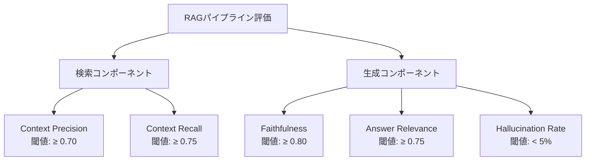
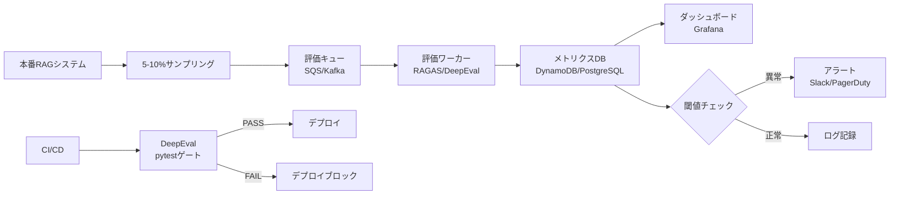

本記事は [PremAI Blog: RAG Evaluation: Metrics, Frameworks & Testing (2026)](https://blog.premai.io/rag-evaluation-metrics-frameworks-testing-2026/) の解説記事です。

## ブログ概要（Summary）

PremAI社のArnav Jalan氏が2026年3月に公開した本ガイドは、RAGシステムの本番品質評価について、指標設計からフレームワーク選定、CI/CD統合、本番監視戦略までを体系的にカバーする実践ガイドである。「多くのRAGパイプラインはデモを通過するが本番で失敗する」という問題意識のもと、検索失敗と生成失敗を分離して評価する5指標体系を提示している。

この記事は [Zenn記事: Embeddingモデルの本番評価パイプライン構築](https://zenn.dev/0h_n0/articles/1798f7e5c5fd69) の深掘りです。

## 情報源

- **種別**: 企業テックブログ
- **URL**: https://blog.premai.io/rag-evaluation-metrics-frameworks-testing-2026/
- **組織**: PremAI
- **著者**: Arnav Jalan
- **発表日**: 2026年3月17日

## 技術的背景（Technical Background）

### なぜRAG評価が難しいのか

ブログ著者は、RAGパイプラインには**2つの独立した障害モード**が存在すると指摘している。

1. **検索失敗（Retrieval Failures）**: 誤った文書の取得、ランキング不良、チャンキング不適切
2. **生成失敗（Generation Failures）**: コンテキスト無視、ハルシネーション、質問とは異なる内容への回答

これら2つの障害モードを**個別に検出・測定**できる指標設計が、本番品質を維持する鍵であると著者は主張している。

### 重要な知見

ブログで引用されている研究結果によると、**検索精度だけではEnd-to-EndのRAG品質の分散の約60%しか説明できない**。残りの40%は、モデルが取得したコンテキストをどう活用するか（生成品質）に依存する。この知見は、検索指標（Precision@K, nDCG等）だけでなく、生成品質指標（Faithfulness, Answer Relevance等）の同時監視が不可欠であることを示している。

## 5指標体系の詳細

### 指標の全体像



### 1. Faithfulness（忠実性）

回答に含まれる主張が取得コンテキストにより裏付けられているかを測定する。

- **目標閾値**: 0.8以上（規制産業では0.9以上）
- **低スコア時の対応**: モデルのハルシネーション傾向を調査。プロンプト設計またはリランカーの見直し
- **ブログの推奨**: 本番環境で最も重要な指標。この指標が低い場合、他の指標が高くても信頼できない

### 2. Answer Relevance（回答関連性）

回答が元の質問に対して適切に答えているかを測定する。

- **目標閾値**: 0.75以上
- **Faithfulnessとの組み合わせ**: Faithfulness高・Answer Relevance低の場合、モデルがコンテキストに忠実だが「別の質問に答えている」状態を示す。検索コンポーネントの問題を示唆する

### 3. Context Precision（コンテキスト精度）

関連するチャンクが検索結果の上位にランクされているかを測定する。

- **目標閾値**: 0.70以上
- **低スコア時の対応**: リランカーの導入・調整を検討

### 4. Context Recall（コンテキスト再現率）

質問に回答するために必要な情報が取得コンテキストに含まれているかを測定する。

- **目標閾値**: 0.75以上
- **制約**: 参照回答（正解データ）が必要
- **低スコア時の対応**: インデックス更新、ドキュメント追加、チャンキング戦略の見直し

### 5. Hallucination Rate（ハルシネーション率）

回答に含まれる裏付けのない主張の割合を追跡する。

- **本番ベンチマーク**: 5%未満
- **Faithfulnessとの関係**: 大規模運用ではFaithfulnessの逆数に近似

### 検索固有指標

ブログはさらに、検索コンポーネント単体の評価指標として以下を挙げている。

| 指標 | 説明 | 用途 |
|------|------|------|
| Precision@K | Top-K結果中の関連文書の割合 | 検索精度の直接測定 |
| Recall@K | 全関連文書のうちTop-Kに含まれる割合 | 検索網羅性の測定 |
| MRR | 最初の関連文書の逆順位 | ランキング品質の測定 |
| nDCG | 関連度をランク位置で重み付けした指標 | ランク全体の品質測定 |

## フレームワーク比較

### RAGAS vs DeepEval vs TruLens

ブログは3つの主要フレームワークを比較している。

| 項目 | RAGAS | DeepEval | TruLens |
|------|-------|----------|---------|
| **強み** | 素早い実験、合成データ生成 | pytest統合、メトリクス根拠提示 | リアルタイム計装、ダッシュボード |
| **弱み** | NaNスコア問題（不正JSON時） | セットアップがやや複雑 | バッチCI向けではない |
| **最適用途** | 初期メトリクス探索 | CI/CDテスト・本番ゲート | 開発時A/B実験 |
| **カスタム指標** | Langchain連携 | GEval（自然言語定義） | フィードバック関数 |

### 使い分けの指針

ブログ著者は以下の段階的導入を推奨している。

1. **探索フェーズ**: RAGASで5指標を素早く計測し、パイプラインの弱点を特定
2. **CI/CDフェーズ**: DeepEvalでpytest連携の自動テストを構築。閾値を下回ったらデプロイブロック
3. **本番監視フェーズ**: TruLensでリアルタイム計装し、品質推移をダッシュボードで可視化

## 本番評価戦略

### サンプリングアプローチ

ブログは**本番トラフィックの5-10%をサンプリング評価する**ことを推奨している。

**データセット構成の推奨**:
- **Goldenデータセット**: 50-200件の人手キュレーションQ&Aペア（コア追跡用）
- **合成データセット**: 500件のLLM生成質問（リグレッションテスト用）
- **本番由来データ**: 実ユーザークエリをフィルタリング・ラベル付け（定期更新）

### コスト管理

ブログで示されたコスト見積もりは以下の通りである。

| 項目 | コスト |
|------|--------|
| GPT-4o-miniをjudgeとした5指標評価 | **$0.001-0.003/テストケース** |
| 200問データセットの1回評価 | **$1未満** |
| セルフホストモデル使用 | API費用ゼロ |

### CI/CD統合

ブログはGitHub ActionsとDeepEvalを組み合わせたCI/CDパイプラインの例を提示している。

```python
# CI/CDでの評価ゲート例（DeepEval + pytest）
# ブログで紹介されている手法の概要
import pytest
from deepeval import assert_test
from deepeval.metrics import FaithfulnessMetric
from deepeval.test_case import LLMTestCase


@pytest.mark.parametrize("test_case", golden_dataset)
def test_faithfulness_gate(test_case: dict) -> None:
    """Faithfulnessが閾値0.8を下回ったらテスト失敗。"""
    metric = FaithfulnessMetric(
        threshold=0.8,
        model="gpt-4o-mini",
    )
    tc = LLMTestCase(
        input=test_case["question"],
        actual_output=test_case["answer"],
        retrieval_context=test_case["contexts"],
    )
    assert_test(tc, [metric])
```

### 本番監視アラート閾値

ブログで推奨されている監視閾値を整理する。

| メトリクス | アラート閾値 | 調査対象 |
|-----------|-----------|---------|
| Faithfulness（サンプリング） | < 0.75 | ドキュメント取り込み品質 |
| Answer Relevance（サンプリング） | < 0.70 | クエリ分布の変化 |
| Hallucination Rate | > 5% | 検索カバレッジギャップ |
| Context Utilization | < 40% | チャンキング・リランキング効果 |

## 実装アーキテクチャ（Architecture）

### 評価パイプラインの推奨構成



### ファインチューニング後の評価

ブログはモデルファインチューニング後に追跡すべき3つのデルタを定義している。

1. **Faithfulness**: ファインチューニング前後で大幅に低下していないこと
2. **Answer Correctness**: ドメイン内質問で改善していること
3. **ドメイン外Hallucination Rate**: ファインチューニングによるドメイン外での品質劣化がないこと

## Production Deployment Guide

### AWS実装パターン（コスト最適化重視）

| 規模 | 月間評価数 | 推奨構成 | 月額コスト | 主要サービス |
|------|----------|---------|-----------|------------|
| **Small** | ~3,000 | Serverless | $50-120 | Lambda + Bedrock + DynamoDB |
| **Medium** | ~30,000 | Hybrid | $250-600 | Lambda + ECS + ElastiCache |
| **Large** | 300,000+ | Container | $1,500-4,000 | EKS + Batch + RDS |

**Small構成の詳細** (月額$50-120):
- **Lambda**: 評価ワーカー、1GB RAM ($15/月)
- **Bedrock**: Claude 3.5 Haiku（judge用）($60/月)
- **DynamoDB**: 評価結果保存 ($10/月)
- **EventBridge**: スケジュール実行 ($5/月)

**コスト削減テクニック**:
- Bedrock Batch APIで50%割引（非リアルタイム評価向け）
- DynamoDB TTLで古い評価結果の自動クリーンアップ
- Lambda Provisioned Concurrency不使用でコスト最小化

**コスト試算の注意事項**: 上記は2026年3月時点のAWS ap-northeast-1料金に基づく概算値です。最新料金は [AWS料金計算ツール](https://calculator.aws/) で確認してください。

### Terraformインフラコード

```hcl
# --- RAG評価パイプライン（Serverless構成） ---
resource "aws_lambda_function" "rag_evaluator" {
  filename      = "rag_eval.zip"
  function_name = "rag-evaluation-pipeline"
  role          = aws_iam_role.eval_lambda.arn
  handler       = "handler.evaluate"
  runtime       = "python3.12"
  timeout       = 300
  memory_size   = 1024

  environment {
    variables = {
      BEDROCK_MODEL_ID = "anthropic.claude-3-5-haiku-20241022-v1:0"
      DYNAMODB_TABLE   = aws_dynamodb_table.eval_results.name
      SAMPLE_RATE      = "0.05"
      FAITH_THRESHOLD  = "0.75"
      RELEVANCE_THRESHOLD = "0.70"
    }
  }
}

# --- DynamoDB（評価結果） ---
resource "aws_dynamodb_table" "eval_results" {
  name         = "rag-eval-metrics"
  billing_mode = "PAY_PER_REQUEST"
  hash_key     = "query_id"
  range_key    = "eval_timestamp"

  attribute {
    name = "query_id"
    type = "S"
  }
  attribute {
    name = "eval_timestamp"
    type = "N"
  }

  ttl {
    attribute_name = "expire_at"
    enabled        = true
  }
}

# --- EventBridge（定期評価トリガー） ---
resource "aws_cloudwatch_event_rule" "daily_eval" {
  name                = "daily-rag-evaluation"
  schedule_expression = "rate(1 day)"
}
```

### セキュリティベストプラクティス

- **IAM最小権限**: Bedrock InvokeModel + DynamoDB PutItem のみ
- **KMS暗号化**: DynamoDB暗号化有効
- **VPC配置**: Lambda VPC内推奨

### コスト最適化チェックリスト

- [ ] サンプリング率5-10%で評価コスト制御
- [ ] Bedrock Batch APIで50%割引活用
- [ ] DynamoDB TTLで30日超の古いデータ自動削除
- [ ] GPT-4o-miniまたはClaude 3.5 Haikuをjudgeに使用（コスト最小化）
- [ ] 週次フル評価、日次はサンプリングのみ
- [ ] EventBridgeでスケジュール実行（常時稼働コスト回避）
- [ ] AWS Budgets: 月額予算設定（80%で警告）

## 運用での学び（Production Lessons）

### ベストプラクティス

ブログで強調されているベストプラクティスを整理する。

1. **閾値キャリブレーション**: 保守的に0.7から開始し、ベースラインを確立してから段階的に引き上げる
2. **データセットバージョニング**: 評価データセットとモデルバージョンを紐付けてタグ管理する
3. **異なるjudgeモデル**: 回答生成と評価に同じモデルを使わない（自己評価バイアス回避）
4. **人間レビュー**: 合成データセットは使用前に必ず人間がレビューする
5. **コンポーネント別評価**: 検索と生成の指標を分離して問題箇所を特定可能にする
6. **直接的な指標最適化の回避**: プロンプトを評価スコアに過学習させない

## 学術研究との関連（Academic Connection）

- **RAGAS (arXiv:2309.15217)**: ブログで紹介されている5指標のうち4指標はRAGASの原論文に基づく
- **ARES (arXiv:2311.09476)**: ブログでは直接言及されていないが、分類器ベースの低コスト評価アプローチはARESの考え方と補完的
- **PremAI社の知見**: ブログは学術論文ではなく実務経験に基づく知見であり、特に閾値設計やコスト管理のガイダンスは論文にはない実践的な価値を持つ

## まとめと実践への示唆

PremAI社の2026年ガイドは、RAG評価の理論と実務の橋渡しとして価値が高い。特に以下の3点は、Zenn記事の評価パイプラインを本番運用に移行する際に直接参照できる知見である。

1. **5-10%サンプリング**: 全トラフィック評価は非現実的。コスト効率と検出力のバランス
2. **$0.001-0.003/テストケース**: GPT-4o-miniをjudgeとした場合の具体的コスト目安
3. **段階的フレームワーク導入**: RAGAS（探索）→ DeepEval（CI/CD）→ TruLens（本番監視）

## 参考文献

- **Blog URL**: [https://blog.premai.io/rag-evaluation-metrics-frameworks-testing-2026/](https://blog.premai.io/rag-evaluation-metrics-frameworks-testing-2026/)
- **RAGAS**: [https://arxiv.org/abs/2309.15217](https://arxiv.org/abs/2309.15217)
- **DeepEval**: [https://docs.confident-ai.com/](https://docs.confident-ai.com/)
- **Related Zenn article**: [https://zenn.dev/0h_n0/articles/1798f7e5c5fd69](https://zenn.dev/0h_n0/articles/1798f7e5c5fd69)
