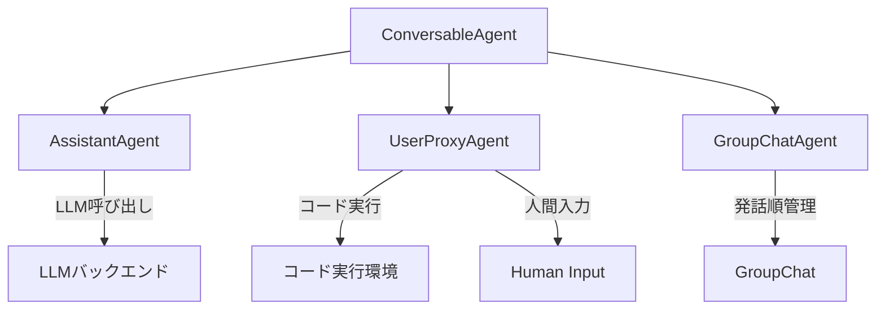

## 論文概要（Abstract）

本記事は [arXiv:2308.08155](https://arxiv.org/abs/2308.08155) の解説記事です。

AutoGenは、Microsoft Researchが2023年に発表したオープンソースフレームワークであり、**複数のエージェントが会話を通じてタスクを達成する**LLMアプリケーションの構築基盤を提供する。著者らは、エージェントを「カスタマイズ可能（customizable）」「会話可能（conversable）」「LLM・人間・ツールの組み合わせで動作可能」と定義し、この3つの特性を軸にフレームワークを設計している。

この記事は [Zenn記事: AutoGen v0.7で自律エージェントを構築する実践ガイド](https://zenn.dev/0h_n0/articles/b64c0d3cbd4035) の深掘りです。

## 情報源

- **arXiv ID**: 2308.08155
- **URL**: [https://arxiv.org/abs/2308.08155](https://arxiv.org/abs/2308.08155)
- **著者**: Qingyun Wu, Gagan Bansal, Jieyu Zhang, Yiran Wu, Beibin Li, Erkang Zhu, Li Jiang, Xiaoyun Zhang, Shaokun Zhang, Jiale Liu, Ahmed Hassan Awadallah, Ryen W. White, Doug Burger, Chi Wang
- **発表年**: 2023（初版: 2023年8月16日、改訂: 2023年10月3日）
- **分野**: cs.AI, cs.CL

## 背景と動機（Background & Motivation）

2023年時点で、GPT-4やClaude等のLLMは単体で多くのタスクを処理できるようになっていたが、複雑な実世界のタスク（コード生成→実行→デバッグのループ、複数の専門家による議論、人間の承認を含むワークフロー等）を単一エージェントで処理するには限界があった。

著者らは既存のLLMアプリケーション開発における3つの課題を指摘している：

1. **柔軟性の欠如**: 従来のフレームワークは固定的なパイプラインを前提としており、タスクに応じた動的な会話パターンの構築が困難であった
2. **人間参加の困難さ**: LLMの出力を人間がレビュー・修正するHuman-in-the-Loopの組み込みが体系化されていなかった
3. **ツール統合の複雑さ**: コード実行やAPI呼び出し等の外部ツールをエージェントに統合する標準的な方法が確立されていなかった

これらの課題に対し、AutoGenは**マルチエージェント会話**という統一的なパラダイムを提案した。

## 主要な貢献（Key Contributions）

著者らは以下の3つの貢献を主張している：

- **貢献1**: **Conversable Agentの抽象化** — LLM、人間、ツールを統一的に扱える「会話可能なエージェント」の設計パターンを確立。各エージェントはメッセージの送受信を通じて自律的に動作する
- **貢献2**: **柔軟な会話パターン** — 2者間の対話から多者間のグループチャットまで、自然言語とコードの両方で会話フローを定義できる仕組みを提供
- **貢献3**: **幅広い応用実証** — 数学問題解決、コーディング、質問応答、オペレーションズリサーチ、オンライン意思決定、エンターテイメント等、6つ以上のドメインでフレームワークの有効性を実証

## 技術的詳細（Technical Details）

### Conversable Agentアーキテクチャ

AutoGenの中核は**ConversableAgent**クラスである。すべてのエージェントはこのクラスを基底とし、以下の能力を持つ：



ConversableAgentは以下の2つの主要メソッドを定義する：

1. **`generate_reply(messages)`**: 受信メッセージに対する応答を生成する。LLM呼び出し、関数実行、人間入力のいずれか（またはその組み合わせ）で応答を生成
2. **`send(message, recipient)`**: 他のエージェントにメッセージを送信する

著者らはこの設計について、「エージェント間のインタラクションを会話として統一的にモデル化することで、複雑なワークフローを直感的に構築できる」と述べている（論文Section 2）。

### 会話パターンの設計

AutoGenは以下の会話パターンをサポートする：

| パターン | 構成 | 特徴 |
|---------|------|------|
| **Two-Agent Chat** | AssistantAgent + UserProxyAgent | 基本的な対話。コード生成→実行→修正ループ |
| **Sequential Chat** | 複数のTwo-Agent Chatの連鎖 | 段階的なタスク処理 |
| **Group Chat** | 3エージェント以上 + GroupChatManager | 動的な発話順制御 |
| **Nested Chat** | エージェント内部に別の会話を埋め込み | 階層的なタスク分解 |

### GroupChatの発話順制御

GroupChatでは、**GroupChatManager**が次の発話者を決定する。著者らは以下のアルゴリズムを用いている：

$$
\text{next\_speaker} = \arg\max_{a \in A} P_{\text{LLM}}(a \mid C, M)
$$

ここで、
- $A$: 参加エージェントの集合
- $C$: これまでの会話コンテキスト
- $M$: 各エージェントの説明メタデータ
- $P_{\text{LLM}}$: LLMによる次の発話者の選択確率

この方式により、タスクの文脈に応じて動的にエージェントが選択される。ただし、LLMベースの選択は決定論的ではないため、著者らは「allowed_or_disallowed_speaker_transitions」パラメータによる遷移制約の設定も提供している。

### ツール統合のメカニズム

AutoGenにおけるツール統合は、Python関数をそのままエージェントに登録する方式を採用している：

```python
from autogen import AssistantAgent, UserProxyAgent

# ツール関数の定義
def search_web(query: str) -> str:
    """Webを検索して結果を返す

    Args:
        query: 検索クエリ文字列

    Returns:
        検索結果の文字列
    """
    # 実際の検索API呼び出し
    return f"'{query}'の検索結果: ..."

# エージェント構成
assistant = AssistantAgent(
    name="assistant",
    llm_config={"model": "gpt-4"},
)
user_proxy = UserProxyAgent(
    name="user_proxy",
    code_execution_config={"work_dir": "coding"},
)

# ツール登録
assistant.register_for_llm(
    name="search_web",
    description="Webを検索する"
)(search_web)
user_proxy.register_for_execution(
    name="search_web"
)(search_web)
```

著者らは「関数のdocstringと型ヒントからOpenAI Function Calling形式のスキーマを自動生成する」と述べており（論文Section 2.2）、これによりツール定義のボイラープレートを大幅に削減している。

## 実装のポイント（Implementation）

### ConversableAgentの内部ループ

AutoGenの実装で特に重要なのは、エージェントの応答生成ループである。`generate_reply`は以下の順序で応答を試みる：

1. **登録された関数/ツールの実行**（関数呼び出しが要求されている場合）
2. **LLMによるテキスト生成**（LLM configが設定されている場合）
3. **人間入力の要求**（human_input_mode設定に応じて）

この優先順序により、ツール呼び出しが最優先で処理され、LLM推論はツールが不要な場合にのみ実行される。

### コード実行のサンドボックス化

UserProxyAgentはコード実行能力を持つが、著者らはセキュリティリスクを認識しており、Docker コンテナ内での実行を推奨している：

```python
user_proxy = UserProxyAgent(
    name="user_proxy",
    code_execution_config={
        "work_dir": "coding",
        "use_docker": True,  # Dockerコンテナ内で実行
    },
)
```

### 注意すべき設計上の制約

- **状態管理**: v1（2308.08155時点）ではエージェントの状態はメモリ上に保持され、セッション間の永続化は非ネイティブである
- **トークン消費**: GroupChatでは全会話履歴が各エージェントに渡されるため、エージェント数と会話ターン数に比例してトークン消費が増大する
- **エラー伝播**: ツール実行エラーはメッセージとしてLLMに返され、LLMが修正を試みる設計だが、エラーメッセージの品質がリカバリ成功率に影響する

## 実験結果（Results）

著者らは6つのアプリケーションドメインで評価を実施している：

| アプリケーション | 構成 | 結果概要 |
|---------------|------|---------|
| **数学問題解決** | AssistantAgent + UserProxy（コード実行） | MATH データセットで、コード実行ありのAutoGen構成がCoT（Chain of Thought）単体を上回る |
| **検索拡張チャット** | AssistantAgent + RetrieveUserProxy | 自然言語QAタスクで、検索結果を会話コンテキストに統合して回答精度を向上 |
| **コード生成** | AssistantAgent + UserProxy | コード生成→実行→デバッグの自動ループにより、単一パスのコード生成よりも成功率が向上 |
| **意思決定** | 複数Agent + GroupChat | ALFWorldタスクで、複数エージェントの議論がシングルエージェントより高い成功率を達成 |
| **マルチエージェント議論** | 3+ Agents + GroupChatManager | チェス対戦シミュレーションで、各エージェントが異なる戦略を議論しながら手を決定 |
| **動的GroupChat** | 可変数Agent + 動的選択 | オペレーションズリサーチの最適化問題で、専門家エージェントの動的切り替えが有効であることを確認 |

著者らは「マルチエージェント会話パラダイムにより、これらすべてのアプリケーションを統一的なフレームワーク上で実装できた」と報告している（論文Section 4）。具体的な数値としては、MATHデータセットにおいてAutoGenの2エージェント構成（コード実行付き）が、GPT-4単体のCoTプロンプティングと比較して問題解決率を向上させたことが示されている。

## 実運用への応用（Practical Applications）

AutoGenのマルチエージェント会話パラダイムは、以下のような実運用シナリオに適用可能である：

- **自動化コードレビュー**: コード生成エージェント + レビューエージェント + テスト実行エージェントの3者構成で、コード品質の自動チェックパイプラインを構築
- **カスタマーサポート**: 一次対応エージェント → 専門エージェントへのエスカレーション → 人間オペレーターへのHandoff という段階的な対応フロー
- **研究支援**: 文献検索エージェント + 分析エージェント + 要約エージェントによるリサーチ自動化

ただし、プロダクション環境では以下の点に注意が必要である：
- GroupChatのトークン消費はエージェント数に比例して増加するため、コスト管理が重要
- LLMベースの発話者選択は非決定論的であり、再現性が求められるワークフローではルールベースの遷移制御が推奨される
- エラーハンドリングとリトライ戦略を明示的に設計する必要がある

## Production Deployment Guide

### AWS実装パターン（コスト最適化重視）

AutoGenベースのマルチエージェントシステムをAWS上にデプロイする場合、トラフィック量に応じて以下の構成を推奨する。

**トラフィック量別の推奨構成**:

| 規模 | 月間リクエスト | 推奨構成 | 月額コスト | 主要サービス |
|------|--------------|---------|-----------|------------|
| **Small** | ~3,000 (100/日) | Serverless | $50-150 | Lambda + Bedrock + DynamoDB |
| **Medium** | ~30,000 (1,000/日) | Hybrid | $300-800 | Lambda + ECS Fargate + ElastiCache |
| **Large** | 300,000+ (10,000/日) | Container | $2,000-5,000 | EKS + Karpenter + EC2 Spot |

**Small構成の詳細** (月額$50-150):
- **Lambda**: 1GB RAM, 60秒タイムアウト（マルチエージェント会話は応答時間が長い）($20/月)
- **Bedrock**: Claude 3.5 Haiku, Prompt Caching有効 ($80/月)
- **DynamoDB**: On-Demand、会話履歴保存 ($10/月)
- **CloudWatch**: 基本監視 ($5/月)
- **API Gateway**: REST API ($5/月)

**Medium構成の詳細** (月額$300-800):
- **ECS Fargate**: 1 vCPU, 2GB RAM × 2タスク（エージェントの状態保持に必要）($200/月)
- **Bedrock**: Claude 3.5 Sonnet, Batch API活用 ($400/月)
- **ElastiCache Redis**: cache.t3.micro、会話コンテキストキャッシュ ($15/月)
- **Application Load Balancer**: ($20/月)

**コスト削減テクニック**:
- Bedrock Batch API使用で50%割引（非リアルタイム処理向け）
- Prompt Caching有効化でシステムプロンプトのコストを30-90%削減
- Spot Instances使用で最大90%削減（EKS + Karpenter構成時）

**コスト試算の注意事項**:
- 上記は2026年3月時点のAWS ap-northeast-1（東京）リージョン料金に基づく概算値です
- マルチエージェント構成ではエージェント数に比例してLLM呼び出し回数が増加するため、実際のコストは構成に大きく依存します
- 最新料金は [AWS料金計算ツール](https://calculator.aws/) で確認してください

### Terraformインフラコード

**Small構成 (Serverless): Lambda + Bedrock + DynamoDB**

```hcl
module "vpc" {
  source  = "terraform-aws-modules/vpc/aws"
  version = "~> 5.0"

  name = "autogen-vpc"
  cidr = "10.0.0.0/16"
  azs  = ["ap-northeast-1a", "ap-northeast-1c"]
  private_subnets = ["10.0.1.0/24", "10.0.2.0/24"]

  enable_nat_gateway   = false
  enable_dns_hostnames = true
}

resource "aws_iam_role" "lambda_autogen" {
  name = "lambda-autogen-role"

  assume_role_policy = jsonencode({
    Version = "2012-10-17"
    Statement = [{
      Action = "sts:AssumeRole"
      Effect = "Allow"
      Principal = { Service = "lambda.amazonaws.com" }
    }]
  })
}

resource "aws_iam_role_policy" "bedrock_invoke" {
  role = aws_iam_role.lambda_autogen.id
  policy = jsonencode({
    Version = "2012-10-17"
    Statement = [{
      Effect   = "Allow"
      Action   = ["bedrock:InvokeModel", "bedrock:InvokeModelWithResponseStream"]
      Resource = "arn:aws:bedrock:ap-northeast-1::foundation-model/anthropic.claude-3-5-haiku*"
    }]
  })
}

resource "aws_lambda_function" "autogen_handler" {
  filename      = "lambda.zip"
  function_name = "autogen-multi-agent"
  role          = aws_iam_role.lambda_autogen.arn
  handler       = "index.handler"
  runtime       = "python3.12"
  timeout       = 120
  memory_size   = 1024

  environment {
    variables = {
      BEDROCK_MODEL_ID    = "anthropic.claude-3-5-haiku-20241022-v1:0"
      DYNAMODB_TABLE      = aws_dynamodb_table.conversation.name
      ENABLE_PROMPT_CACHE = "true"
    }
  }
}

resource "aws_dynamodb_table" "conversation" {
  name         = "autogen-conversations"
  billing_mode = "PAY_PER_REQUEST"
  hash_key     = "session_id"

  attribute {
    name = "session_id"
    type = "S"
  }

  ttl {
    attribute_name = "expire_at"
    enabled        = true
  }
}
```

### セキュリティベストプラクティス

- **IAMロール**: 最小権限の原則。Bedrockの特定モデルのみInvoke許可
- **ネットワーク**: Lambda/ECSはプライベートサブネットに配置
- **シークレット管理**: AWS Secrets Manager使用、環境変数へのハードコード禁止
- **暗号化**: DynamoDB/S3はKMS暗号化、転送中はTLS 1.2以上

### 運用・監視設定

```python
import boto3

cloudwatch = boto3.client('cloudwatch')

# マルチエージェント会話のトークン使用量アラート
cloudwatch.put_metric_alarm(
    AlarmName='autogen-token-spike',
    ComparisonOperator='GreaterThanThreshold',
    EvaluationPeriods=1,
    MetricName='TokenUsage',
    Namespace='Custom/AutoGen',
    Period=3600,
    Statistic='Sum',
    Threshold=500000,
    ActionsEnabled=True,
    AlarmActions=['arn:aws:sns:ap-northeast-1:123456789:cost-alerts'],
    AlarmDescription='AutoGenトークン使用量異常（コスト急増の可能性）'
)
```

### コスト最適化チェックリスト

- [ ] ~100 req/日 → Lambda + Bedrock (Serverless) - $50-150/月
- [ ] ~1000 req/日 → ECS Fargate + Bedrock (Hybrid) - $300-800/月
- [ ] 10000+ req/日 → EKS + Spot Instances (Container) - $2,000-5,000/月
- [ ] Spot Instances優先（最大90%削減）
- [ ] Bedrock Batch API使用（50%割引）
- [ ] Prompt Caching有効化（30-90%削減）
- [ ] Lambda メモリサイズ最適化
- [ ] ECS/EKS アイドル時スケールダウン
- [ ] AWS Budgets 月額予算設定（80%で警告）
- [ ] CloudWatch トークン使用量スパイク検知
- [ ] Cost Anomaly Detection 有効化
- [ ] 日次コストレポート SNS/Slack送信
- [ ] 未使用リソース定期削除
- [ ] タグ戦略（環境別・プロジェクト別）
- [ ] S3キャッシュ ライフサイクルポリシー（30日削除）
- [ ] 開発環境の夜間停止
- [ ] Reserved Instances検討（1年コミットで72%削減）
- [ ] Savings Plans検討（柔軟性高）
- [ ] モデル選択ロジック（簡易タスク: Haiku、複雑タスク: Sonnet）
- [ ] max_tokens設定で過剰生成防止

## 関連研究（Related Work）

- **CAMEL** (Li et al., 2023): 2エージェントのロールプレイング方式。AutoGenはN体のエージェント構成をサポートする点で汎用性が高い
- **MetaGPT** (Hong et al., 2023): ソフトウェア開発に特化したマルチエージェントフレームワーク。AutoGenはドメイン非依存である点が異なる
- **LangChain Agents**: ツールチェーンの逐次実行に特化。AutoGenは会話ベースの柔軟なインタラクションを提供

## まとめと今後の展望

AutoGenの原論文は、LLMアプリケーション開発における**マルチエージェント会話パラダイム**の有効性を体系的に示した。ConversableAgentの抽象化により、LLM・人間・ツールを統一的に扱えるフレームワークが実現された。

2026年2月にMicrosoftはAutoGenをメンテナンスモードに移行し、Semantic Kernelと統合した[Microsoft Agent Framework](https://learn.microsoft.com/en-us/agent-framework/overview/)をリリースしている。原論文の設計思想（会話可能なエージェント、柔軟な会話パターン、ツール統合）はMicrosoft Agent Frameworkに引き継がれており、今後もマルチエージェントシステムの基盤設計として参照される論文である。

## 参考文献

- **arXiv**: [https://arxiv.org/abs/2308.08155](https://arxiv.org/abs/2308.08155)
- **Code**: [https://github.com/microsoft/autogen](https://github.com/microsoft/autogen)
- **Related Zenn article**: [https://zenn.dev/0h_n0/articles/b64c0d3cbd4035](https://zenn.dev/0h_n0/articles/b64c0d3cbd4035)

---

:::message
この記事はAI（Claude Code）により自動生成されました。論文の主張や実験結果は原著者の報告に基づいています。実際の利用時は原論文および公式ドキュメントもご確認ください。
:::
