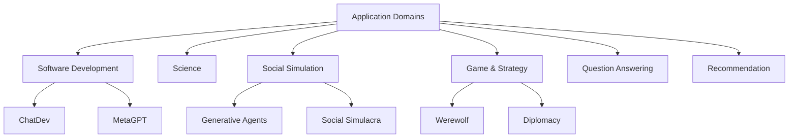

## 論文概要（Abstract）

本記事は [arXiv:2402.01680](https://arxiv.org/abs/2402.01680) の解説記事です。

LLMは多様なタスクで優れた性能を示し、自律的な計画・推論エージェントとしての利用が進んでいる。本サーベイは、単一エージェントの発展を踏まえ、**LLMベースのマルチエージェントシステム**が複雑な問題解決と世界シミュレーションにおいてどのような進展を遂げているかを包括的に調査する。著者らは4つの研究課題を設定し、ドメイン・エージェントプロファイリング・通信メカニズム・能力強化の各側面から体系的な分析を行っている。

この記事は [Zenn記事: AutoGen v0.7で自律エージェントを構築する実践ガイド](https://zenn.dev/0h_n0/articles/b64c0d3cbd4035) の深掘りです。

## 情報源

- **会議名**: IJCAI 2024（International Joint Conference on Artificial Intelligence）
- **年**: 2024
- **URL**: [https://arxiv.org/abs/2402.01680](https://arxiv.org/abs/2402.01680)
- **著者**: Taicheng Guo, Xiuying Chen, Yaqi Wang, Ruidi Chang, Shichao Pei, Nitesh V. Chawla, Olaf Wiest, Xiangliang Zhang
- **初版投稿**: 2024年1月21日、改訂: 2024年4月19日

## カンファレンス情報

**IJCAIについて**:
IJCAI（International Joint Conference on Artificial Intelligence）はAI分野の最も歴史ある国際会議の1つであり、1969年から開催されている。採択率は通常15-20%程度で、AI全般にわたる幅広いトピックをカバーする。LLMベースマルチエージェントシステムのサーベイがIJCAIに採択されたことは、このトピックがAIコミュニティにおいて中心的な研究テーマとなっていることを示している。

## 技術的詳細（Technical Details）

### 4つの研究課題

著者らは以下の4つの研究課題（Research Questions）を設定している：

1. **RQ1**: LLMベースMASはどのようなドメイン・環境をシミュレーションしているか
2. **RQ2**: エージェントのプロファイリングと通信はどう設計されているか
3. **RQ3**: エージェントの能力を強化するメカニズムにはどのようなものがあるか
4. **RQ4**: 利用可能なデータセットとベンチマークは何か

### RQ1: ドメインと環境

著者らはLLMベースMASの応用ドメインを以下に分類している：



| ドメイン | 代表的システム | MASの役割 |
|---------|--------------|----------|
| **ソフトウェア開発** | ChatDev, MetaGPT | 役割分担による協調開発（PM→設計者→開発者→テスター） |
| **科学研究** | ChemCrow | 専門エージェントによる仮説生成・実験計画 |
| **社会シミュレーション** | Generative Agents | 25体のエージェントによる社会動態のシミュレーション |
| **ゲーム・戦略** | Werewolf | 議論・推理・投票を通じた戦略的意思決定 |
| **質問応答** | LLM-Debate | 複数エージェントの議論による回答精度向上 |

### RQ2: エージェントプロファイリングと通信

#### エージェントプロファイリング

著者らは3つのプロファイリング手法を区別している：

1. **事前定義型（Pre-defined）**: 開発者がシステムプロンプトで役割を明示的に設定
   - AutoGenでは`system_message`パラメータで実装
   - 例: `"あなたは技術アシスタントです。ユーザーの質問に正確に回答してください。"`

2. **モデル生成型（Model-generated）**: LLMが文脈に応じて動的に役割を生成
   - AutoGenのSelectorGroupChatで、LLMが次の発話者を動的に選択するケースが該当

3. **データ駆動型（Data-driven）**: 実際のデータ（人間の行動ログ等）からプロファイルを学習
   - Generative Agentsが代表例（25体の仮想住民がメモリストリームから行動パターンを学習）

#### 通信メカニズム

エージェント間の通信を以下のように分類：

| 通信方式 | 説明 | AutoGenでの対応 |
|---------|------|----------------|
| **Cooperative** | 共通目標に向けた情報共有 | RoundRobinGroupChat |
| **Debate** | 反論を通じた解の洗練 | SelectorGroupChat（議論モード） |
| **Negotiation** | 利害調整を伴う合意形成 | Swarm + HandoffMessage |
| **Feedback** | 生成→評価→改善ループ | AssistantAgent + reflect_on_tool_use |

著者らは「通信方式の選択がタスク性能に与える影響は大きいが、最適な通信方式はタスク特性に依存する」と分析している。

### RQ3: 能力強化メカニズム

エージェントの能力を強化する4つのメカニズム：

#### 1. メモリ（Memory）

$$
\text{Memory} = \{\text{Short-term}(M_s), \text{Long-term}(M_l), \text{Shared}(M_{shared})\}
$$

- **Short-term Memory ($M_s$)**: 現在の会話コンテキスト。AutoGenの会話履歴に対応
- **Long-term Memory ($M_l$)**: 過去のインタラクションの永続的記録。AutoGenのExtensionsで提供
- **Shared Memory ($M_{shared}$)**: エージェント間で共有される情報。ブラックボードパターン

#### 2. 自己改善（Self-evolution）

エージェントが過去の成功・失敗から学習し、行動を改善するメカニズム：

```python
# 自己改善ループの概念
async def self_evolving_agent(
    task: str,
    history: list[dict],
    model_client: OpenAIChatCompletionClient,
) -> str:
    """過去の履歴から学習して行動を改善するエージェント

    Args:
        task: 現在のタスク
        history: 過去のタスク実行履歴（成功/失敗、フィードバック）
        model_client: LLMクライアント

    Returns:
        改善されたタスク実行結果
    """
    # 過去の失敗事例からパターンを抽出
    failure_patterns = extract_failures(history)

    # 改善されたプロンプトを生成
    improved_prompt = generate_improved_prompt(
        task, failure_patterns
    )

    # 実行
    result = await model_client.create(
        messages=[{"role": "system", "content": improved_prompt}]
    )
    return result
```

#### 3. 動的エージェント生成

タスクの要件に応じてエージェントを動的に生成するメカニズム。著者らは「固定数のエージェントではなく、タスク分析に基づいてエージェントの数と役割を動的に決定する」アプローチの有効性を報告している。

#### 4. ツール使用（Tool Use）

外部APIやコード実行環境との統合。Toolformer（Schick et al., 2023）の研究を基盤とし、AutoGenのFunctionToolやコード実行サンドボックスとして実装されている。

### RQ4: 評価ベンチマーク

著者らが整理した主要なベンチマーク：

| ベンチマーク | ドメイン | 評価対象 |
|------------|---------|---------|
| **ChatEval** | 対話 | 応答品質、一貫性 |
| **AgentBench** | 汎用 | Webブラウジング、コード、DB操作 |
| **CAMEL** | ロールプレイ | 2エージェントの協調品質 |
| **SWE-bench** | ソフトウェア開発 | GitHubイシューの解決率 |
| **GAIA** | 汎用AI | マルチステップ推論、ツール使用 |

## 実験結果（Results）

本サーベイは調査論文であるため独自の実験は含まれないが、著者らはサーベイ対象論文から以下の傾向を抽出している：

- **ソフトウェア開発ドメイン**: ChatDevの研究では、マルチエージェント構成（CEO→CTO→プログラマー→テスター）がシングルエージェントと比較してコード品質（テストパス率）を向上させたと報告されている
- **社会シミュレーション**: Generative Agentsの研究では、25体のエージェントが独立した行動を取りながら自然な社会動態（パーティーの企画、噂の伝播等）を創発したことが報告されている
- **議論による改善**: LLM-Debateの研究では、複数のLLMが議論を通じて回答を洗練することで、単一LLMと比較してMATH, GSM8K等のベンチマークで精度が向上したことが報告されている

著者らは「マルチエージェントの有効性は確認されているが、統一的な評価基準が確立されていない」という課題を強調している。

## 実装のポイント

本サーベイの知見をAutoGen v0.7での実装に適用する際のガイドライン：

**プロファイリング手法の選択**:
- **プロトタイプ段階**: 事前定義型（`system_message`で役割を明示）が最も簡単
- **本番段階**: モデル生成型（SelectorGroupChat）で動的な役割割り当てを導入
- **高度な要件**: データ駆動型（過去のインタラクションログから学習）

**通信方式とAutoGenパターンの対応**:
```python
# 1. Cooperative (協調型) → RoundRobinGroupChat
team = RoundRobinGroupChat(
    [agent_a, agent_b],
    max_turns=6,
)

# 2. Debate (議論型) → SelectorGroupChat
team = SelectorGroupChat(
    [proposer, critic, judge],
    model_client=model_client,
)

# 3. Feedback (フィードバック型) → Swarm
team = Swarm(
    [generator, reviewer],
    termination_condition=TextMentionTermination("APPROVED"),
)
```

**メモリ統合の実装**:
- AutoGen v0.7のExtensionsで提供されるメモリ機能を活用
- 会話履歴が長くなる場合はコンテキストウィンドウの管理が必要（要約や選択的な履歴保持）

## 実運用への応用（Practical Applications）

本サーベイが示すMASの応用パターンは、AutoGenベースのプロダクション設計に以下のように活用できる：

- **ソフトウェア開発支援**: ChatDevパターンを参考に、コード生成→レビュー→テスト→修正の自動化パイプラインを構築。AutoGenのRoundRobinGroupChatで段階的に処理
- **研究支援**: 文献検索→分析→仮説生成→検証の自動化。AutoGenのSwarmで各専門エージェントがHandoffMessageでタスクを委譲
- **カスタマーサポート**: 一次対応→専門エスカレーション→人間オペレーターのフロー。AutoGenのHandoffTerminationでHuman-in-the-Loopを実装

著者らは「MASの実運用では、エージェント数の増加に伴うトークンコストの管理が最大の課題」と指摘しており、モデル選択ロジック（簡易タスクにHaiku、複雑タスクにSonnet等）の導入を推奨している。

## 関連研究（Related Work）

- **[2501.06322] Multi-Agent Collaboration Mechanisms** (Tran et al., 2025): 本サーベイの1年後に発表された後続サーベイ。5次元タクソノミーによるより詳細な協調メカニズムの分類を提供
- **[2308.08155] AutoGen** (Wu et al., 2023): 本サーベイが分析対象とする主要フレームワーク。ConversableAgentの設計が本サーベイのエージェントプロファイリング手法の具体例として引用されている
- **[2303.17760] Generative Agents** (Park et al., 2023): 社会シミュレーションの代表的研究。本サーベイで詳しく分析されている

## まとめ

本サーベイは、LLMベースMASを4つの研究課題（ドメイン・プロファイリング・能力強化・評価）の観点から包括的に整理した。著者らは「MASの有効性は多くのドメインで確認されているが、統一的な評価基準の確立とスケーラビリティの改善が今後の主要課題」と結論づけている。

AutoGen v0.7の利用者にとって、本サーベイはエージェントプロファイリング手法（事前定義/モデル生成/データ駆動）の選択基準と、通信方式（Cooperative/Debate/Negotiation/Feedback）のAutoGenパターンへのマッピングを提供する有用なリファレンスである。

## 参考文献

- **arXiv**: [https://arxiv.org/abs/2402.01680](https://arxiv.org/abs/2402.01680)
- **GitHub**: [https://github.com/taichengguo/LLM_MultiAgents_Survey_Papers](https://github.com/taichengguo/LLM_MultiAgents_Survey_Papers)
- **Related Zenn article**: [https://zenn.dev/0h_n0/articles/b64c0d3cbd4035](https://zenn.dev/0h_n0/articles/b64c0d3cbd4035)

---

:::message
この記事はAI（Claude Code）により自動生成されました。論文の主張や分析結果は原著者の報告に基づいています。実際の利用時は原論文もご確認ください。
:::
