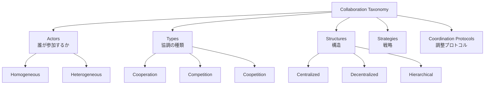

## 論文概要（Abstract）

本記事は [arXiv:2501.06322](https://arxiv.org/abs/2501.06322) の解説記事です。

LLMの進化に伴い、複数のLLMベースエージェントが協調してタスクを解決するマルチエージェントシステム（MAS）が急速に発展している。本サーベイは、LLMベースMASにおける**協調メカニズム**を体系的にレビューし、単一エージェントモデルから動的なマルチエージェントアーキテクチャへの進化を追跡する。著者らは協調メカニズムを5つの次元で整理するタクソノミーを提案しており、フレームワーク選定や設計判断の基盤として有用である。

この記事は [Zenn記事: AutoGen v0.7で自律エージェントを構築する実践ガイド](https://zenn.dev/0h_n0/articles/b64c0d3cbd4035) の深掘りです。

## 情報源

- **arXiv ID**: 2501.06322
- **URL**: [https://arxiv.org/abs/2501.06322](https://arxiv.org/abs/2501.06322)
- **著者**: Khanh-Tung Tran, Dung Dao, Minh-Duong Nguyen, Quoc-Viet Pham, Barry O'Sullivan, Hoang D. Nguyen
- **発表年**: 2025（2025年1月10日投稿）
- **分野**: cs.AI

## 背景と動機（Background & Motivation）

2024年以降、LLMベースのマルチエージェントシステムは研究と産業の両面で普及が進んだ。AutoGen、CrewAI、LangGraph、MetaGPT等のフレームワークが登場し、それぞれ異なる協調パターンを提供している。しかし、著者らは以下の課題を指摘している：

1. **統一的な分類体系の欠如**: 各フレームワークが独自の用語と概念を用いており、横断的な比較が困難
2. **協調メカニズムの選択基準が不明確**: どのタスクにどの協調パターンが適しているかの体系的な知見が不足
3. **理論と実装のギャップ**: 学術論文の提案と実際のフレームワーク実装の間に乖離がある

本サーベイはこれらの課題に対し、**5次元のタクソノミー**で協調メカニズムを体系化し、実装者がフレームワークやパターンを選択する際の判断基盤を提供することを目的としている。

## 主要な貢献（Key Contributions）

- **貢献1**: **5次元タクソノミーの提案** — Actors（誰が）、Types（なぜ）、Structures（どう構成するか）、Strategies（どう戦略を立てるか）、Coordination Protocols（どう調整するか）の5軸で協調メカニズムを整理
- **貢献2**: **既存フレームワークの横断的分析** — AutoGen、CrewAI、LangGraph、MetaGPT、CAMEL等の主要フレームワークをタクソノミーに沿って分類・比較
- **貢献3**: **応用領域の体系化** — 5G/6Gネットワーク、Industry 5.0、質問応答、社会シミュレーション等のMAS応用を整理し、各領域に適した協調メカニズムを示唆

## 技術的詳細（Technical Details）

### 5次元タクソノミー

著者らが提案するタクソノミーは、マルチエージェント協調を以下の5次元で特徴づける：



#### 1. Actors（アクター）

エージェントの構成を「同質（Homogeneous）」と「異質（Heterogeneous）」に分類する。

- **同質エージェント**: 全エージェントが同一のLLMと能力を持つ。Voting（多数決）やDebate（議論）パターンに適する
- **異質エージェント**: エージェントごとに異なる専門性・能力を持つ。AutoGenのAssistantAgent + UserProxyAgent構成やSwarmパターンが該当

著者らは「異質エージェント構成の方がタスク完了率は高いが、エージェント間の通信オーバーヘッドも大きくなる」と分析している。

#### 2. Types（協調タイプ）

| タイプ | 説明 | 例 |
|--------|------|-----|
| **Cooperation** | 共通目標に向けて協力 | AutoGenのチーム（RoundRobin, Swarm） |
| **Competition** | 相互に競争し最良の結果を選択 | Debate構成、アドバーサリアル生成 |
| **Coopetition** | 協力と競争の混合 | レビュー+改善ループ |

#### 3. Structures（構造）

エージェント間のトポロジーを以下に分類する：

- **Centralized（中央集権型）**: 1つの管理エージェントが全体を制御。AutoGenのGroupChatManagerが該当。利点はグローバルな状態管理、欠点はボトルネックと単一障害点
- **Decentralized（分散型）**: エージェントがピアツーピアで通信。AutoGenのSwarmパターン（HandoffMessage）が該当。利点はスケーラビリティ、欠点はグローバル状態の欠如
- **Hierarchical（階層型）**: 管理エージェントの下にサブチームを配置。MagenticOneの構成が該当

$$
\text{Communication Cost} = O(n^2) \quad \text{(Centralized, Decentralized)}
$$

$$
\text{Communication Cost} = O(n \cdot \log n) \quad \text{(Hierarchical)}
$$

ここで $n$ はエージェント数。著者らは「エージェント数が10を超える場合、階層型構造が通信コストの面で有利になる」と分析している。

#### 4. Strategies（戦略）

- **Role-based（ロールベース）**: 各エージェントに明示的な役割を割り当てる。AutoGenの`system_message`による役割定義が該当
- **Model-based（モデルベース）**: LLMが動的に戦略を決定する。SelectorGroupChatでLLMが次の発話者を選択するパターンが該当

#### 5. Coordination Protocols（調整プロトコル）

エージェント間の通信プロトコルを「メッセージパッシング」「共有メモリ」「ブラックボード」等に分類。AutoGenはメッセージパッシング方式を採用しており、各エージェントが`send()`と`receive()`でメッセージを交換する。

### フレームワーク比較

著者らのタクソノミーに基づく主要フレームワークの分類：

| フレームワーク | Actors | Structure | Strategy | 強み |
|--------------|--------|-----------|----------|------|
| **AutoGen** | 異質 | 中央集権/分散 | ロール+モデル | 柔軟な会話パターン、コード実行 |
| **CrewAI** | 異質 | 中央集権 | ロール | 直感的なrole/goal/backstory API |
| **LangGraph** | 異質 | グラフ | モデル | 明示的DAG+状態管理 |
| **MetaGPT** | 異質 | 階層 | ロール | SOP（標準作業手順）の組み込み |
| **CAMEL** | 同質/異質 | ピアツーピア | ロール | 2エージェントのロールプレイング |

## 実装のポイント（Implementation）

サーベイの知見をAutoGen v0.7での実装に適用する際のポイント：

**構造選択の指針**:
- エージェント数 ≤ 5: Centralized（GroupChat）で十分
- エージェント数 5-10: Swarm（Decentralized）で通信効率を確保
- エージェント数 > 10: Hierarchical（MagenticOne等）を検討

**協調タイプの選択**:
```python
# Cooperation（協力型）: Swarm or RoundRobin
from autogen_agentchat.teams import Swarm, RoundRobinGroupChat

team = Swarm(participants=[planner, researcher, writer])

# Competition（競争型）: 複数エージェントの出力を比較
results = [await agent.run(task=task) for agent in competing_agents]
best = select_best(results)

# Coopetition（協競型）: 生成→レビュー→改善ループ
team = RoundRobinGroupChat(
    [generator, reviewer],
    max_turns=4,  # 2ラウンドの改善
)
```

**注意すべき制約**:
- 分散型（Swarm）はグローバル状態管理が欠如するため、タスクの複雑度が上がると精度が低下する傾向がある
- ロールベース戦略はプロンプトエンジニアリングの品質に大きく依存する
- 通信オーバーヘッドはエージェント数の2乗に比例するため、不要なエージェントを増やさないことが重要

## 実験結果（Results）

本サーベイは調査論文であるため、独自のベンチマーク結果は含まれない。ただし、著者らはサーベイ対象論文の横断的分析から以下の傾向を報告している：

| 協調パターン | タスク適性 | 報告されている傾向 |
|-------------|----------|-----------------|
| **Debate（議論）** | 推論・数学 | 単一エージェント比で精度5-15%向上（複数論文の報告値） |
| **Role-play** | コード生成・文書作成 | タスク完了率の向上が報告されている |
| **Voting（多数決）** | 事実QA | 回答精度の安定化に寄与 |
| **Hierarchical** | 複合タスク | サブタスク分解により大規模タスクの処理が可能に |

著者らは「統一ベンチマークの欠如が、協調メカニズムの定量的比較を困難にしている」と課題を指摘している。

## 実運用への応用（Practical Applications）

著者らはMASの応用領域として以下を特定している：

- **5G/6Gネットワーク管理**: 異質エージェントによるネットワーク最適化
- **Industry 5.0**: 製造プロセスの自動化と品質管理。人間-AI協調が重要
- **質問応答システム**: 検索+分析+回答生成の協調
- **社会シミュレーション**: 多数の同質エージェントによる社会動態のモデリング

AutoGenユーザーにとっては、タスクの特性に応じてSwarm（分散型協力）とGroupChat（中央集権型）を使い分ける判断基準として、本サーベイのタクソノミーが直接的に活用できる。

## 関連研究（Related Work）

- **[2402.01680] Large Language Model based Multi-Agents** (Guo et al., 2024): IJCAI 2024採択のマルチエージェントサーベイ。プロファイリングと通信に焦点を当てている点で本サーベイと補完的
- **[2502.14321] Beyond Self-Talk** (2025): 通信中心の視点からMASを分析。本サーベイの「Coordination Protocols」次元と密接に関連
- **[2308.08155] AutoGen** (Wu et al., 2023): 本サーベイが分析対象とする主要フレームワークの1つ

## まとめと今後の展望

本サーベイは、LLMベースMASの協調メカニズムを**5次元（Actors, Types, Structures, Strategies, Coordination Protocols）**で体系化した。著者らは、現在のMAS研究における主要課題として「統一ベンチマークの欠如」「実運用での再現性ギャップ」「スケーラビリティの限界」を指摘しており、今後の研究方向として「人工的集合知（Artificial Collective Intelligence）」への進化を示唆している。

AutoGen v0.7のSwarmやGroupChatを利用する開発者にとって、本サーベイのタクソノミーはチーム構成やパターン選択の理論的根拠として有用である。

## 参考文献

- **arXiv**: [https://arxiv.org/abs/2501.06322](https://arxiv.org/abs/2501.06322)
- **Related Zenn article**: [https://zenn.dev/0h_n0/articles/b64c0d3cbd4035](https://zenn.dev/0h_n0/articles/b64c0d3cbd4035)

---

:::message
この記事はAI（Claude Code）により自動生成されました。論文の主張や分析結果は原著者の報告に基づいています。実際の利用時は原論文もご確認ください。
:::
