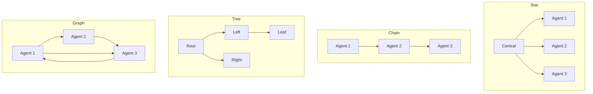

## 論文概要（Abstract）

本記事は [arXiv:2503.01935](https://arxiv.org/abs/2503.01935) の解説記事です。

LLMは自律エージェントとして優れた能力を示しているが、既存のベンチマークはシングルエージェントタスクに限定されるか、特定ドメインに閉じている。MultiAgentBenchは、マルチエージェントシステムを**タスク完了度**と**協調・競争の質**の両面から評価する包括的ベンチマークであり、**マイルストーンベースのKPI**という新しい評価指標を導入している。ACL 2025のMain Conferenceに採択された。

この記事は [Zenn記事: AutoGen v0.7で自律エージェントを構築する実践ガイド](https://zenn.dev/0h_n0/articles/b64c0d3cbd4035) の深掘りです。

## 情報源

- **会議名**: ACL 2025（Association for Computational Linguistics）
- **年**: 2025
- **URL**: [https://arxiv.org/abs/2503.01935](https://arxiv.org/abs/2503.01935)
- **著者**: Kunlun Zhu, Hongyi Du, Zhaochen Hong, Xiaocheng Yang, Shuyi Guo, Zhe Wang, Zhenhailong Wang, Cheng Qian, Xiangru Tang, Heng Ji, Jiaxuan You
- **発表形式**: Main Conference
- **コード**: [https://github.com/ulab-uiuc/MARBLE](https://github.com/ulab-uiuc/MARBLE)

## カンファレンス情報

**ACLについて**:
ACL（Association for Computational Linguistics）は自然言語処理（NLP）分野の最高峰会議の1つである。Main Conferenceの採択率は通常20-25%程度であり、査読者3-4名による厳格なピアレビューを経て採択が決定される。MultiAgentBenchがMain Conferenceに採択されたことは、マルチエージェント評価手法の重要性が学術コミュニティに認められたことを示している。

## 技術的詳細（Technical Details）

### 課題設定

著者らは既存のマルチエージェント評価における2つの問題を指摘している：

1. **タスク完了度のみの評価**: 最終結果だけを測定し、エージェント間の協調過程を評価しない
2. **単一ドメインへの限定**: ソフトウェア開発やQAなど特定タスクに閉じたベンチマークが多い

MultiAgentBenchは、**協調と競争の質を定量的に測定する**新しい評価フレームワークを提案している。

### 4つの調整トポロジー

著者らは以下の4つのエージェント間通信トポロジーを評価対象としている：



| トポロジー | 構造 | AutoGenでの対応 | 特徴 |
|-----------|------|----------------|------|
| **Star** | 中央ノードが全エージェントと通信 | GroupChat + GroupChatManager | 中央集権的、グローバル状態管理可能 |
| **Chain** | 線形にメッセージを伝播 | Sequential Chat | 段階的処理に適する |
| **Tree** | 階層的なメッセージ伝播 | Nested Chat | サブタスク分解に適する |
| **Graph** | 任意のエージェント間で通信可能 | Swarm (HandoffMessage) | 柔軟だが通信コスト大 |

### マイルストーンベースKPI

従来のベンチマークが最終的なタスク成否のみを測定するのに対し、MultiAgentBenchは**マイルストーン**（中間達成目標）の達成率を測定する。

$$
\text{Milestone Achievement Rate} = \frac{\sum_{i=1}^{M} \mathbb{1}[\text{milestone}_i \text{ achieved}]}{M}
$$

ここで、
- $M$: タスクに設定されたマイルストーン数
- $\mathbb{1}[\cdot]$: 指示関数（マイルストーン達成時に1）

この指標により、タスク全体は未完了でも**どこまで進んだか**を定量的に評価できる。

### 評価される協調戦略

著者らは以下の協調戦略をベンチマーク上で評価している：

1. **Group Discussion**: 全エージェントが共有コンテキストで議論
2. **Cognitive Planning**: エージェントが事前にタスク計画を立ててから実行
3. **Role Assignment**: 各エージェントに明示的な役割を割り当て
4. **Dynamic Routing**: タスクの進捗に応じてエージェント割り当てを動的に変更

### アルゴリズム: Cognitive Planning

著者らが提案するCognitive Planning戦略の概要：

```python
from typing import TypedDict

class Plan(TypedDict):
    """エージェントの認知計画"""
    goal: str
    milestones: list[str]
    assigned_agent: str
    dependencies: list[str]

def cognitive_planning(
    task: str,
    agents: list[str],
    model: str = "gpt-4o"
) -> list[Plan]:
    """タスクをマイルストーンに分解し、エージェントに割り当てる

    Args:
        task: 解決すべきタスクの記述
        agents: 利用可能なエージェント名のリスト
        model: 計画生成に使用するLLM

    Returns:
        各エージェントの計画リスト
    """
    # Step 1: タスクをマイルストーンに分解
    milestones = decompose_task(task, model)

    # Step 2: 依存関係を分析
    dependencies = analyze_dependencies(milestones)

    # Step 3: エージェントに割り当て
    plans = assign_to_agents(milestones, dependencies, agents)

    return plans
```

この戦略により、マイルストーン達成率が**3%向上**したと著者らは報告している。

## 実験結果（Results）

著者らの実験における主要な結果：

| モデル | 平均タスクスコア | Star | Chain | Tree | Graph |
|--------|---------------|------|-------|------|-------|
| **gpt-4o-mini** | **最高** | 中 | 低 | 中 | 高 |
| **gpt-4o** | 高 | 高 | 中 | 高 | 高 |
| **Claude 3.5 Sonnet** | 高 | 高 | 中 | 中 | 高 |
| **Llama 3.1 70B** | 中 | 低 | 低 | 低 | 中 |

著者らの報告による主要な発見：

1. **gpt-4o-miniが平均最高タスクスコア**: コストパフォーマンスの観点から注目すべき結果。著者らは「小型モデルでも適切な協調プロトコルにより大型モデルに匹敵するタスク遂行が可能」と分析している
2. **Graph構造が研究シナリオで最良**: 柔軟な通信が可能なGraph構造が、研究タスクにおいて最も高いスコアを達成。これはAutoGenのSwarmパターンの有効性を支持する結果である
3. **Cognitive Planningで3%改善**: 事前計画戦略により、マイルストーン達成率が3%ポイント向上

**AutoGenとの関連**:
- MultiAgentBenchのGraph構造は、AutoGenのSwarmパターン（HandoffMessageによる任意エージェント間通信）に直接対応する
- Star構造は、GroupChatManager中心の構成に対応する
- 実験結果は、タスク特性に応じてSwarm（Graph）とGroupChat（Star）を使い分けるべきことを示唆している

## 査読者の評価（Peer Review Insights）

ACL 2025のMain Conferenceに採択されたことから、以下の点が評価されたと推測される：

- マイルストーンベースKPIという新しい評価指標の導入
- 4つのトポロジーの体系的な比較
- オープンソースでの公開（MARBLE）により再現性を確保

## 実装のポイント

MultiAgentBenchのベンチマーク環境を活用する際の注意点：

- **MARBLE環境のセットアップ**: [GitHub](https://github.com/ulab-uiuc/MARBLE)からクローンし、依存関係をインストール
- **AutoGenとの統合**: AutoGenのエージェントをMARBLE環境に接続するには、メッセージフォーマットの変換レイヤーが必要
- **評価コスト**: 各トポロジー×各モデルの評価にはLLM API呼び出しが大量に発生するため、テスト用にはgpt-4o-miniの使用を推奨

```python
# MARBLEベンチマーク実行の概要
from marble import Benchmark, Topology

# ベンチマーク初期化
bench = Benchmark(
    topology=Topology.GRAPH,  # Graph構造で評価
    model="gpt-4o-mini",      # コスト効率重視
    num_agents=3,
)

# 評価実行
results = bench.evaluate(
    scenario="research",
    metrics=["task_score", "milestone_rate", "communication_cost"]
)
```

## 実運用への応用（Practical Applications）

MultiAgentBenchの知見は、AutoGenベースのプロダクション設計に以下のように活用できる：

- **トポロジー選択**: 研究・分析タスクにはGraph（Swarm）、定型処理にはChain（Sequential）、監督が必要なタスクにはStar（GroupChat）を選択
- **モデル選択**: gpt-4o-miniが平均最高スコアという結果は、コスト削減の判断材料になる。ただし、タスク複雑度に応じた段階的なモデル切り替えが推奨される
- **Cognitive Planning導入**: 複雑なタスクでは事前計画フェーズを組み込むことで、マイルストーン達成率を改善できる

## まとめ

MultiAgentBenchは、LLMベースマルチエージェントシステムの**協調品質**を定量的に評価するためのベンチマークである。4つのトポロジー（Star, Chain, Tree, Graph）とマイルストーンベースKPIを用いた評価により、Graph構造の有効性やCognitive Planning戦略の改善効果が示された。AutoGen v0.7のSwarm/GroupChat選択や協調戦略の設計において、本ベンチマークの知見は実践的な判断基準を提供する。

## 参考文献

- **Conference URL**: [https://aclanthology.org/2025.acl-long.421/](https://aclanthology.org/2025.acl-long.421/)
- **arXiv**: [https://arxiv.org/abs/2503.01935](https://arxiv.org/abs/2503.01935)
- **Code**: [https://github.com/ulab-uiuc/MARBLE](https://github.com/ulab-uiuc/MARBLE)
- **Related Zenn article**: [https://zenn.dev/0h_n0/articles/b64c0d3cbd4035](https://zenn.dev/0h_n0/articles/b64c0d3cbd4035)

---

:::message
この記事はAI（Claude Code）により自動生成されました。論文の主張や実験結果は原著者の報告に基づいています。実際の利用時は原論文および公式コードリポジトリもご確認ください。
:::
