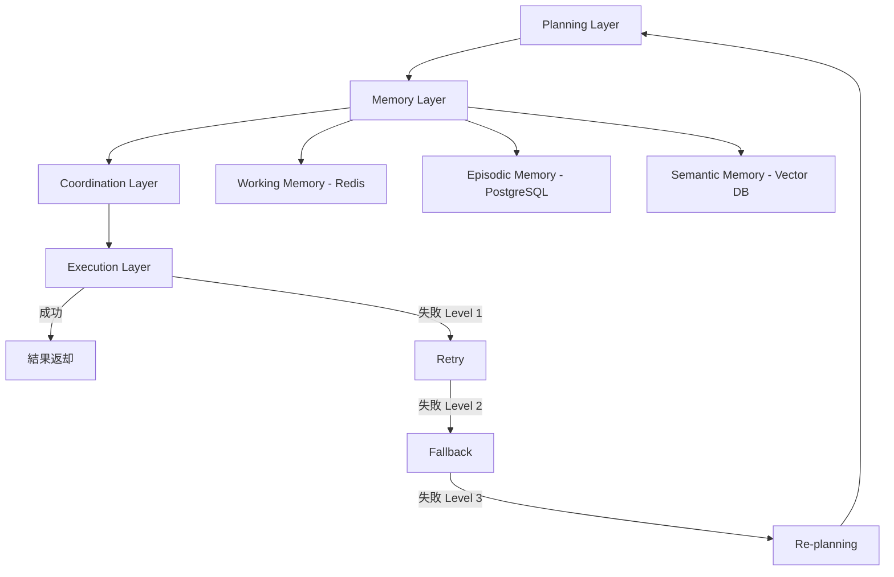
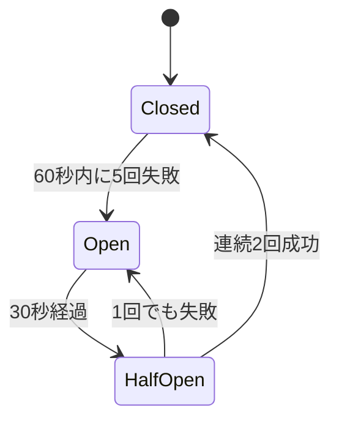

本記事は [Adaptive Orchestration: Cognitive Architectures in Multi-Agent AI Systems for Enterprise Applications (arXiv:2502.18082)](https://arxiv.org/abs/2502.18082) の解説記事です。

## 論文概要（Abstract）

本論文は、エンタープライズ向けマルチエージェントAIシステムのための認知アーキテクチャ「Adaptive Orchestration」を提案している。著者らは、Planning/Memory/Coordination/Executionの4層アーキテクチャに、Retry→Fallback→Re-planningの3段階エラー回復プロトコルとcircuit breakerを統合している。GPT-4ベースの3つのエンタープライズシナリオ（注文管理、カスタマーサービス、在庫最適化）で評価した結果、タスク完了率83%を達成し、AutoGenベースライン（63%）を20ポイント上回ったと報告されている。

この記事は [Zenn記事: AIエージェントのツール連携設計：マルチツール構成と障害回復の実践パターン](https://zenn.dev/0h_n0/articles/2b1887cb82f72d) の深掘りです。

## 情報源

- **arXiv ID**: 2502.18082
- **URL**: https://arxiv.org/abs/2502.18082
- **分野**: cs.AI, cs.MA
- **発表年**: 2025

## 背景と動機（Background & Motivation）

マルチエージェントシステムにおける障害回復は、単一エージェントよりも複雑である。エージェント間の調整失敗、ツールの一時障害、コンテキストの喪失が複合的に発生し、従来のリトライ戦略だけでは不十分である。著者らは、人間の認知プロセス（計画→記憶→調整→実行）を模倣した4層アーキテクチャにより、段階的な障害回復を実現するアプローチを提案している。

## 主要な貢献（Key Contributions）

- **貢献1**: Planning/Memory/Coordination/Executionの4層認知アーキテクチャの設計
- **貢献2**: Retry→Fallback→Re-planningの3段階エラー回復プロトコル（回復率78%）
- **貢献3**: ablation studyによる各コンポーネントの寄与度定量化

## 技術的詳細（Technical Details）

### 4層認知アーキテクチャ



各層の役割は以下の通りである：

| 層 | 役割 | 依存コンポーネント |
|---|------|----------------|
| **Planning** | タスクDAG生成、modified A*探索 | LLM (GPT-4) |
| **Memory** | Working/Episodic/Semanticの3種類の記憶 | Redis, PostgreSQL, Vector DB |
| **Coordination** | エージェント間の調整、リソース割当 | AsyncIO |
| **Execution** | ツール呼び出し、circuit breaker | tenacity, Pydantic |

### 3段階エラー回復プロトコル

著者らの提案する回復プロトコルは、軽量な対策から順にエスカレーションする設計である（論文Section 3.2-3.3より）：

**Level 1: Retry（transient errorのみ対象）**

$$
\text{delay}(n) = \min(1 \times 2^{n}, 30) + \text{jitter}
$$

- 最大3回リトライ
- base_delay=1秒、multiplier=2、max_delay=30秒
- transient error（HTTP 5xx、タイムアウト等）のみ対象

**Level 2: Fallback（Level 1失敗時にエスカレーション）**

Semantic Memoryから代替ツールをcosine similarity≧0.85で照合する。著者らは、ToolインターフェースにList[ToolCapability]フィールドとget_fallbacks()メソッドの実装を必須としている。

**Level 3: Re-planning（Level 2失敗時にエスカレーション）**

タスクDAGに対してmodified A*探索を実行し、失敗したステップを迂回する代替パスを発見する。Episodic Memory（過去の成功/失敗パターン）を参照し、各パスの成功確率を推定する。

```python
from dataclasses import dataclass, field
from enum import Enum, auto
from typing import Any


class RecoveryLevel(Enum):
    RETRY = auto()
    FALLBACK = auto()
    REPLAN = auto()


@dataclass
class RecoveryConfig:
    """3段階回復プロトコルの設定

    論文Section 3.2-3.3の推奨パラメータに基づく。
    """
    # Level 1: Retry
    retry_max_attempts: int = 3
    retry_base_delay: float = 1.0
    retry_max_delay: float = 30.0

    # Level 2: Fallback
    fallback_similarity_threshold: float = 0.85

    # Level 3: Re-planning
    replanning_max_iterations: int = 5

    # Circuit Breaker
    circuit_breaker_failure_threshold: int = 5
    circuit_breaker_window_seconds: float = 60.0
    circuit_breaker_probe_interval: float = 30.0


@dataclass
class RecoveryResult:
    """回復試行の結果"""
    level: RecoveryLevel
    success: bool
    data: Any = None
    error: str | None = None
    attempts: int = 0


async def execute_with_recovery(
    tool_func,
    params: dict,
    config: RecoveryConfig,
    memory,
) -> RecoveryResult:
    """3段階エラー回復プロトコルの実行

    Level 1 (Retry) → Level 2 (Fallback) → Level 3 (Re-planning)
    の順にエスカレーションする。
    """
    import asyncio
    import random

    # Level 1: Retry
    for attempt in range(config.retry_max_attempts):
        try:
            result = await tool_func(params)
            return RecoveryResult(
                level=RecoveryLevel.RETRY, success=True,
                data=result, attempts=attempt + 1,
            )
        except Exception as e:
            if not _is_transient(e):
                break  # 非transientエラーはRetryスキップ
            delay = min(
                config.retry_base_delay * (2 ** attempt),
                config.retry_max_delay,
            )
            await asyncio.sleep(delay + random.uniform(0, 1))

    # Level 2: Fallback
    fallback_tool = await memory.find_fallback(
        tool_func, threshold=config.fallback_similarity_threshold
    )
    if fallback_tool:
        try:
            result = await fallback_tool(params)
            return RecoveryResult(
                level=RecoveryLevel.FALLBACK, success=True, data=result,
            )
        except Exception:
            pass  # Level 3へエスカレーション

    # Level 3: Re-planning
    new_plan = await memory.replan(
        failed_tool=tool_func,
        max_iterations=config.replanning_max_iterations,
    )
    if new_plan:
        return RecoveryResult(
            level=RecoveryLevel.REPLAN, success=True, data=new_plan,
        )

    return RecoveryResult(
        level=RecoveryLevel.REPLAN, success=False,
        error="All recovery levels exhausted",
    )


def _is_transient(error: Exception) -> bool:
    """transient error（リトライで回復可能）かどうかを判定"""
    transient_types = (TimeoutError, ConnectionError)
    return isinstance(error, transient_types)
```

### Circuit Breaker設計

著者らのcircuit breakerは、60秒ウィンドウ内で5回失敗するとOpen状態に遷移し、30秒間隔でprobe（テストリクエスト）を送信する設計である。

| パラメータ | 値 | 根拠 |
|-----------|-----|------|
| failure_threshold | 5 | 60秒ウィンドウでの許容失敗数 |
| window_seconds | 60 | 短時間セッションに適合 |
| probe_interval | 30秒 | サーバー再起動の典型時間 |



### ablation study

著者らは各コンポーネントの寄与度をablation studyで検証している（論文Table 6より）：

| 除去コンポーネント | タスク完了率への影響 |
|-------------------|-------------------|
| Level 3 (Re-planning) | -14%（最大の寄与） |
| Circuit Breaker | -9% |
| Level 2 (Fallback) | -7% |
| Episodic Memory | -6% |
| Level 1 (Retry) | -4% |

Re-planningの除去が最も大きな影響（-14%）を与えており、FlowBenchの知見（Task Restructuringの成功率62%）と一致する。circuit breakerの除去（-9%）も有意な影響があり、カスケード障害の遮断が重要であることを示している。

## 実装のポイント（Implementation）

### 依存コンポーネント

実装には以下のコンポーネントが必要である：
- **LangChain**: エージェント基盤
- **Redis**: Working Memory（高速な状態管理）
- **PostgreSQL**: Episodic Memory（過去の成功/失敗パターン）
- **Pydantic**: 入力バリデーション
- **tenacity**: リトライライブラリ
- **Prometheus + Grafana**: モニタリング

### circuit breakerの閾値調整

論文では閾値が固定値であり、adaptive tuningは今後の課題として挙げられている。実運用では、ツールの特性（外部API vs 内部計算）に応じて個別調整が推奨される。Zenn記事でも指摘した通り、外部APIは`failure_threshold=5, recovery_timeout=60`、内部計算は`failure_threshold=2, recovery_timeout=10`の設定が有効である。

### 制約と限界

- 評価はシミュレート環境（tool failure rate 5%で固定）であり、実環境の複雑な障害パターンは未考慮
- 最大50 concurrent agentsまでの検証。大規模スケーリングにはインフラ追加が必要
- Re-planningはLLM呼び出しを要するため、高障害率シナリオで追加コスト大
- 残存障害17%の主因は「fallback toolが存在しない」（43%）

## 実験結果（Results）

3つのエンタープライズシナリオでの評価結果は以下の通りである（論文Table 2より）：

| アプローチ | 注文管理 | カスタマーサービス | 在庫最適化 | 平均 |
|-----------|---------|-----------------|-----------|------|
| Direct LLM | 42% | 51% | 45% | 46% |
| ReAct | 54% | 62% | 55% | 57% |
| AutoGen Baseline | 60% | 68% | 61% | 63% |
| **Adaptive Orchestration** | **80%** | **87%** | **82%** | **83%** |

回復プロトコルの各レベルの内訳（論文Table 4より）：
- Level 1 (Retry) 成功率: 71%
- Level 2 (Fallback) 成功率: 64%
- Level 3 (Re-planning) 成功率: 68%
- **総合回復率**: 78%

recovery overhead（回復処理の追加レイテンシ）は平均340msである（Retry 180ms、Fallback lookup 90ms、Re-planning 70ms）。

## 実運用への応用（Practical Applications）

Adaptive Orchestrationの設計パターンは、Zenn記事で解説したサーキットブレーカーとLangGraphの状態マシンを統合的に実装する際の参照モデルとなる。特に3段階エスカレーション（Retry→Fallback→Re-planning）は、障害の種類に応じた適切な対応を自動選択する設計として実用的である。

ただし、Re-planningはLLM呼び出しを伴うため、レイテンシに敏感なアプリケーション（100ms以下のSLAが要求される場合等）では、Level 1-2のみの運用を検討すべきである。

## 関連研究（Related Work）

- **AutoGen**: 会話ベースのマルチエージェントフレームワーク。本論文のベースラインとして使用
- **LangGraph**: グラフベースの状態管理。Adaptive Orchestrationの実装基盤として参照可能
- **CrewAI**: タスクベースのマルチエージェント。Coordinationレイヤーの設計で比較対象

## まとめと今後の展望

Adaptive Orchestrationは、エンタープライズ向けマルチエージェントシステムに3段階エラー回復を統合した実用的なアーキテクチャである。特にablation studyでRe-planningの寄与（-14%）が最大であることは、計画の動的再生成がツールチェーン障害回復の鍵であることを示唆している。今後の課題として、circuit breaker閾値のadaptive tuning、50 agents以上へのスケーリング、real-time adversarial環境での評価が挙げられている。

## 参考文献

- **arXiv**: https://arxiv.org/abs/2502.18082
- **Related Zenn article**: https://zenn.dev/0h_n0/articles/2b1887cb82f72d
