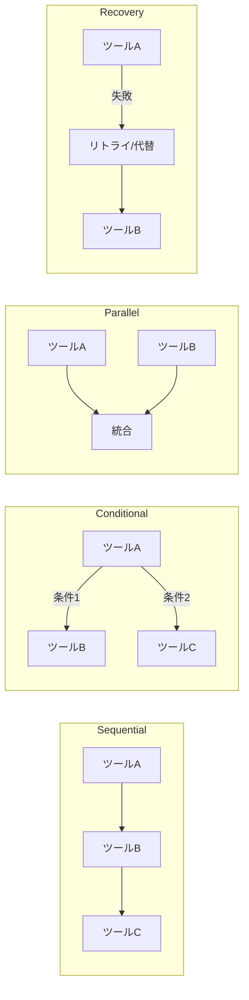

本記事は [FlowBench: Evaluating LLM Agents Across Diverse Procedural Workflows (arXiv:2503.12347)](https://arxiv.org/abs/2503.12347) の解説記事です。

## 論文概要（Abstract）

FlowBenchは、LLMエージェントを4つのワークフロー型（Sequential、Conditional、Parallel、Recovery）で体系的に評価する初のベンチマークである。著者らは500タスク×10ドメイン×47ツールの評価セットを構築し、15モデルを評価している。Claude 3.5 Sonnetが全体で最高の64%を記録した一方、Recovery型ワークフローでは全モデルが31%にとどまり、障害検出（76%）と実際の回復（35%）の間に大きなギャップがあることが報告されている。

この記事は [Zenn記事: AIエージェントのツール連携設計：マルチツール構成と障害回復の実践パターン](https://zenn.dev/0h_n0/articles/2b1887cb82f72d) の深掘りです。

## 情報源

- **arXiv ID**: 2503.12347
- **URL**: https://arxiv.org/abs/2503.12347
- **分野**: cs.AI, cs.CL
- **発表年**: 2025

## 背景と動機（Background & Motivation）

既存のLLMエージェント評価ベンチマーク（ToolBench、API-Bank等）は、主にツールの選択精度や引数の正確性を評価するものであり、**ワークフロー全体の実行成功率**、特に障害発生時の回復能力を体系的に評価するものは存在しなかった。著者らは、実運用のエージェントワークフローがSequential/Conditional/Parallel/Recoveryの4型に分類できることを指摘し、各型での性能を分離して評価するベンチマークの必要性を主張している。

## 主要な貢献（Key Contributions）

- **貢献1**: 4ワークフロー型×10ドメイン×500タスクの体系的ベンチマーク構築
- **貢献2**: 15モデルの包括的評価。Recovery型での全モデル低性能（平均31%）の発見
- **貢献3**: ツール数・コンテキスト使用率と完了率の相関分析

## 技術的詳細（Technical Details）

### 4つのワークフロー型



著者らの評価結果を以下に示す（論文Table 1より）：

| ワークフロー型 | 全モデル平均 | Claude 3.5 Sonnet | GPT-4o |
|-------------|-----------|-------------------|--------|
| Sequential | 75% | 82% | 78% |
| Conditional | 63% | 70% | 66% |
| Parallel | 40% | 48% | 43% |
| Recovery | 31% | 38% | 33% |
| **Overall** | **52%** | **64%** | **60%** |

Recovery型での低性能は、LLMエージェントの障害回復能力が未成熟であることを示している。著者らは「障害を検出する能力（76%）と実際に回復する能力（35%）のギャップ」を最も重要な知見として強調している。

### Recovery型の内訳分析

Recovery型ワークフローにおけるエージェントの回復戦略の分布は以下の通りである（論文Figure 5より）：

| 回復戦略 | 採用率 | 成功率 |
|---------|--------|--------|
| Simple Retry（同一パラメータ） | 61% | 23% |
| Alternative Tool（代替ツール使用） | 23% | 48% |
| Task Restructuring（計画再生成） | 9% | 62% |
| Abandonment（タスク放棄） | 7% | — |

Simple Retryが最も多く採用されるが成功率は23%と低い。これは、LLMが「同じパラメータで再試行すれば成功する」と誤って判断するケースが多いことを示している。一方、Task Restructuring（計画の再生成）は採用率こそ9%と低いものの、成功率は62%と最も高い。

### ツール数とRecovery成功率の関係

著者らは、ツール数の増加がRecovery成功率に与える影響を分析している（論文Section 5.1, Figure 7より）：

| ツール数 | Recovery完了率 |
|---------|--------------|
| 3-5 | 40% |
| 6-10 | 32% |
| 11-15 | 21% |

ツール数が増加するとRecovery完了率が低下する傾向が顕著である。著者らは、ツール数が8を超える場合にタスクを8ツール以下のサブタスクに分解する設計を推奨している。

### コンテキスト使用率の影響

コンテキストウィンドウの使用率と完了率の関係も重要な知見である（論文Section 5.1, Table 4より）：

| コンテキスト使用率 | 完了率 |
|-----------------|--------|
| 0-25% | 61% |
| 25-50% | 55% |
| 50-75% | 44% |
| 75%超 | 31% |

コンテキスト使用率が50%を超えると完了率が44%に低下し、75%を超えると31%まで低下する。著者らは、コンテキスト使用率50%をアラート閾値とし、定期的なコンテキスト要約（periodic summarization）をトリガーすることを推奨している。

### 評価指標

FlowBenchでは4つの評価指標を定義している：

$$
\text{FC} = \frac{|\text{fully completed tasks}|}{|\text{total tasks}|}
$$

$$
\text{PC} = \frac{1}{N}\sum_{i=1}^{N}\frac{|\text{completed steps}_i|}{|\text{total steps}_i|}
$$

$$
\text{RS} = \frac{|\text{successfully recovered tasks}|}{|\text{tasks with failures}|}
$$

$$
\text{TCE} = \frac{|\text{necessary tool calls}|}{|\text{actual tool calls}|}
$$

ここで、
- $\text{FC}$: Full Completion rate（完全完了率）
- $\text{PC}$: Partial Completion rate（部分完了率）
- $\text{RS}$: Recovery Success rate（回復成功率）
- $\text{TCE}$: Tool Call Efficiency（ツール呼び出し効率）

TCEは無駄なツール呼び出し（失敗後の無意味なリトライ等）を検出するための指標であり、値が1に近いほど効率的である。

### 障害注入（Failure Injection）

著者らは、Recovery型ワークフローの評価のために4種類の障害を注入している：

1. **HTTP 503**: サーバー一時障害（リトライで回復可能）
2. **Malformed Output**: 不正なレスポンス形式（バリデーションで検出可能）
3. **Partial Execution**: 処理の途中で停止（チェックポイントからの再開が必要）
4. **Deadlock Simulation**: ツール間の循環依存（計画の再生成が必要）

## 実装のポイント（Implementation）

### ベンチマーク実行時の注意

FlowBenchは47ツール（data/API/communication/computation/control flow）を含むシミュレート環境で動作する。実プロダクション環境との乖離として、以下が著者らによって明示されている：
- ツールのレイテンシが一定（実環境では変動）
- 障害率が固定（実環境では時間帯・負荷依存）
- 長時間ワークフロー（1時間超）は未評価
- human baselineは未測定

### ReAct vs Function Callingの使い分け

著者らは、推論方式とワークフロー型の相性について興味深い知見を報告している：
- **ReAct**: Recovery型で+8%の改善。自然言語での推論ステップが障害原因の分析に有効
- **Function Calling**: Sequential型で+12%の改善。構造化された呼び出しが直列ワークフローで効率的

ハイブリッド（Sequential/Parallel部分はFunction Calling、Recovery部分はReAct）が最善であると著者らは述べている。

### 設計への具体的な推奨事項

著者らは評価結果から5つの設計推奨事項を導出している（論文Section 6より）：

1. **Re-planningの明示的実装**: Recovery型で最も成功率が高い戦略（62%）。LangGraphの状態マシンでexplicit re-planningノードを追加すべき
2. **ツール数8以下への分解**: 8ツール超でRecovery成功率が急落（40%→21%）。DAGワークフローを8ツール以下のサブグラフに分割
3. **Tool Relationship Metadataの提供**: ツール間の依存関係・代替関係をメタデータとして定義し、Fallback選択を支援
4. **Context Summarization**: コンテキスト使用率50%超で定期的に要約を実行し、完了率の低下を防止
5. **ハイブリッド推論方式**: Sequential/Parallel部分はFunction Calling、Recovery部分はReActで処理

```python
from dataclasses import dataclass


@dataclass
class WorkflowDesignChecklist:
    """FlowBenchの知見に基づくワークフロー設計チェックリスト"""

    max_tools_per_subgraph: int = 8
    context_alert_threshold: float = 0.50  # 50%でアラート
    context_critical_threshold: float = 0.75  # 75%でsummarization強制
    recovery_strategy: str = "replan"  # retry < fallback < replan
    reasoning_mode_recovery: str = "react"  # Recovery型はReAct
    reasoning_mode_sequential: str = "function_calling"  # Sequential型はFC

    def validate_workflow(self, tool_count: int, context_usage: float) -> list[str]:
        """ワークフロー設計の検証"""
        warnings = []
        if tool_count > self.max_tools_per_subgraph:
            warnings.append(
                f"ツール数{tool_count}がmax({self.max_tools_per_subgraph})を超過。"
                "サブグラフへの分割を推奨"
            )
        if context_usage > self.context_critical_threshold:
            warnings.append(
                f"コンテキスト使用率{context_usage:.0%}が閾値"
                f"({self.context_critical_threshold:.0%})を超過。"
                "即時summarizationを推奨"
            )
        elif context_usage > self.context_alert_threshold:
            warnings.append(
                f"コンテキスト使用率{context_usage:.0%}がアラート閾値"
                f"({self.context_alert_threshold:.0%})を超過"
            )
        return warnings
```

## 実験結果（Results）

15モデルの評価結果から、以下の傾向が確認されている（論文Section 4より）：

1. **全モデルでRecovery型が最低性能**: 最高のClaude 3.5 Sonnetでも38%にとどまる
2. **モデルサイズとRecovery成功率は弱い相関**: 大規模モデルでもRecovery改善は限定的
3. **ツール数8超でRecovery成功率が急落**: 8ツール以下への分解が有効
4. **コンテキスト50%超で完了率低下**: 定期的なコンテキスト要約が推奨

## 実運用への応用（Practical Applications）

FlowBenchの知見は、Zenn記事で解説したパターンに直接的な設計指針を提供する：

- **LangGraphの状態マシン**: Recovery型の低性能を改善するために、明示的なリトライ・ロールバック戦略（Task Restructuringの62%成功率）を実装すべき
- **ツール数の制限**: DAGワークフローを設計する際、各サブグラフのツール数を8以下に抑制
- **コンテキストバジェット管理**: 50%超過でperiodic summarizationをトリガーする仕組みを導入

ただし、FlowBenchはシミュレート環境での評価であり、実プロダクション環境での数値は異なる可能性がある。特に、シミュレート環境ではツールレイテンシが一定であり、実環境で発生する負荷依存のレイテンシ変動やネットワーク不安定性は考慮されていない。ベンチマーク結果を自社システムの設計判断に直接適用する際は、実環境での計測値との差異に十分注意が必要である。

## 関連研究（Related Work）

- **ToolBench**: ツール選択精度の評価。FlowBenchはこれをワークフロー全体の評価に拡張
- **API-Bank**: API呼び出しの正確性評価。FlowBenchは障害回復能力の評価を追加
- **NESTFUL (Yan et al.)**: ネストされたAPI呼び出しの評価。FlowBenchのConditional型と関連

## まとめと今後の展望

FlowBenchは、LLMエージェントの障害回復能力が現状では不十分であることを定量的に示した重要なベンチマークである。障害検出（76%）と回復（35%）のギャップ、ツール数増加に伴うRecovery成功率の低下、コンテキスト使用率50%超での完了率低下は、エージェント設計における具体的な制約として活用できる。著者らは今後の課題として、実プロダクション環境でのベンチマーク拡張と、long-horizonワークフロー（1時間超）の評価を挙げている。

## 参考文献

- **arXiv**: https://arxiv.org/abs/2503.12347
- **Related Zenn article**: https://zenn.dev/0h_n0/articles/2b1887cb82f72d
