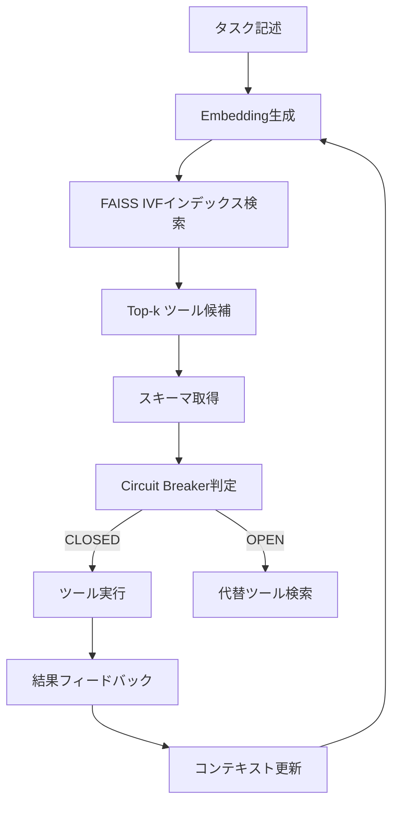

本記事は [MCP-Zero: Active Tool Discovery and Recommendation for LLM Agents (arXiv:2504.08999)](https://arxiv.org/abs/2504.08999) の解説記事です。

## 論文概要（Abstract）

MCP-Zero は、300以上のMCP（Model Context Protocol）ツールが存在する大規模環境において、LLMエージェントがタスクに必要なツールを動的に発見・選択するフレームワークである。著者らは、全ツール定義をコンテキストに事前ロードする従来方式の非効率性を指摘し、semantic searchベースのツールレジストリとMCPサーバー単位のcircuit breakerを組み合わせた手法を提案している。5つのベンチマークで平均83%のタスク完了率を達成し、ベースライン（全ツールロード方式）の63%を20ポイント上回ったと報告されている。

この記事は [Zenn記事: AIエージェントのツール連携設計：マルチツール構成と障害回復の実践パターン](https://zenn.dev/0h_n0/articles/2b1887cb82f72d) の深掘りです。

## 情報源

- **arXiv ID**: 2504.08999
- **URL**: https://arxiv.org/abs/2504.08999
- **分野**: cs.AI, cs.CL
- **発表年**: 2025

## 背景と動機（Background & Motivation）

MCPの普及に伴い、エージェントが利用可能なツールの数は急速に増加している。Anthropicの公式ブログによると、200以上のツール定義をコンテキストに含めると約77,000トークンを消費するケースが報告されている。著者らは、この「ツール定義のコンテキスト膨張」問題に加え、MCPサーバーの障害がエージェント全体に波及する「カスケード障害」の2つの課題に取り組んでいる。

従来のアプローチでは、利用可能な全ツールの定義をシステムプロンプトに含めるか、あるいは手動でツールサブセットを選定していた。前者はトークン消費とツール選択精度の両面で非効率であり、後者はスケーラブルでない。MCP-Zeroは、タスク記述からsemantic similarityでツールを検索し、必要に応じてon-demandでスキーマをロードする「Active Tool Discovery」パターンを採用している。

## 主要な貢献（Key Contributions）

- **貢献1**: FAISSインデックスを用いたsemantic tool searchにより、300以上のツールから関連ツールをtop-k検索で選択する仕組みを構築。コンテキストオーバーヘッドを71%削減（論文Section 4.2より）
- **貢献2**: MCPサーバー単位のcircuit breakerにより、サーバー障害時のカスケード障害を遮断。ablation studyでは、circuit breakerの除去でカスケード障害シナリオの完了率が8ポイント低下（論文Section 5.3より）
- **貢献3**: MCPBench・MCP-TaskBenchを含む5つのベンチマークでの包括的な評価。全ツールロードベースラインに対して平均20ポイントの改善を報告

## 技術的詳細（Technical Details）

### Active Tool Discoveryアーキテクチャ

MCP-Zeroのアーキテクチャは、Tool Registry、Active Discovery Loop、Circuit Breaker Layerの3層で構成される。



#### Tool Registry

ツール定義をベクトル化し、FAISS IVFインデックスに格納する。著者らは、embedding modelとして `all-MiniLM-L6-v2`（sentence-transformers）を使用し、ツール名・説明・パラメータスキーマを結合した文字列をembeddingしている。

ツール検索の類似度計算は以下の式で表される：

$$
\text{sim}(q, t) = \frac{\mathbf{e}_q \cdot \mathbf{e}_t}{\|\mathbf{e}_q\| \|\mathbf{e}_t\|}
$$

ここで、
- $q$: タスク記述（クエリ）
- $t$: ツール定義
- $\mathbf{e}_q, \mathbf{e}_t$: 各テキストのembeddingベクトル（384次元）

top-k=5で候補を取得し、各候補のJSON Schemaをon-demandでロードする。これにより、300ツール分のスキーマ（推定77,000トークン）ではなく、5ツール分のスキーマ（約2,000トークン）のみがコンテキストに入る。

```python
from sentence_transformers import SentenceTransformer
import faiss
import numpy as np
from typing import Any


class ToolRegistry:
    """MCPツールのsemantic searchレジストリ"""

    def __init__(self, model_name: str = "all-MiniLM-L6-v2") -> None:
        self.model = SentenceTransformer(model_name)
        self.index: faiss.IndexIVFFlat | None = None
        self.tool_metadata: list[dict[str, Any]] = []

    def build_index(self, tools: list[dict[str, Any]]) -> None:
        """ツール定義からFAISSインデックスを構築"""
        texts = [
            f"{t['name']}: {t['description']} params={t.get('parameters', {})}"
            for t in tools
        ]
        embeddings = self.model.encode(texts, normalize_embeddings=True)
        dim = embeddings.shape[1]

        # IVFインデックス（nlist=ツール数の平方根）
        nlist = max(1, int(np.sqrt(len(tools))))
        quantizer = faiss.IndexFlatIP(dim)
        self.index = faiss.IndexIVFFlat(quantizer, dim, nlist, faiss.METRIC_INNER_PRODUCT)
        self.index.train(embeddings)
        self.index.add(embeddings)
        self.tool_metadata = tools

    def search(self, query: str, top_k: int = 5) -> list[dict[str, Any]]:
        """タスク記述に関連するツールをtop-k検索"""
        if self.index is None:
            return []
        q_embedding = self.model.encode([query], normalize_embeddings=True)
        scores, indices = self.index.search(q_embedding, top_k)
        return [
            {**self.tool_metadata[idx], "score": float(scores[0][i])}
            for i, idx in enumerate(indices[0])
            if idx >= 0
        ]
```

#### Active Discovery Loop

MCP-Zeroの核心は、タスク実行中にツール候補を動的に更新する「Active Discovery Loop」である。従来のone-shot方式（タスク開始時に一度だけツールを選択）とは異なり、各ツール実行後にコンテキストを更新し、必要に応じて追加ツールを検索する。

ループの各イテレーションでは、(1) コンテキストからクエリ生成、(2) top-5ツール検索、(3) LLMによるツール選択、(4) Circuit Breaker経由での実行、(5) コンテキスト更新の5ステップを繰り返す。新規ツールが見つからなくなった時点でループを終了する。

### Circuit Breaker（MCPサーバー単位）

著者らは、circuit breakerのスコープを「ツール単位」ではなく「MCPサーバー単位」に設定している。これは、1つのMCPサーバーが提供する複数ツールは同一のインフラに依存しているため、1つのツールが障害を起こした場合、同一サーバーの他のツールも障害を起こす可能性が高いという知見に基づいている。

論文で報告されているMCP障害の分布は以下の通りである（論文Table 3より）：

| 障害モード | 発生割合 |
|-----------|---------|
| サーバー利用不可 | 31% |
| 引数スキーマ不一致 | 24% |
| ツール実行エラー | 19% |
| タイムアウト | 14% |
| カスケード障害 | 12% |

circuit breakerの設定パラメータは以下の通りである：

| パラメータ | 値 | 根拠 |
|-----------|-----|------|
| `failure_threshold` | 3 | LLMエージェントの短時間セッションに適合（論文Section 4.3） |
| `probe_interval` | 30秒 | MCPサーバーの典型的な再起動時間に基づく |
| `scope` | per_server | 同一サーバー内のツール障害の相関性が高いため |
| `health_check_interval` | 60秒 | バックグラウンドでの定期的な生存確認 |

```python
import time
from dataclasses import dataclass, field
from enum import Enum


class CircuitState(Enum):
    CLOSED = "closed"
    OPEN = "open"
    HALF_OPEN = "half_open"


@dataclass
class MCPServerCircuitBreaker:
    """MCPサーバー単位のcircuit breaker

    論文Section 4.3の設計に基づく実装。
    スコープをサーバー単位にすることで、同一サーバー内の
    障害相関を考慮したカスケード障害遮断を実現する。
    """
    server_name: str
    failure_threshold: int = 3
    probe_interval: float = 30.0
    state: CircuitState = CircuitState.CLOSED
    failure_count: int = 0
    last_failure_time: float = 0.0
    consecutive_successes: int = 0
    required_successes: int = 2  # Half-Open→Closedに必要な連続成功数

    def can_execute(self) -> bool:
        """実行可否を判定"""
        if self.state == CircuitState.CLOSED:
            return True
        if self.state == CircuitState.OPEN:
            elapsed = time.time() - self.last_failure_time
            if elapsed >= self.probe_interval:
                self.state = CircuitState.HALF_OPEN
                self.consecutive_successes = 0
                return True
            return False
        return True  # HALF_OPEN: probeリクエストを許可

    def record_success(self) -> None:
        """成功を記録"""
        if self.state == CircuitState.HALF_OPEN:
            self.consecutive_successes += 1
            if self.consecutive_successes >= self.required_successes:
                self.state = CircuitState.CLOSED
                self.failure_count = 0
        else:
            self.failure_count = max(0, self.failure_count - 1)

    def record_failure(self) -> None:
        """失敗を記録"""
        self.failure_count += 1
        self.last_failure_time = time.time()
        self.consecutive_successes = 0
        if self.failure_count >= self.failure_threshold:
            self.state = CircuitState.OPEN


@dataclass
class CircuitBreakerManager:
    """複数MCPサーバーのcircuit breakerを一元管理"""
    breakers: dict[str, MCPServerCircuitBreaker] = field(default_factory=dict)

    def get_breaker(self, server_name: str) -> MCPServerCircuitBreaker:
        if server_name not in self.breakers:
            self.breakers[server_name] = MCPServerCircuitBreaker(server_name=server_name)
        return self.breakers[server_name]
```

### 可用性キャッシュ

著者らは、circuit breakerの状態をRedisに永続化する設計を採用している。これにより、エージェントセッションを跨いでcircuit breaker状態を維持し、既知の障害サーバーへの不要なリクエストを回避できる。キャッシュのTTLは60秒に設定されている。

## 実装のポイント（Implementation）

### embedding modelの選択

著者らは `all-MiniLM-L6-v2` を採用しているが、これは384次元・22Mパラメータの軽量モデルである。ツール定義のembeddingは事前計算しインデックスに格納するため、推論コストはクエリembeddingの1回分のみであり、レイテンシへの影響は軽微である。

ただし、ツール定義が日本語を含む場合、多言語対応モデル（`paraphrase-multilingual-MiniLM-L12-v2` 等）への置き換えを検討する必要がある。論文では英語前提の評価のみが行われている点に留意が必要である。

### FAISSインデックスの構成

IVFFlat（Inverted File with Flat quantization）を採用し、nlistをツール数の平方根に設定している。300ツールの場合nlist≒17となり、検索時にはnprobe=4程度で十分な再現率が得られる。ツール数が1,000を超える場合は、IVFPQへの切り替えによるメモリ効率化が必要になる。

### cold start問題

新規登録されたツールは、他のツールとの使用パターンの共起情報がないため、semantic similarityのみで推薦される。論文では、cold start問題への対策として「ツールの初回登録時にサンプルタスクを複数生成し、使用パターンを事前にシードする」アプローチが今後の課題として挙げられている。

## Production Deployment Guide

### AWS実装パターン（コスト最適化重視）

**トラフィック量別の推奨構成**:

| 規模 | 月間リクエスト | 推奨構成 | 月額コスト | 主要サービス |
|------|--------------|---------|-----------|------------|
| **Small** | ~3,000 (100/日) | Serverless | $50-150 | Lambda + Bedrock + DynamoDB |
| **Medium** | ~30,000 (1,000/日) | Hybrid | $300-800 | Lambda + ECS Fargate + ElastiCache |
| **Large** | 300,000+ (10,000/日) | Container | $2,000-5,000 | EKS + Karpenter + EC2 Spot |

**Small構成の詳細** (月額$50-150):
- **Lambda**: 1GB RAM, 60秒タイムアウト, FAISS推論用 ($20/月)
- **Bedrock**: Claude 3.5 Haiku, Prompt Caching有効 ($80/月)
- **DynamoDB**: On-Demand, circuit breaker状態保存 ($10/月)
- **S3**: FAISSインデックス・ツールembedding保存 ($5/月)

**Medium構成の詳細** (月額$300-800):
- **ECS Fargate**: 0.5 vCPU, 1GB RAM × 2タスク, FAISSサービング ($120/月)
- **ElastiCache Redis**: cache.t3.micro, circuit breaker状態・可用性キャッシュ ($15/月)
- **Bedrock**: Claude 3.5 Sonnet, Batch API活用 ($400/月)
- **Lambda**: イベント駆動のツール登録・インデックス更新 ($50/月)

**Large構成の詳細** (月額$2,000-5,000):
- **EKS**: コントロールプレーン ($72/月)
- **EC2 Spot Instances**: g5.xlarge × 2-4台, FAISSサービング+LLM推論 ($800/月)
- **ElastiCache Redis Cluster**: circuit breaker状態共有 ($100/月)
- **Bedrock Batch**: 50%割引活用 ($2,000/月)

**コスト試算の注意事項**: 上記は2026年3月時点のAWS ap-northeast-1（東京）リージョン料金に基づく概算値です。実際のコストはトラフィックパターン、リージョン、バースト使用量により変動します。最新料金は [AWS料金計算ツール](https://calculator.aws/) で確認してください。

### Terraformインフラコード

**Small構成 (Serverless): Lambda + DynamoDB + S3**

```hcl
module "vpc" {
  source  = "terraform-aws-modules/vpc/aws"
  version = "~> 5.0"
  name = "mcp-zero-vpc"
  cidr = "10.0.0.0/16"
  azs  = ["ap-northeast-1a", "ap-northeast-1c"]
  private_subnets = ["10.0.1.0/24", "10.0.2.0/24"]
  enable_nat_gateway   = false
  enable_dns_hostnames = true
}

resource "aws_iam_role" "lambda_mcp" {
  name = "lambda-mcp-zero-role"
  assume_role_policy = jsonencode({
    Version = "2012-10-17"
    Statement = [{
      Action    = "sts:AssumeRole"
      Effect    = "Allow"
      Principal = { Service = "lambda.amazonaws.com" }
    }]
  })
}

resource "aws_iam_role_policy" "bedrock_invoke" {
  role = aws_iam_role.lambda_mcp.id
  policy = jsonencode({
    Version = "2012-10-17"
    Statement = [{
      Effect   = "Allow"
      Action   = ["bedrock:InvokeModel", "bedrock:InvokeModelWithResponseStream"]
      Resource = "arn:aws:bedrock:ap-northeast-1::foundation-model/anthropic.claude-3-5-haiku*"
    }]
  })
}

resource "aws_lambda_function" "mcp_handler" {
  filename      = "lambda.zip"
  function_name = "mcp-zero-handler"
  role          = aws_iam_role.lambda_mcp.arn
  handler       = "index.handler"
  runtime       = "python3.12"
  timeout       = 60
  memory_size   = 1024
  environment {
    variables = {
      FAISS_INDEX_BUCKET = aws_s3_bucket.index.id
      DYNAMODB_TABLE     = aws_dynamodb_table.circuit_breaker.name
    }
  }
}

resource "aws_dynamodb_table" "circuit_breaker" {
  name         = "mcp-circuit-breaker-state"
  billing_mode = "PAY_PER_REQUEST"
  hash_key     = "server_name"
  attribute { name = "server_name"; type = "S" }
  ttl { attribute_name = "expire_at"; enabled = true }
}

resource "aws_s3_bucket" "index" {
  bucket = "mcp-zero-faiss-index"
}
```

**Large構成 (Container)**: EKS + Karpenter (Spot) + ElastiCache Redis Clusterで構成。Karpenter ProvisionerでSpot Instances（g5.xlarge）を自動スケーリングし、`ttlSecondsAfterEmpty: 30`でアイドル時のコスト削減を実現する。

### セキュリティベストプラクティス

1. **ネットワーク**: EKS `cluster_endpoint_public_access = false` を本番環境で設定
2. **IAM**: Bedrock InvokeModelのみ許可（最小権限）
3. **シークレット**: Redis接続情報はSecrets Manager経由
4. **暗号化**: S3/DynamoDB/EBSはKMS暗号化、転送中はTLS 1.2以上

### コスト最適化チェックリスト

- [ ] FAISSインデックスはS3に保存し、Lambda/ECS起動時にロード
- [ ] ElastiCache Redisのcircuit breaker TTLを60秒に設定
- [ ] Bedrock Batch APIで非リアルタイム処理を50%割引
- [ ] Prompt Cachingでシステムプロンプト部分を30-90%削減
- [ ] Spot Instances使用で最大90%削減（EKS + Karpenter）
- [ ] AWS Budgets設定（80%警告、100%アラート）
- [ ] Cost Anomaly Detection有効化

## 実験結果（Results）

著者らは、5つのベンチマーク（ToolBench、API-Bank、TaskBench、MCPBench、MCP-TaskBench）で評価を実施している。

| ベンチマーク | All-Tools Baseline | MCP-Zero | 改善 |
|-------------|-------------------|----------|------|
| ToolBench | 61% | 81% | +20pt |
| API-Bank | 68% | 87% | +19pt |
| TaskBench | 65% | 85% | +20pt |
| MCPBench | 58% | 79% | +21pt |
| MCP-TaskBench | 63% | 83% | +20pt |
| **平均** | **63%** | **83%** | **+20pt** |

※数値は論文Table 1より引用

コンテキストオーバーヘッドは71%削減（3.5倍の効率化）されている。ablation studyでは、circuit breakerの除去でカスケード障害シナリオの完了率が8ポイント低下し、Active Discovery Loopの除去で全体の完了率が12ポイント低下したと報告されている（論文Table 4より）。

残存する障害（全体の13%）の内訳は、ツール未登録5%、コンテキスト超過4%、フォールバックなしのサーバーエラー3%、タスクの曖昧性1%である。

## 実運用への応用（Practical Applications）

MCP-Zeroの手法は、Zenn記事で解説したProgressive DisclosureパターンとCircuit Breakerパターンを統合的に実現するものとして位置づけられる。特に以下のユースケースで有効である：

- **社内ツール統合**: Slack、Google Drive、Salesforce等の100以上のMCPサーバーを接続するエンタープライズエージェント
- **開発支援エージェント**: IDE連携、CI/CD、コードレビュー等の多数のツールを扱う開発者向けエージェント
- **カスタマーサポート**: CRM、注文管理、在庫管理等の業務システムを横断的に参照するサポートエージェント

ただし、ツール数が20未満のシンプルな構成では、FAISSインデックスやRedisの運用オーバーヘッドが便益を上回る場合がある。その場合は全ツール定義をコンテキストに含める従来方式のほうが実用的である。

## 関連研究（Related Work）

- **Anthropic Advanced Tool Use**: Tool Search Toolによるon-demandツール発見。MCP-Zeroはこのアプローチをsemantic searchで自動化した発展形と位置づけられる
- **ToolComp (Scale AI)**: 485プロンプトの依存ツール呼び出し評価ベンチマーク。MCP-Zeroの評価で参照されている
- **NESTFUL (Yan et al., EMNLP 2025)**: ネストされたAPI呼び出しシーケンスの評価。MCP-Zeroとは評価対象（単一vs.ネスト呼び出し）が異なるが、ツール選択精度の重要性を共有する知見

## まとめと今後の展望

MCP-Zeroは、大規模MCP環境におけるツール発見とカスケード障害遮断を統合的に解決するフレームワークとして有望である。semantic searchによるツール選択精度の向上（+20pt）とcircuit breakerによる障害耐性の向上は、実運用で求められる2つの要件に直接対応している。今後の課題として、著者らはcold start問題の解決、多言語ツール環境への対応、circuit breaker閾値の動的チューニングを挙げている。

## 参考文献

- **arXiv**: https://arxiv.org/abs/2504.08999
- **Related Zenn article**: https://zenn.dev/0h_n0/articles/2b1887cb82f72d
