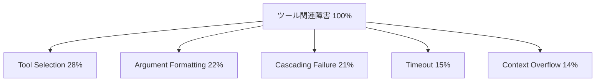

本記事は [Tool-Augmented LLMs: A Survey on Integration Architectures and Failure Patterns (arXiv:2504.10376)](https://arxiv.org/abs/2504.10376) の解説記事です。

## 論文概要（Abstract）

本論文は、ツール拡張LLM（Tool-Augmented LLMs）における統合アーキテクチャと障害パターンを体系的に整理したサーベイである。著者らは120以上の論文を分析し、ツール関連の障害を5つのカテゴリに分類した上で、各緩和戦略の平均回復率を定量化している。150名の実務者調査では、本番環境の障害の67%がツール関連であり、カスケード障害が最も影響が大きい（78%が言及）と報告されている。

この記事は [Zenn記事: AIエージェントのツール連携設計：マルチツール構成と障害回復の実践パターン](https://zenn.dev/0h_n0/articles/2b1887cb82f72d) の深掘りです。

## 情報源

- **arXiv ID**: 2504.10376
- **URL**: https://arxiv.org/abs/2504.10376
- **分野**: cs.AI, cs.SE
- **発表年**: 2025

## 背景と動機（Background & Motivation）

LLMにツール使用能力を付与する研究は急速に進展しているが、本番環境での障害パターンは体系的に整理されていなかった。著者らは、ツール呼び出しの失敗が単なるAPI障害にとどまらず、LLM特有の障害モード（ツール選択ミス、引数フォーマットエラー、ハルシネーションによるカスケード障害等）を含むことを指摘し、これらを統一的に分類・定量化するサーベイの必要性を主張している。

## 主要な貢献（Key Contributions）

- **貢献1**: ツール関連障害の5カテゴリ分類と発生頻度の定量化（論文Section 3）
- **貢献2**: 6つの緩和戦略の回復率を45論文のメタ分析で定量化（論文Section 5）
- **貢献3**: 150名の実務者調査に基づく本番環境の障害実態（論文Section 6）

## 技術的詳細（Technical Details）

### 5つの障害カテゴリ

著者らが分類した障害カテゴリとその発生頻度は以下の通りである（論文Section 3, Figure 2より）：

| 障害カテゴリ | 発生頻度 | 説明 |
|-------------|---------|------|
| Tool Selection Error | 28% | LLMが誤ったツールを選択 |
| Argument Formatting Error | 22% | パラメータの型・形式の不一致 |
| Cascading Failure | 21% | 1つの障害が後続チェーンに波及 |
| Timeout | 15% | ツール実行のタイムアウト |
| Context Overflow | 14% | ツール結果によるコンテキスト超過 |



特にCascading Failureは、Zenn記事で解説した6つの障害モード（Silent Data Corruption、Cascading Hallucination等）と密接に関連する。著者らの分類では、FutureAGIの調査で指摘されたSilent Data CorruptionはArgument Formatting ErrorとCascading Failureの複合として位置づけられている。

### 6つの緩和戦略と回復率

著者らは45論文から各緩和戦略の回復率を集計し、以下の結果を報告している（論文Section 5, Table 3より）：

| 緩和戦略 | 単体回復率 | 組み合わせ回復率 |
|---------|-----------|---------------|
| Input Validation | 89% | Validation + Retry: 94% |
| Circuit Breaker | 83% | Retry + CB: 91% |
| Retry (3x exponential) | 71% | — |
| Context Summarization | 67% | — |
| Fallback Tools | 64% | — |
| Dynamic Re-planning | 52% | — |

注目すべきは、**単体の戦略よりも組み合わせの方が効果が高い**（super-additive効果）点である。Input Validation（89%）とRetry（71%）を組み合わせると94%に達し、単純な加算（160%を上限100%に切り詰め）ではなく、相互補完的な効果があることが示されている。

これはZenn記事で解説した「Pydanticによる境界バリデーション」と「サーキットブレーカー」の組み合わせが有効であるという設計方針を、定量的に裏付ける結果である。

### リトライ戦略の推奨パラメータ

著者らは、ツール拡張LLMに適した指数バックオフの推奨パラメータを以下の通り示している（論文Section 5.2より）：

$$
\text{delay}(n) = \min(\text{base\_delay} \times \text{multiplier}^{n} + \text{jitter}, \text{max\_delay})
$$

ここで、
- $n$: リトライ回数（0-indexed）
- $\text{base\_delay}$: 1秒（推奨）
- $\text{multiplier}$: 2（推奨）
- $\text{max\_delay}$: 60秒（推奨）
- $\text{jitter}$: $[0, 1]$秒の一様乱数

**LLMエージェントでの注意点**: 著者らは、従来の分散システムのcircuit breakerタイムアウト（数分〜数時間）はLLMエージェントには長すぎると指摘している。LLMエージェントは典型的に分〜時間単位で動作するため、**5-60秒のrecovery_timeout**が適切であると述べている。

```python
import asyncio
import random


async def retry_with_backoff(
    func,
    max_retries: int = 3,
    base_delay: float = 1.0,
    multiplier: float = 2.0,
    max_delay: float = 60.0,
) -> dict:
    """論文推奨パラメータに基づく指数バックオフリトライ

    Args:
        func: 実行する非同期関数
        max_retries: 最大リトライ回数（論文推奨: 3）
        base_delay: 初期待機時間（論文推奨: 1秒）
        multiplier: バックオフ倍率（論文推奨: 2）
        max_delay: 最大待機時間（論文推奨: 60秒）
    """
    for attempt in range(max_retries + 1):
        try:
            return await func()
        except Exception as e:
            if attempt == max_retries:
                return {"status": "error", "message": str(e), "attempts": attempt + 1}
            delay = min(base_delay * (multiplier ** attempt), max_delay)
            jitter = random.uniform(0, 1)
            await asyncio.sleep(delay + jitter)
    return {"status": "error", "message": "max retries exceeded"}
```

### Fallbackツールの照合方式

Fallbackツール（代替ツール）の選択方式として、著者らは3つのアプローチを比較している：

1. **Semantic Similarity**: ツール定義のembeddingベクトルのcosine similarityで照合。閾値は0.85以上が推奨
2. **Explicit Mapping**: 事前定義のfallbackマッピング（`{tool_A: [tool_B, tool_C]}`形式）
3. **Capability Tagging**: ツールにcapabilityタグ（read/write/data-type）を付与し、同一capabilityのツールをfallback候補とする

著者らは、精度ではExplicit Mapping、スケーラビリティではCapability Tagging、汎用性ではSemantic Similarityが優れていると報告している。

### フレームワーク成熟度の比較

著者らは主要なLLMエージェントフレームワークのツール統合成熟度を評価している（論文Table 5より）：

| フレームワーク | 成熟度 | ツール統合 | 障害回復 |
|-------------|--------|----------|---------|
| LangChain / LangGraph | High | ネイティブ | チェックポイント、リトライ |
| LlamaIndex | Medium | プラグイン | 基本的なリトライ |
| AutoGen | Medium | 会話ベース | エージェント間リトライ |
| CrewAI | Medium | タスクベース | 限定的 |

## 実装のポイント（Implementation）

### 設計原則

著者らは、ツール拡張LLMの設計原則として以下の4つを挙げている：

1. **Idempotent Tool Design**: すべてのツールを冪等に設計し、リトライの安全性を確保する。具体的には、同一パラメータでの再実行が副作用を重複させないことを保証する
2. **Capability Tagging**: ツールにcapabilityメタデータ（read/write/data-type）を付与し、fallback照合を自動化する。タグは手動定義とLLMによる自動生成の両方が有効
3. **Context Budget Management**: ツール結果のトークン数を事前に見積もり、context budgetを管理する。著者らは、ツール結果の最大トークン数を制限するパラメータ（`max_output_tokens`）の導入を推奨している
4. **Observability by Default**: 全ツール呼び出しにtiming/success/error_typeのログ出力を標準化する

### 組み合わせ戦略の実装パターン

Input Validation + Retryの組み合わせ（回復率94%）を実現するPython実装パターン：

```python
from pydantic import BaseModel, Field
import asyncio
import random
from typing import Any, TypeVar

T = TypeVar("T", bound=BaseModel)


async def validated_retry_call(
    func,
    params: dict,
    output_model: type[T],
    max_retries: int = 3,
    base_delay: float = 1.0,
) -> T | dict:
    """Input Validation + Retry の組み合わせパターン

    論文Section 5の推奨: この組み合わせで94%の回復率を達成。
    入力バリデーション→実行→出力バリデーション→リトライの
    4ステップをデコレータ的に適用する。
    """
    for attempt in range(max_retries + 1):
        try:
            raw_result = await func(params)
            # 出力バリデーション（Pydantic）
            validated = output_model.model_validate(raw_result)
            return validated
        except Exception as e:
            if attempt == max_retries:
                return {
                    "status": "error",
                    "error_type": type(e).__name__,
                    "message": str(e),
                    "hint": f"Expected: {output_model.model_json_schema()}",
                    "retryable": False,
                }
            delay = min(base_delay * (2 ** attempt), 60.0)
            await asyncio.sleep(delay + random.uniform(0, 1))
    return {"status": "error", "message": "unreachable"}
```

### 未解決の課題

著者らは以下を未解決課題として明示している：
- **Adversarial tool use**: 悪意のあるツール応答への対策。prompt injectionを介したツール結果の改ざんリスク
- **Long-horizon workflows**: 30回以上のツール呼び出しを含むワークフローでの回復。コンテキストウィンドウの制約とチェックポイントの粒度のトレードオフ
- **Cross-framework portability**: フレームワーク間でのツール定義・障害回復戦略の移植性。OpenAPIベースの統一インターフェースの必要性

## 実験結果（Results）

45論文から集計した効果量データは、実験設定の異質性が高い点に注意が必要である。著者らも、コンテキスト要約の回復率67%は設定依存が大きいと述べている。

**実務者調査（n=150）の主な結果**（論文Section 6より）：
- 本番障害の67%がツール関連
- カスケード障害を最も影響が大きいと回答: 78%
- 障害回復に最も時間がかかると回答: Context Overflow（平均3.2時間/インシデント）
- 最も導入効果が高かったと回答: Input Validation（89%が「効果あり」）

## 実運用への応用（Practical Applications）

本サーベイの知見は、Zenn記事で解説したパターンの優先順位付けに直接活用できる：

1. **まずInput Validation（回復率89%）を導入**: PydanticによるFrontmatter/パラメータバリデーション
2. **次にCircuit Breaker（83%）を追加**: サーバー単位での障害遮断
3. **Retry（71%）と組み合わせて94%に**: Input Validation + Retryの組み合わせが最も費用対効果が高い

ただし、効果量データは45論文からの合成値であり、個別のシステムでは異なる結果になる可能性がある。自社のシステムで障害モードの発生頻度を計測した上で、対策の優先順位を判断することが重要である。

## 関連研究（Related Work）

- **FutureAGI**: ツールチェーン障害を6つのモードに分類。本サーベイはこれをより広い文脈（120+論文）で位置づけ直している
- **NESTFUL (Yan et al., EMNLP 2025)**: ネストされたAPI呼び出しの評価。Tool Selection Errorの定量化で引用されている
- **FlowBench**: ワークフロー型別の評価。本サーベイの障害分類と相補的な知見を提供

## まとめと今後の展望

本サーベイは、ツール拡張LLMの障害を体系的に分類し、緩和戦略の効果を定量化した点で実務的に価値が高い。特に、Input Validation + Retryの組み合わせが94%の回復率を達成するという知見は、実装の優先順位を決定する上で有用である。今後の課題として、adversarial tool use対策とlong-horizon workflowでの回復が挙げられている。

## 参考文献

- **arXiv**: https://arxiv.org/abs/2504.10376
- **Related Zenn article**: https://zenn.dev/0h_n0/articles/2b1887cb82f72d
