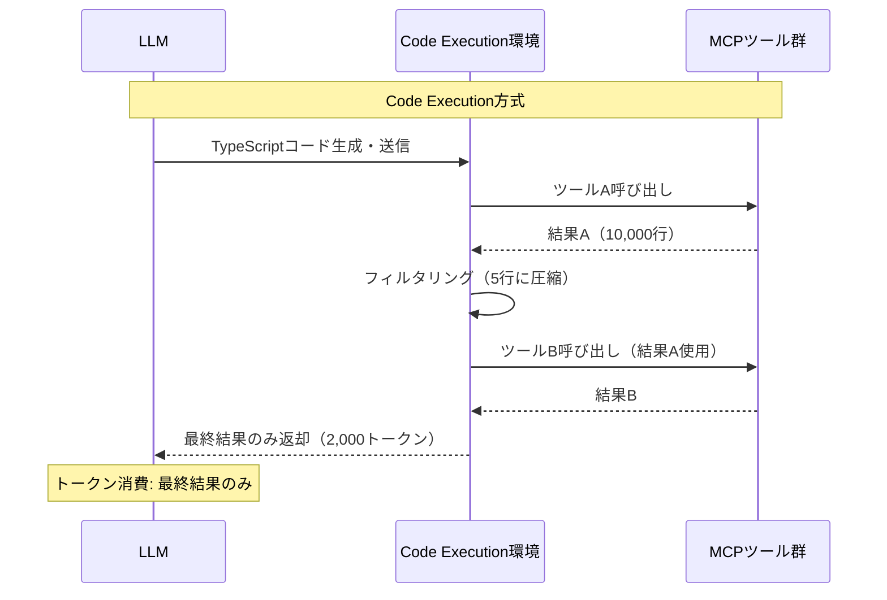

本記事は [Code execution with MCP: building more efficient AI agents (Anthropic Engineering Blog)](https://www.anthropic.com/engineering/code-execution-with-mcp) の解説記事です。

## ブログ概要（Summary）

Anthropicのエンジニアリングブログは、MCP（Model Context Protocol）を通じたツール連携におけるトークン消費の非効率性を指摘し、Code Execution方式による解決策を提示している。従来のツール直接呼び出し方式では150,000トークンを消費していたワークフローが、Code Execution方式では2,000トークンに削減（98.7%削減）されたと報告されている。同ブログでは、File-based Tool Discovery、データフィルタリング、制御フロー効率化、プライバシー保護の4つの技術要素を解説している。

この記事は [Zenn記事: AIエージェントのツール連携設計：マルチツール構成と障害回復の実践パターン](https://zenn.dev/0h_n0/articles/2b1887cb82f72d) の深掘りです。

## 情報源

- **種別**: 企業テックブログ
- **URL**: https://www.anthropic.com/engineering/code-execution-with-mcp
- **組織**: Anthropic Engineering
- **発表日**: 2025年

## 技術的背景（Technical Background）

MCPエージェントは2つの非効率性に直面している：

1. **ツール定義のコンテキスト膨張**: 全ツールの定義が事前にコンテキストに読み込まれ、数十万トークンを消費する。Anthropicの報告によると、ツール定義だけで134,000トークンを消費するケースがある
2. **中間結果のコンテキスト重複**: ツールの出力がすべてモデルのコンテキストを通過するため、Sequential連携でトークン消費が累積する。2時間のミーティング議事録を処理する例では、取得→書き込みの2ステップで50,000トークンが追加される

これは、Zenn記事で解説した「ツールチェーンの途中で結果が消える」問題と「コンテキストウィンドウからの脱落」問題の根本原因でもある。

## 実装アーキテクチャ（Architecture）

### 従来方式 vs Code Execution方式



従来方式では各ツール結果がLLMのコンテキストに蓄積されるのに対し、Code Execution方式ではCode Execution環境内でデータ処理が完結し、LLMには最終結果のみが返却される。

### File-based Tool Discovery

ブログの中核的な提案は、ツール定義をファイルシステムとして構造化し、モデルがファイルシステムを探索してツールを発見する方式である：

```
servers/
├── google-drive/
│   ├── getDocument.ts    # 各ツールが独立したファイル
│   ├── listFiles.ts
│   └── index.ts
├── salesforce/
│   ├── updateRecord.ts
│   ├── queryRecords.ts
│   └── index.ts
└── slack/
    ├── sendMessage.ts
    └── index.ts
```

各ツールファイルは型付きのインターフェースをエクスポートする：

```typescript
// servers/google-drive/getDocument.ts
import { callMCPTool } from "../../../client.js";

interface GetDocumentInput {
  documentId: string;
}

interface GetDocumentResponse {
  content: string;
}

/* Read a document from Google Drive */
export async function getDocument(
  input: GetDocumentInput
): Promise<GetDocumentResponse> {
  return callMCPTool<GetDocumentResponse>(
    'google_drive__get_document', input
  );
}
```

エージェントは`servers/`ディレクトリをリスト→必要なサーバーを特定→ツールファイルを読み込むという3段階で必要なツールだけを発見する。全ツール定義（推定77,000トークン）ではなく、使用するツールの定義（数百トークン）のみがコンテキストに入る。

### データフィルタリング

Code Execution環境内でデータをフィルタリングすることで、大量のデータをコンテキストに含めずに処理できる：

```typescript
// 従来方式: 10,000行がコンテキストに入る
// Code Execution方式: 5行のみがLLMに返される
const allRows = await gdrive.getSheet({ sheetId: 'abc123' });
const pendingOrders = allRows.filter(
  row => row["Status"] === 'pending'
);
console.log(`Found ${pendingOrders.length} pending orders`);
console.log(pendingOrders.slice(0, 5));
```

ブログの報告によると、この方式により「10,000行ではなく5行を観察する」ことが可能になり、集計・結合・フィールド抽出をコンテキストウィンドウの膨張なしに実行できるとされている。

### 制御フロー効率化

ループや条件分岐をCode Execution環境内で実行することで、LLMの推論ステップとツール呼び出しの往復を削減する：

```typescript
// デプロイ完了待ちをCode Execution内で完結
let found = false;
while (!found) {
  const messages = await slack.getChannelHistory({
    channel: 'C123456'
  });
  found = messages.some(
    m => m.text.includes('deployment complete')
  );
  if (!found) {
    await new Promise(r => setTimeout(r, 5000));
  }
}
console.log('Deployment notification received');
```

従来方式では、ポーリング1回ごとにLLMの推論ステップが実行され、各ステップでコンテキスト全体が処理される。Code Execution方式では、ループ全体が1回のコード実行で完結するため、time to first tokenのレイテンシも改善される。

### プライバシー保護

中間データがCode Execution環境に閉じるため、個人情報がLLMのコンテキストを通過しない設計が可能である：

```typescript
const sheet = await gdrive.getSheet({ sheetId: 'abc123' });
for (const row of sheet.rows) {
  await salesforce.updateRecord({
    objectType: 'Lead',
    recordId: row.salesforceId,
    data: {
      Email: row.email,  // 実値はLLMを通過しない
      Phone: row.phone,
      Name: row.name
    }
  });
}
console.log(`Updated ${sheet.rows.length} leads`);
```

MCPクライアントがPIIを自動トークナイズし、LLMには`[EMAIL_1]`, `[PHONE_1]`等の匿名化された値のみが表示される。実値はGoogle SheetsからSalesforceに直接流れ、モデルを経由しない。

## パフォーマンス最適化（Performance）

ブログで報告されている数値をまとめる：

| 指標 | 従来方式 | Code Execution方式 | 改善率 |
|------|---------|-------------------|--------|
| トークン消費 | 150,000 | 2,000 | 98.7%削減 |
| ツール定義オーバーヘッド | 134,000トークン | ~数百トークン | 99%以上削減 |
| データ処理 | 10,000行をコンテキストに | 5行のみ返却 | 99.95%削減 |
| 実行速度 | — | — | 60%高速化 |

また、Anthropicの「Advanced Tool Use」ブログの報告によると、Tool Search Toolの導入により、ツール定義のトークン消費が77,000から8,700に削減（85%削減）され、ツール選択精度もOpus 4で49%から74%に向上している。

### Progressive Disclosure（段階的開示）

Code Executionと組み合わせて、`search_tools`関数によるdetail-level制御が提案されている：

```typescript
// Level 1: 名前のみ（最小トークン）
const serverNames = fs.readdirSync('./servers');

// Level 2: 名前+説明（中程度トークン）
const tools = search_tools({
  query: "update customer record",
  detail: "name_and_description"
});

// Level 3: 完全定義（必要時のみ）
const fullSchema = search_tools({
  query: "salesforce updateRecord",
  detail: "full_definition"
});
```

3段階のdetail-levelにより、必要最小限の情報のみをコンテキストに含めることが可能になる。

## 運用での学び（Production Lessons）

### 制約とトレードオフ

ブログは、Code Execution方式のトレードオフについても言及している：

- **インフラ要件の追加**: セキュアなサンドボックス実行環境、リソース制限、モニタリングが必要
- **コード品質のリスク**: LLMが生成するコードにバグが含まれる可能性。無限ループ、メモリリーク等への対策が必要
- **デバッグの複雑性**: ツール呼び出しがCode Execution環境に隠蔽されるため、障害分析がより複雑になる

### Cloudflareの類似アプローチ

ブログでは、Cloudflareが「Code Mode」として同様の知見を報告していることにも触れている。LLMがコード生成に長けているという強みを活用し、エージェントにコードを書かせてMCPサーバーと効率的に対話させるアプローチは、業界横断的なコンセンサスが形成されつつある。

### Skillsとの統合

Code Execution環境でのツール呼び出しパターンを`SKILL.md`ファイルとして保存し、再利用可能なスキルとして管理する方式も提案されている：

```typescript
// skills/save-sheet-as-csv.ts
import * as gdrive from './servers/google-drive';

export async function saveSheetAsCsv(sheetId: string) {
  const data = await gdrive.getSheet({ sheetId });
  const csv = data.map(row => row.join(',')).join('\n');
  await fs.writeFile(
    `./workspace/sheet-${sheetId}.csv`, csv
  );
  return `./workspace/sheet-${sheetId}.csv`;
}
```

これにより、成功したツール連携パターンが蓄積され、エージェントの効率が段階的に向上する。

## 学術研究との関連（Academic Connection）

Code Execution方式は、以下の学術研究と関連する：

- **MCP-Zero (arXiv:2504.08999)**: semantic searchによるツール発見。Code Executionのfile-based discoveryとは相補的なアプローチ
- **Tool-Augmented LLMs Survey (arXiv:2504.10376)**: Context Overflow（全障害の14%）の緩和策として、Code Executionの「中間結果をコンテキスト外で処理」するアプローチが有効
- **FlowBench (arXiv:2503.12347)**: コンテキスト使用率50%超で完了率が低下するという知見。Code Executionはこの問題に直接対処

## Production Deployment Guide

### AWS実装パターン（コスト最適化重視）

Code Execution環境をAWS上に構築する場合の推奨構成：

| 規模 | 月間リクエスト | 推奨構成 | 月額コスト |
|------|--------------|---------|-----------|
| **Small** | ~3,000 | Lambda + Bedrock | $50-150 |
| **Medium** | ~30,000 | ECS Fargate + Bedrock | $300-800 |
| **Large** | 300,000+ | EKS + Spot + Bedrock | $2,000-5,000 |

**Small構成の要点**:
- Lambda: Code Execution環境としてNode.js 22ランタイム使用、1GB RAM、120秒タイムアウト
- Bedrock: Claude 3.5 Haiku（コード生成+ツール呼び出しの2段階）
- S3: ツール定義ファイルシステムの永続化
- DynamoDB: Skills（再利用可能パターン）のキャッシュ

**コスト試算の注意事項**: 上記は2026年3月時点のAWS ap-northeast-1料金に基づく概算値です。最新料金は [AWS料金計算ツール](https://calculator.aws/) で確認してください。

### コスト最適化チェックリスト

- [ ] Code Execution環境のサンドボックス化（Lambda/Firecracker/gVisor）
- [ ] ツール定義ファイルのS3キャッシュ（CloudFront経由で配信）
- [ ] Skills（再利用パターン）のDynamoDBキャッシュ（TTL 24時間）
- [ ] Bedrock Prompt Caching有効化（システムプロンプト部分）
- [ ] Bedrock Batch APIで非リアルタイム処理を50%割引
- [ ] Lambda Provisioned Concurrencyでcold start回避（Medium以上）
- [ ] CloudWatch Logsでトークン使用量モニタリング
- [ ] AWS Budgets設定（80%警告、100%アラート）

## まとめと実践への示唆

Anthropicの提案するCode Execution方式は、ツール連携時のトークン消費を劇的に削減する実用的なアプローチである。98.7%のトークン削減という数値は、コスト削減だけでなく、コンテキストウィンドウの有効活用（より多くのツール連携を1セッションで実行可能）にもつながる。ただし、セキュアな実行環境の構築とLLM生成コードの品質管理というインフラ要件が追加される点は、導入判断時に考慮すべきトレードオフである。

## 参考文献

- **Blog URL**: https://www.anthropic.com/engineering/code-execution-with-mcp
- **Advanced Tool Use**: https://www.anthropic.com/engineering/advanced-tool-use
- **Related Zenn article**: https://zenn.dev/0h_n0/articles/2b1887cb82f72d
