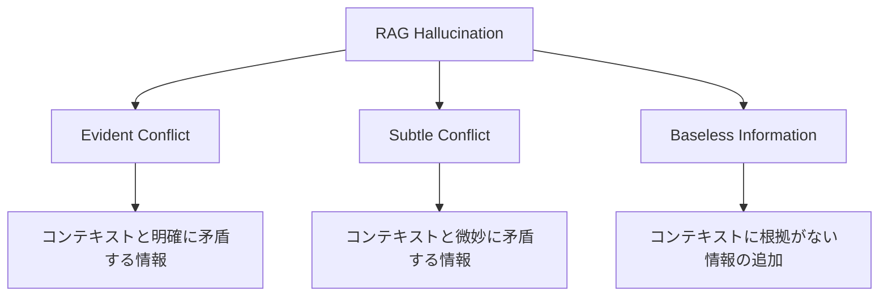

本記事は [RAGTruth: A Hallucination Corpus for Developing Trustworthy Retrieval-Augmented Language Models (ACL 2024)](https://aclanthology.org/2024.acl-long.585/) の解説記事です。

## 論文概要（Abstract）

RAGTruthは、RAG（Retrieval-Augmented Generation）システムが生成する幻覚（hallucination）を体系的に分類・アノテーションした大規模コーパスである。著者らは、約18,000件のRAG生成応答に対してケースレベル・単語レベルの手動アノテーションを行い、幻覚の頻度・強度・タイプをLLMごとに定量化している。さらに、既存の幻覚検出手法の有効性をこのコーパス上でベンチマークし、小規模LLMのファインチューニングがGPT-4のプロンプトベース検出と同等の性能を達成できることを示している。

この記事は [Zenn記事: Arize PhoenixでRAG評価基盤を構築する実践ガイド](https://zenn.dev/0h_n0/articles/67e450ead4b1ff) の深掘りです。

## 情報源

- **会議名**: ACL 2024（62nd Annual Meeting of the Association for Computational Linguistics）
- **年**: 2024
- **URL**: [https://aclanthology.org/2024.acl-long.585/](https://aclanthology.org/2024.acl-long.585/)
- **著者**: Cheng Niu, Yuanhao Wu, Juno Zhu, Siliang Xu, KaShun Shum, Randy Zhong, Juntong Song, Tong Zhang
- **DOI**: 10.18653/v1/2024.acl-long.585

## カンファレンス情報

**ACLについて**: ACL（Association for Computational Linguistics）は自然言語処理（NLP）分野の最高峰会議の一つであり、採択率は通常20-25%程度である。RAGTruth論文はACL 2024のMain Conferenceに採択されており、査読者による厳密な審査を通過している。

## 技術的詳細（Technical Details）

### 幻覚の分類体系

著者らは、RAGシステムで発生する幻覚を以下の3カテゴリに分類している。



| 幻覚タイプ | 定義 | 検出難度 |
|-----------|------|---------|
| **Evident Conflict** | 取得コンテキストと明確に矛盾する事実の生成 | 低（自動検出しやすい） |
| **Subtle Conflict** | 数値の微妙な誤り、条件の省略など | 中（文脈理解が必要） |
| **Baseless Information** | コンテキストに根拠がない情報の追加・捏造 | 高（何が「ない」かの判定が困難） |

### コーパス構築方法

著者らは以下のパイプラインでコーパスを構築している。

**データソース**: 複数のドメイン（ニュース要約、QA、データテーブル要約）からRAGタスクを構成し、多様な生成シナリオをカバーしている。

**使用LLM**: GPT-4-0613, GPT-3.5-turbo, Llama-2-7B-chat, Llama-2-13B-chat, Llama-2-70B-chat, Mistral-7B-Instruct の6モデルから応答を生成している。

**アノテーション手順**:
1. 各応答に対してケースレベルの幻覚判定（幻覚あり/なし）
2. 幻覚ありの場合、単語レベルのスパンアノテーション（どの部分が幻覚か）
3. 幻覚のタイプ分類（Evident Conflict / Subtle Conflict / Baseless Information）
4. 幻覚の強度評価（軽微 / 重大）

**規模**: 約18,000件の応答、各応答に複数アノテーターによる判定が付与されている。

### 幻覚検出手法のベンチマーク

著者らは、以下の幻覚検出手法をRAGTruthコーパス上で評価している。

**ベンチマーク対象手法**:
1. **NLI（Natural Language Inference）ベース**: DeBERTa-v3-largeなどのNLIモデルで、コンテキストと応答の矛盾を検出
2. **LLM-as-a-Judge**: GPT-4にプロンプトを与えて幻覚を判定
3. **SelfCheckGPT**: 複数サンプル生成の一貫性で幻覚を検出
4. **ファインチューニング**: RAGTruthの訓練データでLlama-2-13Bをファインチューニング

### 主要な発見

著者らの実験から以下の結果が報告されている。

**モデル別幻覚率（論文Table 3の傾向）**:
- GPT-4はEvident Conflictの発生率が最も低いが、Baseless Informationは一定数発生
- Llama-2-7Bは全カテゴリで最も高い幻覚率を示す
- モデルサイズの増大に伴い幻覚率は低下する傾向があるが、Baseless Informationの低減効果は限定的

**検出手法の性能比較**:
- GPT-4プロンプトベース検出: ケースレベルF1 ≈ 0.70-0.75（タスクにより変動）
- ファインチューニングされたLlama-2-13B: GPT-4プロンプトベースと同等のF1を達成
- NLIベース: Evident Conflictには有効だが、Subtle ConflictとBaseless Informationの検出精度は低い

この結果は、大規模LLMのプロンプトベース検出に頼らずとも、高品質なアノテーションデータで小規模モデルをファインチューニングすることで、実用的な幻覚検出が可能であることを示唆している。

## 実装のポイント（Implementation）

RAGTruthをRAG評価基盤に組み込む際の実践的な注意点を述べる。

**データセットの活用方法**: RAGTruthは訓練データ・テストデータに分割されており、自社RAGシステムの幻覚検出モデルをファインチューニングするための基盤データとして利用できる。ただし、ドメインが異なる場合は追加のドメイン適応が必要となる。

**単語レベルアノテーションの活用**: 単語レベルのスパン情報を活用することで、「どの部分が幻覚か」を特定するトークンレベルの検出モデルを構築できる。これはArize PhoenixのSpan評価と組み合わせて、応答中の問題箇所をハイライト表示するのに有用である。

**コスト効率**: GPT-4ベースの検出は1件あたり$0.01-$0.05のコストが発生するが、ファインチューニングされた小規模モデル（13Bパラメータ）を使えば、推論コストを大幅に削減できる。論文の知見は、品質を維持しつつコストを最適化するための実装判断に直結する。

**Phoenixとの統合**: RAGTruthの分類体系（Evident Conflict / Subtle Conflict / Baseless Information）をPhoenixの評価ラベルとして定義し、トレースデータに対して幻覚タイプ別のスコアを記録することで、問題パターンの特定が容易になる。

```python
from phoenix.evals import SpanEvaluations
import pandas as pd

def log_ragtruth_evaluations(
    client,
    span_df: pd.DataFrame,
    hallucination_results: list[dict],
) -> None:
    """RAGTruth分類に基づく幻覚評価をPhoenixに記録

    Args:
        client: Phoenix Client
        span_df: トレーススパンのDataFrame
        hallucination_results: 各スパンの幻覚判定結果
    """
    eval_df = pd.DataFrame(hallucination_results)
    eval_df.index = span_df.index

    for hal_type in ["evident_conflict", "subtle_conflict", "baseless_info"]:
        type_df = eval_df[["score", "label", "explanation"]].copy()
        type_df["score"] = eval_df[hal_type + "_score"]
        client.log_evaluations(
            SpanEvaluations(eval_name=f"RAGTruth_{hal_type}", dataframe=type_df)
        )
```

## Production Deployment Guide

### AWS実装パターン（コスト最適化重視）

RAGTruthベースの幻覚検出パイプラインをAWSで構築する場合の構成を示す。

**トラフィック量別の推奨構成**:

| 規模 | 月間検出件数 | 推奨構成 | 月額コスト | 主要サービス |
|------|------------|---------|-----------|------------|
| **Small** | ~1,000件 | Serverless | $60-150 | Lambda + Bedrock + S3 |
| **Medium** | ~10,000件 | Hybrid | $300-800 | ECS Fargate + SageMaker Endpoint |
| **Large** | 100,000件+ | Container | $1,500-4,000 | EKS + SageMaker + Spot |

**Small構成の詳細**（月額$60-150）:
- **Lambda**: 1GB RAM, 30秒タイムアウト（$15/月）
- **Bedrock**: Claude 3.5 Haiku for 幻覚判定（$80/月 @1,000件）
- **S3**: 検出結果・モデルアーティファクト保存（$5/月）
- **CloudWatch**: 基本監視（$5/月）

**Medium構成の詳細**（月額$300-800）:
- **SageMaker Endpoint**: ファインチューニング済みモデルをホスティング（$200/月、ml.g5.xlarge）
- **ECS Fargate**: 前処理・後処理パイプライン（$80/月）
- **S3**: データ保存（$10/月）

**コスト削減テクニック**:
- ファインチューニング済み13Bモデル使用でBedrock APIコストを90%以上削減
- SageMaker Serverless Inference（低トラフィック時）で待機コスト$0
- S3 Intelligent-Tieringで自動コスト最適化

**コスト試算の注意事項**: 上記は2026年3月時点のAWS ap-northeast-1料金に基づく概算値。SageMakerインスタンスタイプの料金は頻繁に改定されるため、[AWS料金計算ツール](https://calculator.aws/) で最新料金を確認されたい。

### Terraformインフラコード

**Small構成（Serverless）: Lambda + Bedrock + S3**

```hcl
resource "aws_iam_role" "lambda_hal_detect" {
  name = "lambda-hallucination-detection-role"

  assume_role_policy = jsonencode({
    Version = "2012-10-17"
    Statement = [{
      Action = "sts:AssumeRole"
      Effect = "Allow"
      Principal = { Service = "lambda.amazonaws.com" }
    }]
  })
}

resource "aws_iam_role_policy" "bedrock_and_s3" {
  role = aws_iam_role.lambda_hal_detect.id

  policy = jsonencode({
    Version = "2012-10-17"
    Statement = [
      {
        Effect   = "Allow"
        Action   = ["bedrock:InvokeModel"]
        Resource = "arn:aws:bedrock:ap-northeast-1::foundation-model/anthropic.claude-3-5-haiku*"
      },
      {
        Effect   = "Allow"
        Action   = ["s3:PutObject", "s3:GetObject"]
        Resource = "${aws_s3_bucket.hal_results.arn}/*"
      }
    ]
  })
}

resource "aws_lambda_function" "hal_detector" {
  filename      = "hal_detector.zip"
  function_name = "ragtruth-hallucination-detector"
  role          = aws_iam_role.lambda_hal_detect.arn
  handler       = "index.handler"
  runtime       = "python3.12"
  timeout       = 60
  memory_size   = 1024

  environment {
    variables = {
      BEDROCK_MODEL_ID = "anthropic.claude-3-5-haiku-20241022-v1:0"
      S3_BUCKET        = aws_s3_bucket.hal_results.id
      HAL_CATEGORIES   = "evident_conflict,subtle_conflict,baseless_info"
    }
  }
}

resource "aws_s3_bucket" "hal_results" {
  bucket = "ragtruth-hallucination-results"
}

resource "aws_s3_bucket_server_side_encryption_configuration" "hal_results" {
  bucket = aws_s3_bucket.hal_results.id

  rule {
    apply_server_side_encryption_by_default {
      sse_algorithm = "aws:kms"
    }
  }
}
```

### セキュリティベストプラクティス

- **IAMロール**: Bedrock InvokeModel + S3のみ許可（最小権限）
- **暗号化**: S3はKMS暗号化、転送中はTLS 1.2以上
- **データ保護**: 検出結果にPII（個人情報）が含まれる場合、S3 Object Lock + VPCエンドポイント経由アクセス

### コスト最適化チェックリスト

**アーキテクチャ選択**:
- [ ] ~1,000件/月 → Lambda + Bedrock $60-150/月
- [ ] ~10,000件/月 → ECS + SageMaker Endpoint $300-800/月
- [ ] 100,000件+/月 → EKS + SageMaker + Spot $1,500-4,000/月

**LLMコスト削減**:
- [ ] ファインチューニング済みモデルでBedrock API 90%削減
- [ ] Prompt Caching有効化で30-90%削減
- [ ] バッチ評価でBedrock Batch API 50%削減
- [ ] NLIベース前段フィルタで明確な幻覚を事前除去

**監視・アラート**:
- [ ] CloudWatch: 幻覚検出率の推移監視
- [ ] AWS Budgets: 月額予算設定
- [ ] Cost Anomaly Detection有効化
- [ ] 日次レポートSNS通知

## 実験結果（Results）

著者らの主要な実験結果を以下にまとめる。

**幻覚発生率の傾向（論文の報告より）**:
- タスクによって幻覚率は大きく変動し、データテーブル要約タスクでは幻覚率が特に高い
- GPT-4は全体的に最も低い幻覚率を示すが、Baseless Information（根拠なし情報）はゼロにはならない
- オープンソースモデル（Llama-2系）はパラメータ数の増加に伴い幻覚率が低下する傾向がある

**検出手法の比較（論文の報告より）**:
- ファインチューニングされた小規模モデル（13B）は、GPT-4のプロンプトベース検出と同等のF1スコアを達成
- NLIベース手法はEvident Conflictの検出に有効だが、Subtle ConflictとBaseless Informationへの対応は限定的
- 単語レベルの幻覚スパン検出は、ケースレベル検出よりも困難であり、今後の研究課題として残されている

## 実運用への応用（Practical Applications）

RAGTruthの知見は、Zenn記事で紹介されているArize Phoenixの評価パイプラインに直接適用できる。

**幻覚タイプ別の対策**: Evident Conflictはコンテキストとの明示的な矛盾であるため、NLIベースの軽量チェッカーで前段フィルタできる。Baseless Informationは検出が困難であるため、LLM-as-a-Judgeによる後段評価が必要となる。この2段階アプローチにより、コストと精度のバランスを最適化できる。

**カスタム評価器の構築**: RAGTruthの訓練データを用いて、自社ドメインに特化した幻覚検出モデルをファインチューニングし、PhoenixのカスタムEvaluatorとして組み込むことが可能である。

**品質閾値の設計**: RAGTruthのアノテーションには幻覚の強度（軽微/重大）が含まれており、重大な幻覚のみをブロックする閾値設計が実用的である。

## まとめ

RAGTruthは、RAGシステムの幻覚を体系的に分類し、18,000件規模のアノテーション付きコーパスを提供した点で、RAG評価研究の基盤となる貢献である。特に、ファインチューニングされた小規模モデルがGPT-4ベースの検出と同等の性能を示すという知見は、コスト効率の高い幻覚検出パイプラインの構築に直結する。Arize Phoenixと組み合わせることで、幻覚タイプ別のモニタリングと段階的な品質改善が実現可能である。

## 参考文献

- **Conference URL**: [https://aclanthology.org/2024.acl-long.585/](https://aclanthology.org/2024.acl-long.585/)
- **DOI**: [10.18653/v1/2024.acl-long.585](https://doi.org/10.18653/v1/2024.acl-long.585)
- **Related Zenn article**: [https://zenn.dev/0h_n0/articles/67e450ead4b1ff](https://zenn.dev/0h_n0/articles/67e450ead4b1ff)
