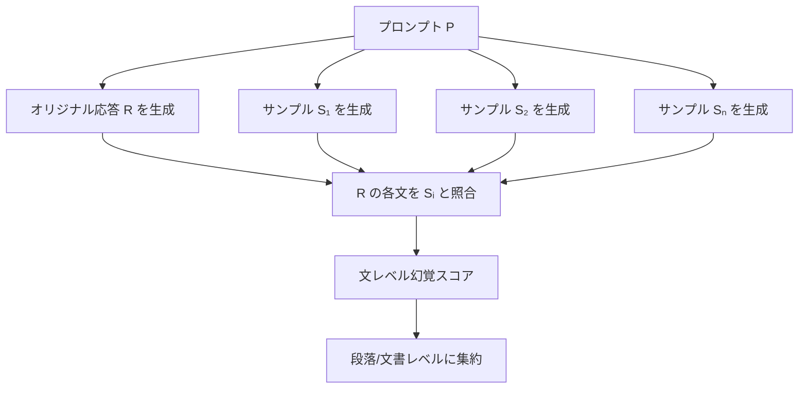

本記事は [SelfCheckGPT: Zero-Resource Black-Box Hallucination Detection for Generative Large Language Models (arXiv:2303.08896)](https://arxiv.org/abs/2303.08896) の解説記事です。

## 論文概要（Abstract）

SelfCheckGPTは、外部知識ベースを必要とせずにLLMの幻覚（hallucination）を検出する手法である。著者らは、「事実的な情報は複数回生成しても一貫するが、幻覚は生成ごとに異なる」という仮説に基づき、同一プロンプトから複数のサンプルを生成し、サンプル間の一貫性を幻覚スコアとして活用する手法を提案している。BERTScore・NLI・n-gram（MQAG）・Promptingの4つの実装バリアントを提供し、WikiBioデータセット（238人物記事）で人間評価との相関（Spearman 0.56-0.74）を達成している。

この記事は [Zenn記事: Arize PhoenixでRAG評価基盤を構築する実践ガイド](https://zenn.dev/0h_n0/articles/67e450ead4b1ff) の深掘りです。

## 情報源

- **arXiv ID**: 2303.08896
- **URL**: [https://arxiv.org/abs/2303.08896](https://arxiv.org/abs/2303.08896)
- **著者**: Potsawee Manakul, Adian Liusie, Mark J. F. Gales
- **発表年**: 2023
- **分野**: cs.CL（計算言語学）

## 背景と動機（Background & Motivation）

LLMの幻覚検出は、外部知識ベースの有無によって2つのアプローチに大別される。

1. **Knowledge-grounded（知識ベースあり）**: FActScoreのように、Wikipediaなどの知識ベースと照合して事実精度を検証する手法。精度は高いが、知識ベースのカバレッジ外の情報は評価できない
2. **Zero-resource（知識ベースなし）**: 外部知識なしで幻覚を検出する手法。適用範囲が広いが、精度に課題がある

著者らは後者のアプローチに着目し、LLMの生成確率の性質を利用した幻覚検出を提案した。核心的なアイデアは、「LLMが自信を持って知っている事実は、複数回生成しても一貫した内容が出力されるが、幻覚（作り話）は生成のたびに異なる内容になる」という仮説である。

この手法はRAG評価において、コンテキストなしの生成（生成LLMの内部知識のみに依存する場合）の品質チェックに有用であり、Arize PhoenixのFaithfulness評価を補完する位置づけとなる。

## 主要な貢献（Key Contributions）

- **貢献1**: 外部知識不要のブラックボックス幻覚検出フレームワーク「SelfCheckGPT」を提案
- **貢献2**: BERTScore・NLI・MQAG（n-gram）・Promptingの4つの一貫性測定手法を実装し比較
- **貢献3**: WikiBioデータセットで人間評価との相関を検証し、Prompting版でAUC-PR = 0.85を達成

## 技術的詳細（Technical Details）

### 基本アルゴリズム

SelfCheckGPTの全体フローは以下の通りである。



**ステップ1**: プロンプト$P$に対してオリジナル応答$R$を生成する

**ステップ2**: 同一プロンプト$P$から$n$個の追加サンプル$\{S_1, S_2, \ldots, S_n\}$を生成する（temperature > 0で多様性を確保）

**ステップ3**: オリジナル応答$R$の各文$r_i$について、各サンプル$S_j$との一貫性スコアを計算する

**ステップ4**: 一貫性スコアを集約して幻覚スコアとする

$$
\text{HalScore}(r_i) = 1 - \frac{1}{n} \sum_{j=1}^{n} \text{Consistency}(r_i, S_j)
$$

ここで、
- $r_i$: オリジナル応答の$i$番目の文
- $S_j$: $j$番目のサンプル応答
- $\text{Consistency}(r_i, S_j)$: 文$r_i$とサンプル$S_j$の一貫性スコア（0-1）
- $n$: サンプル数（推奨: 5-20）

スコアが高いほど幻覚の可能性が高い。

### 4つの一貫性測定バリアント

#### 1. BERTScore版

BERTScoreを使って文レベルの意味的類似度を計算する。

$$
\text{Consistency}_{\text{BERT}}(r_i, S_j) = \max_{s \in \text{sentences}(S_j)} \text{BERTScore}(r_i, s)
$$

各サンプル中の全文と照合し、最も類似度の高い文のスコアを使用する。

#### 2. NLI（Natural Language Inference）版

NLIモデル（DeBERTa-v3-large）を使って、サンプル文がオリジナル文を含意（entail）するかを判定する。

$$
\text{Consistency}_{\text{NLI}}(r_i, S_j) = P(\text{entailment} | S_j, r_i)
$$

著者らの報告によると、NLI版はAUC-PR = 0.80を達成しており、外部LLMを必要としない点でコスト効率が良い。

#### 3. MQAG（Multiple-choice QA Generation）版

オリジナル文から選択式質問を生成し、サンプル応答から回答できるかでを一貫性測定する。n-gramベースの手法で、最も軽量な実装である。

#### 4. Prompting版

LLMにプロンプトを与えて直接一貫性を判定させる。

```
Context: {sample_response}
Sentence: {original_sentence}

Is the sentence supported by the context above?
Answer "Yes" or "No".
```

著者らの報告によると、Prompting版（GPT-3使用）がAUC-PR = 0.85で最高性能を達成している。

### 性能比較

著者らのWikiBio実験結果（論文Table 2の傾向）:

| バリアント | AUC-PR | 外部LLM必要 | コスト |
|-----------|--------|-----------|--------|
| BERTScore | ~0.70 | 不要 | 低 |
| NLI | ~0.80 | 不要 | 低 |
| MQAG | ~0.65 | 不要 | 低 |
| Prompting | ~0.85 | 必要 | 高 |

## 実装のポイント（Implementation）

SelfCheckGPTをRAG評価パイプラインに組み込む際の実践的な注意点を述べる。

**サンプル数の選択**: 著者らは$n=5$-20を推奨している。$n=5$でも実用的な精度が得られるが、$n$を増やすほど検出精度が向上する。ただし、コストは$n$に比例して増加するため、$n=5$をデフォルトとし、疑わしいケースのみ$n=20$で再評価する段階的アプローチが現実的である。

**temperature設定**: サンプル生成時はtemperature=0.7-1.0が推奨される。低すぎると多様性が不足し、高すぎるとサンプル品質が低下する。

**NLI版の推奨**: コストとのバランスを考慮すると、NLI版（DeBERTa-v3-large使用）が最も実用的である。追加のLLMコールが不要で、GPUがあれば高速に処理できる。

**RAGコンテキストとの組み合わせ**: RAGシステムでは、サンプル生成の代わりに取得コンテキストをアンカーとして使用する変形が可能である。これにより、コンテキストの忠実度チェック（Faithfulness）とSelfCheckの幻覚チェックを統合できる。

```python
from selfcheckgpt.modeling_selfcheck import SelfCheckNLI

def selfcheck_rag_response(
    original_response: str,
    sample_responses: list[str],
    device: str = "cuda",
) -> list[float]:
    """SelfCheckGPT NLI版でRAG応答の幻覚スコアを計算

    Args:
        original_response: 元の応答テキスト
        sample_responses: 同一プロンプトから生成したサンプル応答リスト
        device: 推論デバイス

    Returns:
        各文の幻覚スコア（0=事実的, 1=幻覚の可能性大）
    """
    selfcheck = SelfCheckNLI(device=device)

    # 文レベルの幻覚スコアを計算
    sentences = original_response.split(". ")
    scores = selfcheck.predict(
        sentences=sentences,
        sampled_passages=sample_responses,
    )
    return scores
```

## Production Deployment Guide

### AWS実装パターン（コスト最適化重視）

SelfCheckGPT NLI版をAWSで運用するための構成を示す。NLI版はLLM APIコールが不要で、NLIモデル（DeBERTa-v3-large）のGPU推論のみで動作する点が特徴である。

| 規模 | 月間チェック件数 | 推奨構成 | 月額コスト | 主要サービス |
|------|------------|---------|-----------|------------|
| **Small** | ~1,000件 | Serverless | $30-80 | Lambda + SageMaker Serverless |
| **Medium** | ~10,000件 | Endpoint | $200-500 | SageMaker Endpoint (ml.g5.xlarge) |
| **Large** | 100,000件+ | Container | $800-2,000 | ECS + GPU + Spot |

**Small構成の詳細**（月額$30-80）:
- **SageMaker Serverless Inference**: DeBERTa-v3-large NLIモデル（待機コスト$0、推論時のみ課金）
- **Lambda**: オーケストレーション・サンプル生成トリガー（$10/月）
- **Bedrock**: サンプル生成（Claude 3.5 Haiku, $40/月 @1,000件×5サンプル）
- **S3**: モデルアーティファクト・結果保存（$5/月）

**NLI版のコスト優位性**: Prompting版は判定にLLMコール（$0.01-0.05/件）が必要だが、NLI版はDeBERTaの推論のみ（$0.001-0.005/件）で済む。10,000件/月の場合、Prompting版: $100-500 vs NLI版: $10-50と約10倍のコスト差がある。

**コスト試算の注意事項**: 上記は2026年3月時点のAWS ap-northeast-1料金に基づく概算値。サンプル生成のLLMコスト（Bedrock）が支配的であり、サンプル数$n$の削減がコスト最適化の鍵となる。

### Terraformインフラコード

```hcl
resource "aws_sagemaker_model" "selfcheck_nli" {
  name               = "selfcheck-nli-deberta"
  execution_role_arn = aws_iam_role.sagemaker_role.arn

  primary_container {
    image          = "763104351884.dkr.ecr.ap-northeast-1.amazonaws.com/huggingface-pytorch-inference:2.1-transformers4.37-gpu-py310-cu121-ubuntu22.04"
    model_data_url = "s3://${aws_s3_bucket.models.id}/selfcheck-nli/model.tar.gz"

    environment = {
      HF_MODEL_ID       = "potsawee/deberta-v3-large-mnli"
      HF_TASK            = "text-classification"
      SAGEMAKER_PROGRAM  = "inference.py"
    }
  }
}

resource "aws_sagemaker_endpoint_configuration" "selfcheck_nli" {
  name = "selfcheck-nli-config"

  production_variants {
    variant_name           = "primary"
    model_name             = aws_sagemaker_model.selfcheck_nli.name
    serverless_config {
      memory_size_in_mb       = 6144
      max_concurrency         = 5
      provisioned_concurrency = 0
    }
  }
}

resource "aws_sagemaker_endpoint" "selfcheck_nli" {
  name                 = "selfcheck-nli-endpoint"
  endpoint_config_name = aws_sagemaker_endpoint_configuration.selfcheck_nli.name
}

resource "aws_lambda_function" "selfcheck_orchestrator" {
  filename      = "selfcheck_orchestrator.zip"
  function_name = "selfcheck-gpt-orchestrator"
  role          = aws_iam_role.lambda_selfcheck.arn
  handler       = "index.handler"
  runtime       = "python3.12"
  timeout       = 300
  memory_size   = 512

  environment {
    variables = {
      SAGEMAKER_ENDPOINT = aws_sagemaker_endpoint.selfcheck_nli.name
      BEDROCK_MODEL_ID   = "anthropic.claude-3-5-haiku-20241022-v1:0"
      SAMPLE_COUNT       = "5"
      SAMPLE_TEMPERATURE = "0.7"
    }
  }
}
```

### コスト最適化チェックリスト

**アーキテクチャ選択**:
- [ ] ~1,000件/月 → SageMaker Serverless + Lambda $30-80/月
- [ ] ~10,000件/月 → SageMaker Endpoint (g5.xlarge) $200-500/月
- [ ] 100,000件+/月 → ECS + GPU Spot Instances $800-2,000/月

**サンプル生成コスト削減**:
- [ ] サンプル数$n=5$をデフォルト（$n=20$は疑わしいケースのみ）
- [ ] Bedrock Batch APIでサンプル生成を50%削減
- [ ] Prompt Caching有効化でシステムプロンプト部分を削減

**NLIモデルコスト削減**:
- [ ] SageMaker Serverless Inference（低トラフィック時、待機$0）
- [ ] バッチ推論（SageMaker Batch Transform）で大量データ処理
- [ ] モデル量子化（INT8）でGPUメモリ半減・推論速度2倍

**監視・アラート**:
- [ ] 幻覚検出率の推移モニタリング
- [ ] AWS Budgets月額予算設定
- [ ] SageMaker Endpoint使用率最適化（オートスケーリング）

## 実験結果（Results）

著者らのWikiBioデータセット（238人物記事）での実験結果を以下にまとめる。

**文レベル幻覚検出精度（論文の報告より）**:
- Prompting版（GPT-3使用）: AUC-PR ≈ 0.85（最高性能）
- NLI版（DeBERTa-v3-large）: AUC-PR ≈ 0.80
- BERTScore版: AUC-PR ≈ 0.70
- MQAG版: AUC-PR ≈ 0.65

**人間評価との相関（論文の報告より）**:
- Spearman相関: 0.56-0.74（バリアントにより異なる）
- 段落レベルに集約すると文レベルより相関が向上

著者らは、NLI版が精度とコストのバランスに優れた実用的な選択肢であると述べている。Prompting版は最高精度だが追加のLLMコストが発生する。

## 実運用への応用（Practical Applications）

SelfCheckGPTの知見は、Zenn記事で紹介されているArize Phoenixの評価基盤を以下のように補完できる。

**Faithfulness評価の補強**: Phoenixの`FaithfulnessEvaluator`はコンテキストとの照合に基づくが、SelfCheckGPTはLLM内部の知識一貫性に基づく。両者を併用することで、「コンテキストに忠実だが事実的に誤っている」ケースや「コンテキスト外の知識を正しく活用している」ケースを識別できる。

**リアルタイムスクリーニング**: NLI版はGPU推論のみで動作するため、レイテンシが低い（~100ms/文）。本番RAGシステムの応答にリアルタイムで幻覚スコアを付与し、高スコアの応答を人間レビューに回す仕組みが構築可能である。

**コスト階層化**: 全応答にNLI版（低コスト）でスクリーニングし、疑わしいケースのみPrompting版（高精度）で再評価する2段階パイプラインがコスト効率に優れる。

## 関連研究（Related Work）

- **FActScore (2307.14100)**: 原子的事実分解による事実精度評価。SelfCheckGPTが一貫性ベース（knowledge-free）であるのに対し、FActScoreは知識ベースとの照合（knowledge-grounded）である点で相補的
- **RAGAS (2309.01431)**: RAGパイプラインの自動評価フレームワーク。FaithfulnessメトリクスはSelfCheckGPTのアプローチと概念的に類似するが、RAGASはコンテキストを参照する点が異なる
- **RAGTruth (ACL 2024)**: RAGの幻覚コーパス。SelfCheckGPTの検出結果をRAGTruthの分類体系（Evident/Subtle/Baseless）で分析することで、手法の強み・弱みを特定できる

## まとめと今後の展望

SelfCheckGPTは、外部知識ベースを必要としない幻覚検出手法として、適用範囲の広さが最大の利点である。特にNLI版は追加のLLMコストなしで実用的な精度を実現しており、RAG評価パイプラインへの組み込みが容易である。

制約としては、複数サンプル生成によるコスト増（サンプル生成コストが$n$倍）、事実が本質的に稀なケースでの偽陽性、WikiBio以外のドメインでの検証不足が挙げられる。RAGシステムではコンテキストが固定されるため、サンプリング多様性が低下し、検出感度が下がる可能性がある点にも留意が必要である。

## 参考文献

- **arXiv**: [https://arxiv.org/abs/2303.08896](https://arxiv.org/abs/2303.08896)
- **Code**: [https://github.com/potsawee/selfcheckgpt](https://github.com/potsawee/selfcheckgpt)（MIT License）
- **PyPI**: [https://pypi.org/project/selfcheckgpt/](https://pypi.org/project/selfcheckgpt/)
- **Related Zenn article**: [https://zenn.dev/0h_n0/articles/67e450ead4b1ff](https://zenn.dev/0h_n0/articles/67e450ead4b1ff)
