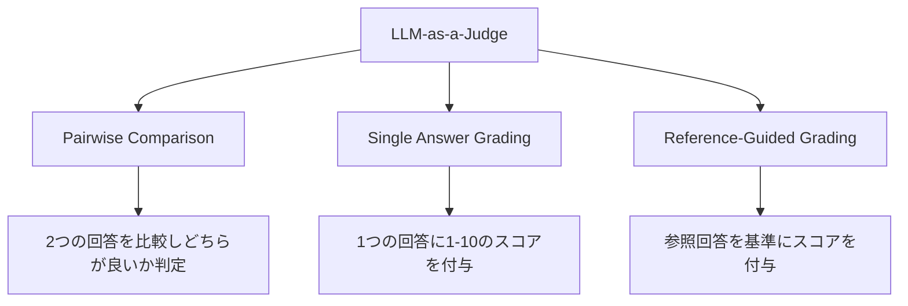

本記事は [Judging LLM-as-a-Judge with MT-Bench and Chatbot Arena (arXiv:2306.05685)](https://arxiv.org/abs/2306.05685) の解説記事です。

## 論文概要（Abstract）

本論文は、LLMを評価の判定器として使う「LLM-as-a-Judge」パラダイムの信頼性を体系的に検証した研究である。著者らは、多段階対話を評価するMT-Benchと、人間のペアワイズ比較に基づくChatbot Arenaの2つの評価プラットフォームを提案している。GPT-4を判定器として使用した場合、人間の専門家判定との一致率が80%以上に達することを示し、同時にposition bias（順序バイアス）、verbosity bias（冗長さバイアス）、self-enhancement bias（自己強化バイアス）などの系統的バイアスの存在も指摘している。

この記事は [Zenn記事: Arize PhoenixでRAG評価基盤を構築する実践ガイド](https://zenn.dev/0h_n0/articles/67e450ead4b1ff) の深掘りです。

## 情報源

- **arXiv ID**: 2306.05685
- **URL**: [https://arxiv.org/abs/2306.05685](https://arxiv.org/abs/2306.05685)
- **著者**: Lianmin Zheng, Wei-Lin Chiang, Ying Sheng, Siyuan Zhuang, Zhanghao Wu, Yonghao Zhuang, et al.
- **発表年**: 2023
- **分野**: cs.CL（計算言語学）

## 背景と動機（Background & Motivation）

LLMの評価は従来、人間評価（Human Evaluation）が最も信頼性が高いとされてきたが、コスト・時間・スケーラビリティの点で大きな制約があった。1件あたりの人間評価コストは$1-$10と高額であり、1,000件規模の評価には数週間を要する。

一方、BLEUやROUGEなどの自動指標は、オープンエンドな生成タスクでの相関が低く、LLMの多様な応答品質を捉えきれない。この「人間評価は高コスト、自動指標は低精度」というジレンマを解決するために、著者らはLLM自身を判定器として使う「LLM-as-a-Judge」の系統的な検証を行った。

この研究は、Arize Phoenixが採用している**LLMを使った自動評価**の理論的・実験的根拠を提供する。Phoenixの`RelevanceEvaluator`や`QAEvaluator`はまさにLLM-as-a-Judgeパラダイムの実装であり、本論文の知見はその信頼性の理解と限界の把握に直結する。

## 主要な貢献（Key Contributions）

- **貢献1**: 多段階対話の品質を体系的に評価するMT-Bench（80問、8カテゴリ）を設計し、公開
- **貢献2**: GPT-4を判定器として使用した場合の人間専門家との一致率が80%以上に達することを実証
- **貢献3**: LLM-as-a-Judgeの3つの系統的バイアス（position bias, verbosity bias, self-enhancement bias）を特定し、定量化

## 技術的詳細（Technical Details）

### MT-Benchの設計

MT-Bench（Multi-Turn Benchmark）は、LLMの多段階対話能力を評価するために設計されたベンチマークである。

**8カテゴリ**:
1. Writing（文章作成）
2. Roleplay（ロールプレイ）
3. Extraction（情報抽出）
4. Reasoning（推論）
5. Math（数学）
6. Coding（コーディング）
7. Knowledge I（STEM知識）
8. Knowledge II（人文・社会知識）

各カテゴリに10問、計80問の多段階質問が含まれる。各質問は2ターンで構成され、2ターン目は1ターン目の回答に依存するフォローアップ質問となっている。

### LLM-as-a-Judgeの判定方式

著者らは3つの判定方式を検証している。



**Pairwise Comparison（ペアワイズ比較）**: 2つのモデルの回答を並べて提示し、判定LLMにどちらが優れているかを判定させる。

**Single Answer Grading（単一回答採点）**: 1つの回答に対して1-10のスコアを付与する。RAG評価ではこの方式が主流である。

**Reference-Guided Grading（参照ガイド付き採点）**: 参照回答（ゴールドアンサー）を提示した上で採点する。Math・Codingカテゴリで精度が向上する。

### バイアスの定量分析

著者らは以下の3つのバイアスを特定し、実験的に検証している。

**Position Bias（順序バイアス）**: ペアワイズ比較において、先に提示された回答を好む傾向。著者らの報告によると、GPT-4でも回答の提示順を入れ替えると判定が変わるケースが一定数存在する。

$$
\text{Position Bias Rate} = \frac{|\text{Swap}(A \succ B) \cap \text{Original}(B \succ A)|}{|\text{Total Pairs}|}
$$

ここで $\text{Swap}(A \succ B)$ は提示順を入れ替えた際にAが優位と判定されたペアの集合である。

**Verbosity Bias（冗長さバイアス）**: より長い回答を好む傾向。内容の質が同等でも、冗長な回答に高いスコアが付く。

**Self-Enhancement Bias（自己強化バイアス）**: 判定LLM自身が生成した回答に高いスコアを付ける傾向。GPT-4が判定器の場合、GPT-4の回答に対してやや甘いスコアを付ける傾向がある。

### バイアス緩和手法

著者らは以下の緩和手法を提案している。

1. **Few-shot examples**: 判定プロンプトに少数の判定例を含める
2. **Chain-of-Thought**: 判定理由を先に述べてからスコアを出力させる
3. **Position swapping**: ペアワイズ比較で提示順を入れ替えた2回判定の一致を確認する
4. **Reference answer**: 数学・コーディング問題では参照回答を提示する

```python
def mitigate_position_bias(
    judge_model: str,
    answer_a: str,
    answer_b: str,
    question: str,
) -> str:
    """Position biasを緩和するための2回判定

    Args:
        judge_model: 判定LLMのモデルID
        answer_a: 回答A
        answer_b: 回答B
        question: 質問テキスト

    Returns:
        バイアス緩和済みの判定結果
    """
    # 順序1: A→B
    result_1 = judge(judge_model, question, answer_a, answer_b)

    # 順序2: B→A（入れ替え）
    result_2 = judge(judge_model, question, answer_b, answer_a)

    # 2回の判定が一致する場合のみ採用
    if result_1 == swap_result(result_2):
        return result_1
    else:
        return "tie"  # 不一致の場合は引き分け
```

## 実装のポイント（Implementation）

MT-Benchの知見をArize PhoenixのRAG評価に適用する際の実践的な注意点を述べる。

**判定LLMの選択**: 著者らの報告によるとGPT-4が最も信頼性の高い判定器であるが、コストが高い。gpt-4o-miniは判定精度とコストのバランスが良く、RAG評価での実用的な選択肢となる。ただし、判定LLMを変更するとスコアの絶対値が変動するため、ベースライン比較時はモデルを固定すべきである。

**Chain-of-Thought（CoT）の活用**: Phoenixの`provide_explanation=True`オプションは、判定理由を出力させるCoTに相当する。これにより判定精度が向上するが、出力トークン数が増えるためコストとのトレードオフがある。

**temperature=0の重要性**: 著者らはttemperature=0での判定を推奨している。Phoenixのeval設定でも`temperature=0`を明示的に指定すべきである。これにより評価の再現性が確保される。

**Self-Enhancement Biasへの対策**: RAG評価でOpenAI APIを使って生成し、同じOpenAI APIで評価する場合、Self-Enhancement Biasが発生する可能性がある。異なるプロバイダのモデルを評価LLMに使う（例: 生成にGPT-4o、評価にClaude 3.5）ことでこのバイアスを緩和できる。

## Production Deployment Guide

### AWS実装パターン（コスト最適化重視）

LLM-as-a-Judge評価パイプラインのAWS構成を示す。

| 規模 | 月間評価件数 | 推奨構成 | 月額コスト | 主要サービス |
|------|------------|---------|-----------|------------|
| **Small** | ~1,000件 | Serverless | $70-180 | Lambda + Bedrock + DynamoDB |
| **Medium** | ~10,000件 | Hybrid | $350-900 | Lambda + ECS + Bedrock Batch |
| **Large** | 100,000件+ | Container | $2,000-5,000 | EKS + Bedrock Batch + Spot |

**Small構成の詳細**（月額$70-180）:
- **Lambda**: 評価実行（$20/月）、バイアス緩和のため2回判定
- **Bedrock**: Claude 3.5 Haiku（$90/月 @1,000件、2回判定込み）
- **DynamoDB**: 評価結果キャッシュ（$10/月）
- **CloudWatch**: 基本監視（$5/月）

**コスト削減テクニック**:
- Single Answer Gradingを基本とし、不確実なケースのみPairwise Comparisonで再評価
- Prompt Cachingで評価プロンプトのシステム部分を30-90%削減
- バッチ評価でBedrock Batch API 50%削減

**コスト試算の注意事項**: 上記は2026年3月時点のAWS ap-northeast-1料金に基づく概算値。Position Bias緩和のための2回判定によりLLMコストが約2倍になる点を考慮されたい。

### Terraformインフラコード

```hcl
resource "aws_lambda_function" "llm_judge" {
  filename      = "llm_judge.zip"
  function_name = "llm-as-a-judge-evaluator"
  role          = aws_iam_role.lambda_judge.arn
  handler       = "index.handler"
  runtime       = "python3.12"
  timeout       = 120
  memory_size   = 512

  environment {
    variables = {
      BEDROCK_MODEL_ID  = "anthropic.claude-3-5-haiku-20241022-v1:0"
      JUDGE_TEMPERATURE = "0"
      ENABLE_COT        = "true"
      POSITION_SWAP     = "true"
      DYNAMODB_TABLE    = aws_dynamodb_table.judge_cache.name
    }
  }
}

resource "aws_dynamodb_table" "judge_cache" {
  name         = "llm-judge-eval-cache"
  billing_mode = "PAY_PER_REQUEST"
  hash_key     = "eval_hash"

  attribute {
    name = "eval_hash"
    type = "S"
  }

  ttl {
    attribute_name = "expire_at"
    enabled        = true
  }
}

resource "aws_cloudwatch_metric_alarm" "judge_consistency" {
  alarm_name          = "llm-judge-consistency-drop"
  comparison_operator = "LessThanThreshold"
  evaluation_periods  = 3
  metric_name         = "JudgeConsistencyRate"
  namespace           = "LLMEvaluation"
  period              = 3600
  statistic           = "Average"
  threshold           = 0.70
  alarm_description   = "Position Swap一致率が70%を下回った（判定精度劣化の可能性）"
}
```

### コスト最適化チェックリスト

**評価方式選択**:
- [ ] 基本: Single Answer Grading（1回判定、低コスト）
- [ ] 高精度: Pairwise Comparison + Position Swap（2回判定）
- [ ] ハイブリッド: 通常はSingle、閾値付近のみPairwise

**LLMコスト削減**:
- [ ] Claude 3.5 Haiku使用で高コスパ判定
- [ ] Prompt Caching有効化（評価プロンプトの固定部分）
- [ ] Bedrock Batch API（非リアルタイム評価で50%削減）
- [ ] 評価結果キャッシュ（同一入力の再評価回避）

**バイアス管理**:
- [ ] temperature=0固定（再現性確保）
- [ ] Position Swap一致率モニタリング
- [ ] 生成LLMと評価LLMは異なるプロバイダを使用

**監視・アラート**:
- [ ] Position Swap一致率の閾値アラート
- [ ] AWS Budgets月額予算設定
- [ ] 評価スコア分布の偏り検知

## 実験結果（Results）

著者らの主要な実験結果を以下にまとめる。

**GPT-4判定の人間一致率（論文の報告より）**:
- Pairwise Comparison: 人間の専門家判定との一致率が約80%以上
- Single Answer Grading: 人間の平均スコアとの相関が高い
- Reference-Guided Grading: Math・Codingカテゴリで判定精度が向上

**バイアスの定量化（論文の報告より）**:
- Position Bias: GPT-4でも10-15%程度のケースで提示順に影響を受ける
- Verbosity Bias: 長い回答に対して統計的に有意な高スコア傾向
- Self-Enhancement Bias: 自身の生成回答に対するスコアが他モデル比で有意に高い

著者らは、これらのバイアスを認識した上でLLM-as-a-Judgeを使用することで、人間評価の代替として実用的な品質であると結論づけている。

## 実運用への応用（Practical Applications）

MT-Benchの知見は、Phoenixの評価基盤の設計に以下のように適用できる。

**評価信頼度の付与**: 各評価結果にPosition Swap一致率に基づく信頼度スコアを付与し、信頼度の低い評価のみ人間レビューに回す2段階評価を実現する。

**バイアスモニタリング**: 評価スコアの分布を定期的にチェックし、特定のパターン（例: 長い回答に偏った高スコア）を検出するアラートを設定する。

**複数判定器のアンサンブル**: 複数のLLMで判定し、多数決でスコアを確定する手法は、バイアス緩和に有効である。コストは増加するが、重要な評価（本番デプロイゲート等）では採用を検討すべきである。

## 関連研究（Related Work）

- **RAGAS (2309.01431)**: RAGパイプライン専用の評価フレームワーク。LLM-as-a-Judgeを活用しており、MT-Benchの知見がその信頼性理解の基盤となる
- **G-Eval (2303.16634)**: LLMを使ったNLG評価フレームワーク。Chain-of-Thoughtを活用した判定手法を提案しており、MT-Benchのバイアス分析と補完的
- **FActScore (2307.14100)**: 原子的事実分解による事実精度評価。LLM-as-a-Judgeの一形態であり、MT-Benchのバイアス分析が適用可能

## まとめと今後の展望

MT-BenchとChatbot Arenaの研究は、LLM-as-a-Judgeパラダイムが人間評価の実用的な代替として機能することを実証した。GPT-4を判定器とした場合の人間一致率80%以上は、多くのRAG評価ユースケースで十分な精度である。

一方で、Position Bias・Verbosity Bias・Self-Enhancement Biasの存在は、LLM-as-a-Judgeの結果を盲信すべきでないことを示している。Arize Phoenixでの評価運用においても、これらのバイアスを考慮した評価パイプラインの設計（temperature=0固定、CoT有効化、定期的なバイアスモニタリング）が重要である。

## 参考文献

- **arXiv**: [https://arxiv.org/abs/2306.05685](https://arxiv.org/abs/2306.05685)
- **MT-Bench Dataset**: [https://huggingface.co/spaces/lmsys/mt-bench](https://huggingface.co/spaces/lmsys/mt-bench)
- **Chatbot Arena**: [https://chat.lmsys.org](https://chat.lmsys.org)
- **Related Zenn article**: [https://zenn.dev/0h_n0/articles/67e450ead4b1ff](https://zenn.dev/0h_n0/articles/67e450ead4b1ff)
