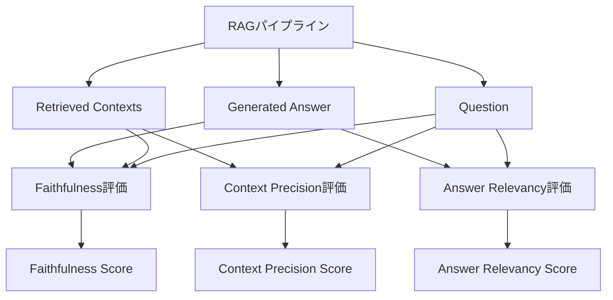

本記事は [RAGAS: Automated Evaluation of Retrieval Augmented Generation (arXiv:2309.01431)](https://arxiv.org/abs/2309.01431) の解説記事です。

## 論文概要（Abstract）

RAGASは、Retrieval-Augmented Generation（RAG）パイプラインを**参照回答なし（reference-free）**で自動評価するフレームワークである。著者らは、Faithfulness（忠実度）、Answer Relevancy（回答関連度）、Context Precision（コンテキスト精度）の3つの指標を提案し、LLM自身を判定器として活用することで、人手によるアノテーションなしにRAGシステムの品質を定量化する手法を示している。

この記事は [Zenn記事: Arize PhoenixでRAG評価基盤を構築する実践ガイド](https://zenn.dev/0h_n0/articles/67e450ead4b1ff) の深掘りです。

## 情報源

- **arXiv ID**: 2309.01431
- **URL**: [https://arxiv.org/abs/2309.01431](https://arxiv.org/abs/2309.01431)
- **著者**: Shahul Es, Jithin James, Luis Espinosa-Anke, Steven Schockaert
- **発表年**: 2023
- **分野**: cs.CL（計算言語学）

## 背景と動機（Background & Motivation）

RAGシステムは「検索（Retrieval）」と「生成（Generation）」の2段階で構成されるが、本番環境での品質管理には各段階を個別に評価する仕組みが不可欠である。しかし、従来の評価手法には以下の課題があった。

1. **参照回答の準備コスト**: BLEUやROUGEなどの自動指標はゴールド回答を必要とし、ドメインごとにアノテーションが必要
2. **End-to-End評価の不透明性**: 最終回答だけ見ても、検索と生成のどちらに問題があるかが分からない
3. **人手評価のスケーラビリティ**: 数千件規模のクエリ評価を人手で行うのは現実的でない

著者らはこれらの課題に対して、LLMを判定器として活用する**reference-free**な評価フレームワークを提案した。これにより、ゴールド回答の準備なしに、RAGパイプラインの各段階を個別かつ自動的に評価できる。

## 主要な貢献（Key Contributions）

- **貢献1**: RAGパイプライン専用の3評価指標（Faithfulness・Answer Relevancy・Context Precision）を定義し、それぞれが検索品質と生成品質を独立に測定できることを示した
- **貢献2**: LLMを判定器とするreference-freeな評価パラダイムを提案し、ゴールド回答なしでの自動評価を実現した
- **貢献3**: WikiEvalデータセットでの実験を通じて、提案指標が人間評価と高い相関（Pearson r = 0.83）を持つことを実証した

## 技術的詳細（Technical Details）

### Faithfulness（忠実度）

Faithfulnessは、生成された回答が取得されたコンテキストに基づいているかを評価する指標である。著者らは以下の2ステップで計算する手法を提案している。

**ステップ1: 文の分解**

回答テキストを個々の主張（statements）に分解する。LLMに対して以下のプロンプトを与える:

```
Given a question and answer, create one or more statements
from each sentence in the given answer.
```

**ステップ2: コンテキストとの照合**

各主張がコンテキストから支持されるか（supported）否か（not supported）をLLMが判定する。Faithfulnessスコアは以下の式で計算される:

$$
\text{Faithfulness} = \frac{|S_{\text{supported}}|}{|S_{\text{total}}|}
$$

ここで、
- $S_{\text{supported}}$: コンテキストによって支持される主張の集合
- $S_{\text{total}}$: 回答から抽出されたすべての主張の集合

スコアは0から1の範囲を取り、1に近いほど回答がコンテキストに忠実であることを示す。

### Answer Relevancy（回答関連度）

Answer Relevancyは、生成された回答が質問に対してどの程度関連しているかを評価する。著者らは**逆質問生成**というアプローチを採用している。

**アルゴリズム**:
1. 回答テキストから$n$個の質問を逆生成する
2. 逆生成された各質問と元の質問の埋め込みベクトルを計算する
3. コサイン類似度の平均をスコアとする

$$
\text{AR} = \frac{1}{n} \sum_{i=1}^{n} \cos(\mathbf{e}_{q_{\text{orig}}}, \mathbf{e}_{q_i})
$$

ここで、
- $\mathbf{e}_{q_{\text{orig}}}$: 元の質問の埋め込みベクトル
- $\mathbf{e}_{q_i}$: 逆生成された$i$番目の質問の埋め込みベクトル
- $n$: 逆生成する質問数（論文ではn=3を使用）

この設計により、回答が質問に無関係な情報を含む場合や、質問の一部にしか答えていない場合にスコアが低下する。

### Context Precision（コンテキスト精度）

Context Precisionは、検索されたコンテキスト中の関連情報がどの程度上位に配置されているかを評価する。この指標はnDCG（normalized Discounted Cumulative Gain）に着想を得ている。

$$
\text{Context Precision@K} = \frac{1}{\sum_{k=1}^{K} v_k} \sum_{k=1}^{K} \left( v_k \times \frac{\text{Precision@}k}{k} \right)
$$

ここで、
- $K$: 検索結果の総数
- $v_k$: $k$番目のコンテキストが関連する場合は1、そうでない場合は0
- $\text{Precision@}k$: 上位$k$件中の関連コンテキストの割合

この指標は、関連文書が上位に配置されているほどスコアが高くなる。同じ数の関連文書でも、順位が低いとスコアが低下する。

### 全体アーキテクチャ



### 実装例

```python
from ragas import evaluate
from ragas.metrics import Faithfulness, AnswerRelevancy, ContextPrecision
from datasets import Dataset

def evaluate_rag_pipeline(
    questions: list[str],
    answers: list[str],
    contexts: list[list[str]],
    ground_truths: list[str] | None = None,
) -> dict[str, float]:
    """RAGASを使ったRAGパイプライン評価

    Args:
        questions: 質問リスト
        answers: RAGシステムの回答リスト
        contexts: 各質問に対する検索結果（文書リスト）
        ground_truths: 参照回答（Context Recallの計算に必要、オプション）

    Returns:
        各メトリクスのスコア辞書
    """
    eval_data = {
        "user_input": questions,
        "response": answers,
        "retrieved_contexts": contexts,
    }
    if ground_truths is not None:
        eval_data["reference"] = ground_truths

    dataset = Dataset.from_dict(eval_data)

    metrics = [Faithfulness(), AnswerRelevancy(), ContextPrecision()]

    results = evaluate(dataset=dataset, metrics=metrics)
    return results
```

## 実装のポイント（Implementation）

RAGASの実装で注意すべき点を以下にまとめる。

**LLMコール数の見積もり**: Faithfulnessの計算では、回答中の文の数$\times$2回のLLMコールが必要となる（文の分解に1回、各文の照合に1回）。100件の評価で平均5文/回答の場合、約1,000回のLLMコールが発生する。gpt-4o-miniを使えば$0.5〜$1程度だが、gpt-4oでは$5〜$10に跳ね上がる。

**バッチ処理と並列度**: `evaluate()`の`concurrency`パラメータで並列度を制御できる。デフォルトは16だが、OpenAI APIのrate limitに合わせて調整が必要である。

**モデル選択**: 著者らの実験ではgpt-3.5-turboとgpt-4を使用しているが、2026年現在ではgpt-4o-miniが精度・コストのバランスが良い。ただし、評価モデルを変更するとスコアの絶対値が変動するため、ベースラインとの比較時はモデルを固定する必要がある。

**日本語対応**: RAGASの各指標は英語で設計されているが、LLMの多言語能力により日本語でも動作する。ただし、文の分解精度が英語より低下する可能性があるため、日本語特化のプロンプトカスタマイズが推奨される。

## Production Deployment Guide

### AWS実装パターン（コスト最適化重視）

RAGAS評価パイプラインをAWS上で運用するための構成を示す。

**トラフィック量別の推奨構成**:

| 規模 | 月間評価件数 | 推奨構成 | 月額コスト | 主要サービス |
|------|------------|---------|-----------|------------|
| **Small** | ~1,000件 | Serverless | $80-200 | Lambda + Bedrock + DynamoDB |
| **Medium** | ~10,000件 | Hybrid | $400-1,000 | Lambda + ECS Fargate + ElastiCache |
| **Large** | 100,000件+ | Container | $2,500-6,000 | EKS + Karpenter + EC2 |

**Small構成の詳細**（月額$80-200）:
- **Lambda**: 1GB RAM, 60秒タイムアウト（$25/月）— RAGAS評価は1件あたり5-15秒
- **Bedrock**: Claude 3.5 Haiku（評価LLM）、Prompt Caching有効（$100/月 @1,000件）
- **DynamoDB**: On-Demand、評価結果キャッシュ（$10/月）
- **S3**: 評価ログ・データセット保存（$5/月）
- **CloudWatch**: 基本監視（$5/月）

**Medium構成の詳細**（月額$400-1,000）:
- **ECS Fargate**: 0.5 vCPU, 1GB RAM × 2タスク、バッチ評価用（$120/月）
- **Lambda**: イベントトリガー・オーケストレーション（$30/月）
- **Bedrock**: Claude 3.5 Sonnet（高精度評価）、Batch API活用で50%削減（$500/月）
- **ElastiCache Redis**: 評価結果・埋め込みキャッシュ（$15/月）

**コスト削減テクニック**:
- Bedrock Batch APIで非リアルタイム評価を50%削減
- Prompt Cachingでシステムプロンプト部分を30-90%削減
- DynamoDB TTLで古い評価結果を自動削除しストレージコスト抑制
- Lambda Reserved Concurrencyで突発的なコスト増を防止

**コスト試算の注意事項**:
上記は2026年3月時点のAWS ap-northeast-1（東京）リージョン料金に基づく概算値である。実際のコストはトラフィックパターン、評価あたりのLLMコール数、バースト使用量により変動する。最新料金は [AWS料金計算ツール](https://calculator.aws/) で確認されたい。

### Terraformインフラコード

**Small構成（Serverless）: Lambda + Bedrock + DynamoDB**

```hcl
module "vpc" {
  source  = "terraform-aws-modules/vpc/aws"
  version = "~> 5.0"

  name = "ragas-eval-vpc"
  cidr = "10.0.0.0/16"
  azs  = ["ap-northeast-1a", "ap-northeast-1c"]
  private_subnets = ["10.0.1.0/24", "10.0.2.0/24"]

  enable_nat_gateway   = false
  enable_dns_hostnames = true
}

resource "aws_iam_role" "lambda_ragas" {
  name = "lambda-ragas-eval-role"

  assume_role_policy = jsonencode({
    Version = "2012-10-17"
    Statement = [{
      Action = "sts:AssumeRole"
      Effect = "Allow"
      Principal = { Service = "lambda.amazonaws.com" }
    }]
  })
}

resource "aws_iam_role_policy" "bedrock_invoke" {
  role = aws_iam_role.lambda_ragas.id

  policy = jsonencode({
    Version = "2012-10-17"
    Statement = [{
      Effect   = "Allow"
      Action   = ["bedrock:InvokeModel", "bedrock:InvokeModelWithResponseStream"]
      Resource = "arn:aws:bedrock:ap-northeast-1::foundation-model/anthropic.claude-3-5-haiku*"
    }]
  })
}

resource "aws_lambda_function" "ragas_eval" {
  filename      = "ragas_eval.zip"
  function_name = "ragas-evaluation-handler"
  role          = aws_iam_role.lambda_ragas.arn
  handler       = "index.handler"
  runtime       = "python3.12"
  timeout       = 120
  memory_size   = 1024

  environment {
    variables = {
      BEDROCK_MODEL_ID   = "anthropic.claude-3-5-haiku-20241022-v1:0"
      DYNAMODB_TABLE     = aws_dynamodb_table.eval_cache.name
      EVALUATION_METRICS = "faithfulness,answer_relevancy,context_precision"
    }
  }
}

resource "aws_dynamodb_table" "eval_cache" {
  name         = "ragas-eval-cache"
  billing_mode = "PAY_PER_REQUEST"
  hash_key     = "eval_hash"

  attribute {
    name = "eval_hash"
    type = "S"
  }

  ttl {
    attribute_name = "expire_at"
    enabled        = true
  }
}

resource "aws_cloudwatch_metric_alarm" "eval_cost" {
  alarm_name          = "ragas-eval-cost-spike"
  comparison_operator = "GreaterThanThreshold"
  evaluation_periods  = 1
  metric_name         = "Duration"
  namespace           = "AWS/Lambda"
  period              = 3600
  statistic           = "Sum"
  threshold           = 300000
  alarm_description   = "RAGAS評価Lambda実行時間異常（コスト急増の可能性）"

  dimensions = {
    FunctionName = aws_lambda_function.ragas_eval.function_name
  }
}
```

### セキュリティベストプラクティス

- **IAMロール**: Bedrock InvokeModelのみ許可（最小権限）
- **ネットワーク**: Lambda VPC内配置、パブリックアクセス不可
- **シークレット管理**: APIキーはSecrets Manager経由、環境変数ハードコード禁止
- **暗号化**: DynamoDB・S3はKMS暗号化、転送中はTLS 1.2以上

### 運用・監視設定

**CloudWatch Logs Insights クエリ**:

```sql
fields @timestamp, metric_name, score, eval_duration_ms
| stats avg(score) as avg_score, pct(eval_duration_ms, 95) as p95_latency by bin(1h), metric_name
| filter metric_name in ["faithfulness", "answer_relevancy", "context_precision"]
```

**CloudWatch アラーム**:

```python
import boto3

cloudwatch = boto3.client('cloudwatch')

cloudwatch.put_metric_alarm(
    AlarmName='ragas-faithfulness-degradation',
    ComparisonOperator='LessThanThreshold',
    EvaluationPeriods=3,
    MetricName='FaithfulnessScore',
    Namespace='RAGEvaluation',
    Period=3600,
    Statistic='Average',
    Threshold=0.80,
    AlarmDescription='Faithfulnessスコア平均が0.80を下回った（3時間連続）'
)
```

### コスト最適化チェックリスト

**アーキテクチャ選択**:
- [ ] ~1,000件/月 → Lambda + Bedrock（Serverless）$80-200/月
- [ ] ~10,000件/月 → ECS Fargate + Bedrock（Hybrid）$400-1,000/月
- [ ] 100,000件+/月 → EKS + Spot Instances $2,500-6,000/月

**LLMコスト削減**:
- [ ] Bedrock Batch APIで非リアルタイム評価を50%削減
- [ ] Prompt Cachingで30-90%削減（システムプロンプト固定）
- [ ] 評価LLMにClaude 3.5 Haiku使用（$0.25/MTok）
- [ ] max_tokens制限で過剰生成防止

**リソース最適化**:
- [ ] Lambda: メモリ1024MB（CloudWatch Insights分析で調整）
- [ ] DynamoDB: On-Demand（低トラフィック時最適）
- [ ] S3: ライフサイクルポリシー（90日でGlacier移行）

**監視・アラート**:
- [ ] AWS Budgets: 月額予算設定（80%で警告）
- [ ] CloudWatch: Faithfulnessスコア劣化検知
- [ ] Cost Anomaly Detection: 自動異常検知
- [ ] 日次コストレポート: SNS/Slack通知

## 実験結果（Results）

著者らはWikiEvalデータセット（50サンプル）を用いて、提案指標と人間評価の相関を検証している。

**人間評価との相関（論文Table 1より）**:

| メトリクス | Pearson r | Spearman ρ |
|-----------|-----------|------------|
| Faithfulness | 0.83 | — |
| Answer Relevancy | — | 高相関（具体値は論文参照） |
| Context Precision | — | 高相関（具体値は論文参照） |

著者らは、Faithfulnessにおいて人間評価者との相関がPearson r = 0.83と高い値を示したと報告している。これは、LLMを判定器とする手法が人手評価と概ね一致する判断を下せることを示唆している。

**制約として著者らが指摘している点**:
- WikiEvalは50サンプルと小規模であり、大規模データでの相関は未確認
- 英語中心の評価であり、多言語での検証は行われていない
- 判定LLMの変更（gpt-3.5-turbo → gpt-4等）によりスコアの絶対値が変動する

## 実運用への応用（Practical Applications）

RAGASは、Zenn記事で紹介されているArize Phoenixと組み合わせることで、トレーシング+評価の統合基盤を構築できる。具体的には以下のユースケースが考えられる。

**CI/CDパイプラインへの組み込み**: RAGシステムのデプロイ前にRAGASで品質ゲートを設置し、Faithfulness > 0.85、Context Precision > 0.80を満たさない場合はデプロイをブロックする。

**定期バッチ評価**: 本番環境のトレースデータからサンプリングし、1日1回のバッチ評価を実行する。PhoenixのSpanEvaluationsとして記録すれば、ダッシュボードで時系列推移を確認できる。

**A/Bテスト**: プロンプト変更やチャンク戦略の変更時に、同一データセットで旧版・新版のRAGASスコアを比較する。PhoenixのExperiments機能との連携が有効。

**スケーリングの考慮**: 大規模評価（10,000件以上）ではLLMコストがボトルネックとなるため、層化サンプリング（10-20%）でコストを管理しつつ統計的に有意な評価を実現する。

## 関連研究（Related Work）

- **ARES (2401.15391)**: LLMジャッジとベイズ推定を組み合わせたRAG評価フレームワーク。RAGASと異なり、少量のラベルデータから信頼区間付きのスコア推定を行う。RAGASがpoint estimateを返すのに対し、ARESは不確実性を明示する点で補完的
- **FActScore (2307.14100)**: 長文テキストを原子的事実に分解し、知識ベースと照合して事実精度を計算する手法。RAGASのFaithfulnessがコンテキストとの整合性を見るのに対し、FActScoreは外部知識ベースとの整合性を見る
- **SelfCheckGPT (2303.08896)**: 複数サンプル生成の一貫性から幻覚を検出する手法。外部知識不要という点でRAGASのreference-freeアプローチと思想が共通

## まとめと今後の展望

RAGASは、RAGパイプラインの品質を参照回答なしで定量評価できるフレームワークとして、実務での導入障壁が低い。Faithfulness・Answer Relevancy・Context Precisionの3軸により、検索と生成のどちらに問題があるかを区別できる点が特に実用的である。

一方で、50サンプルでの検証にとどまっている点、LLMの判定バイアス（position bias等）への対策が不十分な点は今後の課題である。RAGASはv0.2以降でクラスベースAPIに移行しており、APIの変化が速い点にも注意が必要である。

## 参考文献

- **arXiv**: [https://arxiv.org/abs/2309.01431](https://arxiv.org/abs/2309.01431)
- **Code**: [https://github.com/explodinggradients/ragas](https://github.com/explodinggradients/ragas)（MIT License）
- **PyPI**: [https://pypi.org/project/ragas/](https://pypi.org/project/ragas/)
- **Related Zenn article**: [https://zenn.dev/0h_n0/articles/67e450ead4b1ff](https://zenn.dev/0h_n0/articles/67e450ead4b1ff)
