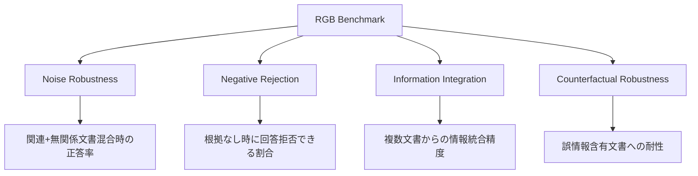

本記事は [Benchmarking Large Language Models in Retrieval-Augmented Generation (arXiv:2312.10997)](https://arxiv.org/abs/2312.10997) の解説記事です。

## 論文概要（Abstract）

RGB（Retrieval-Augmented Generation Benchmark）は、RAGシステムに必要な4つの基本能力を体系的に評価するベンチマークである。著者らは、Noise Robustness（ノイズ耐性）、Negative Rejection（否定的拒否）、Information Integration（情報統合）、Counterfactual Robustness（反事実耐性）の4軸を定義し、ChatGPT・GPT-4・Llama-2・ChatGLM等8モデルを評価している。その結果、全モデルで反事実耐性が最大の弱点であることが明らかになっている。

この記事は [Zenn記事: Arize PhoenixでRAG評価基盤を構築する実践ガイド](https://zenn.dev/0h_n0/articles/67e450ead4b1ff) の深掘りです。

## 情報源

- **arXiv ID**: 2312.10997
- **URL**: [https://arxiv.org/abs/2312.10997](https://arxiv.org/abs/2312.10997)
- **著者**: Jiawei Chen, Hongyu Lin, Xianpei Han, Le Sun
- **発表年**: 2023
- **分野**: cs.CL（計算言語学）

## 背景と動機（Background & Motivation）

RAGシステムは外部知識を検索してLLMに注入するが、検索結果は常に完璧ではない。実運用では以下のような問題が日常的に発生する。

1. **ノイズ文書の混入**: 検索結果に無関係な文書が含まれる
2. **回答不能な質問**: 検索結果に根拠がないにもかかわらず、LLMが回答を生成してしまう
3. **情報の分散**: 回答に必要な情報が複数文書に分散している
4. **誤情報の混入**: 検索結果に事実と異なる情報が含まれる

従来のRAG評価は最終回答の正確性のみに焦点を当てており、これらの個別能力を診断する手段が欠如していた。著者らはこのギャップを埋めるために、4能力を個別に測定可能なベンチマークを設計した。

## 主要な貢献（Key Contributions）

- **貢献1**: RAGに必要な4つの基本能力（Noise Robustness・Negative Rejection・Information Integration・Counterfactual Robustness）を定義し、それぞれを独立に評価する手法を提案
- **貢献2**: 中英バイリンガルのベンチマークデータセットを構築し、公開（GitHub: chen700564/RGB）
- **貢献3**: 8つの主要LLMの4能力を系統的に比較し、反事実耐性が全モデル共通の弱点であることを実証

## 技術的詳細（Technical Details）

### 4能力の定義と評価設計



### Noise Robustness（ノイズ耐性）

ノイズ耐性は、検索結果に無関係な文書が混入した場合でも正しい回答を生成できるかを評価する。

**評価手順**:
1. 正解を含む関連文書（1件）を用意
2. BM25で取得した無関係文書（ノイズ）を0〜10件追加
3. ノイズ文書数を変化させて正答率を測定

$$
\text{Noise Robustness}(n) = \frac{\text{正解数}(n)}{\text{全質問数}}
$$

ここで$n$はノイズ文書の数である。著者らの報告によると、GPT-4でもノイズ文書が10件を超えると正答率が大幅に低下する。

### Negative Rejection（否定的拒否）

否定的拒否は、検索結果に回答の根拠がない場合に「回答できない」と適切に拒否できるかを評価する。

**評価手順**:
1. 質問に対して意図的に無関係な文書のみを検索結果として提供
2. LLMが「情報が不十分」「回答できない」等の拒否応答を返すかを判定

$$
\text{Rejection Rate} = \frac{\text{適切に拒否した回数}}{\text{根拠なし質問の総数}}
$$

著者らの報告によると、GPT-4でさえ約40%強しか適切に拒否できず、残りは根拠のない回答を生成してしまう。これはRAGシステムにおける幻覚の主要な発生源の一つである。

### Information Integration（情報統合）

情報統合は、回答に必要な情報が複数の文書に分散している場合に、それらを正しく統合できるかを評価する。

**評価手順**:
1. 回答に2つ以上の情報片が必要な質問を用意
2. 各情報片を別々の文書に配置
3. LLMが全情報片を統合した正しい回答を生成できるかを測定

### Counterfactual Robustness（反事実耐性）

反事実耐性は、検索結果に事実と異なる情報（反事実）が含まれる場合に、それに引きずられずに正しい判断ができるかを評価する。

**評価手順**:
1. 質問に関連するが、事実を改変した偽文書を検索結果に混入
2. LLMが偽情報を鵜呑みにせず、内部知識や他の情報源と照合して正しい回答を返せるかを測定

著者らの報告によると、全モデルでこの能力が最も低く、外部から注入された誤情報に対する脆弱性がRAGシステムの根本的な課題であることが示されている。

### 評価指標

著者らは以下の2つの主要指標で評価を行っている。

**Accuracy（正答率）**: 最終回答が正解と一致するかを文字列マッチングとLLM判定の2段階で評価する。

**Rejection Rate（拒否率）**: Negative Rejectionテストにおいて、適切に回答を拒否した割合を測定する。

## 実装のポイント（Implementation）

RGBベンチマークを自社RAGシステムの診断に活用する際の実践的な注意点を述べる。

**データセットの構築**: RGBのデータはNatural Questions、TriviaQA等の既存QAデータセットをベースにしている。自社ドメインで同様のベンチマークを構築する場合は、以下の手順で作成できる。

```python
import random
from dataclasses import dataclass

@dataclass
class RGBTestCase:
    """RGB形式のテストケース"""
    question: str
    gold_answer: str
    relevant_docs: list[str]
    noise_docs: list[str]
    counterfactual_docs: list[str]

def create_noise_robustness_test(
    question: str,
    gold_answer: str,
    relevant_doc: str,
    noise_pool: list[str],
    noise_counts: list[int] = [0, 2, 4, 6, 8, 10],
) -> list[dict]:
    """ノイズ耐性テストケースを生成

    Args:
        question: 質問テキスト
        gold_answer: 正解テキスト
        relevant_doc: 関連文書
        noise_pool: ノイズ文書のプール
        noise_counts: テストするノイズ文書数のリスト

    Returns:
        各ノイズレベルのテストケース
    """
    test_cases = []
    for n in noise_counts:
        noise_docs = random.sample(noise_pool, min(n, len(noise_pool)))
        context = [relevant_doc] + noise_docs
        random.shuffle(context)
        test_cases.append({
            "question": question,
            "gold_answer": gold_answer,
            "context": context,
            "noise_count": n,
        })
    return test_cases
```

**PhoenixのExperiments機能との連携**: RGBの4能力テストをPhoenixのExperimentsとして登録し、モデル変更やプロンプト改善の効果を定量比較できる。各能力のスコアをPhoenixのカスタムメトリクスとして記録すれば、ダッシュボードで時系列推移を監視可能である。

**ノイズ文書の作成**: BM25検索で取得した文書は、クエリと表面的に似ているが回答の根拠にならない文書であり、実運用でのノイズを模擬するのに適している。Elasticsearchやwhooshを使って自社データからノイズプールを構築できる。

## Production Deployment Guide

### AWS実装パターン（コスト最適化重視）

RGBベンチマークに基づくRAG品質診断パイプラインのAWS構成を示す。

| 規模 | 月間テスト件数 | 推奨構成 | 月額コスト | 主要サービス |
|------|------------|---------|-----------|------------|
| **Small** | ~500件 | Serverless | $50-120 | Lambda + Bedrock + S3 |
| **Medium** | ~5,000件 | Hybrid | $250-600 | Step Functions + Lambda + Bedrock |
| **Large** | 50,000件+ | Container | $1,500-4,000 | ECS + Bedrock Batch |

**Small構成の詳細**（月額$50-120）:
- **Lambda**: テスト実行（$15/月）、4能力テストを順次実行
- **Bedrock**: Claude 3.5 Haiku（$60/月 @500件 × 4テスト）
- **S3**: テスト結果・データセット保存（$5/月）
- **Step Functions**: テストオーケストレーション（$5/月）

**コスト削減テクニック**:
- 4能力テストを毎回全件実行せず、変更のあった能力のみ再テスト
- Bedrock Batch APIで非リアルタイム評価を50%削減
- テストデータセットのサンプリング（層化抽出で代表性を確保）

**コスト試算の注意事項**: 上記は2026年3月時点のAWS ap-northeast-1料金に基づく概算値。最新料金は [AWS料金計算ツール](https://calculator.aws/) で確認されたい。

### Terraformインフラコード

```hcl
resource "aws_sfn_state_machine" "rgb_benchmark" {
  name     = "rgb-benchmark-pipeline"
  role_arn = aws_iam_role.sfn_role.arn

  definition = jsonencode({
    Comment = "RGB Benchmark Pipeline: 4-ability RAG evaluation"
    StartAt = "NoiseRobustnessTest"
    States = {
      NoiseRobustnessTest = {
        Type     = "Task"
        Resource = aws_lambda_function.rgb_test.arn
        Parameters = { "test_type" = "noise_robustness" }
        Next     = "NegativeRejectionTest"
      }
      NegativeRejectionTest = {
        Type     = "Task"
        Resource = aws_lambda_function.rgb_test.arn
        Parameters = { "test_type" = "negative_rejection" }
        Next     = "InformationIntegrationTest"
      }
      InformationIntegrationTest = {
        Type     = "Task"
        Resource = aws_lambda_function.rgb_test.arn
        Parameters = { "test_type" = "information_integration" }
        Next     = "CounterfactualRobustnessTest"
      }
      CounterfactualRobustnessTest = {
        Type     = "Task"
        Resource = aws_lambda_function.rgb_test.arn
        Parameters = { "test_type" = "counterfactual_robustness" }
        End      = true
      }
    }
  })
}

resource "aws_lambda_function" "rgb_test" {
  filename      = "rgb_test.zip"
  function_name = "rgb-benchmark-test"
  role          = aws_iam_role.lambda_rgb.arn
  handler       = "index.handler"
  runtime       = "python3.12"
  timeout       = 300
  memory_size   = 1024

  environment {
    variables = {
      BEDROCK_MODEL_ID = "anthropic.claude-3-5-haiku-20241022-v1:0"
      S3_BUCKET        = aws_s3_bucket.rgb_results.id
    }
  }
}

resource "aws_s3_bucket" "rgb_results" {
  bucket = "rgb-benchmark-results"
}
```

### コスト最適化チェックリスト

**テスト戦略**:
- [ ] 変更影響がある能力のみ再テスト（全4能力毎回実行を回避）
- [ ] テストデータの層化サンプリング（20%で統計的に有意な評価）
- [ ] 週次バッチ実行（日次→週次でコスト80%削減）

**LLMコスト削減**:
- [ ] Bedrock Batch APIで50%削減
- [ ] Claude 3.5 Haiku使用（$0.25/MTok）
- [ ] 回答長制限（max_tokens=200で十分）

**監視・アラート**:
- [ ] 各能力スコアの閾値アラート設定
- [ ] AWS Budgets月額予算設定
- [ ] 週次レポート自動生成

## 実験結果（Results）

著者らの実験から以下の結果が報告されている。

**モデル別4能力評価（論文の報告に基づく傾向）**:

| 能力 | GPT-4 | ChatGPT | Llama-2-70B |
|------|-------|---------|-------------|
| Noise Robustness | 高 | 中 | 中-低 |
| Negative Rejection | 中（~40%拒否） | 低 | 低 |
| Information Integration | 高 | 中 | 中 |
| Counterfactual Robustness | 低 | 低 | 低 |

著者らが特に注目しているのは以下の2点である。

1. **反事実耐性の普遍的な低さ**: GPT-4を含む全モデルで反事実耐性が最低スコアとなっており、外部から注入された誤情報に対する脆弱性はモデルサイズに依存しない根本的な課題である
2. **否定的拒否の困難さ**: GPT-4でさえ約40%強しか適切に拒否できず、「分からない」と答える能力の向上が実用上の重要課題である

## 実運用への応用（Practical Applications）

RGBの4能力フレームワークは、Zenn記事で紹介されているPhoenixの評価基盤に直接適用できる。

**品質ダッシュボードの設計**: Phoenixのダッシュボードに4能力のレーダーチャートを配置し、RAGシステムの強み・弱みを一目で把握可能にする。

**回帰テスト**: プロンプト変更やモデルアップグレード時に、4能力すべてが劣化していないことを自動検証するCI/CDゲートとして活用できる。

**弱点特定と改善**: 例えばNegative Rejectionが低い場合は、プロンプトに「コンテキストに情報がない場合は『分かりません』と回答してください」を追加するなど、能力別の改善策を適用し、その効果をRGBスコアで定量評価できる。

## 関連研究（Related Work）

- **RAGAS (2309.01431)**: RAGパイプラインの品質をFaithfulness・Answer Relevancy・Context Precisionの3軸で自動評価するフレームワーク。RGBが「何が失敗するか」を診断するのに対し、RAGASは「どの程度良いか」を測定する点で補完的
- **RAGTruth (ACL 2024)**: RAGの幻覚を単語レベルでアノテーションしたコーパス。RGBのCounterfactual Robustnessテストで検出される幻覚の詳細分類を提供する
- **RECALL (2309.15217)**: RAGにおける反事実知識への耐性に特化したベンチマーク。RGBのCounterfactual Robustnessと同じ課題を扱うが、より細粒度の実験設計を提供

## まとめと今後の展望

RGBは、RAGシステムの品質を「ノイズ耐性」「否定的拒否」「情報統合」「反事実耐性」の4軸で診断する体系的なベンチマークである。特に、全モデルで反事実耐性が最大の弱点であるという知見は、RAGシステムの信頼性向上に向けた研究・開発の方向性を示している。

2023年時点のモデル（GPT-4, Llama-2等）での評価に基づいているため、最新モデル（GPT-4o, Claude 3.5等）での再評価が今後の課題である。また、日本語での評価は中国語・英語に比べて限定的であり、日本語RAGシステムの評価には追加のデータ構築が必要となる。

## 参考文献

- **arXiv**: [https://arxiv.org/abs/2312.10997](https://arxiv.org/abs/2312.10997)
- **Code**: [https://github.com/chen700564/RGB](https://github.com/chen700564/RGB)
- **Related Zenn article**: [https://zenn.dev/0h_n0/articles/67e450ead4b1ff](https://zenn.dev/0h_n0/articles/67e450ead4b1ff)
