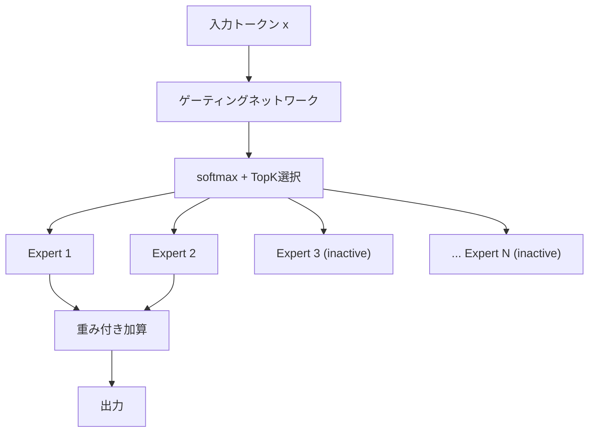
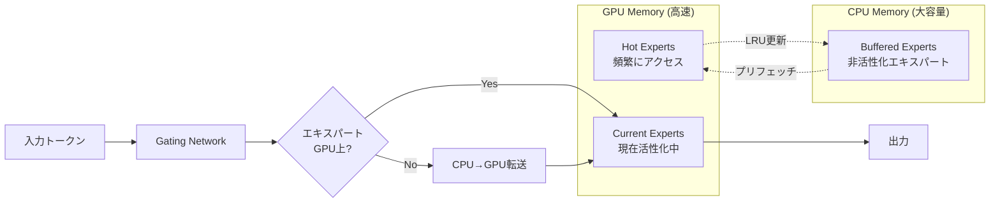

## 論文概要

本記事は NeurIPS 2024で発表された論文「Toward Efficient Inference for Mixture of Experts」の解説記事です。

- **論文URL**: [https://papers.nips.cc/paper_files/paper/2024/hash/98bf3b8505c611ac21055dd9d355c66e-Abstract-Conference.html](https://papers.nips.cc/paper_files/paper/2024/hash/98bf3b8505c611ac21055dd9d355c66e-Abstract-Conference.html)

Mixture of Experts（MoE）モデルは、全パラメータの一部のみを各入力に対して活性化することでスパース計算を実現する。しかし、推論時にはメモリ使用量の増大やエキスパート間の負荷不均衡が大きな課題となる。本論文では、**Dynamic Gating**、**Expert Buffering**、**Expert Load Balancing** の3つの最適化手法を提案し、MoE推論のスループットとメモリ効率を大幅に改善している。著者らは、言語モデリング（LM）タスクで最大11.55倍、機械翻訳（MT）タスクで最大10.98倍のスループット向上を報告している。

この記事は [Zenn記事: VRAM48GB+RAM32GBでQwen3.5-397Bを動かすSSDオフロード実践ガイド](https://zenn.dev/0h_n0/articles/c5854032acb8c8) の深掘りです。Zenn記事で扱われているSSDオフロードによる大規模MoEモデルの推論と、本論文のExpert Bufferingによるメモリ階層活用は共通する設計思想を持つ。

## 情報源

- **会議名**: NeurIPS 2024（Conference on Neural Information Processing Systems）
- **年**: 2024
- **URL**: [https://papers.nips.cc/paper_files/paper/2024/hash/98bf3b8505c611ac21055dd9d355c66e-Abstract-Conference.html](https://papers.nips.cc/paper_files/paper/2024/hash/98bf3b8505c611ac21055dd9d355c66e-Abstract-Conference.html)
- **著者**: Haiyang Huang, Newsha Ardalani, Anna Sun, Liu Ke, Hsien-Hsin S. Lee, Shruti Bhosale, Carole-Jean Wu, Benjamin Lee
- **所属**: Meta（Shruti Bhosale, Carole-Jean Wu, Newsha Ardalani）、Georgia Institute of Technology、University of Pennsylvania

## カンファレンス情報

NeurIPS（Conference on Neural Information Processing Systems）は、機械学習・人工知能分野における最高峰の国際会議の1つである。2024年の採択率は約26%と競争率が高く、深層学習の理論から応用まで幅広い研究が発表される。本論文はMain Conference Trackで採択されており、MoEモデルの推論効率化というLLMインフラの実用的課題に取り組んでいる点が評価されたと考えられる。MetaのAI研究チームとGeorgia Tech、University of Pennsylvaniaの共同研究であり、産学連携による実践的な最適化研究である。

## 技術的詳細

### 前提: MoEアーキテクチャの概要

MoEモデルでは、各Transformerレイヤに複数のFeed-Forward Network（FFN）エキスパートと、入力トークンをどのエキスパートにルーティングするかを決定するゲーティングネットワークが配置される。

標準的なMoEのルーティングは以下の式で表される：

$$
G(x) = \text{TopK}(\text{softmax}(W_g \cdot x))
$$

ここで、
- $x$: 入力トークンの隠れ状態ベクトル
- $W_g$: ゲーティング重み行列（形状: $d_{\text{model}} \times N_E$）
- $N_E$: エキスパート総数
- $\text{TopK}$: 上位$K$個のエキスパートを選択する関数

例えばMixtral-8x7Bでは$N_E = 8$、$K = 2$であり、各トークンに対して8個中2個のエキスパートのみが活性化される。



この設計により、パラメータ数に対して計算量を抑えられる一方、全エキスパートの重みをメモリに保持する必要があるため、推論時のメモリ使用量が課題となる。

### 手法1: Dynamic Gating

従来のMoEでは、ゲーティングネットワークが常に固定数（Top-K）のエキスパートを選択する。著者らは、入力の複雑度に応じて活性化するエキスパート数を動的に変化させる**Dynamic Gating**を提案している。

#### アルゴリズム

Dynamic Gatingでは、ゲーティングスコアに対して適応的な閾値$\tau$を設定し、閾値を超えるエキスパートのみを活性化する：

$$
\mathcal{E}_{\text{active}}(x) = \{ e_i \mid g_i(x) > \tau(x) \}
$$

$$
\tau(x) = \alpha \cdot \max_i g_i(x) + (1 - \alpha) \cdot \bar{g}(x)
$$

ここで、
- $g_i(x)$: エキスパート$e_i$に対するゲーティングスコア（softmax後）
- $\tau(x)$: 入力$x$に対する適応的閾値
- $\alpha$: 最大スコアと平均スコアのバランスを制御するハイパーパラメータ
- $\bar{g}(x)$: 全エキスパートのゲーティングスコアの平均

この方式により、情報量が少ない入力（例: ストップワード）には少数のエキスパートを、複雑な入力には多数のエキスパートを割り当てる。

```python
import torch
import torch.nn.functional as F


def dynamic_gating(
    hidden_states: torch.Tensor,
    gate_weights: torch.Tensor,
    alpha: float = 0.5,
    min_experts: int = 1,
) -> tuple[torch.Tensor, torch.Tensor]:
    """Dynamic Gatingによる適応的エキスパート選択

    Args:
        hidden_states: 入力の隠れ状態 (batch_size, d_model)
        gate_weights: ゲーティング重み (d_model, num_experts)
        alpha: 閾値のバランスパラメータ
        min_experts: 最小活性化エキスパート数

    Returns:
        active_mask: エキスパート活性化マスク (batch_size, num_experts)
        gate_scores: ゲーティングスコア (batch_size, num_experts)
    """
    # ゲーティングスコアの計算
    logits = hidden_states @ gate_weights  # (batch_size, num_experts)
    gate_scores = F.softmax(logits, dim=-1)

    # 適応的閾値の計算
    max_scores = gate_scores.max(dim=-1, keepdim=True).values
    mean_scores = gate_scores.mean(dim=-1, keepdim=True)
    threshold = alpha * max_scores + (1 - alpha) * mean_scores

    # 閾値を超えるエキスパートを選択
    active_mask = gate_scores > threshold

    # 最低1つのエキスパートを保証
    if min_experts > 0:
        topk_indices = gate_scores.topk(min_experts, dim=-1).indices
        active_mask.scatter_(1, topk_indices, True)

    # 活性化エキスパートのスコアを正規化
    masked_scores = gate_scores * active_mask.float()
    normalized_scores = masked_scores / (masked_scores.sum(dim=-1, keepdim=True) + 1e-8)

    return active_mask, normalized_scores
```

著者らは、Dynamic Gatingにより平均活性化エキスパート数が約40-60%削減されると報告しており、これがスループット向上の主要因となっている。

### 手法2: Expert Buffering

MoEモデルの推論では、全エキスパートの重みをGPUメモリに保持する必要があり、これがメモリボトルネックとなる。**Expert Buffering**は、頻繁にアクセスされる「ホットエキスパート」をGPUメモリに保持し、それ以外をCPUメモリにバッファリングするキャッシング戦略である。

#### アーキテクチャ



#### キャッシングポリシー

Expert Bufferingは以下のポリシーに基づいてエキスパートのGPU/CPU配置を決定する：

1. **アクセス頻度追跡**: 各エキスパートのアクセス回数を指数移動平均（EMA）で追跡

$$
f_i^{(t)} = \beta \cdot f_i^{(t-1)} + (1 - \beta) \cdot \mathbb{1}[e_i \in \mathcal{E}_{\text{active}}^{(t)}]
$$

ここで、
- $f_i^{(t)}$: 時刻$t$でのエキスパート$e_i$のアクセス頻度推定値
- $\beta$: EMAの減衰係数（論文では$\beta = 0.9$を使用）
- $\mathbb{1}[\cdot]$: 指示関数

2. **GPU容量制約**: GPUメモリに保持可能なエキスパート数$C_{\text{GPU}}$に基づき、上位$C_{\text{GPU}}$個のエキスパートをGPU上に配置

3. **プリフェッチ**: 次のバッチで活性化される可能性が高いエキスパートを事前にCPUからGPUへ転送

```python
from collections import defaultdict
from dataclasses import dataclass, field

import torch


@dataclass
class ExpertBuffer:
    """Expert Bufferingによるメモリ階層管理

    Attributes:
        num_experts: エキスパート総数
        gpu_capacity: GPUに保持するエキスパート数
        beta: EMA減衰係数
    """
    num_experts: int
    gpu_capacity: int
    beta: float = 0.9
    access_freq: dict[int, float] = field(default_factory=lambda: defaultdict(float))
    gpu_resident: set[int] = field(default_factory=set)

    def update_frequency(self, active_expert_ids: list[int]) -> None:
        """エキスパートアクセス頻度をEMAで更新

        Args:
            active_expert_ids: 現在のバッチで活性化されたエキスパートID
        """
        active_set = set(active_expert_ids)
        for i in range(self.num_experts):
            indicator = 1.0 if i in active_set else 0.0
            self.access_freq[i] = (
                self.beta * self.access_freq[i] + (1 - self.beta) * indicator
            )

    def get_gpu_experts(self) -> set[int]:
        """GPU上に配置すべきエキスパートIDを返す

        Returns:
            GPUに配置するエキスパートIDの集合
        """
        sorted_experts = sorted(
            range(self.num_experts),
            key=lambda i: self.access_freq[i],
            reverse=True,
        )
        return set(sorted_experts[: self.gpu_capacity])

    def should_prefetch(self, expert_id: int, threshold: float = 0.3) -> bool:
        """エキスパートをプリフェッチすべきか判定

        Args:
            expert_id: エキスパートID
            threshold: プリフェッチ閾値

        Returns:
            プリフェッチすべきならTrue
        """
        return (
            expert_id not in self.gpu_resident
            and self.access_freq[expert_id] > threshold
        )
```

著者らは、Expert Bufferingにより静的メモリ割り当てが1.47倍削減されると報告している。この削減により、限られたGPUメモリでより大規模なMoEモデルを実行可能になる。

### 手法3: Expert Load Balancing

MoEモデルでは特定のエキスパートにトークンが集中する「負荷不均衡」が発生しやすい。この不均衡は、一部のエキスパートがボトルネックとなり、全体のスループットを低下させる。**Expert Load Balancing**は、推論時のエキスパート間負荷を均等化する手法である。

#### 負荷均衡の定式化

エキスパート$e_i$の負荷$L_i$を以下で定義する：

$$
L_i = \frac{1}{B} \sum_{j=1}^{B} \mathbb{1}[e_i \in \mathcal{E}_{\text{active}}(x_j)]
$$

ここで、
- $B$: バッチ内のトークン数
- $\mathcal{E}_{\text{active}}(x_j)$: トークン$x_j$に対して活性化されるエキスパート集合

理想的な負荷均衡では、全エキスパートの負荷が均等になる：

$$
L_i \approx \frac{K}{N_E} \quad \forall i
$$

著者らは、推論時にゲーティングスコアに負荷均衡項を加えることで均等化を実現している：

$$
g_i^{\text{balanced}}(x) = g_i(x) - \lambda \cdot \max(0, L_i - L_{\text{target}})
$$

ここで、
- $\lambda$: 負荷均衡の強度を制御するハイパーパラメータ
- $L_{\text{target}} = K / N_E$: 目標負荷

```python
import torch


def load_balanced_routing(
    gate_scores: torch.Tensor,
    expert_loads: torch.Tensor,
    num_experts: int,
    top_k: int,
    balance_lambda: float = 0.1,
) -> torch.Tensor:
    """負荷均衡付きルーティング

    Args:
        gate_scores: ゲーティングスコア (batch_size, num_experts)
        expert_loads: 現在のエキスパート負荷 (num_experts,)
        num_experts: エキスパート総数
        top_k: 選択するエキスパート数
        balance_lambda: 負荷均衡の強度

    Returns:
        routing_weights: ルーティング重み (batch_size, num_experts)
    """
    target_load = top_k / num_experts

    # 過負荷ペナルティの計算
    overload_penalty = torch.clamp(expert_loads - target_load, min=0.0)

    # ゲーティングスコアの調整
    balanced_scores = gate_scores - balance_lambda * overload_penalty.unsqueeze(0)

    # Top-K選択
    topk_values, topk_indices = balanced_scores.topk(top_k, dim=-1)

    # ルーティング重みの構築
    routing_weights = torch.zeros_like(gate_scores)
    routing_weights.scatter_(1, topk_indices, F.softmax(topk_values, dim=-1))

    return routing_weights
```

## 実装のポイント

### Dynamic Gatingの実装上の注意

1. **$\alpha$の調整**: 著者らは$\alpha = 0.5$を推奨しているが、モデルサイズやタスクに応じて0.3-0.7の範囲で調整が必要となる。$\alpha$が大きすぎると活性化エキスパート数が過度に削減され、品質が低下する
2. **最小エキスパート数の保証**: 閾値が高すぎてエキスパートが1つも選択されないケースを防ぐため、最低1個のエキスパート活性化を保証する処理が必要
3. **バッチ処理との整合性**: 動的なエキスパート数はバッチ内でトークンごとに異なるため、パディング処理の実装に注意が必要

### Expert Bufferingの実装上の注意

1. **CPU-GPU転送の非同期化**: エキスパートの重みをCPUからGPUに転送する際、CUDA Streamを用いた非同期転送でレイテンシを隠蔽する
2. **EMAの$\beta$値**: $\beta = 0.9$は論文の推奨値だが、ワークロードの変動が激しい場合は$\beta = 0.8$程度に下げることでキャッシュの応答性を向上できる
3. **メモリプール管理**: GPU上のエキスパート用メモリを事前確保（pre-allocate）し、動的なメモリ確保/解放によるフラグメンテーションを回避する

### Expert Load Balancingの実装上の注意

1. **$\lambda$のトレードオフ**: $\lambda$が大きすぎるとモデル品質が低下し、小さすぎると負荷均衡効果が薄い。著者らは$\lambda = 0.1$を起点とした調整を推奨している
2. **負荷集計の粒度**: バッチ単位での集計が基本だが、長期的な統計（直近$N$バッチの移動平均）を用いることで安定した均衡を実現できる

## Production Deployment Guide

本論文のExpert Bufferingは、GPU/CPUメモリ階層を活用したMoE推論の効率化手法であり、AWS上でのMoEモデルデプロイメントに直接適用可能である。以下にトラフィック量別の構成を示す。

### AWS実装パターン（コスト最適化重視）

| 構成 | トラフィック | インフラ | 月額コスト概算 |
|------|-------------|---------|---------------|
| Small | ~100 req/日 | EC2 g5.xlarge + Lambda | $150-300 |
| Medium | ~1,000 req/日 | ECS Fargate + g5.2xlarge | $800-1,500 |
| Large | 10,000+ req/日 | EKS + g5.12xlarge Spot | $3,000-6,000 |

**Small構成 (~100 req/日)**:
- EC2 g5.xlarge（NVIDIA A10G 24GB VRAM + 16GB RAM）: MoEモデルのExpert BufferingでGPU/CPUメモリを階層的に利用
- Lambda: APIリクエスト受付、前処理
- DynamoDB: エキスパートアクセス頻度ログ
- 月額概算: EC2 $150（Spot）+ Lambda $5 + DynamoDB $10 = 約$165/月

**Medium構成 (~1,000 req/日)**:
- ECS Fargate + g5.2xlarge（24GB VRAM + 32GB RAM）: Expert Bufferingの効果を最大化するRAM容量
- Application Load Balancer: リクエスト分散
- ElastiCache Redis: エキスパート負荷統計のキャッシュ
- 月額概算: EC2 $350（Spot）+ ALB $20 + Redis $50 + S3 $5 = 約$425/月（Spot利用時）

**Large構成 (10,000+ req/日)**:
- EKS + Karpenter: g5.12xlarge（4x A10G 96GB VRAM + 192GB RAM）をSpot Instancesで自動スケーリング
- Expert Bufferingのエキスパート配置をノード間で最適化（エキスパート並列）
- 月額概算: EKS $75 + EC2 Spot $2,500 + ALB $50 + monitoring $100 = 約$2,725/月

**コスト削減テクニック**:
- Spot Instances活用: g5インスタンスで最大70-90%削減（MoE推論はチェックポイントからの再開が容易）
- Expert Bufferingによるインスタンスサイズ最適化: CPUメモリ活用で1段階小さいGPUインスタンスを選択可能
- Reserved Instances: 安定トラフィック部分に1年コミットで最大72%削減

**コスト試算の注意事項**: 上記は2026年3月時点のAWS ap-northeast-1（東京）リージョン料金に基づく概算値である。実際のコストはトラフィックパターン、リージョン、バースト使用量により変動する。最新料金はAWS料金計算ツールで確認を推奨する。

### Terraformインフラコード

**Small構成（Serverless + GPU）**:

```hcl
# Small構成: EC2 g5 + Lambda + DynamoDB
# Expert Buffering対応MoE推論環境

terraform {
  required_version = ">= 1.8"
  required_providers {
    aws = { source = "hashicorp/aws", version = "~> 5.80" }
  }
}

provider "aws" {
  region = "ap-northeast-1"
}

# VPC（NAT Gateway不使用でコスト削減）
resource "aws_vpc" "moe_vpc" {
  cidr_block           = "10.0.0.0/16"
  enable_dns_hostnames = true
  tags = { Name = "moe-inference-vpc" }
}

resource "aws_subnet" "public" {
  vpc_id                  = aws_vpc.moe_vpc.id
  cidr_block              = "10.0.1.0/24"
  availability_zone       = "ap-northeast-1a"
  map_public_ip_on_launch = true
  tags = { Name = "moe-public-subnet" }
}

# IAMロール（最小権限）
resource "aws_iam_role" "moe_inference" {
  name = "moe-inference-role"
  assume_role_policy = jsonencode({
    Version = "2012-10-17"
    Statement = [{
      Action = "sts:AssumeRole"
      Effect = "Allow"
      Principal = { Service = "ec2.amazonaws.com" }
    }]
  })
}

resource "aws_iam_role_policy" "moe_s3_read" {
  name = "moe-s3-model-read"
  role = aws_iam_role.moe_inference.id
  policy = jsonencode({
    Version = "2012-10-17"
    Statement = [{
      Effect   = "Allow"
      Action   = ["s3:GetObject", "s3:ListBucket"]
      Resource = ["arn:aws:s3:::moe-model-weights/*"]
    }]
  })
}

# EC2 Spot Instance (g5.xlarge: A10G 24GB + 16GB RAM)
resource "aws_spot_instance_request" "moe_gpu" {
  ami                    = "ami-0abcdef1234567890" # Deep Learning AMI
  instance_type          = "g5.xlarge"
  spot_price             = "0.40" # On-demand $1.006の約40%
  subnet_id              = aws_subnet.public.id
  iam_instance_profile   = aws_iam_instance_profile.moe_profile.name
  wait_for_fulfillment   = true

  root_block_device {
    volume_size = 200  # モデル重み格納用
    volume_type = "gp3"
    encrypted   = true
  }

  tags = { Name = "moe-expert-buffering" }
}

# DynamoDB（エキスパートアクセス頻度ログ）
resource "aws_dynamodb_table" "expert_stats" {
  name         = "moe-expert-access-stats"
  billing_mode = "PAY_PER_REQUEST"
  hash_key     = "expert_id"
  range_key    = "timestamp"

  attribute {
    name = "expert_id"
    type = "N"
  }
  attribute {
    name = "timestamp"
    type = "S"
  }

  server_side_encryption { enabled = true }

  tags = { Name = "moe-expert-stats" }
}

# CloudWatchアラーム（GPU使用率監視）
resource "aws_cloudwatch_metric_alarm" "gpu_utilization" {
  alarm_name          = "moe-gpu-utilization-high"
  comparison_operator = "GreaterThanThreshold"
  evaluation_periods  = 3
  metric_name         = "GPUUtilization"
  namespace           = "Custom/MoE"
  period              = 300
  statistic           = "Average"
  threshold           = 90
  alarm_description   = "GPU utilization exceeds 90% for 15 minutes"
}
```

**Large構成（EKS + Karpenter + Spot）**:

```hcl
# Large構成: EKS + Karpenter + Spot Instances
# エキスパート並列 + Expert Buffering

module "eks" {
  source  = "terraform-aws-modules/eks/aws"
  version = "~> 20.31"

  cluster_name    = "moe-inference-cluster"
  cluster_version = "1.31"

  vpc_id     = aws_vpc.moe_vpc.id
  subnet_ids = [aws_subnet.private_a.id, aws_subnet.private_b.id]

  cluster_endpoint_public_access = false

  # Karpenter用IAM
  enable_karpenter = true
}

# Karpenter NodePool（Spot優先、GPU対応）
resource "kubectl_manifest" "karpenter_nodepool" {
  yaml_body = yamlencode({
    apiVersion = "karpenter.sh/v1"
    kind       = "NodePool"
    metadata   = { name = "moe-gpu-pool" }
    spec = {
      template = {
        spec = {
          requirements = [
            { key = "karpenter.sh/capacity-type", operator = "In", values = ["spot", "on-demand"] },
            { key = "node.kubernetes.io/instance-type", operator = "In", values = ["g5.12xlarge", "g5.8xlarge"] },
          ]
          nodeClassRef = { name = "moe-gpu-class" }
        }
      }
      disruption = {
        consolidationPolicy = "WhenEmpty"
        expireAfter         = "720h"
      }
      limits = { cpu = "256", "nvidia.com/gpu" = "16" }
    }
  })
}

# Secrets Manager（モデル設定）
resource "aws_secretsmanager_secret" "moe_config" {
  name       = "moe-inference-config"
  kms_key_id = aws_kms_key.moe_key.arn
}

# AWS Budgets（予算アラート）
resource "aws_budgets_budget" "moe_monthly" {
  name         = "moe-inference-monthly"
  budget_type  = "COST"
  limit_amount = "5000"
  limit_unit   = "USD"
  time_unit    = "MONTHLY"

  notification {
    comparison_operator       = "GREATER_THAN"
    threshold                 = 80
    threshold_type            = "PERCENTAGE"
    notification_type         = "ACTUAL"
    subscriber_email_addresses = ["ops-team@example.com"]
  }
}
```

### 運用・監視設定

**CloudWatch Logs Insights クエリ**（エキスパート負荷分析）:

```
# エキスパートごとのアクセス頻度（1時間単位）
fields @timestamp, expert_id, access_count
| stats sum(access_count) as total_access by expert_id, bin(1h)
| sort total_access desc
| limit 20

# Expert Buffering ヒット率
fields @timestamp, cache_hit, cache_miss
| stats sum(cache_hit) as hits, sum(cache_miss) as misses by bin(5m)
| display hits / (hits + misses) * 100 as hit_rate_pct
```

**CloudWatchアラーム設定（Python）**:

```python
import boto3


def create_moe_alarms(cloudwatch_client: boto3.client) -> None:
    """MoE推論用CloudWatchアラームを作成"""
    # GPU メモリ使用率アラーム
    cloudwatch_client.put_metric_alarm(
        AlarmName="moe-gpu-memory-high",
        MetricName="GPUMemoryUtilization",
        Namespace="Custom/MoE",
        Statistic="Average",
        Period=300,
        EvaluationPeriods=2,
        Threshold=85.0,
        ComparisonOperator="GreaterThanThreshold",
        AlarmActions=["arn:aws:sns:ap-northeast-1:123456789:moe-alerts"],
        AlarmDescription="Expert Buffering: GPU memory exceeds 85%",
    )

    # Expert Buffering キャッシュミス率アラーム
    cloudwatch_client.put_metric_alarm(
        AlarmName="moe-cache-miss-rate-high",
        MetricName="ExpertCacheMissRate",
        Namespace="Custom/MoE",
        Statistic="Average",
        Period=60,
        EvaluationPeriods=5,
        Threshold=30.0,
        ComparisonOperator="GreaterThanThreshold",
        AlarmActions=["arn:aws:sns:ap-northeast-1:123456789:moe-alerts"],
        AlarmDescription="Expert cache miss rate exceeds 30%",
    )
```

**X-Ray トレーシング設定**:

```python
from aws_xray_sdk.core import xray_recorder, patch_all

patch_all()  # boto3等を自動計装


@xray_recorder.capture("moe_inference")
def run_moe_inference(input_tokens: list[int], model) -> dict:
    """MoE推論をX-Rayでトレース"""
    subsegment = xray_recorder.current_subsegment()
    subsegment.put_annotation("model_type", "moe")
    subsegment.put_metadata("num_tokens", len(input_tokens))

    # Expert Buffering統計
    buffer_stats = model.get_buffer_stats()
    subsegment.put_metadata("gpu_experts", buffer_stats["gpu_resident_count"])
    subsegment.put_metadata("cache_hit_rate", buffer_stats["hit_rate"])

    result = model.generate(input_tokens)
    subsegment.put_metadata("active_experts", result["active_expert_count"])
    return result
```

**Cost Explorer自動レポート（Python）**:

```python
import boto3
from datetime import datetime, timedelta


def daily_moe_cost_report() -> dict:
    """MoE推論環境の日次コストレポートを生成"""
    ce = boto3.client("ce")
    today = datetime.utcnow().strftime("%Y-%m-%d")
    yesterday = (datetime.utcnow() - timedelta(days=1)).strftime("%Y-%m-%d")

    response = ce.get_cost_and_usage(
        TimePeriod={"Start": yesterday, "End": today},
        Granularity="DAILY",
        Metrics=["UnblendedCost"],
        Filter={
            "Tags": {
                "Key": "Project",
                "Values": ["moe-inference"],
            }
        },
        GroupBy=[{"Type": "DIMENSION", "Key": "SERVICE"}],
    )

    costs = {}
    for group in response["ResultsByTime"][0]["Groups"]:
        service = group["Keys"][0]
        amount = float(group["Metrics"]["UnblendedCost"]["Amount"])
        costs[service] = amount

    total = sum(costs.values())
    # $100/日超過でSNS通知
    if total > 100:
        sns = boto3.client("sns")
        sns.publish(
            TopicArn="arn:aws:sns:ap-northeast-1:123456789:moe-cost-alert",
            Subject=f"MoE Cost Alert: ${total:.2f}/day",
            Message=f"Daily cost exceeded $100. Breakdown: {costs}",
        )
    return costs
```

### コスト最適化チェックリスト

**アーキテクチャ選択**:
- [ ] トラフィック量に応じた構成（Small: Spot EC2 / Medium: ECS / Large: EKS）
- [ ] Expert Bufferingを活用し、必要GPU VRAMを最小化
- [ ] Dynamic Gatingでエキスパート活性化数を削減し、計算コストを低減

**リソース最適化**:
- [ ] EC2 Spot Instances優先（g5シリーズで70-90%削減）
- [ ] Reserved Instances: 安定ベースライン部分に1年コミット
- [ ] Savings Plans検討（Compute Savings Plans）
- [ ] インスタンスサイズ: Expert Bufferingで1段階小さいインスタンスを選択
- [ ] EKS: Karpenterで未使用ノードの自動終了

**LLMコスト削減**:
- [ ] Expert Bufferingのキャッシュヒット率を95%以上に維持
- [ ] Dynamic Gatingの$\alpha$値チューニングで不要な計算を排除
- [ ] バッチ処理の最適化（パディング最小化）
- [ ] 量子化（INT8/FP8）との併用

**監視・アラート**:
- [ ] AWS Budgets: 月額予算アラート（80%/100%/120%）
- [ ] CloudWatch: GPU使用率、キャッシュヒット率、レイテンシP95
- [ ] Cost Anomaly Detection: 異常コストの自動検知
- [ ] 日次コストレポート（Cost Explorer API）

**リソース管理**:
- [ ] 未使用Spot Instancesの自動終了
- [ ] タグ戦略: Project/Environment/CostCenter
- [ ] EBSスナップショット ライフサイクルポリシー
- [ ] 開発環境の夜間・週末停止（Spot中断で自然に対応）
- [ ] S3モデルキャッシュのライフサイクルルール

## 実験結果

### スループット改善

著者らは、言語モデリング（LM）と機械翻訳（MT）の2つのタスクで評価を行い、以下の結果を報告している。

| タスク | 手法 | スループット改善倍率 |
|--------|------|---------------------|
| 言語モデリング（LM） | Dynamic Gating | 6.21-11.55倍 |
| 機械翻訳（MT） | Dynamic Gating | 5.75-10.98倍 |

スループット改善の幅は、モデルサイズとエキスパート数に依存する。エキスパート数が多いモデルほどDynamic Gatingによる削減効果が大きく、より高い改善率が得られると報告されている。

### メモリ削減

| タスク | 手法 | メモリ削減倍率 |
|--------|------|---------------|
| 言語モデリング（LM） | Dynamic Gating | 1.36倍 |
| 機械翻訳（MT） | Dynamic Gating | 1.1倍 |
| 全タスク共通 | Expert Buffering | 1.47倍（静的メモリ） |

Expert Bufferingによる1.47倍の静的メモリ削減は、全エキスパートをGPUに配置する従来方式と比較した値である。これにより、例えば従来48GBのVRAMを必要としたモデルが約33GBで推論可能になる計算となる。

### 品質への影響

著者らは、Dynamic Gatingによるエキスパート数削減がモデル品質に与える影響についても評価している。$\alpha$パラメータの適切な設定により、ベースラインと同等のPerplexity/BLEUスコアを維持しつつスループットを改善できると報告している。ただし、$\alpha$を過度に大きく設定した場合は品質低下が観察されており、スループットと品質のトレードオフが存在する。

## 実運用への応用

### Zenn記事との関連: SSDオフロードとExpert Bufferingの共通設計

Zenn記事「VRAM48GB+RAM32GBでQwen3.5-397Bを動かすSSDオフロード実践ガイド」では、GPU VRAM → CPU RAM → SSD の3層メモリ階層を活用して、限られたハードウェアリソースで大規模MoEモデルを実行する手法が解説されている。

本論文のExpert Bufferingは、この思想をGPU VRAM ↔ CPU RAMの2層で実現するものであり、以下の点で実践的な示唆を提供する：

1. **キャッシングポリシーの設計**: EMAに基づくアクセス頻度追跡は、SSDオフロードにおけるページ置換アルゴリズムと同様の設計原理を持つ。Zenn記事のSSDオフロード実装においても、エキスパートの「ホット度」に基づく優先度管理が有効と考えられる

2. **プリフェッチの重要性**: Expert Bufferingのプリフェッチ機構は、SSD→RAMのデータ転送レイテンシを隠蔽する上でも重要である。PCIe Gen4 NVMe SSDでの読み取り帯域（約7GB/s）を考慮すると、1つのエキスパート（例: 数百MB）の転送に数十msを要するため、事前転送が推論レイテンシに直結する

3. **Dynamic Gatingとの併用**: 活性化エキスパート数を動的に削減することで、SSD→RAM→GPUの転送量自体を減らせるため、オフロード環境での効果はさらに大きい

### ローカルLLM実行への応用

VRAM 48GB + RAM 32GBという制約環境で397Bパラメータのモデルを動かす場合、本論文の3手法を組み合わせることで以下の改善が期待できる：

- **Dynamic Gating**: 不要なエキスパートの読み込みを回避し、SSDアクセス頻度を削減
- **Expert Buffering**: RAMをエキスパートキャッシュとして活用し、SSDアクセスを最小化
- **Load Balancing**: 特定エキスパートへの集中を防ぎ、キャッシュ効率を向上

## 関連研究

- **FlashMoE**: MoEの計算カーネルを最適化し、GPUでのエキスパート実行を高速化する手法。本論文のDynamic Gatingとは直交する最適化であり、併用による追加的な性能向上が期待できる
- **MoE-Offloading（Eliseev & Mazur, 2023）**: エキスパートの重みをCPUメモリやディスクにオフロードする手法。本論文のExpert Bufferingはこの方向性を発展させ、EMAに基づくインテリジェントなキャッシング戦略を導入している点が新しい
- **Pre-gated MoE（Hwang et al., 2023）**: 前のレイヤのゲーティング結果を用いて次のレイヤのエキスパートを事前選択する手法。本論文のプリフェッチ機構と組み合わせることで、より正確なエキスパートのプリロードが可能になると考えられる
- **Switch Transformer（Fedus et al., 2022）**: Top-1ルーティングによるシンプルなMoEアーキテクチャ。本論文のDynamic Gatingは、固定のTop-Kルーティングを適応的に拡張したものと位置づけられる

## まとめ

本論文は、MoE推論の3つの主要なボトルネック（固定的なエキスパート活性化、メモリ非効率、負荷不均衡）に対して、Dynamic Gating、Expert Buffering、Expert Load Balancingという実用的な最適化手法を提案した。著者らは、言語モデリングで最大11.55倍、機械翻訳で最大10.98倍のスループット改善、および静的メモリ割り当ての1.47倍削減を報告している。

特にExpert Bufferingは、GPUメモリが限られた環境（ローカルGPUやエッジデバイス）でのMoEモデル推論において実用的価値が高い。Zenn記事で解説されているSSDオフロード技術と本論文の手法は相補的であり、GPU VRAM → CPU RAM → SSDという多層メモリ階層を最大限に活用するための理論的基盤を提供するものである。

## 参考文献

- **NeurIPS 2024**: [https://papers.nips.cc/paper_files/paper/2024/hash/98bf3b8505c611ac21055dd9d355c66e-Abstract-Conference.html](https://papers.nips.cc/paper_files/paper/2024/hash/98bf3b8505c611ac21055dd9d355c66e-Abstract-Conference.html)
- **Related Zenn article**: [https://zenn.dev/0h_n0/articles/c5854032acb8c8](https://zenn.dev/0h_n0/articles/c5854032acb8c8)
- Eliseev, A., & Mazur, D. (2023). "Fast Inference of Mixture-of-Experts Language Models with Offloading." arXiv:2312.17238
- Hwang, C., et al. (2023). "Pre-gated MoE: An Algorithm-System Co-Design for Fast and Scalable Mixture-of-Expert Inference." arXiv:2308.12066
- Fedus, W., Zoph, B., & Shazeer, N. (2022). "Switch Transformers: Scaling to Trillion Parameter Models with Simple and Efficient Sparsity." JMLR, 23(120), 1-39
