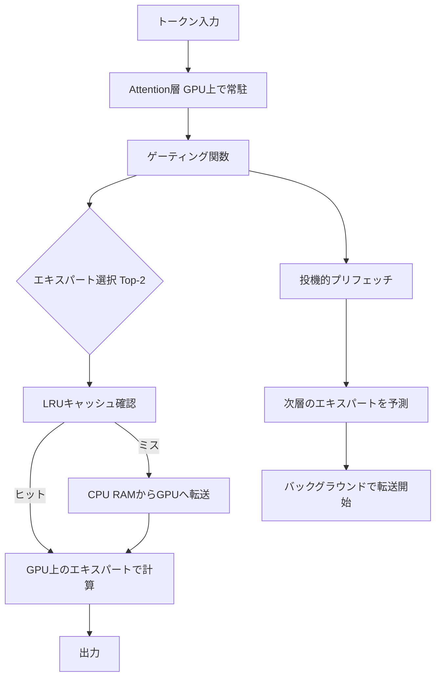
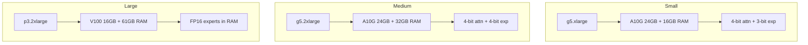

本記事は [Fast Inference of Mixture-of-Experts Language Models with Offloading (arXiv:2312.17238)](https://arxiv.org/abs/2312.17238) の解説記事です。

## 論文概要（Abstract）

Eliseev & Mazurは、Mixture-of-Experts（MoE）言語モデルをコンシューマ向けGPU（RTX 3060/3080/T4等）で実用的な速度で推論するためのオフロード手法を提案している。MoEモデルは各トークンに対してエキスパートの一部のみを活性化するスパース構造を持つが、全エキスパートの重みをGPU VRAMに保持するには膨大なメモリが必要となる。著者らはLRUキャッシュによるエキスパート管理、投機的エキスパートローディング（speculative expert loading）、混合ビット幅量子化（mixed-bitwidth quantization）の3技法を組み合わせ、Mixtral-8x7B（総パラメータ約87GB）をRTX 3060（12GB VRAM）上で2.2tok/s以上の速度で動作させることに成功した。

この記事は [Zenn記事: VRAM48GB+RAM32GBでQwen3.5-397Bを動かすSSDオフロード実践ガイド](https://zenn.dev/0h_n0/articles/c5854032acb8c8) の深掘りです。Zenn記事ではQwen3.5-397Bの実機デプロイを扱っているが、本論文はその基盤となるMoEオフロードの理論と最適化手法を体系的に整理している。

## 情報源

- **arXiv ID**: 2312.17238
- **URL**: [https://arxiv.org/abs/2312.17238](https://arxiv.org/abs/2312.17238)
- **著者**: Artyom Eliseev, Denis Mazur
- **発表年**: 2023年12月
- **分野**: cs.LG, cs.CL

## 背景と動機（Background & Motivation）

MoEアーキテクチャは、総パラメータ数に対して推論時の活性パラメータを大幅に削減できる効率的な設計手法である。Mixtral-8x7Bを例にとると、各層に8つのエキスパートが存在し、トークンごとにTop-2の2つだけが活性化される。しかし、全エキスパートの重みをFP16で保持するには約87GBのVRAMが必要であり、A100-80GBでも収まらない。

コンシューマGPU（RTX 3060: 12GB、RTX 3080 Mobile: 16GB）でMoEモデルを実行するには、エキスパートの重みをCPU RAM（またはSSD）に退避し、必要時にGPUへ転送するオフロード手法が不可欠となる。しかし、素朴なオフロード（naive offloading）ではCPU-GPU間の転送がボトルネックとなり、実用的な速度が得られない。

著者らは以下の観察に基づき、オフロード手法を最適化した。

1. **エキスパートアクセスの局所性**: 連続するトークンは同じエキスパートを選択する傾向が強い
2. **層間の予測可能性**: 現在の層のゲーティング出力から次の層で必要なエキスパートを高精度で予測できる
3. **エキスパートの量子化耐性**: Attention層よりもエキスパート（FFN）層の方が低ビット量子化に耐性がある

## 主要な貢献（Key Contributions）

- **貢献1: LRUキャッシュによるエキスパート管理** — GPU VRAM上にLRU（Least Recently Used）キャッシュを構築し、最近使用されたエキスパートをGPUに保持する。12GB GPUではk=2（層あたり2エキスパート分）、16GB GPUではk=4のキャッシュサイズで、25-35%の速度向上を達成した
- **貢献2: 投機的エキスパートローディング** — 現在の層の隠れ状態を次の層のゲーティング関数に入力し、次に必要なエキスパートを先読みする。この予測は60-80%のRecallを示し、10-15%の追加速度向上をもたらした
- **貢献3: 混合ビット幅量子化** — HQQ（Half-Quadratic Quantization）アルゴリズムを用い、Attention層を4bit、エキスパート層を2-3bitで量子化する混合ビット幅戦略を提案。モデルサイズを86.99GBから17.54-23.99GBに圧縮しつつ、品質劣化を最小限に抑えた

## 技術的詳細（Technical Details）

### オフロードアーキテクチャの全体像



### LRUキャッシュ

MoEモデルの推論では、各層で全エキスパートのうちTop-K個のみが活性化される。Mixtral-8x7Bの場合、各層に8エキスパートが存在し、トークンごとにTop-2が選択される。著者らは、エキスパートのアクセスパターンに強い局所性があることを観察した。すなわち、隣接するトークンは同じエキスパートを選択する傾向がある。

この局所性を活用するため、GPU VRAM上にLRUキャッシュを構築する。各MoE層ごとにk個のエキスパートの重みをGPU上に保持し、キャッシュミス時のみCPU RAMからGPUへ重みを転送する。

キャッシュサイズの選定は以下の制約式に基づく。

$$
\text{VRAM}_{\text{total}} \geq \text{VRAM}_{\text{attn}} + L \cdot k \cdot S_{\text{expert}} + \text{VRAM}_{\text{buffer}}
$$

ここで、
- $L$: MoE層の数
- $k$: 層あたりのキャッシュスロット数
- $S_{\text{expert}}$: 1エキスパートの重みサイズ
- $\text{VRAM}_{\text{buffer}}$: 一時バッファ（プリフェッチ用4スロット含む）

Mixtral-8x7Bの場合、各エキスパートはFP16で約1.1GB、量子化後は200-350MBである。RTX 3060（12GB）ではk=2（各層に2エキスパート分のキャッシュ）、RTX 3080 Mobile（16GB）ではk=4が実用的な設定となる。

著者らは、LRUキャッシュ単体でnaiveオフロードと比較して25-35%の速度向上を報告している（Table 2, arXiv:2312.17238）。

### 投機的エキスパートローディング（Speculative Expert Loading）

LRUキャッシュはキャッシュヒット時には高速だが、キャッシュミス時にはCPU→GPU転送のレイテンシが発生する。著者らはこの問題に対し、投機的プリフェッチ手法を提案した。

核心のアイデアは、**層$l$の隠れ状態$\mathbf{h}^{(l)}$を層$l+1$のゲーティング関数に入力し、次に必要なエキスパートを予測する**ことである。

$$
\hat{E}^{(l+1)} = \text{TopK}\left(\text{softmax}\left(\mathbf{W}_g^{(l+1)} \cdot \mathbf{h}^{(l)}\right), K'\right)
$$

ここで、
- $\mathbf{h}^{(l)}$: 層$l$の出力（Attention + MoE処理後の隠れ状態ではなく、前のトークンの隠れ状態を使用）
- $\mathbf{W}_g^{(l+1)}$: 層$l+1$のルーターの重み行列
- $K'$: プリフェッチ候補数（$K' \geq K$として余分に予測）

この予測は厳密には正確ではない。実際には層$l$の出力はAttention演算とMoE演算を経た後の$\mathbf{h}^{(l+1)}$であり、予測に使う$\mathbf{h}^{(l)}$は近似に過ぎない。しかし、著者らはこの近似が実用的に十分な精度を持つことを実験的に示した。**予測のRecall（実際に必要なエキスパートのうち、正しく予測された割合）は60-80%**に達すると報告されている（Section 4.2, arXiv:2312.17238）。

プリフェッチは非同期で実行される。現在の層のMoE計算と並行して、次の層で必要と予測されたエキスパートをCPU RAMからGPUの一時バッファへ転送する。4つのピン留めメモリバッファ（pinned memory buffer）がMoE層間で共有され、転送のオーバーヘッドを隠蔽する。

```python
import torch
from collections import OrderedDict
from dataclasses import dataclass
from typing import Optional


@dataclass
class ExpertCacheConfig:
    """Configuration for MoE expert LRU cache.

    Args:
        num_layers: Number of MoE layers in the model.
        cache_size: Number of experts to cache per layer (k).
        num_prefetch_buffers: Number of pinned memory buffers for async transfer.
    """
    num_layers: int
    cache_size: int  # k experts per layer
    num_prefetch_buffers: int = 4


class ExpertLRUCache:
    """LRU cache for MoE experts with speculative prefetching.

    Manages expert weights on GPU VRAM using LRU eviction policy.
    Supports async prefetching of predicted next-layer experts.

    Based on Eliseev & Mazur (arXiv:2312.17238).
    """

    def __init__(
        self,
        config: ExpertCacheConfig,
        expert_size: int,
        device: torch.device,
    ) -> None:
        self.config = config
        self.device = device
        # Per-layer LRU: OrderedDict[expert_id, weight_tensor]
        self.cache: list[OrderedDict[int, torch.Tensor]] = [
            OrderedDict() for _ in range(config.num_layers)
        ]
        # Pinned memory buffers for async CPU->GPU transfer
        self.prefetch_buffers: list[torch.Tensor] = [
            torch.empty(expert_size, dtype=torch.float16, pin_memory=True)
            for _ in range(config.num_prefetch_buffers)
        ]
        self._buffer_idx = 0

    def get_expert(
        self, layer_idx: int, expert_id: int
    ) -> Optional[torch.Tensor]:
        """Retrieve expert from cache, updating LRU order.

        Args:
            layer_idx: MoE layer index.
            expert_id: Expert index within the layer.

        Returns:
            Expert weight tensor on GPU if cached, None otherwise.
        """
        layer_cache = self.cache[layer_idx]
        if expert_id in layer_cache:
            # Move to end (most recently used)
            layer_cache.move_to_end(expert_id)
            return layer_cache[expert_id]
        return None

    def insert_expert(
        self,
        layer_idx: int,
        expert_id: int,
        weights: torch.Tensor,
    ) -> None:
        """Insert expert into cache, evicting LRU if full.

        Args:
            layer_idx: MoE layer index.
            expert_id: Expert index within the layer.
            weights: Expert weight tensor (will be moved to GPU).
        """
        layer_cache = self.cache[layer_idx]
        if expert_id in layer_cache:
            layer_cache.move_to_end(expert_id)
            return

        # Evict LRU if cache is full
        while len(layer_cache) >= self.config.cache_size:
            evicted_id, evicted_w = layer_cache.popitem(last=False)
            del evicted_w  # Free GPU memory

        layer_cache[expert_id] = weights.to(self.device)

    def prefetch_async(
        self,
        layer_idx: int,
        expert_id: int,
        expert_weights_cpu: torch.Tensor,
        stream: torch.cuda.Stream,
    ) -> None:
        """Asynchronously prefetch expert to GPU via pinned buffer.

        Args:
            layer_idx: Target MoE layer index.
            expert_id: Expert index to prefetch.
            expert_weights_cpu: Expert weights in CPU RAM.
            stream: CUDA stream for async transfer.
        """
        buf = self.prefetch_buffers[self._buffer_idx % len(self.prefetch_buffers)]
        self._buffer_idx += 1

        # Copy to pinned buffer then async transfer to GPU
        buf.copy_(expert_weights_cpu)
        with torch.cuda.stream(stream):
            gpu_weights = buf.to(self.device, non_blocking=True)
            self.insert_expert(layer_idx, expert_id, gpu_weights)
```

> **注意**: 上記は論文の記述に基づく概念的な実装であり、実際のoffloading-moeライブラリではCUDAイベント同期やメモリプール管理などの追加最適化が施されている。

### 混合ビット幅量子化（Mixed-Bitwidth Quantization）

オフロード手法の効率は転送データ量に直結するため、量子化によるモデル圧縮が重要な役割を果たす。著者らはHQQ（Half-Quadratic Quantization）アルゴリズムを用い、モデルの各コンポーネントに異なるビット幅を割り当てる混合ビット幅戦略を提案した。

HQQは以下の最適化問題を解く。

$$
\min_{\mathbf{z}} \left\| \mathbf{W} - \mathbf{Q}(\mathbf{z}) \right\|_F^2
$$

ここで、$\mathbf{W}$は元の重み行列、$\mathbf{Q}(\mathbf{z})$は量子化された重み（$\mathbf{z}$はゼロポイント等の量子化パラメータ）、$\|\cdot\|_F$はFrobenius normである。HQQの特徴は、校正データ（calibration data）を必要としない点にある。RTXレベルの重み行列を数分で量子化でき、デプロイの敷居を下げる。

著者らの知見として、Attention層はMoEのエキスパート層よりも量子化に対して敏感であることが判明した。この観察から、**Attention層を4bit、エキスパート層を2-3bit**で量子化する混合戦略が最適解となる。

### エキスパートアクセスパターンの分析

論文のSection 4で、エキスパートアクセスパターンの詳細な分析が報告されている。著者らは以下の2つの重要な特性を発見した。

**トークン間の局所性（Inter-token locality）**: 連続するトークンが同一のエキスパートを選択する確率は、ランダム選択よりも有意に高い。これはLRUキャッシュの有効性を支える根拠である。

**層間の予測可能性（Cross-layer predictability）**: 層$l$のゲーティング出力と層$l+1$のゲーティング出力には相関があり、前者から後者を60-80%のRecallで予測できる。これは投機的ローディングの理論的基盤である。

## 実装のポイント（Implementation）

### メモリ管理と転送最適化

効率的なオフロードには、CPU-GPU間のデータ転送を最適化する必要がある。著者らは以下の実装上の工夫を報告している。

**ピン留めメモリ（Pinned Memory）**: CPUメモリをページロック（pin）することで、DMA転送が可能になり、通常のpageableメモリ経由の転送と比較して帯域幅が向上する。著者らは4つのピン留めバッファをMoE層間で共有する設計を採用した。

**非同期転送**: CUDAストリームを用いて、現在の層の計算と次の層へのエキスパート転送を重ね合わせる（overlap）。これにより、転送レイテンシを計算時間で隠蔽できる。

**バッファ共有**: 4つのプリフェッチバッファは全MoE層で共有される。各バッファは1エキスパート分の重みサイズを持ち、ダブルバッファリングの原理で転送と計算を交互に進める。

### 量子化設定の選定

混合ビット幅量子化の設定選定は、VRAMサイズ・品質要求・推論速度のトレードオフとなる。

| 用途 | Attention | Expert | 合計サイズ | 推奨GPU |
|---|---|---|---|---|
| 品質重視 | 4-bit | 4-bit | ~24GB | RTX 3090/4090 (24GB) |
| バランス | 4-bit | 3-bit | ~20GB | RTX 3080 (16GB+) |
| サイズ重視 | 4-bit | 2-bit | ~17.5GB | RTX 3060 (12GB) |

Attention層を2-bitにすると品質劣化が著しいため、著者らは4-bitを下限として推奨している。

## AWSデプロイメントガイド（Production Deployment）

MoEオフロード手法はコンシューマGPUを対象に設計されているが、プロダクション環境でもコスト最適化の手段として有用である。以下にAWS環境でのデプロイ構成を示す。

### 構成パターン



| 構成 | インスタンス | GPU VRAM | RAM | 量子化 | 想定速度 | 月額概算 |
|---|---|---|---|---|---|---|
| Small | g5.xlarge | 24GB (A10G) | 16GB | 4-bit attn + 3-bit exp | ~2.5 tok/s | ~$800 |
| Medium | g5.2xlarge | 24GB (A10G) | 32GB | 4-bit attn + 4-bit exp | ~2.8 tok/s | ~$1,200 |
| Large | p3.2xlarge | 16GB (V100) | 61GB | FP16 experts in RAM | ~2.0 tok/s | ~$2,400 |

> **注意**: 上記の速度・コスト試算はMixtral-8x7B基準の概算であり、実際の値はモデル・入力長・バッチサイズにより変動する。Large構成はRAMが豊富なためキャッシュミスペナルティが小さい。

### Terraformデプロイ例

```hcl
# MoE offloading inference server on AWS
# Based on Eliseev & Mazur (arXiv:2312.17238)

resource "aws_instance" "moe_inference" {
  ami           = "ami-0abcdef1234567890"  # Deep Learning AMI (Ubuntu)
  instance_type = "g5.xlarge"              # A10G 24GB + 16GB RAM

  root_block_device {
    volume_size = 100  # GB: model weights + OS
    volume_type = "gp3"
    iops        = 3000
    throughput  = 125
  }

  tags = {
    Name        = "moe-offload-inference"
    Environment = "production"
    Model       = "mixtral-8x7b"
    Paper       = "arXiv:2312.17238"
  }
}

resource "aws_cloudwatch_metric_alarm" "gpu_memory" {
  alarm_name          = "moe-gpu-memory-high"
  comparison_operator = "GreaterThanThreshold"
  evaluation_periods  = 2
  metric_name         = "gpu_memory_used_percent"
  namespace           = "Custom/GPU"
  period              = 60
  statistic           = "Average"
  threshold           = 90
  alarm_description   = "GPU VRAM usage exceeds 90% - LRU cache may be thrashing"
  alarm_actions       = [aws_sns_topic.alerts.arn]
}

resource "aws_cloudwatch_metric_alarm" "inference_latency" {
  alarm_name          = "moe-inference-latency-high"
  comparison_operator = "GreaterThanThreshold"
  evaluation_periods  = 3
  metric_name         = "tokens_per_second"
  namespace           = "Custom/Inference"
  period              = 60
  statistic           = "Average"
  threshold           = 1.0  # Alert if below 1 tok/s
  alarm_description   = "Inference speed dropped below 1 tok/s - check cache hit rate"
  treat_missing_data  = "breaching"
  alarm_actions       = [aws_sns_topic.alerts.arn]
}

resource "aws_sns_topic" "alerts" {
  name = "moe-inference-alerts"
}
```

### モニタリング指標

MoEオフロード推論では、通常のLLMサービングとは異なるメトリクスの監視が必要となる。

| メトリクス | 閾値 | 意味 |
|---|---|---|
| cache_hit_rate | < 0.6 | LRUキャッシュサイズ不足、kの増加を検討 |
| prefetch_recall | < 0.5 | 投機的ローディングの効果低下 |
| gpu_memory_used_pct | > 90% | キャッシュスラッシング発生の兆候 |
| tokens_per_second | < 1.0 | naive offloadingレベルまで劣化 |
| cpu_to_gpu_bandwidth_gbps | < 8.0 | PCIeボトルネック |

### コストチェックリスト

- [ ] GPUインスタンスの予約（RI/Savings Plan）で30-40%削減可能か確認
- [ ] スポットインスタンスの利用可否（バッチ推論向き、リアルタイムには不適）
- [ ] EBSボリュームタイプ: gp3で十分（モデルロードは起動時のみ）
- [ ] CloudWatch Custom Metricsのコスト（$0.30/metric/month）
- [ ] ネットワーク転送コスト: 推論結果のみなので軽微

## 実験結果（Results）

### 量子化による品質とサイズのトレードオフ

著者らはMixtral-8x7Bに対する量子化実験を報告している（Table 1, arXiv:2312.17238）。

| 構成 | モデルサイズ | WikiText2 (PPL↓) | MMLU (Acc↑) |
|---|---|---|---|
| FP16（ベースライン） | 86.99GB | 3.59 | 70.51% |
| 4-bit attn + 4-bit exp | 23.99GB | 3.76 | 69.11% |
| 4-bit attn + 2-bit exp | 17.54GB | 4.61 | 65.58% |

FP16からの劣化を見ると、4-bit全量子化でWikiText2のPerplexityは3.59→3.76（+4.7%）、MMLUは70.51%→69.11%（-1.40pt）であり、実用上許容可能な範囲に収まっている。一方、エキスパートを2-bitまで圧縮すると、Perplexityは3.59→4.61（+28.4%）、MMLUは70.51%→65.58%（-4.93pt）と劣化が顕著になる。著者らは用途に応じた選定を推奨している。

### 推論速度

各ハードウェアでの推論速度を以下に示す（Table 2, arXiv:2312.17238）。単位はtok/sである。

| ハードウェア | 2-bit expert | 3-bit expert |
|---|---|---|
| A100 (80GB) | 3.061 | 2.845 |
| RTX 3080 Mobile (16GB) | 2.655 | 2.475 |
| RTX 3060 (12GB) | 2.278 | 2.038 |
| T4 (Google Colab) | 2.092 | 1.603 |

参考として、naive offloading（キャッシュ・プリフェッチなし）のベースラインは0.661-1.791 tok/sである。各最適化手法の寄与は以下の通りである。

- **LRUキャッシュ単体**: naive比で25-35%の速度向上
- **投機的ローディング追加**: さらに10-15%の速度向上
- **両手法の組み合わせ**: naive比で最大2-3倍の速度

RTX 3060（12GB）でのMixtral-8x7B推論が2.278 tok/sに達している点は注目に値する。87GBのモデルが12GBのVRAMで2tok/s超という結果は、コンシューマハードウェアでのMoE運用を現実的な選択肢に引き上げている。

## 実運用への応用（Practical Applications）

### Zenn記事との接続

Zenn記事「VRAM48GB+RAM32GBでQwen3.5-397Bを動かすSSDオフロード実践ガイド」では、Qwen3.5-397B（MoEモデル、活性パラメータ17B）をSSDオフロードで動作させる手法を扱っている。本論文の技法はその理論的基盤を提供するものである。

具体的な対応関係は以下の通りである。

| 本論文の技法 | Zenn記事での実践 |
|---|---|
| LRUキャッシュ | llama.cppの`--cache-type-k`/`--cache-type-v`設定 |
| 投機的ローディング | llama.cppの内部最適化として実装 |
| 混合ビット幅量子化 | GGUF形式のIQ2/Q4量子化モデル使用 |
| CPU RAMオフロード | `--cpu-moe`フラグによるエキスパート退避 |
| ピン留めメモリ | `--mlock`オプション |

### コンシューマハードウェアでのデプロイ指針

本論文の結果から、コンシューマ環境でMoEモデルを運用する際の実践的な指針が導かれる。

**VRAM 12GB（RTX 3060相当）**: LRUキャッシュサイズk=2、エキスパート2-bit量子化が推奨。Mixtral-8x7B規模で2tok/s超が期待できる。VRAM不足によるキャッシュスラッシングに注意が必要。

**VRAM 16-24GB（RTX 3080/4090相当）**: キャッシュサイズk=4以上が可能。3-4bit量子化で品質と速度のバランスが良い。Attention層の常駐に加え、頻出エキスパートの大部分をGPU上に保持できる。

**RAM容量**: 全エキスパートの重みをCPU RAMに保持する必要があるため、量子化後のモデルサイズ以上のRAMが必要。Mixtral-8x7Bの2-bit量子化で約17.5GB、4-bit量子化で約24GBのRAMを消費する。

**PCIe帯域幅**: CPU-GPU間の転送速度がボトルネックとなる。PCIe 4.0 x16で理論上約32GB/s、実効約25GB/sであり、1エキスパート（200-350MB量子化後）の転送に8-14ms程度を要する。PCIe 3.0環境では速度が半減する。

### SSDオフロードへの拡張

本論文はCPU RAMへのオフロードを対象としているが、Zenn記事ではSSDオフロードも扱っている。SSDはRAMよりも遅い（NVMe SSDで読み出し約7GB/s、RAMで約50GB/s）ため、キャッシュヒット率の向上がさらに重要となる。本論文のLRUキャッシュと投機的ローディングの組み合わせは、SSDオフロード環境でもキャッシュミスペナルティの軽減に効果的であると考えられる。

## 関連研究（Related Work）

- **FlexGen** (Sheng et al., 2023): GPUオフロードに加え、SSD階層も含む3段階メモリ階層でのLLM推論を実現。ただしDenseモデル向けの手法であり、MoEのスパースアクセスパターンは考慮されていない。本論文はMoE固有の局所性を活用することで、FlexGenよりも効率的なオフロードを実現している
- **DeepSpeed-Inference** (Aminabadi et al., 2022): テンソル並列・パイプライン並列を組み合わせた大規模モデル推論フレームワーク。マルチGPU環境を前提としており、シングルGPUでのオフロードは主要なターゲットではない
- **Fiddler** (Kamahori et al., 2024): MoEモデルのCPU-GPUオフロードに特化した手法。本論文と同時期に独立して開発され、エキスパートの粒度でのオフロード最適化という共通のアプローチを取る。Fiddlerは動的バッチスケジューリングに重点を置いている点で差別化される
- **DAOP** (Dynamic Adaptive Offloading and Parallelism): MoEのリクエストレベルでの動的オフロード戦略。サービング環境での複数リクエスト処理に焦点を当てている点で、本論文のシングルリクエスト最適化とは異なるスコープを持つ

## まとめと今後の展望

Eliseev & Mazurの提案手法は、LRUキャッシュ・投機的エキスパートローディング・混合ビット幅量子化の3技法を組み合わせることで、Mixtral-8x7B（87GB）をRTX 3060（12GB）上で2.278 tok/sの速度で動作させることに成功した。naive offloadingの0.661-1.791 tok/sと比較して、最大2-3倍の高速化である。

本手法の制約として、以下の点が挙げられる。

- バッチサイズ1（シングルリクエスト）を前提としており、マルチユーザーサービングには追加のスケジューリングが必要
- 2-bit量子化ではMMLU精度が約5pt低下するため、高精度タスクには不向き
- 投機的ローディングのRecallが60-80%であり、20-40%のキャッシュミスが残存

今後の展望として、以下の方向性が考えられる。

1. **SSD階層の統合**: CPU RAM→GPU VRAMの2階層に加え、SSD→CPU RAM→GPU VRAMの3階層オフロードが活発に研究されている。Zenn記事で扱われているSSDオフロードはまさにこの延長線上にある
2. **動的キャッシュサイズ**: 入力テキストの特性に応じてキャッシュサイズkを動的に調整する手法
3. **より大規模なMoEモデル**: Qwen3.5-397B-A17BやMixtral-8x22Bなど、より大規模なMoEモデルへの適用。エキスパート数の増加に伴いアクセスパターンの局所性がどう変化するかは未解明

## 参考文献

- **arXiv**: [https://arxiv.org/abs/2312.17238](https://arxiv.org/abs/2312.17238)
- **Code**: [https://github.com/dvmazur/mixtral-offloading](https://github.com/dvmazur/mixtral-offloading)
- **Related Zenn article**: [https://zenn.dev/0h_n0/articles/c5854032acb8c8](https://zenn.dev/0h_n0/articles/c5854032acb8c8)
- **HQQ**: [https://github.com/mobiusml/hqq](https://github.com/mobiusml/hqq)

---

:::message
この記事はAI（Claude Code）により自動生成されました。内容の正確性については原論文で検証していますが、最新情報は公式ドキュメントもご確認ください。
:::
