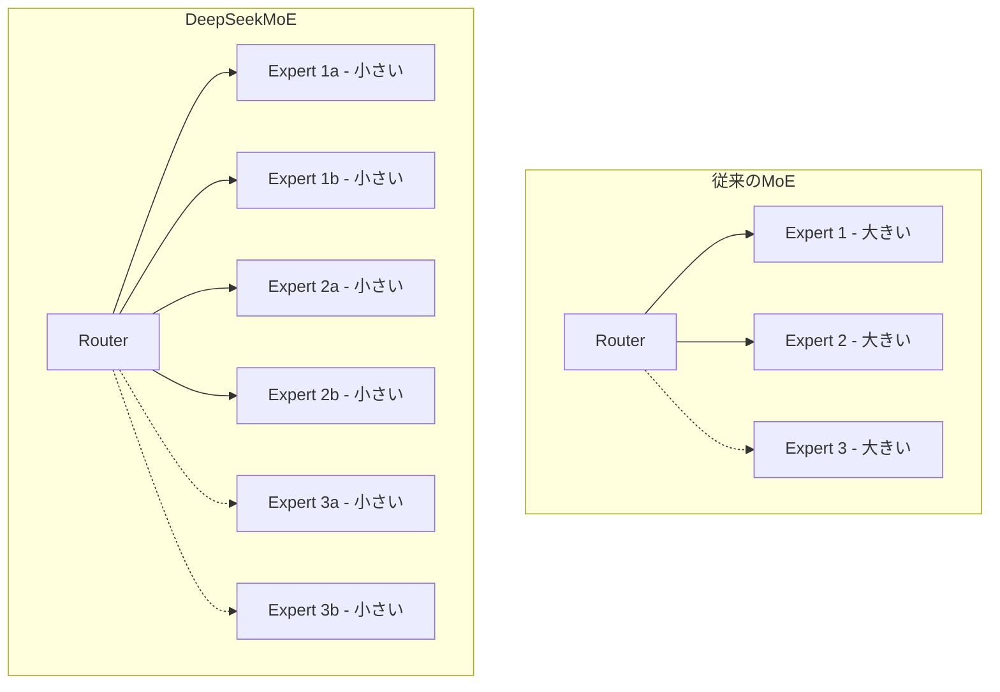

本記事は [DeepSeekMoE: Towards Ultimate Expert Specialization in Mixture-of-Experts Language Models (arXiv:2401.04088)](https://arxiv.org/abs/2401.04088) の解説記事です。

## 論文概要（Abstract）

DeepSeekMoEは、従来のMoE（Mixture of Experts）アーキテクチャにおけるエキスパートの冗長性と特化度の不足を解決するため、2つの設計原則を提案している。第一に、エキスパートを細粒度（fine-grained）に分割して特化度を向上させる。第二に、一部のエキスパートを「共有エキスパート」として常時活性化し、全トークンに共通する知識を分離する。16Bパラメータ中2.8Bのみを活性化する構成で、LLaMA2-7B相当の性能を達成したと著者らは報告している。

この記事は [Zenn記事: Qwen3.5-397Bをllama.cppで自宅PCから動かす実践ガイド](https://zenn.dev/0h_n0/articles/3178b1257ec3ad) の深掘りです。

## 情報源

- **arXiv ID**: 2401.04088
- **URL**: [https://arxiv.org/abs/2401.04088](https://arxiv.org/abs/2401.04088)
- **著者**: Damai Dai, Chengqi Deng, Chenggang Zhao et al.（DeepSeek-AI）
- **発表年**: 2024
- **分野**: cs.CL, cs.LG

## 背景と動機（Background & Motivation）

従来のMoEモデル（GShard、Switch Transformer等）では、各MoE層に$N$個のエキスパートを配置し、ルーターがTop-$K$個を選択する設計が一般的であった。しかし、この設計には以下の問題がある。

**知識の冗長性**: 異なるエキスパートが類似した知識を学習し、パラメータが冗長になる。特に$N$が少ない場合（8〜16個）、各エキスパートが広範な知識を担当するため、エキスパート間の知識重複が大きくなる。

**限定的な組み合わせ**: Top-$K$ルーティングで選択可能な組み合わせは$\binom{N}{K}$通りである。$N=8, K=2$の場合28通りに過ぎず、トークンの多様性に対して十分な表現力が得られない。

DeepSeekMoEは、エキスパートを$mN$個に細分割し、Top-$mK$個を選択することで、活性パラメータ数を変えずに組み合わせ数を$\binom{mN}{mK}$に増加させる。

## 主要な貢献（Key Contributions）

- **貢献1**: 細粒度エキスパート分割により、エキスパートの特化度を向上させ、知識の冗長性を削減した
- **貢献2**: 共有エキスパート機構を導入し、全トークンに共通する知識をルーティングから分離した
- **貢献3**: 16Bパラメータ・2.8B活性で7Bクラスのデンスモデル相当の性能を実証し、67Bモデルへのスケールアップにも成功した

## 技術的詳細（Technical Details）

### 細粒度エキスパート分割

従来のMoE層が$N$個のエキスパート（各FFN次元$d_{\text{ff}}$）を持つ場合、DeepSeekMoEはこれを$mN$個（各FFN次元$d_{\text{ff}} / m$）に分割する。

$$
\text{従来}: \binom{N}{K} \text{ 通りの組み合わせ}
$$

$$
\text{DeepSeekMoE}: \binom{mN}{mK} \text{ 通りの組み合わせ}
$$

例えば$N=16, K=2, m=4$の場合:
- 従来: $\binom{16}{2} = 120$通り
- DeepSeekMoE: $\binom{64}{8} = 4,426,165,368$通り

活性パラメータ数は同一（$K \cdot d_{\text{ff}} = mK \cdot d_{\text{ff}}/m$）だが、組み合わせの自由度が劇的に増加する。



### 共有エキスパート機構

DeepSeekMoEは、$K_s$個のエキスパートを「共有エキスパート」として全トークンで常時活性化する。

$$
\mathbf{h}_t = \sum_{i=1}^{K_s} E_{s,i}(\mathbf{x}_t) + \sum_{j \in \text{TopK}} g_j(\mathbf{x}_t) \cdot E_{r,j}(\mathbf{x}_t)
$$

ここで、
- $E_{s,i}$: $i$番目の共有エキスパート（常時活性）
- $E_{r,j}$: $j$番目のルーテッドエキスパート（Top-$K$選択）
- $g_j(\mathbf{x}_t)$: トークン$\mathbf{x}_t$に対するエキスパート$j$のゲート値
- $K_s$: 共有エキスパート数（論文では$K_s = 2$を採用）

**設計意図**: 言語モデルには「全トークンに共通して必要な知識」（文法構造、一般的な語彙パターン等）が存在する。これをルーティング対象から分離することで、ルーテッドエキスパートは特定ドメイン（数学、コード、特定言語等）に特化できるようになる。

### ルーティングとバランス損失

ルーティングは以下の数式で行われる。

$$
g_j(\mathbf{x}_t) = \frac{s_j(\mathbf{x}_t)}{\sum_{k \in \text{TopK}} s_k(\mathbf{x}_t)}, \quad s_j(\mathbf{x}_t) = \text{softmax}(\mathbf{W}_r \mathbf{x}_t)_j
$$

バランス損失は、エキスパート崩壊を防ぐために以下の補助損失を追加する。

$$
\mathcal{L}_{\text{balance}} = \alpha \cdot N_r \sum_{j=1}^{N_r} f_j \cdot P_j
$$

ここで$N_r$はルーテッドエキスパート数、$f_j$はエキスパート$j$に割り当てられたトークンの割合、$P_j$はエキスパート$j$のルーティング確率の平均、$\alpha$はバランス損失の重み係数である。

### アルゴリズム

```python
import torch
import torch.nn as nn
import torch.nn.functional as F


class DeepSeekMoELayer(nn.Module):
    """DeepSeekMoE layer with fine-grained experts and shared experts.

    Args:
        d_model: Hidden dimension.
        n_routed: Number of routed experts.
        n_shared: Number of shared (always-active) experts.
        top_k: Number of routed experts to activate per token.
        d_ff: Per-expert feed-forward dimension.
    """

    def __init__(
        self,
        d_model: int,
        n_routed: int,
        n_shared: int,
        top_k: int,
        d_ff: int,
    ) -> None:
        super().__init__()
        self.top_k = top_k
        self.router = nn.Linear(d_model, n_routed, bias=False)

        self.shared_experts = nn.ModuleList([
            nn.Sequential(
                nn.Linear(d_model, d_ff), nn.SiLU(), nn.Linear(d_ff, d_model)
            )
            for _ in range(n_shared)
        ])
        self.routed_experts = nn.ModuleList([
            nn.Sequential(
                nn.Linear(d_model, d_ff), nn.SiLU(), nn.Linear(d_ff, d_model)
            )
            for _ in range(n_routed)
        ])

    def forward(self, x: torch.Tensor) -> torch.Tensor:
        """Forward pass with shared + routed experts.

        Args:
            x: (batch, seq_len, d_model).

        Returns:
            Output tensor (batch, seq_len, d_model).
        """
        # Shared experts: always active
        shared_out = sum(expert(x) for expert in self.shared_experts)

        # Router
        logits = self.router(x)  # (B, S, N_routed)
        scores = F.softmax(logits, dim=-1)
        topk_scores, topk_idx = torch.topk(scores, self.top_k, dim=-1)
        topk_scores = topk_scores / topk_scores.sum(dim=-1, keepdim=True)

        # Routed experts: top-K selection
        routed_out = torch.zeros_like(x)
        for k_idx in range(self.top_k):
            expert_indices = topk_idx[..., k_idx]
            gate_values = topk_scores[..., k_idx : k_idx + 1]
            for i, expert in enumerate(self.routed_experts):
                mask = (expert_indices == i).unsqueeze(-1).float()
                if mask.any():
                    routed_out = routed_out + gate_values * mask * expert(x)

        return shared_out + routed_out
```

> **注意**: 実際のDeepSeek実装ではscatter/gather最適化とCUDAカーネルが使用されている。コードは [github.com/deepseek-ai/DeepSeek-MoE](https://github.com/deepseek-ai/DeepSeek-MoE) で公開されている。

## 実装のポイント（Implementation）

**活性パラメータ率の設計**: DeepSeekMoE-16Bでは$N_r = 64$個のルーテッドエキスパートからTop-6を選択し、2個の共有エキスパートを加えた構成で、活性パラメータ率は約17.5%（2.8B/16B）である。この比率は後続のDeepSeek-V2/V3でも維持されている。

**Qwen3/3.5への影響**: Qwen3-235B-A22Bは128エキスパート・Top-8ルーティング＋共有エキスパートという構成で、DeepSeekMoEの設計原則を踏襲している。Qwen3.5-397Bでは512エキスパートにさらに拡大し、Top-10で選択するスケールアップを行っている。

**CPU RAMへのオフローディング**: 細粒度エキスパートは個々のサイズが小さいため、CPU RAMへのロード/アンロードが高速に完了する。llama.cppの`--cpu-moe`設定時、各エキスパートの転送データ量は$d_{\text{ff}} / m$に縮小されるため、PCIe帯域のボトルネックが緩和される。

**バランス損失の調整**: $\alpha$が大きすぎるとエキスパートの特化が阻害され、小さすぎるとエキスパート崩壊が発生する。著者らは$\alpha = 0.01$を推奨している。

## 実験結果（Results）

著者らは以下の比較実験を報告している。

| モデル | 総パラメータ | 活性パラメータ | 性能 |
|---|---|---|---|
| LLaMA2-7B (Dense) | 7B | 7B | ベースライン |
| GShard-16B (MoE, Top-2) | 16B | 2.8B | LLaMA2-7Bに劣る |
| DeepSeekMoE-16B | 16B | 2.8B | LLaMA2-7Bに匹敵 |

> **注意**: 具体的なベンチマークスコアは論文のTable 3, 4を直接参照されたい。

著者らが特に強調しているのは、**同一の活性パラメータ数（2.8B）でGShard構成と比較して大幅な性能向上が得られた**点である。これは細粒度分割と共有エキスパートの組み合わせが、エキスパートの知識冗長性を効果的に削減していることを示している。

67Bモデルへのスケールアップ実験では、DeepSeek-67Bが11.3Bの活性パラメータでLLaMA2-70B相当の性能を達成したと報告している。スケーリング時にも細粒度分割の効果が維持されることが確認された。

## 実運用への応用（Practical Applications）

**ローカル推論のメモリ効率**: Zenn記事で解説されているQwen3.5-397Bの512エキスパート構成は、DeepSeekMoEの細粒度分割を極限まで推し進めた設計である。個々のエキスパートサイズが小さいため、Q4量子化でのモデルサイズ削減効果が大きく、256GB RAMの環境で実用的に動作する。

**エキスパートの選択的ロード**: 512個のうち10個のみが活性化されるため、CPU RAM上のエキスパートを選択的にロードする戦略が有効である。llama.cppの`--n-cpu-moe`パラメータは、この選択的ロード戦略の粒度を制御する。

**共有エキスパートのGPU配置**: Qwen3.5における約1Bの共有エキスパートは全トークンで使用されるため、GPU VRAMに常駐させるのが最適である。llama.cppの`-ot`フラグで明示的にGPUに配置できる。

## 関連研究（Related Work）

- **Switch Transformer** (Fedus et al., 2021): Top-1ルーティングでMoEの実用性を示したが、エキスパートの特化度は限定的であった
- **Mixtral 8x7B** (Jiang et al., 2023): 8個の粗粒度エキスパートでTop-2ルーティングを採用。DeepSeekMoEの細粒度化の対極に位置する
- **DeepSeek-V2** (DeepSeek-AI, 2024): DeepSeekMoEの設計を236Bパラメータにスケールアップし、Multi-head Latent Attention（MLA）を追加した発展版

## まとめと今後の展望

DeepSeekMoEは、細粒度エキスパート分割と共有エキスパート機構という2つの設計原則により、MoEモデルのパラメータ効率を大幅に向上させた。この設計はDeepSeek-V2/V3、Qwen3、Qwen3.5に採用されており、オープンMoEモデルのデファクトスタンダードとなりつつある。

今後の展望として、エキスパートの動的な追加・削除（Sparse Upcycling）や、ドメイン適応時のエキスパート単位のファインチューニングなど、細粒度エキスパートの特性を活かした柔軟な学習手法の開発が期待される。

## 参考文献

- **arXiv**: [https://arxiv.org/abs/2401.04088](https://arxiv.org/abs/2401.04088)
- **Code**: [https://github.com/deepseek-ai/DeepSeek-MoE](https://github.com/deepseek-ai/DeepSeek-MoE)
- **Related Zenn article**: [https://zenn.dev/0h_n0/articles/3178b1257ec3ad](https://zenn.dev/0h_n0/articles/3178b1257ec3ad)

---

:::message
この記事はAI（Claude Code）により自動生成されました。内容の正確性については原論文で検証していますが、最新情報は公式ドキュメントもご確認ください。
:::
