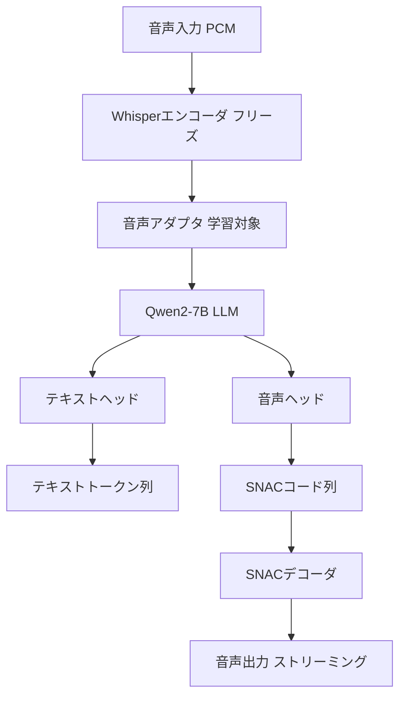

本記事は [Mini-Omni: Language Models Can Hear, Talk While Thinking in Streaming (arXiv:2407.06225)](https://arxiv.org/abs/2407.06225) の解説記事です。

## 論文概要（Abstract）

Mini-Omniは、音声入力から音声出力をテキスト中間変換なしにストリーミング生成する「any-to-any」LLMである。著者らは、テキストトークンと音声トークンを同一のforward pass内で並列デコーディングする手法を提案し、ストリーミング出力を実現したと報告している。事前学習済みLLMの重みへの影響を最小化するVATUNE（Voice Adapter Tuning）戦略を採用し、Qwen2-7Bベースの7Bモデルで実装されている。コードとモデル重みはApache 2.0ライセンスで公開されている。

この記事は [Zenn記事: Gemini Live APIで構築するリアルタイム音声×映像対話アプリケーション実践ガイド](https://zenn.dev/0h_n0/articles/cff7c88b3641ce) の深掘りです。Gemini Live APIのNative Audioモデルがテキストと音声を統合的に処理する設計の学術的背景として、同様のアプローチを取るオープンソース研究を詳述します。

## 情報源

- **arXiv ID**: 2407.06225
- **URL**: [https://arxiv.org/abs/2407.06225](https://arxiv.org/abs/2407.06225)
- **著者**: Zhifei Xie, Changqiao Wu (GPT-Omni team)
- **発表年**: 2024
- **分野**: cs.CL, cs.AI

## 背景と動機（Background & Motivation）

GPT-4oの登場以降、音声を直接入出力するエンドツーエンドLLMの研究が活発化している。しかし、2024年中頃の時点では、オープンソースで音声入力→音声出力のストリーミング生成を実現したモデルは存在しなかった。

従来のマルチモーダルLLM（LLaVA、Qwen-Audio等）は、音声入力を処理できるものの、出力はテキストに限定されていた。音声応答を生成するには、LLMのテキスト出力を外部TTSシステムに渡す必要があり、以下の問題が生じていた。

- **レイテンシ**: LLMがテキスト全文を生成するまでTTSが開始できない
- **表現力の喪失**: テキスト中間表現では音声の感情やトーンが失われる
- **パイプラインの複雑さ**: ASR→LLM→TTSの3コンポーネント管理

Mini-Omniはこれらの課題に対し、LLM自体に音声トークンの直接生成能力を付与するアプローチで対処している。

## 主要な貢献（Key Contributions）

著者らが主張する主要な貢献は以下の通りである。

- **貢献1**: テキストと音声トークンを同一forward passで並列生成する「並列デコーディング」手法の提案。推論時にテキストヘッドと音声ヘッドを同時に動作させることで、ストリーミング出力を実現
- **貢献2**: 事前学習済みLLMの重みを保護するVATUNE（Voice Adapter Tuning）戦略の提案。音声アダプタのみを微調整し、LLM本体のテキスト生成能力を維持
- **貢献3**: VoiceAssistant-400Kデータセットの構築と公開。音声対話の学習データとして、400K件のQAペアを合成

## 技術的詳細（Technical Details）

### アーキテクチャ概要

Mini-Omniのアーキテクチャは、音声エンコーダ、LLMバックボーン、並列デコーディングヘッドの3つの主要コンポーネントで構成される。



### 音声トークナイザ: SNAC

Mini-Omniは音声トークン化にSNAC（Multi-Scale Neural Audio Codec）を使用している。論文Section 3.1によると、SNACの特徴は以下の通りである。

SNACは階層的なコードブック構造を持ち、異なるタイムスケールで音声情報をエンコードする。

- **レベル1（低解像度）**: 粗い音声構造（韻律、イントネーション）
- **レベル2（中解像度）**: 音素レベルの情報
- **レベル3（高解像度）**: 細かな音声ディテール

各レベルのコードブックサイズとフレームレートは以下の通りである。

| レベル | フレームレート | コードブックサイズ | 情報内容 |
|--------|-------------|----------------|---------|
| 1 | 12.5Hz | 4096 | 韻律・構造 |
| 2 | 25Hz | 4096 | 音素 |
| 3 | 50Hz | 4096 | ディテール |

Gemini Live APIではモデル内部の音声トークン化手法は公開されていないが、Moshiの独自コーデック（Mimi）やMini-OmniのSNACと概念的に類似したアプローチが採用されていると推測される。

### 並列デコーディング

Mini-Omniの中核技術である並列デコーディングは、1回のforward passでテキストトークンと音声トークンを同時に生成する手法である。論文Section 3.2の記述に基づくと、以下のように動作する。

各デコーディングステップ$t$において、LLMの隠れ状態$\mathbf{h}_t$から2つのヘッドが並列に出力を生成する。

$$
\begin{aligned}
p_{\text{text}}(w_t \mid \mathbf{h}_t) &= \text{softmax}(\mathbf{W}_{\text{text}} \mathbf{h}_t) \\
p_{\text{audio}}(\mathbf{a}_t \mid \mathbf{h}_t) &= \text{softmax}(\mathbf{W}_{\text{audio}} \mathbf{h}_t)
\end{aligned}
$$

ここで、
- $\mathbf{h}_t$: LLMの時刻$t$における隠れ状態
- $\mathbf{W}_{\text{text}}$: テキストヘッドの重み行列
- $\mathbf{W}_{\text{audio}}$: 音声ヘッドの重み行列
- $w_t$: 生成されるテキストトークン
- $\mathbf{a}_t$: 生成される音声トークン（SNACコード）

**テキスト遅延戦略**: 著者らによると、テキストトークンの生成が音声トークンよりもやや先行するように設計されている。これにより、テキストの意味的整合性が音声生成を導く「ガイド」として機能する。Moshiの「Inner Monologue」機構と同様の設計思想であるが、Mini-Omniではテキストと音声を単一のLMヘッドからではなく、並列ヘッドから生成する点が異なる。

```python
# 並列デコーディングの擬似コード
def parallel_decode_step(
    model: MiniOmniModel,
    hidden_state: torch.Tensor,
) -> tuple[int, list[int]]:
    """1ステップの並列デコーディング

    Args:
        model: Mini-Omniモデル
        hidden_state: LLMの隠れ状態 (batch_size, d_model)

    Returns:
        テキストトークンIDと音声トークンIDリストのタプル
    """
    # テキストヘッド: テキストトークン生成
    text_logits = model.text_head(hidden_state)  # (batch_size, vocab_size)
    text_token = torch.argmax(text_logits, dim=-1)

    # 音声ヘッド: SNACコード生成（3レベル）
    audio_logits = model.audio_head(hidden_state)  # (batch_size, snac_vocab_size)
    audio_codes = []
    for level in range(3):
        level_logits = model.audio_level_heads[level](hidden_state)
        code = torch.argmax(level_logits, dim=-1)
        audio_codes.append(code.item())

    return text_token.item(), audio_codes
```

### VATUNE: 音声アダプタチューニング

VATUNEは、事前学習済みLLM（Qwen2-7B）のテキスト生成能力を維持しながら、音声入出力能力を追加するための微調整戦略である。

著者らによると、VATUNEの学習手順は以下の3段階で構成される（論文Section 3.3より）。

**Stage 1: モダリティアライメント**
音声エンコーダ（Whisper）の出力とLLMの入力空間を接続するアダプタを学習する。LLM本体のパラメータはフリーズ。

**Stage 2: アダプタチューニング**
音声アダプタとデコーディングヘッドのパラメータのみを更新。VoiceAssistant-400Kデータセットを使用。

**Stage 3: 並列デコーディング学習**
テキストと音声の並列出力を同時に学習。LLM本体は引き続きフリーズ。

$$
\mathcal{L}_{\text{total}} = \lambda_{\text{text}} \mathcal{L}_{\text{text}} + \lambda_{\text{audio}} \mathcal{L}_{\text{audio}}
$$

ここで、
- $\mathcal{L}_{\text{text}}$: テキスト生成の交差エントロピー損失
- $\mathcal{L}_{\text{audio}}$: 音声コード生成の交差エントロピー損失
- $\lambda_{\text{text}}, \lambda_{\text{audio}}$: 損失の重み係数

LLM本体をフリーズすることで、元のテキスト理解・生成能力が保持される。これは「壊滅的忘却」（catastrophic forgetting）を防ぐための重要な設計判断である。

### VoiceAssistant-400Kデータセット

著者らが構築・公開したVoiceAssistant-400Kは、以下の特徴を持つ合成データセットである。

- **規模**: 約400,000件のQAペア
- **構築方法**: GPT-4oでテキストQAを生成し、TTSで音声に変換
- **言語**: 英語
- **用途**: Stage 2のアダプタチューニングに使用
- **公開**: Hugging Faceで公開

## 実装のポイント（Implementation）

### 推論要件

- **GPU**: A100 40GB × 1枚で推論可能（論文の実験環境はA100 40GB × 8で学習）
- **モデルサイズ**: 約7B（Qwen2-7Bベース + 音声アダプタ）
- **コード**: [https://github.com/gpt-omni/mini-omni](https://github.com/gpt-omni/mini-omni)
- **ライセンス**: Apache 2.0

### ストリーミング推論のフロー

```python
# ストリーミング推論の実装例
import asyncio
import torch
from mini_omni import MiniOmniModel, SNACDecoder

async def streaming_inference(
    model: MiniOmniModel,
    audio_input: torch.Tensor,
    output_callback,
) -> None:
    """ストリーミング推論を実行

    Args:
        model: Mini-Omniモデル
        audio_input: 音声入力テンソル (PCM 16kHz)
        output_callback: 音声チャンク出力用コールバック
    """
    # 音声エンコード
    audio_features = model.encode_audio(audio_input)

    # 自己回帰生成ループ
    snac_decoder = SNACDecoder()
    hidden = model.init_hidden(audio_features)

    for step in range(model.max_steps):
        # 並列デコーディング
        text_token, audio_codes = parallel_decode_step(model, hidden)

        # 音声コードをPCMに変換してストリーミング出力
        pcm_chunk = snac_decoder.decode_step(audio_codes)
        await output_callback(pcm_chunk)

        # 終了条件
        if text_token == model.eos_token_id:
            break

        # 隠れ状態更新
        hidden = model.update_hidden(hidden, text_token, audio_codes)
```

### ハマりどころ

1. **SNAC依存**: SNACコーデックは比較的新しいライブラリであり、PyTorch 2.0以上を要求する。インストール時にバージョン互換性に注意
2. **英語のみ**: VoiceAssistant-400Kは英語のみ。日本語対応にはデータセットの再構築とSNACの日本語対応が必要
3. **音声品質**: 論文内で著者ら自身が認めているように、ElevenLabs等の専用TTSシステムと比較して音声品質は低い。プロダクション品質を求める場合は後処理が必要

## 実験結果（Results）

### ベンチマーク評価

著者らはMLLM-BenchとAIR-Benchでの評価を報告している（論文Section 4より）。

| ベンチマーク | Mini-Omni | カスケード型（Whisper+GPT+TTS） | 評価内容 |
|------------|-----------|------------------------------|---------|
| MLLM-Bench | 競争力あり | - | マルチモーダル理解 |
| AIR-Bench | 競争力あり | - | 音声指示追従 |

**注意**: 論文内の具体的な数値スコアは限定的であり、「competitive（競争力がある）」という定性的な評価が主である。定量的な比較は、後続研究（Moshi、Freeze-Omni等）でより詳細に行われている。

### レイテンシ分析

著者らによると、並列デコーディングにより、カスケード型パイプラインと比較して以下の改善が報告されている。

- **カスケード型**: ASR（数百ms）+ LLM推論（数秒）+ TTS（数百ms）= 数秒
- **Mini-Omni**: LLM推論のみ（ストリーミング出力のため最初のチャンクは数百ms）

ただし、具体的なミリ秒単位のレイテンシ数値は論文内で詳細に報告されていない。Moshi（160ms）やGemini Live API（600ms first token）との直接的な数値比較は困難である。

## 実運用への応用（Practical Applications）

### Gemini Live APIとの関連

Mini-Omniの並列デコーディング手法は、Gemini Live APIのNative Audioモデルが音声を直接生成する仕組みと概念的に共通する。両者とも、テキストと音声を統合的に処理するエンドツーエンド設計を採用している。

| 比較項目 | Gemini Live API | Mini-Omni |
|---------|----------------|-----------|
| 音声トークン化 | 非公開 | SNAC（3レベル階層コーデック） |
| 並列生成 | Native Audio（詳細非公開） | テキスト+音声の並列デコーディング |
| ストリーミング | WebSocket双方向 | 自己回帰ループ内 |
| 全二重対話 | VADベース | 非対応（半二重） |

### 適用シナリオ

- **プロトタイピング**: オープンソースで音声→音声パイプラインを実験したい場合
- **教育・研究**: 音声LLMのアーキテクチャを学ぶ教材として
- **カスタムTTS**: 特定ドメインの音声スタイルで応答するモデルの微調整

### 制約

- **半二重のみ**: 全二重対話（ユーザーとAIの同時発話）は非対応。Gemini Live APIやMoshiと異なる
- **英語のみ**: 日本語対応にはデータとコーデックの再構築が必要
- **音声品質**: 専用TTSと比較して品質が低い

## 関連研究（Related Work）

- **Moshi (Défossez et al., 2024)**: Mini-Omniと同時期の研究。全二重対話をサポートし、Inner Monologue機構でテキストを先行生成する点が異なる。160msレイテンシはMini-Omniを上回る
- **LLaMA-Omni (Fang et al., 2024)**: Llama-3.1-8Bベースの音声対話モデル。テキストと音声の同時生成を実現するが、SNACではなくCTCベースの音声デコーダを使用
- **VITA-1.5 (Fu et al., 2025)**: 映像+音声のマルチモーダル対話。Mini-Omniが音声のみに特化しているのに対し、映像入力もサポート

## まとめと今後の展望

Mini-Omniは、音声→音声のストリーミング生成をオープンソースLLMで初めて実現した研究として意義がある。並列デコーディングとVATUNE戦略は、既存のテキストLLMに音声能力を効率的に追加するための実用的なアプローチである。

Gemini Live APIのNative Audioモデルがテキストと音声を統合的に処理する設計の学術的背景を理解するうえで、Mini-Omniの並列デコーディング手法は参考になる。ただし、Mini-Omniは半二重のみの対応であり、Gemini Live APIが提供するVADベースの全二重対話、映像入力、Function Callingなどの機能は含まれていない。

今後の発展方向として、全二重対話への拡張、多言語対応、映像モダリティの統合が期待される。

## 参考文献

- **arXiv**: [https://arxiv.org/abs/2407.06225](https://arxiv.org/abs/2407.06225)
- **Code**: [https://github.com/gpt-omni/mini-omni](https://github.com/gpt-omni/mini-omni)
- **Dataset**: VoiceAssistant-400K（Hugging Face公開）
- **Related Zenn article**: [https://zenn.dev/0h_n0/articles/cff7c88b3641ce](https://zenn.dev/0h_n0/articles/cff7c88b3641ce)
