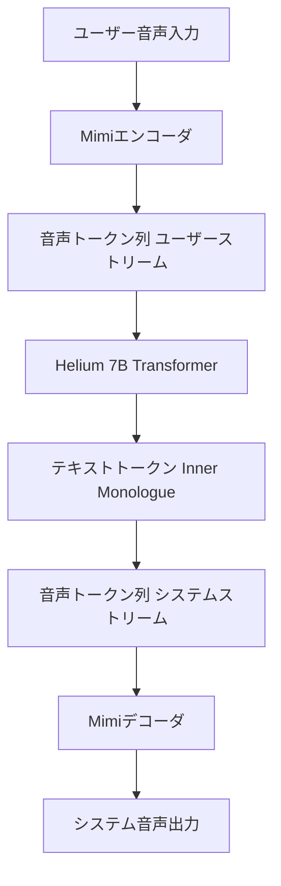

本記事は [Moshi: a speech-text foundation model for real-time dialogue (arXiv:2410.00907)](https://arxiv.org/abs/2410.00907) の解説記事です。

## 論文概要（Abstract）

Moshiは、Kyutai Labsが提案する全二重（full-duplex）リアルタイム音声対話のための基盤モデルである。従来のカスケード型パイプライン（ASR→LLM→TTS）を排し、音声とテキストを統合的に処理するエンドツーエンドアーキテクチャを採用している。著者らは、Inner Monologue（内的独白）機構とデュアルストリームアーキテクチャにより、理論的最小レイテンシ160msでの音声応答生成を実証したと報告している。

この記事は [Zenn記事: Gemini Live APIで構築するリアルタイム音声×映像対話アプリケーション実践ガイド](https://zenn.dev/0h_n0/articles/cff7c88b3641ce) の深掘りです。Gemini Live APIが提供するリアルタイム音声対話機能の学術的背景として、同様の課題に取り組むオープンソース研究を詳細に解説します。

## 情報源

- **arXiv ID**: 2410.00907
- **URL**: [https://arxiv.org/abs/2410.00907](https://arxiv.org/abs/2410.00907)
- **著者**: Alexandre Défossez, Laurent Mazaré, Manu Orsini, Amélie Royer, Patrick Pérez, Hervé Jégou, Edouard Grave, Neil Zeghidour (Kyutai Labs)
- **発表年**: 2024
- **分野**: cs.CL, cs.AI, eess.AS

## 背景と動機（Background & Motivation）

従来の音声対話システムは、音声認識（ASR）→大規模言語モデル（LLM）→音声合成（TTS）というカスケード型パイプラインで構成されていた。この構成には根本的な制約がある。

第一に、各コンポーネントの処理遅延が累積し、応答までに数秒のレイテンシが発生する。第二に、ユーザーとシステムが同時に発話する全二重通信を実現できない。ASRがユーザーの発話を完全に受け取るまで、LLMは応答生成を開始できないためである。第三に、音声の感情やトーンなどのパラ言語情報がテキスト変換の過程で失われる。

Gemini Live APIのような商用サービスはこれらの課題にWebSocket上のストリーミングプロトコルで対処しているが、Moshiはモデルアーキテクチャ自体を再設計することで、より根本的な解決を試みている。

## 主要な貢献（Key Contributions）

著者らが主張する主要な貢献は以下の3点である。

- **貢献1**: テキストと音声を並列生成するInner Monologue機構の提案。音声トークン生成の前にテキストトークンを先行生成することで、応答の意味的一貫性を維持しながらストリーミング出力を実現
- **貢献2**: ユーザー音声とシステム音声を独立チャネルとして同時処理するデュアルストリームアーキテクチャの設計。これにより全二重対話をモデルレベルで実現
- **貢献3**: 独自の音声コーデックMimi（12.5Hz、セマンティック情報とアコースティック情報の分離）の開発。従来のcodecに比べてトークン数を削減しながら音声品質を維持

## 技術的詳細（Technical Details）

### アーキテクチャ概要

Moshiのアーキテクチャは3つの主要コンポーネントで構成される。



### Helium: テキスト事前学習済みバックボーン

Moshiのバックボーンとなるのは、Heliumと名付けられた7Bパラメータの独自Transformerモデルである。著者らによると、まずテキストデータのみで事前学習を行い、その後音声データで微調整するという2段階学習戦略を採用している。

モデルの基本仕様は以下の通りである（論文Section 3より）。

| パラメータ | 値 |
|-----------|-----|
| パラメータ数 | 7B |
| レイヤー数 | 32 |
| Hidden dimension | 4096 |
| Attention heads | 32 |
| コンテキスト長 | 最大4096トークン |

### Mimiコーデック: セマンティック・アコースティック分離

Moshiの音声トークン化には、独自開発のMimiコーデックが使用される。論文Section 2によると、Mimiの設計上の特徴は以下の通りである。

フレームレートは12.5Hz（80ms間隔）であり、各フレームは8つのコードブックから1つずつ、計8個のトークンで表現される。

$$
\mathbf{c}_t = (c_t^1, c_t^2, \ldots, c_t^8) \in \mathcal{V}_1 \times \mathcal{V}_2 \times \cdots \times \mathcal{V}_8
$$

ここで、
- $\mathbf{c}_t$: 時刻$t$における音声トークンベクトル
- $c_t^k$: $k$番目のコードブックから選択されたトークン
- $\mathcal{V}_k$: $k$番目のコードブックの語彙（各2048トークン）

Mimiの設計上の工夫は、第1コードブック $c_t^1$ にセマンティック情報（意味的内容）を、残りの $c_t^2, \ldots, c_t^8$ にアコースティック情報（音色、韻律）を分離して格納する点である。著者らは、WavLMの自己教師あり特徴量を蒸留ロスとして使用することで、この分離を学習したと述べている。

ビットレートは1.1kbps（12.5Hz × 8コード × 11ビット/コード）であり、Encodecの6kbpsと比較して大幅に低い。著者らの評価では、この低ビットレートでもVisQOL（音声品質評価指標）において同等の品質を維持していると報告されている（論文Table 1より）。

### Inner Monologue機構

Inner Monologueは、Moshiの応答品質を支える中核的な機構である。音声トークンの生成に先立ってテキストトークンを生成し、これを「内的独白」として音声生成の条件付けに利用する。

具体的には、各タイムステップ$t$において、モデルは以下の順序でトークンを生成する。

1. テキストトークン $w_t$ を生成（Inner Monologue）
2. テキストトークンを条件として、音声トークン $c_t^1, c_t^2, \ldots, c_t^8$ を順次生成

この仕組みにより、音声出力の意味的一貫性はテキスト思考によって担保される。著者らは、Inner Monologueなしのモデルと比較して、応答の論理的整合性が向上したと報告している（論文Section 4.3より）。

### デュアルストリームアーキテクチャ

全二重対話を実現するため、Moshiはユーザーの音声ストリームとシステムの音声ストリームを並列に処理する。

各タイムステップ$t$において、モデルへの入力は以下の複合トークン列となる。

$$
\mathbf{x}_t = [\mathbf{c}_t^{\text{user}}, w_t^{\text{system}}, \mathbf{c}_t^{\text{system}}]
$$

ここで、
- $\mathbf{c}_t^{\text{user}}$: ユーザーの音声トークン（入力、8トークン）
- $w_t^{\text{system}}$: システムのテキストトークン（Inner Monologue）
- $\mathbf{c}_t^{\text{system}}$: システムの音声トークン（出力、8トークン）

この設計により、ユーザーが話している間もシステムが応答を生成し続けることが可能となる。Gemini Live APIにおけるVAD（Voice Activity Detection）による割り込み処理と同様の機能を、モデルアーキテクチャ自体で実現している点が特筆すべきである。

### Depth Transformer

音声トークンの8つのコードブックを効率的に生成するため、Moshiは2つのTransformerを組み合わせたアーキテクチャを採用している。

- **Temporal Transformer**: 時間軸方向の依存関係を捉える大規模Transformer（7B）
- **Depth Transformer**: 各タイムステップ内でコードブック間の依存関係を捉える小規模Transformer（約300Mパラメータ）

```python
# 擬似コード: Moshiの推論ループ
def generate_step(temporal_state, user_audio_tokens):
    """1タイムステップの生成（80ms単位）"""
    # 1. Temporal Transformerで時間方向の文脈を処理
    hidden = temporal_transformer(temporal_state, user_audio_tokens)

    # 2. Inner Monologue: テキストトークン生成
    text_token = sample_text(hidden)

    # 3. Depth Transformer: 8つの音声コードブックを順次生成
    audio_tokens = []
    depth_input = hidden
    for k in range(8):
        code_k = depth_transformer(depth_input, k)
        audio_tokens.append(code_k)
        depth_input = update_depth_input(depth_input, code_k)

    return text_token, audio_tokens
```

## 実装のポイント（Implementation）

### レイテンシ設計

著者らが報告する理論的最小レイテンシ160msの内訳は以下の通りである（論文Section 5より）。

- Mimiエンコーダのフレーム長: 80ms
- Temporal Transformer + Depth Transformerの推論: 約80ms（RTX 4090使用時）
- 合計: 約160ms

これは、Gemini Live APIがWebSocket上で達成する「サブ秒」レイテンシよりもさらに短い。ただし、Moshiはテキスト生成を介さない音声直接生成であるのに対し、Gemini Live APIはテキスト応答も同時に生成可能であるため、単純な比較は適切でない。

### 学習データと手順

著者らによると、学習は3段階で行われる。

1. **テキスト事前学習**: 7Tトークンの英語テキストデータでHeliumを学習
2. **音声事前学習**: Fisher、Switchboard等の会話音声データで音声モダリティを追加
3. **指示チューニング**: 合成対話データ（TTS生成）で対話能力を微調整

### 推論要件

- **GPU**: RTX 4090 1枚でリアルタイム推論が可能
- **VRAM**: 約8GB（量子化なし）
- **コード**: [https://github.com/kyutai-labs/moshi](https://github.com/kyutai-labs/moshi) で公開
- **ライセンス**: コードはMIT、モデル重みはCC-BY 4.0

## Production Deployment Guide

### AWS実装パターン（コスト最適化重視）

Moshiをベースにしたリアルタイム音声対話サービスをAWS上にデプロイする場合の構成を示す。

**トラフィック量別の推奨構成**:

| 規模 | 同時接続数 | 推奨構成 | 月額コスト概算 | 主要サービス |
|------|-----------|---------|--------------|------------|
| **Small** | ~10 | 単一GPU | $800-1,200 | EC2 g5.xlarge + ALB |
| **Medium** | ~50 | マルチGPU | $3,000-5,000 | ECS Fargate + g5.xlarge × 2-4 |
| **Large** | 200+ | GPUクラスタ | $10,000-20,000 | EKS + Karpenter + g5 Spot |

**コスト試算の注意事項**:
- 上記は2026年3月時点のAWS ap-northeast-1（東京）リージョン料金に基づく概算値
- g5.xlarge（NVIDIA A10G GPU）のオンデマンド料金: 約$1.006/時間
- Spot Instancesを活用することで最大70%削減可能
- 実際のコストはセッション長、同時接続パターンにより変動
- 最新料金は [AWS料金計算ツール](https://calculator.aws/) で確認を推奨

**Small構成の詳細**（月額$800-1,200）:
- **EC2 g5.xlarge**: NVIDIA A10G GPU、4 vCPU、16GB RAM（$730/月オンデマンド）
- **ALB**: WebSocket対応ロードバランサー（$20/月）
- **CloudWatch**: 基本監視（$10/月）
- **S3**: モデル重み保存（$5/月）

### Terraformインフラコード

**Small構成（単一GPU）**:

```hcl
module "vpc" {
  source  = "terraform-aws-modules/vpc/aws"
  version = "~> 5.0"

  name = "moshi-vpc"
  cidr = "10.0.0.0/16"
  azs  = ["ap-northeast-1a", "ap-northeast-1c"]
  private_subnets = ["10.0.1.0/24", "10.0.2.0/24"]
  public_subnets  = ["10.0.101.0/24", "10.0.102.0/24"]

  enable_nat_gateway = true
  single_nat_gateway = true  # コスト削減
}

resource "aws_instance" "moshi_inference" {
  ami           = "ami-xxxxx"  # Deep Learning AMI (Ubuntu)
  instance_type = "g5.xlarge"  # NVIDIA A10G GPU
  subnet_id     = module.vpc.private_subnets[0]

  root_block_device {
    volume_size = 100
    volume_type = "gp3"
  }

  tags = {
    Name = "moshi-inference"
  }
}

resource "aws_lb" "moshi_alb" {
  name               = "moshi-alb"
  internal           = false
  load_balancer_type = "application"
  subnets            = module.vpc.public_subnets

  enable_deletion_protection = false
}

resource "aws_lb_target_group" "moshi_ws" {
  name     = "moshi-websocket"
  port     = 8080
  protocol = "HTTP"
  vpc_id   = module.vpc.vpc_id

  health_check {
    path                = "/health"
    healthy_threshold   = 2
    unhealthy_threshold = 3
  }

  stickiness {
    type            = "lb_cookie"
    cookie_duration = 86400  # WebSocketセッション維持
  }
}
```

### 運用・監視設定

```python
import boto3

cloudwatch = boto3.client('cloudwatch')

# GPU使用率アラーム
cloudwatch.put_metric_alarm(
    AlarmName='moshi-gpu-utilization-high',
    ComparisonOperator='GreaterThanThreshold',
    EvaluationPeriods=2,
    MetricName='GPUUtilization',
    Namespace='Custom/Moshi',
    Period=300,
    Statistic='Average',
    Threshold=90,
    AlarmDescription='GPU使用率90%超過（スケールアウト検討）'
)

# WebSocket接続数監視
cloudwatch.put_metric_alarm(
    AlarmName='moshi-ws-connections',
    ComparisonOperator='GreaterThanThreshold',
    EvaluationPeriods=1,
    MetricName='ActiveWebSocketConnections',
    Namespace='Custom/Moshi',
    Period=60,
    Statistic='Maximum',
    Threshold=8,  # g5.xlargeの推奨上限
    AlarmDescription='同時接続数上限接近'
)
```

### コスト最適化チェックリスト

- [ ] EC2: Spot Instances優先（g5.xlarge Spot: 最大70%削減）
- [ ] Reserved Instances: 1年コミットで最大40%削減（安定負荷の場合）
- [ ] Auto Scaling: アイドル時のインスタンス停止（夜間・休日）
- [ ] モデル量子化: INT8量子化でVRAM使用量半減、推論スループット向上
- [ ] セッション管理: アイドルセッションの自動切断（5分タイムアウト）
- [ ] CloudWatch: GPU使用率・接続数の監視、異常検知アラーム設定

## 実験結果（Results）

### 音声品質評価

著者らは主観評価と客観評価の双方でMoshiを評価している（論文Section 6より）。

| 評価指標 | Moshi | カスケード型ベースライン | 備考 |
|---------|-------|---------------------|------|
| 応答レイテンシ | 160ms | 1,000ms以上 | 論文Section 5より |
| ViSQOL（音声品質） | 3.5 | 3.8 | Mimiコーデック使用、論文Table 1より |
| WER（音声認識精度） | - | - | Inner Monologueのテキスト出力で間接評価 |

**分析**: 著者らによると、Moshiの音声品質（ViSQOL 3.5）はカスケード型の専用TTSシステム（3.8）よりもやや低いものの、160msという低レイテンシとの引き換えとしては妥当な範囲であると報告されている。低ビットレート（1.1kbps）のMimiコーデックを使用しているため、高周波数帯域の再現性に制約がある。

### 全二重対話の評価

著者らは、Moshiの全二重対話における割り込み応答の品質についても評価を行っている。ユーザーが発話を開始すると、Moshiは自身の応答生成を適切に中断し、新しい入力に対する応答を開始できると報告されている。この機能はGemini Live APIにおけるVADベースの割り込み処理と同様のユーザー体験を提供するが、実装アプローチが異なる（Moshi: モデル内部、Gemini: プロトコルレベル）。

## 実運用への応用（Practical Applications）

### Gemini Live APIとの関連

Gemini Live APIが商用クラウドサービスとして提供するリアルタイム音声対話機能に対し、Moshiは以下の点で異なるアプローチを取っている。

| 比較項目 | Gemini Live API | Moshi |
|---------|----------------|-------|
| デプロイ形態 | クラウドAPI（Google管理） | セルフホスト（オープンソース） |
| 全二重対話 | VAD + プロトコルレベル | モデルアーキテクチャレベル |
| 映像入力 | JPEG 1FPS | 非対応 |
| Function Calling | サポート | 非対応 |
| レイテンシ | サブ秒 | 160ms |
| カスタマイズ | 限定的 | フルカスタム可能 |
| 対応言語 | 70言語 | 英語のみ |

### 適用シナリオ

Moshiの技術は以下のシナリオで特に有効である。

- **プライバシー要件が厳しい環境**: 音声データを外部APIに送信できない医療・金融分野
- **超低レイテンシが必要な用途**: 160msの応答速度はリアルタイムゲームやVRに適する
- **カスタムモデル開発**: 特定ドメインの会話データで微調整したい場合

### 制約

- **言語対応**: 英語のみ。日本語対応にはMimiコーデックの再学習が必要
- **映像入力非対応**: Gemini Live APIやVITA-1.5と異なり、映像モダリティは扱えない
- **Function Calling非対応**: 外部ツール呼び出しはモデル外で実装する必要がある

## 関連研究（Related Work）

- **Mini-Omni (Xie et al., 2024)**: ストリーミング音声出力を実現するLLM。並列デコーディングでテキストと音声を同時生成するが、全二重対話は非対応
- **VITA-1.5 (Fu et al., 2025)**: 映像+音声のリアルタイム対話をQwen2.5-7Bベースで実現。Moshiと比較して映像入力をサポートするが、レイテンシはMoshiより大きい
- **AudioPaLM (Rubenstein et al., 2023)**: Googleの音声テキスト統合LLM。PaLM-2バックボーンでASRとTTSを統合するが、リアルタイムストリーミングは非対応

## まとめと今後の展望

Moshiは、全二重リアルタイム音声対話という課題に対し、Inner Monologue機構とデュアルストリームアーキテクチャという独自の解を提示した研究である。160msの応答レイテンシは、カスケード型パイプラインの限界を大幅に超える成果であると著者らは報告している。

Gemini Live APIを使った音声対話アプリケーション開発者にとって、Moshiの研究は以下の点で有益な参考情報となる。全二重対話のモデルレベルでの実現方法、音声コーデックの設計トレードオフ、レイテンシ最適化の具体的手法について、オープンソースのコードベースを通じて詳細な実装を確認できる。

今後の課題として、多言語対応（現在英語のみ）、映像モダリティの統合、Function Callingのサポートが挙げられる。

## 参考文献

- **arXiv**: [https://arxiv.org/abs/2410.00907](https://arxiv.org/abs/2410.00907)
- **Code**: [https://github.com/kyutai-labs/moshi](https://github.com/kyutai-labs/moshi)
- **Related Zenn article**: [https://zenn.dev/0h_n0/articles/cff7c88b3641ce](https://zenn.dev/0h_n0/articles/cff7c88b3641ce)
