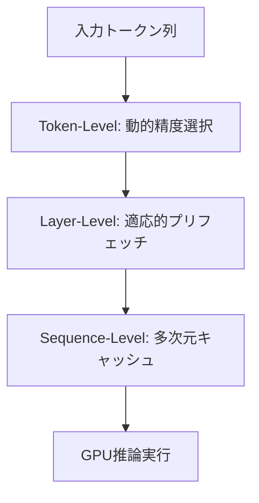

本記事は [HOBBIT: A Mixed Precision Expert Offloading System for Fast MoE Inference (arXiv:2411.01433)](https://arxiv.org/abs/2411.01433) の解説記事です。

## 論文概要（Abstract）

HOBBITは、MoEモデルの推論においてエキスパートの重みをGPUメモリ外（CPU RAM/SSD）にオフロードする際の速度低下を、混合精度ロードと3階層の最適化で解決するシステムである。従来のオフローディング手法と比較して、デコーディングで最大9.93倍、プリフィルで60〜80%のレイテンシ削減を達成したと著者らは報告している。精度劣化は1%未満に抑えられている。

この記事は [Zenn記事: Qwen3.5-397Bをllama.cppで自宅PCから動かす実践ガイド](https://zenn.dev/0h_n0/articles/3178b1257ec3ad) の深掘りです。

## 情報源

- **arXiv ID**: 2411.01433
- **URL**: [https://arxiv.org/abs/2411.01433](https://arxiv.org/abs/2411.01433)
- **著者**: Peng Tang, Jiacheng Liu, Xiaofeng Hou et al.
- **発表年**: 2024
- **分野**: cs.LG, cs.DC

## 背景と動機（Background & Motivation）

MoEモデルのローカル推論において、最大のボトルネックはエキスパートの重みのロード時間である。Qwen3.5-397Bのような大規模MoEモデルでは、394BのエキスパートパラメータをCPU RAMに退避する必要があるが、各トークンの生成時に選択されたエキスパートをGPUにロードする時間が推論全体のレイテンシを支配する。

従来のオフローディング手法（MoE-Offloading、MoE-Infinity等）は、FP16精度でエキスパートを全量ロードするため、PCIe帯域がボトルネックになる。PCIe 4.0 x16の理論帯域は32GB/sだが、1つのエキスパート（FP16で数百MB）のロードに数ミリ秒を要し、これが積み重なると実用的な生成速度を大幅に低下させる。

HOBBITは「すべてのエキスパートが同じ精度である必要はない」という着眼点から、混合精度ロードを導入し、この問題を解決する。

## 主要な貢献（Key Contributions）

- **貢献1**: トークン単位の動的エキスパートロードにより、ゲーティング出力の大きさに基づいて精度レベルを選択する機構を提案した
- **貢献2**: レイヤー単位の適応的エキスパートプリフェッチにより、次レイヤーで使用されるエキスパートを96%の精度で予測するアルゴリズムを設計した
- **貢献3**: シーケンス単位の多次元キャッシュ置換ポリシーにより、エキスパートキャッシュのヒット率を向上させた

## 技術的詳細（Technical Details）

### 3階層最適化アーキテクチャ

HOBBITの最適化は、3つの粒度で行われる。



### 第1階層: トークン単位の動的エキスパートロード

著者らは、ゲーティング出力の大きさ（magnitude）がエキスパートの出力への寄与度と0.99の相関を持つことを発見した。この発見に基づき、2つの閾値$T_1, T_2$でエキスパートの精度レベルを動的に決定する。

$$
\text{Precision}(e_i) = \begin{cases}
\text{High (FP16)} & \text{if } g_i > T_2 \text{ or } i = \arg\max_j g_j \\
\text{Low (INT4)} & \text{if } T_1 < g_i \leq T_2 \\
\text{Skip} & \text{if } g_i \leq T_1
\end{cases}
$$

ここで、
- $g_i$: エキスパート$i$のゲート値（ルーター出力）
- $T_1 = 0.6$: スキップ閾値
- $T_2 = 0.9$: 高精度閾値
- Top-1エキスパートは常にFP16（品質保証）

**INT4ロードの利点**: INT4はFP16の1/4のデータ量であるため、PCIeでのロード時間が1/4に短縮される。「重要でないエキスパートは低精度で十分」という知見により、精度劣化を1%未満に抑えながらロード時間を大幅に削減できる。

### 第2階層: レイヤー単位の適応的プリフェッチ

連続するMoE層のゲーティング入力間のコサイン類似度が0.96以上であることを著者らは確認した。この高い相関を利用し、次レイヤーで使用されるエキスパートを事前予測する。

$$
\hat{\mathbf{g}}_{l+1} = \text{TopK}\left(\text{softmax}(\mathbf{W}_{r,l+1} \cdot \mathbf{h}_l), K\right)
$$

「Stacking Computer」と呼ばれる機構が、現在レイヤーの隠れ状態$\mathbf{h}_l$を使って複数の次レイヤーのゲーティングを同時計算し、エキスパートのプリフェッチを開始する。

著者らは、この予測精度が約96%であると報告している。予測ミスの場合、混合精度ロードにより低精度版のエキスパートが使用されるため、レイテンシペナルティは高精度版の1/4に留まる。

### 第3階層: シーケンス単位の多次元キャッシュ

GPU VRAMにエキスパートのキャッシュを維持し、4つの置換ポリシーを組み合わせた加重スコアで置換対象を決定する。

$$
\text{Score}(e_i) = w_1 \cdot \text{LRU}(e_i) + w_2 \cdot \text{LFU}(e_i) + w_3 \cdot \text{LHU}(e_i) + w_4 \cdot \text{FLD}(e_i)
$$

ここで、
- $\text{LRU}$: 最近使用からの経過時間（Least Recently Used）
- $\text{LFU}$: 使用頻度（Least Frequently Used）
- $\text{LHU}$: 高精度使用頻度（Least High-precision Used）— HOBBITで新規導入
- $\text{FLD}$: 次レイヤー距離（First Layer Distance）

**LHU（Least High-precision Frequently Used）**: 高精度（FP16）での使用頻度を追跡する。高精度キャッシュミスはINT4キャッシュミスの4倍のレイテンシコストがかかるため、高精度で頻繁に使用されるエキスパートをキャッシュに優先的に保持する。

### アルゴリズム

```python
import torch
from dataclasses import dataclass
from typing import Optional


@dataclass
class ExpertConfig:
    """HOBBIT expert loading configuration."""
    t1: float = 0.6       # Skip threshold
    t2: float = 0.9       # High-precision threshold
    cache_size: int = 16  # Max experts in GPU cache


class HobbitExpertLoader:
    """Mixed-precision expert loading as described in HOBBIT.

    Manages expert weights in CPU RAM and GPU cache,
    dynamically selecting precision based on gating output.
    """

    def __init__(
        self,
        experts_fp16: list[torch.Tensor],
        experts_int4: list[torch.Tensor],
        config: ExpertConfig,
    ) -> None:
        self.experts_fp16 = experts_fp16  # CPU RAM
        self.experts_int4 = experts_int4  # CPU RAM
        self.config = config
        self.cache: dict[int, tuple[str, torch.Tensor]] = {}
        self.usage_count: dict[int, int] = {}
        self.hp_usage_count: dict[int, int] = {}

    def load_expert(
        self, expert_id: int, gate_value: float, is_top1: bool
    ) -> Optional[torch.Tensor]:
        """Load expert with dynamic precision selection.

        Args:
            expert_id: Index of the expert to load.
            gate_value: Gating score for this expert.
            is_top1: Whether this is the highest-scoring expert.

        Returns:
            Expert weights on GPU, or None if skipped.
        """
        # Determine precision level
        if gate_value <= self.config.t1 and not is_top1:
            return None  # Skip: negligible contribution

        need_hp = gate_value > self.config.t2 or is_top1

        # Check cache
        if expert_id in self.cache:
            cached_prec, cached_w = self.cache[expert_id]
            self.usage_count[expert_id] = (
                self.usage_count.get(expert_id, 0) + 1
            )
            if need_hp and cached_prec == "fp16":
                self.hp_usage_count[expert_id] = (
                    self.hp_usage_count.get(expert_id, 0) + 1
                )
                return cached_w
            if not need_hp:
                return cached_w

        # Cache miss: load from CPU RAM
        if need_hp:
            weights = self.experts_fp16[expert_id].cuda()
            self._update_cache(expert_id, "fp16", weights)
            self.hp_usage_count[expert_id] = (
                self.hp_usage_count.get(expert_id, 0) + 1
            )
        else:
            weights = self.experts_int4[expert_id].cuda()
            self._update_cache(expert_id, "int4", weights)

        self.usage_count[expert_id] = (
            self.usage_count.get(expert_id, 0) + 1
        )
        return weights

    def _update_cache(
        self, expert_id: int, precision: str, weights: torch.Tensor
    ) -> None:
        """Update GPU cache with eviction if needed."""
        if len(self.cache) >= self.config.cache_size:
            # Evict: lowest combined score
            evict_id = min(
                self.cache.keys(),
                key=lambda eid: (
                    self.usage_count.get(eid, 0)
                    + 4 * self.hp_usage_count.get(eid, 0)
                ),
            )
            del self.cache[evict_id]
        self.cache[expert_id] = (precision, weights)
```

> **注意**: 上記は概念的な実装である。実際のHOBBITはllama.cppベースで構築されており、非同期PCIe転送やCUDAストリームを活用した最適化が施されている。

## 実装のポイント（Implementation）

**INT4事前量子化**: エキスパートのINT4版はオフライン（推論前）に事前量子化しておく。推論時の量子化オーバーヘッドは発生しない。GGUFフォーマットでは、同一モデルのFP16版とINT4版を別ファイルとして管理する設計が考えられる。

**キャッシュサイズの決定**: GPU VRAMの空き容量から逆算する。RTX 4090（24GB）でAttention層とKVキャッシュに16GB使用する場合、残り8GBで約16個のFP16エキスパート（各約0.5GB）をキャッシュ可能である。

**プリフェッチのパイプライン化**: 次レイヤーのエキスパートプリフェッチと現レイヤーの計算をパイプライン化することで、ロードレイテンシを計算時間で隠蔽できる。CUDAストリームの適切な管理が重要である。

**Jetson Orin対応**: 著者らはNVIDIA Jetson AGX Orin（32GB統合メモリ）でも評価を行っている。統合メモリ環境ではPCIe転送が不要だが、メモリ帯域幅がボトルネックになるため、INT4ロードによる帯域削減が引き続き有効である。

## 実験結果（Results）

著者らは以下のベンチマーク結果を報告している（論文Table 2, 3より）。

### デコーディング速度比較

| モデル | ハードウェア | HOBBIT | MoE-Infinity | 高速化率 |
|---|---|---|---|---|
| Phi-MoE (42B) | Jetson Orin (32GB) | 高速 | ベースライン | **9.93x** |
| Mixtral-8x7B (45B) | Jetson Orin (32GB) | 高速 | ベースライン | **3.64x** |
| Phi-MoE (42B) | RTX 4090 (24GB) | 高速 | ベースライン | **3.92x** |
| Mixtral-8x7B (45B) | RTX 4090 (24GB) | 高速 | ベースライン | **3.21x** |

### プリフィルレイテンシ削減

| ハードウェア | 削減率 |
|---|---|
| Jetson AGX Orin | 79-80% |
| RTX 4090 | 51-54% |

### 精度への影響

| モデル | ベンチマーク | 精度劣化 |
|---|---|---|
| Mixtral-8x7B | GSM8K | < 1% |
| Mixtral-8x7B | TruthfulQA | < 1% |
| Phi-MoE | GSM8K | < 1% |
| Phi-MoE | TruthfulQA | < 1% |

著者らは、比較ベースライン（Transformers、DeepSpeed-Inference、Llama.cpp、MoE-Offloading、MoE-Infinity、Fiddler）のすべてに対してHOBBITが優位であると報告している。特にJetson Orin環境での9.93倍の高速化は、エッジデバイスでのMoE推論の実用性を大きく向上させる結果である。

## 実運用への応用（Practical Applications）

**Qwen3.5-397Bへの適用可能性**: HOBBITの混合精度ロード手法は、llama.cppの`--cpu-moe`設定と組み合わせることで、397Bモデルの推論速度をさらに向上させる可能性がある。512エキスパートから10個を選択する際、Top-1のみFP16、残り9個をINT4でロードすることで、PCIe転送量を約60%削減できる計算になる。

**GGUF量子化との組み合わせ**: 現在のGGUF量子化は全エキスパートに均一な量子化を適用するが、HOBBITの知見を活かし、エキスパート単位で異なる量子化レベルを適用する「混合精度GGUF」の実現が考えられる。

**キャッシュ戦略の改善**: 現在のllama.cppにはHOBBITのLHU（高精度使用頻度）に相当するキャッシュ戦略は実装されていない。コミュニティへのフィードバックとして、この最適化の導入が推論速度の向上につながる可能性がある。

## 関連研究（Related Work）

- **MoE-Offloading** (Eliseev & Mazur, 2023): FP16でのエキスパートオフローディングの先駆的研究。HOBBITはこれに混合精度を追加した発展版
- **MoE-Infinity** (Xue et al., 2024): SSD/NVMeからの大規模MoEオフローディングを実現。HOBBITはGPUメモリ内のキャッシュ戦略で差別化
- **Fiddler** (Kamahori et al., 2024): CPU-GPU協調推論でMoEモデルの効率を向上。HOBBITは精度の動的選択で追加の最適化を実現

## まとめと今後の展望

HOBBITは、「すべてのエキスパートが同一精度である必要はない」という洞察に基づき、3階層の最適化（トークン・レイヤー・シーケンス）でMoE推論を最大9.93倍高速化する手法を提案した。精度劣化が1%未満に抑えられている点は実用上重要である。

今後の展望として、llama.cppやvLLMなどの推論フレームワークへの統合、Qwen3.5-397Bのような超大規模MoEモデルでの検証、およびSSD/NVMeを含む多段階ストレージ階層との組み合わせが期待される。

## 参考文献

- **arXiv**: [https://arxiv.org/abs/2411.01433](https://arxiv.org/abs/2411.01433)
- **Related Zenn article**: [https://zenn.dev/0h_n0/articles/3178b1257ec3ad](https://zenn.dev/0h_n0/articles/3178b1257ec3ad)

---

:::message
この記事はAI（Claude Code）により自動生成されました。内容の正確性については原論文で検証していますが、最新情報は公式ドキュメントもご確認ください。
:::
