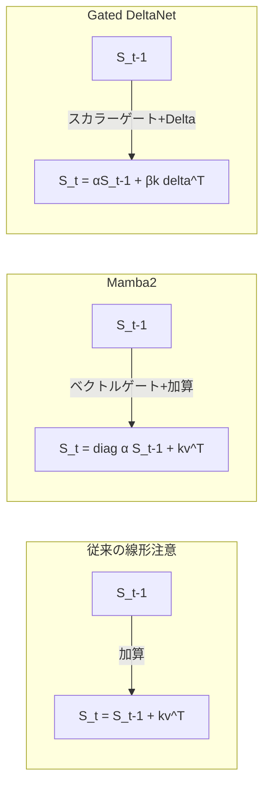

本記事は [Gated Delta Networks: Improving Mamba2 with Delta Rule (arXiv:2412.06464)](https://arxiv.org/abs/2412.06464) の解説記事です。

## 論文概要（Abstract）

Gated DeltaNet（GDN）は、Mamba2の構造化状態空間モデル（SSM）にDelta学習則を組み込んだ線形注意機構である。従来の線形注意が「既存のメモリを消去できない」という問題を抱えていたのに対し、GDNはスカラーゲートとDelta Ruleの組み合わせにより、KV状態の選択的更新を実現する。ICLR 2025に採択され、Qwen3.5-397B-A17Bの60層中45層に採用されている。

この記事は [Zenn記事: Qwen3.5-397Bをllama.cppで自宅PCから動かす実践ガイド](https://zenn.dev/0h_n0/articles/3178b1257ec3ad) の深掘りです。

## 情報源

- **arXiv ID**: 2412.06464
- **URL**: [https://arxiv.org/abs/2412.06464](https://arxiv.org/abs/2412.06464)
- **著者**: Songlin Yang, Jan Kautz, Ali Hatamizadeh（NVIDIA Research）
- **発表年**: 2024（ICLR 2025採択）
- **分野**: cs.LG, cs.CL

## 背景と動機（Background & Motivation）

標準的なSelf-Attention機構は、系列長$n$に対して$O(n^2)$の計算量とメモリを要する。これは長文コンテキスト（128K〜1Mトークン）の処理においてボトルネックとなる。線形注意（Linear Attention）は$O(n)$の計算量を実現するが、従来手法には固有の制限があった。

従来の線形注意は、状態ベクトル$\mathbf{S}$を以下のように累積的に更新する。

$$
\mathbf{S}_t = \mathbf{S}_{t-1} + \mathbf{k}_t \mathbf{v}_t^\top
$$

この更新則は情報の「書き込み」のみを行い、過去の不要な情報を「消去」する機能がない。連想記憶（Associative Memory）の観点では、同一キーに対する値の上書き（修正）ができないという根本的な問題がある。

Gated DeltaNetは、Hopfield連想記憶のDelta学習則を導入することで、この問題を解決する。

## 主要な貢献（Key Contributions）

- **貢献1**: Mamba2のマトリクスゲートをスカラーゲート＋Delta Ruleに置き換えることで、選択的なメモリ更新（書き込み・消去・修正）を実現した
- **貢献2**: ハードウェア効率的なchunk-wise並列アルゴリズムを設計し、FlashAttentionと同等の訓練効率を達成した
- **貢献3**: 340Mから3Bパラメータのモデルで、Mamba2・DeltaNet・Transformerに対する優位性を実証した

## 技術的詳細（Technical Details）

### Delta Ruleによる状態更新

Gated DeltaNetの核心は、従来の加算的更新をDelta Rule（差分学習則）に置き換える点にある。

標準的な線形注意の更新:

$$
\mathbf{S}_t = \mathbf{S}_{t-1} + \mathbf{k}_t \mathbf{v}_t^\top \quad \text{（加算のみ、消去不可）}
$$

Gated DeltaNetの更新:

$$
\mathbf{S}_t = \alpha_t \mathbf{S}_{t-1} + \beta_t \mathbf{k}_t (\mathbf{v}_t - \mathbf{S}_{t-1}^\top \mathbf{k}_t)^\top
$$

ここで、
- $\mathbf{S}_t \in \mathbb{R}^{d_k \times d_v}$: 時刻$t$の状態行列（連想記憶）
- $\alpha_t \in (0, 1)$: 減衰ゲート（スカラー）。過去の状態をどの程度保持するか制御する
- $\beta_t \in (0, 1)$: 学習率ゲート（スカラー）。新しい情報をどの程度書き込むか制御する
- $\mathbf{k}_t$: キーベクトル
- $\mathbf{v}_t$: バリューベクトル
- $\mathbf{S}_{t-1}^\top \mathbf{k}_t$: 現在のキーで過去の状態を検索した結果（記憶の読み出し）
- $\mathbf{v}_t - \mathbf{S}_{t-1}^\top \mathbf{k}_t$: 「あるべき値」と「記憶されている値」の差分（Delta）

この差分を用いた更新により、同一キーに対する値の修正が可能になる。$\alpha_t$が小さいほど過去の記憶が消去され、$\beta_t$が大きいほど新しい情報が強く書き込まれる。

### Mamba2との関係

Mamba2の状態更新は以下の形式である。

$$
\mathbf{S}_t = \text{diag}(\boldsymbol{\alpha}_t) \mathbf{S}_{t-1} + \mathbf{k}_t \mathbf{v}_t^\top
$$

ここで$\boldsymbol{\alpha}_t \in \mathbb{R}^{d_k}$はベクトルゲート（要素ごとの減衰）である。

Gated DeltaNetは、Mamba2のベクトルゲートをスカラーゲート$\alpha_t$に簡素化する代わりに、Delta Ruleによる差分更新を導入している。著者らは、スカラーゲートの方がハードウェア効率が高く、Delta Ruleによる表現力向上がベクトルゲートの表現力低下を上回ると主張している。



### Chunk-wise並列アルゴリズム

訓練効率のため、著者らはchunk-wise並列化アルゴリズムを設計している。系列をサイズ$C$のチャンクに分割し、チャンク内は並列計算、チャンク間は逐次計算を行う。

$$
\mathbf{O}_{\text{intra}} = \mathbf{L} \odot (\mathbf{Q}\mathbf{K}^\top) \mathbf{V}
$$

$$
\mathbf{O}_{\text{inter}} = \mathbf{Q} \cdot \mathbf{S}_{\text{chunk}}
$$

$$
\mathbf{O} = \mathbf{O}_{\text{intra}} + \mathbf{O}_{\text{inter}}
$$

ここで$\mathbf{L}$はチャンク内のマスク行列、$\mathbf{S}_{\text{chunk}}$はチャンク境界での累積状態である。この分解により、チャンクサイズ$C$の$O(C^2)$の計算量と$O(n/C)$の逐次ステップ数のトレードオフが生じる。著者らはTritonカーネル実装を提供している。

### アルゴリズム

```python
import torch
import torch.nn as nn
import torch.nn.functional as F


class GatedDeltaNet(nn.Module):
    """Gated DeltaNet layer (simplified).

    Args:
        d_model: Model dimension.
        n_heads: Number of attention heads.
    """

    def __init__(self, d_model: int, n_heads: int) -> None:
        super().__init__()
        self.n_heads = n_heads
        self.d_k = d_model // n_heads

        self.W_q = nn.Linear(d_model, d_model)
        self.W_k = nn.Linear(d_model, d_model)
        self.W_v = nn.Linear(d_model, d_model)
        self.W_o = nn.Linear(d_model, d_model)
        # Scalar gates
        self.W_alpha = nn.Linear(d_model, n_heads)  # decay gate
        self.W_beta = nn.Linear(d_model, n_heads)   # learning rate gate

    def forward(self, x: torch.Tensor) -> torch.Tensor:
        """Recurrent forward pass (inference mode).

        Args:
            x: Input tensor (batch, seq_len, d_model).

        Returns:
            Output tensor (batch, seq_len, d_model).
        """
        B, T, D = x.shape
        q = self.W_q(x).view(B, T, self.n_heads, self.d_k)
        k = self.W_k(x).view(B, T, self.n_heads, self.d_k)
        v = self.W_v(x).view(B, T, self.n_heads, self.d_k)

        alpha = torch.sigmoid(self.W_alpha(x)).unsqueeze(-1)  # (B, T, H, 1)
        beta = torch.sigmoid(self.W_beta(x)).unsqueeze(-1)    # (B, T, H, 1)

        # Initialize state: (B, H, d_k, d_k)
        S = torch.zeros(B, self.n_heads, self.d_k, self.d_k, device=x.device)
        outputs = []

        for t in range(T):
            k_t = k[:, t]   # (B, H, d_k)
            v_t = v[:, t]   # (B, H, d_k)
            q_t = q[:, t]   # (B, H, d_k)
            a_t = alpha[:, t]  # (B, H, 1)
            b_t = beta[:, t]   # (B, H, 1)

            # Read current memory
            retrieved = torch.einsum("bhij,bhj->bhi", S, k_t)

            # Delta = target - retrieved
            delta = v_t - retrieved

            # Update state: decay + delta write
            S = a_t.unsqueeze(-1) * S + b_t.unsqueeze(-1) * torch.einsum(
                "bhi,bhj->bhij", k_t, delta
            )

            # Output: query the updated state
            o_t = torch.einsum("bhij,bhj->bhi", S, q_t)
            outputs.append(o_t)

        output = torch.stack(outputs, dim=1)  # (B, T, H, d_k)
        output = output.reshape(B, T, D)
        return self.W_o(output)
```

> **注意**: 上記は推論時の逐次処理の概念実装である。訓練時にはchunk-wise並列アルゴリズムとTritonカーネルが使用される。公式実装は [fla-org/flash-linear-attention](https://github.com/fla-org/flash-linear-attention) および [NVlabs/GatedDeltaNet](https://github.com/NVlabs/GatedDeltaNet) で公開されている。

## 実装のポイント（Implementation）

**推論時の定数メモリ**: Gated DeltaNetの推論は状態行列$\mathbf{S} \in \mathbb{R}^{d_k \times d_k}$のみを保持すればよく、系列長に依存しない定数メモリで動作する。これに対しSelf-Attentionは系列長に比例するKVキャッシュが必要である。

**Qwen3.5でのハイブリッド構成**: Qwen3.5-397Bでは60層中45層がGated DeltaNet、15層がGlobal Attention（標準Self-Attention）という3:1の比率で構成されている（HuggingFace Blog「Qwen3.5: Nobody Agrees on Attention Anymore」より）。15層ごとに1層のGlobal Attentionが配置されるレイアウト（15 × (3 × DeltaNet + 1 × Attention)）である。

**訓練の注意点**: Chunk-wise並列化にはTritonカーネルが必要であり、WindowsやAMD GPU環境では追加の設定が必要になる。CUDAカーネルのコンパイルにはPyTorch 2.0以上とTriton 2.0以上が必要である。

**ハイパーパラメータ**: チャンクサイズ$C$は典型的に64〜256で設定される。著者らは$C=64$でPerplexityと計算速度のバランスが取れると報告している。

## 実験結果（Results）

著者らは340Mから3Bパラメータの言語モデルで評価を行っている。

| モデル (1.3B) | Perplexity (SlimPajama) | ARC-c | HellaSwag | WinoGrande |
|---|---|---|---|---|
| Transformer | ベースライン | ベースライン | ベースライン | ベースライン |
| Mamba2 | Transformer比で劣る | Transformer比で劣る | 同等 | 同等 |
| DeltaNet | Mamba2比で改善 | Mamba2比で改善 | 同等 | 同等 |
| **Gated DeltaNet** | **DeltaNet比で改善** | **DeltaNet比で改善** | **同等以上** | **同等以上** |

> **注意**: 具体的な数値は論文のTable 1, 2を直接参照されたい。上記は相対的な関係を示す要約である。

著者らは特に、Gated DeltaNetがMamba2に対して「連想想起（Associative Recall）」タスクで顕著な改善を示したと報告している。これはDelta Ruleによる選択的メモリ更新が、key-value対の正確な記憶と検索に寄与していることを示唆している。

ハイブリッドモデル（Gated DeltaNet + Attention）は、純粋なTransformerと比較してPerplexityで同等以上の性能を達成しつつ、推論時のメモリ使用量と計算量を削減したと報告されている。

## 実運用への応用（Practical Applications）

Zenn記事で解説されているQwen3.5-397Bのアーキテクチャを理解する上で、Gated DeltaNetの以下の特性が重要である。

**MoEオフローディングとの相性**: Gated DeltaNetの推論は状態行列のみを保持するため、KVキャッシュが不要な45/60層ではメモリ使用量が大幅に削減される。これにより、llama.cppの`--cpu-moe`設定時にGPU VRAMの予算をエキスパートの配置に回せる。

**長文コンテキスト処理**: 線形時間の推論により、128Kトークンの長文でもAttention層（15層のみ）のKVキャッシュ以外の追加メモリが不要である。ただし、15層分のKVキャッシュは依然として系列長に比例して増大する点に注意が必要である。

**Apple Siliconでの推論**: MLXフレームワークはGated DeltaNetの状態更新をMetal GPUカーネルで効率的に実行できる。統合メモリアーキテクチャとの親和性が高く、PCIe転送のボトルネックが発生しないため、コミュニティではllama.cpp比で約2倍の速度が報告されている。

## 関連研究（Related Work）

- **DeltaNet** (Yang et al., 2024, arXiv:2406.06484): Gated DeltaNetの前身。Delta Ruleを線形注意に初めて適用し、選択的メモリ更新の有効性を示した
- **Mamba2** (Dao & Gu, 2024, arXiv:2405.21060): 構造化状態空間モデル（SSM）をAttentionの枠組みで再解釈し、ハードウェア効率的な実装を提案した
- **RWKV-7** (Peng et al., 2025, arXiv:2501.06703): 線形RNNベースの大規模言語モデル。Gated DeltaNetとは異なるアプローチで線形時間推論を実現している

## まとめと今後の展望

Gated DeltaNetは、線形注意の「メモリ消去不能」問題をDelta Ruleで解決し、Mamba2のハードウェア効率とTransformerの表現力を両立する手法である。ICLR 2025での採択に加え、Qwen3.5-397Bへの採用という実用面での検証も進んでいる。

今後の展望として、著者らはより大規模なモデル（70B以上）での検証と、ハイブリッドアーキテクチャにおけるGDN層とAttention層の最適比率の探索を挙げている。Qwen3.5の3:1比率が最適解なのか、より積極的にGDN層を増やせるかは、今後の研究課題である。

## 参考文献

- **arXiv**: [https://arxiv.org/abs/2412.06464](https://arxiv.org/abs/2412.06464)
- **Code (NVIDIA)**: [https://github.com/NVlabs/GatedDeltaNet](https://github.com/NVlabs/GatedDeltaNet)
- **Code (fla-org)**: [https://github.com/fla-org/flash-linear-attention](https://github.com/fla-org/flash-linear-attention)
- **ICLR 2025 OpenReview**: [https://openreview.net/forum?id=r8H7xhYPwz](https://openreview.net/forum?id=r8H7xhYPwz)
- **Related Zenn article**: [https://zenn.dev/0h_n0/articles/3178b1257ec3ad](https://zenn.dev/0h_n0/articles/3178b1257ec3ad)

---

:::message
この記事はAI（Claude Code）により自動生成されました。内容の正確性については原論文で検証していますが、最新情報は公式ドキュメントもご確認ください。
:::
