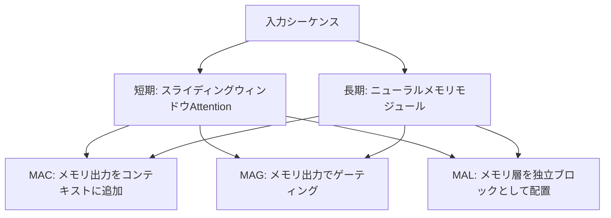

## 論文概要

本記事は [https://arxiv.org/abs/2501.00663](https://arxiv.org/abs/2501.00663) の解説記事です。

Ali Behrouz, Peilin Zhong, Vahab Mirrokni（Google Research）による本論文は、推論時（テスト時）にMLPの重みを勾配ベースで更新することで長期記憶を実現する**Titans**アーキテクチャを提案する。中核となるのは**surprise機構**で、モデルの予測と実際の入力の乖離を検出し、驚きが大きい情報を優先的にメモリへ書き込む。BABILongベンチマークでは少ないパラメータ数でGPT-4を上回り、200万トークン以上のコンテキストへのスケーリングが報告されている。

この記事は [Zenn記事: LLMエージェントの長期記憶2026年最新動向 Mem0・A-Mem・Titansの実装と比較](https://zenn.dev/0h_n0/articles/8b6e6b07d36c5d) の深掘りです。

## 情報源

- **arXiv ID**: 2501.00663
- **URL**: [https://arxiv.org/abs/2501.00663](https://arxiv.org/abs/2501.00663)
- **著者**: Ali Behrouz, Peilin Zhong, Vahab Mirrokni（Google Research）
- **発表年**: 2025年1月
- **分野**: cs.LG, cs.AI, cs.CL

## 背景と動機

大規模言語モデルにおける長文脈処理には、二つの根本的な課題がある。

1. **Transformerの$O(n^2)$問題**: Softmax Attentionは入力長の二乗に比例してKVキャッシュとFLOPsが増大する。100万トークン規模ではKVキャッシュだけで数百GBのGPUメモリを消費し、推論コストが現実的でなくなる。コンテキスト長を拡大するための手法（RoPE外挿、ALiBi等）はある程度機能するが、計算量の根本的な制約は解消されない。
2. **RNN/SSMの固定次元メモリ**: MambaやRWKVなどの線形再帰モデルは推論コストが$O(1)$だが、固定次元の隠れ状態に全履歴を圧縮するため、長距離依存の忠実な保持に限界がある。特に「干し草の中の針」タスク（大量のテキストから特定の事実を検索する）では、圧縮による情報損失が顕著となる。

人間の記憶システムは短期記憶と長期記憶を使い分けており、重要な情報を選択的に長期記憶へ移行する。心理学における「驚き」（unexpected event）が記憶定着を促進するという知見は、Titansの設計に直接的なインスピレーションを与えている。Titansはこの着想を形式化し、**推論時に学習する長期メモリモジュール**をTransformerの短期Attentionと組み合わせることで、両方の利点を統合する。

## 主要な貢献

- **ニューラル長期メモリモジュール**: MLPの重みそのものを記憶媒体として利用し、推論時に勾配降下で更新する仕組みを提案
- **Surprise機構**: 入力に対する損失勾配のノルムを「驚き」と定義し、記憶の書き込み量を動的に制御
- **モメンタム付き記憶更新**: 指数移動平均による過去のsurpriseの蓄積で、関連する連続情報の取りこぼしを防止
- **適応的重み減衰（忘却ゲート）**: 有限容量のメモリから陳腐化した情報を選択的に除去
- **3つのアーキテクチャ変種**: Memory as Context（MAC）、Memory as Gate（MAG）、Memory as Layer（MAL）の提案と評価

## 技術的詳細

### Surprise機構

Titansの記憶更新の核心は、入力$x_t$に対する「驚き」の定量化にある。時刻$t$におけるメモリモジュールのパラメータを$\theta_t$とし、損失関数$\mathcal{L}$を用いてsurpriseを定義する：

$$\text{surprise}(x_t) = \lVert \nabla_{\theta} \mathcal{L}(x_t; \theta_t) \rVert$$

ここで$\nabla_{\theta}\mathcal{L}$はメモリパラメータに関する損失の勾配、$\lVert \cdot \rVert$はそのノルムである。直感的には、現在のメモリがうまく予測できない（損失が大きい）入力ほどsurpriseが大きくなり、メモリ更新の強度が増す。逆に、既に記憶済みの冗長な情報は小さいsurpriseとなり、更新が抑制される。

### ニューラル長期メモリモジュール

従来のメモリ手法が固定サイズのベクトルや行列を記憶媒体とするのに対し、Titansは**MLP（多層パーセプトロン）の重み**を記憶媒体とする。MLPは万能近似能力（Universal Approximation Theorem）を持つため、固定次元ベクトルと比較して大量の情報をコンパクトに符号化できる。

この設計の直感的な理解として、従来のkey-value型メモリ（例えばLinear Attentionの外積和）が低ランク行列に情報を格納するのに対し、MLPは非線形変換を通じてより表現力の高い関数空間にマッピングを学習する。論文ではこの差を「associative memory vs. neural memory」として区別している。

メモリの読み書きは以下のように行われる：

**メモリ読み出し（retrieve）**:

$$y_t = M_{\theta_t}(q_t)$$

ここで$M_{\theta_t}$はパラメータ$\theta_t$を持つMLPモジュール、$q_t$はクエリベクトルである。$q_t$は入力$x_t$から線形射影で生成される。

**メモリ書き込み（update）**: surprise機構に基づく勾配降下で重みを更新する：

$$\theta_{t+1} = \theta_t - \eta_t \cdot \nabla_{\theta} \mathcal{L}(x_t; \theta_t)$$

$\eta_t$は学習率で、surpriseの大きさに応じて動的に調整される。この更新はテスト時にオンラインで行われる点が従来の学習フレームワークと根本的に異なる。損失関数$\mathcal{L}$には連想記憶損失（associative memory loss）が用いられ、キー$k_t$からバリュー$v_t$への写像をメモリが正しく再現できるかを測定する。

### モメンタム機構

単一トークンのsurpriseだけでは、文脈的に関連する連続的な情報を見落とす可能性がある。例えば、新しいトピックの最初のトークンは高surpriseだが、同じトピックの続きは個別には低surpriseとなりうる。著者らはモメンタム（指数移動平均）を導入してこの問題に対処する：

$$s_t = \beta \cdot s_{t-1} + (1 - \beta) \cdot \nabla_{\theta} \mathcal{L}(x_t; \theta_t)$$

$s_t$は時刻$t$におけるモメンタム項、$\beta \in [0, 1)$は減衰係数である。これにより、瞬間的なsurpriseだけでなく過去のsurprise履歴が蓄積され、関連する後続情報も確実にメモリへ取り込まれる。

### 適応的重み減衰（忘却ゲート）

メモリ容量は有限であるため、陳腐化した情報を適切に忘却する機構が必要である。著者らは入力依存の重み減衰率$\alpha_t$を導入する：

$$\theta_{t+1} = (1 - \alpha_t) \cdot \theta_t - \eta_t \cdot s_t$$

$\alpha_t$はゲートネットワークにより入力$x_t$から動的に計算される。この機構は、新しい重要情報の書き込みと古い情報の除去のバランスを自動的に調整する。

### 3つのアーキテクチャ変種

Titansは長期メモリモジュールと短期Attention（スライディングウィンドウ）の統合方法として3つの変種を提案している：

- **MAC（Memory as Context）**: メモリから取り出した情報をAttentionの入力コンテキストに連結する。具体的には、メモリ出力$y_t^{\text{mem}}$をKVの先頭にprefixとして付加し、短期Attentionが長期記憶の情報を直接参照できるようにする。論文の実験では最も高い性能を示した変種である
- **MAG（Memory as Gate）**: メモリ出力をゲーティング機構として使い、Attention出力を変調する。$o_t = \sigma(y_t^{\text{mem}}) \odot y_t^{\text{attn}}$の形式で、長期記憶が短期処理の重み付けをシグモイドゲートで制御する
- **MAL（Memory as Layer）**: メモリモジュールを独立した層として配置し、Attention層と交互に積む。最もシンプルな統合方式で、既存のTransformerアーキテクチャに追加層として挿入しやすい

## MIRASフレームワーク

### 概要

著者らはTitansの拡張として、**MIRAS（Memory Is Regularized Approximate Surprise）**フレームワーク（arXiv: 2504.13173）を提案している。MIRASはTitansの記憶更新機構を一般化し、既存のシーケンスモデルを4つの設計軸で統一的に分類する。

### 4つの設計軸

1. **Memory Architecture（メモリ構造）**: メモリの物理的構造を規定する軸。固定サイズベクトル（RNN隠れ状態）、行列（Linear Attentionの外積和）、MLP（Titans）などが含まれる。構造の選択がメモリ容量と計算効率を決定する
2. **Attentional Bias（注意バイアス）**: どの入力に注意を向けるかの方針。因果マスク、位置バイアス（ALiBi）、入力依存ゲート等が該当する。Titansではsurprise機構がこの役割を果たす
3. **Retention Gate（保持ゲート）**: 情報の保持と忘却のバランス制御。Titansの適応的重み減衰、GRUの更新ゲート、Mambaの選択機構などが分類される
4. **Memory Algorithm（メモリアルゴリズム）**: 記憶の書き込み・読み出し手続き。勾配降下、デルタルール、外積加算などの更新規則が含まれる

### 3つの変種

MIRASフレームワーク上で、損失関数の正則化項の選択により3つの具体的モデルが導かれる：

- **YAAD**: Huber損失を使用。外れ値に対してロバストで、ノイズの多い入力環境で安定した記憶更新を実現する
- **MONETA**: 一般化ノルムを使用。勾配の安定性を重視し、長いシーケンスでの学習安定性に優れる
- **MEMORA**: 確率分布制約を使用。メモリ更新量を確率的に制御し、過剰な書き込みを防ぐ

MIRASの意義は、Transformer、Mamba、Linear Attentionなど異なるアーキテクチャをメモリシステムの観点から統一的に理解できる点にある。例えば、標準的なTransformerのAttentionはMemory Architecture=行列（KVキャッシュ）、Attentional Bias=Softmax因果マスク、Retention Gate=なし（全情報保持）、Memory Algorithm=外積加算と位置づけられる。一方、MambaはMemory Architecture=ベクトル、Retention Gate=選択機構と分類できる。この枠組みにより、各モデルの設計上の選択を4軸上の位置として体系的に比較でき、新しいアーキテクチャ設計の指針となる。

## 実装のポイント

Titansのメモリ更新は推論時の勾配計算を伴うため、実装上いくつかの考慮が必要である。

- **メモリモジュールのサイズ**: MLPの層数と隠れ次元がメモリ容量と計算コストのトレードオフを決定する。論文Section 5より、より深いメモリモジュールがより低いパープレキシティを達成することが報告されている
- **勾配計算のオーバーヘッド**: テスト時に各トークンで順伝播+逆伝播が必要となる。通常のTransformerの推論と比べて追加の計算コストが発生するため、バッチ処理やチャンク化による効率化が求められる
- **ハイパーパラメータ**: モメンタム係数$\beta$、重み減衰率の初期値、メモリモジュールの学習率$\eta$はタスクに応じた調整が必要である
- **学習**: 内部ループ（メモリ更新）と外部ループ（モデル全体の学習）の二重最適化構造を持ち、メタ学習的な訓練が行われる

なお、2026年3月時点でTitansの商用プリトレインモデルは公開されていない。研究段階であり、再現実装にはモデルの学習から行う必要がある。

## 実験結果

### 言語モデリング

論文Table 1より、C4およびWikiTextデータセットにおけるパープレキシティの比較が報告されている。Titansの各変種（MAC, MAG, MAL）は、同パラメータ数のMamba-2やGated DeltaNetを一貫して上回っている。特にMAC変種は最も低いパープレキシティを達成している。ベースラインとの比較対象には、Transformer++（改良型Transformer）、Mamba、Mamba-2、Gated DeltaNet、DeltaNetが含まれる。

### BABILong

BABILongベンチマークは、長大なコンテキストの中に埋め込まれた特定の事実を正確に検索する能力を評価するタスクである。コンテキスト長は4Kから512Kまで段階的に増加させて評価される。論文Table 3より、Titansは**GPT-4よりも少ないパラメータ数でありながら高い精度**を達成したと報告されている。著者らはこの結果について、surprise機構が長いコンテキスト中の重要な事実を選択的にメモリへ書き込み、無関係な情報を効率的に無視できることが要因であると分析している。

### 長コンテキストスケーリング

論文Section 5の実験より、Titansは200万トークン以上のコンテキスト長へのスケーリングが可能であると報告されている。ニューラルメモリの容量はMLPのパラメータ数に依存し、コンテキスト長に対して線形にスケールする固定サイズKVキャッシュとは異なるスケーリング特性を持つ。具体的には、短期Attentionのウィンドウサイズは固定（例：4096トークン）のまま、長期メモリが全体の文脈を補完する構造のため、コンテキスト長の増大に対してAttentionの計算量は増加しない。

### メモリ深度の影響

著者らは、メモリモジュールの深さ（MLP層数）とパープレキシティの関係を調査している。論文Figure 5より、1層MLPから3層MLPへと深くするにつれてパープレキシティが一貫して低下することが確認されている。これはMLPの層数が増えるほど非線形表現力が向上し、より複雑な情報パターンを記憶に符号化できるためと考えられる。ただし層数の増加は推論時の勾配計算コストも増大させるため、実用上のトレードオフが存在する。

## 実運用への応用

Titansのアーキテクチャが実用化された場合、以下のようなユースケースが考えられる：

- **長大文書の要約・質問応答**: 書籍全体やコードリポジトリなど、100万トークン規模の入力に対する処理
- **対話エージェントの長期記憶**: セッションをまたいだ記憶の保持。surprise機構により重要な対話のみを選択的に記憶
- **ストリーミング処理**: メモリ更新がオンラインで行えるため、逐次的にデータが到着する場面との親和性が高い

ただし以下の制約がある：

- **推論時の勾配計算コスト**: 各トークンで逆伝播が必要なため、レイテンシが増加する。リアルタイム応答が求められるアプリケーションではボトルネックとなりうる
- **プリトレインモデルの不在**: 2026年3月時点で公開済みの学習済みモデルが存在せず、実運用にはフルスクラッチでの学習が必要
- **メモリの解釈性**: MLPの重みに格納された情報の内容を人間が直接解釈することは困難

## 関連研究

Titansは以下の研究系譜の上に位置する：

- **Mamba-2**（Dao & Gu, 2024）: SSMとAttentionのSSD等価性を示し、効率的なシーケンスモデリングを実現。Titansはこれに長期メモリ層を追加する位置づけであり、短期処理部分にMamba-2を採用する変種も検討されている
- **Gated DeltaNet**（Yang et al., 2024）: 線形Attentionにデルタルールを組み合わせた再帰モデル。TitansはDeltaNetのメモリ更新則をMLPベースに一般化したものと解釈できる。DeltaNetが低ランク行列に情報を格納するのに対し、TitansはMLPの非線形変換を用いてより高い表現力を持つ
- **MemGPT / Letta**（Packer et al., 2023）: 外部メモリをシステムレベルで管理するアプローチ。LLMのコンテキストウィンドウを仮想メモリのように扱い、ページイン/ページアウトで情報を管理する。Titansはメモリ機構をモデル内部に統合する点で異なり、明示的なメモリ管理ロジックが不要
- **Infini-Attention**（Munkhdalai et al., 2024）: Transformerに圧縮メモリを追加して無限コンテキストを目指す。メモリの更新にはLinear Attentionの外積和を用いる。Titansはsurprise機構による選択的書き込みとMLPベースのメモリが差別化ポイント

## まとめと今後の展望

Titansは「推論時に学習するメモリ」という新しいパラダイムを提案し、surprise機構による選択的記憶書き込みと適応的忘却の仕組みを定式化した。MIRASフレームワークによる理論的統一も、今後のアーキテクチャ設計に示唆を与える。

今後の発展として、プリトレインモデルの公開、推論時勾配計算の効率化（近似手法やハードウェアレベルの最適化）、そしてMIRAS変種のタスク別性能比較が期待される。

## 参考文献

- Behrouz, A., Zhong, P., & Mirrokni, V. (2025). Titans: Learning to Memorize at Test Time. [arXiv:2501.00663](https://arxiv.org/abs/2501.00663)
- Behrouz, A., Zhong, P., & Mirrokni, V. (2025). MIRAS: Memory Is Regularized Approximate Surprise. [arXiv:2504.13173](https://arxiv.org/abs/2504.13173)
- Dao, T., & Gu, A. (2024). Transformers are SSMs: Generalized Models and Efficient Algorithms Through Structured State Space Duality. [arXiv:2405.21060](https://arxiv.org/abs/2405.21060)
- Yang, S., et al. (2024). Gated Delta Networks: Improving Mamba2 with Delta Rule. [arXiv:2412.06464](https://arxiv.org/abs/2412.06464)
- Zenn記事: [LLMエージェントの長期記憶2026年最新動向 Mem0・A-Mem・Titansの実装と比較](https://zenn.dev/0h_n0/articles/8b6e6b07d36c5d)
