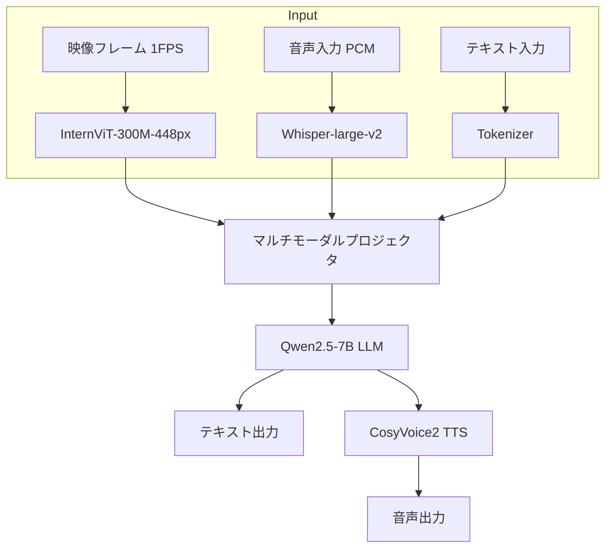

本記事は [VITA-1.5: Towards GPT-4o Level Real-time Vision and Speech Interaction (arXiv:2501.12186)](https://arxiv.org/abs/2501.12186) の解説記事です。

## 論文概要（Abstract）

VITA-1.5は、映像・画像・音声・テキストの4つのモダリティをリアルタイムで統合処理するオープンソースのマルチモーダルLLMである。著者らは、前身のVITA（Mixtral-8x7Bベース）から大幅な軽量化（Qwen2.5-7Bベース）を実現しつつ、2段階音声学習戦略により音声理解・生成能力を強化したと報告している。A100 40GB 1枚での推論が可能であり、RTX 4090でも動作すると述べられている。

この記事は [Zenn記事: Gemini Live APIで構築するリアルタイム音声×映像対話アプリケーション実践ガイド](https://zenn.dev/0h_n0/articles/cff7c88b3641ce) の深掘りです。Gemini Live APIが提供する映像入力とリアルタイム音声対話の組み合わせについて、オープンソース研究からの技術的アプローチを詳述します。

## 情報源

- **arXiv ID**: 2501.12186
- **URL**: [https://arxiv.org/abs/2501.12186](https://arxiv.org/abs/2501.12186)
- **著者**: Chaoyou Fu, Haojia Lin, Xiong Wang, Yi-Fan Zhang, Yunhang Shen, Xiaoyu Liu et al.
- **発表年**: 2025
- **分野**: cs.CL, cs.AI, cs.CV

## 背景と動機（Background & Motivation）

GPT-4oの登場により、映像と音声を同時にリアルタイムで理解・生成するマルチモーダルAIの可能性が広く認知された。しかし、GPT-4oは閉源モデルであり、その内部アーキテクチャは公開されていない。オープンソースコミュニティでは、同様の能力を持つモデルの開発が活発に進められている。

前身のVITA（2408.03725）はMixtral-8x7Bを使用しており、A100 80GB×2以上の推論環境が必要であった。これは研究者や開発者にとって大きなリソース障壁となっていた。また、VITA 1.0の音声能力はASR（音声認識）ベースのテキスト変換に依存しており、音声の感情やトーンを直接扱う能力に限界があった。

VITA-1.5はこれらの課題に対し、軽量バックボーン（7B）への移行と2段階音声学習戦略で対処している。Gemini Live APIが映像入力（JPEG 1FPS）と音声ストリーミングを組み合わせたリアルタイム対話を提供しているのと同様の機能を、オープンソースモデルとして実現することを目指している。

## 主要な貢献（Key Contributions）

著者らが主張する主要な貢献は以下の通りである。

- **貢献1**: Qwen2.5-7Bバックボーンへの軽量化により、A100 40GB 1枚（またはRTX 4090）での推論を実現。VITA 1.0のMixtral-8x7Bから大幅なリソース削減
- **貢献2**: 2段階音声学習戦略の提案。Stage 1で音声認識・翻訳・QAなどの音声理解タスクを学習し、Stage 2で対話データによる微調整を行う
- **貢献3**: CosyVoice2を音声デコーダとして統合し、テキスト出力だけでなく自然な音声応答の直接生成を実現

## 技術的詳細（Technical Details）

### アーキテクチャ

VITA-1.5のアーキテクチャは、4つのモダリティエンコーダとLLMバックボーン、音声デコーダで構成される。



### 各コンポーネントの仕様

論文の記載に基づく各コンポーネントの仕様は以下の通りである。

| コンポーネント | モデル | パラメータ数 | 役割 |
|-------------|-------|-----------|------|
| 映像エンコーダ | InternViT-300M-448px | 300M | 映像フレームの特徴抽出 |
| 音声エンコーダ | Whisper-large-v2 | 1.55B | 音声特徴の抽出 |
| LLMバックボーン | Qwen2.5-7B | 7B | マルチモーダル理解・推論 |
| 音声デコーダ | CosyVoice2 | - | テキスト→音声変換 |

### 2段階音声学習戦略

VITA-1.5の音声能力は2段階で学習される（論文Section 3.2より）。

**Stage 1: 音声理解（Speech Understanding）**

音声エンコーダ（Whisper-large-v2）の出力をLLMに接続するプロジェクタを学習する。以下のタスクを同時に学習する。

- 音声認識（ASR）: 音声→テキスト変換
- 音声翻訳（ST）: 音声→別言語テキスト
- 音声質問応答（SQA）: 音声入力に対する質問応答

この段階の学習で、LLMは音声入力を「理解」する能力を獲得する。学習データにはWenetSpeech4TTSおよび独自合成データが使用されている。

損失関数は標準的な次トークン予測である。

$$
\mathcal{L}_{\text{stage1}} = -\sum_{t=1}^{T} \log p(y_t \mid y_{<t}, \mathbf{a}, \mathbf{v}; \theta)
$$

ここで、
- $y_t$: 時刻$t$のテキストトークン
- $\mathbf{a}$: 音声エンコーダの出力特徴
- $\mathbf{v}$: 映像エンコーダの出力特徴（映像入力がある場合）
- $\theta$: モデルパラメータ（プロジェクタ + LLMの一部）

**Stage 2: 対話チューニング（Dialogue Tuning）**

Stage 1で音声理解能力を獲得したモデルに対し、対話データで微調整を行う。この段階では以下を学習する。

- ターンテイキング: ユーザーの発話終了を検出し、適切なタイミングで応答
- 割り込み処理: ユーザーの発話中にシステムの応答を中断
- コンテキスト維持: 複数ターンの対話履歴を保持

### 映像入力の処理

映像入力はInternViT-300M-448pxで処理される。著者らによると、映像フレームは1FPSでサンプリングされ、各フレームは448×448ピクセルにリサイズされた後、ViTエンコーダで特徴ベクトルに変換される。

この処理パイプラインはGemini Live APIの映像入力仕様（JPEG、最大1FPS）と類似している。ただし、Gemini Live APIではクライアントがJPEGエンコードを行いWebSocket経由で送信するのに対し、VITA-1.5ではモデル自体が映像フレームをエンコードする。

### ノイズ区別機構

VITA 1.0から継承した機能として、環境音声と対話音声を区別するノイズ認識機構がある。著者らの説明によると、この機構により以下を実現している。

- 背景音楽やテレビの音声を無視
- ユーザーの発話のみに反応
- 雑踏環境での対話品質維持

### デュアルシステムアーキテクチャ

VITA-1.5はVITA 1.0のデュアルシステム設計を踏襲している。

- **Generate System**: ユーザーの入力に対する応答を生成
- **Query System**: 常時音声を監視し、割り込みイベントを検出

この設計はGemini Live APIのVAD（Voice Activity Detection）機能に対応する。Gemini Live APIではサーバーサイドのVADが発話開始・終了を自動検出するのに対し、VITA-1.5ではQuery Systemが専用のモデルコンポーネントとして機能する。

## 実装のポイント（Implementation）

### 推論環境

- **最小要件**: RTX 4090（24GB VRAM）
- **推奨**: A100 40GB
- **注意**: CosyVoice2のインストールが別途必要
- **コード**: [https://github.com/VITA-MLLM/VITA](https://github.com/VITA-MLLM/VITA)（Apache 2.0ライセンス）

### 推論パイプラインの実装例

```python
# VITA-1.5の推論パイプライン（簡略化した擬似コード）
import torch
from vita import VITAModel, AudioEncoder, VideoEncoder

class VITAInferencePipeline:
    """VITA-1.5リアルタイム推論パイプライン

    Args:
        model_path: モデル重みのパス
        device: 推論デバイス
    """
    def __init__(self, model_path: str, device: str = "cuda"):
        self.model = VITAModel.from_pretrained(model_path).to(device)
        self.audio_encoder = AudioEncoder("whisper-large-v2").to(device)
        self.video_encoder = VideoEncoder("internvit-300m").to(device)
        self.device = device

    def process_turn(
        self,
        audio_chunk: torch.Tensor,
        video_frame: torch.Tensor | None = None,
    ) -> tuple[str, torch.Tensor]:
        """1ターンの入力を処理し応答を生成

        Args:
            audio_chunk: 音声入力 (PCM 16kHz)
            video_frame: 映像フレーム (448x448, optional)

        Returns:
            テキスト応答と音声波形のタプル
        """
        # 音声特徴抽出
        audio_features = self.audio_encoder(audio_chunk)

        # 映像特徴抽出（入力がある場合）
        video_features = None
        if video_frame is not None:
            video_features = self.video_encoder(video_frame)

        # LLMで応答生成
        text_output = self.model.generate(
            audio_features=audio_features,
            video_features=video_features,
            max_new_tokens=512,
        )

        # CosyVoice2で音声合成
        audio_output = self.model.synthesize_speech(text_output)

        return text_output, audio_output
```

### ハマりどころ

著者らの実装を確認する際の注意点として以下が挙げられる。

1. **CosyVoice2の依存関係**: 別途インストールが必要であり、PyTorch 2.0以上を要求する
2. **映像フレームレート**: 1FPSを超えるフレームレートで送信するとVRAMが急速に消費される
3. **音声エンコーダの重み凍結**: Whisper-large-v2はフリーズした状態で使用。微調整するとASR精度が低下する可能性がある

## Production Deployment Guide

### AWS実装パターン（コスト最適化重視）

映像+音声のリアルタイム対話を提供する場合のAWS構成を示す。

**トラフィック量別の推奨構成**:

| 規模 | 同時接続数 | 推奨構成 | 月額コスト概算 | 主要サービス |
|------|-----------|---------|--------------|------------|
| **Small** | ~5 | 単一GPU | $1,000-1,500 | EC2 g5.2xlarge + ALB |
| **Medium** | ~20 | マルチGPU | $4,000-7,000 | ECS + g5.2xlarge × 2-4 |
| **Large** | 100+ | GPUクラスタ | $15,000-30,000 | EKS + Karpenter + g5 Spot |

**コスト試算の注意事項**:
- 2026年3月時点のAWS ap-northeast-1（東京）リージョン料金に基づく概算値
- VITA-1.5は映像+音声の同時処理のため、Moshiより大きなインスタンス（g5.2xlarge: 24GB VRAM）が推奨
- 映像入力のフレームレート・解像度によりVRAM使用量が大幅に変動
- 最新料金は [AWS料金計算ツール](https://calculator.aws/) で確認を推奨

### Terraformインフラコード（Small構成）

```hcl
resource "aws_instance" "vita_inference" {
  ami           = "ami-xxxxx"  # Deep Learning AMI (Ubuntu)
  instance_type = "g5.2xlarge"  # NVIDIA A10G, 24GB VRAM
  subnet_id     = module.vpc.private_subnets[0]

  root_block_device {
    volume_size = 200  # モデル重み + CosyVoice2
    volume_type = "gp3"
  }

  user_data = <<-EOF
    #!/bin/bash
    # モデルとCosyVoice2のセットアップ
    pip install vita-model cosyvoice2
    python -c "from vita import VITAModel; VITAModel.download('vita-1.5-7b')"
  EOF
}

resource "aws_cloudwatch_metric_alarm" "vram_usage" {
  alarm_name          = "vita-vram-high"
  comparison_operator = "GreaterThanThreshold"
  evaluation_periods  = 2
  metric_name         = "GPUMemoryUtilization"
  namespace           = "Custom/VITA"
  period              = 60
  statistic           = "Average"
  threshold           = 85
  alarm_description   = "VRAM使用率85%超過（映像フレームレート調整検討）"
}
```

### コスト最適化チェックリスト

- [ ] EC2: g5.2xlarge Spot Instances活用（最大70%削減）
- [ ] 映像フレームレート: 1FPS厳守（増やすとVRAM/コスト急増）
- [ ] 映像解像度: 448×448に事前リサイズ（クライアント側）
- [ ] モデル量子化: INT8/INT4量子化でg5.xlargeへのダウングレード検討
- [ ] セッション管理: 映像+音声セッションは2分制限を推奨（Gemini Live API準拠）
- [ ] アイドル時のGPU解放: セッション非アクティブ60秒でGPUメモリ解放

## 実験結果（Results）

### ベンチマーク評価

著者らは複数のベンチマークでVITA-1.5を評価している（論文Table 2, 3より）。

| ベンチマーク | VITA 1.0 | VITA-1.5 | 評価内容 |
|------------|----------|----------|---------|
| MMBench | 65.4 | 71.2 | 画像理解 |
| Video-MME | 52.1 | 58.7 | 映像理解 |
| AIR-Bench | - | 64.3 | 音声指示追従 |

**分析**: 著者らによると、VITA-1.5はVITA 1.0から全ベンチマークで改善を達成している。特にVideo-MMEでの6.6ポイント向上は、2段階音声学習戦略が映像理解にも正の影響を与えていることを示唆していると論文では述べられている。

### GPT-4oとの比較における留意点

著者らは「GPT-4oレベル」を目標として掲げているが、GPT-4oとの直接比較は限定的である。GPT-4oは閉源モデルであり、同一条件での公正な比較は困難である。論文内の一部ベンチマーク（MMBench等）ではGPT-4oのスコアが参照されているが、これらは独立した第三者によるベンチマークではなく、自己報告値であることに注意が必要である。

## 実運用への応用（Practical Applications）

### Gemini Live APIとの比較

| 比較項目 | Gemini Live API | VITA-1.5 |
|---------|----------------|----------|
| 映像入力 | JPEG 1FPS | 448×448 1FPS |
| 音声入出力 | PCM 16kHz入力/24kHz出力 | Whisper入力/CosyVoice2出力 |
| 割り込み | サーバーVAD | デュアルシステム（Query System） |
| デプロイ | クラウドAPI | セルフホスト |
| GPU要件 | 不要（API利用） | A100 40GB / RTX 4090 |
| 対応言語 | 70言語 | 主に中国語・英語 |
| ライセンス | 商用API | Apache 2.0 |

### 適用シナリオ

- **オンプレミス映像分析**: 監視カメラ映像のリアルタイム音声解説
- **教育支援**: 画面共有しながらの音声QAアシスタント
- **アクセシビリティ**: 映像内容の音声説明（視覚障害者支援）

## 関連研究（Related Work）

- **VITA 1.0 (Fu et al., 2024)**: VITA-1.5の前身。Mixtral-8x7Bベースで映像・音声・テキストを統合するが、推論にA100 80GB×2以上を要求
- **Moshi (Défossez et al., 2024)**: 全二重音声対話に特化した基盤モデル。160msレイテンシを達成するが、映像入力は非対応
- **LLaMA-Omni (Fang et al., 2024)**: Llama-3.1-8Bベースの音声対話モデル。サブ200msレイテンシを実現するが、映像モダリティは未対応

## まとめと今後の展望

VITA-1.5は、映像と音声を同時にリアルタイムで処理するマルチモーダルLLMを、7Bパラメータという実用的なモデルサイズで実現した研究である。2段階音声学習戦略は、音声理解と対話能力を段階的に獲得する効果的なアプローチであると著者らは報告している。

Gemini Live APIが映像入力（最大1FPS）と音声ストリーミングを組み合わせたリアルタイム対話を提供するのに対し、VITA-1.5はこの機能をオープンソースモデルとして実現する取り組みである。セルフホスト環境でのマルチモーダルリアルタイム対話が必要な場合、VITA-1.5は有力な選択肢となる。

今後の課題として、日本語を含む多言語対応の強化、1FPSを超える映像フレームレートの処理、Function Calling機能の統合が挙げられる。

## 参考文献

- **arXiv**: [https://arxiv.org/abs/2501.12186](https://arxiv.org/abs/2501.12186)
- **Code**: [https://github.com/VITA-MLLM/VITA](https://github.com/VITA-MLLM/VITA)
- **Related Zenn article**: [https://zenn.dev/0h_n0/articles/cff7c88b3641ce](https://zenn.dev/0h_n0/articles/cff7c88b3641ce)
