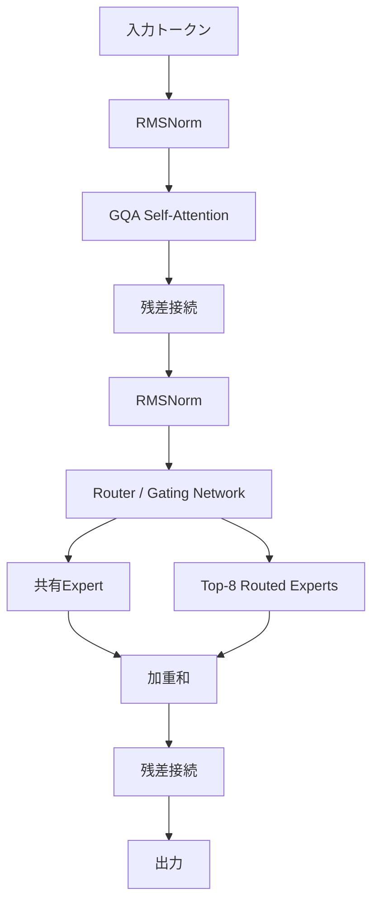

本記事は [Qwen3 Technical Report (arXiv:2505.09388)](https://arxiv.org/abs/2505.09388) の解説記事です。

## 論文概要（Abstract）

Qwen3はAlibaba Qwenチームが開発した大規模言語モデルシリーズの最新世代である。Denseモデル（0.6B〜32Bパラメータ）とMoE（Mixture of Experts）モデル（30B-A3B、235B-A22B）の両方を含み、単一モデル内でThinking（推論）モードとNon-thinkingモードを切り替える「Hybrid Thinking」機能を導入している。36兆トークン以上の事前学習データで訓練され、119言語に対応する。本記事では特にMoEアーキテクチャの設計思想と実装詳細に焦点を当てる。

この記事は [Zenn記事: Qwen3.5-397Bをllama.cppで自宅PCから動かす実践ガイド](https://zenn.dev/0h_n0/articles/3178b1257ec3ad) の深掘りです。

## 情報源

- **arXiv ID**: 2505.09388
- **URL**: [https://arxiv.org/abs/2505.09388](https://arxiv.org/abs/2505.09388)
- **著者**: Qwen Team, Alibaba Group
- **発表年**: 2025
- **分野**: cs.CL, cs.LG

## 背景と動機（Background & Motivation）

大規模言語モデル（LLM）のスケーリングにおいて、パラメータ数を増やすことで性能が向上するスケーリング則が知られている。しかし、Denseモデルでは推論時の計算コストがパラメータ数に比例して増大するため、数百Bパラメータのモデルを実用的に運用するにはGPUクラスタが必要になる。

MoEアーキテクチャは、総パラメータ数を大幅に増やしながら推論時の活性パラメータ数を抑制する手法として注目されている。Qwen3のMoEモデルは、この設計方針を採用することで、235Bの総パラメータを持ちながら推論時には22Bのみが活性化する構成を実現した。この設計は後継のQwen3.5-397B-A17Bにも引き継がれ、コンシューマーハードウェアでの実行を可能にする基盤となっている。

## 主要な貢献（Key Contributions）

- **貢献1**: Dense（0.6B〜32B）とMoE（30B-A3B、235B-A22B）の包括的モデルファミリーを設計し、用途に応じた選択を可能にした
- **貢献2**: Hybrid Thinking機能を導入し、単一モデルでThinking（Chain-of-Thought推論）とNon-thinking（直接応答）を切り替えられるようにした
- **貢献3**: 36兆トークン以上の高品質データで事前学習を行い、119言語対応、コーディング・数学・エージェント能力を強化した

## 技術的詳細（Technical Details）

### MoEアーキテクチャ

Qwen3のMoEモデルは、各Transformerブロック内のFFN（Feed-Forward Network）層をMoE層に置き換える設計を採用している。



#### エキスパート構成

Qwen3-235B-A22Bの場合、各MoE層は以下の構成を持つ。

| コンポーネント | 数量 | 動作 |
|---|---|---|
| 共有エキスパート | 常時1つ | 全トークンで活性化 |
| ルーテッドエキスパート | 128個/層 | Top-8ルーティングで8個を選択 |

ルーティングは以下の数式で表される。

$$
g(\mathbf{x}) = \text{TopK}\left(\text{softmax}(\mathbf{W}_r \mathbf{x}), K\right)
$$

ここで、
- $\mathbf{x}$: トークンの隠れ状態ベクトル（hidden state）
- $\mathbf{W}_r$: ルーターの重み行列（shape: $[N_{\text{experts}}, d_{\text{model}}]$）
- $K = 8$: 各トークンで選択されるエキスパート数
- $\text{TopK}$: 上位$K$個のゲート値を残し、それ以外を0にする操作

MoE層の出力は、共有エキスパートの出力とルーテッドエキスパートの加重和で計算される。

$$
\mathbf{y} = E_{\text{shared}}(\mathbf{x}) + \sum_{i \in \text{TopK}} g_i(\mathbf{x}) \cdot E_i(\mathbf{x})
$$

ここで$E_{\text{shared}}$は共有エキスパート、$E_i$は$i$番目のルーテッドエキスパート、$g_i(\mathbf{x})$は正規化されたゲート値である。

#### 活性パラメータ率

MoEの効率は、活性パラメータ率で定量化できる。

$$
\text{Active Ratio} = \frac{P_{\text{attention}} + P_{\text{shared}} + K \cdot P_{\text{expert}}}{P_{\text{total}}}
$$

Qwen3-235B-A22Bの場合、$P_{\text{total}} = 235\text{B}$に対して$P_{\text{active}} = 22\text{B}$であり、活性パラメータ率は約9.4%である。この比率はQwen3.5-397B-A17Bではさらに低く約4.3%（17B/397B）となる。

### 負荷分散メカニズム

MoEモデルの訓練では、特定のエキスパートにトークンが集中する「エキスパート崩壊」問題が発生する。Qwen3ではグローバルバッチ負荷分散損失を用いてこれを緩和している。

$$
\mathcal{L}_{\text{balance}} = \alpha \cdot N \sum_{i=1}^{N} f_i \cdot P_i
$$

ここで、
- $N$: エキスパート数
- $f_i$: エキスパート$i$にルーティングされたトークンの割合
- $P_i$: エキスパート$i$のルーティング確率の平均
- $\alpha$: バランス損失の重み係数

### 共通アーキテクチャ要素

DenseモデルとMoEモデルで共通して採用されている要素は以下の通りである。

| 要素 | 詳細 |
|---|---|
| Attention | Grouped Query Attention（GQA） |
| 位置エンコーディング | RoPE（Rotary Position Embedding） |
| 活性化関数 | SwiGLU |
| 正規化 | RMSNorm（Layer Normの代替） |
| コンテキスト長 | 最大128Kトークン |

### アルゴリズム

MoEルーティングの擬似コードを以下に示す。

```python
import torch
import torch.nn as nn
import torch.nn.functional as F


class MoELayer(nn.Module):
    """Mixture of Experts layer as described in Qwen3 Technical Report.

    Args:
        d_model: Hidden dimension size.
        n_experts: Total number of routed experts per layer.
        top_k: Number of experts activated per token.
        d_ff: Feed-forward intermediate dimension.
    """

    def __init__(
        self, d_model: int, n_experts: int, top_k: int, d_ff: int
    ) -> None:
        super().__init__()
        self.top_k = top_k
        self.router = nn.Linear(d_model, n_experts, bias=False)
        self.shared_expert = nn.Sequential(
            nn.Linear(d_model, d_ff),
            nn.SiLU(),
            nn.Linear(d_ff, d_model),
        )
        self.experts = nn.ModuleList([
            nn.Sequential(
                nn.Linear(d_model, d_ff),
                nn.SiLU(),
                nn.Linear(d_ff, d_model),
            )
            for _ in range(n_experts)
        ])

    def forward(self, x: torch.Tensor) -> torch.Tensor:
        """Compute MoE output with top-K routing.

        Args:
            x: Input tensor of shape (batch_size, seq_len, d_model).

        Returns:
            Output tensor of shape (batch_size, seq_len, d_model).
        """
        # Router: compute gating scores
        logits = self.router(x)  # (B, S, N)
        gates = F.softmax(logits, dim=-1)

        # Top-K selection
        topk_vals, topk_idx = torch.topk(gates, self.top_k, dim=-1)
        topk_gates = topk_vals / topk_vals.sum(dim=-1, keepdim=True)

        # Shared expert (always active)
        output = self.shared_expert(x)

        # Routed experts (top-K only)
        for k in range(self.top_k):
            expert_idx = topk_idx[..., k]  # (B, S)
            gate_val = topk_gates[..., k : k + 1]  # (B, S, 1)
            for i in range(len(self.experts)):
                mask = (expert_idx == i).unsqueeze(-1)
                if mask.any():
                    expert_out = self.experts[i](x)
                    output = output + gate_val * mask.float() * expert_out

        return output
```

> **注意**: 上記は論文の記述に基づく概念的な実装であり、実際のQwen3実装ではメモリ効率と計算速度のためにscatter/gather操作やCUDAカーネル最適化が施されている。

## 実装のポイント（Implementation）

Qwen3 MoEモデルの推論実装において、以下の点が重要である。

**エキスパートの配置戦略**: 128個のルーテッドエキスパートは各層で最大8個のみ活性化される。llama.cppの`--cpu-moe`フラグは、この大多数の非活性エキスパートをCPU RAMに退避し、Attention層のみをGPU VRAMに配置する。

**KVキャッシュのメモリ予算**: GQA（Grouped Query Attention）の採用により、KVキャッシュのメモリ消費はMulti-Head Attention比で大幅に削減されている。128Kコンテキスト対応時もKVキャッシュは管理可能なサイズに収まる。

**量子化との相性**: MoEモデルではエキスパートの重みが全パラメータの大部分を占めるため、量子化の効果が大きい。Q4量子化で235B → 約120GB、さらにIQ2系で約60GBまで圧縮可能とコミュニティで報告されている。

**Hybrid Thinkingの制御**: APIレベルでは`enable_thinking`パラメータでThinkingモードとNon-thinkingモードを切り替える。Thinkingモードではtemperature=0.6、top_k=20が推奨されている。

## 実験結果（Results）

著者らは以下のベンチマーク結果を報告している。

| モデル | MMLU | HumanEval | MATH | 活性パラメータ |
|---|---|---|---|---|
| Qwen3-235B-A22B | ~88 | 高水準 | 高水準 | 22B |
| Qwen3-30B-A3B | Qwen2.5-72B相当 | 高水準 | 高水準 | 3B |
| Qwen3-32B (Dense) | 同クラス最高水準 | 高水準 | 高水準 | 32B |

> **注意**: 具体的なスコアは論文のTableを直接参照されたい。上記は論文の記述に基づく要約である。

著者らが特に強調しているのは、**Qwen3-30B-A3B（活性3B）がQwen2.5-72B（Dense 72B）に匹敵する性能を示した**点である。これはMoEアーキテクチャの効率性を端的に示す結果であり、推論コストは約1/24に削減される計算となる。

Hybrid Thinkingモードの効果については、Qwen3-32BがThinkingモードでQwQ-32B（推論特化モデル）を上回る性能を報告している。AIME 2024やLiveCodeBenchなどの推論ベンチマークでo1/o3系モデルと競合するスコアが得られたとしている。

## 実運用への応用（Practical Applications）

Zenn記事で解説されているQwen3.5-397B-A17Bは、Qwen3のMoE設計をさらに発展させたモデルである。Qwen3の設計から実運用に活かせるポイントは以下の通りである。

**コンシューマー推論**: Qwen3-30B-A3Bは活性パラメータ3Bで72B相当の性能を持つ。RTX 4090（24GB）のみでフル速度推論が可能であり、個人開発者にとって費用対効果の高い選択肢となる。

**ルーティングの安定性**: 128エキスパート・Top-8構成は、Top-2やTop-4と比較して出力の安定性が高いと報告されている。これは推論結果の再現性が重要なプロダクション環境で有利に働く。

**長文コンテキスト**: 128Kトークン対応により、長大な文書の要約やコードベース全体の理解など、長コンテキストが必要なタスクに対応できる。ただし、KVキャッシュのメモリ消費には注意が必要である。

## 関連研究（Related Work）

- **DeepSeekMoE** (Yang et al., 2024): 細粒度エキスパート分割と共有エキスパートの概念を提案。Qwen3のMoE設計に直接影響を与えた
- **Mixtral 8x7B** (Jiang et al., 2023): オープンMoEモデルの先駆けとして、コミュニティでのMoE推論基盤整備を促進した
- **Switch Transformer** (Fedus et al., 2021): Top-1ルーティングによる大規模MoEの実現可能性を示した。Qwen3はTop-8ルーティングを採用し、出力品質と効率のバランスを取っている

## まとめと今後の展望

Qwen3 Technical Reportは、MoEアーキテクチャによるスケーリング効率とHybrid Thinking機能の導入を主要な貢献として報告している。235Bパラメータ中22Bのみの活性化（9.4%）という設計は、後継のQwen3.5-397B-A17B（4.3%）につながる方向性を示している。

今後の展望として、Gated DeltaNet（線形注意機構）とのハイブリッドアーキテクチャ（Qwen3.5で採用）により、Attention計算のさらなる効率化が進むと考えられる。MoEオフローディング技術と組み合わせることで、コンシューマーハードウェアで数百Bパラメータモデルを実用速度で動作させる道筋が開かれている。

## 参考文献

- **arXiv**: [https://arxiv.org/abs/2505.09388](https://arxiv.org/abs/2505.09388)
- **Code**: [https://github.com/QwenLM/Qwen3](https://github.com/QwenLM/Qwen3)
- **Related Zenn article**: [https://zenn.dev/0h_n0/articles/3178b1257ec3ad](https://zenn.dev/0h_n0/articles/3178b1257ec3ad)

---

:::message
この記事はAI（Claude Code）により自動生成されました。内容の正確性については原論文で検証していますが、最新情報は公式ドキュメントもご確認ください。
:::
