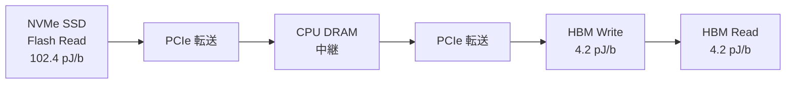
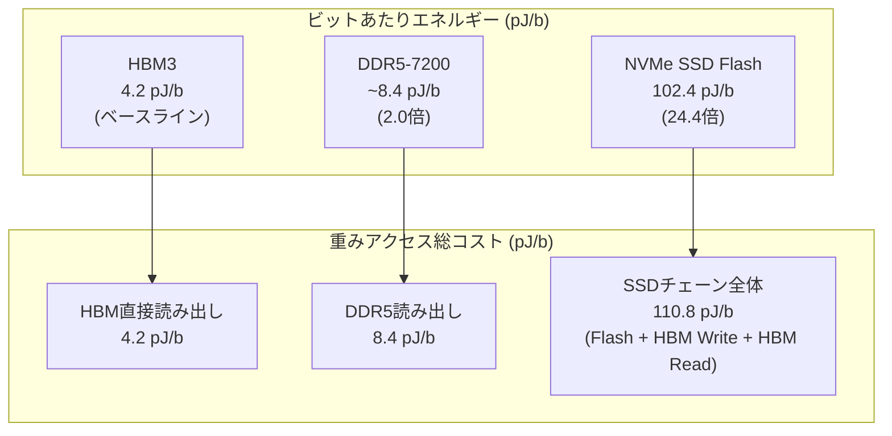

本記事は [SSD Offloading for LLM Mixture-of-Experts Weights Considered Harmful in Energy Efficiency](https://arxiv.org/abs/2508.06978)（Kyung, Yun, Ahn, 2025）の解説記事です。

## 論文概要

Mixture-of-Experts（MoE）モデルは、パラメータ数に対して推論時に活性化されるエキスパートの割合が低いため、SSDにエキスパート重みをオフロードして限られたGPUメモリで巨大モデルを動作させる手法が注目されている。しかし、著者らはこのSSDオフロード手法がエネルギー効率の観点で深刻な問題を抱えていることを定量的に分析した論文である。

著者らは、Mixtral 8x7B、DeepSeek-R1（671B）、Llama 4 Maverick（400B）の3モデルについて、トークン生成あたりのエネルギー消費を計測し、SSDオフロードがHBMベースラインと比較して**3.8倍から最大12.5倍**のエネルギー増加を引き起こすと報告している（Table 2, Figure 3）。この増加の主因は、NVMe SSD Flashの読み出しエネルギーがHBM3の約26倍に達する点にある。

この記事は [Zenn記事: VRAM48GB+RAM32GBでQwen3.5-397Bを動かすSSDオフロード実践ガイド](https://zenn.dev/0h_n0/articles/c5854032acb8c8) の深掘りです。Zenn記事ではSSDオフロードの実践的な設定方法を解説しているが、本論文はそのアプローチが持つエネルギー効率面での課題を定量的に明らかにしており、SSDオフロード運用の全体像を理解する上で重要な補完情報となる。

## 情報源

- **arXiv ID**: 2508.06978
- **URL**: [https://arxiv.org/abs/2508.06978](https://arxiv.org/abs/2508.06978)
- **著者**: Kwanhee Kyung, Sungmin Yun, Jung Ho Ahn（ソウル大学校）
- **発表**: 2025年8月、IEEE Computer Architecture Letters にも掲載
- **キーワード**: Mixture-of-Experts, SSD offloading, energy efficiency, HBM, DRAM

## 背景と動機

### MoEモデルとSSDオフロードの台頭

近年のLLMはパラメータ数の増加に伴い、推論に必要なGPUメモリ（HBM）容量も急増している。MoEアーキテクチャは、各トークンに対して全エキスパートのうち一部（Top-k）のみを活性化することで、計算量を抑えながら大規模なパラメータ空間を保持する設計を実現している。

この低い活性化率に着目し、非活性エキスパートの重みをSSDに退避させ、必要な時のみGPUメモリへロードする「SSDオフロード」手法が提案されてきた。代表的な実装としてllama.cppやMoE-Infinityなどがあり、コンシューマ向けGPU（VRAM 48GB程度）でも数百Bパラメータ規模のMoEモデルを動作させることが可能となっている。

### 見落とされてきたエネルギーコスト

しかし、従来の研究の多くはSSDオフロードの**レイテンシ**と**スループット**に焦点を当てており、**エネルギー消費**の観点からの評価は十分に行われていなかった。著者らは、SSDからのデータ転送チェーン全体（Flash読み出し → PCIe転送 → HBM書き込み → HBM読み出し）のエネルギーコストを積算すると、HBMのみでの重みアクセスと比較して桁違いのエネルギーを消費することを指摘している。

この問題は、データセンタ規模でのTCO（Total Cost of Ownership）に直結するだけでなく、個人のローカル推論環境における電力消費にも影響を与える。本論文は、SSDオフロードのエネルギー効率を初めて体系的に分析した研究として位置づけられる。

## 主要な貢献

著者らの主要な貢献は以下の4点である：

1. **ストレージ階層ごとのエネルギーモデルの構築**: HBM3、DDR5、NVMe SSD Flashのビットあたりエネルギー（pJ/b）を文献値に基づいて整理し、SSDオフロード時のデータ転送チェーン全体のエネルギーを定式化
2. **3種のMoEモデルに対するトークン単位のエネルギー分析**: Mixtral 8x7B、DeepSeek-R1、Llama 4 Maverickについて、バッチサイズごとのエネルギー消費を詳細に比較
3. **SSDオフロードのエネルギー増加の定量化**: HBMベースラインに対して3.8倍から12.5倍のエネルギー増加を報告し、その主因がFlash読み出しエネルギーにあることを特定
4. **Flash技術への要件の提示**: SSDオフロードがエネルギー的に妥当となるためにFlash読み出しエネルギーが約10 pJ/bまで低下する必要があるという将来目標を提示

## 技術的詳細

### エネルギーモデルの基本パラメータ

著者らは、各メモリ・ストレージ技術のビットあたりのアクセスエネルギーを以下のように整理している（Table 1に基づく）：

| 技術 | エネルギー (pJ/b) | 備考 |
|------|-------------------|------|
| HBM3 読み出し | 4.2 | GPU内蔵メモリ |
| HBM3 書き込み | 4.2 | GPU内蔵メモリ |
| DDR5-7200 読み出し | ~8.4 | CPUメインメモリ |
| NVMe SSD Flash 読み出し | 102.4 | NAND Flash |

### SSDアクセスチェーンのエネルギー定式化

SSDからGPUへエキスパート重みを転送する際、データは以下の経路を通る：

著者らは、SSDオフロード時の重みアクセスにおけるビットあたりの総エネルギーを以下のように定式化している：

$$
E_{\text{SSD\_total}} = E_{\text{Flash\_read}} + E_{\text{HBM\_write}} + E_{\text{HBM\_read}}
$$

具体的な値を代入すると：

$$
E_{\text{SSD\_total}} = 102.4 + 4.2 + 4.2 = 110.8 \text{ pJ/b}
$$

一方、HBMベースラインでは重みが既にHBM上に存在するため：

$$
E_{\text{HBM\_baseline}} = E_{\text{HBM\_read}} = 4.2 \text{ pJ/b}
$$

したがって、SSD経由の重みアクセスはHBM直接アクセスと比較して：

$$
\frac{E_{\text{SSD\_total}}}{E_{\text{HBM\_baseline}}} = \frac{110.8}{4.2} \approx 26.4\text{倍}
$$

のエネルギーを消費することになる。

### CPUメモリオフロードの場合

DDR5メモリへのオフロード（CPU推論）の場合：

$$
E_{\text{DDR5\_total}} = E_{\text{DDR5\_read}} = 8.4 \text{ pJ/b}
$$

$$
\frac{E_{\text{DDR5\_total}}}{E_{\text{HBM\_baseline}}} = \frac{8.4}{4.2} = 2.0\text{倍}
$$

DDR5は HBMの2倍にとどまるのに対し、SSDは約26倍という大きな差がある点が本論文の核心的な知見である。

### トークン単位エネルギーの計算方法

著者らは、1トークン生成あたりのエネルギーを以下の要素に分解して計算している：

$$
E_{\text{token}} = E_{\text{compute}} + E_{\text{weight\_access}} + E_{\text{KV\_access}} + E_{\text{background}}
$$

各項の詳細：

- **$$E_{\text{compute}}$$**: 行列演算のエネルギー。FP16乗算で0.9 pJ/op、加算で0.4 pJ/opと見積もっている
- **$$E_{\text{weight\_access}}$$**: エキスパート重みの読み出しエネルギー。ストレージ階層により大きく変動する
- **$$E_{\text{KV\_access}}$$**: Key-Valueキャッシュのアクセスエネルギー。シーケンス長に比例
- **$$E_{\text{background}}$$**: GPU/CPUのアイドル消費電力。GPUアイドル時70W/GPU、CPUメモリ57W/256GBと見積もっている

### 対象モデルの仕様

著者らが分析対象とした3つのMoEモデルの仕様を以下に示す：

| モデル | 総パラメータ | MoEデコーダ層数 | エキスパート数 | Top-k | 活性化率 |
|--------|------------|----------------|--------------|-------|---------|
| Mixtral 8x7B | 47B | 32 | 8 | 2 | ~25.0% |
| DeepSeek-R1 | 671B | 57 | 256+1 (shared) | 8 | ~3.5% |
| Llama 4 Maverick | 400B | 24 | 128+1 (shared) | 1 | ~1.6% |

活性化率が低いモデルほど、SSDに退避可能な非活性エキスパートの割合が大きくなるため、SSDオフロードの恩恵をレイテンシ面では享受しやすい。しかし同時に、SSDから読み出すデータ量も増大するため、エネルギーコストの観点では不利に働く。

## 実験結果

### Mixtral 8x7B のエネルギー分析

著者らは、Mixtral 8x7Bについてバッチサイズ1および1024での結果を報告している。

**バッチサイズ1の場合**（Figure 3aに基づく）：

| 構成 | トークンあたりエネルギー | HBM比 |
|------|----------------------|--------|
| HBM（ベースライン） | 基準値 | 1.0x |
| SSDオフロード | 基準値の約12.5倍 | **12.5x** |

バッチサイズ1では背景電力（アイドル消費）の影響が大きく、SSDオフロード時にはデータ転送待ち時間中もGPUがアイドル状態で電力を消費し続けるため、エネルギー増加がさらに顕著になると著者らは説明している。

**バッチサイズ1024の場合**：

| 構成 | トークンあたりエネルギー | HBM比 |
|------|----------------------|--------|
| HBM（ベースライン） | 基準値 | 1.0x |
| SSDオフロード | 基準値の約3.8倍 | **3.8x** |

バッチサイズの増加により背景電力がトークン間で償却されるため倍率は低下するが、依然として3.8倍のエネルギー増加が残る。

### DeepSeek-R1 のエネルギー分析

DeepSeek-R1は671Bパラメータの巨大MoEモデルであり、256+1のエキスパートからTop-8を選択する構成を持つ。著者らは、バッチサイズ1024での結果を以下のように報告している（Table 2に基づく）：

| 構成 | HBM比 | 備考 |
|------|--------|------|
| HBM（ベースライン） | 1.0x | 全重みHBM上に配置 |
| CPUメモリオフロード | 1.6x | DDR5-7200使用 |
| SSDオフロード | **4.9x** | NVMe SSD使用 |

著者らは、DeepSeek-R1のSSDオフロード時にはトークンあたりエネルギーの**73-80%**が重みアクセスに起因すると報告している。一方、HBMベースラインでは重みアクセスは全体の**11-15%**に過ぎない。この構成比の劇的な変化が、SSDオフロードのエネルギー非効率性の本質を示している。

また、SSDオフロードはCPUメモリオフロードと比較しても**3.1倍**のエネルギーを消費しており、DDR5でのオフロードがSSDよりも大幅にエネルギー効率が高いことが示されている。

### Llama 4 Maverick のエネルギー分析

Llama 4 Maverickは128+1エキスパートからTop-1のみを選択する設計であり、活性化率は約1.6%と極めて低い。このモデルにおいてもSSDオフロードは著しいエネルギー増加をもたらすと著者らは報告している。

### エネルギー消費の内訳

著者らが報告したエネルギー消費の内訳をまとめると、以下のパターンが浮かび上がる：

**HBMベースライン時のエネルギー内訳**:
- 計算（行列演算）: 主要な消費源
- 重みアクセス: 全体の11-15%
- KVキャッシュアクセス: シーケンス長に依存
- 背景電力: バッチサイズに依存

**SSDオフロード時のエネルギー内訳**:
- 計算（行列演算）: 相対的に縮小
- **重みアクセス: 全体の73-80%** ← 支配的
- KVキャッシュアクセス: 相対的に縮小
- 背景電力: 転送待ち時間で増大

## ストレージ階層のエネルギー比較

### 階層間のエネルギー格差

著者らの分析結果を基に、ストレージ階層ごとのビットあたりエネルギーと重みアクセスの総コストを俯瞰する：

### なぜSSDのエネルギーが高いのか

NAND Flashの読み出し操作は、HBMやDRAMとは根本的に異なるメカニズムで動作する。HBMはチップ上の短距離配線を通じたSRAM/DRAMアクセスであり、消費電力が本質的に小さい。一方、NAND Flashの読み出しには以下のプロセスが必要となる：

1. **ページバッファへの読み出し**: NANDセルの浮遊ゲート電荷を検出し、ページ単位でバッファに転送
2. **ECC処理**: 読み出しデータのエラー訂正
3. **コントローラ処理**: FTL（Flash Translation Layer）によるアドレス変換
4. **インターフェース転送**: NVMe/PCIe経由でホストへデータ転送

これらの処理が積み重なり、ビットあたり102.4 pJ/bという値になる。著者らは、この値はNAND Flash技術の物理的特性に根ざしたものであり、短期的な大幅改善は困難であると指摘している。

### 背景電力の影響

著者らは、データ転送完了までの待ち時間中に消費される背景電力も無視できないと報告している：

- **GPU アイドル消費電力**: 70W/GPU
- **CPU メモリ消費電力**: 57W/256GB

SSDオフロード時はデータ転送にHBMやDDR5と比較して長い時間を要するため、その間のアイドル消費電力がトークンあたりの総エネルギーをさらに押し上げる。特にバッチサイズが小さい場合（batch=1）、この背景電力の影響が支配的となり、Mixtral 8x7Bでは最大12.5倍というエネルギー増加に至っている。

## 実運用への応用

### コンシューマ環境でのSSDオフロードの意味

Zenn記事「[VRAM48GB+RAM32GBでQwen3.5-397Bを動かすSSDオフロード実践ガイド](https://zenn.dev/0h_n0/articles/c5854032acb8c8)」で解説されているように、SSDオフロードはコンシューマGPU環境で巨大MoEモデルを動作させる唯一の現実的手段である場合が多い。しかし本論文の分析結果は、この利便性にはエネルギーコストという代償が伴うことを定量的に示している。

### 電力コストの試算

本論文の結果に基づき、SSDオフロードの電力コスト影響を概算する。DeepSeek-R1をバッチサイズ1024で運用する場合、SSDオフロードはHBMベースラインの4.9倍のエネルギーを消費する。仮にHBMベースラインで1トークンあたり1 mJ（概算）とすると：

- **HBM構成**: 1 mJ/token → 1000トークン生成で1 J → 1時間連続生成（約360万トークン）で約3.6 kJ ≈ 1 Wh
- **SSD構成**: 4.9 mJ/token → 同条件で約4.9 Wh

個人利用の規模では電力コストの差は限定的に見えるが、データセンタ規模でMoEモデルを大量にサービングする場合、この4.9倍の差はインフラコストに直結する。

### 実践的な推奨事項

本論文の知見を踏まえると、以下の点が実運用上の検討材料となる：

1. **DDR5オフロードの優先検討**: CPUメモリが十分に搭載可能な環境では、SSDオフロードよりもDDR5へのオフロードを優先すべきである。DDR5はSSDの約1/13のエネルギーで重みアクセスが可能である
2. **バッチサイズの最適化**: バッチサイズを大きくすることで背景電力の償却が進み、エネルギー効率が改善される。SSDオフロード環境では特にバッチサイズ1での運用を避けるべきである
3. **モデル選択の考慮**: 活性化率が低いモデル（Llama 4 Maverick: 1.6%）はSSDオフロードに適した設計に見えるが、エネルギー効率の観点では非活性エキスパートの読み出しコストも考慮すべきである

## 今後の展望

### Flash技術に求められる改善

著者らは、SSDオフロードがエネルギー効率面で妥当となるためには、Flash読み出しエネルギーが現在の**102.4 pJ/b**から**約10 pJ/b**まで低下する必要があると指摘している。これは約**10倍の改善**を意味する。

現行のNAND Flash技術（TLC/QLCベース）では、セルあたりの電荷検出精度や多値化に伴う読み出しマージンの制約から、大幅なエネルギー低減は容易ではない。しかし、以下の技術トレンドが将来的な改善に寄与する可能性がある：

- **CXL（Compute Express Link）メモリ**: CXLベースのメモリエクスパンダはDRAMに近いエネルギー特性を持ち、SSDとDRAMの中間的な位置づけとなり得る
- **次世代不揮発性メモリ**: STT-MRAM、PCM（Phase Change Memory）などの新世代メモリ技術は、NAND Flashよりも低い読み出しエネルギーを実現する可能性がある
- **Near-Storage Processing**: データ転送量を削減するため、SSDコントローラ側で部分的な計算を実行するアプローチ

### MoEアーキテクチャ側の改善

エネルギー問題はストレージ技術だけでなく、MoEモデルのアーキテクチャ設計からも緩和し得る：

- **エキスパート活性化の予測**: 次のトークンで必要となるエキスパートを事前に予測し、プリフェッチすることでアイドル時間を短縮する
- **エキスパートのクラスタリングと圧縮**: 類似するエキスパートをマージまたは量子化し、転送データ量を削減する
- **活性化率の動的制御**: エネルギー予算に応じてTop-kの値を動的に変更するアプローチ

## 関連研究

### FlashMoE

FlashMoEは、SSDへのエキスパートオフロードを効率化するため、Flash-friendly量子化とI/O最適化を組み合わせた手法である。SSDの読み出し粒度（ページ単位）に合わせた量子化設計により、不要なデータ転送を削減している。ただし、本論文の分析が示すように、量子化による転送データ量の削減だけでは根本的なエネルギーギャップ（26倍）を埋めることは困難である。

### MoE-Infinity

MoE-Infinityは、SSDベースのエキスパートオフロードにおいてプリフェッチとキャッシング戦略を最適化するシステムである。エキスパートの活性化パターンを学習し、次に必要となるエキスパートを先行して読み出すことでレイテンシを削減する。しかし、プリフェッチはエネルギー消費を増加させる可能性があり（投機的読み出しのエネルギーが無駄になるケース）、本論文の観点からはエネルギー効率の改善には直結しない。

### Pre-gated MoE

Pre-gated MoEは、エキスパート選択を前の層のゲーティング結果に基づいて早期に決定する手法であり、プリフェッチの精度を向上させる。エキスパートの選択を1層先行させることで、SSDからの読み出しを計算と並列化する時間的余裕を確保する。エネルギー効率への直接的な影響は限定的であるが、アイドル時間の削減を通じて背景電力の影響を緩和する効果が期待される。

## まとめ

本論文は、MoEモデルにおけるSSDオフロード手法のエネルギー効率に初めて焦点を当てた分析研究である。主要な知見を以下にまとめる：

1. **SSDの重みアクセスエネルギーはHBMの約26倍**: NVMe SSD Flashの読み出しが102.4 pJ/bに対し、HBM3は4.2 pJ/bであり、SSD経由のアクセスチェーン全体では110.8 pJ/bとなる
2. **トークンあたりエネルギーは3.8倍から12.5倍増加**: バッチサイズとモデル構成に依存するが、全ケースでSSDオフロードは大幅なエネルギー増加を伴う
3. **重みアクセスが全体の73-80%を占有**: SSDオフロード時は重みの読み出しがエネルギー消費の支配的要因となる
4. **Flash読み出しエネルギーの約10倍改善が必要**: SSDオフロードがエネルギー的に妥当となるには102.4 pJ/bから約10 pJ/bへの低減が求められる

SSDオフロードは、限られたGPUメモリで巨大MoEモデルを動作させるための有効な手段であり、その実用性は疑いない。しかし本論文は、その利便性にはエネルギー効率という重要なトレードオフが存在することを定量的に明らかにした。今後のMoEモデル運用においては、レイテンシやスループットに加えてエネルギー効率も設計指標として考慮すべきであるという著者らの主張は、持続可能なAIインフラの観点から重要な示唆を持つ。

## 参考文献

1. Kyung, K., Yun, S., & Ahn, J. H. (2025). SSD Offloading for LLM Mixture-of-Experts Weights Considered Harmful in Energy Efficiency. *arXiv preprint arXiv:2508.06978*. Also in IEEE Computer Architecture Letters. [https://arxiv.org/abs/2508.06978](https://arxiv.org/abs/2508.06978)
2. Jiang, A. I., et al. (2024). Mixtral of Experts. *arXiv preprint arXiv:2401.04088*.
3. DeepSeek-AI. (2025). DeepSeek-R1: Incentivizing Reasoning Capability in LLMs via Reinforcement Learning.
4. Meta AI. (2025). Llama 4 Maverick.
5. Xue, Y., et al. (2024). MoE-Infinity: Offloading-Efficient MoE Model Serving. *arXiv preprint arXiv:2401.14361*.
6. Kang, W., et al. (2024). Pre-gated MoE: An Algorithm-System Co-Design for Fast and Scalable Mixture-of-Expert Inference. *arXiv preprint arXiv:2308.12066*.
