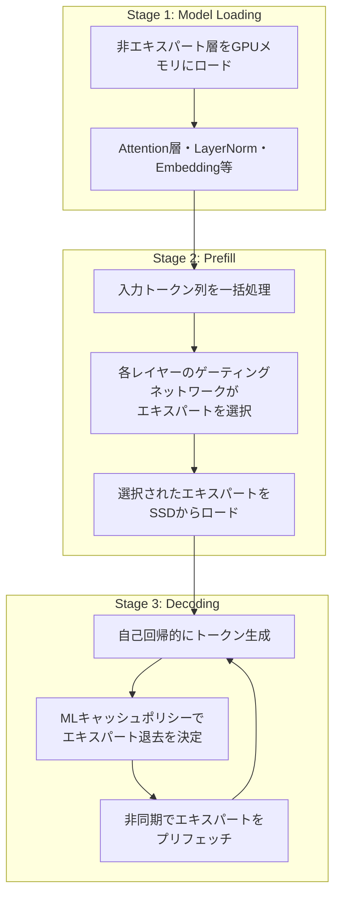

本記事は [FlashMoE: Reducing SSD I/O Bottlenecks via ML-Based Cache Replacement for Mixture-of-Experts Inference on Edge Devices (arXiv:2601.17063)](https://arxiv.org/abs/2601.17063) の解説記事です。

## 論文概要（Abstract）

FlashMoEは、Mixture-of-Experts（MoE）モデルをエッジデバイスのSSDオフロード環境で推論する際に生じるI/Oボトルネックを、機械学習ベースのキャッシュ置換アルゴリズムで解消するシステムである。著者らは、軽量なフィードフォワードネットワーク（FFN）をキャッシュ置換ポリシーとして学習させ、Beladyの最適アルゴリズムを教師信号として訓練することで、従来のLRU（Least Recently Used）に対し最大21%、LFU（Least Frequently Used）に対し最大51%のキャッシュヒット率向上を実現したと報告している。さらに、3ステージパイプラインによる非同期キャッシュ操作と組み合わせることで、既存手法（llama.cpp、Fiddler、DAOP）に対し最大4.1倍のスループット向上を達成している。

この記事は [Zenn記事: VRAM48GB+RAM32GBでQwen3.5-397Bを動かすSSDオフロード実践ガイド](https://zenn.dev/0h_n0/articles/c5854032acb8c8) の深掘りです。Zenn記事で取り上げたSSDオフロードによる大規模MoEモデル推論の実践に対し、そのキャッシュ効率を学術的アプローチで改善するFlashMoEの技術的詳細を解説します。

## 情報源

- **arXiv ID**: 2601.17063
- **URL**: [https://arxiv.org/abs/2601.17063](https://arxiv.org/abs/2601.17063)
- **著者**: Byeongju Kim, Jungwan Lee, Donghyeon Han, Hoi-Jun Yoo, Sangyeob Kim
- **発表年**: 2026年1月
- **分野**: cs.AR（Computer Architecture）, cs.LG（Machine Learning）

## 背景と動機（Background & Motivation）

MoEモデルは、パラメータ数の割に計算コストを抑えられる効率的なアーキテクチャとして広く採用されている。Qwen3-30B-A3B（30Bパラメータ中3Bのみが活性化）やOLMoE-1B-7B（7Bパラメータ中1Bのみが活性化）に代表されるように、推論時にはゲーティングネットワークが各トークンに対して少数のエキスパートのみを選択的に活性化する。しかし、全エキスパートの重みを保持するため総パラメータ数は大きく、VRAM容量が限られるエッジデバイスでは全てのエキスパートをGPUメモリに常駐させることが困難である。

この問題に対し、SSDオフロードはエキスパートの重みをSSDに格納し、必要なエキスパートのみをオンデマンドでGPUメモリにロードする手法として注目されている。しかし、SSDからGPUへのデータ転送レイテンシ（PCIe 5.0 NVMeでも1エキスパートあたり約3ms）が推論のボトルネックとなる。著者らは、この問題の根本原因がキャッシュ置換ポリシーの非効率性にあることを指摘している。

従来手法の限界は以下の通りである。

- **LRU/LFU**: MoEモデル固有のエキスパート選択パターン（後述する「再フェッチ問題」）を考慮しない汎用的なポリシーであり、特にLRUは5ステップ以内に34.2%のエキスパートを再フェッチするという非効率が生じる（論文Table 3より）
- **Fiddler**: CPUとGPUの共同推論を行うが、CPU側の計算がボトルネックとなり、初期ロードが6.8倍遅い（論文Table 2より）
- **DAOP**: 動的なオフロード戦略を用いるが、事前のプロファイリングが必要であり、エキスパート選択の動的パターンへの適応が不十分

## 主要な貢献（Key Contributions）

著者らが主張する主要な貢献は以下の3点である。

- **貢献1**: Beladyの最適アルゴリズムを教師信号とした軽量MLベースキャッシュ置換モデルの提案。3層FFN（隠れ層サイズ128、SiLU活性化関数、約113KB/レイヤー）により、従来のヒューリスティックベースのポリシーに対し大幅なキャッシュヒット率向上を実現
- **貢献2**: Model Loading→Prefill→Decodingの3ステージパイプラインの設計。非エキスパート層を常時メモリに保持しつつ、エキスパートのロードを非同期に行うことで、SSD I/OとGPU計算のオーバーラップを実現
- **貢献3**: OLMoE-1B-7BおよびQwen3-30B-A3Bを含む複数のMoEモデルにおける包括的な評価。RTX 5070 Ti（16GB VRAM）とPCIe 5.0 NVMeの組み合わせで、既存手法に対し最大4.1倍の高速化を実証

## 技術的詳細（Technical Details）

### MLベースキャッシュ置換アルゴリズム

FlashMoEの中核は、エキスパートの再利用パターンを予測する軽量FFNモデルである。このモデルは各MoEレイヤーに対して個別に訓練され、キャッシュ内の各エキスパートに対して「退去すべきかどうか」のスコアを出力する。

#### 入力特徴量

著者らは、各エキスパートの状態を2つの正規化された特徴量で表現している（論文Section 3.2より）。

**Recency Score（最新性スコア）**:

$$s_{\text{recency}}(e) = \frac{1}{r_t(e)}$$

ここで $r_t(e)$ はエキスパート $e$ が最後にアクセスされてからの経過ステップ数である。直近にアクセスされたエキスパートほどスコアが高くなる。

**Frequency Score（頻度スコア）**:

$$s_{\text{frequency}}(e) = \frac{f_t(e)}{\max_{e' \in \mathcal{C}} f_t(e')}$$

ここで $f_t(e)$ はエキスパート $e$ の累積アクセス回数、$\mathcal{C}$ は現在キャッシュ内にあるエキスパートの集合である。全キャッシュエントリの最大頻度で正規化することで、特徴量のスケールを $[0, 1]$ に統一している。

#### FFNアーキテクチャ

キャッシュ置換モデルは以下の構成を持つ（論文Section 3.2より）。

| パラメータ | 値 |
|-----------|-----|
| レイヤー数 | 3 |
| 隠れ層サイズ | 128 |
| 活性化関数 | SiLU |
| 入力次元 | 2（recency, frequency） |
| 出力 | 退去確率スコア（スカラー） |
| モデルサイズ | 約113KB/MoEレイヤー |

このFFNは、2次元の入力特徴量（recency score, frequency score）を受け取り、そのエキスパートをキャッシュから退去させるべき度合いを示すスカラー値を出力する。キャッシュが満杯の状態で新しいエキスパートをロードする必要が生じた場合、キャッシュ内の全エキスパートに対してこのスコアを計算し、最もスコアの高い（退去すべき度合いが最も高い）エキスパートを退去させる。

#### Beladyの最適アルゴリズムによる教師信号

訓練データの生成には、Beladyの最適アルゴリズム（MIN algorithm）を教師信号（oracle）として使用している。Beladyのアルゴリズムは、将来のアクセス列が既知である場合に最適なキャッシュ置換を行う理論的に最良のオフラインアルゴリズムである。

訓練手順は以下の通りである（論文Section 3.3より）。

1. TriviaQAデータセットから512サンプルを用いてMoEモデルを推論し、各レイヤーのエキスパート選択パターン（アクセス列）を記録
2. 記録されたアクセス列に対してBeladyのアルゴリズムを適用し、各時点での最適な退去候補をラベルとして付与
3. 各エキスパートの（recency score, frequency score）→ 退去/保持のペアで軽量FFNを訓練

著者らによると、総訓練時間は約2時間であり、モデルサイズも約113KB/レイヤーと極めて軽量であるため、推論時のオーバーヘッドは無視できる水準である。

### 3ステージパイプライン

FlashMoEの推論パイプラインは3つのステージで構成される（論文Section 3.1より）。



重要な設計上の判断として、非エキスパート層（Attention、LayerNorm、Embedding等）は常時GPUメモリに常駐させ、エキスパート層のみをSSDオフロードの対象としている。これは、非エキスパート層は全トークンで共通して使用されるためキャッシュ対象とする意味がなく、一方でエキスパート層はトークンごとに異なるサブセットが活性化されるためキャッシュ戦略の効果が大きいことに基づいている。

### 非同期キャッシュ操作

著者らは、エキスパートFFNの計算時間（約158µs）とSSDからのエキスパートロード時間（約3ms）の間に約19倍の差があることを利用し、非同期プリフェッチを実装している（論文Section 3.4より）。現在のレイヤーでエキスパート計算を行っている間に、次のレイヤーで必要となるエキスパートのロードをバックグラウンドで開始する。これにより、SSD I/OレイテンシをGPU計算で隠蔽することが可能となる。

## 実装のポイント（Implementation Notes）

### ハイパーパラメータと訓練設定

著者らが報告している実装上の重要なパラメータは以下の通りである（論文Section 4より）。

| 項目 | 値 |
|------|-----|
| 訓練データ | TriviaQA 512サンプル |
| 訓練時間 | 約2時間 |
| FFNモデルサイズ | 約113KB/MoEレイヤー |
| キャッシュサイズ | モデル・VRAMに応じて可変 |
| 非同期プリフェッチ | 有効 |

### キャッシュサイズの設計指針

キャッシュサイズはVRAM容量とモデルの総エキスパート数に依存する。著者らの実験環境（RTX 5070 Ti, 16GB VRAM）では、非エキスパート層をロードした後の残存VRAMにエキスパートを可能な限り配置している。キャッシュサイズが大きいほどヒット率は向上するが、非エキスパート層のメモリ要件との兼ね合いが必要となる。

### 再フェッチ問題への対処

従来のLRUポリシーでは、MoEモデル固有のエキスパート選択パターンにより「再フェッチ問題」が生じる。著者らの分析によると、LRUでは退去させたエキスパートの34.2%が5ステップ以内に再度アクセスされる（論文Table 3より）。一方、Beladyの最適アルゴリズムではこの値は0.1%にまで低減される。FlashMoEのMLベースポリシーは、Beladyに近い性能を実現することでこの問題を大幅に軽減している。

### トークン長とエキスパートロード量の関係

著者らは、トークン長が増加するにつれてロードが必要なエキスパートの割合が増大することを報告している（論文Figure 5より）。具体的には、32トークンの場合は全エキスパートの47%のロードで済むが、256トークンでは67%にまで増加する。この特性は、長い入力テキストほどキャッシュ効率が重要になることを意味する。

## Production Deployment Guide

FlashMoEのアーキテクチャ（SSDベースのエキスパートキャッシュ + MLキャッシュ置換）をAWSにデプロイする場合の設計パターンを以下に示す。なお、本セクションの構成は論文の実装をクラウド環境に適用するための参考情報であり、論文著者らが検証したものではない。

### AWS実装パターン（コスト最適化重視）

FlashMoEが対象とするMoEモデルの推論システムを、GPU + 高速NVMeストレージの組み合わせでAWSに構築する場合の3パターンを以下に示す。

| 構成 | インスタンス | GPU / VRAM | ストレージ | 想定モデル | 月額概算（us-east-1, On-Demand） |
|------|-------------|-----------|-----------|-----------|-------------------------------|
| **Small** | g5.xlarge | A10G / 24GB | 250GB gp3 SSD | OLMoE-1B-7B | ~$800 |
| **Medium** | g6.2xlarge | L4 / 24GB | 500GB io2 SSD (16,000 IOPS) | Qwen3-30B-A3B | ~$1,400 |
| **Large** | p4d.24xlarge | 8×A100 / 320GB | 8×1TB NVMe (インスタンスストレージ) | 大規模MoE (100B+) | ~$25,000 |

**注意**: 論文の実験環境はRTX 5070 Ti（16GB）+ PCIe 5.0 NVMe（7.4 GB/s）であり、上記はクラウド環境での対応構成の一例である。PCIe 5.0 NVMeの帯域幅をクラウドで完全に再現するにはp4d/p5系のインスタンスストレージが必要となる。

### Terraformインフラコード

#### Small構成（g5.xlarge + gp3 SSD）

```hcl
# Small構成: OLMoE-1B-7B向け
terraform {
  required_providers {
    aws = {
      source  = "hashicorp/aws"
      version = "~> 5.0"
    }
  }
}

provider "aws" {
  region = "us-east-1"
}

# VPC & Networking
module "vpc" {
  source  = "terraform-aws-modules/vpc/aws"
  version = "~> 5.0"

  name = "flashmoe-inference-vpc"
  cidr = "10.0.0.0/16"

  azs             = ["us-east-1a"]
  private_subnets = ["10.0.1.0/24"]
  public_subnets  = ["10.0.101.0/24"]

  enable_nat_gateway = true
  single_nat_gateway = true
}

# Security Group
resource "aws_security_group" "inference" {
  name_prefix = "flashmoe-inference-"
  vpc_id      = module.vpc.vpc_id

  # SSH access (restrict to your IP)
  ingress {
    from_port   = 22
    to_port     = 22
    protocol    = "tcp"
    cidr_blocks = [var.allowed_ssh_cidr]
  }

  # Inference API
  ingress {
    from_port   = 8080
    to_port     = 8080
    protocol    = "tcp"
    cidr_blocks = [module.vpc.vpc_cidr_block]
  }

  egress {
    from_port   = 0
    to_port     = 0
    protocol    = "-1"
    cidr_blocks = ["0.0.0.0/0"]
  }
}

# IAM Role for EC2
resource "aws_iam_role" "inference" {
  name = "flashmoe-inference-role"

  assume_role_policy = jsonencode({
    Version = "2012-10-17"
    Statement = [{
      Action = "sts:AssumeRole"
      Effect = "Allow"
      Principal = {
        Service = "ec2.amazonaws.com"
      }
    }]
  })
}

resource "aws_iam_role_policy_attachment" "ssm" {
  role       = aws_iam_role.inference.name
  policy_arn = "arn:aws:iam::aws:policy/AmazonSSMManagedInstanceCore"
}

resource "aws_iam_role_policy_attachment" "cloudwatch" {
  role       = aws_iam_role.inference.name
  policy_arn = "arn:aws:iam::aws:policy/CloudWatchAgentServerPolicy"
}

resource "aws_iam_instance_profile" "inference" {
  name = "flashmoe-inference-profile"
  role = aws_iam_role.inference.name
}

# GPU Instance (Small)
resource "aws_instance" "inference_small" {
  ami                    = data.aws_ami.deep_learning.id
  instance_type          = "g5.xlarge"
  subnet_id              = module.vpc.private_subnets[0]
  vpc_security_group_ids = [aws_security_group.inference.id]
  iam_instance_profile   = aws_iam_instance_profile.inference.name

  root_block_device {
    volume_size = 50
    volume_type = "gp3"
    encrypted   = true
  }

  # Expert weight storage (SSD offload target)
  ebs_block_device {
    device_name = "/dev/sdf"
    volume_size = 250
    volume_type = "gp3"
    throughput  = 500   # MB/s
    iops        = 6000
    encrypted   = true
  }

  metadata_options {
    http_endpoint = "enabled"
    http_tokens   = "required"  # IMDSv2 enforced
  }

  tags = {
    Name        = "flashmoe-inference-small"
    Environment = "production"
    ModelSize   = "small"
  }
}

data "aws_ami" "deep_learning" {
  most_recent = true
  owners      = ["amazon"]

  filter {
    name   = "name"
    values = ["Deep Learning AMI GPU PyTorch *-Ubuntu 22.04-*"]
  }
}

variable "allowed_ssh_cidr" {
  description = "CIDR block allowed for SSH access"
  type        = string
}
```

#### Large構成（p4d.24xlarge + インスタンスストレージ）

```hcl
# Large構成: 大規模MoEモデル向け（100B+パラメータ）
resource "aws_instance" "inference_large" {
  ami                    = data.aws_ami.deep_learning.id
  instance_type          = "p4d.24xlarge"
  subnet_id              = module.vpc.private_subnets[0]
  vpc_security_group_ids = [aws_security_group.inference.id]
  iam_instance_profile   = aws_iam_instance_profile.inference.name

  # p4d.24xlarge includes 8× 1TB NVMe instance storage
  # These are automatically available as /dev/nvme*n1

  root_block_device {
    volume_size = 100
    volume_type = "gp3"
    encrypted   = true
  }

  metadata_options {
    http_endpoint = "enabled"
    http_tokens   = "required"
  }

  user_data = base64encode(<<-EOF
    #!/bin/bash
    set -euo pipefail

    # NVMeインスタンスストレージのRAID0構成
    # FlashMoEのSSDオフロードでは帯域幅が最重要
    NVME_DEVICES=$(nvme list | grep "Instance Storage" | awk '{print $1}')
    DEVICE_COUNT=$(echo "$NVME_DEVICES" | wc -l)

    if [ "$DEVICE_COUNT" -gt 1 ]; then
      mdadm --create /dev/md0 --level=0 \
        --raid-devices=$DEVICE_COUNT $NVME_DEVICES
      mkfs.xfs /dev/md0
      mkdir -p /mnt/expert-cache
      mount /dev/md0 /mnt/expert-cache
    fi

    # CloudWatch Agent
    amazon-cloudwatch-agent-ctl -a start
  EOF
  )

  tags = {
    Name        = "flashmoe-inference-large"
    Environment = "production"
    ModelSize   = "large"
  }
}
```

### セキュリティベストプラクティス

```hcl
# KMS key for encryption at rest
resource "aws_kms_key" "model_weights" {
  description             = "Encryption key for MoE model weights"
  deletion_window_in_days = 30
  enable_key_rotation     = true

  tags = {
    Name = "flashmoe-model-weights-key"
  }
}

# S3 bucket for model weight storage (source of truth)
resource "aws_s3_bucket" "model_weights" {
  bucket = "flashmoe-model-weights-${data.aws_caller_identity.current.account_id}"
}

resource "aws_s3_bucket_server_side_encryption_configuration" "model_weights" {
  bucket = aws_s3_bucket.model_weights.id

  rule {
    apply_server_side_encryption_by_default {
      sse_algorithm     = "aws:kms"
      kms_master_key_id = aws_kms_key.model_weights.arn
    }
    bucket_key_enabled = true
  }
}

resource "aws_s3_bucket_public_access_block" "model_weights" {
  bucket = aws_s3_bucket.model_weights.id

  block_public_acls       = true
  block_public_policy     = true
  ignore_public_acls      = true
  restrict_public_buckets = true
}

resource "aws_s3_bucket_versioning" "model_weights" {
  bucket = aws_s3_bucket.model_weights.id
  versioning_configuration {
    status = "Enabled"
  }
}

# VPC Endpoint for S3 (avoid public internet for model downloads)
resource "aws_vpc_endpoint" "s3" {
  vpc_id       = module.vpc.vpc_id
  service_name = "com.amazonaws.us-east-1.s3"
  vpc_endpoint_type = "Gateway"
  route_table_ids   = module.vpc.private_route_table_ids
}

data "aws_caller_identity" "current" {}
```

### 運用・監視設定

#### CloudWatch Dashboard & Alarms

```hcl
resource "aws_cloudwatch_dashboard" "inference" {
  dashboard_name = "flashmoe-inference"

  dashboard_body = jsonencode({
    widgets = [
      {
        type   = "metric"
        x      = 0
        y      = 0
        width  = 12
        height = 6
        properties = {
          title   = "GPU Utilization"
          metrics = [
            ["CWAgent", "gpu_utilization", "InstanceId", aws_instance.inference_small.id]
          ]
          period = 60
          stat   = "Average"
        }
      },
      {
        type   = "metric"
        x      = 12
        y      = 0
        width  = 12
        height = 6
        properties = {
          title   = "EBS Volume I/O (Expert Cache)"
          metrics = [
            ["AWS/EBS", "VolumeReadOps", "VolumeId", aws_instance.inference_small.ebs_block_device[0].volume_id],
            ["AWS/EBS", "VolumeWriteOps", "VolumeId", aws_instance.inference_small.ebs_block_device[0].volume_id]
          ]
          period = 60
          stat   = "Sum"
        }
      },
      {
        type   = "metric"
        x      = 0
        y      = 6
        width  = 12
        height = 6
        properties = {
          title = "Cache Hit Rate (Custom Metric)"
          metrics = [
            ["FlashMoE", "CacheHitRate", "ModelName", "OLMoE-1B-7B"]
          ]
          period = 60
          stat   = "Average"
        }
      },
      {
        type   = "metric"
        x      = 12
        y      = 6
        width  = 12
        height = 6
        properties = {
          title = "Token Throughput (tokens/sec)"
          metrics = [
            ["FlashMoE", "TokenThroughput", "ModelName", "OLMoE-1B-7B"]
          ]
          period = 60
          stat   = "Average"
        }
      }
    ]
  })
}

# GPU utilization alarm
resource "aws_cloudwatch_metric_alarm" "gpu_low_utilization" {
  alarm_name          = "flashmoe-gpu-low-utilization"
  comparison_operator = "LessThanThreshold"
  evaluation_periods  = 3
  metric_name         = "gpu_utilization"
  namespace           = "CWAgent"
  period              = 300
  statistic           = "Average"
  threshold           = 20
  alarm_description   = "GPU utilization below 20% for 15 minutes - potential I/O bottleneck"

  dimensions = {
    InstanceId = aws_instance.inference_small.id
  }

  alarm_actions = [aws_sns_topic.alerts.arn]
}

# EBS throughput alarm
resource "aws_cloudwatch_metric_alarm" "ebs_high_throughput" {
  alarm_name          = "flashmoe-ebs-high-throughput"
  comparison_operator = "GreaterThanThreshold"
  evaluation_periods  = 2
  metric_name         = "VolumeReadBytes"
  namespace           = "AWS/EBS"
  period              = 300
  statistic           = "Sum"
  threshold           = 125000000000  # 500 MB/s sustained
  alarm_description   = "EBS read throughput exceeding 500MB/s - consider upgrading to io2"

  alarm_actions = [aws_sns_topic.alerts.arn]
}

resource "aws_sns_topic" "alerts" {
  name = "flashmoe-inference-alerts"
}
```

#### アプリケーションメトリクス（カスタムメトリクス送信例）

```python
"""FlashMoE推論サーバーのカスタムメトリクス送信例"""
import boto3
import time
from dataclasses import dataclass


@dataclass(frozen=True)
class InferenceMetrics:
    """推論メトリクスの集約データ."""

    cache_hit_rate: float
    token_throughput: float
    expert_load_latency_ms: float
    cache_eviction_count: int
    model_name: str


def publish_metrics(metrics: InferenceMetrics) -> None:
    """CloudWatchにカスタムメトリクスを送信する."""
    client = boto3.client("cloudwatch", region_name="us-east-1")

    client.put_metric_data(
        Namespace="FlashMoE",
        MetricData=[
            {
                "MetricName": "CacheHitRate",
                "Dimensions": [
                    {"Name": "ModelName", "Value": metrics.model_name},
                ],
                "Value": metrics.cache_hit_rate,
                "Unit": "Percent",
                "Timestamp": time.time(),
            },
            {
                "MetricName": "TokenThroughput",
                "Dimensions": [
                    {"Name": "ModelName", "Value": metrics.model_name},
                ],
                "Value": metrics.token_throughput,
                "Unit": "Count/Second",
                "Timestamp": time.time(),
            },
            {
                "MetricName": "ExpertLoadLatency",
                "Dimensions": [
                    {"Name": "ModelName", "Value": metrics.model_name},
                ],
                "Value": metrics.expert_load_latency_ms,
                "Unit": "Milliseconds",
                "Timestamp": time.time(),
            },
            {
                "MetricName": "CacheEvictionCount",
                "Dimensions": [
                    {"Name": "ModelName", "Value": metrics.model_name},
                ],
                "Value": float(metrics.cache_eviction_count),
                "Unit": "Count",
                "Timestamp": time.time(),
            },
        ],
    )
```

### コスト最適化チェックリスト

| チェック項目 | 対策 | 効果 |
|-------------|------|------|
| インスタンス稼働時間 | 推論リクエストがない時間帯はインスタンスを停止（EventBridge Scheduler） | 最大70%削減 |
| Spot Instance活用 | バッチ推論にはSpotを検討（p4d Spotは最大60%割引） | 最大60%削減 |
| Reserved Instance | 24/7稼働の場合は1年RIで30-40%割引 | 30-40%削減 |
| EBSボリュームタイプ | gp3で十分な場合はio2に上げない（gp3: $0.08/GB, io2: $0.125/GB） | 36%削減 |
| S3 Intelligent-Tiering | モデル重みのアーカイブにIntelligent-Tieringを使用 | ストレージ費用最適化 |
| データ転送 | VPC Endpointを使用しS3→EC2のデータ転送費用を削減 | 転送費用ゼロ |
| GPU監視 | GPU使用率20%未満が継続する場合はインスタンスサイズダウンを検討 | 右サイジング |
| キャッシュヒット率監視 | ヒット率が低い場合はVRAMの大きいインスタンスに変更を検討 | 性能改善 |

## 実験結果（Experimental Results）

### 実験環境

著者らの実験環境は以下の通りである（論文Section 4より）。

| 項目 | 仕様 |
|------|------|
| CPU | AMD Ryzen 9 9600X |
| GPU | NVIDIA RTX 5070 Ti (16GB VRAM) |
| SSD | SK hynix P51 NVMe (PCIe 5.0, 7.4 GB/s) |
| メモリ | 16GB DDR5-6000 |
| OS | Ubuntu 24.04 |

### キャッシュヒット率の比較

著者らが報告しているキャッシュ置換ポリシー別のヒット率改善は以下の通りである（論文Table 1より）。

| ポリシー | FlashMoE MLとの差 |
|---------|------------------|
| LRU | MLが21%上回る |
| LFU | MLが51%上回る |
| ARC | MLが28%上回る |
| LeCaR | MLが21%上回る |

MLベースのポリシーは、特にLFUに対して顕著な改善を示している。これは、MoEモデルのエキスパート選択パターンが単純な頻度ベースの予測では捉えきれないことを示唆している。

### スループットの比較

既存システムとの比較結果は以下の通りである（論文Table 2より）。

| 指標 | vs llama.cpp | vs Fiddler/DAOP |
|------|-------------|-----------------|
| 初期ロード速度 | 4倍高速 | 6.8倍高速 |
| 総スループット | 2.5倍高速 | 4.1倍高速 |

### モデル別のスループット改善

MLベースキャッシュ置換（vs LRU）によるモデル別のスループット改善は以下の通りである（論文Table 2より）。

| モデル | パラメータ構成 | スループット改善率（ML vs LRU） |
|--------|--------------|-------------------------------|
| OLMoE-1B-7B | 活性化1B / 総7B | 22% |
| Qwen3-30B-A3B | 活性化3B / 総30B | 7% |

OLMoE-1B-7Bのほうが改善率が高い理由として、著者らは活性化比率の低さ（1/7 ≈ 14%）によりキャッシュ効率の影響がより顕著に表れることを指摘している。Qwen3-30B-A3Bは活性化比率が10%とさらに低いものの、モデルサイズが大きいため非エキスパート層のメモリ占有率が高く、キャッシュに割り当てられるVRAMが相対的に少なくなることが改善率の差に影響していると考えられる。

### 再フェッチ率の分析

キャッシュ置換ポリシーの質を示す重要な指標として、著者らは「退去後5ステップ以内の再フェッチ率」を報告している（論文Table 3より）。

| ポリシー | 5ステップ以内の再フェッチ率 |
|---------|--------------------------|
| LRU | 34.2% |
| Belady（理論最適） | 0.1% |

LRUの34.2%という再フェッチ率は、退去判断の約3分の1が「直後に必要になるエキスパートを退去させている」ことを意味する。FlashMoEのMLポリシーは、Beladyの最適解に近づくことでこの非効率を大幅に低減している。

## 実運用への応用（Practical Applications）

### Zenn記事との関連

[Zenn記事「VRAM48GB+RAM32GBでQwen3.5-397Bを動かすSSDオフロード実践ガイド」](https://zenn.dev/0h_n0/articles/c5854032acb8c8)では、大規模MoEモデルをSSDオフロードで実行する実践的な手法が紹介されている。FlashMoEの知見は、この実践に対して以下の改善の方向性を示唆している。

第一に、llama.cppやその他の推論エンジンが採用している標準的なLRUキャッシュポリシーには改善の余地がある。論文の結果は、モデル固有のエキスパート選択パターンを学習したMLベースのポリシーがLRUに対して一貫した優位性を持つことを示している。

第二に、PCIe 5.0 NVMe（7.4 GB/s）のような高速SSDを使用する場合でも、キャッシュ効率がスループットに対して支配的な影響を持つことが示されている。ハードウェアの高速化だけでなく、ソフトウェアレベルでのキャッシュ最適化が重要である。

### エッジデバイスでのMoE推論への示唆

FlashMoEのアプローチは、VRAM容量が限られるエッジデバイス（デスクトップPC、ワークステーション）での大規模MoE推論に対して実用的な改善を提供する。特に以下の点が注目に値する。

- **軽量さ**: MLキャッシュモデルは約113KB/レイヤーと極めて小さく、推論時のオーバーヘッドが無視できる水準である
- **汎用性**: recencyとfrequencyという2つの汎用的な特徴量のみを使用しており、モデルアーキテクチャへの依存が少ない
- **訓練コスト**: 512サンプル・約2時間という低い訓練コストで、新しいモデルへの適用が容易である

### 制約と限界

著者らの報告に基づき、以下の制約・限界を認識しておく必要がある。

- **オフライン訓練**: MLキャッシュモデルはTriviaQAでの事前訓練に基づいており、訓練時と異なる入力分布（例: コード生成、多言語テキスト）に対する汎化性能は未検証である
- **ハードウェア依存**: 実験はPCIe 5.0 NVMe（7.4 GB/s）を前提としており、PCIe 3.0/4.0環境ではI/Oレイテンシが増大し、キャッシュ効率の改善がスループットに反映される度合いが変化する可能性がある
- **単一GPU**: 著者らの実験はRTX 5070 Ti単一GPUでの評価であり、マルチGPU環境でのキャッシュ分散戦略は議論されていない
- **評価モデル数**: OLMoE-1B-7BとQwen3-30B-A3Bの2モデルのみでの評価であり、より大規模なMoEモデル（Mixtral 8×22B等）での性能は未検証である

## 関連研究（Related Work）

FlashMoEの位置付けを理解するため、関連する先行研究を以下に整理する。

**Fiddler**は、CPUとGPUの共同推論によりMoEモデルのオフロードを実現するシステムである。エキスパートの一部をCPUで計算することでGPU VRAMの制約を緩和するが、CPU側の計算がボトルネックとなり、FlashMoEの3ステージパイプラインに対して初期ロードで6.8倍遅いと報告されている。

**MoE-Infinity**は、エキスパートのプリフェッチを活性化のトレース情報に基づいて行うシステムである。FlashMoEとの違いは、MoE-InfinityがCPUメモリを中間キャッシュとして使用するのに対し、FlashMoEがSSD→GPU直接転送を採用している点にある。

**Pre-gated MoE**は、ゲーティングネットワークの出力を事前に計算することで、エキスパートのプリフェッチを早期に開始するアプローチである。モデルアーキテクチャの変更を伴う点でFlashMoEとは設計思想が異なる。

**LRU/LFU/ARC/LeCaR**は、汎用的なキャッシュ置換アルゴリズムであり、MoEモデル固有のエキスパート選択パターンを考慮しない。FlashMoEは、これらのヒューリスティックをMLベースのポリシーで置き換えることで一貫した改善を達成している。

## まとめと今後の展望

FlashMoEは、SSDオフロードベースのMoE推論におけるキャッシュ置換問題に対し、MLベースのアプローチで体系的な改善を実現したシステムである。著者らは、Beladyの最適アルゴリズムを教師信号とした軽量FFNモデル（約113KB/レイヤー）により、LRUに対し最大21%、LFUに対し最大51%のキャッシュヒット率向上を達成したと報告している。3ステージパイプラインと非同期キャッシュ操作の組み合わせにより、既存手法に対し最大4.1倍のスループット向上も実現されている。

今後の展望として、以下の方向性が考えられる。第一に、オンライン学習によるキャッシュポリシーの動的適応である。現在の事前訓練ベースのアプローチでは、入力分布の変化に対する適応が限定的であり、推論中にポリシーを更新する機構が有用となる可能性がある。第二に、マルチGPU環境への拡張である。エキスパートを複数GPUに分散配置する場合のキャッシュ協調戦略は未探索の領域である。第三に、より多様なMoEアーキテクチャ（Switch Transformer、GShard等）への適用可能性の検証が期待される。

## 参考文献

- Kim, B., Lee, J., Han, D., Yoo, H.-J., & Kim, S. (2026). FlashMoE: Reducing SSD I/O Bottlenecks via ML-Based Cache Replacement for Mixture-of-Experts Inference on Edge Devices. *arXiv preprint arXiv:2601.17063*. [https://arxiv.org/abs/2601.17063](https://arxiv.org/abs/2601.17063)
- Belady, L. A. (1966). A study of replacement algorithms for a virtual-storage computer. *IBM Systems Journal*, 5(2), 78–101.
- Kamahori, K., Xu, Y., & Zhu, L. (2024). Fiddler: CPU-GPU Orchestration for Fast Inference of Mixture-of-Experts Models. *arXiv preprint arXiv:2402.07033*.
- Xue, Z., et al. (2024). MoE-Infinity: Offloading-Efficient MoE Model Serving. *arXiv preprint arXiv:2401.14361*.
- Hwang, R., et al. (2024). Pre-gated MoE: An Algorithm-System Co-Design for Fast and Scalable Mixture-of-Expert Inference. *arXiv preprint arXiv:2308.12066*.
- Fedus, W., Zoph, B., & Shazeer, N. (2022). Switch Transformers: Scaling to Trillion Parameter Models with Simple and Efficient Sparsity. *JMLR*, 23(120), 1–39.
