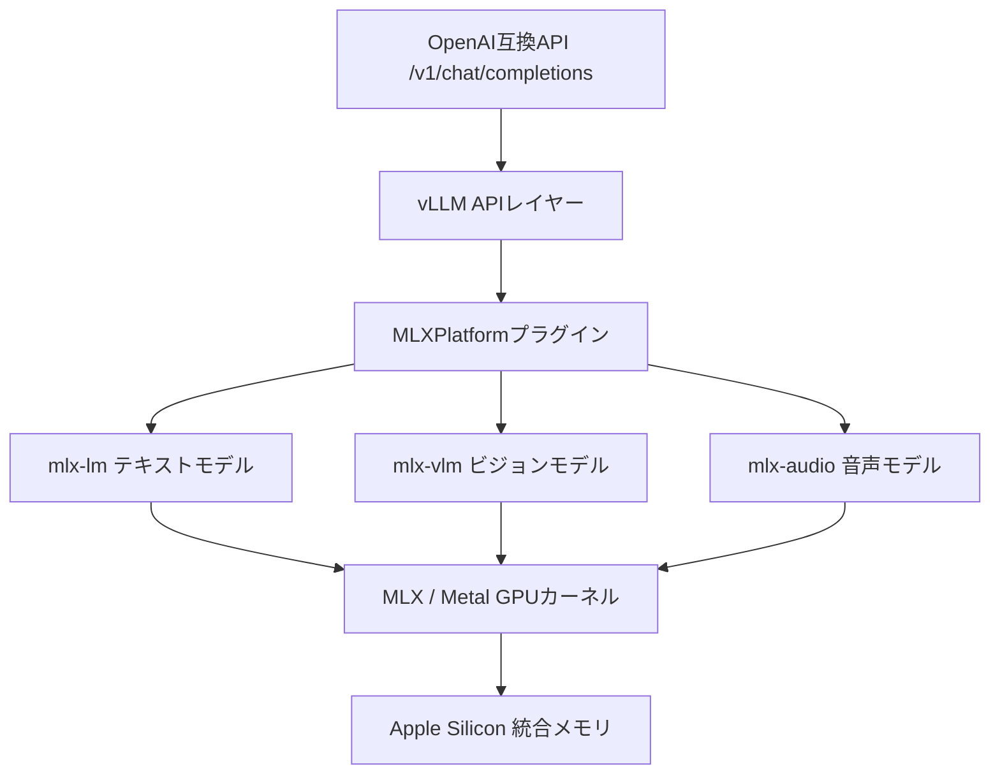

本記事は [Native LLM and MLLM Inference at Scale on Apple Silicon (arXiv:2601.19139)](https://arxiv.org/abs/2601.19139) の解説記事です。

## 論文概要（Abstract）

vLLM-MLXは、Apple SiliconのMLXフレームワークをネイティブバックエンドとしたLLM/MLLM推論フレームワークである。テキストモデルでllama.cpp比21〜87%の高スループット、連続バッチ処理で4.3倍のスループット向上を達成したと著者は報告している。M4 Maxで最大525 tokens/secの生成速度が計測されている。マルチモーダルモデル向けにはコンテンツベースのプレフィックスキャッシュを導入し、繰り返し画像クエリで28倍の高速化を実現している。

この記事は [Zenn記事: Qwen3.5-397Bをllama.cppで自宅PCから動かす実践ガイド](https://zenn.dev/0h_n0/articles/3178b1257ec3ad) の深掘りです。

## 情報源

- **arXiv ID**: 2601.19139
- **URL**: [https://arxiv.org/abs/2601.19139](https://arxiv.org/abs/2601.19139)
- **著者**: Wayner Barrios
- **発表年**: 2026
- **分野**: cs.LG, cs.DC

## 背景と動機（Background & Motivation）

Apple Silicon（M1〜M5シリーズ）は、CPUとGPUが同一のメモリ空間（統合メモリ）を共有するアーキテクチャを採用している。従来のNVIDIA GPU環境ではCPU RAMとGPU VRAMの間でPCIe経由のデータ転送がボトルネックになるが、Apple Siliconではこの制約が存在しない。

しかし、既存のLLM推論ツールはNVIDIA GPU向けに最適化されており、Apple Siliconの統合メモリアーキテクチャを十分に活用できていない。llama.cppはMetal GPUバックエンドに対応しているものの、CUDA向けの最適化をMetal上に移植した形であり、統合メモリネイティブの設計とは言えない。

vLLM-MLXは、AppleのMLX（Machine Learning eXploration）フレームワークをネイティブバックエンドとして採用し、統合メモリの特性を最大限に活用する設計を行っている。

## 主要な貢献（Key Contributions）

- **貢献1**: MLXをネイティブバックエンドとするvLLM互換の推論フレームワークを構築し、llama.cpp比21〜87%のスループット向上を達成した
- **貢献2**: 連続バッチ処理（Continuous Batching）を実装し、16並列リクエストで4.3倍のスループットを実現した
- **貢献3**: マルチモーダルモデル向けのコンテンツベースプレフィックスキャッシュを導入し、画像28倍・動画24.7倍の高速化を達成した

## 技術的詳細（Technical Details）

### アーキテクチャ

vLLM-MLXは、vLLMのAPIレイヤーをMLXバックエンドに接続する設計を採用している。



### 統合メモリの利点

NVIDIAのディスクリートGPU環境では、モデルの重みはGPU VRAMにロードされ、CPU RAMとの間でPCIe転送が発生する。Apple Siliconでは以下の違いがある。

| 項目 | NVIDIA GPU | Apple Silicon |
|---|---|---|
| メモリ空間 | CPU RAM + GPU VRAM（分離） | 統合メモリ（共有） |
| データ転送 | PCIe 4.0: 32GB/s | 不要（ゼロコピー） |
| MoEオフロード | 必須（CPU→GPU転送） | 不要（同一メモリ空間） |
| メモリ帯域幅 | GPU: 1TB/s, PCIe: 32GB/s | M4 Max: 546GB/s |

MoEモデルの推論において、Apple Siliconの統合メモリは決定的な利点を持つ。エキスパートの「オフロード」という概念自体が不要であり、全エキスパートの重みが同一メモリ空間に存在するため、ルーティング後の計算開始に転送レイテンシが発生しない。

### 連続バッチ処理

vLLM-MLXはContinuous Batching（連続バッチ処理）を実装している。従来の静的バッチ処理では、バッチ内の全リクエストが完了するまで次のリクエストを処理できないが、Continuous Batchingでは完了したリクエストのスロットに新しいリクエストを即座に割り当てる。

$$
\text{Throughput}_{\text{batch}} = \frac{N_{\text{tokens}}}{\max(T_{\text{req}_1}, T_{\text{req}_2}, \ldots, T_{\text{req}_B})}
$$

ここで$B$は同時リクエスト数、$T_{\text{req}_i}$は各リクエストの処理時間である。著者は16並列リクエストで4.3倍のスループット向上を報告している。

### Paged KVキャッシュ

MLXバックエンドでPaged KVキャッシュを実装し、メモリの断片化を抑制している。固定サイズのページ（ブロック）単位でKVキャッシュを管理することで、異なるリクエスト間でのメモリの効率的な再利用が可能になる。

$$
\text{Memory}_{\text{KV}} = B \cdot L \cdot 2 \cdot n_{\text{heads}} \cdot d_{\text{head}} \cdot \text{sizeof}(\text{dtype})
$$

ここで$B$はバッチサイズ、$L$は系列長、$n_{\text{heads}}$はアテンションヘッド数、$d_{\text{head}}$はヘッド次元、sizeof(dtype)はデータ型のバイト数である。

### コンテンツベースプレフィックスキャッシュ

マルチモーダルモデルにおいて、同一画像の繰り返しクエリではビジョンエンコーダの計算を再利用する。

$$
\text{cache\_key} = \text{SHA256}(\text{image\_bytes})
$$

画像のバイト列からSHA256ハッシュを計算し、同一ハッシュの画像には事前計算済みのビジョンエンコーダ出力を再利用する。入力フォーマット（URL、Base64、ファイルパス）に依存せず、コンテンツ自体のハッシュで同一性を判定する。

### アルゴリズム

```python
import hashlib
from typing import Optional


class ContentPrefixCache:
    """Content-based prefix cache for multimodal models.

    Caches vision encoder outputs indexed by content hash,
    avoiding redundant encoding of identical images.
    """

    def __init__(self, max_entries: int = 1024) -> None:
        self._cache: dict[str, "torch.Tensor"] = {}
        self._max_entries = max_entries
        self._access_order: list[str] = []

    def get_or_compute(
        self,
        image_bytes: bytes,
        vision_encoder: "VisionEncoder",
    ) -> "torch.Tensor":
        """Get cached encoding or compute and cache.

        Args:
            image_bytes: Raw image bytes.
            vision_encoder: Vision encoder model.

        Returns:
            Vision encoder output tensor.
        """
        content_hash = hashlib.sha256(image_bytes).hexdigest()

        if content_hash in self._cache:
            # Cache hit: move to end of access order
            self._access_order.remove(content_hash)
            self._access_order.append(content_hash)
            return self._cache[content_hash]

        # Cache miss: compute and store
        encoding = vision_encoder.encode(image_bytes)

        if len(self._cache) >= self._max_entries:
            # Evict LRU entry
            oldest = self._access_order.pop(0)
            del self._cache[oldest]

        self._cache[content_hash] = encoding
        self._access_order.append(content_hash)
        return encoding
```

> **注意**: 実際のvLLM-MLX実装ではMLXのArrayオブジェクトとMetalバッファを直接管理している。コードは [github.com/waybarrios/vllm-mlx](https://github.com/waybarrios/vllm-mlx) で公開されている。

## 実装のポイント（Implementation）

**インストールと実行**: vLLM-MLXはuvツールで簡単にインストールできる。

```bash
uv tool install git+https://github.com/waybarrios/vllm-mlx.git
vllm-mlx serve --model mlx-community/Qwen3-8B-4bit --port 8080
```

**OpenAI互換API**: vLLMのAPI仕様に準拠しているため、既存のOpenAI SDKコードがそのまま動作する。`base_url`を`http://localhost:8080/v1`に変更するだけで移行可能である。

**対応モデル**: Llama 3.2シリーズ、Qwen3シリーズ（VL含む）、LLaVA、Whisper（音声認識）、Kokoro（TTS）など、mlx-lm/mlx-vlm/mlx-audioが対応するモデルをすべてサポートする。

**メモリ管理**: Apple Siliconの統合メモリでは、MLXが自動的にメモリを管理する。ただし、大規模モデル（397Bなど）では物理メモリ量がボトルネックになるため、M4 Ultra 256GBなどの大容量構成が推奨される。

## 実験結果（Results）

著者はApple M4 Max（128GB統合メモリ）で以下の結果を報告している。

### テキストモデルのスループット比較

| モデル | vLLM-MLX | llama.cpp | 改善率 |
|---|---|---|---|
| Qwen3-0.6B (8bit) | 402 tok/s | - | ベースライン |
| Llama-3.2-1B (4bit) | 464 tok/s | - | ベースライン |
| Llama-3.2-3B (4bit) | 200 tok/s | - | ベースライン |
| 全モデル平均 | - | - | **21-87%向上** |
| ピーク | **525 tok/s** | - | - |

### 連続バッチ処理のスケーリング

| 並列リクエスト数 | スループット倍率 |
|---|---|
| 1 | 1.0x |
| 4 | 約2.0x |
| 8 | 約3.0x |
| 16 | **4.3x** |

### マルチモーダル性能

| シナリオ | 高速化率 |
|---|---|
| 繰り返し画像クエリ | **28x**（21.7秒 → 1秒未満） |
| 動画分析（64フレーム） | **24.7x** |

> **注意**: 上記は論文のTable/Figureに基づく報告値である。実測値はハードウェア構成、モデルサイズ、量子化形式により変動する。

著者は特に、連続バッチ処理がApple Siliconの特性と好相性であることを強調している。統合メモリにより複数リクエストのKVキャッシュを効率的に管理でき、メモリの断片化が少ない。

## 実運用への応用（Practical Applications）

Zenn記事で解説されているQwen3.5-397BのApple Silicon環境での推論に、vLLM-MLXの知見が直接適用できる。

**MLXフレームワークの優位性**: Zenn記事で「MLXフレームワークの利用でllama.cpp比約2倍の速度」と紹介されている現象は、vLLM-MLXの評価結果と整合する。統合メモリのゼロコピーアクセスが、MoEモデルのエキスパート切り替えにおいて特に有利に働く。

**連続バッチ処理の恩恵**: 個人利用では1リクエストが一般的だが、ローカルAPIサーバーとして複数のアプリケーション（IDE、チャットUI、自動化スクリプト等）から同時にアクセスする場合、連続バッチ処理が有効に機能する。

**M4 Ultra 256GBでの397Bモデル**: Qwen3.5-397BのQ4量子化版（約200GB）は、M4 Ultra 256GBの統合メモリに収まる。vLLM-MLXのMLXバックエンドを使用することで、llama.cppの約2倍の速度が期待できる。

**Qwen3.5のGated DeltaNetとの相性**: Gated DeltaNetの推論は状態行列の更新のみを行い、KVキャッシュが不要な層が45/60存在する。MLXの統合メモリ環境では、これらの層の状態更新がメモリバンド幅のみに依存し、転送レイテンシが発生しないため、理論上はNVIDIA環境よりも有利である。

## 関連研究（Related Work）

- **llama.cpp** (Gerganov et al., 2023-): C++実装のLLM推論フレームワーク。Metal GPUバックエンドに対応するが、CUDA最適化のMetal移植という設計上、統合メモリの特性を完全には活用できていない
- **MLX** (Apple, 2023-): Apple Siliconネイティブのアレイフレームワーク。NumPy互換APIで、Metal GPUカーネルを透過的に実行する
- **vLLM** (Kwon et al., 2023): PagedAttentionを導入した高効率LLM推論エンジン。vLLM-MLXはそのAPI互換レイヤーを活用している

## まとめと今後の展望

vLLM-MLXは、Apple Siliconの統合メモリアーキテクチャをLLM推論に最大限活用するフレームワークとして、llama.cppに対する明確な性能優位を示した。特にMoEモデルでは、エキスパートオフロードが不要という構造的利点が大きい。

今後の展望として、Apple M5チップの Neural Accelerator（Apple ML Researchによると最大4倍のtime-to-first-token高速化）への対応、より大規模なMoEモデル（397B以上）での検証、およびSpeculative Decodingとの組み合わせによる更なる高速化が期待される。

## 参考文献

- **arXiv**: [https://arxiv.org/abs/2601.19139](https://arxiv.org/abs/2601.19139)
- **Code**: [https://github.com/waybarrios/vllm-mlx](https://github.com/waybarrios/vllm-mlx)
- **MLX Framework**: [https://github.com/ml-explore/mlx](https://github.com/ml-explore/mlx)
- **Related Zenn article**: [https://zenn.dev/0h_n0/articles/3178b1257ec3ad](https://zenn.dev/0h_n0/articles/3178b1257ec3ad)

---

:::message
この記事はAI（Claude Code）により自動生成されました。内容の正確性については原論文で検証していますが、最新情報は公式ドキュメントもご確認ください。
:::
