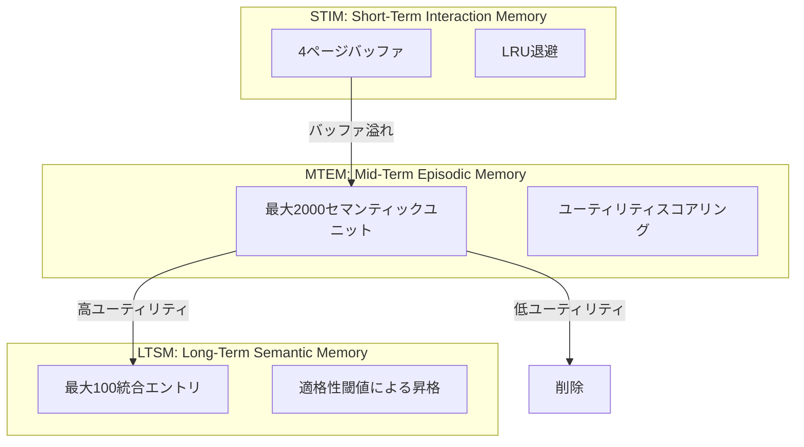
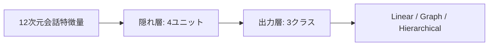

## 論文概要（Abstract）

本記事は [https://arxiv.org/abs/2602.14038](https://arxiv.org/abs/2602.14038) の解説記事です。

FluxMemは、LLMエージェントのメモリシステムにおいて「どの構造で記憶するか」を会話コンテキストに応じて動的に選択するフレームワークである。3層のメモリ階層（短期・中期・長期）と3種のメモリ構造（線形・グラフ・階層）を組み合わせ、Beta混合モデル（BMM）による適応的ゲーティングと浅層MLPによる構造選択を導入している。著者らは、PERSONAMEMベンチマークで平均精度72.43%（O-Mem比+9.18%）、LoCoMoで平均F1 51.16%（O-Mem比+6.14%）の改善を報告している。

この記事は [Zenn記事: LLMエージェントの長期記憶2026年最新動向 Mem0・A-Mem・Titansの実装と比較](https://zenn.dev/0h_n0/articles/8b6e6b07d36c5d) の深掘りです。

## 情報源

- **arXiv ID**: 2602.14038
- **URL**: [https://arxiv.org/abs/2602.14038](https://arxiv.org/abs/2602.14038)
- **著者**: Mingfei Lu et al.
- **発表年**: 2026
- **分野**: cs.AI, cs.CL

## 背景と動機（Background & Motivation）

LLMエージェントの記憶システムは、会話内容をどのような構造で保持するかによって検索性能が大きく左右される。従来のメモリシステム（MemGPT、Mem0、A-Memなど）は、事前に固定された単一のメモリ構造を採用しており、以下の問題を抱えていた。

1. **構造の固定化**: 時系列クエリにはリスト型が有利だが、エンティティ間関係のクエリにはグラフ型が有利であり、単一構造ではすべてのクエリタイプに対応できない
2. **類似度閾値の脆弱性**: 記憶の統合・取得に固定の類似度閾値（cosine similarity > 0.8等）を用いる手法は、埋め込みの分布に敏感で汎化しにくい
3. **コンテキスト無視の構造選択**: 会話の特性（エンティティ密度、トピック多様性、時間的広がり等）を考慮せずに一律の構造を適用している

著者らは、人間の記憶システムが状況に応じてエピソード記憶・意味記憶・手続き記憶を使い分けるように、LLMエージェントも会話コンテキストに応じてメモリ構造を動的に選択すべきであると指摘している。

## 主要な貢献（Key Contributions）

- **貢献1**: 短期（STIM）・中期（MTEM）・長期（LTSM）の3層メモリ階層を設計し、記憶の粒度と持続期間に応じた管理を実現
- **貢献2**: 線形・グラフ・階層の3種メモリ構造を導入し、クエリタイプに応じた最適構造での記憶保持・検索を可能に
- **貢献3**: Beta混合モデル（BMM）によるゲーティング機構を提案し、固定類似度閾値を排除。データ分布に適応的な閾値決定を実現
- **貢献4**: 12次元の会話特徴量を入力とする浅層MLPで構造選択を行い、オフライン教師あり学習で訓練。オンラインRLを不要にした
- **貢献5**: PERSONAMEMとLoCoMoの2つのベンチマークでSOTA性能を達成し、各構造の除去実験で構造選択の有効性を定量的に示した

## 技術的詳細（Technical Details）

### 3層メモリ階層

FluxMemは記憶の保持期間と抽象度に応じて3層の階層構造を採用している。



**STIM（Short-Term Interaction Memory）** は4ページ分の直近会話を保持するバッファである。バッファが満杯になるとLRU（Least Recently Used）方式で最も古い会話がMTEMに退避される。

**MTEM（Mid-Term Episodic Memory）** は最大2000のセマンティックユニットを保持し、以下のユーティリティスコアで各エントリの重要度を管理する。

$$
U(m) = f_{\text{access}}(m) \times I_{\text{interact}}(m) \times R_{\text{recency}}(m)
$$

ここで、
- $f_{\text{access}}(m)$: メモリ $m$ のアクセス頻度
- $I_{\text{interact}}(m)$: インタラクション強度（会話中での参照深度）
- $R_{\text{recency}}(m)$: 時間的新しさの減衰関数

**LTSM（Long-Term Semantic Memory）** は最大100の統合エントリを保持する。MTEMからの昇格には適格性閾値を超えるユーティリティスコアが必要であり、昇格時に類似エントリの統合（consolidation）が行われる。

### 3種メモリ構造

FluxMemは記憶を以下の3種の構造で並行管理する。

| 構造 | 用途 | 適するクエリ |
|------|------|------------|
| **Linear Memory** | 時系列順の格納 | 「いつ」「何番目」等の時間的クエリ |
| **Graph Memory** | エンティティ中心の関係構造 | 「誰が」「何と関連する」等の関係クエリ |
| **Hierarchical Memory** | 粗→細のトピック抽象化 | 「〜に関して」等のトピック横断クエリ |

Linear Memoryは会話ターンを時系列順に格納し、時間的近傍検索を可能にする。Graph Memoryはエンティティをノード、関係をエッジとして構造化し、関係推論クエリに対応する。Hierarchical Memoryはトピック階層を構築し、粗い粒度から細かい粒度へのドリルダウン検索を実現する。

### Beta混合モデル（BMM）によるゲーティング

従来のメモリシステムでは、新しい記憶を既存エントリと統合するか別エントリとして追加するかの判断に固定の類似度閾値を用いていた。FluxMemではBeta混合モデルでこの判断を適応的に行う。

類似度スコア $x \in [0, 1]$ の分布を2成分のBeta混合モデルでモデル化する。

$$
p(x) = \pi \cdot \text{Beta}(x; \alpha_1, \beta_1) + (1 - \pi) \cdot \text{Beta}(x; \alpha_0, \beta_0)
$$

ここで、
- $\pi$: 混合比率（「統合すべき」成分の事前確率）
- $\text{Beta}(x; \alpha_1, \beta_1)$: 高類似度成分（統合候補）
- $\text{Beta}(x; \alpha_0, \beta_0)$: 低類似度成分（非統合候補）
- $\alpha_k, \beta_k$: 各成分のBeta分布パラメータ

パラメータ推定はEMアルゴリズムで行い、E-stepでは対数空間での負担率（responsibility）を計算する。

$$
\gamma_k^{(i)} = \frac{\pi_k \cdot \text{Beta}(x_i; \alpha_k, \beta_k)}{\sum_{j} \pi_j \cdot \text{Beta}(x_i; \alpha_j, \beta_j)}
$$

新しい記憶 $x_{\text{new}}$ に対する事後確率が適応的ゲーティングとして機能する。

$$
P(\text{merge} \mid x_{\text{new}}) = \frac{\pi \cdot \text{Beta}(x_{\text{new}}; \alpha_1, \beta_1)}{p(x_{\text{new}})}
$$

著者らは最適なゲーティング閾値 $\tau_{\text{BMM}} = 0.5$ を報告している。この閾値はデータ分布から自動的に決定されるため、固定閾値に比べてドメイン間移行時の再調整が不要である。

### コンテキスト対応構造選択

会話コンテキストに応じてどのメモリ構造を使用するかを決定する分類器として、浅層MLP（2層: 12→4→3）を採用している。



入力の12次元特徴量は以下の解釈可能な会話特性を捉える。

| カテゴリ | 特徴量の例 |
|---------|-----------|
| エンティティ | エンティティ密度、固有名詞比率 |
| トピック | トピック多様性、トピック遷移頻度 |
| 時間 | 時間的広がり（タイムスパン）、時制分布 |
| 構造 | 質問パターン、文の複雑度 |

訓練はオフライン教師あり学習で行う。各会話に対して3構造すべてで記憶・検索を評価し、最高報酬を得た構造を正解ラベルとする。この方式によりオンラインRLの不安定性を回避している。

## 実装のポイント（Implementation）

著者らの実験環境は2×A100 GPUで、GPT-4.1（temperature=0）を使用している。埋め込みにはall-MiniLM-L6-v2を使用し、BM25とのreciprocal rank fusionで検索精度を向上させている。

報酬関数の重みは $\lambda_{\text{judge}} = 0.7$、$\lambda_{\text{mem}} = 0.3$ と設定されており、LLM judgeによる応答品質評価を重視しつつ、メモリ効率も考慮する設計となっている。

BMMのパラメータ推定にはログ空間での数値安定化が必要である。Beta分布の確率密度関数は $x \to 0$ や $x \to 1$ で数値的に不安定になるため、対数確率での計算が推奨される。MTEMの2000エントリ上限とLTSMの100エントリ上限は、検索レイテンシとメモリ品質のトレードオフから決定されている。

## Production Deployment Guide

FluxMemの3層メモリ階層と3種メモリ構造をプロダクション環境に構築するためのAWSパターンを示す。

### AWS実装パターン（コスト最適化重視）

FluxMemの特徴は、Linear・Graph・Hierarchicalの3種メモリ構造を並行管理する点にある。AWSでは各構造に最適なマネージドサービスを割り当てる。

**トラフィック量別の推奨構成**:

| 構成 | トラフィック | サービス構成 | 月額概算 |
|------|------------|------------|---------|
| Small | ~100 req/日 | Lambda + DynamoDB(Linear) + Neptune Serverless(Graph) + OpenSearch Serverless(Hierarchical) | $150-300 |
| Medium | ~1000 req/日 | ECS Fargate + DynamoDB + Neptune + OpenSearch | $500-1,200 |
| Large | 10000+ req/日 | EKS + ElastiCache(STIM) + Neptune(Graph) + OpenSearch(Hierarchical) + DynamoDB(Linear) | $2,500-5,000 |

※ 2026年3月時点のAWS ap-northeast-1（東京）リージョン料金に基づく概算値。実際のコストはトラフィックパターン、バースト使用量により変動する。最新料金はAWS料金計算ツールで確認を推奨。

**Small構成の詳細**:
- **STIM**: Lambda関数内のインメモリキャッシュ（4ページバッファ）
- **MTEM/Linear**: DynamoDB（On-Demandモード、ソートキーにtimestamp）で時系列格納
- **MTEM/Graph**: Neptune Serverless（最小2 NCU）でエンティティ関係管理
- **MTEM/Hierarchical**: OpenSearch Serverless（0.5 OCU最小）でトピック階層検索
- **LTSM**: DynamoDB（統合エントリ最大100件、読み取り負荷低）
- **BMM推論**: Lambda内でscipy.stats.betaで軽量推論
- **構造選択MLP**: Lambda内でONNX Runtime推論（12→4→3の浅層モデル）

**Large構成の詳細**:
- **STIM**: ElastiCache for Redis（r7g.large）で4ページバッファを複数ワーカー間で共有
- **MTEM/Linear**: DynamoDB（Provisioned + DAX Cache）で高スループット時系列アクセス
- **MTEM/Graph**: Neptune（db.r6g.xlarge）でエンティティグラフの高速トラバーサル
- **MTEM/Hierarchical**: OpenSearch（3ノードクラスタ、r6g.large）でトピック階層検索
- **LTSM**: DynamoDB Global Tables（マルチリージョン、100エントリ上限で低コスト）
- **BMM/MLP**: EKSポッド内でバッチ推論、Karpenter Spot Instancesで自動スケーリング

**コスト削減テクニック**:
- Neptune Serverlessは最小NCU設定で非利用時のコストを抑制
- OpenSearch Serverlessは0.5 OCU最小で開発・小規模環境に適する
- DynamoDB On-Demandモードでバースト対応しつつ基本料金を最小化
- EKS Spot Instances（Karpenter）で計算ノードコストを最大90%削減

### Terraformインフラコード

**Small構成（Serverless）**:

```hcl
# FluxMem Small構成: Lambda + DynamoDB + Neptune Serverless + OpenSearch Serverless
# 月額概算: $150-300（~100 req/日）

resource "aws_dynamodb_table" "fluxmem_linear" {
  name         = "fluxmem-linear-memory"
  billing_mode = "PAY_PER_REQUEST"
  hash_key     = "session_id"
  range_key    = "timestamp"

  attribute {
    name = "session_id"
    type = "S"
  }
  attribute {
    name = "timestamp"
    type = "N"
  }

  # ユーティリティスコア用GSI
  global_secondary_index {
    name            = "utility-score-index"
    hash_key        = "session_id"
    range_key       = "utility_score"
    projection_type = "ALL"
  }
  attribute {
    name = "utility_score"
    type = "N"
  }

  point_in_time_recovery { enabled = true }
  server_side_encryption { enabled = true }

  tags = { Service = "fluxmem", Layer = "mtem-linear" }
}

resource "aws_dynamodb_table" "fluxmem_ltsm" {
  name         = "fluxmem-ltsm"
  billing_mode = "PAY_PER_REQUEST"
  hash_key     = "entry_id"

  attribute {
    name = "entry_id"
    type = "S"
  }

  point_in_time_recovery { enabled = true }
  server_side_encryption { enabled = true }

  tags = { Service = "fluxmem", Layer = "ltsm" }
}

# Neptune Serverless (Graph Memory)
resource "aws_neptune_cluster" "fluxmem_graph" {
  cluster_identifier  = "fluxmem-graph"
  engine              = "neptune"
  serverless_v2_scaling_configuration {
    min_capacity = 2.0   # 最小NCU: コスト最適化
    max_capacity = 16.0
  }
  storage_encrypted   = true
  skip_final_snapshot = false

  tags = { Service = "fluxmem", Layer = "mtem-graph" }
}

# Lambda関数（BMM推論 + 構造選択MLP + STIM管理）
resource "aws_lambda_function" "fluxmem_engine" {
  function_name = "fluxmem-memory-engine"
  runtime       = "python3.12"
  handler       = "handler.lambda_handler"
  memory_size   = 1024  # BMM計算 + ONNX推論に必要
  timeout       = 30

  environment {
    variables = {
      DYNAMO_LINEAR_TABLE = aws_dynamodb_table.fluxmem_linear.name
      DYNAMO_LTSM_TABLE   = aws_dynamodb_table.fluxmem_ltsm.name
      NEPTUNE_ENDPOINT    = aws_neptune_cluster.fluxmem_graph.endpoint
      BMM_TAU_THRESHOLD   = "0.5"
      STIM_BUFFER_SIZE    = "4"
      MTEM_MAX_ENTRIES     = "2000"
      LTSM_MAX_ENTRIES     = "100"
    }
  }

  tags = { Service = "fluxmem" }
}

# CloudWatch アラーム（コスト監視）
resource "aws_cloudwatch_metric_alarm" "neptune_cost" {
  alarm_name          = "fluxmem-neptune-ncu-high"
  comparison_operator = "GreaterThanThreshold"
  evaluation_periods  = 3
  metric_name         = "ServerlessDatabaseCapacity"
  namespace           = "AWS/Neptune"
  period              = 300
  statistic           = "Average"
  threshold           = 8.0  # NCU上限の50%で警告
  alarm_actions       = [aws_sns_topic.fluxmem_alerts.arn]

  dimensions = {
    DBClusterIdentifier = aws_neptune_cluster.fluxmem_graph.cluster_identifier
  }
}

resource "aws_sns_topic" "fluxmem_alerts" {
  name = "fluxmem-cost-alerts"
}
```

**Large構成（Container）**:

```hcl
# FluxMem Large構成: EKS + ElastiCache + Neptune + OpenSearch
# 月額概算: $2,500-5,000（10000+ req/日）

module "eks" {
  source          = "terraform-aws-modules/eks/aws"
  version         = "~> 20.0"
  cluster_name    = "fluxmem-cluster"
  cluster_version = "1.31"

  vpc_id     = module.vpc.vpc_id
  subnet_ids = module.vpc.private_subnets

  # Karpenter用IAM
  enable_karpenter = true
  karpenter_node = {
    iam_role_additional_policies = {
      AmazonSSMManagedInstanceCore = "arn:aws:iam::aws:policy/AmazonSSMManagedInstanceCore"
    }
  }
}

# Karpenter NodePool: Spot優先でコスト最大90%削減
resource "kubectl_manifest" "karpenter_nodepool" {
  yaml_body = yamlencode({
    apiVersion = "karpenter.sh/v1"
    kind       = "NodePool"
    metadata   = { name = "fluxmem-compute" }
    spec = {
      template = {
        spec = {
          requirements = [
            { key = "karpenter.sh/capacity-type", operator = "In", values = ["spot", "on-demand"] },
            { key = "node.kubernetes.io/instance-type", operator = "In",
              values = ["m7g.xlarge", "m7g.2xlarge", "r7g.xlarge"] }
          ]
        }
      }
      limits   = { cpu = "64", memory = "256Gi" }
      disruption = { consolidationPolicy = "WhenEmptyOrUnderutilized" }
    }
  })
}

# ElastiCache for Redis (STIM: 共有4ページバッファ)
resource "aws_elasticache_replication_group" "fluxmem_stim" {
  replication_group_id = "fluxmem-stim"
  description          = "FluxMem STIM buffer"
  node_type            = "cache.r7g.large"
  num_cache_clusters   = 2  # Multi-AZ
  at_rest_encryption_enabled = true
  transit_encryption_enabled = true

  tags = { Service = "fluxmem", Layer = "stim" }
}

# AWS Budgets（月額予算アラート）
resource "aws_budgets_budget" "fluxmem_monthly" {
  name         = "fluxmem-monthly-budget"
  budget_type  = "COST"
  limit_amount = "5000"
  limit_unit   = "USD"
  time_unit    = "MONTHLY"

  notification {
    comparison_operator       = "GREATER_THAN"
    threshold                 = 80
    threshold_type            = "PERCENTAGE"
    notification_type         = "ACTUAL"
    subscriber_sns_topic_arns = [aws_sns_topic.fluxmem_alerts.arn]
  }
}
```

### 運用・監視設定

**CloudWatch Logs Insights クエリ**（構造選択の分布監視）:

```
fields @timestamp, structure_selected, query_type, latency_ms
| stats count() as cnt by structure_selected
| sort cnt desc
```

**CloudWatch Logs Insights クエリ**（BMM閾値付近のボーダーライン検知）:

```
fields @timestamp, bmm_posterior, merge_decision
| filter bmm_posterior > 0.4 and bmm_posterior < 0.6
| stats count() as borderline_cnt by bin(1h)
```

**X-Ray トレーシング設定**:

```python
from aws_xray_sdk.core import xray_recorder, patch_all
import boto3

patch_all()  # boto3自動計装

@xray_recorder.capture("fluxmem_memory_operation")
def process_memory(session_id: str, message: str) -> dict:
    """メモリ操作の全段階をトレース"""
    subsegment = xray_recorder.current_subsegment()
    subsegment.put_annotation("session_id", session_id)

    # 構造選択MLPの推論時間
    with xray_recorder.in_subsegment("structure_selection"):
        structure = select_structure(message)
        subsegment.put_metadata("selected_structure", structure)

    # BMMゲーティング
    with xray_recorder.in_subsegment("bmm_gating"):
        merge_decision = bmm_gate(message, structure)
        subsegment.put_metadata("bmm_posterior", merge_decision["posterior"])

    return {"structure": structure, "merged": merge_decision["merged"]}
```

**Cost Explorer自動レポート**:

```python
import boto3
from datetime import datetime, timedelta

def daily_cost_report() -> dict:
    """FluxMemの日次コストレポートを生成"""
    ce = boto3.client("ce")
    end = datetime.utcnow().strftime("%Y-%m-%d")
    start = (datetime.utcnow() - timedelta(days=1)).strftime("%Y-%m-%d")

    response = ce.get_cost_and_usage(
        TimePeriod={"Start": start, "End": end},
        Granularity="DAILY",
        Metrics=["UnblendedCost"],
        Filter={
            "Tags": {
                "Key": "Service",
                "Values": ["fluxmem"],
            }
        },
        GroupBy=[{"Type": "DIMENSION", "Key": "SERVICE"}],
    )

    costs = {}
    for group in response["ResultsByTime"][0]["Groups"]:
        service = group["Keys"][0]
        amount = float(group["Metrics"]["UnblendedCost"]["Amount"])
        costs[service] = amount

    total = sum(costs.values())
    if total > 100:  # $100/日超過でアラート
        sns = boto3.client("sns")
        sns.publish(
            TopicArn="arn:aws:sns:ap-northeast-1:ACCOUNT:fluxmem-cost-alerts",
            Subject=f"FluxMem Daily Cost Alert: ${total:.2f}",
            Message=f"Services breakdown: {costs}",
        )
    return costs
```

### コスト最適化チェックリスト

**アーキテクチャ選択**:
- [ ] ~100 req/日ならServerless構成（Lambda + Neptune Serverless + OpenSearch Serverless）
- [ ] ~1000 req/日ならHybrid構成（ECS Fargate + マネージドDB）
- [ ] 10000+ req/日ならContainer構成（EKS + Karpenter Spot）

**リソース最適化**:
- [ ] EKS: Karpenter Spot Instances優先（最大90%削減）
- [ ] Neptune: Serverless v2で非利用時のNCUを最小化
- [ ] OpenSearch: Serverlessで0.5 OCU最小設定
- [ ] DynamoDB: On-Demandモードでプロビジョニング不要
- [ ] ElastiCache: Reserved Nodesで1年コミット（最大55%削減）
- [ ] Lambda: メモリ1024MBでBMM+ONNX推論に最適化

**LLMコスト削減**:
- [ ] Bedrock Batch APIで非リアルタイム処理を50%削減
- [ ] Prompt Caching有効化でSTIM繰り返しを30-90%削減
- [ ] 構造選択MLPでONNX軽量推論（LLM呼び出し不要）
- [ ] MTEMユーティリティスコアで低価値メモリを早期削除

**監視・アラート**:
- [ ] AWS Budgets月額上限設定
- [ ] CloudWatch Neptune NCUアラーム
- [ ] Cost Anomaly Detection有効化
- [ ] 日次コストレポートSNS通知
- [ ] BMM borderlineケース監視

**リソース管理**:
- [ ] 未使用Neptune Serverlessクラスタの削除
- [ ] DynamoDB TTLで古いMTEMエントリ自動削除
- [ ] タグ戦略（Service/Layer/Environment）統一
- [ ] 開発環境Neptune/OpenSearchの夜間停止
- [ ] S3ライフサイクルポリシーでログ自動削除

## 実験結果（Results）

### PERSONAMEMベンチマーク

PERSONAMEMはペルソナ一貫性を測定するベンチマークである。著者らは論文Table 2で以下の結果を報告している。

| 手法 | 平均精度 (%) | 対FluxMem差分 |
|------|-------------|--------------|
| RAG (ベースライン) | 55.12 | -17.31 |
| MemGPT | 58.47 | -13.96 |
| Mem0 | 61.83 | -10.60 |
| A-Mem | 62.09 | -10.34 |
| O-Mem | 63.25 | -9.18 |
| **FluxMem** | **72.43** | — |

FluxMemはO-Memに対して+9.18ポイントの改善を達成している。著者らは、ペルソナ情報が時系列・関係・トピックの複数側面を持つため、適応的構造選択が有効に機能したと分析している。

### LoCoMoベンチマーク

LoCoMoは長期会話メモリの質を測定するベンチマークである。論文Table 3の結果を以下に示す。

| 手法 | 平均F1 (%) | Single-hop F1 (%) | Open-domain ROUGE-L (%) |
|------|-----------|-------------------|------------------------|
| O-Mem | 46.40 | — | — |
| **FluxMem** | **51.16** | **+7.23** (差分) | **+8.93** (差分) |

Single-hopクエリでの+7.23% F1改善は構造選択の精度向上を、Open-domainでの+8.93% ROUGE-L改善はHierarchical Memoryによるトピック横断検索の効果を示している。

### Ablation Study

各構造・機構の除去実験の結果を著者らは以下のように報告している（論文Table 4より）。

| 除去対象 | 性能低下幅 | 影響が大きいクエリタイプ |
|---------|-----------|---------------------|
| Linear Memory除去 | -4.2% 〜 -6.8% | 時間的クエリ |
| Graph Memory除去 | -6.6% 〜 -19% | 関係推論クエリ |
| Hierarchical Memory除去 | -3.1% 〜 -5.5% | トピック横断クエリ |
| BMM除去（固定閾値に置換） | -2.3% 〜 -7.4% | 全クエリタイプ |

Graph Memoryの除去が最大-19%の性能低下を引き起こしており、エンティティ間関係を明示的に保持する構造の重要性を示している。BMMの除去は全クエリタイプで一様に性能低下を招いており、適応的ゲーティングがドメイン横断的に有効であることが確認される。

## 実運用への応用（Practical Applications）

FluxMemの適応的構造選択は、以下のプロダクションシナリオで有用である。

**カスタマーサポートエージェント**: 顧客との長期会話において、「過去にいつ問い合わせたか」（Linear）、「どの製品とどの問題が関連するか」（Graph）、「セキュリティに関する過去の質問すべて」（Hierarchical）といった多様なクエリパターンが混在する。FluxMemの構造選択により、クエリタイプに応じた最適な検索が可能になる。

**パーソナルアシスタント**: ユーザーの嗜好・スケジュール・人間関係を長期的に記憶する場合、MTEMのユーティリティスコアリングにより重要な情報を優先保持しつつ、LTSMへの統合で記憶量を制御できる。100エントリのLTSM上限は、検索レイテンシを低く保つ設計判断である。

**スケーリングの観点**: MTEMの2000エントリ上限とLTSMの100エントリ上限は、記憶量増大時の検索レイテンシを O(log N) に抑える設計である。Graph MemoryのNeptune実装ではGremlinクエリの深さを制限し、Hierarchical MemoryのOpenSearch実装ではトピック階層の深さを固定することで、予測可能なレイテンシを確保できる。

## 関連研究（Related Work）

- **MemGPT** (Packer et al., 2023): OS仮想メモリのページング機構をLLMに適用。FluxMemはMemGPTの階層概念を拡張し、3種メモリ構造の動的選択を追加
- **Mem0** (2024): ユーザー嗜好を抽出・更新する記憶レイヤ。固定の単一構造（key-value）であり、クエリタイプへの適応性がFluxMemより限定的
- **A-Mem** (NeurIPS 2025): Zettelkasten手法に着想を得た自己組織化メモリ。ノート間リンクによる関連発見はGraph Memoryに類似するが、構造の動的選択機構を持たない
- **O-Mem**: FluxMemの直接的なベースライン。単一メモリ構造でPERSONAMEM 63.25%を達成したが、FluxMemの適応的選択により+9.18%の改善が達成された
- **Titans** (Google DeepMind, 2025): ニューラルネットワークの重みにメモリを圧縮するアプローチ。FluxMemの明示的メモリ構造とは対照的に、暗黙的記憶を学習する

## まとめと今後の展望

FluxMemは、LLMエージェントのメモリシステムにおける「構造の固定化」問題に対し、3層階層×3種構造の組み合わせとBMMゲーティングという明確な解を提示した。特にGraph Memory除去時の最大-19%低下は、エンティティ関係の明示的管理が長期記憶において不可欠であることを示唆している。

今後の課題として、著者らはメモリ構造のさらなる拡張（手続き記憶の追加等）、オンライン適応（会話中のBMMパラメータ更新）、マルチモーダル記憶（画像・音声を含む記憶構造）を挙げている。実務的には、Neptune ServerlessとOpenSearch Serverlessの組み合わせにより、小規模からの段階的導入が可能である。

## 参考文献

- **arXiv**: [https://arxiv.org/abs/2602.14038](https://arxiv.org/abs/2602.14038)
- **Related Zenn article**: [https://zenn.dev/0h_n0/articles/8b6e6b07d36c5d](https://zenn.dev/0h_n0/articles/8b6e6b07d36c5d)
- **MemGPT**: [https://arxiv.org/abs/2310.08560](https://arxiv.org/abs/2310.08560)
- **A-Mem**: NeurIPS 2025
- **Titans**: [https://arxiv.org/abs/2501.00663](https://arxiv.org/abs/2501.00663)
