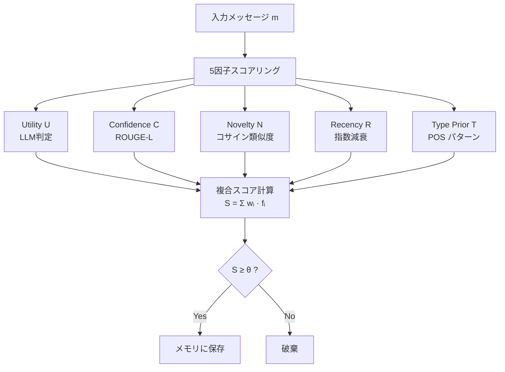
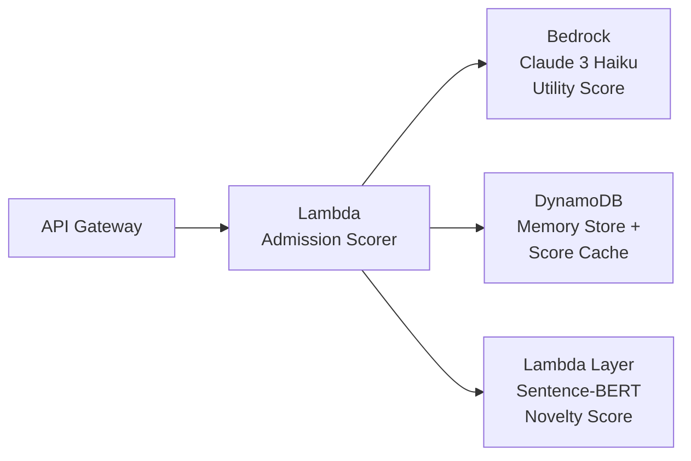
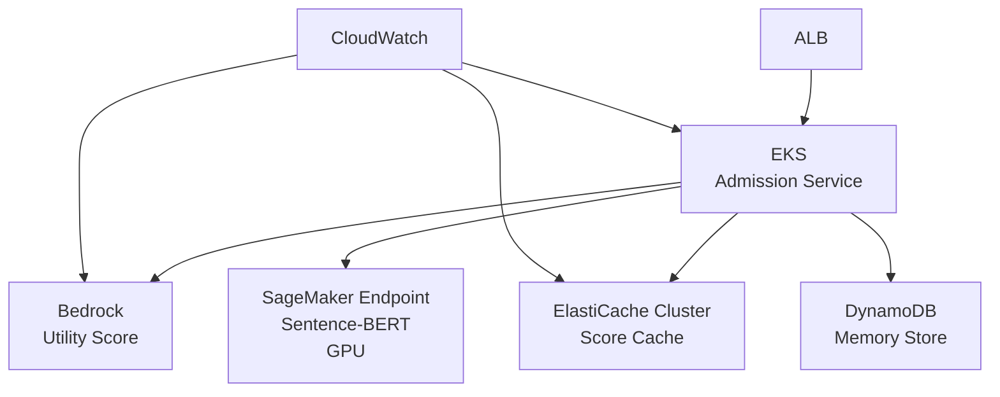

本記事は [Adaptive Memory Admission Control for LLM Agents](https://arxiv.org/abs/2603.04549)（Zhang, Jiang et al., 2026）の解説記事です。

## 論文概要

本論文は、LLMエージェントの長期記憶においてどの情報をメモリに保存すべきかを判断する「メモリ入力制御（Memory Admission Control）」問題に対し、5つの解釈可能な因子による適応的スコアリングフレームワーク「A-MAC（Adaptive Memory Admission Control）」を提案した研究である。著者らは、LoCoMoベンチマークにおいてF1=0.583を達成し、従来手法A-Memの0.541に対して7.8%の改善を報告している。同時にレイテンシを3,831msから2,644msへ31%削減したと報告している。

この記事は [Zenn記事: LLMエージェントの長期記憶2026年最新動向 Mem0・A-Mem・Titansの実装と比較](https://zenn.dev/0h_n0/articles/8b6e6b07d36c5d) の深掘りです。Zenn記事ではA-Memを含む複数の記憶管理手法を比較しているが、本論文はA-Memの改良として位置づけられ、メモリ入力制御の判断基準をより体系的に定義している。

## 情報源

- **arXiv ID**: 2603.04549
- **URL**: [https://arxiv.org/abs/2603.04549](https://arxiv.org/abs/2603.04549)
- **著者**: Guilin Zhang, Wei Jiang et al.（Workday AI）
- **年**: 2026年3月

## 背景と動機

LLMエージェントが対話やタスク実行を通じて蓄積する長期記憶は、エージェントの一貫性と適応性を左右する重要な要素である。しかし、すべての情報を無差別にメモリへ保存すると以下の問題が発生する：

1. **幻覚の伝播**: 不正確な情報がメモリに蓄積され、以降の推論で参照されることで誤った応答が連鎖する
2. **メモリの肥大化**: 冗長な情報が検索精度を低下させ、レイテンシを増加させる
3. **判断基準の不透明性**: 既存手法の多くはLLMの暗黙的判断に依存しており、なぜその情報が保存されたかを説明できない

著者らは、メモリ入力の判断を「保存すべきか否か」の二値問題として定式化し、判断根拠を解釈可能な因子に分解することで、これらの課題を同時に解決するアプローチを取っている。

## 主要な貢献

- **5因子構造化スコアリング**: メモリ保存判断をUtility、Confidence、Novelty、Recency、Type Priorの5因子に分解し、各因子の重みを交差検証で最適化
- **ハイブリッド設計**: 5因子のうちLLM呼び出しを1回のみ（Utility）に限定し、残り4因子はルールベースで計算。レイテンシの97.6%を占めるLLM呼び出しを最小化
- **解釈可能性の確保**: 各因子のスコアが独立に可視化可能であり、アブレーション実験により各因子の寄与を定量的に分析
- **LoCoMoベンチマークでSOTA達成**: F1=0.583で従来手法を上回り、特にPrecision=0.417はLLMベース手法で最高値

## 技術的詳細

### A-MACアーキテクチャ



### 5つの入力制御因子

A-MACでは、候補メッセージ $$m$$ に対して以下の5因子を算出し、加重和による複合スコアでメモリ入力の可否を判定する。

#### 1. Utility（有用性スコア）$$U(m)$$

LLMを用いて、メッセージが将来の対話で有用かどうかを0-1のスケールで評価する。Temperature=0の固定設定でLLMを呼び出し、同一メッセージへのスコアキャッシングにより重複評価を回避する。

$$
U(m) = \text{LLM}_{\text{score}}(m, \text{context}) \in [0, 1]
$$

レイテンシは2,580msであり、A-MAC全体の処理時間（2,644ms）の97.6%を占める。このコストの大きさこそが、他の4因子をルールベースとした設計判断の根拠である。

#### 2. Confidence（確信度スコア）$$C(m)$$

メッセージの内容が対話コンテキスト中の裏付け文（support sentence）によってどの程度支持されているかを測定する。ROUGE-Lスコアの最大値を採用することで、幻覚情報の伝播を抑制する。

$$
C(m) = \max_{s \in \mathcal{S}} \text{ROUGE-L}(m, s)
$$

ここで $$\mathcal{S}$$ は対話中の裏付け文集合である。処理時間は18msである。

#### 3. Novelty（新規性スコア）$$N(m)$$

既存メモリに対する情報の新規性を、Sentence-BERTによる埋め込みのコサイン類似度で測定する。既存メモリとの最大類似度を1から引くことで、冗長な情報の保存を防ぐ。

$$
N(m) = 1 - \max_{m' \in \mathcal{M}} \cos(\phi(m), \phi(m'))
$$

ここで $$\phi(\cdot)$$ はSentence-BERTの埋め込み関数、$$\mathcal{M}$$ は既存メモリ集合である。処理時間は32msである。

#### 4. Recency（時間減衰スコア）$$R(m)$$

メッセージの新しさを指数減衰関数で評価する。減衰定数 $$\lambda = 0.01$$/時間で、半減期は約69時間（約3日）に設定されている。

$$
R(m) = \exp(-\lambda \cdot \tau(m))
$$

ここで $$\tau(m)$$ はメッセージからの経過時間（時間単位）である。処理時間は1ms未満である。

#### 5. Type Prior（型事前確率スコア）$$T(m)$$

メッセージの品詞パターンに基づくルールベースの分類スコアである。著者らのアブレーション実験では、この因子を除去した場合のF1低下が最大（$$\Delta$$F1=-0.107）であり、5因子中最も影響が大きいと報告されている。

$$
T(m) = \text{POS\_Pattern}(m) \in [0, 1]
$$

処理時間は14msである。

### 複合スコアと入力判定

5因子の加重和により複合スコアを算出する：

$$
S(m) = w_1 \cdot U(m) + w_2 \cdot C(m) + w_3 \cdot N(m) + w_4 \cdot R(m) + w_5 \cdot T(m)
$$

重み $$w_1, \ldots, w_5$$ はLoCoMoデータセット上の5-fold交差検証により、F1スコアを最大化するよう学習される。閾値 $$\theta$$ を超えたメッセージのみがメモリに保存される。

### レイテンシ内訳

| 因子 | 手法 | レイテンシ | 全体に占める割合 |
|------|------|-----------|-----------------|
| Utility | LLM呼び出し | 2,580ms | 97.6% |
| Novelty | Sentence-BERT | 32ms | 1.2% |
| Confidence | ROUGE-L | 18ms | 0.7% |
| Type Prior | POS パターン | 14ms | 0.5% |
| Recency | 指数減衰 | <1ms | <0.1% |
| **合計** | | **2,644ms** | **100%** |

論文Table 4より。LLM呼び出しが支配的であるため、LLMの推論高速化がA-MAC全体のレイテンシ改善に直結する。

## 実装のポイント

### スコアキャッシング戦略

Utilityスコアのキャッシングは、同一メッセージの重複評価を防ぐだけでなく、バッチ処理シナリオ（例：過去の対話ログの一括インポート）での大幅な高速化に寄与する。著者らはTemperature=0を採用しているため、同一入力に対する出力の決定性が保証されている。

### 重み最適化

5因子の重みは、LoCoMoの訓練分割を用いた5-fold交差検証でグリッドサーチにより最適化される。この設計は、新しいドメインへの適応時に重みの再学習のみで対応可能という利点がある。因子の追加・削除も容易であり、ドメイン固有の因子を加える拡張性を持つ。

### ハイブリッド設計の判断根拠

5因子すべてをLLMで評価する設計も考えられるが、著者らはUtilityのみLLMに依存する設計を選択している。理由は、(1) レイテンシの97.6%がLLM呼び出しに起因するため追加のLLM呼び出しはコスト的に非現実的、(2) Confidence・Novelty・Recency・Type Priorは明確なアルゴリズムで定義可能であり、LLMの曖昧な判断を介在させる必要がない、という2点である。

## Production Deployment Guide

A-MACの本番環境への導入について、AWSを前提とした3つの規模パターンを示す。A-MACの特徴であるLLM呼び出し1回＋ルールベース4因子というハイブリッド設計を活かした構成である。

### アーキテクチャパターン

#### Small（月間10万リクエスト以下）

Lambda関数でAdmission Scoring全体を処理し、DynamoDBにメモリストアとスコアキャッシュを集約する構成。LLMのUtility判定にはBedrock（Claude 3 Haiku）を使用する。



- **Utility**: Bedrock API呼び出し（Temperature=0、スコアキャッシュはDynamoDB TTL付き）
- **Novelty**: Lambda Layerに埋め込んだSentence-BERTモデルで計算
- **Confidence/Type Prior/Recency**: Lambda内のPython関数で計算
- **月額目安**: 約$50-150（Bedrock利用料が支配的）

#### Medium（月間100万リクエスト）

ECSでAdmission Serviceをコンテナ化し、ElastiCache（Redis）でスコアキャッシュを高速化する。Novelty計算用のSentence-BERTモデルはSageMaker Serverlessで提供する。

- **Utility**: Bedrock（Claude 3.5 Sonnet）+ ElastiCacheによるキャッシュヒット率向上
- **Novelty**: SageMaker Serverless Inference（Sentence-BERT）
- **メモリストア**: DynamoDB + DAXキャッシュ
- **月額目安**: 約$500-1,500

#### Large（月間1,000万リクエスト以上）

EKSクラスタ上にAdmission Serviceをデプロイし、因子計算を並列化する。Utilityスコアのキャッシュヒット率を最大化するためにElastiCacheクラスタを配置し、Sentence-BERTはGPUインスタンス上のSageMakerリアルタイムエンドポイントで提供する。



- **Utility**: Bedrock + ElastiCacheクラスタ（キャッシュヒット率80%以上を目標）
- **Novelty**: SageMaker Real-time Endpoint（ml.g5.xlarge）
- **月額目安**: 約$3,000-8,000

### Terraformによるメモリ入力制御サービスの構成例

以下はSmallパターンのTerraform構成例である。A-MACの5因子計算とメモリストアをLambda + DynamoDBで実装する。

```hcl
# A-MAC Admission Control Service - Small Pattern
resource "aws_dynamodb_table" "memory_store" {
  name         = "amac-memory-store"
  billing_mode = "PAY_PER_REQUEST"
  hash_key     = "agent_id"
  range_key    = "memory_id"

  attribute {
    name = "agent_id"
    type = "S"
  }
  attribute {
    name = "memory_id"
    type = "S"
  }

  ttl {
    attribute_name = "expires_at"
    enabled        = true
  }
}

resource "aws_dynamodb_table" "score_cache" {
  name         = "amac-score-cache"
  billing_mode = "PAY_PER_REQUEST"
  hash_key     = "message_hash"

  attribute {
    name = "message_hash"
    type = "S"
  }

  ttl {
    attribute_name = "cache_expires_at"
    enabled        = true
  }
}

resource "aws_lambda_function" "admission_scorer" {
  function_name = "amac-admission-scorer"
  runtime       = "python3.12"
  handler       = "handler.score_admission"
  timeout       = 30
  memory_size   = 1024

  environment {
    variables = {
      MEMORY_TABLE      = aws_dynamodb_table.memory_store.name
      SCORE_CACHE_TABLE = aws_dynamodb_table.score_cache.name
      BEDROCK_MODEL_ID  = "anthropic.claude-3-haiku-20240307-v1:0"
      UTILITY_TEMP      = "0"
      DECAY_LAMBDA      = "0.01"
      SCORE_THRESHOLD   = "0.5"
    }
  }
}
```

### モニタリング設定

A-MACの運用では、5因子それぞれのスコア分布と入力制御の判定結果を監視することが重要である。

```hcl
# CloudWatch Dashboard for A-MAC Metrics
resource "aws_cloudwatch_dashboard" "amac_monitoring" {
  dashboard_name = "amac-admission-control"
  dashboard_body = jsonencode({
    widgets = [
      {
        type   = "metric"
        properties = {
          title   = "Admission Rate"
          metrics = [
            ["AMAC", "AdmittedCount", { stat = "Sum" }],
            ["AMAC", "RejectedCount", { stat = "Sum" }]
          ]
          period = 300
        }
      },
      {
        type   = "metric"
        properties = {
          title   = "Factor Score Distribution"
          metrics = [
            ["AMAC", "UtilityScore", { stat = "Average" }],
            ["AMAC", "ConfidenceScore", { stat = "Average" }],
            ["AMAC", "NoveltyScore", { stat = "Average" }],
            ["AMAC", "RecencyScore", { stat = "Average" }],
            ["AMAC", "TypePriorScore", { stat = "Average" }]
          ]
          period = 300
        }
      },
      {
        type   = "metric"
        properties = {
          title   = "Latency Breakdown"
          metrics = [
            ["AMAC", "UtilityLatency", { stat = "p99" }],
            ["AMAC", "NoveltyLatency", { stat = "p99" }],
            ["AMAC", "TotalLatency", { stat = "p99" }]
          ]
          period = 300
        }
      },
      {
        type   = "metric"
        properties = {
          title   = "Score Cache Hit Rate"
          metrics = [
            ["AMAC", "CacheHit", { stat = "Sum" }],
            ["AMAC", "CacheMiss", { stat = "Sum" }]
          ]
          period = 300
        }
      }
    ]
  })
}
```

### 監視すべきメトリクス

| メトリクス | 閾値 | アクション |
|-----------|------|-----------|
| Admission Rate（保存率） | 20-40%が目安 | 高すぎ→メモリ肥大化、低すぎ→情報欠落 |
| Utility Latency p99 | <5,000ms | Bedrockスロットリング確認 |
| Score Cache Hit Rate | >60% | 低い場合はTTL延長を検討 |
| Novelty Score平均 | >0.3 | 低すぎる場合はメモリの重複が多い |
| DynamoDB Read Capacity | 自動スケーリング | バーストトラフィック対応 |

### コスト最適化チェックリスト

- [ ] **Utility Score キャッシュTTL**: 同一メッセージの再評価を防ぐ。Temperature=0のため決定的出力が保証される。TTLは24-72時間を推奨
- [ ] **Bedrock バッチ推論**: リアルタイム性が不要なバックフィルシナリオではBatch APIを使用し、コストを50%削減
- [ ] **Sentence-BERT モデル選択**: `all-MiniLM-L6-v2`（22Mパラメータ）で十分な精度が得られる場合、大型モデルを避ける
- [ ] **DynamoDB TTL**: 古いスコアキャッシュの自動削除を有効化し、ストレージコストを抑制
- [ ] **Lambda メモリサイズ**: 1024MBで開始し、AWS Lambda Power Tuningでコスト最適なメモリサイズを探索
- [ ] **因子計算の並列化**: Utility（LLM）の待ち時間中に他4因子を並列計算し、レイテンシを削減

## 実験結果

### LoCoMoベンチマーク結果

著者らは、LoCoMo（Long Conversation Memory）ベンチマークを用いて、メモリ入力制御の精度を評価している。

| 手法 | F1 | Precision | Recall | Latency (ms) |
|------|-----|-----------|--------|---------------|
| Random（30%確率） | 0.300 | 0.176 | **1.000** | <1 |
| MemGPT | 0.476 | 0.313 | 0.978 | 3,122 |
| MemoryBank | 0.501 | 0.335 | 0.967 | 2,891 |
| A-Mem | 0.541 | 0.371 | 0.978 | 3,831 |
| **A-MAC** | **0.583** | **0.417** | 0.972 | **2,644** |

論文Table 3より。A-MACはF1で7.8%の改善を達成しつつ、レイテンシを31%削減している。特にPrecision=0.417はLLMベース手法中最高であり、不要な情報の保存を効果的に抑制している。

### アブレーション実験

各因子を除去した場合のF1低下：

| 除去因子 | ΔF1 | 解釈 |
|---------|------|------|
| Type Prior | -0.107 | 最も影響が大きい。品詞パターンによる事前フィルタの有効性 |
| Utility | -0.089 | LLM判定も重要だが、Type Priorほどではない |
| Novelty | -0.052 | 冗長情報の排除に貢献 |
| Confidence | -0.038 | 幻覚抑制の効果 |
| Recency | -0.021 | 時間減衰の効果は限定的 |

論文Table 5より。Type Prior（ルールベースのPOS分類）がF1への寄与が最大であるという結果は、LLMベースの因子だけに依存する設計の非効率性を示唆している。

## 実運用への応用

A-MACの設計は以下のユースケースに適用可能である：

- **カスタマーサポートボット**: 長期対話におけるユーザ情報の選択的記憶。Type Priorにより、挨拶や定型文を自動的に除外し、重要な問い合わせ内容のみをメモリに保持
- **パーソナルAIアシスタント**: ユーザの嗜好・行動パターンの長期学習。Noveltyスコアにより既知情報の重複保存を防止
- **企業ナレッジベース管理**: 社内対話から有用な知識を自動抽出。Confidenceスコアにより、裏付けのない情報のメモリ混入を防止

ただし、LoCoMoベンチマークは英語の長期対話データセットであるため、日本語やマルチモーダルデータへの適用には追加の検証が必要である。特にType PriorのPOSパターンは言語依存であり、日本語形態素解析器（MeCab等）への置き換えが必要となる。

## 関連研究

メモリ入力制御に関連する研究として、MemGPT（Packer et al., 2023）はOS仮想メモリに着想を得たページング機構を採用し、MemoryBank（Zhong et al., 2024）は心理学のエビングハウス忘却曲線に基づく記憶更新を行う。A-Mem（Xu et al., 2025）はZettelkasten法に着想を得た自己組織化記憶を提案している。A-MACはこれらの手法と異なり、メモリ保存の判断基準を明示的な因子に分解し、各因子の重みを交差検証で最適化するという解釈可能なアプローチを取っている。

## まとめ

A-MACは、LLMエージェントのメモリ入力制御を5つの解釈可能な因子で構造化するフレームワークである。LLM呼び出しをUtility判定の1回に限定するハイブリッド設計により、精度向上とレイテンシ削減を同時に達成している。アブレーション実験により各因子の寄与が定量的に示されており、ドメインに応じた因子の調整やカスタマイズが可能な拡張性を持つ。実運用においては、スコアキャッシングとルールベース因子の並列計算が性能最適化の鍵となる。

## 参考文献

- Zhang, G., Jiang, W. et al. "Adaptive Memory Admission Control for LLM Agents." arXiv:2603.04549, 2026.
- Packer, C. et al. "MemGPT: Towards LLMs as Operating Systems." arXiv:2310.08560, 2023.
- Zhong, W. et al. "MemoryBank: Enhancing Large Language Models with Long-Term Memory." AAAI 2024.
- Xu, Z. et al. "A-Mem: Agentic Memory for LLM Agents." arXiv:2502.12110, 2025.
- Maharana, A. et al. "LoCoMo: Long Context Conversation Memory Benchmark." arXiv, 2024.
