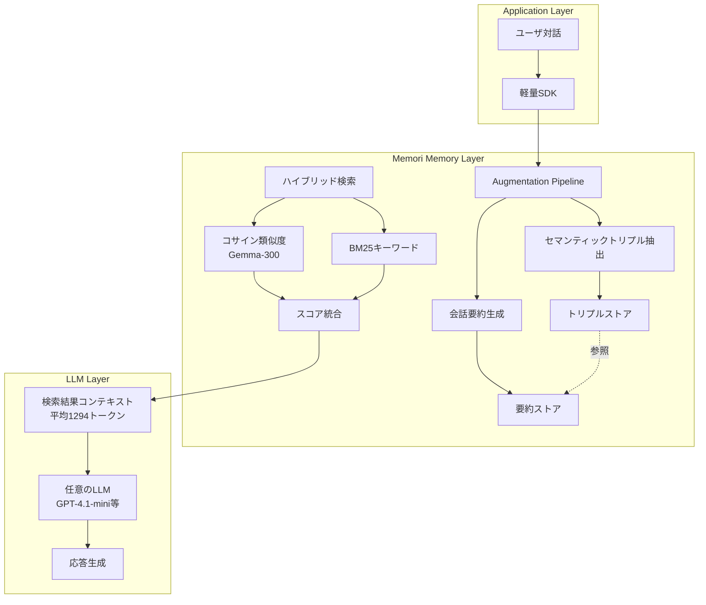
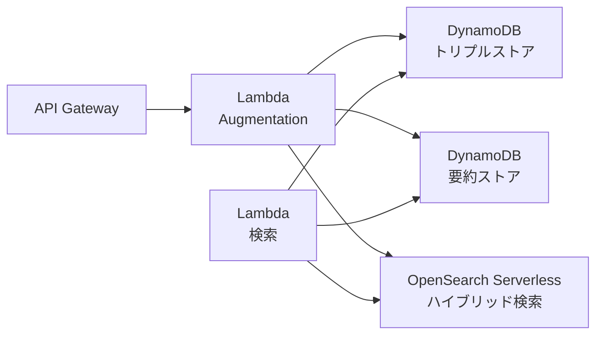
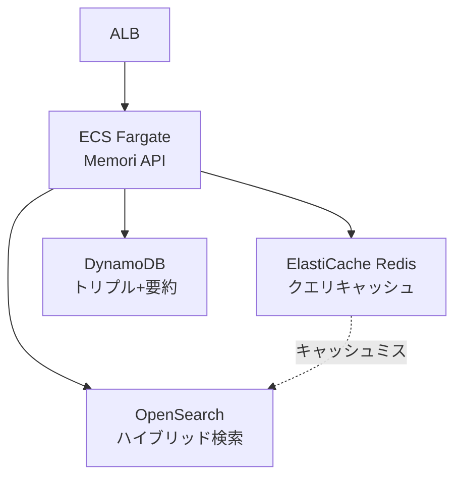
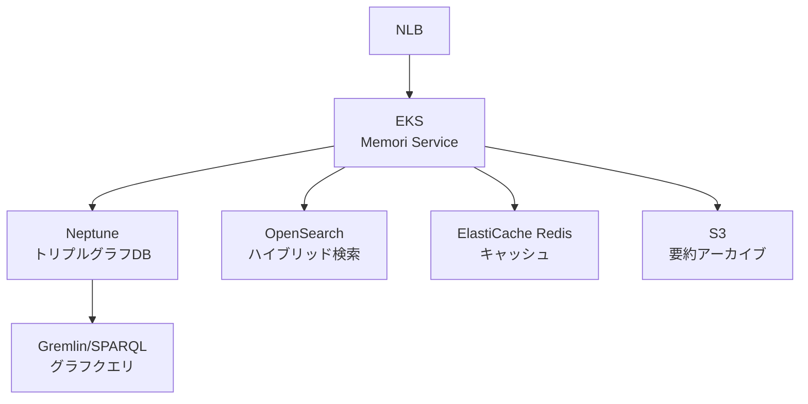

本記事は [Memori: A Persistent Memory Layer for Efficient, Context-Aware LLM Agents (arXiv:2603.19935)](https://arxiv.org/abs/2603.19935) の解説記事です。

## 論文概要（Abstract）

Memoriは、LLMエージェントの長期記憶をデータ構造化問題として再定義した永続記憶層である。著者らは、非構造化の対話履歴をセマンティックトリプル（主語-述語-目的語）と会話要約の2層構造に変換するAugmentation Pipelineを提案している。LoCoMoベンチマークにおいて81.95%の精度を達成し、既存のMem0（62.47%）やZep（79.09%）を上回ると報告している。クエリあたり1,294トークンという軽量な検索で、フルコンテキスト方式と比較して約20倍のコスト削減を実現している。

この記事は [Zenn記事: LLMエージェントの長期記憶2026年最新動向 Mem0・A-Mem・Titansの実装と比較](https://zenn.dev/0h_n0/articles/8b6e6b07d36c5d) の深掘りです。Zenn記事で取り上げたMem0やA-Memに対して、Memoriがセマンティックトリプルという異なるアプローチでどのように記憶精度とコスト効率を両立しているかを詳述します。

## 情報源

- **arXiv ID**: 2603.19935
- **URL**: [https://arxiv.org/abs/2603.19935](https://arxiv.org/abs/2603.19935)
- **発表年**: 2026年3月
- **分野**: cs.AI, cs.CL

## 背景と動機（Background & Motivation）

LLMエージェントが長期的な対話やタスク遂行を行う際、過去の文脈を保持する記憶メカニズムが不可欠である。しかし、現行のアプローチには複数の課題がある。

第一に、生の会話履歴をコンテキストウィンドウに注入する方式では、対話が長くなるほどトークン消費が膨大になる。GPT-4-miniの料金（$0.8/1Mトークン）で換算しても、フルコンテキスト方式では1クエリあたり約$0.021のコストが発生する。第二に、既存の記憶システム（Mem0、LangMem等）は特定のLLMプロバイダやベクトルDBに依存する傾向があり、ベンダーロックインのリスクがある。第三に、単純なベクトル検索のみでは、事実の断片は取得できても、それがどの文脈で述べられたかという情報が失われる。

Memoriはこれらの課題に対し、記憶の蓄積をデータ構造化問題として捉え直すことで対処している。LLMに依存しないデカップルされたアーキテクチャと、セマンティックトリプルによる構造化記憶が、精度・コスト・移植性の3つを同時に改善する設計である。

## 主要な貢献（Key Contributions）

著者らが主張する主要な貢献は以下の通りである。

- **貢献1**: 記憶の蓄積をデータ構造化問題として再定義し、非構造化対話からセマンティックトリプル（主語-述語-目的語）と会話要約の2層構造への変換パイプラインを提案
- **貢献2**: LLM非依存・ベンダー非依存のデカップルされた記憶層アーキテクチャを設計。既存のLLMクライアントをラップする軽量SDKとして実装
- **貢献3**: コサイン類似度検索（Gemma-300埋め込み）とBM25キーワード検索を組み合わせたハイブリッド検索により、粒度の異なるクエリに対応
- **貢献4**: LoCoMoベンチマークにおいて、既存の記憶システム（Mem0、Zep、LangMem）を上回る81.95%の精度を、クエリあたり1,294トークンで達成

## 技術的詳細（Technical Details）

### Augmentation Pipeline：セマンティックトリプルの抽出

Memoriの中核は、非構造化の対話データを構造化された知識表現に変換するAugmentation Pipelineである。このパイプラインは2つの出力を生成する。

**セマンティックトリプル**は、対話から抽出された原子的な知識単位であり、主語・述語・目的語の3要素で構成される。例えば、ユーザが「昨日の会議でAWSのコスト削減プランについて議論した」と述べた場合、以下のようなトリプルが生成される。

| 主語 | 述語 | 目的語 |
|-----|------|-------|
| ユーザ | 議論した | AWSコスト削減プラン |
| 会議 | 開催日 | 昨日 |
| AWSコスト削減プラン | 議題 | 会議 |

**会話要約**は、対話全体の意図と進行をキャプチャした簡潔な概要である。重要な設計判断として、各セマンティックトリプルはソースとなった会話要約への参照を保持する。これにより、粒度の高い事実が文脈から切り離されることを防いでいる。

### ハイブリッド検索

記憶の検索では、2つの手法を組み合わせている。

$$\text{score}(q, m) = \alpha \cdot \cos(\mathbf{e}_q, \mathbf{e}_m) + (1 - \alpha) \cdot \text{BM25}(q, m)$$

ここで $\mathbf{e}_q$ と $\mathbf{e}_m$ はそれぞれクエリと記憶エントリのGemma-300埋め込みベクトル、$\alpha$ はバランスパラメータである。コサイン類似度は意味的な関連性を捉え、BM25はキーワードの一致を捉える。著者らは、この組み合わせにより単一手法より頑健な検索が可能になると述べている。

この設計は、セマンティックトリプルとの相性が良い。トリプルの述語（「議論した」「好む」「所属する」等）は意味的に多様であるため、コサイン類似度が有効に機能する。一方、固有名詞（プロジェクト名、人名等）はBM25によるキーワード一致が精度に寄与する。検索結果として返されるのはトリプルとその参照先の会話要約であり、平均1,294トークンに収まるようにTop-K選択が行われる。

### アーキテクチャ全体像



このアーキテクチャの特徴は、記憶層がアプリケーションロジックとLLMの間にデカップルされて配置される点である。記憶層はLLMの種類に依存せず、SDKが既存のLLMクライアントをラップする形で動作する。これにより、LLMプロバイダの切り替えが記憶層に影響を与えない設計となっている。

### 評価手法

著者らはLoCoMoベンチマーク（1,974問）をLLM-as-a-Judgeパラダイム（GPT-4.1-miniによる評価）で使用している。回答生成にもGPT-4.1-miniを使用し、評価の一貫性を確保している。LoCoMoは長期対話記憶の評価に特化したベンチマークであり、Single-Hop、Multi-Hop、Temporal、Open-Domainの4カテゴリで構成される。

## 実装のポイント（Implementation Notes）

著者らの報告に基づく実装上の重要なポイントは以下の通りである。

**埋め込みモデルの選択**: Gemma-300を埋め込みモデルとして採用している。300次元という比較的コンパクトな埋め込みにより、ストレージとメモリの効率が良い。

**トリプル-要約参照の維持**: セマンティックトリプルが生成元の会話要約へのポインタを保持する設計は、検索時にトリプル（事実の断片）から会話全体の文脈を辿る際に重要である。この参照が失われると、断片的な事実が誤った文脈で解釈されるリスクがある。

**SDKの設計方針**: 既存のLLMクライアント（OpenAI SDK等）をラップする軽量SDKとして設計されている。これにより、既存のアプリケーションコードへの変更を最小限に抑えながら記憶層を追加できる。

**トリプルのデータモデル**: セマンティックトリプルの永続化にあたっては、以下の属性が管理される。

```python
from pydantic import BaseModel
from datetime import datetime

class SemanticTriple(BaseModel):
    """Memoriのセマンティックトリプルデータモデル（推定）"""
    triple_id: str                    # 一意識別子
    user_id: str                      # 所属ユーザ
    subject: str                      # 主語
    predicate: str                    # 述語
    object: str                       # 目的語
    summary_id: str                   # 参照元の会話要約ID
    embedding: list[float]            # Gemma-300埋め込み（300次元）
    created_at: datetime              # 抽出日時
    source_turn_index: int            # 元の対話ターンのインデックス

class ConversationSummary(BaseModel):
    """会話要約データモデル（推定）"""
    summary_id: str                   # 一意識別子
    user_id: str                      # 所属ユーザ
    content: str                      # 要約テキスト
    embedding: list[float]            # Gemma-300埋め込み（300次元）
    turn_range: tuple[int, int]       # 対象ターン範囲
    created_at: datetime              # 生成日時
```

トリプルの`summary_id`が会話要約への外部キーとして機能し、粒度の異なる2つのビュー（原子的事実と文脈概要）を結合する。この参照構造が、Memoriの検索精度を支える重要な設計要素である。

## Production Deployment Guide

Memoriのセマンティックトリプル記憶層をAWS上で本番運用するためのアーキテクチャパターンを規模別に示す。

### Small：Lambda + DynamoDB + OpenSearch Serverless

月間10万クエリ以下のワークロード向け。サーバレス構成によりインフラ運用コストを最小化する。



DynamoDBにセマンティックトリプルと会話要約を格納し、OpenSearch Serverlessでベクトル検索（コサイン類似度）とBM25検索の両方を実行する。トリプルのパーティションキーにはユーザIDを、ソートキーにはタイムスタンプを使用する。要約への参照はGSI（Global Secondary Index）で逆引きを可能にする。

**Terraformコード（Small構成）**:

```hcl
# DynamoDB: セマンティックトリプルストア
resource "aws_dynamodb_table" "semantic_triples" {
  name         = "memori-triples"
  billing_mode = "PAY_PER_REQUEST"
  hash_key     = "user_id"
  range_key    = "created_at"

  attribute {
    name = "user_id"
    type = "S"
  }
  attribute {
    name = "created_at"
    type = "S"
  }
  attribute {
    name = "summary_id"
    type = "S"
  }

  global_secondary_index {
    name            = "summary-index"
    hash_key        = "summary_id"
    range_key       = "created_at"
    projection_type = "ALL"
  }

  point_in_time_recovery {
    enabled = true
  }
}

# DynamoDB: 会話要約ストア
resource "aws_dynamodb_table" "conversation_summaries" {
  name         = "memori-summaries"
  billing_mode = "PAY_PER_REQUEST"
  hash_key     = "user_id"
  range_key    = "summary_id"

  attribute {
    name = "user_id"
    type = "S"
  }
  attribute {
    name = "summary_id"
    type = "S"
  }

  point_in_time_recovery {
    enabled = true
  }
}

# OpenSearch Serverless: ハイブリッド検索
resource "aws_opensearchserverless_collection" "memori_search" {
  name = "memori-hybrid-search"
  type = "VECTORSEARCH"
}

resource "aws_opensearchserverless_security_policy" "encryption" {
  name = "memori-encryption"
  type = "encryption"
  policy = jsonencode({
    Rules = [{
      ResourceType = "collection"
      Resource     = ["collection/memori-hybrid-search"]
    }]
    AWSOwnedKey = true
  })
}
```

### Medium：ECS + ElastiCache + OpenSearch

月間100万クエリ規模。ElastiCacheによるキャッシュ層を追加し、頻出クエリのレイテンシを削減する。



Memoriのクエリあたり1,294トークンという軽量さを活かし、検索結果をRedisにキャッシュする。同一ユーザの類似クエリはキャッシュヒットが期待でき、LLMへのトークン送信すら不要になるケースがある。TTL（Time To Live）は記憶の更新頻度に応じて設定し、新しいトリプルが追加された際にはユーザ単位でキャッシュを無効化する。

**Terraformコード（Medium構成・キャッシュ層）**:

```hcl
# ElastiCache Redis: クエリキャッシュ
resource "aws_elasticache_replication_group" "memori_cache" {
  replication_group_id = "memori-query-cache"
  description          = "Memori hybrid search result cache"
  node_type            = "cache.r7g.large"
  num_cache_clusters   = 2
  engine_version       = "7.1"

  at_rest_encryption_enabled = true
  transit_encryption_enabled = true

  parameter_group_name = aws_elasticache_parameter_group.memori.name
}

resource "aws_elasticache_parameter_group" "memori" {
  name   = "memori-redis-params"
  family = "redis7"

  parameter {
    name  = "maxmemory-policy"
    value = "allkeys-lru"
  }
}
```

キャッシュキーは`{user_id}:{query_hash}`とし、トリプル更新時に`{user_id}:*`パターンでキャッシュを一括無効化する。Memoriの検索結果は平均1,294トークン（約5KB）程度であり、`cache.r7g.large`（13.07GB）で数十万エントリのキャッシュが可能である。

### Large：EKS + Neptune + OpenSearch

月間1,000万クエリ以上。セマンティックトリプルの本質がグラフ構造であることを活かし、Amazon Neptuneを導入する。



NeptuneのグラフDBにより、セマンティックトリプル間の関係を自然に表現できる。例えば「ユーザAが議論した→AWSコスト削減プラン→関連する→S3バケット最適化」のようなマルチホップクエリを、グラフトラバーサル（Gremlin）で効率的に処理できる。LoCoMoベンチマークのMulti-Hop問題（72.70%）の精度向上にも寄与する可能性がある。

**Gremlinクエリ例**:

```groovy
// ユーザに関連するトリプルを2ホップまで探索
g.V().has('user_id', userId)
  .outE().has('predicate', within(predicates))
  .inV()
  .outE().inV()
  .path()
  .limit(topK)
```

### モニタリングと最適化

本番環境では以下のメトリクスを監視する。

| メトリクス | 閾値 | アラート条件 |
|-----------|------|------------|
| クエリあたりトークン数 | 1,294（論文値） | 2,000超過で警告 |
| 検索レイテンシ（P99） | 200ms | 500ms超過で警告 |
| トリプル抽出成功率 | 95%以上 | 90%未満で警告 |
| キャッシュヒット率 | 30%以上（Medium/Large） | 10%未満で警告 |

**コスト最適化のポイント**:

Memoriの論文値（1,294トークン/クエリ）をGPT-4-mini料金（$0.8/1Mトークン）で計算すると、1クエリあたり約$0.001035となる。月間100万クエリでLLM推論コストは約$1,035である。一方、フルコンテキスト方式（26,031トークン/クエリ）では約$20,825となり、約20倍の差がある。インフラコスト（DynamoDB、OpenSearch等）を加算しても、トークンコスト削減の効果が支配的である。

### 構成別月額コスト概算（100万クエリ/月）

| コスト項目 | Small（Serverless） | Medium（ECS） | Large（EKS） |
|-----------|-------------------|-------------|------------|
| LLM推論（Memori方式） | $1,035 | $1,035 | $1,035 |
| コンピューティング | ~$50（Lambda） | ~$300（Fargate） | ~$800（EKS） |
| ストレージ/DB | ~$30（DynamoDB） | ~$50（DynamoDB） | ~$400（Neptune） |
| 検索エンジン | ~$200（OpenSearch Serverless） | ~$350（OpenSearch） | ~$500（OpenSearch） |
| キャッシュ | — | ~$150（ElastiCache） | ~$150（ElastiCache） |
| **合計** | **~$1,315** | **~$1,885** | **~$2,885** |
| Full-Context方式（参考） | **$20,825+** | **$20,825+** | **$20,825+** |

いずれの構成でも、フルコンテキスト方式と比較してMemoriの記憶層導入により大幅なコスト削減が見込まれる。最大のコスト要因はLLM推論料金であり、インフラコストは全体の20-65%に留まる。

## 実験結果（Experimental Results）

著者らはLoCoMoベンチマーク（1,974問）で評価を実施し、以下の結果を報告している。

### 全体精度比較

| システム | 全体精度 | クエリあたりトークン数 |
|---------|---------|-------------------|
| **Memori** | **81.95%** | **1,294** |
| Zep | 79.09% | 3,911 |
| LangMem | 78.05% | — |
| Mem0 | 62.47% | — |
| Full-Context（上限） | 87.52% | 26,031 |

Memoriはフルコンテキスト方式の精度（87.52%）の約94%を、わずか5%のトークンで達成している。

### カテゴリ別精度

| カテゴリ | Memori精度 | 概要 |
|---------|----------|------|
| Single-Hop | 87.87% | 単一事実の検索。トリプルの直接的な一致 |
| Multi-Hop | 72.70% | 複数事実の組み合わせ推論 |
| Temporal | 80.37% | 時間的順序を伴う質問 |
| Open-Domain | 63.54% | 広範な一般知識を要する質問 |

Single-Hop（87.87%）が最も高い精度を示しており、これはセマンティックトリプルが原子的な事実の格納に適していることと整合する。一方、Open-Domain（63.54%）が最も低い値を示しているのは、記憶層に格納されていない外部知識が必要なケースが含まれるためと考えられる。

### トークン効率

著者らは、Memoriのクエリあたり1,294トークンがZepの3,911トークンと比較して67%の削減であると報告している。GPT-4-mini料金（$0.8/1Mトークン）で換算すると、1クエリあたりのコストは以下の通りである。

- Memori: $0.001035
- Zep: $0.003129
- Full-Context: $0.020825

## 実運用への応用（Practical Applications）

Memoriのアーキテクチャは、以下のようなユースケースに適用可能である。

**カスタマーサポートエージェント**: 長期にわたる顧客とのやり取りをセマンティックトリプルとして蓄積し、過去の問い合わせ内容や解決策を文脈とともに検索する。1,294トークン/クエリという軽量さは、高頻度のサポートチケット処理に適している。

**パーソナルアシスタント**: ユーザの嗜好、スケジュール、過去の指示をトリプルとして構造化することで、LLMが一貫したパーソナライズを維持できる。トリプルから要約への参照により、「なぜその嗜好を持っているか」という文脈も保持される。

**マルチエージェントシステム**: デカップルされた記憶層をエージェント間で共有することで、協調タスクにおける情報の一貫性を担保する。LLM非依存の設計により、異なるLLMを使用するエージェント間でも同一の記憶層を利用できる。

## 関連研究（Related Work）

Memoriと関連する記憶システムの比較を以下にまとめる。

**Mem0**（LoCoMo 62.47%）はユーザ・セッション・エージェントの3階層でメモリを管理するが、著者らの評価ではMemoriに約20ポイントの精度差がある。**Zep**（79.09%）はナレッジグラフベースの記憶構造を採用しているが、クエリあたり3,911トークンとMemoriの約3倍のトークンを消費する。**LangMem**（78.05%）はLangChain/LangGraphエコシステムとの統合に優れるが、エコシステム外での利用には制約がある。

Memoriの差別化は、セマンティックトリプルという明確な構造化単位と、トリプルから要約への参照リンクにより、粒度と文脈の両方を保持する点にある。

## まとめ

Memoriは、LLMエージェントの記憶を「データ構造化問題」として再定義し、セマンティックトリプルと会話要約の2層構造で高精度・低コストの記憶層を実現した研究である。LoCoMo 81.95%という精度は、フルコンテキスト方式の94%に相当しながら、トークンコストを約20分の1に削減している。LLM非依存・ベンダー非依存のアーキテクチャは、実運用におけるプロバイダ選択の柔軟性を確保する。長期記憶を必要とするLLMエージェントの設計において、構造化記憶アプローチの有効性を定量的に示した論文である。

## 参考文献

1. **Memori: A Persistent Memory Layer for Efficient, Context-Aware LLM Agents** - arXiv:2603.19935. [https://arxiv.org/abs/2603.19935](https://arxiv.org/abs/2603.19935)
2. **LoCoMo: Long-context Conversational Memory Benchmark** - 長期対話記憶の評価ベンチマーク
3. **Mem0** - [https://github.com/mem0ai/mem0](https://github.com/mem0ai/mem0) - ユーザ・セッション・エージェント3階層メモリ管理
4. **Zep** - [https://www.getzep.com/](https://www.getzep.com/) - ナレッジグラフベースの長期記憶
5. **LangMem** - LangChain/LangGraphエコシステム向け記憶管理
6. **Zenn記事: LLMエージェントの長期記憶2026年最新動向** - [https://zenn.dev/0h_n0/articles/8b6e6b07d36c5d](https://zenn.dev/0h_n0/articles/8b6e6b07d36c5d)
