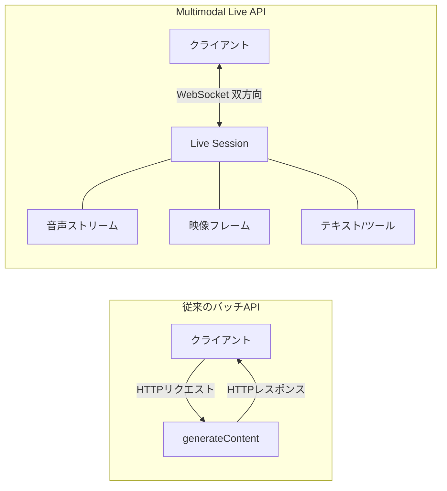
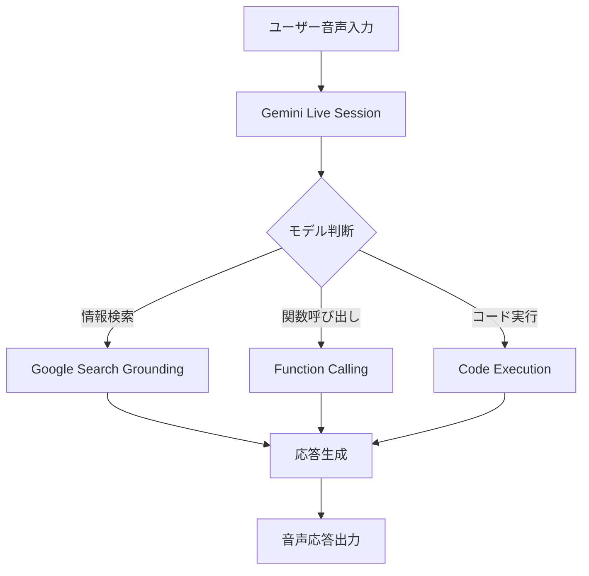

本記事は [Gemini 2.0: Level Up Your Apps with Real-Time Multimodal Interactions - Google Developers Blog](https://developers.googleblog.com/en/gemini-2-0-level-up-your-apps-with-real-time-multimodal-interactions/) の解説記事です。

## ブログ概要（Summary）

Googleは、Gemini 2.0世代のMultimodal Live APIを発表した。このAPIは、テキスト・音声・映像を双方向にリアルタイムストリーミングするステートフルなWebSocket接続を基盤としている。公式ブログの情報によると、ファーストトークンまでのレイテンシは600ミリ秒であり、「人間のインタラクション期待値に沿う」と説明されている。Voice Activity Detection（VAD）による自然な割り込み処理、Function Calling・コード実行・Google Search Groundingを含むマルチツール統合が1つのAPI呼び出し内で利用可能であると報告されている。

この記事は [Zenn記事: Gemini Live APIで構築するリアルタイム音声×映像対話アプリケーション実践ガイド](https://zenn.dev/0h_n0/articles/cff7c88b3641ce) の深掘りです。Zenn記事が実装パターンに焦点を当てているのに対し、本記事では公式発表ブログから読み取れる設計思想とアーキテクチャの技術的背景を詳述します。

## 情報源

- **種別**: 企業テックブログ（Google Developers Blog）
- **URL**: [https://developers.googleblog.com/en/gemini-2-0-level-up-your-apps-with-real-time-multimodal-interactions/](https://developers.googleblog.com/en/gemini-2-0-level-up-your-apps-with-real-time-multimodal-interactions/)
- **組織**: Google DeepMind / Google Developers
- **発表日**: 2024年（Gemini 2.0発表時）

## 技術的背景（Technical Background）

### 従来のLLM APIの限界

Gemini 2.0以前のLLM APIは、リクエスト/レスポンスモデルに基づくステートレスな設計であった。`generateContent`エンドポイントへのHTTPリクエストに対し、モデルが完全な応答を生成して返すという1ショットの処理フローである。

この設計では、以下の制約が存在していた。

- **バッチ処理前提**: 音声や映像を事前にファイルとしてアップロードし、処理結果をまとめて受け取る
- **ステートレス**: 各リクエストは独立しており、前回のやり取りを保持するにはクライアント側でコンテキストを管理する必要がある
- **一方向通信**: クライアントからサーバーへのリクエスト後、サーバーが応答を完了するまで新しい入力を送信できない

### ステートフルWebSocket接続への転換

Gemini 2.0 Multimodal Live APIは、これらの制約を根本的に解消するためにWebSocketベースのステートフル接続を採用した。公式ブログの説明によると、「低レイテンシのサーバー間通信を実現するWebSocketを活用したステートフルなAPI」と位置づけられている。



この転換は、単なるプロトコル変更ではなく、APIの設計思想自体の変革である。従来の「1リクエスト1応答」モデルから「持続的な対話セッション」モデルへの移行を意味する。

## 実装アーキテクチャ（Architecture）

### 600ミリ秒のファーストトークン

公式ブログでは、「ファーストトークンまで600ミリ秒」という具体的なレイテンシ目標が言及されている。この数値を技術的に分解すると、以下の処理が600ms以内に完了することを意味する。

1. クライアントからの音声データ受信（WebSocket経由）
2. 音声のバッファリングとエンコーディング
3. モデル推論（コンテキスト処理 + 最初のトークン生成）
4. 音声トークンのデコーディング
5. 最初の音声チャンクのクライアントへの送信

学術研究との比較では、Moshi（160ms）やLLaMA-Omni（サブ200ms）がより低いレイテンシを報告しているが、これらはセルフホストモデルの理論値である。Gemini Live APIの600msはクラウドAPI経由の実測値として実用的な水準であると評価できる。

### マルチモーダル入出力仕様

公式ブログの情報と、Zenn記事の実装例から整理した入出力仕様は以下の通りである。

**音声入力**:
- フォーマット: PCM 16kHz、16-bit、モノラル
- 送信方法: `send_realtime_input`（リアルタイムストリーム）
- バッファリング: なし（即時サーバー送信）

**音声出力**:
- フォーマット: PCM 24kHz、16-bit、モノラル
- 受信方法: `session.receive()`の非同期イテレータ
- ボイス: 5種類の音声スタイル

**映像入力**:
- フォーマット: JPEG
- 最大フレームレート: 1FPS
- 送信方法: `send_realtime_input`（video引数）

**テキスト入力**:
- 送信方法: `send_client_content`
- ターン管理: `turn_complete=True`で明示的にターン終了を通知

### VAD（Voice Activity Detection）の設計

公式ブログでは「自然なターンテイキングを実現する割り込みサポート」が強調されている。Zenn記事の実装例に基づくVAD設定パラメータは以下の通りである。

| パラメータ | 機能 | 推奨値（日本語） |
|-----------|------|---------------|
| `start_of_speech_sensitivity` | 発話開始検出感度 | MEDIUM |
| `end_of_speech_sensitivity` | 発話終了検出感度 | MEDIUM |
| `silence_duration_ms` | 発話終了判定の無音時間 | 500ms以上 |
| `prefix_padding_ms` | 発話開始前の音声保持 | 20ms |

**設計上の工夫**: VADをサーバーサイドで実行することで、クライアント実装の複雑さを軽減している。OpenAI Realtime APIも同様のサーバーサイドVADを採用しているが、Gemini Live APIはVAD感度の細粒度な制御パラメータを公開している点が特徴的である。

### マルチツール統合

公式ブログで「1つのAPI呼び出し内でFunction Calling、コード実行、Search Groundingを組み合わせられる」と記載されている点は、技術的に注目に値する。



この統合は、単一のセッション内で複数のツールをオーケストレーションできることを意味する。ユーザーが「今日のビットコインの価格を教えて、それを使って投資シミュレーションのコードを書いて」と発話した場合、以下のフローが1セッション内で実行される。

1. Google Searchでビットコイン価格を取得
2. Code Executionでシミュレーションコードを生成・実行
3. 結果を音声で報告

### セッション管理とコンテキスト圧縮

公式ブログでは直接言及されていないが、後続のGoogleドキュメントで追加されたセッション管理機能は以下の通りである。

- **セッション時間制限**: 音声のみ最大15分、音声+映像最大2分
- **コンテキスト圧縮**: `context_window_compression`でスライディングウィンドウ方式の自動圧縮
- **セッション再開**: `session_resumption`で切断からの復帰（24時間以内）

これらの機能は、Zenn記事で詳述されているセッション管理パターンの技術的基盤となっている。

## パフォーマンス最適化（Performance）

### トークンコストの累積

公式ブログでは明示されていないが、重要な運用特性として、Live APIのセッションでは各ターンでコンテキスト全体が再計算される。Zenn記事で解説されている通り、10ターンの対話では処理トークン量が累積的に増加する。

$$
T_{\text{total}} = \sum_{i=1}^{N} T_{\text{context}}(i) = \sum_{i=1}^{N} \sum_{j=1}^{i} t_j
$$

ここで、
- $T_{\text{total}}$: 総処理トークン数
- $N$: ターン数
- $T_{\text{context}}(i)$: $i$番目のターンで処理されるコンテキスト長
- $t_j$: $j$番目のターンで追加されたトークン数

各ターン1000トークン追加の場合、10ターンで $\frac{10 \times 11}{2} \times 1000 = 55,000$ トークンに達する。コンテキスト圧縮の設定が長時間セッションでのコスト管理に不可欠である。

### Native Audioモデルのコスト構造

公式ドキュメントの料金体系（2026年3月時点）:

| モデル | 入力（テキスト） | 入力（音声/映像） | 出力（テキスト） | 出力（音声） |
|-------|---------------|----------------|---------------|------------|
| gemini-2.5-flash | $0.15/Mトークン | $3.00/Mトークン | $0.60/Mトークン | - |
| gemini-2.5-flash-native-audio | $0.15/Mトークン | $3.00/Mトークン | $2.00/Mトークン | $12.00/Mトークン |

Native Audioモデルの音声出力トークン単価（$12.00/Mトークン）はテキスト出力（$2.00/Mトークン）の6倍であり、長時間の音声対話セッションではコストが急速に増加する可能性がある。

## Production Deployment Guide

### AWS実装パターン（コスト最適化重視）

Gemini Live APIをバックエンドとした音声対話アプリケーションのAWS構成を示す。Gemini Live APIはGoogleのクラウドAPIであるため、AWSインフラはプロキシ・セッション管理・WebRTC仲介として機能する。

**トラフィック量別の推奨構成**:

| 規模 | 同時セッション | 推奨構成 | 月額コスト概算 | 主要サービス |
|------|-------------|---------|--------------|------------|
| **Small** | ~10 | Serverless | $150-400 | Lambda + API Gateway + Gemini API |
| **Medium** | ~100 | Hybrid | $1,000-3,000 | ECS Fargate + Pipecat + Gemini API |
| **Large** | 500+ | Container | $5,000-15,000 | EKS + Pipecat + Daily.co + Gemini API |

**コスト試算の注意事項**:
- 2026年3月時点のAWS ap-northeast-1料金に基づく概算値
- Gemini API利用料は別途（Native Audio出力$12/Mトークン）
- Pipecat + Daily.co使用時はDaily.coの料金も別途発生
- 最新料金は [AWS料金計算ツール](https://calculator.aws/) で確認を推奨

### Terraformインフラコード（Medium構成: Pipecat）

```hcl
# ECS Fargate for Pipecat server
resource "aws_ecs_cluster" "pipecat" {
  name = "gemini-pipecat-cluster"

  setting {
    name  = "containerInsights"
    value = "enabled"
  }
}

resource "aws_ecs_task_definition" "pipecat" {
  family                   = "pipecat-gemini"
  network_mode             = "awsvpc"
  requires_compatibilities = ["FARGATE"]
  cpu                      = "1024"   # 1 vCPU
  memory                   = "2048"   # 2GB RAM

  container_definitions = jsonencode([{
    name  = "pipecat"
    image = "your-registry/pipecat-gemini:latest"
    portMappings = [{
      containerPort = 8080
      protocol      = "tcp"
    }]
    environment = [
      { name = "GEMINI_MODEL", value = "gemini-2.5-flash-native-audio" },
      { name = "DAILY_API_KEY_SECRET", value = aws_secretsmanager_secret.daily_key.arn }
    ]
    logConfiguration = {
      logDriver = "awslogs"
      options = {
        "awslogs-group"  = "/ecs/pipecat-gemini"
        "awslogs-region" = "ap-northeast-1"
      }
    }
  }])
}

resource "aws_ecs_service" "pipecat" {
  name            = "pipecat-gemini"
  cluster         = aws_ecs_cluster.pipecat.id
  task_definition = aws_ecs_task_definition.pipecat.arn
  desired_count   = 2  # 冗長化
  launch_type     = "FARGATE"

  network_configuration {
    subnets         = module.vpc.private_subnets
    security_groups = [aws_security_group.pipecat.id]
  }
}
```

### コスト最適化チェックリスト

- [ ] モデル選択: テキスト主体なら gemini-2.5-flash（音声出力不要時）
- [ ] コンテキスト圧縮: `context_window_compression`有効化でトークン削減
- [ ] セッション時間: 映像使用時は2分制限を考慮したUX設計
- [ ] 映像解像度: クライアント側で1280×720以下にリサイズ
- [ ] 映像フレームレート: 1FPS厳守（過剰送信はトークン浪費）
- [ ] Fargate: 最小タスク数で運用、Auto Scaling設定
- [ ] Secrets Manager: Gemini/Daily.co APIキーのセキュア管理
- [ ] AWS Budgets: 月額予算設定（Gemini API費用込みの上限管理）

## 運用での学び（Production Lessons）

### Pipecatフレームワークとの統合

公式ブログではPipecatとDaily.coとのパートナーシップが言及されている。Pipecat（Daily.co開発のオープンソースフレームワーク）はWebRTCメディアストリームとGemini Live APIの間を仲介するオーケストレーション層として機能する。

本番環境では、以下の理由でPipecat + WebRTCの構成が推奨される。

- **NAT越え**: WebRTCのICE/STUN/TURNメカニズムでファイアウォール越えを自動処理
- **メディア暗号化**: DTLS-SRTPによるEnd-to-End暗号化
- **帯域適応**: ネットワーク品質に応じた動的ビットレート調整
- **グローバル配信**: Daily.coのエッジインフラによる低レイテンシ配信

### Google AI Studioによるプロトタイピング

公式ブログでは、Google AI Studioの「Live」モードでブラウザ上からLive APIを体験できることが紹介されている。本番実装前のプロトタイピングとして、API呼び出しパターンの検証やVADパラメータの調整に有用である。

## 学術研究との関連（Academic Connection）

Gemini 2.0 Multimodal Live APIの技術基盤は、以下の学術研究の系譜に位置する。

- **AudioPaLM (Rubenstein et al., 2023)**: GoogleのPaLM-2ベース音声テキスト統合LLM。Gemini Live APIのS2S処理の先行研究
- **Moshi (Défossez et al., 2024)**: 全二重リアルタイム音声対話の先駆的研究。160msレイテンシの達成はGeminiのレイテンシ目標にも影響
- **VITA-1.5 (Fu et al., 2025)**: 映像+音声のリアルタイム対話。Gemini Live APIの映像入力機能と類似するアプローチ

## まとめと実践への示唆

Gemini 2.0 Multimodal Live APIは、従来のバッチAPIからステートフルWebSocket接続への根本的な転換を示すものである。600msファーストトークン、マルチモーダル双方向ストリーミング、マルチツール統合という3つの技術的柱は、リアルタイム対話アプリケーションの実装基盤として十分な成熟度を持つ。

Zenn記事で実装パターンを学んだ開発者は、本記事で解説した設計思想を理解することで、セッション管理やコスト最適化、WebRTC統合などの本番運用に必要な判断をより適切に行えるようになる。特に、コンテキスト圧縮のトークン設定やNative Audioモデルのコスト構造は、プロダクション環境での収支計画に直結する重要な設計パラメータである。

## 参考文献

- **Blog URL**: [https://developers.googleblog.com/en/gemini-2-0-level-up-your-apps-with-real-time-multimodal-interactions/](https://developers.googleblog.com/en/gemini-2-0-level-up-your-apps-with-real-time-multimodal-interactions/)
- **Live API Documentation**: [https://ai.google.dev/gemini-api/docs/live-api](https://ai.google.dev/gemini-api/docs/live-api)
- **Related Zenn article**: [https://zenn.dev/0h_n0/articles/cff7c88b3641ce](https://zenn.dev/0h_n0/articles/cff7c88b3641ce)
