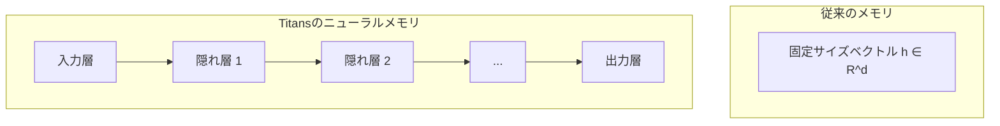
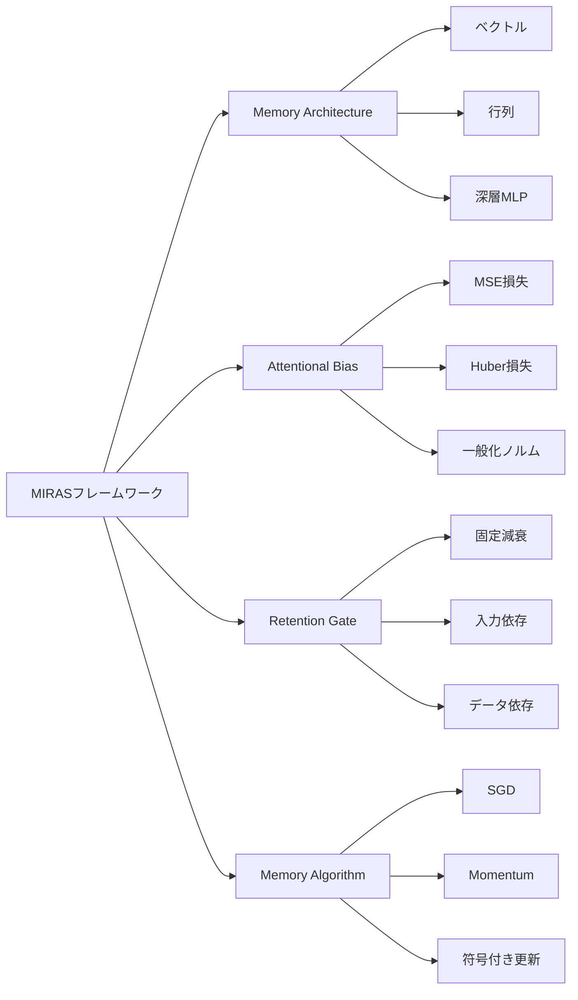

本記事は [Titans + MIRAS: Helping AI have long-term memory - Google Research Blog](https://research.google/blog/titans-miras-helping-ai-have-long-term-memory/) の解説記事です。

## ブログ概要（Summary）

Google Researchは、大規模言語モデル（LLM）に長期記憶を持たせるための新しいアーキテクチャ「Titans」と、それを一般化した統一フレームワーク「MIRAS」を公式ブログで発表した。Titansはsurprise（驚き）に基づく勾配ベースのメモリ更新機構を導入し、深層MLPをメモリモジュールとして活用することで、固定サイズのベクトルでは実現できなかった高い表現力を達成している。MIRASはこのアプローチを4つの設計軸で体系化し、BABILongベンチマークにおいてGPT-4を上回る性能を、より少ないパラメータ数で実現したとGoogle Researchは報告している。

この記事は [Zenn記事: LLMエージェントの長期記憶2026年最新動向 Mem0・A-Mem・Titansの実装と比較](https://zenn.dev/0h_n0/articles/8b6e6b07d36c5d) の深掘りです。Zenn記事が各手法の実装比較に焦点を当てているのに対し、本記事ではGoogle Research公式ブログの技術解説に基づき、Titans/MIRASの設計思想とメモリアーキテクチャの理論的背景を詳述します。

## 情報源

- **種別**: 企業テックブログ（Google Research Blog）
- **URL**: [https://research.google/blog/titans-miras-helping-ai-have-long-term-memory/](https://research.google/blog/titans-miras-helping-ai-have-long-term-memory/)
- **組織**: Google Research
- **発表日**: 2026年3月
- **関連論文**: Titans（arXiv: 2501.00663）, MIRAS（arXiv: 2504.13173）

## 技術的背景（Technical Background）

### Transformerの長期記憶問題

現在のLLMの主流アーキテクチャであるTransformerは、self-attentionメカニズムを通じて入力シーケンス全体を参照できる。しかし、この仕組みにはコンテキストウィンドウという根本的な制約がある。attentionの計算コストはシーケンス長$n$に対して$O(n^2)$で増加するため、実用上は有限のウィンドウサイズに制限される。

Google Researchのブログでは、この制約を人間の記憶との対比で説明している。人間は日常的な出来事（通勤ルート、食事の内容）の大部分を忘れる一方で、驚くような出来事（予想外のニュース、異常な体験）は長期記憶として保持する。この選択的記憶のメカニズムをニューラルネットワークに組み込むことが、Titansの基本的な設計思想である。

### 既存手法の限界

ブログでは、長期記憶問題に対する既存のアプローチとその限界についても言及している。

- **コンテキストウィンドウの拡張**: ウィンドウサイズを増やすアプローチは、$O(n^2)$のスケーリングにより計算コストが急激に増加する
- **固定サイズ状態ベクトル**: MambaやLinear Attentionで用いられる手法。計算効率は高いが、単一のベクトルに全履歴を圧縮するため情報の損失が避けられない
- **外部メモリ**: RAG（Retrieval-Augmented Generation）のようなアプローチは有効だが、モデル内部の学習とは独立した検索プロセスに依存する

Titansは、これらの限界を超えるために「ニューラルメモリ」という新しいカテゴリのアプローチを提案している。

## 実装アーキテクチャ（Architecture）

### Surprise機構：勾配に基づく記憶の重要度判定

Titansの中核的なイノベーションは、surprise（驚き）メカニズムにある。ブログでは、この概念を以下のように説明している。

入力トークン$x_t$に対して、メモリモジュール$M_\theta$が予測を行い、実際の値との誤差（損失）を計算する。この損失に対する勾配の大きさが「surprise」として定義される。

$$S_t = \left\| \nabla_\theta \mathcal{L}(M_\theta(k_t), v_t) \right\|$$

ここで、$k_t$はクエリキー、$v_t$は対応する値、$\mathcal{L}$は損失関数である。

この設計の直感的な意味は明快である。

- **勾配が大きい（高surprise）**: メモリが予測できなかった情報 → 重要な情報として強くメモリを更新
- **勾配が小さい（低surprise）**: メモリが既に予測できる情報 → 日常的な情報として弱い更新にとどめる

ブログでは、この仕組みが人間の記憶形成プロセスと類似していると述べている。毎日の通勤経路は記憶に残りにくいが、通勤途中で珍しい出来事に遭遇すれば鮮明に記憶される、というアナロジーである。

### ニューラルメモリモジュール：深層MLPによるメモリ表現

従来のsequence modelにおけるメモリ（隠れ状態）は、固定サイズのベクトルや行列として実装されていた。Titansはこれを深層MLP（Multi-Layer Perceptron）に拡張した。

Google Researchのブログでは、深層MLPをメモリとして採用した理由について以下のように述べている。

1. **高い表現力**: MLPの万能近似定理により、任意の連続関数を近似できる。固定サイズベクトルと比較して、トークン間の複雑な文脈関係を保持できる
2. **スケーラブルな容量**: 層の深さやパラメータ数を増やすことで、メモリ容量を柔軟に調整できる
3. **勾配ベースの更新との親和性**: MLPのパラメータ$\theta$を勾配降下法で更新できるため、surprise機構との統合が自然に行える

ブログによると、メモリの深さ（層数）を増やすほどperplexityが低下する実験結果が得られており、これは深層MLPがメモリモジュールとして有効に機能していることを示している。

### Momentum（運動量）とAdaptive Weight Decay（適応的重み減衰）

Titansのメモリ更新には、2つの重要な制御機構が導入されている。

**Momentum**は、過去のsurprise信号と現在のsurprise信号のバランスをとる仕組みである。

$$\tilde{S}_t = \eta \cdot S_t + (1 - \eta) \cdot \tilde{S}_{t-1}$$

ここで、$\eta$はmomentum係数である。瞬間的なノイズに反応せず、持続的に重要な情報を識別するために機能する。最適化アルゴリズムにおけるmomentumと同様の発想であり、surprise信号の時間的な平滑化を行っている。

**Adaptive Weight Decay**は、有限のメモリ容量を管理するための忘却ゲートとして機能する。

$$\theta_{t+1} = (1 - \alpha_t) \cdot \theta_t + \tilde{S}_t$$

ここで、$\alpha_t$は時刻$t$における適応的な減衰率である。ブログでは、この仕組みを「メモリの容量が有限であるため、古い情報を適切に忘れるメカニズムが必要」と説明している。$\alpha_t$は学習可能なパラメータであり、データに応じて忘却の速度を自動調整する。

## MIRASフレームワーク（MIRAS Framework）

### 4つの設計軸による統一理論

Titansの研究をさらに発展させたMIRAS（Memory, In-context, Retention, Algorithm, Surprise）は、既存のsequence modelを4つの設計軸で体系的に整理するフレームワークである。ブログでは、MIRASが「異なるsequence modelの設計選択を分解し、比較・改善を可能にする統一的な視点」を提供すると述べている。

| 設計軸 | 説明 | 設計選択の例 |
|--------|------|-------------|
| **Memory Architecture** | メモリの内部構造 | ベクトル、行列、深層MLP |
| **Attentional Bias** | メモリの学習目標 | MSE損失、Huber損失、一般化ノルム |
| **Retention Gate** | 忘却の制御方式 | 固定減衰、入力依存ゲート、データ依存ゲート |
| **Memory Algorithm** | パラメータ最適化手法 | SGD、momentum SGD、符号付き更新 |

この枠組みの意義は、従来個別に提案されてきたsequence model（Mamba-2、Gated DeltaNet、Linear Attentionなど）がMIRASの設計空間における特定の選択の組み合わせとして表現できる点にある。

### 3つのバリアント：YAAD、MONETA、MEMORA

MIRASフレームワークの設計空間を探索した結果、Google Researchは3つの新しいバリアントを提案している。

**YAAD**（Yet Another Associative memory with Decay）は、attentional biasにHuber損失を採用したバリアントである。ブログによると、Huber損失は外れ値に対してロバストであり、ノイズの多いシーケンスデータにおいて安定したメモリ更新を実現する。標準的なMSE損失と比較して、極端な勾配値を抑制することで学習の安定性を高めている。

**MONETA**は、一般化ノルム（generalized norms）を学習目標として使用するバリアントである。$L_p$ノルムのパラメータ$p$を学習可能にすることで、データの特性に応じた最適な損失関数を自動的に選択できる。ブログでは、この柔軟性がさまざまなドメインのデータに対する汎用性を向上させると述べている。

**MEMORA**は、確率マップ（probability map）による制約を導入したバリアントである。メモリ更新がバランスよく行われるよう、パラメータ空間での更新分布に制約を課す。これにより、特定のパラメータに更新が集中する問題（catastrophic forgetting の一因）を緩和している。

### 既存モデルのMIRASによる再解釈

MIRASフレームワークの重要な貢献として、既存のsequence modelを統一的に記述できる点がある。ブログでは以下のような対応関係が示されている。

- **Linear Attention**: Memory Architecture = 行列、Retention Gate = なし、Memory Algorithm = SGD
- **Mamba-2**: Memory Architecture = 行列、Retention Gate = 入力依存、Memory Algorithm = SGD
- **Gated DeltaNet**: Memory Architecture = 行列、Retention Gate = データ依存、Memory Algorithm = momentum SGD
- **Titans**: Memory Architecture = 深層MLP、Retention Gate = データ依存、Memory Algorithm = momentum SGD + adaptive decay

この体系化により、新しいモデルの設計において「どの軸を変更すれば性能が向上するか」を系統的に探索できるようになる。

## パフォーマンス評価（Performance）

### BABILongベンチマーク

ブログでは、BABILongベンチマークにおけるTitans/MIRASの性能を報告している。BABILongは、長いコンテキストの中から特定の情報を取り出すタスクであり、長期記憶能力を直接的に評価できる。

Google Researchによると、Titansは以下の性能を達成した。

- GPT-4（RAGあり）を上回る精度を、より少ないパラメータ数で実現
- 200万トークンを超えるコンテキスト長に対応
- 従来のstate spaceモデル（Mamba-2）やlinear attention（Gated DeltaNet）を一貫して上回る性能

ブログでは、パラメータ数が少ないにもかかわらずGPT-4を超える性能を実現できた理由として、surprise機構による効率的な情報選別を挙げている。全トークンを均等に処理するのではなく、重要な情報に対して選択的にメモリリソースを割り当てることで、少ないパラメータでも高い記憶保持能力を実現しているとのことである。

### 言語モデリング性能

C4およびWikiTextデータセットにおける言語モデリング（perplexity）の評価でも、Titans/MIRASの優位性が報告されている。

ブログによると、MIRASの3つのバリアント（YAAD、MONETA、MEMORA）はいずれも、同等のパラメータ数を持つMamba-2やGated DeltaNetと比較して低いperplexityを達成した。特に、メモリモジュールの深さ（MLPの層数）を増やすほどperplexityが低下する傾向が確認されており、ニューラルメモリの表現力がモデル性能に直接的に寄与していることを示している。

### コンテキストスケーリング

Google Researchのブログでは、Titansのコンテキスト長に対するスケーリング特性についても言及している。従来のTransformerが$O(n^2)$のスケーリングであるのに対し、Titansのメモリモジュールはシーケンス長に対して線形のコストで動作する。ブログによると、200万トークンを超えるコンテキストにおいても安定した性能を維持しており、超長文の文書理解や対話履歴の保持といったタスクに適用可能であると述べている。

## 運用での学び（Practical Insights）

### 現在の段階と制約

ブログで発表されたTitans/MIRASは研究段階のモデルであり、商用サービスとして提供されているものではない。Google Researchのブログは、アーキテクチャの設計思想と実験結果を公開したものであり、プロダクション環境での利用を想定した情報は含まれていない。

ブログの記述から読み取れる現時点での技術的課題としては、以下が挙げられる。

- **メモリモジュールの計算コスト**: 深層MLPをメモリとして使用するため、固定サイズベクトルと比較して各ステップでの更新コストが高い。メモリの深さとスループットのトレードオフは、実用化に向けた検討事項となる
- **ハイパーパラメータの設計空間**: MIRASの4つの設計軸はそれぞれ複数の選択肢を持つため、最適な組み合わせの探索コストが増加する
- **事前学習との統合**: 既存のTransformerベースの大規模事前学習済みモデルにTitans/MIRASのメモリモジュールを後から統合する方法については、ブログでは詳細な言及がない

### LLMアーキテクチャの今後への示唆

一方で、TitansとMIRASの研究がLLM設計に与える影響は大きいと考えられる。ブログが示した知見は、以下の方向性を示唆している。

- **メモリの「深さ」がスケーリング軸になりうる**: パラメータ数やコンテキスト長だけでなく、メモリモジュールの深さという新たなスケーリング次元が存在する
- **Surpriseベースの情報選別**: 全トークンを均等に処理する既存のattentionに対し、情報の重要度に応じた計算資源の配分は、効率性の観点から重要なアプローチとなる
- **統一フレームワークの価値**: MIRASのような体系化は、アーキテクチャ探索を系統的に行うための基盤として、今後の研究を加速する

## 学術研究との関連（Related Research）

TitansとMIRASは、以下の学術論文に基づいている。

- **Titans論文**（arXiv: [2501.00663](https://arxiv.org/abs/2501.00663)）: Ali Behrouz, Peilin Zhong, Vahab Mirrokniによる原著論文。ニューラルメモリの概念とsurprise機構の理論的基盤を提示
- **MIRAS論文**（arXiv: [2504.13173](https://arxiv.org/abs/2504.13173)）: Titansの設計を一般化し、4つの設計軸による統一フレームワークを提案。YAAD、MONETA、MEMORAの3バリアントを導入

ブログで比較対象として挙げられている関連モデルとしては、以下がある。

- **Mamba-2**: 選択的状態空間モデル（Selective State Space Model）のアーキテクチャ。入力依存のRetention Gateを持つが、メモリは行列表現に限定される
- **Gated DeltaNet**: Delta rule learningに基づくsequence model。データ依存のゲート機構を導入しているが、メモリアーキテクチャとしては行列を使用
- **Linear Attention**: attentionの計算を線形に近似する手法群。計算効率は高いが、メモリの表現力に制約がある

これらのモデルはいずれもMIRASフレームワークの設計空間内の特定の点として位置づけられ、Titans/MIRASの優位性は主にニューラルメモリ（深層MLP）の採用と、surprise機構による適応的な更新にあるとブログでは説明されている。

## まとめと実践への示唆

Google Researchが発表したTitansとMIRASは、LLMの長期記憶問題に対して、人間の記憶形成メカニズムに着想を得た新しいアプローチを提示している。surprise機構による選択的なメモリ更新と、深層MLPによる高表現力のメモリモジュールの組み合わせは、200万トークンを超えるコンテキストへのスケーリングを可能にした。MIRASフレームワークは、sequence model設計の統一的な視座を提供し、今後のアーキテクチャ探索を体系化する基盤となりうる。研究段階ではあるが、メモリの深さという新たなスケーリング軸の発見は、次世代LLMの設計に影響を与える可能性がある。

## 参考文献

1. [Titans + MIRAS: Helping AI have long-term memory - Google Research Blog](https://research.google/blog/titans-miras-helping-ai-have-long-term-memory/)
2. Ali Behrouz, Peilin Zhong, Vahab Mirrokni. "Titans: Learning to Memorize at Test Time." arXiv: [2501.00663](https://arxiv.org/abs/2501.00663), 2025.
3. "MIRAS: A Unified Framework for Memory-based Sequence Models." arXiv: [2504.13173](https://arxiv.org/abs/2504.13173), 2025.
4. [LLMエージェントの長期記憶2026年最新動向 Mem0・A-Mem・Titansの実装と比較 - Zenn](https://zenn.dev/0h_n0/articles/8b6e6b07d36c5d)
