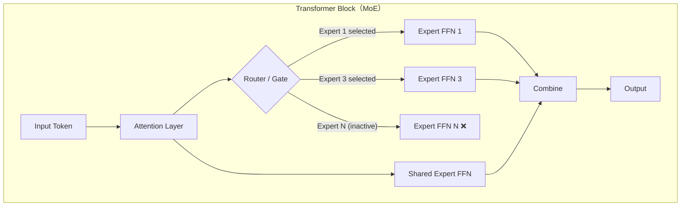
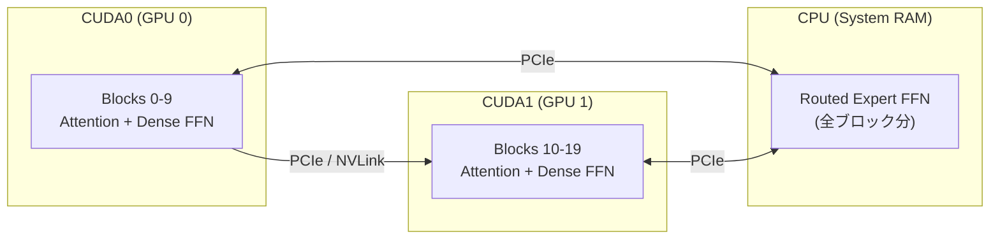
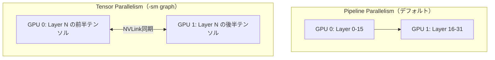

本記事は [Performant local mixture-of-experts CPU inference with GPU acceleration in llama.cpp](https://huggingface.co/blog/Doctor-Shotgun/llamacpp-moe-offload-guide) の解説記事です。

## ブログ概要（Summary）

Doctor ShotgunとGeechanが2026年1月30日にHugging Face Blogで公開した本ガイドは、Mixture-of-Experts（MoE）モデルをllama.cppで効率的に推論するための、CPU+GPUハイブリッドオフロード戦略を体系的にまとめたものである。MoEモデルの構造的特性――すなわち、トークンごとに全パラメータのうち一部のエキスパートのみが活性化する――を活用し、ルーテッドエキスパートをCPUに、それ以外のAttentionや共有エキスパートをGPUに配置するという戦略が核心となっている。著者らは、この手法によりDenseモデルのオフロードと比較してパフォーマンスへの影響が大幅に小さいと説明している。

さらに、本ガイドはllama.cppの派生であるik_llama.cppの追加最適化フラグ（`--merge-qkv`、`-gr`、`-smgs`等）についても詳細に解説しており、マルチGPU環境やNUMA対応CPUでの推論パフォーマンスを最大化する方法を提示している。

この記事は [Zenn記事: VRAM48GB+RAM32GBでQwen3.5-397Bを動かすSSDオフロード実践ガイド](https://zenn.dev/0h_n0/articles/c5854032acb8c8) の深掘りです。Zenn記事ではSSDオフロードによる大規模モデル実行に焦点を当てていますが、本記事ではその基盤技術であるllama.cppのMoEオフロード戦略を、原典ブログに基づいて詳細に解説します。

## 情報源

- **種別**: コミュニティテックブログ（Hugging Face Blog）
- **URL**: [https://huggingface.co/blog/Doctor-Shotgun/llamacpp-moe-offload-guide](https://huggingface.co/blog/Doctor-Shotgun/llamacpp-moe-offload-guide)
- **著者**: Doctor Shotgun, Geechan
- **公開日**: 2026年1月30日（最終更新: 2026年2月24日）
- **組織**: Hugging Face コミュニティ

## 技術的背景（Technical Background）

### MoEモデルのメモリ構造的特性

Mixture-of-Experts（MoE）アーキテクチャは、モデルの総パラメータ数に対して推論時の活性化パラメータ数を大幅に抑えることで、計算コストを削減しつつ大規模モデルの表現力を獲得する手法である。著者らは、MoEモデルの各Transformerブロック内のコンポーネントを以下の2カテゴリに分類している。

**常時活性化コンポーネント（Always Active）**:
- Attention層（Self-Attention + Cross-Attention）
- Dense FFN（Feed-Forward Network）
- 共有エキスパートFFN（Shared Expert FFN）

**条件付き活性化コンポーネント（Conditionally Active）**:
- ルーテッドエキスパートFFN（Routed Expert FFN）

具体例として、DeepSeek V3は総パラメータ671Bのうち、トークンごとの活性化パラメータは約37Bに留まる。この差分の大部分はルーテッドエキスパートが占めている。



### なぜMoEでCPUオフロードが有効なのか

Denseモデルにおけるレイヤー単位のCPU/GPUオフロードでは、オフロードされたレイヤーのすべての計算がCPU側で実行されるため、GPU→CPU→GPUのデータ転送ボトルネックが深刻になる。これに対し、MoEモデルではルーテッドエキスパートのみをCPUに配置する戦略が可能である。

著者らはこの違いについて、MoEのCPUオフロードがDenseモデルのオフロードと比較してパフォーマンスへの影響が小さい理由を以下のように説明している。

1. **トークンごとの活性化エキスパート数が少ない**: 例えばDeepSeek V3では256エキスパート中8つのみが選択される。CPU上で実行される計算量は全エキスパートの計算量の数%にすぎない
2. **Attention層はGPU上に残る**: KVキャッシュを含むAttention計算はGPUで高速に処理される
3. **共有エキスパートもGPU上に残る**: 全トークンで共有されるFFNはGPUの高帯域メモリから直接供給される

この結果、VRAM容量が限られた環境でも、MoEモデルの巨大なパラメータ空間をRAMに退避しつつ、実効的な推論速度を維持できる。これはまさに [Zenn記事](https://zenn.dev/0h_n0/articles/c5854032acb8c8) で扱われているVRAM+RAMのハイブリッド環境での大規模モデル運用シナリオと合致する。

## 実装アーキテクチャ（Architecture）

### -otフラグによるテンソル配置制御

llama.cppの`-ot`（`--override-tensor`）フラグは、モデル内の個々のテンソルまたはテンソルグループのデバイス配置を正規表現で制御する機能である。著者らは以下の3段階のオフロード戦略を推奨している。

**Step 1: 全レイヤーをGPUに配置**

```bash
-ngl 999
```

`-ngl`（`--n-gpu-layers`）に十分大きな値を指定し、まず全レイヤーをGPU上に配置する。

**Step 2: ルーテッドエキスパートをCPUに移動**

```bash
-ot "exps=CPU"
```

または新しいショートカットフラグ:

```bash
--cpu-moe
```

`exps`はルーテッドエキスパートのテンソル名パターンに一致し、これらをCPUメモリに配置する。`--cpu-moe`は2026年のllama.cppで導入されたショートカットで、内部的には同等の処理を行う。

**Step 3: レイヤーごとの細粒度制御（マルチGPU）**

```bash
-ot "blk\.([0-9]|[1-2][0-9]|30)\.=CUDA0,exps=CPU"
```

正規表現によりブロック0〜30をCUDA0に配置し、ルーテッドエキスパートのみをCPUに退避する。残りのブロックは別のGPUやCPUに自動配分される。

### マルチGPU構成

著者らは、複数GPUを使用する場合のレイヤー分散例を以下のように示している。

```bash
./llama-server -m model.gguf -c 32768 -ngl 999 -fa on -t 16 \
  -b 4096 -ub 4096 --no-mmap \
  -ot "blk\.([0-9])\.=CUDA0,blk\.(1[0-9])\.=CUDA1,exps=CPU"
```

この例では:
- ブロック0〜9: CUDA0（1枚目のGPU）
- ブロック10〜19: CUDA1（2枚目のGPU）
- ルーテッドエキスパート: CPU（システムRAM）



### バッチパラメータの最適化

著者らは、MoEモデルのCPU+GPUハイブリッド推論において、バッチサイズの設定が極めて重要であると説明している。

| パラメータ | デフォルト値 | MoE推奨値 | 説明 |
|-----------|------------|----------|------|
| `-b` (logical batch) | 2048 | 4096 | トークンをバッチにまとめる論理的単位 |
| `-ub` (physical batch) | 512 | 4096 | GPU/CPUに送信される物理的バッチサイズ |

デフォルト値（`-b 2048 -ub 512`）ではMoEモデルのCPU+GPU推論でスループットが著しく低下する。著者らは `-b 4096 -ub 4096` を推奨しており、これによりCPU側のエキスパート計算で十分なバッチサイズが確保され、AMX/AVX-512等のSIMD命令の効率が最大化される。

### 完全なコマンド例

著者らが推奨する典型的な構成は以下の通りである。

```bash
./llama-server -m model.gguf \
  -c 32768 \          # コンテキスト長
  -ngl 999 \          # 全レイヤーGPU割り当て
  -fa on \            # Flash Attention有効化
  -t 16 \             # CPUスレッド数
  -b 4096 \           # 論理バッチサイズ
  -ub 4096 \          # 物理バッチサイズ
  --no-mmap \         # メモリマップ無効化
  -ot "blk\.([0-9]|[1-2][0-9]|30)\.=CUDA0,exps=CPU"
```

各フラグの技術的意義:

- **`-fa on`**: Flash Attention（Tri Dao, 2022）を有効化し、Attention計算のメモリ使用量を$$O(N^2)$$から$$O(N)$$に削減する
- **`--no-mmap`**: メモリマッピングを無効にし、モデル全体をRAMにプリロードする。後述するように、mmap使用時のページフォルト遅延を回避するための設定である
- **`-t 16`**: CPUスレッド数。エキスパート計算の並列度を制御する。物理コア数に合わせることが推奨される

## Production Deployment Guide

MoEモデルのCPU+GPUハイブリッド推論を本番環境で運用する際の構成例を、著者らのガイドに基づいて3つのスケールで整理する。

### 構成パターン

| スケール | GPU | RAM | 対象モデル例 | 想定用途 |
|---------|-----|-----|------------|---------|
| Small | 1x RTX 4090 (24GB) | 64GB DDR5 | Mixtral 8x7B (Q4_K_M) | 個人開発・PoC |
| Medium | 2x RTX 4090 (48GB) | 128GB DDR5 | DeepSeek V3 (Q2_K) | チーム内API |
| Large | 2x A100 80GB (160GB) | 512GB DDR5 | DeepSeek V3 (Q4_K_M) | プロダクションAPI |

### Small構成の設定例

```bash
# Mixtral 8x7B Q4_K_M on single GPU + CPU
./llama-server -m mixtral-8x7b-instruct-v0.1.Q4_K_M.gguf \
  -c 32768 -ngl 999 -fa on -t 8 \
  -b 4096 -ub 4096 --no-mmap \
  -ot "exps=CPU" \
  --host 0.0.0.0 --port 8080
```

Mixtral 8x7Bは8エキスパート中2つが活性化する構造であり、エキスパート部分をCPUに退避することで24GBのVRAMにAttention + Shared FFNが収まる。

### Medium構成の設定例

```bash
# DeepSeek V3 Q2_K on dual GPU + CPU
./llama-server -m deepseek-v3.Q2_K.gguf \
  -c 16384 -ngl 999 -fa on -t 16 \
  -b 4096 -ub 4096 --no-mmap \
  -ot "blk\.([0-2][0-9])\.=CUDA0,blk\.([3-5][0-9])\.=CUDA1,exps=CPU" \
  --host 0.0.0.0 --port 8080
```

### 運用上のモニタリング項目

本番環境でMoEハイブリッド推論を運用する際に監視すべき主要メトリクスは以下の通りである。

| メトリクス | 閾値目安 | 監視方法 |
|-----------|---------|---------|
| GPU VRAM使用率 | < 95% | `nvidia-smi` |
| システムRAM使用率 | < 85% | `free -h`, Prometheus node_exporter |
| トークン/秒（生成速度） | モデル依存 | llama-server `/health` エンドポイント |
| PCIe帯域使用率 | ボトルネック検出用 | `nvidia-smi dmon` |
| CPUスレッド使用率 | 物理コア数以下 | `htop`, `mpstat` |

### コスト見積チェックリスト

本番運用のコスト最適化において確認すべき項目:

1. **GPU選定**: VRAM容量 vs コストのトレードオフ。MoEオフロードにより、より少ないVRAMのGPUで運用可能
2. **RAM容量**: エキスパートテンソルの総サイズ + OSオーバーヘッド + バッチバッファ分を確保
3. **PCIe帯域**: Gen4 x16以上を推奨。CPU-GPU間のデータ転送がボトルネックになりうる
4. **電力消費**: CPU側のエキスパート計算が追加電力を消費する点を考慮
5. **冷却**: CPUとGPU両方が高負荷となるため、十分な冷却設計が必要

## パフォーマンス最適化（Performance Optimization）

### ik_llama.cppの追加最適化

著者らはllama.cppの派生プロジェクトであるik_llama.cppが提供する追加最適化フラグについても詳細に解説している。これらはCPU+GPUハイブリッド推論のパフォーマンスをさらに向上させるためのものである。

#### --merge-qkv（Q/K/Vテンソル統合）

```bash
--merge-qkv
```

Attention層のQuery、Key、Valueの3つの重み行列を1つのテンソルに結合する。これにより:

- メモリアクセスパターンが改善される（3回のメモリ読み出しが1回に統合）
- GEMM（General Matrix Multiply）の効率が向上する（より大きな行列サイズでGPUのSM使用率が上がる）
- 実装上、ロード時にテンソルの再配置が行われるため、初回起動が若干遅くなる

#### -gr（Graph Reuse）

```bash
-gr
```

計算グラフの再利用を有効化する。Transformerの各レイヤーは構造が同一であるため、一度構築した計算グラフを再利用することで:

- グラフ構築のオーバーヘッドを排除
- メモリアロケーションの繰り返しを回避
- 特にデコードフェーズ（トークンを1つずつ生成する段階）で効果が大きい

#### -smgs（Split Mode Graph Scheduling）

```bash
-smgs
```

マルチGPU環境でのテンソル並列処理のスケジューリングを最適化する。デフォルトのレイヤー分割（pipeline parallelism）とは異なり、各レイヤー内でテンソルを複数GPUに分散する方式（tensor parallelism）のスケジューリングを改善する。

#### -sm graph（Tensor Parallelism）

```bash
-sm graph
```

テンソル並列モード。パイプライン並列（レイヤー単位で分割）ではなく、各レイヤーのテンソルを複数GPUに分散して計算する。NVLink接続された同一性能のGPU間で最大の効果を発揮する。



### NUMA最適化

マルチソケットCPU環境（サーバーグレードのデュアルXeon等）では、NUMA（Non-Uniform Memory Access）を考慮したメモリ配置が重要である。著者らは、ik_llama.cppがNUMA最適化をサポートしていることに言及している。

NUMAアーキテクチャでは、各CPUソケットが専用のメモリコントローラーとローカルメモリを持つ。リモートメモリ（他のソケットに接続されたメモリ）へのアクセスは、ローカルメモリの2〜3倍の遅延が発生する。MoEモデルのエキスパートテンソルをCPU上に配置する際、NUMAノードを意識したメモリ配置を行うことで、メモリアクセス遅延を最小化できる。

```bash
# NUMA最適化の例（ik_llama.cpp）
numactl --interleave=all ./ik-llama-server -m model.gguf \
  -ngl 999 -fa on -t 32 \
  -b 4096 -ub 4096 --no-mmap \
  -ot "exps=CPU" --merge-qkv -gr
```

### パフォーマンス比較

著者らはllama.cppにおけるMoEモデルの推論スループットが2025年から2026年にかけてNVIDIA GPU上で約35%向上したと報告している。この改善は以下の要因によるものと考えられる。

| 改善要因 | 技術的詳細 |
|---------|-----------|
| カーネル最適化 | MoE向けCUDAカーネルの専用実装 |
| バッチ処理改善 | エキスパート単位のバッチ集約 |
| メモリ管理 | エキスパートテンソルの効率的なメモリプール |
| 通信最適化 | CPU-GPU間転送のパイプライニング |

特筆すべきは、MoEモデルのCPUオフロードがDenseモデルのオフロードと比較してパフォーマンス低下が小さい点である。Denseモデルでは全レイヤーの全計算がオフロード先で実行されるのに対し、MoEモデルではアクティブなエキスパートの計算のみがCPU上で実行される。DeepSeek V3の場合、256エキスパート中8つのみが活性化するため、CPU側の計算負荷は理論上$$\frac{8}{256} = 3.125\%$$のエキスパート計算に限定される（ただしルーティング計算やデータ転送のオーバーヘッドは別途発生する）。

## 運用での学び（Operational Lessons）

### --no-mmap vs mmap

著者らは`--no-mmap`フラグの使用を明示的に推奨している。その技術的理由は以下の通りである。

**mmapの問題点（MoEモデル特有）**:

mmapを使用した場合、モデルファイルはページ単位でオンデマンドにメモリにロードされる。MoEモデルでは、トークンごとに異なるエキスパートが選択されるため、アクセスパターンがランダムに近くなる。これにより:

1. **ページフォルト**: 初回アクセス時にディスクI/Oが発生し、推論遅延のスパイクが生じる
2. **ページ置換**: RAMが不足する環境では、使用頻度の低いエキスパートのページがOSによってスワップアウトされ、再アクセス時に再度ディスクI/Oが発生する
3. **予測不能な遅延**: ユーザーから見ると、同じプロンプトでもレスポンス時間が大きくばらつく

**--no-mmapの効果**:

```bash
--no-mmap
```

モデル全体をプロセス起動時にRAMにプリロードする。初回起動は遅くなるが、推論中はすべてのテンソルがRAM上に確保済みであるため、ページフォルトが発生しない。MoEモデルのランダムなエキスパートアクセスパターンに対して安定したレイテンシを提供する。

### VRAM管理のベストプラクティス

著者らのガイドから抽出される、VRAM管理に関する実践的な知見を整理する。

**VRAM使用量の見積**:

MoEモデルの場合、VRAM必要量は以下の式で概算できる。

$$
\text{VRAM} \approx \text{Attention} + \text{Dense FFN} + \text{Shared Expert} + \text{KV Cache} + \text{Overhead}
$$

ルーテッドエキスパートはCPUに退避するため、VRAMの計算から除外できる。これがMoEオフロードの最大のメリットである。

**KVキャッシュの影響**:

コンテキスト長（`-c`）の設定はKVキャッシュサイズに直結する。Flash Attention（`-fa on`）はAttention計算のメモリ効率を改善するが、KVキャッシュ自体のサイズは削減しない。大きなコンテキスト長が必要ない場合は、`-c`を控えめに設定してVRAMを節約することが推奨される。

### よくある問題と対処法

| 問題 | 原因 | 対処法 |
|------|------|--------|
| CUDA OOM | エキスパートがGPUに残存 | `-ot "exps=CPU"` の指定漏れを確認 |
| 極端に遅い推論 | バッチサイズ不足 | `-b 4096 -ub 4096` に変更 |
| 起動時ハング | --no-mmapでの大量RAMロード | RAM容量の確認、swap無効化 |
| GPU使用率が低い | CPU側がボトルネック | `-t`（スレッド数）を物理コア数に合わせる |
| マルチGPUで速度出ない | 不均等なレイヤー分散 | `-ot`の正規表現でブロック割り当てを調整 |
| レイテンシのばらつき | mmapのページフォルト | `--no-mmap` を指定 |

### 正規表現パターンの実用例

`-ot`フラグの正規表現パターンは柔軟だが、誤った指定はサイレントにパフォーマンスを劣化させる。著者らのガイドに基づく実用的なパターン例を整理する。

```bash
# 全エキスパートをCPUに
-ot "exps=CPU"

# ブロック0-29をCUDA0、30-59をCUDA1、エキスパートはCPU
-ot "blk\.([0-2][0-9])\.=CUDA0,blk\.([3-5][0-9])\.=CUDA1,exps=CPU"

# 特定のブロック範囲のみGPU（残りはCPU）
-ot "blk\.([0-9]|[1-2][0-9]|30)\.=CUDA0,exps=CPU"
```

正規表現のデバッグには、`--verbose`フラグを使用してテンソルの配置先を確認することが有効である。

## 学術研究との関連（Academic Context）

### MoEオフロード研究の系譜

MoEモデルの効率的な推論に関する研究は、MoEアーキテクチャの実用化に伴い活発化している。本ブログで解説されているオフロード戦略は、以下の学術研究の流れに位置づけられる。

**Mixture-of-Expertsの基礎**:

MoEの概念はJacobs et al. (1991) に遡るが、現代のLLMにおけるMoEの実用化はSwitch Transformer（Fedus et al., 2022）およびGShard（Lepikhin et al., 2021）が先駆けである。これらの研究では、ルーティングメカニズムによるスパースな計算実行が、モデルスケーリングのコスト効率を劇的に改善することが示された。

**推論最適化研究**:

- **Mixtral of Experts**（Jiang et al., 2024）: Mixtral 8x7Bにおいて、8エキスパート中2つを活性化するルーティング戦略が実用的なスループットと品質のバランスを達成できることを示した
- **DeepSeek-MoE**（Dai et al., 2024）: Fine-grainedなエキスパート分割と共有エキスパートの組み合わせにより、ルーティングの効率を改善した
- **DeepSeek V3**（DeepSeek-AI, 2025）: 671B総パラメータ/37B活性化パラメータの構成で、MoEの大規模スケーリングの実用性を実証した

**オフロード手法の研究**:

- **FlexGen**（Sheng et al., 2023）: GPU、CPU、ディスクの3階層オフロードによる大規模LLM推論のスループット最適化
- **DeepSpeed-Inference**（Aminabadi et al., 2022）: ヘテロジニアスなハードウェア間でのモデル並列推論
- **PowerInfer**（Song et al., 2024）: ニューロン活性化パターンの局所性を利用したGPU-CPU推論。MoEのスパース性と類似した洞察に基づく

本ブログの貢献は、これらの研究成果を実践的なツール（llama.cpp / ik_llama.cpp）のコマンドラインフラグとして具体化し、エンドユーザーが容易に活用できる形で体系化した点にある。

### Zenn記事との技術的関連

[Zenn記事](https://zenn.dev/0h_n0/articles/c5854032acb8c8) で扱われているSSDオフロードは、本ブログのCPUオフロードをさらに拡張した概念と位置づけられる。メモリ階層は以下のようになる。

$$
\text{GPU VRAM} \xrightarrow{\text{PCIe}} \text{CPU RAM} \xrightarrow{\text{NVMe}} \text{SSD}
$$

本ブログがCPU RAMへのエキスパートオフロードに焦点を当てているのに対し、Zenn記事ではRAMにも収まらない場合のSSDオフロード（llama.cppの`--mmap`やカスタムキャッシュ戦略）について扱っている。両者を組み合わせることで、VRAM 48GB + RAM 32GB程度の環境でもQwen3.5-397Bクラスの巨大MoEモデルの推論が可能となる。

## まとめと実践への示唆

### 要点の整理

本ブログは、MoEモデルの構造的特性を活かしたCPU+GPUハイブリッド推論の実践ガイドとして、以下の知見を提供している。

1. **MoEモデルはオフロードと相性が良い**: ルーテッドエキスパートのみをCPUに退避することで、Denseモデルと比較して少ないパフォーマンス低下でVRAM使用量を大幅に削減できる
2. **-otフラグの正規表現制御**: llama.cppの`-ot`フラグにより、テンソル単位でのデバイス配置を柔軟に制御できる。マルチGPU環境では正規表現によるブロック分散が有効
3. **バッチパラメータの重要性**: `-b 4096 -ub 4096`の設定がMoEモデルのハイブリッド推論パフォーマンスに不可欠
4. **ik_llama.cppの追加最適化**: `--merge-qkv`、`-gr`、`-smgs`等のフラグにより、さらなるパフォーマンス向上が可能
5. **--no-mmapの推奨**: MoEモデルのランダムアクセスパターンに対し、mmapではなく事前ロードが安定した遅延を提供する

### 実践への示唆

限られたハードウェアリソースでMoEモデルを運用するための段階的アプローチ:

1. **まず-ot "exps=CPU"で試す**: 最もシンプルな設定で効果を確認
2. **バッチパラメータを調整**: デフォルトからの変更で大幅なスループット改善が見込める
3. **マルチGPU環境では正規表現で最適化**: VRAM容量に応じたブロック分散
4. **ik_llama.cppを検討**: さらなる最適化が必要な場合
5. **SSDオフロードとの併用**: RAMにも収まらない場合はZenn記事の手法と組み合わせる

MoEアーキテクチャの普及に伴い、本ブログで解説されているオフロード手法の重要性は今後さらに高まると考えられる。DeepSeek V3やQwen3.5-MoEに続き、より大規模なMoEモデルが登場する中で、限られたハードウェアでの効率的な推論手法の確立は、ローカルLLM運用の基盤技術としての位置づけをますます強めるだろう。

## 参考文献

1. Doctor Shotgun & Geechan. "Performant local mixture-of-experts CPU inference with GPU acceleration in llama.cpp." Hugging Face Blog, 2026. [https://huggingface.co/blog/Doctor-Shotgun/llamacpp-moe-offload-guide](https://huggingface.co/blog/Doctor-Shotgun/llamacpp-moe-offload-guide)
2. Fedus, W., Zoph, B., & Shazeer, N. "Switch Transformers: Scaling to Trillion Parameter Models with Simple and Efficient Sparsity." JMLR, 2022.
3. Jiang, A. Q., et al. "Mixtral of Experts." arXiv:2401.04088, 2024.
4. Dai, D., et al. "DeepSeekMoE: Towards Ultimate Expert Specialization in Mixture-of-Experts Language Models." arXiv:2401.06066, 2024.
5. DeepSeek-AI. "DeepSeek-V3 Technical Report." arXiv:2412.19437, 2024.
6. Sheng, Y., et al. "FlexGen: High-Throughput Generative Inference of Large Language Models with a Single GPU." ICML, 2023.
7. Aminabadi, R. Y., et al. "DeepSpeed-Inference: Enabling Efficient Inference of Transformer Models at Unprecedented Scale." SC, 2022.
8. Song, Y., et al. "PowerInfer: Fast Large Language Model Serving with a Consumer-grade GPU." arXiv:2312.12456, 2023.
9. Dao, T. "FlashAttention: Fast and Memory-Efficient Exact Attention with IO-Awareness." NeurIPS, 2022.
10. Lepikhin, D., et al. "GShard: Scaling Giant Models with Conditional Computation and Automatic Sharding." ICLR, 2021.
