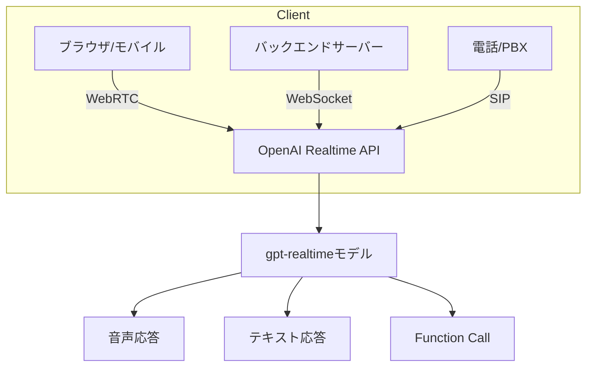

本記事は [OpenAI: Introducing gpt-realtime and Realtime API updates for production voice agents](https://openai.com/index/introducing-gpt-realtime/) および [Updates for developers building with voice](https://developers.openai.com/blog/updates-audio-models) の解説記事です。

## ブログ概要（Summary）

OpenAIは2024年10月にRealtime APIのパブリックベータを公開し、2025年8月にGA（一般提供）を達成した。Realtime APIは、WebRTC・WebSocket・SIPの3つのトランスポートプロトコルに対応し、音声入出力のリアルタイムストリーミング、Function Calling、Voice Activity Detection（VAD）を統合的にサポートする。2025年12月にはgpt-realtime-miniモデルの最新スナップショットがリリースされ、ツール呼び出し精度が12.9%向上したと公式ブログで報告されている。

この記事は [Zenn記事: Gemini Live APIで構築するリアルタイム音声×映像対話アプリケーション実践ガイド](https://zenn.dev/0h_n0/articles/cff7c88b3641ce) の深掘りです。Gemini Live APIの主要な競合サービスであるOpenAI Realtime APIの技術的詳細を比較の観点から解説します。

## 情報源

- **種別**: 企業テックブログ
- **URL**: [https://openai.com/index/introducing-gpt-realtime/](https://openai.com/index/introducing-gpt-realtime/)
- **組織**: OpenAI
- **発表日**: 2025年（GAは2025年8月28日）

## 技術的背景（Technical Background）

リアルタイム音声対話APIの需要は、LLMの普及とともに急速に拡大している。従来のアプローチでは、音声認識（Whisper等）→テキストLLM（GPT-4等）→音声合成（TTS）というカスケードパイプラインが一般的であった。このアプローチには、各ステップの遅延が累積すること、音声の感情やトーンがテキスト変換で失われることなどの課題があった。

OpenAIはこの課題に対し、Speech-to-Speech（S2S）アーキテクチャを採用したRealtime APIで対処した。音声入力を直接モデルに渡し、音声出力を直接生成する「ネイティブマルチモーダル」設計により、レイテンシ削減と音声の感情的ニュアンスの保持を実現している。

Gemini Live APIも同様にWebSocketベースのストリーミングアーキテクチャを採用しているが、両者の設計哲学と実装詳細には重要な違いがある。

## 実装アーキテクチャ（Architecture）

### トランスポートプロトコル

OpenAI Realtime APIはGemini Live API（WebSocketのみ）と異なり、3つのトランスポートプロトコルに対応している。

| プロトコル | 用途 | レイテンシ | 対象ユースケース |
|-----------|------|-----------|---------------|
| **WebRTC** | ブラウザ/モバイル直接接続 | 最低（P2P寄り） | エンドユーザー向けアプリ |
| **WebSocket** | サーバー間通信 | 低 | バックエンドサービス |
| **SIP** | 電話システム統合 | 中 | コールセンター、IVR |



SIP対応は電話システムとの統合を可能にする点で、Gemini Live API（WebSocket + WebRTC via Pipecat）にはない差別化要素である。

### モデルラインナップ

公式ブログの情報に基づくモデル一覧は以下の通りである。

| モデルID | リリース日 | 特徴 |
|---------|-----------|------|
| gpt-realtime-2025-08-28 | 2025-08-28 | GA版、フルスペック |
| gpt-realtime-mini-2025-10-06 | 2025-10-06 | 軽量版、コスト最適化 |
| gpt-realtime-mini-2025-12-15 | 2025-12-15 | 最新版、ツール呼び出し12.9%改善 |
| gpt-realtime-1.5-2026-02-23 | 2026-02-23 | 次世代版 |

Gemini Live APIのモデルラインナップ（gemini-2.5-flash-native-audio等）と比較すると、OpenAIはリアルタイム専用モデルを独立して提供している点が異なる。Geminiは汎用モデル（Flash/Pro）のLive API対応版として提供される。

### Speech-to-Speech（S2S）アーキテクチャ

公式ブログの説明によると、Realtime APIのS2Sモデルは以下の特徴を持つ。

- 音声入力を直接処理し、テキスト中間変換なしで音声応答を生成
- 感情やトーンを直接理解し、応答スタイルを適応
- ノイズフィルタリングをモデル内部で実行
- 割り込み処理をネイティブにサポート

この設計は、Gemini Live APIのNative Audioモデル（gemini-2.5-flash-native-audio）と概念的に同一である。両者とも、従来のカスケード型パイプラインを排し、音声を直接入出力するエンドツーエンド設計を採用している。

### Voice Activity Detection（VAD）

OpenAI Realtime APIのVAD設定に関する公式情報は限定的であるが、公式ブログでは「VADサポート」がオプショナル機能として言及されている。Gemini Live APIが提供するVADパラメータ（`start_of_speech_sensitivity`, `end_of_speech_sensitivity`, `silence_duration_ms`, `prefix_padding_ms`）と比較すると、OpenAIのVAD設定の粒度についての詳細は公式ドキュメントで確認する必要がある。

### Function Calling

gpt-realtime-mini-2025-12-15では、ツール呼び出し精度が前バージョンから12.9%向上したと公式ブログで報告されている。リアルタイム音声対話中にバックグラウンドでFunction Callingを実行する「background function calling」がサポートされている。

Gemini Live APIのFunction Callingとの比較:

| 機能 | OpenAI Realtime API | Gemini Live API |
|------|-------------------|-----------------|
| 同期呼び出し | サポート | サポート |
| 非同期呼び出し | background function calling | `NON_BLOCKING` behavior |
| Google Search統合 | 非対応 | Google Search Grounding |
| MCP対応 | サポート（2025年追加） | 非対応（2026年3月時点） |

MCP（Model Context Protocol）のサポートはOpenAIの差別化要素である。これにより、外部ツールの動的な追加・変更がプロトコルレベルで標準化される。

## パフォーマンス最適化（Performance）

### 音声品質の改善

2025年12月リリースのモデルスナップショットにおける改善点は以下の通りである（公式ブログの数値より）。

| 指標 | 改善幅 | 評価方法 |
|------|--------|---------|
| 音声認識幻覚 | 約90%削減 | Whisper v2比、ノイズ環境下 |
| 単語誤り率（WER） | 約35%低減 | Common Voice, FLEURS, MLS |
| 指示追従 | 18.6%向上 | Big Bench Audio |
| ツール呼び出し | 12.9%向上 | 内部評価ベンチマーク |

**注意**: 上記数値はOpenAIの公式ブログからの引用であり、独立した第三者による検証結果ではない。

### 言語別パフォーマンス

公式ブログによると、gpt-4o-mini-transcribe-2025-12-15は中国語、ヒンディー語、ベンガル語、日本語、インドネシア語、イタリア語で特に高い精度を示すと報告されている。日本語がリストに含まれている点は、日本語ベースの音声対話アプリケーション開発者にとって注目に値する。

## 運用での学び（Production Lessons）

### 実用事例: Tolan

OpenAIの公式ブログで紹介されているTolan社の事例は、Realtime APIの本番運用に関する示唆を含む。

- GPT-5.1と組み合わせた音声ファーストAIコンパニオンを構築
- 2025年2月のローンチ以降、20万以上のMAU（月間アクティブユーザー）を達成したと報告されている
- 低レイテンシ応答、リアルタイムコンテキスト再構成、メモリ駆動パーソナリティを組み合わせ

### WebRTCトランスポートの推奨

公式ブログでは、エンドユーザー向けアプリケーションにはWebRTCの使用が推奨されている。WebRTCはNAT越えやメディア暗号化をプロトコルレベルで処理するため、開発者がこれらの複雑さを意識する必要が少ない。

Gemini Live APIでは、WebRTC統合にPipecatフレームワーク + Daily.coの使用が推奨されているのに対し、OpenAIは自社SDKでWebRTCを直接サポートしている点が異なる。

## 学術研究との関連（Academic Connection）

OpenAI Realtime APIのS2Sアーキテクチャは、以下の学術研究と関連が深い。

- **Moshi (Défossez et al., 2024)**: 全二重音声対話の先駆的研究。160msレイテンシの達成はOpenAIの設計目標にも影響を与えた可能性がある
- **AudioPaLM (Rubenstein et al., 2023)**: Googleによる音声テキスト統合LLM。PaLM-2ベースでASRとTTSを統合
- **Mini-Omni (Xie et al., 2024)**: ストリーミング音声出力を実現するオープンソースLLM

## Gemini Live APIとの総合比較

Zenn記事の読者にとって、Gemini Live APIとOpenAI Realtime APIの選択指針をまとめる。

| 判断基準 | Gemini Live APIが適する場合 | OpenAI Realtime APIが適する場合 |
|---------|--------------------------|------------------------------|
| 映像入力が必要 | JPEG 1FPSをネイティブサポート | 2025年に画像入力を追加 |
| Google Searchとの統合 | Search Grounding対応 | 非対応 |
| 電話システム統合 | 非対応 | SIPプロトコル対応 |
| MCP対応 | 非対応（2026年3月時点） | サポート |
| WebRTC | Pipecat経由 | SDK直接サポート |
| コスト | Native Audio出力$12/Mトークン | 公式ブログでは「pricing remains the same」 |
| エコシステム | Google Cloud連携 | OpenAIエコシステム |

**選択指針**:
- 映像+音声のマルチモーダル対話: Gemini Live API
- 電話システム統合: OpenAI Realtime API
- 既存OpenAIインフラとの統合: OpenAI Realtime API
- Google Cloud中心のインフラ: Gemini Live API

## Production Deployment Guide

### AWS実装パターン（コスト最適化重視）

OpenAI Realtime APIを利用した音声エージェントをAWS上にデプロイする場合の構成を示す。OpenAI Realtime APIはクラウドAPIであるため、GPU管理は不要だが、WebRTC/WebSocketプロキシ、セッション管理、コスト監視のインフラが必要となる。

**トラフィック量別の推奨構成**:

| 規模 | 同時セッション | 推奨構成 | 月額コスト概算 | 内訳 |
|------|-------------|---------|--------------|------|
| **Small** | ~10 | Serverless | $200-500 | Lambda + API Gateway + OpenAI API |
| **Medium** | ~100 | Hybrid | $1,500-4,000 | ECS Fargate + ElastiCache + OpenAI API |
| **Large** | 500+ | Container | $8,000-20,000 | EKS + WebRTC Gateway + OpenAI API |

**コスト試算の注意事項**:
- 2026年3月時点のAWS ap-northeast-1（東京）リージョン料金に基づく概算値
- OpenAI Realtime APIの料金は別途発生（トークンベース課金）
- WebRTCを使用する場合、TURN/STUNサーバーの帯域コストが追加される
- 最新料金は [AWS料金計算ツール](https://calculator.aws/) で確認を推奨

**Small構成の詳細**（月額$200-500、OpenAI API費用除く）:
- **Lambda**: WebSocket接続管理、セッション制御（$30/月）
- **API Gateway**: WebSocket APIエンドポイント（$20/月）
- **DynamoDB**: セッション状態管理（$10/月）
- **OpenAI Realtime API**: トークン使用量に応じた従量課金（$100-400/月）
- **CloudWatch**: ログ・メトリクス（$10/月）

### Terraformインフラコード（Small構成）

```hcl
# WebSocket API Gateway for Realtime API proxy
resource "aws_apigatewayv2_api" "realtime_ws" {
  name                       = "openai-realtime-proxy"
  protocol_type              = "WEBSOCKET"
  route_selection_expression = "$request.body.action"
}

resource "aws_lambda_function" "ws_handler" {
  filename      = "ws_handler.zip"
  function_name = "openai-realtime-ws-handler"
  role          = aws_iam_role.lambda_role.arn
  handler       = "index.handler"
  runtime       = "nodejs20.x"
  timeout       = 900  # 15分（OpenAI WebSocketセッション上限）
  memory_size   = 256

  environment {
    variables = {
      OPENAI_API_KEY_SECRET = aws_secretsmanager_secret.openai_key.arn
      SESSION_TABLE         = aws_dynamodb_table.sessions.name
    }
  }
}

resource "aws_dynamodb_table" "sessions" {
  name         = "realtime-sessions"
  billing_mode = "PAY_PER_REQUEST"
  hash_key     = "session_id"

  attribute {
    name = "session_id"
    type = "S"
  }

  ttl {
    attribute_name = "expire_at"
    enabled        = true
  }
}

resource "aws_secretsmanager_secret" "openai_key" {
  name = "openai-realtime-api-key"
}
```

### 運用・監視設定

```python
import boto3

cloudwatch = boto3.client('cloudwatch')

# OpenAI APIコスト監視（トークン使用量ベース）
cloudwatch.put_metric_alarm(
    AlarmName='openai-realtime-token-spike',
    ComparisonOperator='GreaterThanThreshold',
    EvaluationPeriods=1,
    MetricName='OpenAITokenUsage',
    Namespace='Custom/RealtimeAPI',
    Period=3600,
    Statistic='Sum',
    Threshold=500000,  # 50万トークン/時間超過でアラート
    AlarmDescription='OpenAI Realtime APIトークン使用量異常'
)

# WebSocketセッション数監視
cloudwatch.put_metric_alarm(
    AlarmName='realtime-ws-sessions',
    ComparisonOperator='GreaterThanThreshold',
    EvaluationPeriods=1,
    MetricName='ActiveSessions',
    Namespace='Custom/RealtimeAPI',
    Period=60,
    Statistic='Maximum',
    Threshold=8,
    AlarmDescription='同時セッション数上限接近'
)
```

### コスト最適化チェックリスト

- [ ] モデル選択: gpt-realtime-mini（コスト最適化版）を優先使用
- [ ] セッション管理: アイドルセッションの自動切断（5分タイムアウト）
- [ ] トークン制限: max_tokens設定で過剰生成防止
- [ ] WebRTC vs WebSocket: エンドユーザー向けはWebRTC推奨（レイテンシ削減）
- [ ] Lambda: WebSocketセッション用にタイムアウト900秒設定
- [ ] DynamoDB: On-Demand課金（低トラフィック時に最適）
- [ ] Secrets Manager: APIキーのハードコード禁止
- [ ] AWS Budgets: 月額予算設定（OpenAI API費用込み）

## まとめと実践への示唆

OpenAI Realtime APIは、Gemini Live APIと並ぶリアルタイム音声対話の商用プラットフォームである。WebRTC・WebSocket・SIPの3トランスポート対応、S2Sアーキテクチャによる低レイテンシ応答、MCP対応など、本番環境に必要な機能を包括的に提供している。

Gemini Live APIとの主な差別化ポイントは、SIPによる電話統合、MCPプロトコルのサポート、WebRTCのSDK直接サポートである。一方、Gemini Live APIは映像入力のネイティブサポートとGoogle Search Groundingで優位性を持つ。両APIのアーキテクチャは概念的に類似（WebSocketベースのステートフル接続、S2Sモデル、VAD、Function Calling）しており、Zenn記事で解説されている実装パターンの多くは、OpenAI Realtime APIにも応用可能である。

## 参考文献

- **Blog URL**: [https://openai.com/index/introducing-gpt-realtime/](https://openai.com/index/introducing-gpt-realtime/)
- **Developer Blog**: [https://developers.openai.com/blog/updates-audio-models](https://developers.openai.com/blog/updates-audio-models)
- **Related Zenn article**: [https://zenn.dev/0h_n0/articles/cff7c88b3641ce](https://zenn.dev/0h_n0/articles/cff7c88b3641ce)
