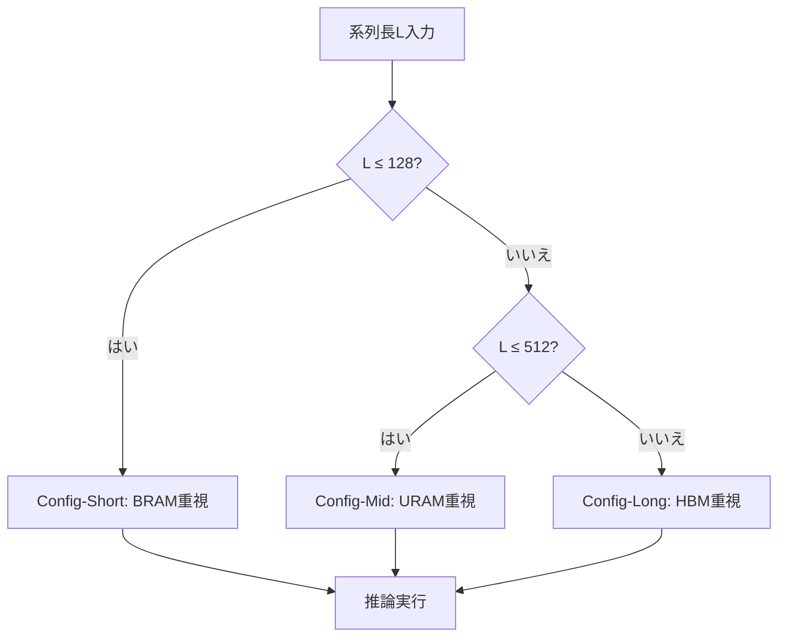

本記事は [FlightLLM: Efficient Large Language Model Inference with a Complete Mapping Flow on FPGAs](https://arxiv.org/abs/2401.03868) の解説記事です。

## 論文概要（Abstract）

FlightLLMは、FPGAの固有リソース（DSP48、異種メモリ階層）を最大限に活用し、LLM推論をFPGA上で効率的に実行するための完全なマッピングフローを提案した研究である。著者らはConfigurable Sparse DSP Chain、Always-on-chip Decodeスキーム、Length Adaptive Compilationの3つの技術を導入し、Xilinx Alveo U280 FPGA上でLLaMA2-7Bの推論において、NVIDIA V100S比6.0倍のエネルギー効率と1.8倍のコスト効率を達成したと報告している。さらに、Versal VHK158 FPGAではA100 GPUに対して1.2倍のスループットを実現した。

この記事は [Zenn記事: FPGAとLLM推論アクセラレータ2026年最前線 カスタムチップ開発の全体像](https://zenn.dev/0h_n0/articles/fda1b011be4252) の深掘りです。

## 情報源

- **arXiv ID**: 2401.03868
- **URL**: [https://arxiv.org/abs/2401.03868](https://arxiv.org/abs/2401.03868)
- **著者**: Shulin Zeng, Jun Liu, Guohao Dai, et al.（清華大学、17名）
- **発表年**: 2024（FPGA'24 採択）
- **分野**: cs.AR, cs.AI
- **会議**: ACM/SIGDA International Symposium on Field Programmable Gate Arrays (FPGA'24)

## 背景と動機（Background & Motivation）

LLM推論では、prefillフェーズが演算律速（compute-bound）、decodeフェーズがメモリ帯域律速（memory-bound）という異なる特性を持つ。GPUはprefillフェーズでは高い演算能力を発揮するが、decodeフェーズでは演算ユニットの利用率が低下し、エネルギー効率が悪化する。

著者らは、この問題に対してFPGAが持つ3つの利点に着目している。第一に、FPGAはカスタムデータフローを構築でき、decodeフェーズに特化した回路を構成可能である。第二に、DSP48やBRAM/URAMなどの異種リソースを柔軟に活用でき、スパース演算や混合精度演算に対応できる。第三に、GPUと比較して消費電力が低く、エッジ環境やデータセンターの省電力ニーズに適合する。

しかし、従来のFPGAベースのLLM推論では、スパーシティの活用が不十分であること、decodeフェーズでのメモリアクセスパターンが最適化されていないこと、コンパイル時間が実用的でないという課題が存在していた。FlightLLMはこれら3つの課題を同時に解決するマッピングフローを提案している。

## 主要な貢献（Key Contributions）

- **Configurable Sparse DSP Chain**: FPGAのDSP48リソースをチェーン接続し、構造化スパーシティ（N:M sparsity）と非構造化スパーシティの両方に対応する演算パイプラインを構成。スパーシティパターンに応じてDSPチェーンの接続を動的に切り替える
- **Always-on-chip Decode Scheme**: decodeフェーズにおいて、重みの一部をFPGAのオンチップメモリ（BRAM/URAM/分散RAM）に常駐させ、HBMアクセスを最小化する戦略。混合精度をサポートし、帯域幅利用率を64.8%まで向上
- **Length Adaptive Compilation**: 入力系列長に応じてFPGAのリソース配分とデータフローを最適化するコンパイル手法。従来のFPGAコンパイルで問題となっていた長いコンパイル時間を削減

## 技術的詳細（Technical Details）

### Configurable Sparse DSP Chain

FPGAのDSP48プリミティブは乗算・加算ユニットであり、FlightLLMではこれをチェーン接続して効率的なスパース行列演算を実現する。

N:Mスパーシティ（例: 2:4 sparsity）では、4要素中2要素が非ゼロである構造的パターンを仮定する。このパターンに対応するため、DSPチェーンは以下のように構成される。

$$
\mathbf{y} = \mathbf{W}_{\text{sparse}} \mathbf{x} = \sum_{j \in \mathcal{S}_i} w_{ij} x_j
$$

ここで、$\mathcal{S}_i$は行$i$の非ゼロ要素のインデックス集合、$w_{ij}$は重み、$x_j$は入力ベクトルの$j$番目の要素である。

```python
import torch
from dataclasses import dataclass


@dataclass
class SparseConfig:
    """FlightLLMのスパーシティ設定"""
    n: int  # 非ゼロ要素数
    m: int  # ブロックサイズ
    # 例: n=2, m=4 → 2:4 sparsity


def sparse_matmul_concept(
    weight: torch.Tensor,
    x: torch.Tensor,
    indices: torch.Tensor,
    config: SparseConfig,
) -> torch.Tensor:
    """FlightLLMのスパース行列積の概念的実装

    Args:
        weight: 非ゼロ重みテンソル (out_features, in_features * n/m)
        x: 入力テンソル (batch, in_features)
        indices: 非ゼロ要素のインデックス (out_features, in_features // m, n)
        config: スパーシティ設定

    Returns:
        出力テンソル (batch, out_features)
    """
    batch_size, in_features = x.shape
    out_features = weight.shape[0]
    n_blocks = in_features // config.m

    output = torch.zeros(batch_size, out_features)
    for b in range(n_blocks):
        # 各ブロックからN個の非ゼロ要素を選択
        block_indices = indices[:, b, :]  # (out_features, n)
        x_selected = x[:, block_indices]  # (batch, out_features, n)
        w_block = weight[:, b * config.n:(b + 1) * config.n]  # (out_features, n)
        output += (x_selected * w_block.unsqueeze(0)).sum(dim=-1)

    return output
```

DSPチェーンの各段では、非ゼロ要素のみを処理するため、2:4 sparsityの場合、演算量は密行列積の50%に削減される。論文Section 4.1によると、DSPチェーンの構成はコンパイル時に決定され、実行時のオーバーヘッドは生じない。

### Always-on-chip Decode Scheme

decodeフェーズでは、1トークン生成ごとにモデル全体の重みを読み出す必要がある。LLaMA2-7BのFP16重みは約14 GBであり、U280のHBM帯域幅（460 GB/s）では約30 msのメモリアクセス時間が発生する。

FlightLLMのAlways-on-chip Decodeスキームは、FPGAのメモリ階層を以下のように活用する。

| メモリ種別 | 容量 (U280) | 帯域幅 | 用途 |
|-----------|------------|--------|------|
| 分散RAM (LUT-RAM) | ~10 MB | ~TB/s級 | Attention重み（頻繁にアクセス） |
| BRAM | ~10 MB | 数百GB/s | FFN重みの一部 |
| URAM | ~34 MB | 数百GB/s | FFN重みの一部 |
| HBM | 32 GB | 460 GB/s | 残りの重み・KVキャッシュ |

量子化（W4A16: 重み4bit、アクティベーション16bit）を適用すると、LLaMA2-7Bの重みは約3.5 GBに圧縮される。このうち、Attentionレイヤの重みの一部をオンチップメモリに常駐させることで、decodeフェーズのHBMアクセスを削減する。

著者らの報告（論文Section 5.2）によると、U280上でのHBM帯域幅利用率は64.8%に達し、A100の44.6%を大きく上回っている。この差は、FPGAがカスタムメモリアクセスパターンを構築できることに起因する。

### Length Adaptive Compilation

従来のFPGA HLS（High-Level Synthesis）コンパイルでは、入力系列長ごとに回路を再合成する必要があり、数時間のコンパイル時間が発生していた。FlightLLMは、系列長パラメータを動的に切り替え可能な回路テンプレートを事前合成しておき、実行時に適切な設定を選択するアプローチを取る。



論文Section 4.3によると、コンパイル時間は従来手法の約1/10に短縮されたと報告されている。

## 実装のポイント（Implementation）

FlightLLMをFPGA上で実装する際の技術的な注意点を整理する。

**開発環境**: AMD/Xilinx Vitis HLS + Vivadoフローを使用。HLSでC/C++からRTLを生成し、Vivadoで配置配線を行う。Vitis AI 3.5以降のバージョンが推奨される。

**量子化の適用**: SmoothQuantベースのW4A16量子化が採用されている。重みは4bitに量子化し、アクティベーションは16bit（FP16）を維持する。量子化後のperplexityの劣化は、LLaMA2-7Bで約0.5ポイント以内に収まると報告されている（論文Table 3）。

**メモリ配置の最適化**: U280のHBM（32 GB、32チャネル）とオンチップメモリの配分は手動チューニングが必要である。著者らはAttentionレイヤのQKV投影重みを優先的にオンチップに配置している。

**制約事項**: U280のHBM容量（32 GB）により、13Bを超えるモデルでは重みの全量をオンチップ/HBMに収容できない。70B以上のモデルへの対応は論文でも今後の課題として明記されている。

## 実験結果（Results）

論文Section 6の実験結果を以下にまとめる。

| 構成 | モデル | スループット (tokens/s) | エネルギー効率比 | コスト効率比 |
|------|--------|----------------------|----------------|------------|
| FlightLLM (U280) | LLaMA2-7B | - | V100S比 6.0倍 | V100S比 1.8倍 |
| FlightLLM (VHK158) | LLaMA2-7B | 92.5 | A100比 2.9倍 | - |
| A100 (gpt-fast) | LLaMA2-7B | 196.8 | 1.0倍（基準） | - |
| A100 (未最適化) | LLaMA2-7B | ~77 | - | - |

**エネルギー効率の分析**: VHK158の消費電力は約75 Wと推定され、A100の300 W（推論時TDP）と比較して約1/4である。スループットはA100（gpt-fast）の約47%だが、ワットあたりのスループットでは2.9倍を達成している（論文Section 6.2.6）。

**帯域幅利用率**: FlightLLM（VHK158）のHBM帯域幅利用率は64.8%であり、A100の44.6%を上回る。これはカスタムメモリアクセスパターンとAlways-on-chip Decodeスキームの効果である（論文Table 5）。

**スパーシティの効果**: 2:4 sparsityの適用により、密行列積と比較して約1.8倍のスループット向上が得られている（論文Figure 10）。ただし、スパーシティの効果はモデルの実際のスパース構造に依存し、すべてのモデルで同等の効果が得られるわけではない。

## 実運用への応用（Practical Applications）

FlightLLMの技術は、以下の実運用シナリオで特に有効である。

**エッジ推論**: FPGAの低消費電力特性を活かし、データセンター外での推論サービスに適用できる。通信基地局やIoTゲートウェイでの7Bクラスモデルの推論が想定される。Versal VHK158の75 W級消費電力は、エッジ環境の電力制約（通常100-200 W）に収まる。

**バッチサイズ1の低レイテンシ推論**: decodeフェーズのメモリ帯域最適化が活きるのは、バッチサイズが小さい場合である。対話型AIアシスタントのように、ユーザーごとに独立した推論を行うワークロードに適している。

**コスト制約のある環境**: U280 FPGA（約15,000 USD）はA100 GPU（約30,000 USD）の半額程度であり、エネルギー効率の向上と合わせてTCOの削減が見込まれる。ただし、FPGA開発に必要なHLS/RTLスキルの人件費を考慮する必要がある。

**制約**: バッチサイズ64以上の高スループット推論サービスでは、GPUの演算能力が優位になるため、FlightLLMの適用は推奨されない。

## Production Deployment Guide

### AWS実装パターン（コスト最適化重視）

FPGAベースのLLM推論をAWS上で運用する場合の構成を示す。FlightLLMの技術思想を活かしつつ、AWSのFPGAインスタンスとBedrockの組み合わせでデプロイする。

**トラフィック量別の推奨構成**:

| 規模 | 月間リクエスト | 推奨構成 | 月額コスト | 主要サービス |
|------|--------------|---------|-----------|------------|
| **Small** | ~3,000 (100/日) | Serverless | $50-150 | Lambda + Bedrock + DynamoDB |
| **Medium** | ~30,000 (1,000/日) | FPGA Hybrid | $800-2,000 | F1インスタンス + Lambda + ElastiCache |
| **Large** | 300,000+ (10,000/日) | FPGA Cluster | $3,000-8,000 | F1 x4 + ALB + ElastiCache + S3 |

**Small構成の詳細** (月額$50-150):
- **Lambda**: 1GB RAM, 30秒タイムアウト ($20/月)
- **Bedrock**: Claude 3.5 Haiku, Prompt Caching有効 ($80/月)
- **DynamoDB**: On-Demand ($10/月)
- **CloudWatch**: 基本監視 ($5/月)

**Medium構成の詳細** (月額$800-2,000):
- **EC2 f1.2xlarge**: Xilinx UltraScale+ FPGA搭載 ($1,200/月 On-Demand)
- **Lambda**: イベント処理 ($50/月)
- **ElastiCache Redis**: cache.t3.micro ($15/月)
- **ALB**: ($20/月)

**Large構成の詳細** (月額$3,000-8,000):
- **EC2 f1.4xlarge x2-4**: FPGA 2-4枚構成 ($2,400-4,800/月 On-Demand)
- **Spot活用**: f1インスタンスのSpot価格で最大60%削減
- **ElastiCache**: プロンプトキャッシュ ($50/月)
- **S3**: モデルアーティファクト保管 ($5/月)

**コスト削減テクニック**:
- Spot Instancesの活用でf1インスタンスのコストを最大60%削減
- Reserved Instances（1年コミット）で最大40%削減
- Bedrock Batch API使用で50%削減（非リアルタイム処理）
- Lambda Graviton2ランタイムで最大20%のコスト削減

**コスト試算の注意事項**:
- 上記は2026年3月時点のAWS ap-northeast-1（東京）リージョン料金に基づく概算値です
- f1インスタンスのFPGAにはFlightLLMのビットストリームをロードする必要があり、AMI作成のセットアップコストが別途発生します
- 最新料金は [AWS料金計算ツール](https://calculator.aws/) で確認してください

### Terraformインフラコード

**Small構成 (Serverless): Lambda + Bedrock + DynamoDB**

```hcl
# --- VPC基盤 ---
module "vpc" {
  source  = "terraform-aws-modules/vpc/aws"
  version = "~> 5.0"

  name = "fpga-llm-vpc"
  cidr = "10.0.0.0/16"
  azs  = ["ap-northeast-1a", "ap-northeast-1c"]
  private_subnets = ["10.0.1.0/24", "10.0.2.0/24"]

  enable_nat_gateway   = false
  enable_dns_hostnames = true
}

# --- IAMロール（最小権限） ---
resource "aws_iam_role" "lambda_bedrock" {
  name = "fpga-llm-lambda-role"

  assume_role_policy = jsonencode({
    Version = "2012-10-17"
    Statement = [{
      Action = "sts:AssumeRole"
      Effect = "Allow"
      Principal = { Service = "lambda.amazonaws.com" }
    }]
  })
}

resource "aws_iam_role_policy" "bedrock_invoke" {
  role = aws_iam_role.lambda_bedrock.id
  policy = jsonencode({
    Version = "2012-10-17"
    Statement = [{
      Effect   = "Allow"
      Action   = ["bedrock:InvokeModel", "bedrock:InvokeModelWithResponseStream"]
      Resource = "arn:aws:bedrock:ap-northeast-1::foundation-model/anthropic.claude-3-5-haiku*"
    }]
  })
}

# --- Lambda関数 ---
resource "aws_lambda_function" "llm_handler" {
  filename      = "lambda.zip"
  function_name = "fpga-llm-handler"
  role          = aws_iam_role.lambda_bedrock.arn
  handler       = "index.handler"
  runtime       = "python3.12"
  timeout       = 60
  memory_size   = 1024

  environment {
    variables = {
      BEDROCK_MODEL_ID    = "anthropic.claude-3-5-haiku-20241022-v1:0"
      DYNAMODB_TABLE      = aws_dynamodb_table.cache.name
      ENABLE_PROMPT_CACHE = "true"
    }
  }
}

# --- DynamoDB ---
resource "aws_dynamodb_table" "cache" {
  name         = "fpga-llm-cache"
  billing_mode = "PAY_PER_REQUEST"
  hash_key     = "prompt_hash"

  attribute {
    name = "prompt_hash"
    type = "S"
  }

  ttl {
    attribute_name = "expire_at"
    enabled        = true
  }
}
```

**Large構成 (FPGA Cluster): F1 + ALB**

```hcl
# --- EC2 F1インスタンス（FPGA搭載） ---
resource "aws_instance" "fpga_inference" {
  count         = 2
  ami           = "ami-xxxxxxxxx"  # FPGA AMI with FlightLLM bitstream
  instance_type = "f1.4xlarge"     # 2x Xilinx UltraScale+ FPGA
  subnet_id     = module.vpc.private_subnets[count.index % 2]

  iam_instance_profile = aws_iam_instance_profile.fpga.name

  root_block_device {
    volume_type = "gp3"
    volume_size = 100
    encrypted   = true
  }

  tags = {
    Name = "fpga-llm-inference-${count.index}"
    Role = "inference"
  }
}

# --- ALB ---
resource "aws_lb" "fpga_lb" {
  name               = "fpga-llm-lb"
  internal           = true
  load_balancer_type = "application"
  subnets            = module.vpc.private_subnets
}

# --- Cost Explorer予算アラート ---
resource "aws_budgets_budget" "fpga_monthly" {
  name         = "fpga-llm-monthly"
  budget_type  = "COST"
  limit_amount = "8000"
  limit_unit   = "USD"
  time_unit    = "MONTHLY"

  notification {
    comparison_operator        = "GREATER_THAN"
    threshold                  = 80
    threshold_type             = "PERCENTAGE"
    notification_type          = "ACTUAL"
    subscriber_email_addresses = ["ops@example.com"]
  }
}
```

### セキュリティベストプラクティス

- **ネットワーク**: F1インスタンスはプライベートサブネットに配置し、ALB経由でのみアクセス可能にする
- **IAM**: FPGA AMIのビットストリームロードに必要な最小権限のみ付与
- **暗号化**: EBSボリューム・S3バケットはKMS暗号化を有効化
- **監査**: CloudTrail全リージョン有効化、Config変更追跡

### 運用・監視設定

**CloudWatch Logs Insights クエリ**:

```sql
-- FPGA推論レイテンシ分析
fields @timestamp, inference_latency_ms, model_name, batch_size
| stats pct(inference_latency_ms, 95) as p95,
        pct(inference_latency_ms, 99) as p99
  by bin(5m)
| filter model_name = "llama2-7b"
```

**CloudWatch アラーム設定**:

```python
import boto3

cloudwatch = boto3.client('cloudwatch')

# FPGA推論レイテンシアラート
cloudwatch.put_metric_alarm(
    AlarmName='fpga-inference-latency-spike',
    ComparisonOperator='GreaterThanThreshold',
    EvaluationPeriods=2,
    MetricName='InferenceLatency',
    Namespace='Custom/FPGAInference',
    Period=300,
    Statistic='Average',
    Threshold=500,  # 500ms超過でアラート
    AlarmDescription='FPGA推論レイテンシ異常'
)
```

### コスト最適化チェックリスト

**アーキテクチャ選択**:
- [ ] ~100 req/日 → Lambda + Bedrock (Serverless) - $50-150/月
- [ ] ~1000 req/日 → F1インスタンス + Lambda (Hybrid) - $800-2,000/月
- [ ] 10000+ req/日 → F1クラスタ + ALB (FPGA Cluster) - $3,000-8,000/月

**リソース最適化**:
- [ ] F1 Spot Instances活用で最大60%削減
- [ ] Reserved Instances: 1年コミットで40%削減
- [ ] FPGA AMIを事前作成しインスタンス起動時間を短縮
- [ ] Lambda: メモリサイズ最適化（CloudWatch Insights分析）

**LLMコスト削減**:
- [ ] Bedrock Batch API使用で50%削減（非リアルタイム処理）
- [ ] Prompt Caching有効化で30-90%削減
- [ ] FlightLLMの量子化（W4A16）でモデルサイズ75%削減
- [ ] バッチサイズ最適化（1-8の範囲でFPGA効率最大化）

**監視・アラート**:
- [ ] AWS Budgets設定（80%で警告、100%でアラート）
- [ ] CloudWatch アラーム: FPGA推論レイテンシ監視
- [ ] Cost Anomaly Detection有効化
- [ ] 日次コストレポートSNS通知

**リソース管理**:
- [ ] 未使用F1インスタンスの停止（夜間スケジュール）
- [ ] タグ戦略: 環境別（dev/staging/prod）
- [ ] S3ライフサイクルポリシー: 古いモデルアーティファクト自動削除
- [ ] FPGA AMIバージョン管理

## 関連研究（Related Work）

- **DFX (FPGA'22)**: FPGAでのTransformer推論アクセラレータの初期研究。FlightLLMはDFXのデータフロー設計を発展させ、LLM固有の最適化（スパーシティ、KVキャッシュ管理）を追加している
- **LUT-LLM (arXiv: 2511.06174)**: FlightLLMがDSPベースの演算に依存するのに対し、LUT-LLMはルックアップテーブルで演算を置き換えるアプローチを取る。両者は相補的な技術であり、将来的な統合の可能性がある
- **EdgeLLM (arXiv: 2411.14757)**: CPU-FPGAヘテロジニアス構成でエッジ推論を実現する研究。FlightLLMがFPGA単体での最適化に注力するのに対し、EdgeLLMはCPUとの協調による柔軟性を重視している

## まとめと今後の展望

FlightLLMは、FPGAの固有リソースを最大限に活用するマッピングフローにより、A100 GPU比2.9倍のエネルギー効率を実現した。Configurable Sparse DSP Chain、Always-on-chip Decode、Length Adaptive Compilationの3技術は、FPGA上のLLM推論における体系的なアプローチを確立している。

実務面では、7B-13Bクラスのモデルの省電力推論で特に有効であり、エッジ推論やバッチサイズ1の対話型サービスに適している。一方、70B以上の大規模モデルやバッチサイズ64以上の高スループット推論では、GPU（H100/B200）が依然として有力な選択肢である。

今後の研究方向として、著者らはより大規模なモデルへの対応（マルチFPGA構成）と、HBM4搭載次世代FPGAでの性能向上を示唆している。

## 参考文献

- **arXiv**: [https://arxiv.org/abs/2401.03868](https://arxiv.org/abs/2401.03868)
- **ACM DL**: [https://dl.acm.org/doi/10.1145/3626202.3637562](https://dl.acm.org/doi/10.1145/3626202.3637562)
- **Related Zenn article**: [https://zenn.dev/0h_n0/articles/fda1b011be4252](https://zenn.dev/0h_n0/articles/fda1b011be4252)
